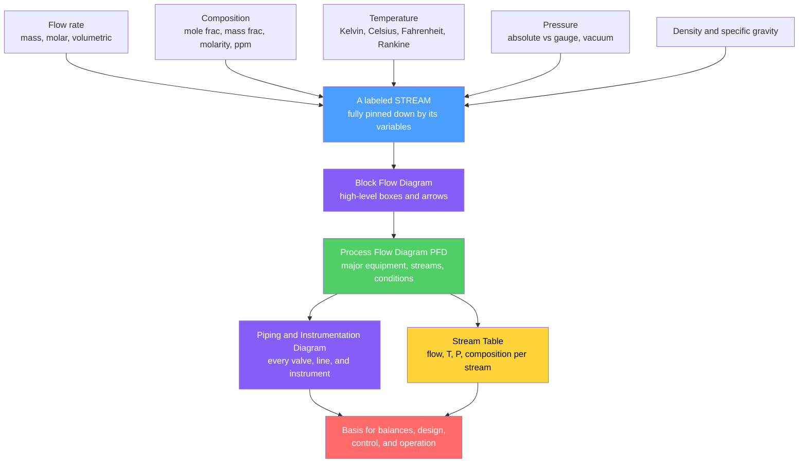

# ⚗️ Process Variables and Flowsheets

> [!abstract] TL;DR
> Before you can balance, design, or operate any chemical process you need two things: a **shared language** to describe it and a **standard map** to draw it. The language is the set of **process variables** — **flow rate** (mass, molar, or volumetric), **composition** (mole fraction, mass fraction, molarity, ppm), **temperature**, **pressure** (absolute vs gauge), and **density / specific gravity** — the handful of numbers that pin down exactly what a stream *is* and *is doing*. The map is the **flowsheet**, drawn at three levels of increasing detail: the **Block Flow Diagram** (BFD, high-level boxes), the **Process Flow Diagram** (PFD, major equipment + a **stream table** of flows, T, P, and composition), and the **Piping and Instrumentation Diagram** (P and ID, every valve, line, and instrument). Standard equipment **symbols** and **stream numbering** let an engineer anywhere read a plant like sheet music. Master the variables and the flowsheet and a bewildering factory becomes a readable network of boxes and arrows you can analyze.

## Intuition

**Analogy:** Imagine walking into a sprawling factory for the first time — thousands of pipes, dozens of tanks, pumps humming, a wall of gauges. It looks like chaos. Now imagine you had two things: a **dictionary** and a **subway map**. The dictionary tells you that every pipe carries a *stream* and that any stream is completely described by just five or six numbers — how much is flowing, how hot, at what pressure, what it is made of, and how dense it is. The subway map is a single sheet where every pump, reactor, and column is a standard symbol and every pipe is a numbered, labeled line. Suddenly the chaos resolves into a **readable network of boxes and arrows**. That dictionary is the set of **process variables**; that map is the **flowsheet**. Together they are the reason an engineer in Houston can open a drawing made in Rotterdam and understand the plant in minutes.

The insight is that a chemical plant, however large, is just **units connected by streams**, and a **stream is fully pinned down by its variables**. Learn to read the numbers and the map, and every balance, simulation, control loop, and design calculation in the rest of chemical engineering has a solid place to start.

---

## How It Works

### Core idea

A process is a set of **units** (pumps, reactors, columns, exchangers, vessels) connected by **streams** (the pipes carrying material). Each stream is characterized by its **variables**; the plant as a whole is captured by a **flowsheet** that grows in detail from a block sketch, to a working process drawing with a stream table, to a fully instrumented construction document. Everything downstream — mass and energy balances, equipment sizing, process simulation, control, safety review — is built on top of correctly defined variables and a clear flowsheet.

1. **Describe the stream with variables.** *Flow rate* answers "how much per unit time" (as mass $\dot m$, moles $\dot n$, or volume $\dot V$, freely interconverted through density and molar mass). *Composition* answers "made of what" (mole fraction, mass fraction, molarity, ppm). *Temperature* and *pressure* fix the thermodynamic state; *density / specific gravity* ties mass to volume. Five or six numbers per stream and you are done.
2. **Keep units consistent.** Every variable carries units, and mixing SI with US-customary (or absolute with gauge pressure) is the classic source of catastrophic error. Dimensional consistency is checked on *every* line.
3. **Draw the flowsheet at the right level.** A **Block Flow Diagram** shows the concept as labeled boxes. A **Process Flow Diagram (PFD)** adds the major equipment, the main streams with their conditions, and a **stream table**. A **Piping and Instrumentation Diagram (P and ID)** shows *every* valve, line, and instrument for construction and operation.
4. **Use the flowsheet as the basis.** The PFD's stream table is literally the input to every material and energy balance and to process simulators; the P and ID is the master document a plant is built, controlled, and operated from.

### Flow / Architecture



---

## Key Concepts

### Secondary Level

- **A stream is just "stuff flowing in a pipe," and a few numbers describe it fully.** How *fast* it flows, how *hot* it is, at what *pressure*, and *what it is made of*. These are the **process variables**.
- **Flow rate** can be given three ways that mean the same physical stream: by **weight** (kg per hour), by **moles** (mol per hour), or by **volume** (litres per hour). Density and molar mass convert between them.
- **Composition** says what fraction of the stream is each chemical — like reading the ingredient list on a food label, where percentages add up to 100.
- **Temperature and pressure** describe the conditions. Pressure can be measured *above vacuum* (absolute) or *above the surrounding air* (gauge) — a difference that trips up beginners.
- **A flowsheet is a standard diagram of a plant.** Every pump, tank, and reactor has an agreed **symbol** and every pipe is a numbered line, so any engineer can read it — like a circuit diagram or a subway map for chemicals.

### Undergraduate Level

**Flow rate and its three currencies.** The same stream can be reported as a mass flow $\dot m$ (kg/s), a molar flow $\dot n$ (mol/s), or a volumetric flow $\dot V$ (m³/s), linked by density $\rho$ and average molar mass $\overline{M}$:

$$\dot n = \frac{\dot m}{\overline{M}}, \qquad \dot V = \frac{\dot m}{\rho}, \qquad \dot m = \rho\,\dot V = \overline{M}\,\dot n$$

**Composition — four interconvertible currencies.** For a mixture of species $i$:

| Quantity | Definition | Symbol |
|----------|-----------|--------|
| Mole fraction | moles of $i$ / total moles | $x_i = n_i / n_{\text{tot}}$ |
| Mass fraction | mass of $i$ / total mass | $w_i = m_i / m_{\text{tot}}$ |
| Molarity (concentration) | moles of $i$ / litres of solution | $c_i = n_i / V$ |
| ppm / ppb | mass ratio $\times 10^{6}$ / $10^{9}$ | trace level |

The **average molar mass** ties the first two together, and density gives the third:

$$\overline{M} = \sum_i x_i M_i, \qquad w_i = \frac{x_i M_i}{\overline{M}}, \qquad c_i = \frac{\rho\, w_i}{M_i}$$

**Temperature scales.** Absolute scales (Kelvin $K$, Rankine $^\circ R$) start at absolute zero; relative scales (Celsius $^\circ C$, Fahrenheit $^\circ F$) do not:

$$T(K) = T(^\circ C) + 273.15, \qquad T(^\circ R) = T(^\circ F) + 459.67, \qquad T(^\circ F) = 1.8\,T(^\circ C) + 32$$

A subtlety: a temperature *interval* of $1\,^\circ C$ equals $1\,K$, but a temperature *value* does not — so heat-capacity and rate expressions demand absolute temperatures.

**Pressure — absolute vs gauge.** A gauge reads the pressure *above* the local atmosphere; absolute pressure is measured from a perfect vacuum:

$$P_{\text{abs}} = P_{\text{atm}} + P_{\text{gauge}}$$

A reading below atmospheric is a **vacuum**. Manometry relates a fluid column height to pressure: $\;P = \rho g h$. Thermodynamic equations *always* use absolute pressure.

**Density and specific gravity.** Density $\rho$ is mass per volume; **specific gravity** is the dimensionless ratio to a reference (water at $4\,^\circ C$, $1000\ \text{kg/m}^3$, for liquids/solids; air for gases):

$$\text{SG} = \frac{\rho}{\rho_{\text{ref}}}$$

**The ideal-gas link.** For gas streams the ideal-gas law converts among molar, mass, and volumetric flow:

$$PV = nRT \;\Rightarrow\; \rho = \frac{P\,\overline{M}}{RT}, \qquad \dot V = \frac{\dot n R T}{P}$$

One mole of ideal gas occupies $22.414\ \text{L}$ at STP ($0\,^\circ C$, $1\ \text{atm}$) — the workhorse conversion for gas flows. (See [[States_of_Matter_and_Gas_Laws]] and [[Stoichiometry_and_the_Mole]].)

**Dimensional consistency and unit conversion.** Every term in every equation must share units; conversions are done by multiplying by unity ratios (e.g. $1 = 3600\,\text{s}/\text{h}$). In US-customary work the **$g_c$** factor ($32.174\ \text{lb}_m\!\cdot\!\text{ft} / \text{lb}_f\!\cdot\!\text{s}^2$) reconciles pound-mass and pound-force — a perennial trap.

**The flowsheet hierarchy.**

| Level | Shows | Used for |
|-------|-------|----------|
| **Block Flow Diagram (BFD)** | Process sections as labeled boxes, main arrows | Concept, teaching, overall balances |
| **Process Flow Diagram (PFD)** | Major equipment, main process streams, operating T/P, a **stream table** | The engineer's working drawing; simulation; balances |
| **Piping and Instrumentation Diagram (P and ID)** | *Every* pipe, valve, fitting, instrument, control loop, line size | Construction, HAZOP, commissioning, operation |

Equipment carries **standard symbols** (a pump, compressor, reactor, distillation column, heat exchanger, or vessel each has an agreed shape), streams are **numbered**, and the **stream table** tabulates flow, T, P, and composition for every numbered stream. **Process streams** carry the product material; **utility streams** (steam, cooling water, refrigerant, instrument air) service the units and are drawn distinctly.

### Graduate Level

- **State and degrees of freedom.** The intensive state of a single-phase, single-component stream is fixed by any **two** intensive variables (e.g. $T$ and $P$); a mixture adds composition. This is the practical face of the **Gibbs phase rule** ($F = C - P + 2$) and it governs how many stream variables a simulator must be *given* versus how many it can *compute*.
- **Real-gas and non-ideal density.** Away from ideality, $\;PV = ZnRT\;$ introduces the compressibility factor $Z$, and accurate density (hence molar-to-volumetric conversion) requires an **equation of state** (Peng-Robinson, Soave-Redlich-Kwong) or tabulated data. Liquid densities need mixing rules or correlations rather than ideal volume additivity.
- **Standard vs actual volumetric flow.** Because gas volume depends on $T$ and $P$, volumetric flow is meaningless without a **reference basis**: standard cubic metres per hour ($\text{Sm}^3/\text{h}$, or SCFM) are referred to defined reference conditions, while actual cubic metres per hour ($\text{Am}^3/\text{h}$, or ACFM) are at line conditions. Confusing them mis-sizes compressors and mis-bills custody transfer. Reference conditions themselves differ by standards body (SATP, NTP, ISO, industry) — always state the basis.
- **Flowsheets as controlled engineering documents.** In practice PFDs and P and IDs follow **ISA / ISO symbology** and rigorous revision control; the P and ID is the anchor for **HAZOP**, control-narrative development, cause-and-effect matrices, and as-built records. Steady-state and dynamic **process simulators** (Aspen Plus, HYSYS, ProII) are literally digital flowsheets whose solution *is* a converged stream table — and increasingly the seed of a plant **digital twin**.
- **Measurement, tags, and reconciliation.** Every instrument on a P and ID has a unique **tag** (e.g. `FT-101`, `TIC-204`) linking the drawing to the physical sensor and the control system. Real plant data carry measurement uncertainty, so **data reconciliation** enforces conservation laws on redundant measurements to produce a consistent, best-estimate stream table — the bridge from raw instrumentation (see [[Mechatronics_and_Automation]]) to a trustworthy set of process variables.

---

## Python Demo

```python
# Process variables and stream tables: the two everyday skills of process engineering.
#
#   (a) COMPOSITION / UNIT-JUGGLING  -> for a binary methanol(A)/water(B) stream,
#       convert mole fraction  <->  mass fraction, and show how the average molar
#       mass and mixture density follow.  This is the constant conversion between
#       the "currencies" that describe what a stream IS.
#
#   (b) FLOWSHEET / STREAM TABLE  -> a tiny mass-consistent flowsheet
#       (mix two feeds -> separate into a top and a bottom product), rendered as
#       a labeled block diagram plus its stream table of flow / T / P / composition.
#
# Requires: numpy, matplotlib
import numpy as np
import matplotlib.pyplot as plt

# ---- species data (methanol = A, water = B) ----
M_A, M_B   = 32.04, 18.02      # molar mass  [g/mol]
rho_A, rho_B = 792.0, 998.0    # pure-liquid density at 25 C  [kg/m^3]

# =====================================================================
# (a) COMPOSITION CONVERSIONS across the full range of mole fraction
# =====================================================================
xA = np.linspace(0.0, 1.0, 200)          # mole fraction of A
xB = 1.0 - xA

M_avg = xA * M_A + xB * M_B               # average molar mass  [g/mol]
wA    = xA * M_A / M_avg                  # mass fraction of A  (from mole fraction)
wB    = 1.0 - wA

# ideal-mixing liquid density: 1/rho = wA/rhoA + wB/rhoB
rho_mix = 1.0 / (wA / rho_A + wB / rho_B) # [kg/m^3]
cA      = rho_mix * wA / M_A              # molar concentration of A  [mol/L]  (kg/m^3 * (g/g) / (g/mol) = mol/L)

# a worked point: an equimolar mixture (xA = 0.5)
i = np.argmin(np.abs(xA - 0.5))
print("=== (a) equimolar methanol/water stream (xA = 0.50) ===")
print(f"  mass fraction methanol wA : {wA[i]:.3f}   (note: != mole fraction!)")
print(f"  average molar mass        : {M_avg[i]:.2f} g/mol")
print(f"  mixture density           : {rho_mix[i]:.1f} kg/m^3")
print(f"  methanol concentration cA : {cA[i]:.2f} mol/L\n")

# =====================================================================
# (b) A SMALL, MASS-CONSISTENT FLOWSHEET  (mix -> separate)
#     S1 methanol feed + S2 water feed --> [MIX] --> S3 --> [SEP] --> S4 top, S5 bottom
#     Separator sends 95% of methanol to the top and 90% of water to the bottom.
# =====================================================================
mA_S1, mB_S1 = 1000.0, 0.0      # S1: methanol feed  [kg/h]
mA_S2, mB_S2 =    0.0, 500.0    # S2: water feed     [kg/h]

# mixer: species are conserved
mA_S3, mB_S3 = mA_S1 + mA_S2, mB_S1 + mB_S2
# separator split
mA_S4, mB_S4 = 0.95 * mA_S3, 0.10 * mB_S3      # top product (methanol-rich)
mA_S5, mB_S5 = 0.05 * mA_S3, 0.90 * mB_S3      # bottom product (water-rich)

def stream(mA, mB, T, P):
    m = mA + mB                                # total mass flow [kg/h]
    w = mA / m if m > 0 else 0.0               # mass fraction A
    n = mA / M_A + mB / M_B                     # total molar flow [mol/h... actually kmol/h scale]
    x = (mA / M_A) / n if n > 0 else 0.0        # mole fraction A
    return dict(m=m, T=T, P=P, wA=w, xA=x)

streams = {
    "S1 feed A":  stream(mA_S1, mB_S1, 25, 1.0),
    "S2 feed B":  stream(mA_S2, mB_S2, 25, 1.0),
    "S3 mixed":   stream(mA_S3, mB_S3, 40, 1.0),
    "S4 top":     stream(mA_S4, mB_S4, 64, 1.0),
    "S5 bottom":  stream(mA_S5, mB_S5, 98, 1.0),
}

# overall mass balance check (in = out)
m_in  = streams["S1 feed A"]["m"] + streams["S2 feed B"]["m"]
m_out = streams["S4 top"]["m"]    + streams["S5 bottom"]["m"]
print("=== (b) stream table (mass-consistent flowsheet) ===")
print(f"{'stream':<11}{'m [kg/h]':>10}{'T [C]':>7}{'P [bar]':>9}{'wA':>7}{'xA':>7}")
for name, s in streams.items():
    print(f"{name:<11}{s['m']:>10.1f}{s['T']:>7.0f}{s['P']:>9.1f}{s['wA']:>7.2f}{s['xA']:>7.2f}")
print(f"overall balance: in = {m_in:.0f} kg/h, out = {m_out:.0f} kg/h  -> closed\n")

# ------------------------------ plotting ------------------------------
fig = plt.figure(figsize=(14, 10))
fig.suptitle("Process Variables and Flowsheets", fontsize=15, fontweight="bold")

# (top-left) mole fraction vs mass fraction
ax1 = fig.add_subplot(2, 2, 1)
ax1.plot(xA, wA, color="#1f77b4", lw=2.5, label="mass fraction $w_A$")
ax1.plot([0, 1], [0, 1], "k--", lw=1, label="if they were equal")
ax1.fill_between(xA, xA, wA, color="#1f77b4", alpha=0.12)
ax1.set_xlabel("mole fraction methanol $x_A$")
ax1.set_ylabel("mass fraction methanol $w_A$")
ax1.set_title("(a) mole fraction vs mass fraction\n(heavier component skews the mass basis)", fontsize=10)
ax1.legend(fontsize=8, loc="upper left"); ax1.grid(alpha=0.3)

# (top-right) average molar mass and density vs composition
ax2 = fig.add_subplot(2, 2, 2)
ax2.plot(xA, M_avg, color="#2ca02c", lw=2.5)
ax2.set_xlabel("mole fraction methanol $x_A$")
ax2.set_ylabel("average molar mass  [g/mol]", color="#2ca02c")
ax2.tick_params(axis="y", labelcolor="#2ca02c")
ax2b = ax2.twinx()
ax2b.plot(xA, rho_mix, color="#d62728", lw=2.5)
ax2b.set_ylabel("mixture density  [kg/m$^3$]", color="#d62728")
ax2b.tick_params(axis="y", labelcolor="#d62728")
ax2.set_title("(b) derived variables follow composition", fontsize=10); ax2.grid(alpha=0.3)

# (bottom-left) the flowsheet as a block diagram
ax3 = fig.add_subplot(2, 2, 3); ax3.axis("off")
ax3.set_title("(c) flowsheet: mix then separate", fontsize=10)
def box(ax, x, y, label, color):
    ax.add_patch(plt.Rectangle((x-0.09, y-0.06), 0.18, 0.12,
                 facecolor=color, edgecolor="k", zorder=2))
    ax.text(x, y, label, ha="center", va="center", fontsize=9,
            fontweight="bold", color="white", zorder=3)
box(ax3, 0.30, 0.70, "MIX",  "#4a9eff")
box(ax3, 0.70, 0.50, "SEP",  "#845ef7")
arrows = [((0.05, 0.80), (0.21, 0.72), "S1"),   # feed A -> MIX
          ((0.05, 0.55), (0.21, 0.66), "S2"),   # feed B -> MIX
          ((0.39, 0.68), (0.61, 0.54), "S3"),   # MIX -> SEP
          ((0.79, 0.55), (0.95, 0.70), "S4"),   # SEP -> top
          ((0.79, 0.45), (0.95, 0.28), "S5")]   # SEP -> bottom
for (x0, y0), (x1, y1), lab in arrows:
    ax3.annotate("", xy=(x1, y1), xytext=(x0, y0),
                 arrowprops=dict(arrowstyle="-|>", color="k", lw=1.6))
    ax3.text((x0+x1)/2, (y0+y1)/2 + 0.03, lab, fontsize=8,
             color="#d62728", fontweight="bold")
ax3.set_xlim(0, 1); ax3.set_ylim(0.15, 0.9)

# (bottom-right) the stream table rendered as a table
ax4 = fig.add_subplot(2, 2, 4); ax4.axis("off")
ax4.set_title("(d) stream table", fontsize=10)
col_labels = ["m [kg/h]", "T [C]", "P [bar]", "wA", "xA"]
rows, cells = [], []
for name, s in streams.items():
    rows.append(name)
    cells.append([f"{s['m']:.0f}", f"{s['T']:.0f}", f"{s['P']:.1f}",
                  f"{s['wA']:.2f}", f"{s['xA']:.2f}"])
tbl = ax4.table(cellText=cells, rowLabels=rows, colLabels=col_labels,
                loc="center", cellLoc="center")
tbl.auto_set_font_size(False); tbl.set_fontsize(8); tbl.scale(1.0, 1.5)

plt.tight_layout(rect=[0, 0, 1, 0.95])
plt.show()
```

Running this prints the equimolar-mixture conversions (note the methanol **mass** fraction is well above 0.50 even though its **mole** fraction is exactly 0.50 — because methanol is the heavier molecule), prints a fully closed **stream table**, and draws four panels: the mole-vs-mass-fraction curve, the average molar mass and density that ride on top of composition, the little **flowsheet** as boxes and numbered arrows, and the stream table itself. Between them they capture the two things a process engineer does before breakfast every day: **juggle the units that describe a stream**, and **read and build the flowsheet that connects them**. (For richer visualization technique, see [[Data_Visualization_Python]].)

---

## Real-World Applications

> **Example:** A modern **process simulator** such as Aspen Plus or Aspen HYSYS is nothing but a digital flowsheet: the engineer drops standard unit-operation icons onto a canvas, connects them with streams, specifies the feed **process variables** (flow, T, P, composition), and the solver converges a **stream table** for every internal stream by enforcing mass and energy balances plus phase equilibrium. The entire multibillion-dollar plant-design industry runs on exactly the variables-and-flowsheet vocabulary of this note.

- **PFD and P and ID as master documents.** In real projects the **PFD** is the working drawing engineers use for balances, equipment sizing, and simulation, while the **P and ID** is the controlled document a plant is *built, wired, reviewed for safety (HAZOP), commissioned, and operated* from. Losing or misreading a P and ID revision is a serious incident, not a paperwork slip.
- **Custody transfer and gas metering.** When natural gas is bought and sold, flow is billed in **standard** volumetric units ($\text{Sm}^3$ or SCF) referenced to defined conditions, not the **actual** volume at line pressure — because gas volume changes with $T$ and $P$. Getting the standard-vs-actual basis wrong is a direct financial error.
- **The Mars Climate Orbiter (1999).** Lost because one team supplied impulse data in pound-force-seconds while the navigation software expected newton-seconds — a pure **unit-consistency** failure, the exact discipline process variables enforce. Units are not pedantry; they are safety-critical.
- **Ammonia, refinery, and ethylene plants.** Every large continuous process is documented as a hierarchy of BFDs, PFDs, and P and IDs; new engineers are trained first to *read the flowsheet* before touching a single calculation, because the flowsheet is the shared mental model of the whole plant.

---

## Common Pitfalls

- **Absolute vs gauge pressure.** A gauge reading of "0" is atmospheric, not vacuum. Thermodynamic relations (ideal-gas law, equilibrium) need **absolute** pressure; feeding gauge pressure into $PV=nRT$ is a classic error. Always tag pressures as `barg`/`bara` or `psig`/`psia`.
- **Confusing mole fraction with mass fraction.** They are equal only for equal-molar-mass components. Because heavier molecules carry more mass per mole, a 50 mol% stream of a heavy species is *more* than 50 wt%. State the basis every time.
- **Standard vs actual volumetric flow.** A compressor sized for actual $\text{m}^3/\text{h}$ but fed a spec in standard $\text{m}^3/\text{h}$ (or vice versa) will be badly mis-sized. Volumetric gas flow is meaningless without stated reference $T$ and $P$.
- **Mixing SI and US-customary units.** Pound-mass vs pound-force (the $g_c$ trap), psi vs Pa, BTU vs J, gallons vs litres. Carry units through every line and convert deliberately with unity ratios.
- **Temperature value vs temperature interval.** A $\Delta T$ of $10\,^\circ C$ equals $10\ K$, but a temperature of $10\,^\circ C$ is $283\ K$. Rate laws, heat capacities, and gas-law calculations require **absolute** temperature; using Celsius directly is a silent, common mistake.
- **ppm ambiguity.** Parts-per-million can be mass/mass, mass/volume, or mole/mole. They coincide only for dilute aqueous solutions where density is near $1\ \text{kg/L}$. Always declare the basis.
- **Reading a PFD as if it were a P and ID.** A PFD deliberately omits most valves, minor lines, and instrumentation to stay legible; assuming "if it is not on the PFD it does not exist" misses the very details (relief valves, isolation, instruments) that the P and ID exists to show.

---

## Related Concepts

This note supplies the vocabulary the rest of the Chemical Engineering vault relies on. Its siblings build directly on it: *Chemical_Engineering_Overview* frames the whole discipline; *Material_and_Mass_Balances* and *Energy_Balances_in_Processes* take the stream table produced here as their starting data; *Process_Dynamics_and_Control* watches these same variables change in time and drives them with control loops read off the P and ID; and *Process_Design_and_Economics* turns a converged flowsheet into sized, costed equipment.

- [[Stoichiometry_and_the_Mole]] — the mole and molar mass underpin every molar flow and mole-fraction conversion (Chemistry vault)
- [[Solutions_and_Concentration]] — the same molarity, mass-fraction, and ppm units, developed for solutions (Chemistry vault)
- [[States_of_Matter_and_Gas_Laws]] — the ideal-gas law that converts gas streams between molar and volumetric flow (Chemistry vault)
- [[Kinetic_Theory_of_Gases]] — the microscopic origin of pressure, temperature, and the gas laws behind gas-stream variables (Physics vault)
- [[Mechatronics_and_Automation]] — the sensors and instruments (tagged on the P and ID) that actually measure these process variables (Mechanical Engineering vault)
- [[Data_Visualization_Python]] — techniques for plotting stream data and process trends like those in the demo (Data Analytics vault)

---

## Review Questions

**Secondary**
1. A pipe carries a flowing liquid. Name the handful of "process variables" that would let a friend picture exactly what is in the pipe and what it is doing. Then, in one sentence each, say what a *flowsheet* is and why every pump and pipe on it uses a standard symbol.

**Undergraduate**
2. A gas stream of pure methane ($M = 16.04\ \text{g/mol}$) flows at $100\ \text{kmol/h}$, $5\ \text{bar}$ absolute, and $300\ K$. (a) Compute the mass flow (kg/h). (b) Using the ideal-gas law, compute the actual volumetric flow ($\text{m}^3/\text{h}$) at line conditions and note how it would differ if quoted at standard conditions. (c) A field gauge on this line reads $4\ \text{barg}$ — is the stream at the stated pressure? Explain the absolute-vs-gauge distinction.

**Graduate**
3. You are handed a PFD with a stream table but must now support construction and a HAZOP. (a) Explain what additional information the P and ID must add that the PFD deliberately omits, and why. (b) For the gas streams in the table, discuss why an equation of state (non-ideal $Z$) and a clearly stated standard-vs-actual volumetric basis are essential before you size the compressors. (c) Describe how instrument tags and data reconciliation turn noisy plant measurements into a single, conservation-consistent set of process variables.

---

## Sources

- R. M. Felder & R. W. Rousseau — *Elementary Principles of Chemical Processes*, 4th ed. (Wiley) — Ch. 3 (processes and process variables) and Ch. 4 (flowcharts and balances)
- R. Turton, R. C. Bailie, W. B. Whiting & J. A. Shaeiwitz — *Analysis, Synthesis, and Design of Chemical Processes*, 5th ed. (Prentice Hall) — Ch. 1 (diagrams for understanding chemical processes: BFD, PFD, P and ID)
- D. M. Himmelblau & J. B. Riggs — *Basic Principles and Calculations in Chemical Engineering*, 8th ed. (Prentice Hall) — units, dimensions, and process variables
- R. K. Sinnott & G. Towler — *Chemical Engineering Design* (Coulson & Richardson Vol. 6), 6th ed. (Elsevier) — flowsheeting and stream tables

---

#chemical-engineering #process-variables #flowsheet #PFD #stream-table
