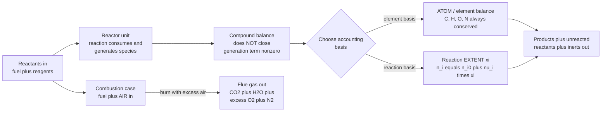

# 🔥 Reactive Systems and Combustion Balances

> [!abstract] TL;DR
> When a chemical reaction runs inside a process unit, a mass balance written on any single **compound** no longer closes — methane is *destroyed*, carbon dioxide is *created*, so the balance picks up a nonzero **generation** term. Chemical engineers escape this two ways: switch the accounting unit to **atoms** (element balances, which *always* close because atoms are conserved no matter what reacts), or track a single **extent of reaction** $\xi$ per reaction so every species follows $n_i = n_{i0} + \nu_i\,\xi$. From these fall out the quantities that decide a plant's economics — **limiting vs excess reactant**, fractional **conversion**, **yield**, and **selectivity**. **Combustion** is the archetype: fuel plus **air** in, flue gas out, with a careful count of **excess air**, the **air-fuel ratio**, complete ($\text{CO}_2,\text{H}_2\text{O}$) versus incomplete ($\text{CO}$) products, and flue-gas composition reported on a **wet** or **dry (Orsat)** basis using **nitrogen as the inert tie**. Getting this stoichiometric accounting right underpins reactor sizing, energy balances (heat of reaction), and emissions compliance ($\text{CO}$, $\text{NO}_x$, $\text{CO}_2$).

## Intuition

**Analogy:** Imagine you run a warehouse and audit inventory. For most goods the rule is simple — *what came in, minus what went out, equals what is left*. But your warehouse also contains a workshop that **melts down bicycles to build motorcycles**. Now an audit on "bicycles" fails: some vanished on the shop floor. An audit on "motorcycles" also fails: some appeared from nowhere. The books look broken.

The fix is to stop counting *vehicles* and start counting *steel atoms*. Every kilogram of steel that entered is still in the building — as bikes, as motorcycles, or as scrap. **Steel is conserved even though bicycles are not.** A reacting chemical process is exactly this warehouse: molecules (compounds) are melted down and rebuilt, so **compound balances leak**, but **atom balances are eternal** — every carbon, hydrogen, and oxygen atom that goes in must come out somewhere. Combustion is the everyday drama of this bookkeeping: fuel plus air go in, exhaust comes out, and the whole art is counting how much *extra* air was supplied and what the flue gas actually contains.

---

## How It Works

### Core Mechanics

1. **Why a compound balance no longer closes.** The general balance on species $i$ over a unit is
   $$\text{in} - \text{out} + \text{generation} - \text{consumption} = \text{accumulation}.$$
   For a non-reacting species the two middle terms are zero and the balance is trivial. Once a reaction runs, a *reactant* has a consumption term and a *product* has a generation term — both unknown — so the naive "in equals out" fails. Two robust methods restore closure.

2. **Method 1 — element (atom) balances.** Atoms are neither created nor destroyed by chemistry, so a balance written on each **atomic species** (C, H, O, N, S, ...) has *no* generation term and always closes. For methane combustion you simply assert: carbon in = carbon out, hydrogen in = hydrogen out, oxygen in = oxygen out. This works even when the reaction stoichiometry is messy or unknown, which is why it dominates combustion calculations.

3. **Method 2 — the extent of reaction $\xi$.** Pick a *balanced* reaction with stoichiometric coefficients $\nu_i$ (negative for reactants, positive for products). One scalar $\xi$ (units: mol) then fixes *every* species at once:
   $$n_i = n_{i0} + \nu_i\,\xi.$$
   All moles are tied to a single unknown. For $R$ independent reactions you carry a vector $\xi_1,\dots,\xi_R$ and sum: $n_i = n_{i0} + \sum_j \nu_{ij}\,\xi_j$. This is the compact language that later powers reaction engineering.

4. **Reaction bookkeeping quantities.** From the outlet moles you read off the numbers that matter commercially:
   - **Limiting reactant** — the one that runs out first ($\xi$ is capped by whichever reactant hits zero soonest); everything else is in **excess**.
   - **Fractional conversion** $X_A = (n_{A0} - n_A)/n_{A0}$ — how much of a chosen reactant was consumed.
   - **Yield** — moles of desired product formed divided by moles that *would* form at complete conversion of the limiting reactant.
   - **Selectivity** — moles of desired product per mole of undesired product, the key number when side reactions compete.

5. **Combustion — the archetypal reactive balance.** Fuel + **air** react to products. Air is taken as $21\%\ \text{O}_2$ / $79\%\ \text{N}_2$ by mole, so **3.76 mol N₂ accompany every mol O₂**. The **theoretical (stoichiometric) air** is the exact amount for complete combustion (all C → CO₂, all H → H₂O). In practice engineers supply **excess air** to drive combustion to completion:
   $$\%\text{ excess air} = \frac{\text{air supplied} - \text{theoretical air}}{\text{theoretical air}}\times 100.$$

6. **Wet vs dry (Orsat) basis and the nitrogen tie.** Flue gas is reported **wet** (water vapor included) or **dry / Orsat** (water condensed out, as the classic Orsat analyzer does). Because **N₂ passes through unreacted**, it serves as a **tie component** that links inlet air to outlet flue gas — often the cleanest way to back out the air supplied from a measured stack composition.

### Flow / Architecture



---

## Key Concepts

### Secondary Level

- **Atoms are conserved; compounds are not.** The single most important idea: a balanced equation redistributes atoms among molecules but destroys none. This is why $\text{CH}_4 + 2\,\text{O}_2 \rightarrow \text{CO}_2 + 2\,\text{H}_2\text{O}$ has equal atom counts on both sides.
- **Mole ratios.** Coefficients in a balanced equation are ratios of *moles*, not mass. Two moles of O₂ per mole of CH₄, full stop.
- **Limiting and excess reactant.** Whichever reactant would be used up first at the given feed ratio limits how far the reaction can go; the rest is excess and leaves unreacted.
- **Complete combustion products.** Burn a hydrocarbon completely and you get **CO₂ + H₂O** only. Air supplies the oxygen and drags along nitrogen that goes along for the ride.

### Undergraduate Level

- **Extent of reaction.** $n_i = n_{i0} + \nu_i\,\xi$ collapses all species to one variable per reaction. The maximum extent is set by the limiting reactant: $\xi_{\max} = \min_i(-n_{i0}/\nu_i)$ over reactants.
- **Conversion, yield, selectivity.** Conversion measures reactant consumed; **yield** and **selectivity** matter only when *multiple* reactions compete (a main reaction plus side reactions). A process can have high conversion but poor selectivity — burning your product to CO₂ still "converts" the reactant.
- **Degrees of freedom (reactive systems).** Two equivalent bookkeeping schemes: (i) species balances *with* generation terms, adding one unknown $\xi_j$ per independent reaction; or (ii) **element balances** (one per independent atomic species) plus balances on any inert. Count independent reactions as the rank of the stoichiometric matrix.
- **Theoretical air, excess air, air-fuel ratio.** Theoretical air is the stoichiometric minimum; real burners run **10–100% excess air** to ensure completeness. The **air-fuel ratio (AFR)** is reported on a molar or mass basis; stoichiometric AFR for methane is $\approx 17.2$ kg air / kg fuel.
- **Complete vs incomplete combustion.** Insufficient air (or poor mixing) produces **CO** and soot instead of CO₂ — an atom balance still closes, but the oxygen is under-utilized and unburned fuel energy is lost.
- **Wet vs dry (Orsat) basis.** Dry-basis (Orsat) analyses omit water; converting between wet and dry is a frequent source of error. Nitrogen acts as the **inert tie component** linking air in to flue gas out.

### Graduate Level

- **Stoichiometric matrix and independent reactions.** For $S$ species and a set of proposed reactions, the number of *independent* reactions equals the rank of the coefficient matrix $\boldsymbol{\nu}$. Only independent reactions get their own extent; the rest are linear combinations. The atom-balance formulation is equivalent: independent element balances = number of atomic species whose atom vectors are linearly independent.
- **Coupling to equilibrium and kinetics.** The *maximum* extent is thermodynamic (set by [[Chemical_Equilibrium]] via $K$ and $\Delta G$); the *achieved* extent in finite time is kinetic (set by [[Chemical_Kinetics]] rate laws and residence time). Material balances give structure; equilibrium and kinetics fix the actual $\xi$.
- **Energy-balance coupling.** Extent is the natural bridge to the energy balance: the heat released is $\Delta H_{rxn}\cdot\xi$. Combustion pushed to the **adiabatic flame temperature** shows why **excess air lowers flame temperature** — the extra N₂ and O₂ are inert thermal ballast absorbing sensible heat.
- **Pollutant chemistry rides on the same balances.** **Thermal NOₓ** (Zeldovich mechanism) forms from N₂ + O₂ at high flame temperature — so excess air trades completeness of burn against NOₓ formation. Incomplete-combustion **CO** and unburned hydrocarbons are captured by adding those species (extra extents) to the balance.
- **The reactor as a balance unit.** Everything here generalizes to the reactor design equations: the extent/conversion framework is the steady-state material balance that CSTR and PFR sizing are built on, closed with a rate law.

---

## Python Demo

```python
# Reactive & combustion material balances, visualized.
#   (a) EXTENT OF REACTION / CONVERSION for  N2 + 3 H2 -> 2 NH3
#       - identify the limiting reactant, plot composition vs extent
#   (b) COMBUSTION WITH EXCESS AIR for  CH4 + 2 O2 -> CO2 + 2 H2O
#       - flue-gas composition (wet & dry/Orsat) vs percent excess air
#       - air-fuel ratio and the nitrogen tie component
import numpy as np
import matplotlib.pyplot as plt

# =====================================================================
# (a) EXTENT OF REACTION:  n_i = n_i0 + nu_i * xi
#     Feed carries EXCESS hydrogen so N2 is the limiting reactant.
# =====================================================================
species_a = ["N2", "H2", "NH3"]
nu = np.array([-1.0, -3.0, +2.0])          # stoichiometric coefficients
n0 = np.array([ 1.0,  4.0,  0.0])          # feed moles (H2 in excess)

# Each reactant runs out at xi = -n0/nu ; the SMALLEST cap is the limit.
xi_caps  = np.where(nu < 0, -n0 / nu, np.inf)
xi_max   = xi_caps.min()
limiting = species_a[int(np.argmin(xi_caps))]
print(f"(a) Limiting reactant: {limiting}   xi_max = {xi_max:.3f} mol")

xi = np.linspace(0.0, xi_max, 200)
n  = n0[:, None] + np.outer(nu, xi)        # moles of each species vs extent
conv_N2 = xi / n0[0]                        # fractional conversion of N2
print(f"    At full extent, N2 conversion = {conv_N2[-1]*100:.0f}% ,"
      f"  NH3 formed = {n[2, -1]:.2f} mol,  H2 left = {n[1, -1]:.2f} mol")

# =====================================================================
# (b) COMBUSTION WITH EXCESS AIR
#     Air = 21% O2 / 79% N2  ->  3.76 mol N2 per mol O2 (the inert tie).
# =====================================================================
BASIS_CH4 = 1.0                             # basis: 1 mol methane
O2_stoich = 2.0 * BASIS_CH4                 # stoichiometric O2 requirement
N2_per_O2 = 79.0 / 21.0                     # = 3.762

e = np.linspace(0.0, 1.0, 200)             # excess-air FRACTION (0-100%)
O2_in = O2_stoich * (1.0 + e)              # O2 actually supplied
N2_in = O2_in * N2_per_O2                   # N2 rides in with the air

CO2 = np.full_like(e, 1.0 * BASIS_CH4)      # complete combustion: all C -> CO2
H2O = np.full_like(e, 2.0 * BASIS_CH4)      # all H -> H2O
O2  = O2_in - O2_stoich                     # leftover O2  = 2*e
N2  = N2_in                                 # inert, passes straight through

wet_total = CO2 + H2O + O2 + N2
dry_total = CO2 + O2 + N2                   # Orsat: water condensed out

xCO2_wet, xH2O_wet = CO2 / wet_total, H2O / wet_total
xO2_wet,  xN2_wet  = O2 / wet_total,  N2 / wet_total
xCO2_dry, xO2_dry, xN2_dry = CO2 / dry_total, O2 / dry_total, N2 / dry_total

# Air-fuel ratio (molar & mass)
AFR_molar = O2_in * (1.0 + N2_per_O2) / BASIS_CH4
M_air, M_CH4 = 28.97, 16.04
AFR_mass = AFR_molar * M_air / M_CH4

# Orsat (dry) report at 20% excess air
i20 = int(np.argmin(np.abs(e - 0.20)))
print(f"(b) At 20% excess air:  AFR = {AFR_mass[i20]:.2f} kg air / kg fuel")
print(f"    Orsat (dry) analysis:  CO2 {100*xCO2_dry[i20]:.2f}% |"
      f"  O2 {100*xO2_dry[i20]:.2f}% |  N2 {100*xN2_dry[i20]:.2f}%")

# =====================================================================
# PLOTS
# =====================================================================
fig, (ax1, ax2) = plt.subplots(2, 1, figsize=(9, 10))

for name, row in zip(species_a, n):
    ax1.plot(xi, row, lw=2, label=name)
ax1.axvline(xi_max, ls="--", color="grey")
ax1.text(xi_max, 3.6, "  N2 exhausted\n  (limiting)", va="top", fontsize=9)
ax1.set_xlabel("Reaction extent  xi  (mol)")
ax1.set_ylabel("Moles present")
ax1.set_title("(a) N2 + 3 H2 -> 2 NH3 : composition vs extent of reaction")
ax1.legend(); ax1.grid(alpha=0.3)

ax2.plot(100*e, 100*xCO2_dry, lw=2, label="CO2  dry / Orsat")
ax2.plot(100*e, 100*xO2_dry,  lw=2, label="O2   dry / Orsat")
ax2.plot(100*e, 100*xCO2_wet, lw=2, ls="--", label="CO2  wet")
ax2.plot(100*e, 100*xH2O_wet, lw=2, ls="--", label="H2O  wet")
ax2.set_xlabel("Percent EXCESS AIR")
ax2.set_ylabel("Flue-gas mole percent")
ax2.set_title("(b) CH4 combustion: flue-gas composition vs excess air")
ax2.legend(); ax2.grid(alpha=0.3)

plt.tight_layout()
plt.savefig("reactive_combustion_balances.png", dpi=130)
plt.show()
```

**What the plots show.** Panel (a) makes the limiting reactant visible: N₂ and H₂ fall linearly while NH₃ rises, and the run stops the instant N₂ hits zero (H₂ still has excess left over). Panel (b) is the combustion engineer's working chart: as excess air rises, **CO₂ mole fraction is diluted** (its curve slopes down) while **excess O₂ climbs** — and the *dry/Orsat* CO₂ reads higher than the *wet* CO₂ because removing water concentrates everything else. The printout gives the air-fuel ratio and the Orsat analysis you would compare against a real stack measurement.

---

## Real-World Applications

> **Boilers and fired heaters (refineries, power plants):** operators run an **O₂-trim control** loop that measures flue-gas oxygen and adjusts the air damper to hold a small, optimal excess air (typically 2–4% O₂ in the stack). Too little air leaves unburned CO and wastes fuel; too much air carries heat up the stack and raises NOₓ. The set point is chosen straight off the excess-air/flue-gas balance in this note.

> **Internal combustion engines:** the **lambda ($\lambda$) sensor** in an exhaust reports the air-fuel ratio relative to stoichiometric, and the ECU trims injection to hold $\lambda \approx 1$ for the three-way catalyst to work — the same air-fuel accounting, run in closed loop thousands of times per second (see [[Internal_Combustion_Engines]]).

> **Gas-turbine and rocket combustors:** aircraft combustors and rocket engines are designed around precise stoichiometric and excess-air (or fuel-rich) ratios to set flame temperature and completeness of burn while protecting hardware (see [[Inlets_Combustors_and_Nozzles]] and [[Liquid_and_Solid_Rocket_Engines]]).

> **Reactor sizing and process economics:** ammonia, methanol, ethylene-oxide, and sulfuric-acid plants all live or die on **conversion, yield, and selectivity** — the reactive-balance quantities that decide raw-material cost, recycle load, and separation duty. The material balance sizes the reactor before any kinetics is added.

> **Incinerators and emissions compliance:** waste incinerators and combustion emissions monitoring report **CO, NOₓ, and CO₂** on a defined O₂-reference dry basis — a direct application of wet/dry conversion and the nitrogen tie to translate measured stack gas into a regulatory number.

---

## Common Pitfalls

- **Writing a compound balance without a generation term.** The classic beginner error: "in = out" for methane across a burner. If the species reacts, you *must* either add generation/consumption ($\nu_i\,\xi$) or switch to atom balances. Atoms close; molecules do not.
- **Confusing theoretical air with air supplied.** Percent excess air is defined relative to the **theoretical** requirement, and the theoretical requirement is computed for **complete** combustion — even if the real burner produces some CO. Compute theoretical air *as if* all C went to CO₂.
- **Mixing wet and dry (Orsat) bases.** Orsat analyses are **dry** — the water has condensed out. Comparing a dry stack reading to a wet-basis calculation (or vice versa) silently corrupts every mole fraction. Always label the basis and convert deliberately.
- **Forgetting nitrogen as the inert tie.** N₂ enters with the air, does not react (ignoring NOₓ traces), and leaves in the flue gas. It is often the cleanest tie component to back out unknown air flow from a measured stack composition — skipping it makes an easy problem hard.
- **Conflating conversion, yield, and selectivity.** High conversion of a reactant does not mean high yield of the *desired* product — side reactions can consume reactant into byproducts. When multiple reactions compete, you need selectivity, not just conversion.
- **Miscounting independent reactions.** Adding a reaction that is a linear combination of others (redundant) inflates your unknown extents and breaks the degrees-of-freedom count. Check the rank of the stoichiometric matrix, or equivalently use one balance per independent atomic species.
- **Ignoring excess air in the energy balance.** Excess air is inert thermal ballast: it lowers the **adiabatic flame temperature**. Sizing a furnace or estimating flame temperature while ignoring the extra N₂/O₂ heat capacity overpredicts the temperature.

---

## Related Concepts

- [[Stoichiometry_and_the_Mole]] — the foundational atom-conservation and mole-ratio bookkeeping that reactive balances extend from single equations to whole process units.
- [[Chemical_Equilibrium]] — sets the *maximum attainable* extent of reaction through $K$ and $\Delta G$; the balance supplies the composition, equilibrium supplies the ceiling.
- [[Chemical_Kinetics]] — fixes the *actual* extent reached in finite residence time; couples the material balance to a rate law for reactor design.
- [[Chemical_Thermodynamics]] — supplies the heat of reaction $\Delta H_{rxn}$ that multiplies the extent in the energy balance, and governs adiabatic flame temperature.
- [[Internal_Combustion_Engines]] — a live combustion balance run in closed loop: air-fuel ratio, excess/rich mixtures, and exhaust (CO, NOₓ, CO₂) are exactly the flue-gas quantities here.
- [[Inlets_Combustors_and_Nozzles]] — gas-turbine combustors designed around stoichiometric and excess-air ratios to set flame temperature and completeness of burn.
- [[Liquid_and_Solid_Rocket_Engines]] — propellant combustion where the fuel-oxidizer mixture ratio (an air-fuel-ratio analog) governs performance and combustion products.

*Sibling notes in this section — Material and Mass Balances, Energy Balances in Processes, Chemical Reaction Engineering Overview, Reaction Kinetics and Rate Laws, and Chemical Reaction Equilibrium — extend this material into non-reactive balances, the coupled energy accounting, and full reactor design.*

---

## Review Questions

1. **(Secondary)** Methane burns as $\text{CH}_4 + 2\,\text{O}_2 \rightarrow \text{CO}_2 + 2\,\text{H}_2\text{O}$. Explain in one sentence why a mass balance written on "methane" does not close across the burner, but a balance written on "carbon atoms" does. What accounting change fixes the methane balance?
2. **(Undergraduate)** A feed of 1 mol N₂ and 4 mol H₂ enters an ammonia reactor ($\text{N}_2 + 3\,\text{H}_2 \rightarrow 2\,\text{NH}_3$). Identify the limiting reactant, the maximum extent $\xi_{\max}$, and the outlet moles of every species at 60% conversion of N₂.
3. **(Undergraduate/Graduate)** You burn a hydrocarbon with excess air and the Orsat (dry) analysis shows measurable O₂ *and* measurable CO. What does the simultaneous presence of both tell you about the combustion, and how would you write the balances (extents and/or atom balances) to account for it?
4. **(Graduate)** Increasing excess air makes combustion more complete but is not free. Using the coupling between the material balance and the energy balance, explain two distinct penalties of high excess air (one thermal, one environmental), and describe the trade-off an operator manages with O₂-trim control.

---

## Sources

- Felder, R. M., Rousseau, R. W., & Bullard, L. G. — *Elementary Principles of Chemical Processes*, 4th ed. (Wiley). [Publisher page](https://www.wiley.com/en-us/Elementary+Principles+of+Chemical+Processes%2C+4th+Edition-p-9780470616291)
- Himmelblau, D. M., & Riggs, J. B. — *Basic Principles and Calculations in Chemical Engineering*, 8th ed. (Prentice Hall). [Publisher page](https://www.pearson.com/en-us/subject-catalog/p/basic-principles-and-calculations-in-chemical-engineering/P200000003406)
- Turns, S. R. — *An Introduction to Combustion: Concepts and Applications*, 3rd ed. (McGraw-Hill). [Publisher page](https://www.mheducation.com/highered/product/introduction-combustion-concepts-applications-turns/M9780073380193.html)
- Smith, J. M., Van Ness, H. C., & Abbott, M. M. — *Introduction to Chemical Engineering Thermodynamics*, 8th ed. (McGraw-Hill). [Publisher page](https://www.mheducation.com/highered/product/introduction-chemical-engineering-thermodynamics-smith-ness/M9781259696527.html)
- U.S. EPA — *Combustion and stack-gas emissions / O₂-corrected flue-gas basis (AP-42)*. [EPA AP-42](https://www.epa.gov/air-emissions-factors-and-quantification/ap-42-compilation-air-emissions-factors)

---

#chemical-engineering #stoichiometry #combustion #extent-of-reaction #excess-air
