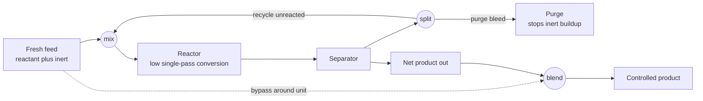

# ♻️ Recycle, Bypass, and Purge

> [!abstract] TL;DR
> Real reactors are inefficient — often only a fraction of the feed reacts on a single pass. **Recycle** returns the unreacted material to the inlet so it gets many passes, pushing **overall conversion** toward 100% even when **single-pass conversion** is poor — at the cost of larger flows, equipment, and pumping. But recycling also traps anything that *doesn't* react (inert gases, impurities), which then **accumulates without bound**. The cure is a **purge**: a small deliberate bleed off the loop that carries the junk out, trading a little lost reactant for a stable inert level. **Bypass** is the opposite move — routing part of a stream *around* a unit and remixing it downstream for fine control. Getting these three loops (and their tradeoffs) right is a core material-balance skill and the backbone of the ammonia, methanol, and refinery processes.

---

## Intuition

**Analogy — the thrifty cook's stockpot.** A reactor is like a pot where only a fifth of what you throw in actually cooks through on each pass. Throwing away the four-fifths that came out raw would be madness. So a chemical engineer does what a thrifty cook does with leftovers: **recycle** them back into the pot. Send the unreacted material around again and again, and nearly all of it eventually converts — a 20%-per-pass reactor becomes a 99%-overall process.

But recycling has a dark side. Suppose the ingredients you buy carry a little sand mixed in. The sand never cooks, never leaves with the finished dish, and gets scooped back into the pot every cycle. Round and round it goes, building up until the pot is more sand than food — like a **clogging drain**. The fix is a **purge**: crack open a small tap on the loop and let a trickle out. That trickle carries the sand away as fast as it arrives, holding the pot at a steady, tolerable grit level — though you also lose a little good broth down the drain. **Bypass** is the reverse trick: pour some of the cold stock *around* the stove and blend it back in afterward when you want to fine-tune the final temperature without heating everything.

Everything past this point is just careful accounting — drawing an imaginary box around the right part of the process and balancing what goes in against what comes out.

---

## How It Works

### Core mechanics

1. **Single-pass vs overall conversion.** A reactor's *single-pass* (or *once-through*) conversion is what it achieves across the reactor itself on the total feed entering it. It is limited by **equilibrium** (a thermodynamic ceiling), **kinetics** (not enough residence time), **selectivity** (pushing conversion higher makes unwanted byproducts), or **safety** (runaway heat release). The *overall* conversion is measured across the whole process — net product out divided by fresh feed in. Recycle is the mechanism that lets overall conversion vastly exceed single-pass conversion.

2. **Recycle raises overall conversion.** Separate the unreacted reactant downstream and send it back to the reactor inlet, mixing it with fresh feed. Each molecule now gets many chances to react. If separation and recovery were perfect, overall conversion would reach 100% no matter how low the single-pass value — the unreacted material simply keeps circulating until it converts.

3. **The recycle ratio is the price.** The lower the single-pass conversion, the more material must circulate. For a reactant recovered and recycled with efficiency `sigma`, the steady-state balance around the mixer + reactor gives:
   - reactor feed rate `G = F / (1 - sigma*(1 - x_sp))`
   - overall conversion `X = x_sp / (1 - sigma*(1 - x_sp))`
   - recycle ratio `R/F = sigma*(1 - x_sp) / (1 - sigma*(1 - x_sp))`

   With near-perfect recovery, `R/F` approaches `(1 - x_sp)/x_sp`, which **blows up** as `x_sp` shrinks. A 10%-per-pass reactor needs roughly nine times the fresh-feed flow circulating around the loop — bigger reactor, bigger separator, bigger pump/compressor, more energy.

4. **Inerts accumulate — the recycle's dark side.** Any species that enters the loop but leaves by *neither* reaction *nor* the product separation has nowhere to go. It rides the recycle around and around, building up every cycle. Classic culprits: **argon and methane in ammonia synthesis**, or trace impurities in a refinery gas loop. Without intervention its concentration rises without bound until it chokes the reactant partial pressure and stalls the reactor.

5. **Purge sets the steady inert level.** Split a small fraction `phi` of the recycle stream and bleed it off. At steady state the purge must carry out inert **exactly as fast as it enters** in the fresh feed: `phi * C * y_I = f_I`, so the steady inert mole fraction is `y_I = f_I / (phi * C)`. A bigger purge means a lower inert level but a larger loss of valuable reactant down the bleed — an optimization, not a free lunch.

6. **Bypass splits for control.** Route part of a stream around a unit and remix it downstream. Blending processed and unprocessed portions lets you hit a target outlet condition precisely — a common trick for **temperature control** (blend hot reactor effluent with cool bypass) or **partial processing** (only treat as much as spec requires).

7. **It all comes down to the system boundary.** Solving these problems is about *where you draw the box*. A balance around the **whole process** (fresh feed and net product cross the boundary; the recycle is internal) gives overall conversion directly. A balance around just the **reactor** gives single-pass conversion. Balances around the **mixing point** and **splitting point** tie the streams together. Choosing the boundary cleverly is the entire skill.

### Flow / architecture



---

## Key Concepts

### Secondary (plain-language)
- **Recycle** = sending the uncooked leftovers back into the pot so almost all of it eventually cooks.
- **Single-pass conversion** = how much reacts in one trip through the reactor; **overall conversion** = how much of the fresh feed reacts by the time it leaves the whole plant. Recycle makes overall much larger than single-pass.
- **Purge** = a small tap that lets the un-reactive junk (inerts) escape so it stops piling up in the loop.
- **Bypass** = sending some feed *around* a unit and mixing it back in, used to fine-tune the result.

### Undergraduate (the material-balance formalism)
- **Steady-state balance:** for every species, *in = out + consumed by reaction* (accumulation is zero at steady state). Recycle streams are **internal** to a whole-process boundary, so they cancel out and never appear in the overall balance — a key simplification.
- **Recycle ratio** `R/F` and the derived relations for reactor feed, overall conversion, and required recycle as functions of single-pass conversion and recovery `sigma`.
- **Inert balance for purge:** at steady state, inert in fresh feed = inert leaving in purge (plus any leaving with product). This single equation fixes the steady inert composition given the purge rate.
- **Degrees of freedom / solution strategy:** recycle problems couple many streams; count unknowns and independent balances, pick boundaries (whole process, reactor, mixer, splitter) to decouple them, and solve — often a **linear system** of coupled balances (a "tear stream" is guessed and iterated in larger flowsheets).
- **Bypass fraction** and lever-rule blending: the mixed outlet composition/temperature is a flow-weighted average of the processed and bypassed streams.

### Graduate (design, optimization, and control)
- **Recycle economics as an optimization:** lower single-pass conversion cuts reactor cost (or avoids selectivity/safety limits) but explodes recycle flow, separator duty, and compressor power. The economic optimum trades reactor size against recycle-handling cost — a design-variable sweep, not a single "right" conversion.
- **Purge optimization:** minimize total cost = value of reactant lost in purge + cost of the yield/pressure penalty from higher inerts. Membrane or PSA recovery on the purge can reclaim reactant, shifting the optimum. In ammonia loops, argon/methane purge is tuned against synthesis-gas value and hydrogen recovery.
- **Plantwide control & the "snowball effect":** recycle loops introduce slow dynamics and strong feedback — a small disturbance in fresh feed can be amplified into large swings in recycle flow (the *snowball effect*, Luyben). Recycle must be considered when designing control structure; fixing a flow *inside* the loop rather than the fresh feed often stabilizes it.
- **Reactor–separator–recycle interaction:** conversion, separation sharpness, and recycle flow are coupled; the same product rate can be met by many combinations, and the loop's steady state can even be multiple (multiplicity) for certain reactions.
- **Multiple recycles and heat integration:** real flowsheets have several nested recycles (mass and energy), and bypass streams double as heat-integration and turndown-control handles.

---

## Python Demo

```python
# Recycle economics and the purge tradeoff, from steady-state material balances.
# (A) Recycle turns a poor single-pass reactor into a high-overall-conversion
#     process -- but the required recycle flow (recycle ratio) blows up.
# (B) A purge sets the steady inert level in a recycle loop -- small purge lets
#     inerts choke the loop, big purge holds inerts down but wastes reactant.
import numpy as np
import matplotlib.pyplot as plt

# ----------------------------------------------------------------------
# PART A - RECYCLE  (reactant A, single-pass conversion x_sp on total feed;
#   separator recovers fraction sigma of unreacted A back to the inlet)
#   G = F / (1 - sigma*(1 - x_sp))                 reactor feed of A
#   X_overall = x_sp / (1 - sigma*(1 - x_sp))      fresh-feed conversion
#   R/F       = sigma*(1 - x_sp) / (1 - sigma*(1 - x_sp))   recycle ratio
# ----------------------------------------------------------------------
x_sp = np.linspace(0.05, 0.95, 200)                # single-pass conversion

def overall_conversion(x, sigma):
    return x / (1.0 - sigma * (1.0 - x))

def recycle_ratio(x, sigma):
    return sigma * (1.0 - x) / (1.0 - sigma * (1.0 - x))

sigmas = [0.0, 0.90, 0.99]                          # separator recovery fraction
labels = ["no recycle, sigma=0", "sigma=0.90", "sigma=0.99"]

# ----------------------------------------------------------------------
# PART B - PURGE  (inert enters with fresh feed at f_I; circulating gas flow C;
#   purge bleeds fraction phi of the recycle gas). Steady-state inert balance:
#      phi * C * y_I = f_I   ->   y_I = f_I / (phi * C)   (capped at 1: choked)
#   reactant bled off in purge = phi * C * (1 - y_I)
# ----------------------------------------------------------------------
C   = 100.0                                         # circulating molar flow, mol/s
f_I = 1.0                                           # inert entering in feed, mol/s
phi = np.linspace(0.005, 0.30, 200)                # purge fraction of recycle gas

y_I           = np.minimum(f_I / (phi * C), 1.0)   # steady inert mole fraction
reactant_lost = phi * C * (1.0 - y_I)              # reactant lost in purge, mol/s

# ----------------------------------------------------------------------
# PLOTS
# ----------------------------------------------------------------------
fig, ax = plt.subplots(2, 2, figsize=(12, 9))

# (A1) overall conversion vs single-pass conversion
for sig, lab in zip(sigmas, labels):
    ax[0, 0].plot(x_sp, overall_conversion(x_sp, sig), lw=2, label=lab)
ax[0, 0].plot([0, 1], [0, 1], "k:", lw=1, label="y = x (no recycle limit)")
ax[0, 0].set_title("Recycle lifts OVERALL conversion")
ax[0, 0].set_xlabel("single-pass conversion  x_sp")
ax[0, 0].set_ylabel("overall conversion  X")
ax[0, 0].legend(fontsize=8); ax[0, 0].grid(alpha=0.3)

# (A2) recycle ratio vs single-pass conversion -- the cost
ax[0, 1].plot(x_sp, recycle_ratio(x_sp, 0.99), color="crimson", lw=2)
ax[0, 1].set_title("...but the cost is a large recycle stream")
ax[0, 1].set_xlabel("single-pass conversion  x_sp")
ax[0, 1].set_ylabel("recycle ratio  R / F  (sigma=0.99)")
ax[0, 1].set_ylim(0, 20); ax[0, 1].grid(alpha=0.3)

# (B1) steady inert fraction vs purge fraction
ax[1, 0].plot(phi, y_I, color="darkgreen", lw=2)
ax[1, 0].set_title("Purge sets the steady inert level")
ax[1, 0].set_xlabel("purge fraction  phi")
ax[1, 0].set_ylabel("steady inert mole fraction  y_I")
ax[1, 0].grid(alpha=0.3)
ax[1, 0].annotate("small purge -> inerts choke the loop",
                  xy=(0.02, float(np.minimum(f_I / (0.02 * C), 1.0))),
                  xytext=(0.10, 0.75),
                  arrowprops=dict(arrowstyle="->"), fontsize=8)

# (B2) reactant lost in purge vs purge fraction -- the cost
ax[1, 1].plot(phi, reactant_lost, color="navy", lw=2)
ax[1, 1].set_title("...but a bigger purge wastes reactant")
ax[1, 1].set_xlabel("purge fraction  phi")
ax[1, 1].set_ylabel("reactant lost in purge  (mol/s)")
ax[1, 1].grid(alpha=0.3)

plt.tight_layout()
plt.savefig("recycle_bypass_purge.png", dpi=120)
plt.show()

# quick numeric readout
print("Single-pass 20%, sigma=0.99  ->  overall X =",
      round(float(overall_conversion(0.20, 0.99)), 3),
      "| recycle ratio R/F =", round(float(recycle_ratio(0.20, 0.99)), 2))
print("Purge phi=0.05  ->  inert y_I =", round(float(f_I / (0.05 * C)), 3),
      "| reactant lost =", round(float(0.05 * C * (1 - f_I / (0.05 * C))), 2), "mol/s")
```

Running it shows the two faces of a recycle loop: with 99% recovery a feeble 20%-per-pass reactor reaches ~99.6% overall conversion, but only by circulating about four times the fresh feed; and shrinking the purge below a few percent lets the inert fraction shoot toward the "choked" ceiling while a fat purge holds inerts down at the price of dumping reactant.

---

## Real-World Applications

- **Ammonia synthesis (Haber-Bosch loop).** Single-pass conversion of N₂ + H₂ over the iron catalyst is only ~15–25% (equilibrium-limited at practical pressures), so unreacted synthesis gas is separated from liquid ammonia and **recycled**. Argon (from the air-separation feed) and methane (from natural-gas reforming) are inert and would accumulate, so a continuous **purge** holds them at a tolerable level — the textbook example of purge design, often with downstream hydrogen recovery.
- **Methanol synthesis.** Same pattern: low equilibrium single-pass conversion of CO/CO₂ + H₂ drives a large recycle loop, with a purge to bleed inerts (methane, nitrogen) and keep the loop's reactant partial pressures high.
- **Petroleum refining.** Catalytic reformers, hydrocrackers, and alkylation units run large recycle streams (unconverted feed, hydrogen, isobutane) with purges to control light-ends and inert buildup; recycle is central to meeting conversion and product-quality targets economically.
- **Bypass for control.** Heat exchangers and reactors are routinely fitted with a **bypass** line so an operator blends unprocessed stream with processed stream to hit a precise outlet temperature — a cheap, fast-acting control handle used across almost every process plant.

---

## Common Pitfalls

- **Confusing single-pass with overall conversion.** Reporting the reactor's once-through conversion as the process conversion (or vice versa) is the single most common student error. Always state *which boundary* the conversion refers to — reactor alone, or the whole process with fresh feed and net product.
- **Forgetting inerts accumulate.** Designing a recycle loop without a purge, assuming a non-reacting species will "just leave somewhere." If it enters and neither reacts nor exits with the product, its concentration rises without bound and stalls the reactor. Every recycle loop fed with inerts needs a purge (or another exit).
- **Choosing a poor system boundary.** Trying to solve everything with one giant balance instead of picking boundaries (whole process, reactor, mixer, splitter) that decouple the unknowns. The right boundary makes the recycle *internal* and the algebra trivial; the wrong one turns it into a tangle.
- **Treating recycle as free.** Assuming more recycle is always better because it lifts conversion. Recycle multiplies flows through the reactor, separator, and compressor — capital and energy cost. The economic optimum balances conversion against recycle-handling cost.
- **Setting purge too high or too low.** Too small a purge lets inerts choke the loop; too large a purge dumps valuable reactant. The purge rate is an optimization, not a guess — and its optimum shifts if you add purge-gas recovery.
- **Ignoring recycle dynamics in control.** Steady-state balances hide the fact that recycle loops are feedback loops with slow dynamics; a small feed upset can be amplified into a large recycle swing (the snowball effect), so control structure must account for the loop.

---

## Related Concepts

Recycle, bypass, and purge are the practical payoff of the broader **material and mass balance** toolkit — the accumulation-in-equals-out-plus-generated bookkeeping (a *Material_and_Mass_Balances* topic) applied to closed loops. They sit at the crossroads of **reaction engineering** (single-pass conversion is set by kinetics, equilibrium, and selectivity — a *Chemical_Reaction_Engineering_Overview* concern), **separation processes** (recycle only works if the separator recovers unreacted reactant cleanly — a *Separation_Processes_Overview* concern), and **process design and economics** (the recycle/purge tradeoffs are optimization variables — a *Process_Design_and_Economics* concern), all introduced in the broader *Chemical_Engineering_Overview*. These sibling notes live alongside this one and are referenced here in prose.

Verified cross-vault connections:

- [[Feedback_Loops_and_Causality]] — a recycle loop *is* a feedback loop: recycle is reinforcing (more circulating material feeds more conversion), while a purge is a balancing bleed that holds inerts at a goal level.
- [[Stocks_Flows_and_System_Dynamics]] — inert buildup is a **stock** with an inflow (feed impurity) and, once you add a purge, an outflow; steady state is where the two flows match.
- [[Systems_of_Linear_Equations]] — coupled steady-state balances around the mixer, reactor, and splitter form a linear system solved for the interlocking stream flows.
- [[Stoichiometry_and_the_Mole]] — conversion, yield, and every balance in this note are mole accounts built on stoichiometry.
- [[Chemical_Equilibrium]] — the equilibrium ceiling is a prime reason single-pass conversion is low, which is precisely why recycle exists.
- [[Fluid_Dynamics_Overview]] — moving a large recycle stream costs pump/compressor power against pipe and equipment pressure drop, a major part of the recycle's expense.

---

## Review Questions

**Secondary.** A reactor converts only 25% of what passes through it, yet the finished plant converts 98% of its fresh feed. In plain words, how is that possible, and what would happen to the raw material that does not react on each pass?

**Undergraduate.** Fresh feed of pure reactant A enters a process at 100 mol/s. The reactor achieves 30% single-pass conversion on its total inlet, and a separator recovers *all* unreacted A and recycles it. (a) What is the overall conversion? (b) What is the recycle flow and the recycle ratio R/F? (c) Now suppose the fresh feed also carries 2 mol/s of an inert. Why must you add a purge, and set up the steady-state inert balance that fixes the purge composition.

**Graduate.** You are designing an ammonia-style synthesis loop. Explain the two competing optimizations you face: (i) choosing the single-pass conversion (reactor size and cost vs recycle flow and compressor duty), and (ii) choosing the purge rate (reactant lost in the purge vs yield penalty from inert accumulation). How does adding hydrogen recovery on the purge gas shift the second optimum, and why must the recycle loop's dynamics — not just its steady state — inform the plantwide control structure?

---

## Sources

- Felder, R. M., Rousseau, R. W., & Bullard, L. G. *Elementary Principles of Chemical Processes.* Wiley. (Recycle, bypass, and purge; single-pass vs overall conversion.)
- Himmelblau, D. M., & Riggs, J. B. *Basic Principles and Calculations in Chemical Engineering.* Prentice Hall. (Material balances with recycle and purge.)
- Turton, R., Shaeiwitz, J. A., Bhattacharyya, D., & Whiting, W. B. *Analysis, Synthesis, and Design of Chemical Processes.* Prentice Hall. (Reactor–separator–recycle flowsheets and economics.)
- Murphy, R. M. *Introduction to Chemical Processes: Principles, Analysis, Synthesis.* McGraw-Hill. (System-boundary selection for recycle problems.)
- Luyben, W. L. *Plantwide Process Control.* McGraw-Hill. (Recycle dynamics and the snowball effect.)

---

#chemical-engineering #recycle #purge #bypass #material-balance
