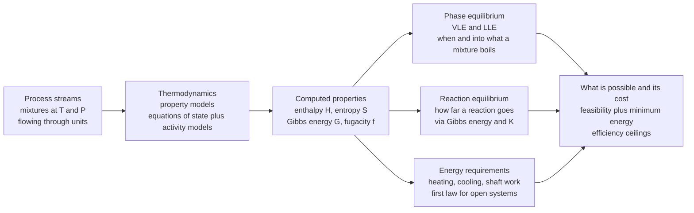

# ⚗️ Chemical Process Thermodynamics

> [!abstract] TL;DR
> **Chemical process thermodynamics** is thermodynamics turned into a design tool for chemical plants: it tells an engineer two priceless things **before a single pipe is laid** — *what is possible* and *how much energy it will cost*. Given a **process stream** (a churning **mixture** at some $T$ and $P$ flowing through a unit), it answers three questions. **Feasibility:** will this reaction or separation go at all? — set by **Gibbs energy** and equilibrium. **Energy:** how much heating, cooling, or work does it demand? — the **first law for open (flow) systems**, where **enthalpy** $H$, not internal energy, is king. **Limits:** what is the *best you can ever do*? — the **second law**, which fixes the minimum separation energy, the maximum work, and the efficiency ceiling through **lost work** $= T_0\,\dot S_{gen}$. What makes it *chemical* rather than the mechanical-engineering view ([[Engineering_Thermodynamics]]) or the chemistry view ([[Chemical_Thermodynamics]]) is the relentless focus on **real mixtures**: partial molar properties, **chemical potential** and **fugacity** (the true driving force for phase and reaction equilibrium), non-ideality (activity coefficients), and **equations of state** — from the ideal gas to cubic EOS like Peng-Robinson — with **departure functions** correcting for real-fluid behavior. It is the honest referee that rules out perpetual-motion fantasies and sets the hard energy and feasibility ceilings every downstream design must respect.

## Intuition

**Analogy:** Before a chemical plant is built, thermodynamics plays two roles at once — the **referee** and the **accountant**. As referee it rules on what is even *allowed*: can this reaction happen, will this mixture separate, at what temperature and pressure will it boil and into what? It throws a flag on any scheme that would separate a mixture more cheaply than nature permits or convert more than equilibrium allows — there are no perpetual-motion fantasies on its watch. As accountant it prices every move: how much heat must this distillation column swallow, how much shaft work must this compressor spend? And here is the twist the accountant can never escape — **every irreversible step charges a non-refundable fee**, a chunk of work permanently lost to entropy generation.

For *chemical* processes the star players are not pure substances and raw energy but **enthalpy**, **free energy**, and **churning mixtures**. The game is played on streams that are blends of many species, boiling, reacting, and flowing through equipment — so the currency is not "the energy of a sealed jar of gas" but the *enthalpy carried by a flowing stream* and the *free energy that decides which way a mixture wants to go*. Get the thermodynamics right and every mass balance, energy balance, and piece of equipment downstream rests on solid ground; get it wrong and you have designed a plant that physics forbids.

---

## How It Works

### Core Mechanics

1. **Draw the boundary around a flowing stream (open system).** A chemical unit — reactor, distillation column, compressor, heat exchanger, throttle valve — is a **control volume** with mass streaming *in and out*. This is why **enthalpy** $h = u + Pv$ exists: the $Pv$ term is the **flow work** needed to push each mole across the boundary. The **steady-flow energy equation** is the first law for such a unit:
   $$\dot Q - \dot W_s = \sum_{out}\dot n\,\bar h - \sum_{in}\dot n\,\bar h + (\text{KE, PE terms})$$
   For most process units kinetic and potential terms are negligible, so **energy balances are enthalpy balances** — the heating and cooling duties that size every exchanger and reboiler.

2. **Fix each stream's state and compute its properties.** A stream's state is pinned by $T$, $P$, and composition; from these thermodynamics delivers the **thermodynamic properties** every balance needs — enthalpy $H$, entropy $S$, Gibbs energy $G$, and **fugacity** $f$. These come from a **property model**: an **equation of state** (ideal gas $Pv = RT$ at low pressure; a **cubic EOS** such as Soave-Redlich-Kwong or Peng-Robinson at high pressure) plus, for liquids, an **activity-coefficient model**.

3. **Correct for real-fluid behavior with $Z$ and departure functions.** Real fluids deviate from ideal. The **compressibility factor** $Z = Pv/RT$ measures the deviation ($Z = 1$ is ideal), and **departure (residual) functions** — $H - H^{ig}$, $S - S^{ig}$ — quantify how much a real stream's enthalpy and entropy differ from the easy ideal-gas value at the same $T, P$. All are derived from the same EOS.

4. **Apply the second law to price irreversibility.** The second law is not abstract here: it sets the **minimum work** of separation and compression and the **maximum work** recoverable from a stream. Every real, irreversible step **generates entropy** and destroys work potential at rate $\dot W_{lost} = T_0\,\dot S_{gen}$ (the Gouy-Stodola relation). This is the thermodynamic *cost of doing business* — the gap between the reversible ideal and the messy reality.

5. **Predict the two equilibria that define chemical processes.** Because streams are **mixtures**, the driving force for change is the **chemical potential** $\mu_i$ (equivalently **fugacity** $f_i$). **Phase equilibrium** (VLE) is reached when each species has equal fugacity in every phase, $\hat f_i^{\,V} = \hat f_i^{\,L}$ — this decides *what boils into what*. **Reaction equilibrium** is reached when $\sum_i \nu_i \mu_i = 0$, equivalently $\Delta G^\circ = -RT\ln K$ — this decides *how far a reaction goes*. Together they set feasibility.

### Flow / Architecture



---

## Key Concepts

### Secondary Level

- **Thermodynamics answers two questions before design starts: is it possible, and what does it cost in energy?** Can this reaction run? Will this mixture separate? How much heat will it take? Thermodynamics rules on all of these before an engineer draws a single pipe.
- **The three deliverables are feasibility, energy, and limits.** *Feasibility*: does the reaction or separation go (free energy)? *Energy*: how much heating, cooling, or work (enthalpy and the first law)? *Limits*: the best you could ever do (second law — a minimum separation energy no clever design can beat).
- **Chemical processes deal with flowing mixtures, not sealed jars.** The streams inside a plant are blends of many chemicals, moving through equipment, boiling and reacting. That is why the "chemical" version of thermodynamics is all about mixtures and flow.
- **Enthalpy is the energy bookkeeping quantity for flowing streams.** Because mass flows across the boundary of a reactor or column, the energy carried is measured by **enthalpy** ($H = U + PV$), not plain internal energy.

### Undergraduate Level

- **First law for open (flow) systems.** Chemical units are **control volumes**. At steady state,
  $$\dot Q - \dot W_s = \Delta \dot H \quad\text{(neglecting KE and PE)},$$
  so the heating/cooling duty of an exchanger or reboiler *is* the enthalpy change of its streams. Enthalpy carries the "flow work" $Pv$ that pure internal energy misses.
- **Second law, entropy, and lost work.** Real processes are irreversible and generate entropy. The **entropy balance** for a control volume is $\dot S_{gen} = \Delta \dot S - \sum_k \dot Q_k/T_k \ge 0$, and the destroyed work potential is
  $$\dot W_{lost} = T_0\,\dot S_{gen} \ge 0.$$
  The reversible limit ($\dot S_{gen} = 0$) gives the **minimum work** of compression or separation — a floor no real machine can undercut.
- **State functions and property evaluation.** $H$, $S$, $G$, and fugacity $f$ are state functions computed from a property model. For an ideal gas, $\Delta h = \int C_p\,dT$ and $\Delta s = \int C_p\,dT/T - R\ln(P_2/P_1)$. Real fluids need the EOS.
- **Equations of state and the compressibility factor.** From ideal gas ($Pv = RT$) up through **cubic EOS** (van der Waals $\to$ Redlich-Kwong $\to$ SRK $\to$ **Peng-Robinson**), the model relates $P$, $v$, $T$. The **compressibility factor**
  $$Z = \frac{Pv}{RT}$$
  captures the deviation from ideality ($Z = 1$); at high pressure and near the critical point $Z$ departs sharply from 1.
- **The mixture focus — what makes it "chemical."** Process streams are mixtures, so we need:
  - **Partial molar properties** $\bar M_i = (\partial (nM)/\partial n_i)_{T,P,n_{j\ne i}}$ — how each species contributes to a mixture property.
  - **Chemical potential** $\mu_i = \bar G_i$ — the driving force for mass transfer and reaction.
  - **Fugacity** $\hat f_i$ — an "effective pressure" that makes the chemical potential tractable: $\mu_i = \Gamma_i(T) + RT\ln \hat f_i$.
  - **Activity coefficients** $\gamma_i$ — the correction for liquid-phase non-ideality, $\hat f_i^{\,L} = x_i\,\gamma_i\,f_i^{\,pure}$.

### Graduate Level

- **Departure (residual) functions from an EOS.** Any real-fluid property is the easy ideal-gas value plus a **departure** computed from the EOS, e.g.
  $$H - H^{ig} = RT(Z-1) + \int_\infty^{v}\!\left[T\!\left(\frac{\partial P}{\partial T}\right)_v - P\right]dv.$$
  These residual enthalpies and entropies are what let a simulator turn a cubic EOS into the enthalpy and entropy of a real natural-gas stream at 100 bar.
- **The fugacity criterion for phase equilibrium.** With fugacity coefficient $\hat\phi_i = \hat f_i /(x_i P)$ from the vapor EOS and activity coefficient $\gamma_i$ from a liquid model, VLE is
  $$\hat f_i^{\,V} = \hat f_i^{\,L} \;\Longrightarrow\; y_i\,\hat\phi_i^{\,V}\,P = x_i\,\gamma_i\,f_i^{\,L} \quad (\gamma\text{-}\phi\ \text{formulation}),$$
  or the fully EOS-based $y_i\,\hat\phi_i^{\,V} = x_i\,\hat\phi_i^{\,L}$ ($\phi\text{-}\phi$). This single equality underlies every flash, distillation, and absorption calculation.
- **Reaction equilibrium by Gibbs-energy minimization.** Equilibrium is $\sum_i \nu_i \mu_i = 0$, giving $\Delta G^\circ = -RT\ln K$ with $K = \prod_i \hat a_i^{\,\nu_i}$ and activities $\hat a_i = \hat f_i/f_i^\circ$. Multireaction systems are solved by directly minimizing total Gibbs energy $G = \sum_i n_i\mu_i$ subject to element balances.
- **Exergy, minimum work, and second-law efficiency.** For a separation, the **minimum work** is the exergy (availability) difference between products and feed, $W_{min} = \Delta B$; the actual duty always exceeds it, and $\eta_{II} = W_{min}/W_{actual}$ exposes *where* work is squandered (compression, mixing, heat transfer across large $\Delta T$, throttling). This is the thermodynamic target that sets a process's energy and cost floor.
- **Property-relation backbone.** The Gibbs equations $dh = T\,ds + v\,dP$, the Maxwell relations, and the $\mu_i$/Gibbs-Duhem structure ($\sum_i n_i\,d\mu_i = 0$ at fixed $T,P$) are the machinery from which all departures, fugacities, and equilibria are derived.

---

## Python Demo

```python
# Chemical Process Thermodynamics in one figure:
#
#   (a) FLOW-PROCESS WORK and the SECOND-LAW FLOOR
#       Isothermal steady-flow compression of a gas from P1 to P2.
#       The reversible (minimum) shaft work  w_min = R*T*ln(P2/P1)  is the
#       thermodynamic FLOOR: no real compressor can beat it. Real work
#       w_act = w_min / eta_c  exceeds it, and the gap is the LOST WORK
#       w_lost = T0 * s_gen  demanded by the second law.
#
#   (b) REAL-FLUID DEPARTURE via the compressibility factor Z
#       Solving the Redlich-Kwong cubic equation of state for Z versus
#       reduced pressure at several reduced temperatures shows how real
#       fluids deviate from the ideal-gas value Z = 1 -- exactly the
#       correction that process thermodynamics makes with departure functions.
#
# Requires: numpy, matplotlib   (no scipy)
import numpy as np
import matplotlib.pyplot as plt

R  = 8.314     # J/(mol K), universal gas constant
T  = 350.0     # K, isothermal compression temperature
T0 = 298.15    # K, environment (dead-state) temperature for lost work
eta_c = 0.75   # isothermal compressor efficiency (actual = reversible / eta)

# ---- (a) flow-process work vs pressure ratio ----
r      = np.linspace(1.0, 20.0, 300)     # pressure ratio P2/P1
w_min  = R * T * np.log(r)               # J/mol, reversible = MINIMUM shaft work
w_act  = w_min / eta_c                   # J/mol, actual (irreversible) work
w_lost = w_act - w_min                   # J/mol, lost work = T0 * s_gen
s_gen  = w_lost / T0                      # J/(mol K), entropy generated

# ---- (b) Redlich-Kwong Z vs reduced pressure ----
def rk_Z(Pr, Tr):
    """Largest real root Z of the Redlich-Kwong cubic at reduced (Pr, Tr)."""
    A = 0.42748 * Pr / Tr**2.5
    B = 0.08664 * Pr / Tr
    # Z^3 - Z^2 + (A - B - B^2) Z - A B = 0
    coeffs = [1.0, -1.0, (A - B - B**2), -A * B]
    roots  = np.roots(coeffs)
    real   = roots[np.abs(roots.imag) < 1e-8].real
    real   = real[real > 0]
    return real.max()                    # vapor-like (largest positive) root

Pr      = np.linspace(0.05, 7.0, 120)
Tr_list = [1.0, 1.2, 1.5, 2.0]
Z       = {Tr: np.array([rk_Z(p, Tr) for p in Pr]) for Tr in Tr_list}

# ---- console summary ----
i = int(np.argmin(np.abs(r - 10.0)))
print("=== (a) Isothermal steady-flow compression, P2/P1 = 10 ===")
print(f"  minimum (reversible) work w_min  : {w_min[i]:8.1f} J/mol")
print(f"  actual work  w_act = w_min/eta   : {w_act[i]:8.1f} J/mol")
print(f"  lost work    w_lost = w_act-w_min: {w_lost[i]:8.1f} J/mol")
print(f"  entropy generated  s_gen         : {s_gen[i]:8.3f} J/(mol K)")
print("=== (b) Redlich-Kwong Z at reduced pressure Pr = 3 ===")
j = int(np.argmin(np.abs(Pr - 3.0)))
for Tr in Tr_list:
    print(f"  Tr = {Tr:.1f}:  Z = {Z[Tr][j]:.3f}   (ideal gas Z = 1.000)")

# ----------------------------- plotting -----------------------------
fig, (axL, axR) = plt.subplots(1, 2, figsize=(14, 6))
fig.suptitle("Chemical Process Thermodynamics: the second-law floor on work, "
             "and real-fluid departure from ideal",
             fontsize=13, fontweight="bold")

# LEFT: flow-process work
axL.plot(r, w_min / 1000, color="#2a9d8f", lw=2.5,
         label="minimum (reversible) work  R T ln r")
axL.plot(r, w_act / 1000, color="#d62728", lw=2.2,
         label="actual work  w_min / eta")
axL.fill_between(r, w_min / 1000, w_act / 1000, color="#e76f51", alpha=0.20,
                 label="lost work = T0 * s_gen")
axL.fill_between(r, 0, w_min / 1000, color="#2a9d8f", alpha=0.07,
                 label="forbidden below the reversible floor")
axL.set_xlabel("pressure ratio  P2 / P1")
axL.set_ylabel("shaft work  [kJ/mol]")
axL.set_title("(a) FIRST + SECOND LAW: work has a reversible floor", fontsize=11)
axL.legend(loc="upper left", fontsize=8)
axL.grid(alpha=0.3)

# RIGHT: compressibility factor
for Tr in Tr_list:
    axR.plot(Pr, Z[Tr], lw=2, label=f"Tr = {Tr:.1f}")
axR.axhline(1.0, color="k", ls="--", lw=1.2, label="ideal gas  Z = 1")
axR.set_xlabel("reduced pressure  Pr = P / Pc")
axR.set_ylabel("compressibility factor  Z = P v / R T")
axR.set_title("(b) REAL-FLUID DEPARTURE: Redlich-Kwong Z", fontsize=11)
axR.legend(loc="lower left", fontsize=8)
axR.grid(alpha=0.3)

plt.tight_layout(rect=[0, 0, 1, 0.95])
plt.show()
```

Running this prints the work accounting and draws two panels. The **left panel** is the flow-process story: the green **minimum (reversible) work** $R T \ln r$ is a *floor* — the lightly shaded region beneath it is thermodynamically forbidden, no compressor can enter it — while the red **actual work** rides above it and the orange band between them is the **lost work** $= T_0\,\dot S_{gen}$, the non-refundable second-law fee for irreversibility. The **right panel** is the real-fluid story: solving the **Redlich-Kwong** cubic EOS gives the **compressibility factor** $Z$ versus reduced pressure at several reduced temperatures. Near $T_r = 1$ and moderate pressure $Z$ dips well below 1 (attractive forces dominate — the gas is *more* compressible than ideal), then climbs above 1 at high pressure (repulsion dominates). The dashed line $Z = 1$ is the ideal gas the freshman course assumed; every curve's distance from it is exactly the **departure** that process thermodynamics must compute to get real stream enthalpies, entropies, and phase behavior right.

---

## Real-World Applications

> **Example — a natural-gas / LNG train.** Producing liquefied natural gas is chemical process thermodynamics from end to end. The feed is a **high-pressure hydrocarbon mixture** where the ideal gas law is useless, so the whole plant is designed on a **cubic equation of state** (Peng-Robinson or SRK): it supplies the $Z$-factors, **enthalpy and entropy departures**, and **fugacities** that fix every stream property. **Phase equilibrium** via equal fugacities sets what condenses in each flash and how the multi-stage refrigeration cools the gas toward $-162\,^\circ$C. The **first law for open systems** sizes every compressor and heat-exchanger duty, and the **second law** sets the brutal reality that liquefaction has a large *minimum work* — the exergy of turning a warm gas into a cryogenic liquid — which is why LNG plants are among the most energy-intensive facilities on earth. Get the EOS wrong and the compressor and exchanger duties, and the whole heat integration, are wrong.

- **Distillation and separation trains.** The workhorse of chemical engineering. VLE (equal fugacities, relative volatilities) decides whether a separation is even feasible and sets the **minimum reflux**; the second-law **minimum separation work** sets the energy floor that a real column, running far above it, is measured against. Reboiler and condenser duties are pure open-system enthalpy balances.
- **Ammonia synthesis (Haber-Bosch) loop.** **Reaction equilibrium** ($\Delta G^\circ = -RT\ln K$, van 't Hoff) says the exothermic, mole-reducing reaction is favored at low $T$ and high $P$; thermodynamics sizes the recycle, the high-pressure compression work, and the equilibrium conversion per pass — a textbook feasibility-plus-energy calculation.
- **Refrigeration and cryogenics in olefin plants.** Ethylene and propylene refrigeration cascades are reversed cycles rated by COP and analyzed with real-fluid EOS properties; their compression work is one of the largest energy costs in a cracker.
- **Flash separators and throttling (Joule-Thomson).** A valve or flash drum is an isenthalpic open-system unit; predicting the vapor/liquid split and the temperature drop requires real-fluid enthalpy departures, not ideal-gas assumptions.
- **Process simulators (Aspen Plus, HYSYS, ProSim).** Every commercial flowsheet simulator is, at its core, an engine that picks a thermodynamic property model (EOS + activity model), computes fugacities and departures, and solves phase and reaction equilibria — this note *is* the theory those tools automate.

---

## Common Pitfalls

- **Using internal energy instead of enthalpy for flow units.** Writing the energy balance of a turbine, compressor, reactor, or column in internal energy $U$ is wrong: mass crosses the boundary, so you must use **enthalpy** $H = U + PV$, which carries the flow work $Pv$. Identify the system as an *open* control volume first, then use the steady-flow energy equation.
- **Assuming ideal gas near the critical point or at high pressure.** $Pv = RT$ fails badly for compressed gases, condensing vapors, and anything near saturation — exactly the conditions inside real plants. Use a **cubic EOS** and its **departure functions**; the $Z$-factor plot in the demo shows how large the error becomes.
- **Treating mixtures as ideal solutions.** Real liquids are non-ideal: forgetting **activity coefficients** $\gamma_i$ (or fugacity coefficients in the vapor) gives wrong VLE, missed **azeotropes**, and columns that cannot achieve the specified purity. The whole "chemical" in chemical process thermodynamics lives in this non-ideality.
- **Confusing standard $\Delta G^\circ$ feasibility with actual $\Delta G$.** A reaction with $\Delta G^\circ > 0$ can still proceed if compositions push the reaction quotient $Q$ low — always use $\Delta G = \Delta G^\circ + RT\ln Q$ (and real activities/fugacities), not just the standard-state number.
- **Believing the first-law energy balance is the whole cost.** Energy is conserved, but **exergy is destroyed**. A process can close its first-law balance perfectly and still waste enormous *work potential* through irreversibility; the honest cost is the **minimum work** plus the **lost work** $T_0\,\dot S_{gen}$. Ignoring the second law makes a process look far cheaper than it is.
- **Mixing sign conventions.** Chemical thermodynamics texts often write $\Delta U = q + w$ with $w$ = work done *on* the system, while engineering texts use $\Delta U = Q - W$ with $W$ done *by* the system. Mixing them flips signs everywhere — state your convention explicitly.
- **Confusing equilibrium (thermodynamics) with rate (kinetics).** Thermodynamics says *whether* and *how far*, never *how fast*. A reaction can be thermodynamically favorable yet impossibly slow (needing a catalyst), or a separation feasible yet limited by mass-transfer rates — rate belongs to kinetics and transport, not to this note.

---

## Related Concepts

**The two companion views this note complements (process/mixtures framing)**
- [[Engineering_Thermodynamics]] — the mechanical-engineering companion: same first and second laws, but aimed at **machines and power/refrigeration cycles** with pure working fluids, whereas this note targets **flowing multicomponent mixtures** and their phase and reaction equilibria
- [[Chemical_Thermodynamics]] — the chemistry companion: enthalpy of formation, Gibbs free energy, and reaction spontaneity for **reacting systems**; this note extends that feasibility logic to **process streams, fugacity, and non-ideal mixtures**

**Physics vault — the underlying laws**
- [[Laws_of_Thermodynamics]] — the physicist's statement of the first and second laws that everything here rests on
- [[Entropy_and_Second_Law]] — the deep dive into entropy as a state function, the basis of lost work and minimum-work limits
- [[Thermodynamic_Potentials]] — internal energy, enthalpy, Helmholtz and Gibbs energies as Legendre transforms, the natural functions for each constraint

**Chemistry vault — equilibria that this note sets up**
- [[Chemical_Equilibrium]] — $\Delta G^\circ = -RT\ln K$ and the reaction quotient, the foundation of process reaction equilibrium
- [[Phase_Equilibria_and_Colligative_Properties]] — equality of chemical potentials across phases, the basis of VLE inside separators and columns

**Cross-disciplinary bridge**
- [[Partition_Functions_and_Free_Energy_in_ML]] — the same **free-energy** minimization principle, reappearing as the organizing idea of energy-based machine learning

*Section siblings (to be written): the phase-equilibrium notes on Equations_of_State_and_PVT_Behavior, Vapor_Liquid_Equilibrium, and Solution_Thermodynamics_and_Activity; the reaction note Chemical_Reaction_Equilibrium; and the balances note Energy_Balances_in_Processes all build directly on the property, fugacity, and second-law machinery introduced here.*

---

## Review Questions

**Secondary**
1. A plant wants to separate a mixture of two liquids into pure products. Before any equipment is chosen, what can thermodynamics tell the engineer? Frame your answer in terms of the two questions "is it possible?" and "how much energy will it cost?", and explain why there is a *minimum* separation energy that no clever design can undercut.

**Undergraduate**
2. A gas is compressed in a steady-flow compressor from $P_1$ to $P_2$ at constant temperature $T = 350$ K. (a) Why is the energy balance for this unit written with **enthalpy** rather than internal energy? (b) For a pressure ratio of 10, compute the **minimum (reversible) shaft work** per mole treating the gas as ideal. (c) If the compressor efficiency is 75 percent, find the **actual work** and the **lost work**, and relate the lost work to the entropy generated via $\dot W_{lost} = T_0\,\dot S_{gen}$ with $T_0 = 298.15$ K.

**Graduate**
3. A natural-gas stream at 100 bar must have its enthalpy, entropy, and phase split computed for a flash design. (a) Explain why the ideal gas law and Raoult's law are both inadequate, and how a **cubic equation of state** together with **departure functions** supplies the needed real-fluid properties. (b) State the **fugacity criterion** for vapor-liquid equilibrium and show how the fugacity coefficient $\hat\phi_i$ and activity coefficient $\gamma_i$ enter the $\gamma$-$\phi$ and $\phi$-$\phi$ formulations. (c) Using the Gouy-Stodola relation, argue where the largest exergy destruction typically occurs in such a high-pressure processing train and why that, rather than the first-law duty alone, should guide where to spend capital on efficiency improvements.

---

## Sources

- J. M. Smith, H. C. Van Ness & M. M. Abbott — *Introduction to Chemical Engineering Thermodynamics*, 8th ed. (McGraw-Hill, 2018) — the canonical undergraduate text; open-system energy balances, EOS, departure functions, fugacity, VLE, and reaction equilibrium
- S. I. Sandler — *Chemical, Biochemical, and Engineering Thermodynamics*, 5th ed. (Wiley, 2017) — rigorous treatment of mixture thermodynamics, phase equilibria, and the fugacity framework
- M. D. Koretsky — *Engineering and Chemical Thermodynamics*, 2nd ed. (Wiley, 2013) — clear molecular-to-macroscopic development of properties, EOS, and equilibrium
- J. M. Prausnitz, R. N. Lichtenthaler & E. G. de Azevedo — *Molecular Thermodynamics of Fluid-Phase Equilibria*, 3rd ed. (Prentice Hall, 1999) — the reference for fugacity, activity models, and phase-equilibrium thermodynamics

---

#chemical-engineering #thermodynamics #fugacity #equations-of-state #process-thermo
