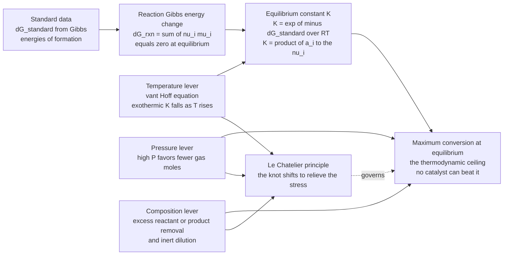

# ⚖️ Chemical Reaction Equilibrium

> [!abstract] TL;DR
> **Chemical reaction equilibrium** is the thermodynamic *ceiling* on how far a reaction can proceed — the maximum conversion attainable, set not by your catalyst or your patience but by a single number, the **equilibrium constant** $K = \exp(-\Delta G_{rxn}^{\circ}/RT)$. A reaction runs until the mixture's total **Gibbs energy** is minimized; at that point $\Delta G_{rxn}=0$ and the activities (or fugacities) of products and reactants lock into the ratio $K = \prod_i a_i^{\nu_i}$. Thermodynamics fixes *where the knot settles*; **kinetics** decides only *how fast* you get there. Three levers move the ceiling, and the **van 't Hoff equation** and **Le Chatelier's principle** quantify each: heat an exothermic reaction and $K$ falls (conversion retreats); squeeze a gas reaction that makes fewer molecules and conversion advances; flood the reactor with a reactant or strip out a product and conversion is driven forward. This is precisely why the ammonia plant runs *hot* (for rate) **and** at *crushing pressure* (to claw back the conversion that heat costs) — a compromise dictated entirely by equilibrium.

## Intuition

**Analogy:** A reversible reaction is a **tug-of-war** between the forward and backward reactions pulling on the same rope. Thermodynamics does not care how *fast* the rope moves back and forth — that is the job of kinetics. It cares only about **where the knot finally settles**: the equilibrium. And it hands you one number, the equilibrium constant $K$, that fixes exactly where the knot rests — and therefore the *maximum conversion you can ever reach*, no matter how clever your catalyst. A catalyst is a better-oiled pulley: it lets the rope reach that resting point sooner, but it cannot move the resting point one inch.

Even better, thermodynamics tells you which levers *do* move the knot. **Heat up an exothermic reaction** and the equilibrium retreats — you are adding to a side that already has heat to spare, so the system pulls back toward reactants. **Squeeze a gas reaction that makes fewer molecules** and the equilibrium advances — the system relieves the pressure by collapsing into fewer gas molecules. That qualitative "the system pushes back against whatever you do to it" is **Le Chatelier's principle** — the *intuition*. The equilibrium constant $K$ and the Gibbs energy are the *exact math* underneath it. Once you feel the tug-of-war, the ammonia reactor's strange recipe of high heat and extreme pressure stops looking arbitrary and starts looking inevitable.

---

## How It Works

### Core Mechanics

For a general reaction $\nu_A A + \nu_B B \rightleftharpoons \nu_C C + \nu_D D$ (stoichiometric coefficients $\nu_i$ taken **positive for products, negative for reactants**), equilibrium is not a truce where the reaction stops — it is the composition that **minimizes the total Gibbs energy** $G$ of the mixture at fixed $T$ and $P$.

1. **The equilibrium criterion — minimize $G$.** As the reaction extent $\xi$ advances, $G$ falls, bottoms out, and would rise again if the reaction overshot. The bottom of that valley is equilibrium, defined by $\left(\partial G / \partial \xi\right)_{T,P} = \sum_i \nu_i \mu_i = 0$. The quantity $\Delta G_{rxn} = \sum_i \nu_i \mu_i$ is the **reaction Gibbs energy**; it is *zero at equilibrium* (the valley floor is flat), negative when the reaction spontaneously runs forward, and positive when it runs backward.

2. **From $\Delta G^{\circ}$ to $K$.** Writing each chemical potential relative to a standard state, $\mu_i = \mu_i^{\circ} + RT\ln a_i$, and setting $\sum_i \nu_i \mu_i = 0$ gives the master result: $\Delta G_{rxn}^{\circ} = -RT\ln K$, or equivalently $\boxed{K = \exp\!\left(-\Delta G_{rxn}^{\circ}/RT\right)}$. The **equilibrium constant** $K = \prod_i a_i^{\nu_i}$ is a pure number fixed by temperature alone (through $\Delta G^{\circ}$), and it pins the ratio of product to reactant activities that *must* hold at equilibrium.

3. **Activities make it concrete.** For an **ideal gas**, $a_i = P_i/P^{\circ} = y_i P/P^{\circ}$, so $K$ becomes a ratio of partial pressures — and, crucially, carries a factor $(P/P^{\circ})^{\sum_i \nu_i}$ that couples $K$ to total pressure when the mole count changes. For **non-ideal** systems, activities carry fugacity coefficients $\phi_i$ (gases) or activity coefficients $\gamma_i$ (liquids). Substituting the composition in terms of a single **conversion** $X$ (or extent $\xi$) turns "$K = \prod a_i^{\nu_i}$" into one algebraic equation to solve for the **equilibrium conversion**.

4. **$K$ sets the ceiling, kinetics sets the speed.** $K$ is computed purely from thermodynamic data (standard Gibbs energies of formation) and is completely independent of mechanism, catalyst, or reactor type. A catalyst lowers the activation barrier and lets you *reach* equilibrium faster, but the equilibrium conversion it approaches is the *same* value $K$ dictates. This is the fundamental division of labour: **equilibrium = how far, kinetics = how fast.**

5. **Shifting the ceiling (Le Chatelier, quantified).**
   - **Temperature** — the **van 't Hoff equation** $\dfrac{d\ln K}{dT} = \dfrac{\Delta H_{rxn}^{\circ}}{RT^2}$. For an **exothermic** reaction ($\Delta H^{\circ}<0$), $K$ *falls* as $T$ rises, so equilibrium conversion drops; for an **endothermic** reaction, $K$ climbs with $T$. Plotting $\ln K$ against $1/T$ gives a straight line of slope $-\Delta H_{rxn}^{\circ}/R$.
   - **Pressure** — for a gas reaction, raising $P$ shifts equilibrium toward the side with **fewer moles** (because $K$ carries $(P/P^{\circ})^{\sum \nu_i}$). Mole-reducing reactions are favoured by high pressure; mole-increasing ones are hurt by it.
   - **Composition** — feeding an **excess reactant** or continuously **removing product** drives conversion forward; adding **inerts** dilutes partial pressures and (for mole-increasing reactions) can help, or (for mole-reducing ones under fixed total pressure) hurt.

6. **Multiple and simultaneous reactions.** When several reactions occur at once, you cannot track them with a single $K$. The robust approach is direct **Gibbs energy minimization**: minimize $G = \sum_i n_i \mu_i$ over all species mole numbers subject to elemental (atom) balance constraints — the method process simulators use for combustion, reforming, and complex reaction networks.

### Flow / Architecture



---

## Key Concepts

### Secondary Level

- **Reactions can go backwards too.** Many reactions are **reversible**: products can turn back into reactants. When the two directions run at the same rate, the amounts stop changing — that balance point is **equilibrium**.
- **There is a limit to how much you can make.** No matter how good your catalyst or how long you wait, a reaction can only convert so much of its reactants — equilibrium sets a **ceiling**. A catalyst helps you reach the ceiling faster; it cannot raise it.
- **You can nudge the balance.** **Le Chatelier's principle:** if you disturb a reaction at equilibrium, it shifts to push back. Add more reactant, and it makes more product. Remove product, and it makes more to replace it. Squeeze a gas reaction, and it shifts toward fewer gas molecules.
- **Heat is a reactant or a product too.** For a reaction that gives off heat, adding heat (raising temperature) pushes the reaction *backward* — which is why some reactions actually get *worse* when you heat them up.

### Undergraduate Level

- **The equilibrium constant.** $\Delta G_{rxn}^{\circ} = -RT\ln K \;\Rightarrow\; K = \exp(-\Delta G_{rxn}^{\circ}/RT)$, with $\Delta G_{rxn}^{\circ} = \sum_i \nu_i \Delta G_{f,i}^{\circ}$ from tabulated standard Gibbs energies of formation. $K$ depends on **temperature only**.
- **Reaction quotient and direction.** At any (non-equilibrium) composition, evaluate $Q = \prod_i a_i^{\nu_i}$: if $Q<K$ the reaction runs **forward**, if $Q>K$ it runs **backward**, and $Q=K$ is equilibrium. (Note $\Delta G_{rxn} = \Delta G_{rxn}^{\circ} + RT\ln Q = RT\ln(Q/K)$.)
- **Ideal-gas equilibrium.** With $a_i = y_i P/P^{\circ}$, $K = \left(\prod_i y_i^{\nu_i}\right)\left(P/P^{\circ}\right)^{\sum_i \nu_i}$. The pressure factor $\sum_i \nu_i = \Delta n_{gas}$ is the whole story of the pressure effect.
- **Solving for conversion.** Express every mole fraction $y_i$ in terms of one conversion $X$ using a stoichiometry (ICE) table, substitute into $K$, and solve the resulting algebraic equation for the **equilibrium conversion** $X_{eq}$.
- **Van 't Hoff (the temperature lever).** $\dfrac{d\ln K}{dT} = \dfrac{\Delta H_{rxn}^{\circ}}{RT^2}$; integrated with $\Delta H^{\circ}$ approximately constant, $\ln\dfrac{K_2}{K_1} = -\dfrac{\Delta H_{rxn}^{\circ}}{R}\left(\dfrac{1}{T_2}-\dfrac{1}{T_1}\right)$ — a straight line of $\ln K$ versus $1/T$ with slope $-\Delta H^{\circ}/R$.
- **The kinetics–thermodynamics conflict.** For an exothermic reaction, *equilibrium* conversion falls with $T$ while the *rate* rises with $T$ (Arrhenius). The economic operating point is a **compromise temperature** where the reactor produces the most product per pass — high enough to be fast, low enough that the ceiling has not collapsed.

### Graduate Level

- **Real-fluid equilibrium.** Replace pressures with **fugacities**, $a_i = \hat{f}_i / f_i^{\circ} = \hat{\phi}_i y_i P / P^{\circ}$, with $\hat{\phi}_i$ from a cubic equation of state (Peng–Robinson, SRK). At the extreme pressures of ammonia or methanol synthesis, ignoring $\hat{\phi}_i$ mis-predicts conversion badly — non-ideality is not a correction, it is decisive.
- **Temperature dependence done right.** $\Delta H_{rxn}^{\circ}(T)$ is *not* constant; integrate $\Delta C_p^{\circ}(T)$ (Kirchhoff's law) so that $\Delta G_{rxn}^{\circ}(T)/RT = \Delta G^{\circ}(T_{ref})/RT_{ref} - \int \Delta H^{\circ}(T)/RT^2\,dT$. Process work uses the full polynomial $\ln K(T) = A + B/T + C\ln T + \dots$.
- **Gibbs energy minimization.** For $N$ species and $M$ elements, minimize $G(\mathbf{n}) = \sum_i n_i\left[\mu_i^{\circ} + RT\ln a_i\right]$ subject to $\sum_i a_{ki} n_i = b_k$ (element balances). Lagrange multipliers on the element constraints are the **element potentials**; this is how simulators (Aspen, Cantera, CEA) solve combustion, reforming, and multi-reaction equilibria without ever enumerating individual $K$'s.
- **Coupling to the second law.** $K$ is a compact restatement of entropy maximization for the isolated system: $\Delta G_{rxn}^{\circ} = \Delta H_{rxn}^{\circ} - T\Delta S_{rxn}^{\circ}$ shows the eternal tension between the **enthalpy** term (favouring the low-energy side) and the **entropy** term (favouring the high-disorder / high-mole side) — and temperature is the dial that decides who wins.
- **Adiabatic reaction equilibrium.** In a real adiabatic reactor, conversion and temperature are **coupled**: the heat released climbs the temperature, which lowers $K$, which caps conversion — the equilibrium curve and the energy-balance (adiabatic operating) line intersect at the actual reactor outlet, the basis of staged/inter-cooled reactor design.
- **Statistical-mechanical origin.** $K$ can be computed *ab initio* from molecular **partition functions**, $K = \prod_i (q_i/V)^{\nu_i}\,e^{-\Delta\varepsilon_0/kT}$ — reaction equilibrium is molecular energy-level bookkeeping, the same free-energy machinery that appears across the sciences.

---

## Python Demo

```python
# Chemical reaction equilibrium for AMMONIA SYNTHESIS:  N2 + 3 H2 <=> 2 NH3
#   exothermic (dH_rxn < 0)  and  mole-reducing (4 gas moles -> 2), so it is the
#   textbook case where BOTH levers bite:
#     * raising T lowers K  -> equilibrium conversion FALLS (van't Hoff)
#     * raising P favors fewer moles -> equilibrium conversion RISES (Le Chatelier)
#
# We (a) compute equilibrium conversion vs TEMPERATURE at several PRESSURES,
#    (b) draw the van't Hoff line ln K vs 1/T (slope = -dH/R) and the equilibrium
#        COMPOSITION vs temperature, and (c) expose the classic kinetics-vs-
#        thermodynamics OPTIMUM that forces a compromise operating temperature.
#
# Requires: numpy, matplotlib
import numpy as np
import matplotlib.pyplot as plt

R = 8.314                      # J/mol/K
# --- standard thermodynamic data for N2 + 3H2 <=> 2NH3 (per mole of reaction) ---
dG_std = -32800.0              # J/mol at T_ref  (2 * dGf(NH3) = 2*(-16.4 kJ/mol))
dH_std = -91800.0             # J/mol           (2 * dHf(NH3) = 2*(-45.9 kJ/mol)) exothermic
T_ref  = 298.15               # K
lnK_ref = -dG_std / (R * T_ref)   # ln K at the reference temperature

def lnK(T):
    """van't Hoff with dH assumed constant: ln K(T) linear in 1/T, slope -dH/R."""
    return lnK_ref - (dH_std / R) * (1.0 / T - 1.0 / T_ref)

# ---- equilibrium relation, ideal gas, stoichiometric feed 1 N2 + 3 H2 ----
#   conversion X of N2:  N2=1-X,  H2=3(1-X),  NH3=2X,  total=4-2X
#   K = [y_NH3^2 / (y_N2 * y_H2^3)] * (P/P0)^(-2)   with P0 = 1 bar
#   => K * P^2 = 4 X^2 (4-2X)^2 / (27 (1-X)^4) == LHS(X), monotincreasing on (0,1)
def LHS(X):
    return 4.0 * X**2 * (4.0 - 2.0 * X)**2 / (27.0 * (1.0 - X)**4)

def X_eq(T, P_bar):
    """Solve for equilibrium conversion by bisection (LHS is monotonic in X)."""
    rhs = np.exp(lnK(T)) * P_bar**2
    lo, hi = 1e-12, 1.0 - 1e-12
    for _ in range(80):
        mid = 0.5 * (lo + hi)
        if LHS(mid) < rhs:
            lo = mid
        else:
            hi = mid
    return 0.5 * (lo + hi)

# ================================ (a) X_eq vs T at several P ================================
T = np.linspace(500.0, 900.0, 400)                 # K
pressures = [1.0, 100.0, 300.0]                     # bar
Xvsp = {P: np.array([X_eq(t, P) for t in T]) for P in pressures}

print("=== (a) Equilibrium conversion of N2 (exothermic + mole-reducing) ===")
for P in pressures:
    print(f"  P = {P:6.0f} bar :  X_eq(600 K) = {X_eq(600.0, P)*100:5.1f} % ,"
          f"  X_eq(800 K) = {X_eq(800.0, P)*100:5.1f} %   (falls as T rises)")

# ================================ (b) van't Hoff line & composition ================================
invT   = 1.0 / T
lnK_ln = lnK(T)
slope  = -dH_std / R                                # slope of ln K vs 1/T
print(f"\n=== (b) van't Hoff line ===\n  slope of ln K vs 1/T = -dH/R = {slope:8.1f} K"
      f"  (positive => exothermic: K rises as 1/T rises, i.e. as T falls)")

Pcomp = 200.0                                        # bar, composition study
Xc    = np.array([X_eq(t, Pcomp) for t in T])
tot   = 4.0 - 2.0 * Xc
y_N2  = (1.0 - Xc) / tot
y_H2  = 3.0 * (1.0 - Xc) / tot
y_NH3 = 2.0 * Xc / tot

# ================================ (c) kinetics vs thermodynamics OPTIMUM ================================
Ea = 100e3                                           # J/mol, schematic activation energy
rate_k = np.exp(-Ea / (R * T)); rate_k /= rate_k.max()   # Arrhenius, normalized 0..1
prod_proxy = rate_k * Xvsp[300.0]                    # "production" ~ rate * equilibrium ceiling
prod_proxy /= prod_proxy.max()
T_opt = T[np.argmax(prod_proxy)]
print(f"\n=== (c) kinetics-thermodynamics tradeoff (P = 300 bar) ===")
print(f"  equilibrium ceiling falls with T, reaction rate rises with T")
print(f"  best production per pass near T ~ {T_opt:.0f} K  (the compromise temperature)")

# ================================ plots ================================
fig, ax = plt.subplots(2, 2, figsize=(13, 9))
fig.suptitle("Chemical Reaction Equilibrium:  N2 + 3H2 <=> 2NH3  (exothermic, mole-reducing)",
             fontsize=14, fontweight="bold")

# A: equilibrium conversion vs T, family of pressures
axA = ax[0, 0]
for P, col in zip(pressures, ("#d62728", "#ff7f0e", "#2ca02c")):
    axA.plot(T, Xvsp[P] * 100, lw=2.5, color=col, label=f"P = {int(P)} bar")
axA.set_xlabel("temperature  [K]"); axA.set_ylabel("equilibrium conversion of N2  [%]")
axA.set_title("A. K falls with T (van't Hoff) -> conversion drops;\nhigher P claws it back (Le Chatelier)")
axA.legend(loc="upper right", fontsize=9); axA.grid(alpha=0.3); axA.set_ylim(0, 100)

# B: van't Hoff line  ln K vs 1/T
axB = ax[0, 1]
axB.plot(invT * 1e3, lnK_ln, lw=2.5, color="#1f77b4")
axB.set_xlabel("1000 / T  [1/K]"); axB.set_ylabel("ln K")
axB.set_title(f"B. van't Hoff line: ln K vs 1/T\nstraight line, slope = -dH/R = {slope:.0f} K > 0")
axB.grid(alpha=0.3)
axB.annotate("exothermic:\nK grows as T falls", xy=(invT.max()*1e3, lnK_ln.max()),
             xytext=(0.55, 0.75), textcoords="axes fraction", fontsize=9,
             arrowprops=dict(arrowstyle="->", color="gray"))

# C: equilibrium composition vs T at fixed P
axC = ax[1, 0]
axC.plot(T, y_NH3, lw=2.5, color="#9467bd", label="y(NH3) product")
axC.plot(T, y_N2,  lw=2.0, color="#8c564b", label="y(N2)")
axC.plot(T, y_H2,  lw=2.0, color="#17becf", label="y(H2)")
axC.set_xlabel("temperature  [K]"); axC.set_ylabel("equilibrium mole fraction")
axC.set_title(f"C. Equilibrium composition shifts with T\n(P = {int(Pcomp)} bar): heat drives NH3 back apart")
axC.legend(loc="center right", fontsize=9); axC.grid(alpha=0.3); axC.set_ylim(0, 1)

# D: the compromise -- rate rises, ceiling falls, product peaks
axD = ax[1, 1]
axD.plot(T, Xvsp[300.0] * 100 / (Xvsp[300.0].max() * 100), lw=2.5, color="#2ca02c",
         label="equilibrium ceiling (normalized)")
axD.plot(T, rate_k, lw=2.5, color="#d62728", label="reaction rate (Arrhenius, norm.)")
axD.plot(T, prod_proxy, lw=3.0, color="#1f77b4", label="production per pass (product)")
axD.axvline(T_opt, ls="--", color="k", lw=1.2)
axD.text(T_opt + 6, 0.15, f"optimum\n~ {int(T_opt)} K", fontsize=9)
axD.set_xlabel("temperature  [K]"); axD.set_ylabel("normalized (0 to 1)")
axD.set_title("D. Why the ammonia reactor runs hot AND at high P:\nkinetics up, equilibrium down -> a compromise T")
axD.legend(loc="upper right", fontsize=8); axD.grid(alpha=0.3)

plt.tight_layout(rect=[0, 0, 1, 0.95])
plt.show()
```

Running this prints the conversion tables and the van 't Hoff slope, then draws four panels. Panel **A** is the headline: because the reaction is exothermic, $K$ falls as temperature rises, so the **equilibrium conversion collapses with heat** — yet cranking the **pressure** from 1 to 300 bar hauls the ceiling back up, because compressing four gas moles into two is exactly what Le Chatelier rewards. Panel **B** is the van 't Hoff line, ruler-straight in $\ln K$ versus $1/T$ with the positive slope $-\Delta H^{\circ}/R$ that brands the reaction as exothermic. Panel **C** shows the equilibrium **composition** itself sliding as temperature rises: the ammonia mole fraction shrinks while nitrogen and hydrogen re-appear. Panel **D** is the punchline of the whole note — the reaction *rate* climbs with temperature while the equilibrium *ceiling* falls, and their product peaks at an intermediate **compromise temperature**. That single crossing is why every ammonia converter on Earth runs hot (for speed) *and* under crushing pressure (to rescue the conversion the heat destroyed).

---

## Real-World Applications

> **Example — the Haber–Bosch ammonia process.** $N_2 + 3H_2 \rightleftharpoons 2NH_3$ is the reaction that feeds roughly half of humanity, and its entire operating recipe is dictated by equilibrium. It is **exothermic**, so thermodynamics *wants* it cold — but cold, the reaction is hopelessly slow even over an iron catalyst, so plants run at a **compromise ~400–500 °C**. That heat guts the equilibrium conversion, so plants fight back with the other lever: because the reaction turns **four gas moles into two**, they run at **150–300 bar**, where Le Chatelier restores much of the lost conversion. Even so, single-pass conversion is only ~15 %, which is why the outlet is cooled to condense out liquid ammonia and the unreacted $N_2/H_2$ is recycled. High temperature *and* high pressure *and* recycle — every one of those choices is a direct consequence of the equilibrium constant.

- **Methanol synthesis** ($CO + 2H_2 \rightleftharpoons CH_3OH$). Exothermic and strongly mole-reducing (3 moles to 1), so like ammonia it runs at high pressure and a moderated temperature; equilibrium sets the per-pass ceiling and drives the recycle loop.
- **Water–gas shift** ($CO + H_2O \rightleftharpoons CO_2 + H_2$). Mildly exothermic but with **no change in mole count** ($\Delta n = 0$), so pressure barely matters — instead industry uses *two* reactors, a hot high-temperature shift for speed followed by a cool low-temperature shift to push the equilibrium toward more hydrogen. A textbook demonstration that the levers depend on $\Delta H$ and $\Delta n$.
- **Sulfuric acid / SO₃ synthesis** ($2SO_2 + O_2 \rightleftharpoons 2SO_3$). Exothermic and mole-reducing; the Contact process uses multiple catalyst beds with **inter-stage cooling** so each bed re-approaches the shifting equilibrium curve, and removes $SO_3$ between passes to drive overall conversion above 99.7 %.
- **Steam methane reforming** ($CH_4 + H_2O \rightleftharpoons CO + 3H_2$). Endothermic and mole-*increasing*, so it wants exactly the opposite conditions from ammonia — **high temperature** and, thermodynamically, *low* pressure (though pressure is kept high for downstream reasons, paid for with extra temperature). The mirror image that proves the rules.
- **Process simulators.** Aspen Plus, Cantera, and NASA CEA compute equilibrium in combustion, gasification, and reforming by **Gibbs energy minimization** over dozens of species, giving the adiabatic flame composition and the theoretical conversion ceiling for reactor design.

---

## Common Pitfalls

- **Confusing equilibrium with rate.** The single most common error: assuming a catalyst or more time can push conversion past the equilibrium ceiling. It cannot. $K$ is set by thermodynamics; kinetics only changes *how fast* you reach it. A reaction can be thermodynamically favourable yet uselessly slow, or fast yet capped at low conversion — you always need *both* analyses.
- **Sign and reference errors in $\Delta G^{\circ}$.** $K = \exp(-\Delta G_{rxn}^{\circ}/RT)$ — drop the minus sign and $K$ inverts; forget that $\Delta G^{\circ}$ is per *mole of reaction as written* (doubling the equation squares $K$) and every number is wrong. Always pin the stoichiometry to the standard states.
- **Ignoring the pressure/mole-count factor.** For gases, $K$ carries $(P/P^{\circ})^{\Delta n}$. Students routinely write $K$ in terms of mole fractions only and forget the pressure term, then are baffled why pressure "does nothing" — it does nothing *only* when $\Delta n = 0$ (like water–gas shift).
- **Assuming $\Delta H_{rxn}^{\circ}$ is constant over a wide $T$ range.** The simple two-point van 't Hoff integration is fine over ~100 K, but across the hundreds of degrees between reference and reactor conditions, $\Delta C_p^{\circ}$ matters — use Kirchhoff's law or a proper $\ln K(T)$ correlation.
- **Using pressures instead of fugacities at high $P$.** At ammonia or methanol pressures (150–300 bar), the ideal-gas $K$ can be off by a large factor; real-gas fugacity coefficients from an equation of state are mandatory, not optional polish.
- **Reporting the wrong conversion in a recycle plant.** Equilibrium caps the *single-pass* conversion; the *overall* plant conversion is driven near completion by recycle. Quoting the ~15 % single-pass figure as the plant's yield (or vice-versa) mis-sizes every downstream unit.
- **Forgetting adiabatic heat feedback.** In an uncooled reactor the released heat raises $T$, which lowers $K$, which self-limits conversion. Sizing a reactor from an *isothermal* equilibrium at the inlet temperature over-predicts what an adiabatic bed can actually reach.

---

## Related Concepts

**Sibling notes in this vault (Chemical Engineering)** — this note fixes the *ceiling*; the neighbours supply the rest of the reactor story. *Chemical_Process_Thermodynamics* develops the fugacity/activity machinery and equations of state that make $K$ quantitative at process pressures; *Reaction_Kinetics_and_Rate_Laws* supplies the *rate* that decides how fast the ceiling is approached; *Chemical_Reaction_Engineering_Overview* and *Ideal_Reactors_Batch_CSTR_PFR* turn conversion targets into reactor volumes; and *Reactive_Systems_and_Combustion_Balances* uses Gibbs-energy minimization for multi-reaction and combustion equilibria.

**The science being scaled up (Chemistry vault)**
- [[Chemical_Equilibrium]] — the beaker-scale law of mass action, $K$, and $Q$ that this note lifts to industrial reactor design
- [[Chemical_Thermodynamics]] — enthalpy, entropy, and Gibbs energy of reaction, the raw material for computing $\Delta G_{rxn}^{\circ}$ and hence $K$
- [[Chemical_Kinetics]] — the rate side of the story; equilibrium sets *how far*, kinetics sets *how fast*
- [[Stoichiometry_and_the_Mole]] — the mole/extent bookkeeping behind every conversion and mole-fraction expression

**Physical foundations (Physics vault)**
- [[Thermodynamic_Potentials]] — why *Gibbs* energy is the potential minimized at constant $T$ and $P$, the exact basis of the equilibrium criterion
- [[Entropy_and_Second_Law]] — equilibrium as entropy maximization; the $-T\Delta S$ term that fights enthalpy in $\Delta G = \Delta H - T\Delta S$
- [[Laws_of_Thermodynamics]] — the first and second laws under the reaction Gibbs energy and the van 't Hoff temperature dependence

**Deeper connection**
- [[Partition_Functions_and_Free_Energy_in_ML]] — the same free-energy / $\exp(-\Delta G/RT)$ Boltzmann bookkeeping that computes $K$ from molecular partition functions and reappears across statistical modelling

---

## Review Questions

**Secondary**
1. A company advertises a "miracle catalyst" that, they claim, lets an exothermic reaction reach 90 % conversion where the old process reached only 40 %. Using the idea that equilibrium is a *ceiling* set by temperature, explain why this claim should make you suspicious — and what a catalyst genuinely *can* change.

**Undergraduate**
2. For $N_2 + 3H_2 \rightleftharpoons 2NH_3$ (exothermic, four gas moles to two), you must choose a temperature and pressure for the reactor. Using the van 't Hoff equation and the pressure factor $(P/P^{\circ})^{\Delta n}$, explain in which direction each variable moves the *equilibrium* conversion — and then explain why the plant nonetheless runs *hot*, requiring high pressure to compensate. What does kinetics have to do with the choice?

**Graduate**
3. A reforming reactor runs adiabatically. Sketch (qualitatively) the equilibrium-conversion-versus-temperature curve and the energy-balance (adiabatic operating) line on the same axes, and explain why their intersection gives the actual outlet state. Then explain how staged beds with inter-stage cooling let a designer chase a *shifting* equilibrium to a far higher overall conversion than a single adiabatic bed could reach, and why direct **Gibbs energy minimization** — rather than a single $K$ — is the right tool once several reactions occur at once.

---

## Sources

- J. M. Smith, H. C. Van Ness & M. M. Abbott — *Introduction to Chemical Engineering Thermodynamics*, 8th ed. (McGraw-Hill, 2018), Ch. 13, Chemical-Reaction Equilibria
- S. I. Sandler — *Chemical, Biochemical, and Engineering Thermodynamics*, 5th ed. (Wiley, 2017)
- H. S. Fogler — *Elements of Chemical Reaction Engineering*, 6th ed. (Prentice Hall, 2020)
- M. D. Koretsky — *Engineering and Chemical Thermodynamics*, 2nd ed. (Wiley, 2013)
- R. M. Felder, R. W. Rousseau & L. G. Bullard — *Elementary Principles of Chemical Processes*, 4th ed. (Wiley, 2015)

---

#chemical-engineering #reaction-equilibrium #equilibrium-constant #van't-hoff #le-chatelier
