# 🌡️ Equations of State and PVT Behavior

> [!abstract] TL;DR
> An **equation of state (EOS)** is a single formula relating **pressure, volume, and temperature** so you can predict any one property from the other two — and from there compute densities, phase behavior, and every energy quantity a process needs. The **ideal-gas law** $PV = nRT$ is the naive first guess (molecules as non-interacting points); the **compressibility factor** $Z = \dfrac{PV}{nRT}$ measures how far reality strays from it ($Z = 1$ is ideal). Adding two dashes of realism — molecules take up **space** ($b$) and **attract** each other ($a$) — gives the **van der Waals** equation and the industrial-workhorse **cubic EOS** (**SRK**, **Peng-Robinson**), which capture liquid density, vapor pressure, and the **critical point** in one tidy expression, and power every process simulator on Earth.

## Intuition — analogy FIRST

An equation of state is the **personality profile** of a fluid: a formula that pins down how its pressure, volume, and temperature move together, so that knowing two of them predicts the third.

The **ideal-gas law** is the naive first-date impression — it pretends molecules are dimensionless dots that never notice each other. That caricature works for thin, hot gases where molecules are far apart and rarely interact. But it fails spectacularly near **condensation**, where molecules crowd together and start to cling: the gas condenses into a liquid that the ideal law says can never exist.

Better equations add the two traits the caricature ignored. **Molecules take up space** (you cannot compress a fluid to zero volume — there is a hard floor set by the parameter $b$), and **molecules attract each other** (a stickiness $a$ that pulls them together and, at the right temperature, makes them condense). With just those two dashes of realism, van der Waals' one tidy formula suddenly predicts **boiling**, **liquid density**, and the **critical point** — the special temperature and pressure where liquid and gas become indistinguishable, and the fluid stops having a "surface" at all.

---

## How It Works

### Core mechanics

1. **State the problem.** Process design constantly asks: *what is the density of this stream? will it be liquid, vapor, or both? how much enthalpy must I add to heat it?* All of these follow from a $P$–$V$–$T$ relation plus calculus, so a good EOS is the computational engine behind every answer.
2. **Start ideal.** $PV = nRT$ treats molecules as points with no forces. It is exact in the limit of **low pressure / high temperature**, and it is the reference against which everything else is measured through $Z = PV/nRT$.
3. **Add finite size.** Real molecules cannot overlap, so the volume available to move in is $(V - nb)$, not $V$. This makes $Z$ rise **above 1** at high pressure (repulsion dominates).
4. **Add attraction.** Intermolecular attraction lowers the pressure a real gas exerts by a term $\propto a/V^2$. This pulls $Z$ **below 1** at moderate pressure (attraction dominates) and is what allows a liquid phase to appear at all.
5. **Solve the cubic.** Written out, van der Waals / SRK / Peng-Robinson are **cubic in volume**: at a given $P$ and $T$ they can have **three real roots** — the smallest is the **liquid** volume, the largest is the **vapor** volume, and the middle root is physically unstable. Below the critical temperature a horizontal **saturation line** (fixed by the **Maxwell equal-area rule**) connects the liquid and vapor roots at the true **vapor pressure**.
6. **Extract everything else.** Integrating the EOS gives **departure functions** (how much enthalpy, entropy, and $C_p$ differ from ideal-gas values) and **fugacity** — the "effective pressure" whose equality between phases is the condition for vapor-liquid equilibrium.

### Flow / Architecture

```mermaid
graph LR
    STATE["Fluid state<br/>P, V, T<br/>know two, predict one"]
    EOS["Equation of State<br/>one formula links P, V, T"]
    IDEAL["Ideal gas<br/>PV = nRT<br/>points, no attraction"]
    REAL["Real fluid<br/>add molecular volume b<br/>add attraction a"]
    CUBIC["Cubic EOS<br/>van der Waals to SRK to Peng-Robinson<br/>solve cubic in V"]
    PRED["Predicts<br/>liquid and vapor density<br/>critical point and Z factor"]

    STATE --> EOS
    EOS --> IDEAL
    IDEAL -->|"crowding and clinging<br/>break the model"| REAL
    REAL --> CUBIC
    CUBIC --> PRED

    style STATE fill:#2563eb,color:#fff
    style EOS fill:#7c3aed,color:#fff
    style IDEAL fill:#0891b2,color:#fff
    style REAL fill:#059669,color:#fff
    style CUBIC fill:#ea580c,color:#fff
    style PRED fill:#dc2626,color:#fff
```



---

## Key Concepts / Details

### Secondary Level

- **Pressure, volume, temperature.** For a fixed amount of gas these three cannot be set independently — squeeze the volume and the pressure rises; heat it and it pushes harder. An EOS is the rulebook for that trade.
- **Ideal-gas law $PV = nRT$.** The simplest EOS. $R$ is the universal gas constant. It assumes molecules are tiny, far apart, and indifferent to one another — a great model for air at room conditions.
- **When it breaks.** Compress a gas hard or cool it toward its boiling point and molecules start bumping and sticking. The ideal law then over-predicts the volume, sometimes badly.
- **Compressibility factor $Z$.** A one-number report card: $Z = \dfrac{PV}{nRT}$. If $Z = 1$ the gas is behaving ideally; $Z < 1$ means attraction is winning, $Z > 1$ means the molecules' own volume is winning.

### Undergraduate Level

- **Van der Waals equation.** The first EOS to predict a liquid phase:
$$\left(P + \frac{a n^2}{V^2}\right)(V - nb) = nRT.$$
$b$ is the **excluded volume** (finite molecular size), $a$ is the **attraction** parameter. Multiplied out it is a **cubic in $V$**.
- **Critical point.** The critical isotherm has an **inflection with a horizontal tangent**, so both derivatives vanish:
$$\left(\frac{\partial P}{\partial V}\right)_{T_c} = 0, \qquad \left(\frac{\partial^2 P}{\partial V^2}\right)_{T_c} = 0.$$
These two conditions fix $a$ and $b$ from measured $T_c$ and $P_c$. For van der Waals $a = \frac{27 R^2 T_c^2}{64 P_c}$, $b = \frac{R T_c}{8 P_c}$, and the **critical compressibility** is a universal $Z_c = 3/8 = 0.375$ (real fluids sit near $0.27$–$0.29$, exposing the model's limits).
- **The van der Waals loop and the Maxwell rule.** A sub-critical isotherm wiggles (an unphysical S-shape). The real fluid replaces the wiggle with a **flat coexistence line** at the vapor pressure $P^{\text{sat}}$, chosen so the two areas the line cuts off are **equal** (the **Maxwell equal-area construction**). The line's endpoints are the **saturated liquid** and **saturated vapor** volumes.
- **Corresponding states and the acentric factor $\omega$.** In **reduced** variables $T_r = T/T_c$, $P_r = P/P_c$, $V_r = V/V_c$, many fluids fall on nearly the same $Z$-curve (**two-parameter corresponding states**). The **acentric factor** $\omega$ (a measure of molecular non-sphericity, defined from the vapor pressure at $T_r = 0.7$) is a third parameter that sharply improves accuracy — it is the input SRK and PR use to tune their attraction term.
- **Cubic EOS workhorses.** **Soave-Redlich-Kwong (SRK, 1972)** and **Peng-Robinson (PR, 1976)** keep van der Waals' structure but reshape the attraction term with a temperature-dependent $\alpha(T, \omega)$ so they nail vapor pressures. PR gives $Z_c = 0.307$ and better liquid densities, making it the default for hydrocarbons and natural gas. Both are **analytically solvable** cubics, returning liquid and vapor roots in microseconds.
- **Virial EOS.** $Z = 1 + \dfrac{B(T)}{V_m} + \dfrac{C(T)}{V_m^2} + \dots$ — a power series in density whose coefficients $B, C$ have rigorous **statistical-mechanical** meaning (two-body, three-body interactions). Excellent at low-to-moderate density, but it does not describe the liquid phase, so it is a complement to cubics rather than a replacement.

### Graduate Level

- **Departure (residual) functions.** Enthalpy, entropy, and Gibbs energy of a real fluid are computed as *ideal-gas value + a departure term* obtained by integrating the EOS:
$$H - H^{\text{ig}} = \int_\infty^V \left[T\left(\frac{\partial P}{\partial T}\right)_V - P\right]dV + PV - RT.$$
This is how a simulator turns a $P$–$V$–$T$ correlation into the **energy balances** that size heat exchangers and compressors.
- **Fugacity and phase equilibrium.** The fugacity coefficient $\ln\hat\varphi_i = \frac{1}{RT}\int_V^\infty\!\left[\left(\frac{\partial P}{\partial n_i}\right)_{T,V,n_j} - \frac{RT}{V}\right]dV - \ln Z$ comes straight from the EOS. **Vapor-liquid equilibrium** is the condition $\hat f_i^{\,V} = \hat f_i^{\,L}$ for every component — the mathematical heart of **flash calculations**, distillation, and VLE.
- **Mixing rules.** To extend a pure-component cubic EOS to mixtures, the **van der Waals one-fluid rules** average parameters: $a_m = \sum_i\sum_j x_i x_j \sqrt{a_i a_j}\,(1 - k_{ij})$, $b_m = \sum_i x_i b_i$, where the **binary interaction parameter** $k_{ij}$ is fit to data. Modern **$G^E$-mixing rules** (Wong-Sandler, MHV) graft an activity-coefficient model onto the EOS for strongly non-ideal mixtures.
- **Volume translation.** A constant **Péneloux shift** corrects the liquid density a cubic EOS predicts without touching its (accurate) vapor-liquid equilibria — a cheap fix for the cubics' notoriously poor liquid volumes.
- **Beyond cubics.** For **polar, associating, or polymeric** fluids (water, alcohols, acids), cubics struggle. **SAFT** and **PC-SAFT** build the EOS from a statistical-mechanical perturbation of chain and association terms, and **CPA** (Cubic-Plus-Association) bolts hydrogen-bonding onto SRK. Cubics remain dominant for non-polar hydrocarbons because of their unbeatable speed-to-accuracy ratio.
- **Microscopic origin.** Every EOS is, in principle, $P = k_B T \left(\partial \ln \mathcal{Z}/\partial V\right)_T$ from the **partition function** $\mathcal{Z}$; van der Waals is the mean-field approximation to that exact statement, which is why its critical exponents match the classical (mean-field) universality class.

---

## Python Demo

```python
# PVT behavior from the van der Waals equation, in REDUCED variables.
# (a) P-V isotherms + the critical point + Maxwell equal-area construction.
# (b) Compressibility factor Z = PV/RT vs pressure, EOS vs ideal gas.
# Cubic roots via numpy (np.roots); Maxwell tie-line by hand-rolled bisection.
# No scipy.  Reduced form Pr = 8 Tr /(3 Vr - 1) - 3 / Vr**2 collapses ALL
# van der Waals fluids onto one universal curve (law of corresponding states);
# the critical point sits at (Vr, Pr, Tr) = (1, 1, 1) with Zc = 3/8 = 0.375.
import numpy as np
import matplotlib.pyplot as plt

def P_vdw(Vr, Tr):
    """Explicit reduced pressure from reduced volume and temperature."""
    return 8.0 * Tr / (3.0 * Vr - 1.0) - 3.0 / Vr**2

def vdw_roots(Pr, Tr):
    """Positive real reduced-volume roots of the cubic at fixed Pr, Tr.
       3 Pr Vr^3 - (Pr + 8 Tr) Vr^2 + 9 Vr - 3 = 0"""
    coeffs = [3.0 * Pr, -(Pr + 8.0 * Tr), 9.0, -3.0]
    r = np.roots(coeffs)
    real = r[np.abs(r.imag) < 1e-9].real
    return np.sort(real[real > 1.0 / 3.0])      # Vr must clear the b-limit (1/3)

def F(Vr, Tr):
    """Analytic integral of P_vdw over Vr, used in the equal-area rule."""
    return (8.0 * Tr / 3.0) * np.log(3.0 * Vr - 1.0) + 3.0 / Vr

def maxwell_psat(Tr):
    """Saturation pressure + saturated liquid/vapor volumes by equal-area
       bisection: at coexistence  Psat*(Vv - Vl) = integral of P over [Vl, Vv]."""
    Vgrid = np.linspace(0.36, 12.0, 60000)
    Pgrid = P_vdw(Vgrid, Tr)
    dP = np.diff(Pgrid)
    turns = np.where(dP[:-1] * dP[1:] < 0)[0]        # loop min & max indices
    P_ext = np.sort(Pgrid[turns + 1])
    lo, hi = max(P_ext.min(), 1e-4), P_ext.max()     # bracket Psat inside loop
    for _ in range(100):
        mid = 0.5 * (lo + hi)
        roots = vdw_roots(mid, Tr)
        if len(roots) < 3:
            hi = mid
            continue
        Vl, Vv = roots[0], roots[-1]
        g = (F(Vv, Tr) - F(Vl, Tr)) - mid * (Vv - Vl)
        lo, hi = (mid, hi) if g > 0 else (lo, mid)
    Psat = 0.5 * (lo + hi)
    roots = vdw_roots(Psat, Tr)
    return Psat, roots[0], roots[-1]

def Z_vdw(Pr, Tr, phase="vapor"):
    """Compressibility factor Z = 0.375 * Pr * Vr / Tr (van der Waals, reduced)."""
    roots = vdw_roots(Pr, Tr)
    Vr = roots[-1] if phase == "vapor" else roots[0]
    return 0.375 * Pr * Vr / Tr

fig, (axA, axB) = plt.subplots(1, 2, figsize=(13, 5.5))

# ---- (a) reduced isotherms + Maxwell tie-line -------------------------------
Vr = np.linspace(0.36, 4.0, 3000)
for Tr, col in [(0.85, "#1f77b4"), (0.90, "#2ca02c"), (0.95, "#ff7f0e"),
                (1.00, "#d62728"), (1.10, "#9467bd")]:
    axA.plot(Vr, P_vdw(Vr, Tr), color=col, lw=1.8, label=f"Tr = {Tr:.2f}")

Trm = 0.90
Psat, Vl, Vv = maxwell_psat(Trm)
axA.hlines(Psat, Vl, Vv, color="k", lw=1.4, ls="--")
axA.plot([Vl, Vv], [Psat, Psat], "ko", ms=6)
axA.annotate("sat. liquid", (Vl, Psat), textcoords="offset points",
             xytext=(-30, 12), fontsize=8)
axA.annotate("sat. vapor", (Vv, Psat), textcoords="offset points",
             xytext=(4, -16), fontsize=8)
axA.plot(1, 1, "k*", ms=16, label="critical point")
axA.set_xlim(0.3, 4.0); axA.set_ylim(0, 2.2)
axA.set_xlabel("reduced volume  Vr = V / Vc")
axA.set_ylabel("reduced pressure  Pr = P / Pc")
axA.set_title("van der Waals isotherms + Maxwell equal-area rule")
axA.legend(fontsize=8, loc="upper right"); axA.grid(alpha=0.3)

# ---- (b) compressibility factor Z vs pressure -------------------------------
Prg = np.linspace(0.05, 8.0, 300)
for Tr, col in [(1.0, "#d62728"), (1.3, "#ff7f0e"), (2.0, "#1f77b4")]:
    Z = np.array([Z_vdw(p, Tr, "vapor") for p in Prg])
    axB.plot(Prg, Z, color=col, lw=1.8, label=f"Tr = {Tr:.1f}")
axB.axhline(1.0, color="k", ls=":", lw=1.5, label="ideal gas  Z = 1")
axB.set_xlabel("reduced pressure  Pr = P / Pc")
axB.set_ylabel("compressibility factor  Z = PV / RT")
axB.set_title("Real-gas deviation from ideality")
axB.set_ylim(0, 1.8); axB.legend(fontsize=8); axB.grid(alpha=0.3)

plt.tight_layout()
plt.savefig("pvt_eos.png", dpi=120)
plt.show()
print(f"Maxwell @ Tr={Trm}:  Psat={Psat:.4f}  Vr_liq={Vl:.4f}  Vr_vap={Vv:.4f}")
# -> Z dips below 1 (attraction) then climbs above 1 (excluded volume);
#    the tie-line's endpoints ARE the saturated liquid and vapor densities.
```

The left panel shows the smooth **supercritical** curves, the **critical isotherm** with its inflection at $(1, 1)$, and the sub-critical **van der Waals loop** cured by the horizontal Maxwell line into a vapor pressure and two saturated volumes. The right panel shows $Z$ dipping below the ideal-gas line (attraction) at moderate pressure, then rising above it (finite molecular size) at high pressure — the signature shape of the generalized compressibility chart.

---

## Real-World Applications

> **Example — Peng-Robinson inside every process simulator.** When an engineer builds a natural-gas processing or refinery flowsheet in **Aspen Plus** or **Aspen HYSYS**, the default thermodynamic package for hydrocarbon streams is almost always **Peng-Robinson** (or SRK). For each stream the simulator solves the PR cubic at the local $T$ and $P$, takes the liquid and vapor roots, and from them computes **densities** (to size vessels, pumps, and pipe diameters), **fugacities** (to converge every distillation stage and flash drum), and **departure enthalpies** (to close the energy balance around reboilers and condensers). The same cubic EOS that plots so cleanly in the demo above is, quite literally, run millions of times per flowsheet.

- **Oil and gas / reservoir engineering.** PR-based EOS models predict how a reservoir fluid drops out condensate as pressure falls, sizing separators and pipelines.
- **Cryogenics and LNG.** Liquefaction of natural gas and air separation rely on accurate low-temperature $P$–$V$–$T$ and phase behavior, where cubic EOS (with tuned $k_{ij}$) are standard.
- **Supercritical extraction.** Decaffeination and essential-oil extraction exploit **supercritical CO$_2$** (above $T_c = 31\,^\circ$C, $P_c = 73.8$ bar); an EOS predicts the tunable solvent density that makes the process work.
- **Refrigeration and heat pumps.** Refrigerant charge, cycle efficiency, and compressor duty all trace back to the working fluid's EOS.

---

## Common Pitfalls

- **Trusting the ideal-gas law near condensation.** $PV = nRT$ can be off by tens of percent at high pressure or near the saturation curve. Always check whether $Z$ is close to 1 before assuming ideality.
- **Picking the wrong cubic root.** A sub-critical cubic returns three roots; the **smallest real root is liquid**, the **largest is vapor**, and the middle root is spurious. Selecting the wrong one silently corrupts density and enthalpy. Compare the phases' Gibbs energy (fugacity) to decide which is stable.
- **Believing cubic-EOS liquid densities.** SRK and PR are excellent for vapor pressures and vapor densities but can be 5–15% wrong for **liquid molar volumes**. Apply a **volume translation** (Péneloux shift) when density matters.
- **Applying cubics to polar / associating fluids.** Water, alcohols, and acids hydrogen-bond; a plain cubic misrepresents their phase behavior. Use CPA, SAFT/PC-SAFT, or an activity-coefficient model for the liquid phase instead.
- **Ignoring binary interaction parameters $k_{ij}$.** For mixtures, leaving $k_{ij} = 0$ can badly mispredict bubble points and azeotropes. Regress $k_{ij}$ against real VLE data.
- **Extrapolating near the critical point.** All classical cubics get the wrong critical exponents and are least reliable exactly where fluids are most sensitive — the near-critical region. Treat near-critical predictions with caution.

---

## Related Concepts

- [[Chemical_Thermodynamics]] — supplies the state functions (enthalpy, entropy, Gibbs energy) that an EOS turns into numbers through departure functions.
- [[Kinetic_Theory_of_Gases]] — the molecular picture (finite size, intermolecular forces) that motivates the $a$ and $b$ corrections to the ideal-gas law.
- [[Laws_of_Thermodynamics]] — the first and second laws are the rules an EOS is integrated against to obtain energy and fugacity.
- [[Thermodynamic_Potentials]] — Gibbs and Helmholtz energies are the potentials whose derivatives yield fugacity and the equilibrium conditions the EOS must satisfy.
- [[Classical_Statistical_Mechanics]] — the microscopic foundation: an EOS is a mean-field approximation to $P$ derived from the partition function.
- [[Partition_Functions_and_Free_Energy_in_ML]] — the same partition-function machinery ($Z$, free energy) underlies both fluid EOS and energy-based models.
- [[Phase_Equilibria_and_Colligative_Properties]] — the phase-boundary physics (vapor pressure, coexistence) that the Maxwell construction reproduces.
- [[Phase_Diagrams_and_the_Iron_Carbon_System]] — a materials-science analogue of the same coexistence-and-critical-point language applied to solids.

Within this vault, equations of state feed directly into the sibling notes on **Chemical_Process_Thermodynamics** (which applies departure functions to real process energy balances), **Vapor_Liquid_Equilibrium** (which uses EOS fugacities for flash and bubble/dew calculations), **Solution_Thermodynamics_and_Activity** (the liquid-phase complement for strongly non-ideal mixtures), and **Multicomponent_Phase_Behavior** (which extends single-fluid EOS to multi-component envelopes via mixing rules).

---

## Review Questions

1. **(Secondary)** The ideal-gas law works beautifully for air at room conditions but fails for the same air compressed to 300 bar or cooled toward liquefaction. In molecular terms, which two assumptions of the ideal model break down, and how does each one push the compressibility factor $Z$ away from 1?
2. **(Undergraduate)** A sub-critical van der Waals isotherm has an unphysical S-shaped loop. Explain what the **Maxwell equal-area construction** does to that loop, what physical quantities its endpoints represent, and why the middle of the three cubic roots is discarded.
3. **(Graduate)** You must model vapor-liquid equilibrium for (a) a natural-gas mixture of light hydrocarbons and (b) an ethanol-water mixture. Which EOS or thermodynamic approach would you choose for each, and what specific failure of a plain Peng-Robinson cubic makes it the wrong tool for the second case?

---

## Sources

- Smith, J.M., Van Ness, H.C., Abbott, M.M., & Swihart, M.T. *Introduction to Chemical Engineering Thermodynamics*, 8th ed. McGraw-Hill.
- Sandler, S.I. *Chemical, Biochemical, and Engineering Thermodynamics*, 5th ed. Wiley.
- Poling, B.E., Prausnitz, J.M., & O'Connell, J.P. *The Properties of Gases and Liquids*, 5th ed. McGraw-Hill.
- Elliott, J.R., & Lira, C.T. *Introductory Chemical Engineering Thermodynamics*, 2nd ed. Prentice Hall.
- Peng, D.-Y., & Robinson, D.B. (1976). "A New Two-Constant Equation of State." *Ind. Eng. Chem. Fundam.*, 15(1), 59–64.

---

#chemical-engineering #equation-of-state #PVT #peng-robinson #compressibility
