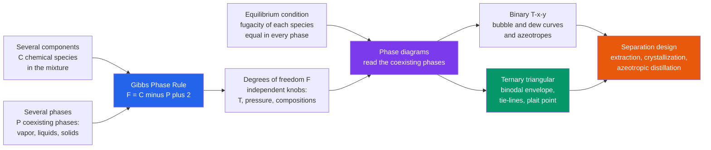

# ⚗️ Multicomponent Phase Behavior

> [!abstract] TL;DR
> **Multicomponent phase behavior** is the *map of who-goes-where* when several substances distribute themselves among several coexisting phases. Its master key is the **Gibbs phase rule**, $F = C - P + 2$: the number of independent intensive variables you may freely set (**degrees of freedom** $F$) equals the number of components $C$ minus the number of phases $P$ plus two. That single counting law explains why a pure liquid's boiling point is fixed once you fix pressure ($F=1$), why a triple point is invariant ($F=0$), and how much room a binary or ternary mixture leaves for tuning. The phases coexist under one thermodynamic condition — the **fugacity (escaping tendency) of every species is equal in every phase** — and the resulting equilibria are drawn as **phase diagrams**: binary $T\text{–}x\text{–}y$ plots with their azeotropes, and **ternary triangular diagrams** whose **binodal** curve encloses the two-phase region, whose **tie-lines** connect the two coexisting compositions, and whose **plait point** is where those two phases become identical. Reading these maps — with the **lever rule** to get phase amounts — is the everyday work of a separations engineer, because it tells you whether a **liquid–liquid extraction**, a **crystallization**, or an **azeotropic distillation** is even *possible*, and how to size it.

## Intuition

**Analogy:** Shake oil, water, and a splash of alcohol together in a jar, let it settle, and you get layers — but *which* molecules end up in *which* layer, and *how many* layers form at all, follows strict rules, not chance. The alcohol, being friendly with both, smears itself across both layers (more in the water, some in the oil); the oil and water stubbornly refuse to mix. Multicomponent phase behavior is exactly this map of who-goes-where when several substances and several phases coexist. Two beautifully simple ideas tame the apparent mess. First, **Gibbs' phase rule** counts your *degrees of freedom* — how many knobs like temperature, pressure, and composition you can freely turn before the system is fully pinned down — from nothing more than the number of components and the number of phases. Second, a **triangular diagram** lets you read, at a single glance, whether a three-way mixture will stay as one happy phase or split into two, and if it splits, exactly what those two phases contain.

That is not an academic parlor trick. It is the very knowledge that lets engineers design **extractions** (deliberately shake a solute out of one liquid into another), **crystallizations** (cool a solution until a pure solid drops out), and **complex distillations** (thread around azeotropes that ordinary distillation cannot cross). The phase diagram is the terrain map; the phase rule tells you how many directions you are free to walk.

---

## How It Works

### Core Mechanics

1. **Define components and phases.** A **component** ($C$) is an independently variable chemical species needed to specify the composition of every phase; a **phase** ($P$) is a physically distinct, uniform region (a vapor, each distinct liquid layer, each distinct solid). Two immiscible liquids are *two* phases of the *same* components. If a chemical reaction links species at equilibrium, each independent reaction is a constraint that *reduces* the component count by one.

2. **Count degrees of freedom with the phase rule.** $F = C - P + 2$. The "$+2$" is temperature and pressure; each additional phase you demand to coexist *removes* one free variable, because forcing another phase into equilibrium imposes another balance the system must satisfy. So more phases means fewer knobs. $F=0$ is an **invariant point** (everything is fixed, e.g. a pure-substance triple point or a ternary quadruple point); you cannot change anything and keep those phases.

3. **Impose the equilibrium condition.** Phases coexist at equilibrium when, for **every** species $i$, the **fugacity** (the thermodynamically corrected escaping tendency, equivalently the chemical potential) is equal across all phases: $\hat f_i^{\,\alpha} = \hat f_i^{\,\beta} = \dots$. For vapor–liquid this becomes $y_i \hat\phi_i^{\,V} P = x_i \gamma_i f_i^{\,L}$; for liquid–liquid it becomes $x_i^{\,\text{I}} \gamma_i^{\,\text{I}} = x_i^{\,\text{II}} \gamma_i^{\,\text{II}}$ — the **activity coefficients** $\gamma_i$ (from models like NRTL, UNIQUAC, UNIFAC) carry the non-ideality that makes liquids split at all.

4. **Read the map.** Solving those equalities over ranges of $T$, $P$, and composition traces the **phase diagram**. In a **binary** at fixed $P$ you get a $T\text{–}x\text{–}y$ plot: a **bubble** curve (where liquid first boils), a **dew** curve (where vapor first condenses), and possibly an **azeotrope** where the two touch and the mixture boils without changing composition. In a **ternary** you get a triangle: a **binodal** enclosing the two-phase region, **tie-lines** joining each pair of coexisting phases, and a **plait (critical) point** where the two phases merge.

5. **Get amounts with the lever rule.** For an overall (feed) composition lying on a tie-line, the *fractions* in each phase are set by the **lever rule**: the phase is present in inverse proportion to its distance along the tie-line — like a seesaw balancing about the feed point. This turns a qualitative "it splits" into quantitative stream flows for design.

6. **Check stability, then flash.** Before trusting a computed split you must confirm it is the *global* minimum of Gibbs energy — a **phase-stability test** (tangent-plane / Gibbs-energy minimization) tells you *how many* phases actually form; a **flash calculation** then computes their compositions and amounts. Skipping stability is how simulators return a false single-phase answer when the real mixture would separate.

### Flow / Architecture



---

## Key Concepts

### Secondary Level

**A phase is a uniform layer; mixtures can split into several.** Ice, liquid water, and steam are three phases of one substance. Shake oil and water and they form two *liquid* phases because their molecules dislike mixing. Add alcohol and it spreads into both layers — unevenly. Phase behavior is simply the study of how many layers form and what is in each.

**The phase rule counts your freedom.** Think of $F = C - P + 2$ as an allowance of adjustable knobs. Pure water boiling (one component, two phases: liquid + vapor) has $F = 1 - 2 + 2 = 1$ knob: fix the pressure and the boiling temperature is *forced* — you cannot pick both. That is why water always boils at 100 °C at sea level. Demand three phases of water at once (ice + water + steam) and $F = 1 - 3 + 2 = 0$: the **triple point** is a single, unchangeable temperature and pressure. Every extra phase costs you a knob.

**Triangle diagrams read three ingredients at once.** In a triangular (ternary) diagram, each corner is a pure ingredient and any point inside is a three-way blend. A curved line — the **binodal** — fences off a region where the blend refuses to stay mixed and splits into two. Points *outside* the fence are one happy phase; points *inside* split. That fence is the map an engineer uses to design how to pull one ingredient out of a mixture.

### Undergraduate Level

**Deriving the phase rule.** A phase's intensive state needs $C-1$ mole fractions plus $T$ and $P$, so $P$ phases carry $P(C-1) + 2$ variables. Equilibrium demands equal chemical potential of each species across phases, giving $C(P-1)$ independent equations. Degrees of freedom $= \text{variables} - \text{equations} = [P(C-1)+2] - [C(P-1)] = C - P + 2$. Each independent reaction adds one constraint (subtract 1 from $C$); a fixed inert or an azeotropic tangency adds special constraints.

**The four families of equilibria.** Beyond ordinary **VLE**: (1) **LLE** — partially miscible liquids splitting into two phases, the thermodynamic basis of **liquid–liquid extraction**; (2) **VLLE** — a vapor over two liquids (common in water + hydrocarbon systems, and behind steam distillation); (3) **SLE** — solid–liquid, governing **crystallization** and melting, with **eutectics** where a liquid freezes to a fixed-composition solid mixture; (4) **gas solubility** — a gas dissolving into a liquid, set by Henry's law at low loading. Every one is a special case of "equal fugacity across phases."

**Binary $T\text{–}x\text{–}y$ diagrams and azeotropes.** At fixed pressure, the **bubble** curve gives the temperature at which a liquid of composition $x$ begins to boil, and the **dew** curve the temperature at which a vapor of composition $y$ begins to condense; a horizontal **tie-line** at any $T$ links the coexisting $x$ and $y$. When non-ideality is strong the curves touch at an **azeotrope**, where $x = y$ and the mixture distills without composition change — an ordinary column *cannot* cross it. Minimum-boiling azeotropes (ethanol–water) and maximum-boiling ones both appear.

**Ternary triangular diagrams for LLE.** The **binodal** (solubility) curve encloses the two-phase region. Inside it, **tie-lines** connect the **raffinate** (solute-lean) phase to the **extract** (solute-rich) phase; they are *not* horizontal — their slope is the **distribution coefficient** $K = y/x$ of the solute between phases, the number that decides whether extraction is favorable. Tie-lines shrink to a point at the **plait (critical) point**, where the two phases become identical. The **lever rule** on a tie-line gives how much of each phase forms.

**Equal-fugacity working equations.** VLE: $y_i \hat\phi_i^V P = x_i \gamma_i P_i^{\text{sat}}$ (modified Raoult with activity coefficients). LLE: $x_i^{\,\text{I}} \gamma_i^{\,\text{I}} = x_i^{\,\text{II}} \gamma_i^{\,\text{II}}$. The $\gamma_i$ come from Gibbs-excess models (Margules, van Laar, **NRTL**, **UNIQUAC**, predictive **UNIFAC**); a positive deviation large enough drives $\gamma$ so high that the liquid lowers its Gibbs energy by *splitting* — that is LLE's origin.

### Graduate Level

**Fugacity, activity, and the gamma–phi vs phi–phi split.** Two consistent routes exist. The **gamma–phi** approach uses an activity-coefficient model for the liquid and an equation of state (EOS) for the vapor — excellent for low-to-moderate pressure and strongly non-ideal liquids (the LLE workhorse). The **phi–phi** approach uses a single cubic EOS (Peng–Robinson, SRK) with mixing rules for *both* phases — essential for **high-pressure VLE**, near-critical, and reservoir systems where a liquid model breaks down. Choosing the model to the system is half the battle in industrial phase-equilibrium work.

**Flash and phase stability.** An isothermal flash solves the Rachford–Rice equation $\sum_i \frac{z_i (K_i - 1)}{1 + \psi(K_i - 1)} = 0$ for the vapor fraction $\psi$ given $K$-values $K_i = y_i/x_i$, iterating $K_i$ to consistency. But flash *assumes* the number of phases. The **tangent-plane distance (TPD)** stability criterion (Michelsen) tests whether any trial phase can lower the Gibbs energy tangent plane; if so, the single-phase (or two-phase) guess is unstable and more phases must be added. Robust multicomponent, multiphase equilibrium is fundamentally **global Gibbs-energy minimization** subject to material balances.

**Residue curve maps (RCMs) for azeotropic and extractive distillation.** For $C \ge 3$, the feasible products of distillation are governed by **residue curves** — trajectories of the still-pot liquid as it boils dry. Azeotropes and pure components are the nodes and saddles of this map, and **distillation boundaries** partition the triangle into regions that a single column *cannot* cross. Designing around the ethanol–water azeotrope (adding an **entrainer** to make a new low-boiler, or an **extractive solvent** that alters relative volatility) is an exercise in reading and re-shaping the RCM.

**Complex and constrained behavior.** **Eutectic** SLE systems fix the freezing composition and limit crystallization purity (you cannot cross a eutectic by simple cooling — hence fractional/melt crystallization strategies). **Type-I vs Type-II ternary LLE** (one vs two partially-miscible pairs) change how many plait points exist and which extraction schemes work. Simultaneous **reactive phase equilibria** (reactive distillation, reactive extraction) couple the reaction constraint into the phase rule, shrinking $F$ and reshaping the maps. In all of these, the phase rule remains the sanity check on how many variables any correlation or experiment is *allowed* to fix.

---

## Python Demo

```python
# Multicomponent / multiphase behavior in two canonical maps:
#   (a) GIBBS PHASE RULE on a BINARY T-x-y diagram. We build the
#       benzene-toluene bubble/dew curves from Antoine + Raoult, then
#       label the degrees of freedom F = C - P + 2 in each region and
#       draw a horizontal TIE-LINE joining the coexisting liquid & vapor.
#   (b) TERNARY (triangular) LIQUID-LIQUID diagram: the two-phase
#       envelope (BINODAL) with TIE-LINES joining raffinate & extract,
#       collapsing to the PLAIT POINT -- the map used to design extraction.
import numpy as np
import matplotlib.pyplot as plt

# =====================================================================
# PART (a): BINARY VLE T-x-y  (benzene[1] / toluene[2] at P = 760 mmHg)
# Antoine: log10(Psat[mmHg]) = A - B / (C + T[degC])
# Ideal Raoult: at each T, x1 = (P - P2sat)/(P1sat - P2sat), y1 = x1*P1sat/P
# =====================================================================
P = 760.0
A1, B1, C1 = 6.90565, 1211.033, 220.790   # benzene
A2, B2, C2 = 6.95464, 1344.800, 219.482   # toluene
Psat = lambda A, B, C, T: 10.0 ** (A - B / (C + T))

Tb1, Tb2 = 80.1, 110.6                     # pure boiling points at 760 mmHg
T = np.linspace(Tb1, Tb2, 250)
P1, P2 = Psat(A1, B1, C1, T), Psat(A2, B2, C2, T)
x1 = (P - P2) / (P1 - P2)                   # liquid mole fraction (bubble)
y1 = x1 * P1 / P                            # vapor  mole fraction (dew)

# Gibbs phase rule bookkeeping for this binary (C = 2)
def F(C_comp, P_phase):
    return C_comp - P_phase + 2
print("Gibbs phase rule  F = C - P + 2")
print(f"  Pure fluid boiling      (C=1,P=2): F = {F(1,2)}  -> fix P, T is forced")
print(f"  Pure triple point       (C=1,P=3): F = {F(1,3)}  -> invariant point")
print(f"  Binary single phase     (C=2,P=1): F = {F(2,1)}  -> area on the map")
print(f"  Binary two-phase VLE    (C=2,P=2): F = {F(2,2)}  -> tie-line at fixed T,P")
print("  On a T-x diagram P is already fixed, so one DOF is spent:")
print("   single-phase region = 2-D area,  two-phase region = 1-D tie-line")

# =====================================================================
# PART (b): TERNARY LIQUID-LIQUID EQUILIBRIUM (Type-I)
# Corners:  S (solute, top)  |  W (water/diluent, bottom-left)  |  O (organic solvent, bottom-right)
# Miscibility gap sits on the solute-free W-O base; binodal domes up to a plait point.
# barycentric (s = solute, w = water, o = organic; s+w+o=1) -> cartesian
# =====================================================================
h = np.sqrt(3) / 2.0
def bary(s, w, o):                          # composition -> (x,y) in the triangle
    return 0.5 * s + 1.0 * o, h * s

t = np.linspace(0.0, 1.0, 200)              # 0 = base corner, 1 = plait point
s_p, wo_p = 0.45, 0.275                     # plait: solute frac and shared W/O frac

# Raffinate branch (water-rich, solute-lean) and Extract branch (organic-rich, solute-rich).
# Extract picks up MORE solute at the same level (t^0.75 > t) -> tie-lines slope up (K>1).
sR = s_p * t
oR = 0.05 + (wo_p - 0.05) * t**1.3
wR = 1.0 - sR - oR
sE = s_p * t**0.75
wE = 0.05 + (wo_p - 0.05) * t**1.3
oE = 1.0 - sE - wE

xR, yR = bary(sR, wR, oR)
xE, yE = bary(sE, wE, oE)

# =====================================================================
# PLOTS
# =====================================================================
fig, (ax1, ax2) = plt.subplots(1, 2, figsize=(13.5, 5.6))

# --- (a) binary T-x-y with phase-rule labels + one tie-line ---
ax1.plot(x1, T, color="#2563eb", lw=2.5, label="bubble curve (liquid)")
ax1.plot(y1, T, color="#dc2626", lw=2.5, label="dew curve (vapor)")
ax1.fill_betweenx(T, x1, y1, color="#a78bfa", alpha=0.30)
Tt = 95.0                                   # a tie-line temperature
xt = (P - Psat(A2,B2,C2,Tt)) / (Psat(A1,B1,C1,Tt) - Psat(A2,B2,C2,Tt))
yt = xt * Psat(A1,B1,C1,Tt) / P
ax1.plot([xt, yt], [Tt, Tt], "o-", color="#111827", lw=1.6, ms=6)
ax1.annotate("tie-line: liquid x  <->  vapor y\n(C=2,P=2 -> F=1 at fixed P)",
             xy=(0.5*(xt+yt), Tt), xytext=(0.30, 88), fontsize=8.5,
             arrowprops=dict(arrowstyle="->", color="#111827"))
ax1.text(0.12, 84, "LIQUID\none phase\nF = 2 (area)", fontsize=9, color="#1e3a8a", ha="center")
ax1.text(0.80, 106, "VAPOR\none phase\nF = 2 (area)", fontsize=9, color="#7f1d1d", ha="center")
ax1.set_xlabel("mole fraction benzene   x1 , y1")
ax1.set_ylabel("Temperature  (deg C)")
ax1.set_title("(a) Binary T-x-y: phase rule counts the degrees of freedom")
ax1.set_xlim(0, 1); ax1.legend(loc="upper right", fontsize=8); ax1.grid(alpha=0.3)

# --- (b) ternary LLE triangle with binodal, tie-lines, plait point ---
S, W, O = bary(1,0,0), bary(0,1,0), bary(0,0,1)
tri = np.array([W, O, S, W])
ax2.plot(tri[:,0], tri[:,1], color="#374151", lw=1.5)
ax2.plot(np.concatenate([xR[::-1], xE]), np.concatenate([yR[::-1], yE]),
         color="#059669", lw=2.5, label="binodal (two-phase envelope)")
for ti in [0.15, 0.30, 0.45, 0.60, 0.75, 0.88]:
    k = np.argmin(np.abs(t - ti))
    ax2.plot([xR[k], xE[k]], [yR[k], yE[k]], color="#ea580c", lw=1.3, alpha=0.9)
ax2.plot(xR[-1], yR[-1], "*", color="#7c3aed", ms=16, label="plait point", zorder=5)
# a feed M on one tie-line -> lever rule splits it into raffinate R and extract E
km = np.argmin(np.abs(t - 0.45))
xm, ym = 0.5*(xR[km]+xE[km]), 0.5*(yR[km]+yE[km])
ax2.plot([xR[km]], [yR[km]], "o", color="#065f46", ms=7)
ax2.plot([xE[km]], [yE[km]], "o", color="#9a3412", ms=7)
ax2.plot(xm, ym, "s", color="#111827", ms=7)
ax2.annotate("feed M", (xm, ym), textcoords="offset points", xytext=(6,6), fontsize=8.5)
ax2.annotate("raffinate R", (xR[km], yR[km]), textcoords="offset points", xytext=(-70,-2), fontsize=8, color="#065f46")
ax2.annotate("extract E",   (xE[km], yE[km]), textcoords="offset points", xytext=(8,-2), fontsize=8, color="#9a3412")
for (px,py), lab, dx, dy in [(S,"SOLUTE",0,10),(W,"WATER / diluent",-6,-14),(O,"ORGANIC solvent",6,-14)]:
    ax2.annotate(lab, (px,py), textcoords="offset points", xytext=(dx,dy),
                 fontsize=9, fontweight="bold", ha="center")
ax2.text(0.5, 0.16, "ONE phase (outside binodal)", fontsize=8.5, ha="center", color="#374151")
ax2.text(0.5, 0.40, "TWO phases\n(tie-lines join them)", fontsize=8.5, ha="center", color="#065f46")
ax2.set_title("(b) Ternary LLE: binodal, tie-lines, plait point -> extraction map")
ax2.set_xlim(-0.12, 1.12); ax2.set_ylim(-0.12, h + 0.14)
ax2.set_aspect("equal"); ax2.axis("off"); ax2.legend(loc="upper right", fontsize=8)

plt.tight_layout()
plt.savefig("multicomponent_phase_behavior.png", dpi=120)
plt.show()
```

Running this prints the **phase-rule ledger** — a pure fluid boiling has $F=1$ (fix pressure and the temperature is forced), a triple point is invariant ($F=0$), and a binary two-phase region collapses to a *tie-line* once pressure is fixed — and produces two panels. Panel (a) is the **benzene–toluene $T\text{–}x\text{–}y$ diagram**: the lens between the bubble and dew curves is the two-phase region, and the black horizontal **tie-line** shows a boiling liquid (composition $x$) in equilibrium with a richer vapor (composition $y$), the exact geometry distillation exploits. Panel (b) is the **ternary liquid–liquid map**: the green **binodal** fences off the two-phase region, orange **tie-lines** join each raffinate to its extract and visibly *shrink* as they climb toward the purple **plait point**, and a feed $M$ inside the dome is shown splitting into $R$ and $E$ — the picture an engineer reads directly to design a solvent extraction.

---

## Real-World Applications

- **Liquid–liquid extraction (the ternary diagram's home turf).** Recovering acetic acid from dilute aqueous streams with an organic solvent, pulling **penicillin and other antibiotics** out of fermentation broth, extracting **aromatics** (BTX) from reformate with sulfolane, and the **PUREX** process separating uranium and plutonium in nuclear fuel reprocessing — all are designed on ternary LLE diagrams, choosing a solvent whose tie-lines give a favorable distribution coefficient and a wide two-phase region.
- **Azeotropic and extractive distillation.** The **ethanol–water** minimum-boiling azeotrope (≈95.6 wt% ethanol) cannot be broken by ordinary distillation; engineers read **residue curve maps** to add an **entrainer** (cyclohexane, historically benzene) that forms a heterogeneous azeotrope decanted into two liquids, or an **extractive solvent** (ethylene glycol) that shifts relative volatility — both are multicomponent phase-behavior designs. The same maps guide separating close-boiling and reactive mixtures.
- **Crystallization and melt purification.** Solid–liquid phase diagrams with **eutectics** set the achievable purity and yield when cooling a solution to drop out a pure solid — used for pharmaceuticals, fine chemicals, salt and sugar production, and **fractional/melt crystallization** of para-xylene from its isomers, where the eutectic limits single-stage purity and dictates multi-stage schemes.
- **Natural-gas and petroleum processing.** High-pressure, near-critical **VLE** of many-component hydrocarbon mixtures is computed with cubic equations of state to set **dew-point control**, retrograde condensation, gas–liquid separator design, and amine/glycol contactor performance. **Reservoir simulators** run millions of multicomponent **flash** and **stability** calculations to predict where oil, gas, and water phases form underground.
- **Environmental and biotech separations.** Predicting whether a spilled solvent forms a second liquid phase (NAPL) in groundwater, designing aqueous two-phase systems (ATPS) for protein purification, and CO₂-capture solvent regeneration all hinge on knowing how many phases appear and what partitions into each.

---

## Common Pitfalls

- **Miscounting components or phases in the phase rule.** Forgetting that an equilibrium **reaction** is a constraint (each independent reaction subtracts one from $C$) over-counts degrees of freedom; counting a homogeneous solution as multiple phases, or two immiscible liquids as one, corrupts $F$. Always list species, independent reactions, and *distinct* phases explicitly before applying $F = C - P + 2$.
- **Assuming binary intuition scales to multicomponent.** Relative volatilities, azeotropes, and separation feasibility in a three-plus-component mixture are governed by **distillation boundaries** and **residue-curve regions** that have no binary analog. A split that looks trivial pairwise can be thermodynamically *impossible* in the full mixture.
- **Ignoring the possibility of a second liquid phase (VLLE).** A design assuming a single liquid can fail silently when the real mixture splits — and a flash routine can converge to a **false single-phase or trivial solution** if no **phase-stability test** is run first. Always test stability before trusting a flash.
- **Treating ternary tie-lines as horizontal.** Tie-lines slope according to the solute's **distribution coefficient**; assuming $K=1$ (horizontal ties) mis-predicts extract purity and the number of stages. Tie-line *direction* is measured data (or from a fitted activity model), not an assumption.
- **Using ideal (Raoult) models for strongly non-ideal LLE.** Liquids split *because* of large positive deviations from ideality; an ideal-solution model cannot predict a miscibility gap at all. LLE and azeotropic VLE demand activity-coefficient models (**NRTL, UNIQUAC, UNIFAC**) fitted to real data, and even those need parameter sets validated in the operating range.
- **Extrapolating a low-pressure liquid model into the near-critical region.** Gamma–phi methods degrade as the critical point is approached; high-pressure gas processing and reservoir work need a consistent **equation-of-state (phi–phi)** treatment. Mixing the wrong model class with the wrong regime is a classic industrial error.

---

## Related Concepts

- [[Chemical_Thermodynamics]] — supplies the chemical-potential and Gibbs-energy machinery; phase coexistence is exactly the equal-chemical-potential (equal-fugacity) condition minimized here.
- [[Thermodynamic_Potentials]] — the Gibbs free energy whose minimization *is* phase equilibrium; phase splitting occurs precisely when a two-phase state lowers total $G$ below the single-phase tangent.
- [[Phase_Equilibria_and_Colligative_Properties]] — the physical-chemistry treatment of the same Gibbs phase rule, Clapeyron coexistence lines, and one-component triple/critical points that this note generalizes to many components and phases.
- [[Phase_Diagrams_and_the_Iron_Carbon_System]] — the materials-science view of multicomponent phase diagrams: the same tie-line and lever-rule reading, applied to solid–liquid alloy equilibria and eutectics.
- [[Nucleation_Growth_and_Solidification]] — the kinetics of *how* the new phase actually appears once a phase diagram says it should (undercooling, nucleation), complementing the equilibrium map with rate.
- [[Laws_of_Thermodynamics]] — the first and second laws underlying why systems spontaneously move to the multiphase state of minimum Gibbs energy at fixed $T$ and $P$.

Within this section, multicomponent phase behavior sits directly atop **Vapor–Liquid Equilibrium** (its binary special case), draws its non-ideal activity-coefficient models from **Solution Thermodynamics and Activity**, uses the fugacity and equation-of-state framework of **Chemical Process Thermodynamics**, and provides the design maps consumed by **Liquid–Liquid Extraction** and by **Adsorption, Drying and Crystallization** — it is where thermodynamics hands the separations engineer the map of which separation is even possible.

---

## Review Questions

1. **(Secondary)** Water boils at exactly 100 °C at sea-level pressure, but you cannot make ice, liquid water, and steam coexist at just any temperature and pressure. Using the idea of "how many knobs you can freely turn," explain why the boiling point is fixed once pressure is fixed, and why the triple point is a single unchangeable condition.
2. **(Undergraduate)** For a ternary liquid–liquid system at fixed temperature and pressure, apply $F = C - P + 2$ to the two-phase region and show that only one composition variable remains free — then explain how this is exactly why the two-phase region is spanned by tie-lines. What does the *slope* of a tie-line tell you about the solute's distribution, and why does the tie-line shrink to zero at the plait point?
3. **(Undergraduate/Graduate)** You must separate an ethanol–water mixture past its azeotrope. Explain why an ordinary distillation column cannot reach pure ethanol, and describe two multicomponent strategies (adding an entrainer for heterogeneous azeotropic distillation vs. an extractive solvent) in terms of how each *reshapes the residue curve map* or the relative volatility.
4. **(Graduate)** A process simulator returns a single-phase liquid for a feed you suspect should split into two liquids. Explain what a **phase-stability (tangent-plane distance) test** checks, why running it *before* the flash matters, and how global Gibbs-energy minimization determines the correct number of phases. When would you switch from a gamma–phi to a phi–phi (equation-of-state) model, and why?

---

## Sources

- Smith, J. M., Van Ness, H. C., & Abbott, M. M. — *Introduction to Chemical Engineering Thermodynamics* (7th ed.), McGraw-Hill. Phase rule, fugacity, VLE/LLE, and multicomponent equilibrium.
- Prausnitz, J. M., Lichtenthaler, R. N., & de Azevedo, E. G. — *Molecular Thermodynamics of Fluid-Phase Equilibria* (3rd ed.), Prentice Hall. Activity-coefficient models, fugacity, and rigorous multiphase equilibrium.
- Wankat, P. C. — *Separation Process Engineering* (4th ed.), Prentice Hall. Ternary diagrams, tie-lines, lever rule, and extraction/distillation design.
- Seader, J. D., Henley, E. J., & Roper, D. K. — *Separation Process Principles* (3rd ed.), Wiley. Multicomponent flash, LLE, residue curve maps, and azeotropic/extractive distillation.
- Elliott, J. R., & Lira, C. T. — *Introductory Chemical Engineering Thermodynamics* (2nd ed.), Prentice Hall. Equation-of-state (phi–phi) VLE, flash, and phase-stability analysis.

---

#chemical-engineering #phase-rule #liquid-liquid-equilibrium #ternary-diagram #phase-behavior
