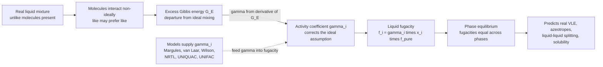

# 🧪 Solution Thermodynamics and Activity

> [!abstract] TL;DR
> **Solution thermodynamics** is the physics of *real* (non-ideal) mixtures — the corrections that turn the pretty theory of ideal solutions into predictions accurate enough to design a distillation column. An **ideal solution** (Raoult's law) assumes every molecule feels the same forces from a neighbor whether that neighbor is a twin or a stranger; **real** mixtures deviate because unlike molecules attract each other differently, and that deviation is booked into one number per component — the **activity coefficient** $\gamma_i$, which corrects each species' liquid-phase fugacity ($a_i = \gamma_i x_i$; $\gamma = 1$ is ideal). All the $\gamma_i$ of a mixture flow from a single scalar, the **excess Gibbs energy** $G^E$ (the departure of real mixing from ideal), via $\ln\gamma_i = \partial(G^E/RT)/\partial n_i$. When like-prefers-like ($\gamma > 1$, positive deviation — by far the most common) mixtures become *more* volatile, produce **minimum-boiling azeotropes**, and can even split into two liquid layers; when unlike molecules attract ($\gamma < 1$, negative deviation) you get maximum-boiling azeotropes. The **models** that supply $\gamma_i$ — Margules and van Laar (simple correlations), Wilson, **NRTL**, and UNIQUAC (local-composition, good for multicomponent and liquid-liquid), and **UNIFAC** (predictive, group-contribution, needs *no* data) — are built into every process simulator, making activity the bridge from ideal theory to the real design of distillation, extraction, and crystallization.

## Intuition

**Analogy:** Mix two liquids and you might naively expect the blend to just *average* their properties — half water, half oil should behave like "half-and-half." But molecules are picky about their neighbors. Water molecules cling fiercely to each other through hydrogen bonds and merely *tolerate* an intruding oil molecule shoved between them; that oil molecule, unwelcome and jostled, is far more eager to escape into the vapor than it would be surrounded by its own kind. Other pairs are the opposite — chloroform and acetone actually mix *more* happily than either stays pure, because they form a new attraction across the divide. This social non-ideality — who likes whom, and how much — is exactly what the **activity coefficient** captures: a fudge-factor (call it $\gamma$, gamma) that measures how much a molecule's real *escaping tendency* differs from the polite ideal-solution assumption that "everyone gets along the same."

When like-dislikes-unlike, the strangers want *out*: $\gamma$ soars above 1, volatility jumps, the mixture shows **positive deviations**, and in extreme cases it refuses to mix at all and **splits into two layers** — or it hits a composition where boiling no longer changes the mixture, an **azeotrope**, and distillation stalls. **Activity** is just the honest accounting of molecular sociability: the effective concentration a molecule "acts like" it has, once you correct raw mole fraction for how much its neighbors are pushing it away or pulling it in.

---

## How It Works

### Core Mechanics

The whole subject is one chain of logic: measure the mixture's *departure from ideal*, differentiate it to get per-component corrections, and feed those into the equilibrium condition.

1. **The mixture problem — partial molar properties.** Real process streams are mixtures, and a component's contribution to a mixture property is generally *not* its pure value. The **partial molar property** $\bar{M}_i = (\partial (nM)/\partial n_i)_{T,P,n_{j}}$ (e.g. partial molar volume or enthalpy) is what a mole of species $i$ actually adds to the total. Add a mole of ethanol to a huge tank of water and the volume rises by the *partial molar* volume of ethanol, not by 58 mL — because water packs around it differently. Mixture properties are mole-fraction-weighted sums of partial molar properties: $M = \sum_i x_i \bar{M}_i$.

2. **The true driving force — chemical potential and fugacity.** Phase equilibrium is *not* equal concentration or equal pressure; it is equal **chemical potential** $\mu_i$ (the partial molar Gibbs energy) for each species across every phase. Because $\mu_i \to -\infty$ as $x_i \to 0$ and is awkward to use, we recast it as **fugacity** $\hat{f}_i$ — a "corrected partial pressure," an effective escaping tendency with units of pressure. Equilibrium becomes the clean statement $\hat{f}_i^{\,V} = \hat{f}_i^{\,L}$ for every component.

3. **Ideal solution — the baseline.** An **ideal solution** assumes all molecular interactions (1-1, 2-2, 1-2) are alike, so a component's liquid fugacity is simply diluted by its mole fraction: $\hat{f}_i^{\,L} = x_i f_i^{\,pure}$. Combined with an ideal vapor this gives **Raoult's law**, $y_i P = x_i P_i^{sat}$. It is exact only for near-identical molecules (benzene/toluene, hexane/heptane).

4. **Real solution — the activity coefficient.** Unlike molecules interact differently, so we insert a correction: $\hat{f}_i^{\,L} = \gamma_i\, x_i\, f_i^{\,pure}$. The **activity** is $a_i = \gamma_i x_i$ (effective mole fraction), and the **activity coefficient** $\gamma_i$ is the whole story of non-ideality — $\gamma_i = 1$ recovers the ideal solution, $\gamma_i > 1$ means "wants out," $\gamma_i < 1$ means "held in." Modified (gamma-phi) Raoult's law becomes $y_i P = \gamma_i\, x_i\, P_i^{sat}$.

5. **Excess Gibbs energy — the generator.** All the $\gamma_i$ come from *one* function: the **excess Gibbs energy** $G^E = G^{real} - G^{ideal}$, the extra Gibbs energy of mixing beyond the ideal-entropy term. Differentiating gives every activity coefficient at once: $\ln\gamma_i = \left[\partial (nG^E/RT)/\partial n_i\right]_{T,P,n_j}$. Model $G^E$ as a function of composition and you have $\gamma_i(x,T)$ for the whole mixture.

6. **Sign of deviation — the consequences.** **Positive deviation** ($G^E > 0$, $\gamma_i > 1$, like-prefers-like) is the common case: higher volatility, **minimum-boiling azeotropes**, and, if strong enough, **liquid-liquid splitting**. **Negative deviation** ($G^E < 0$, $\gamma_i < 1$, unlike-attract) gives lower volatility and **maximum-boiling azeotropes** (e.g. acetone/chloroform, HCl/water).

7. **The models.** Margules and van Laar are simple algebraic $G^E$ correlations for binaries. **Wilson**, **NRTL**, and **UNIQUAC** are *local-composition* models — they recognize that the local ratio of neighbors around a molecule differs from the bulk ratio — and handle multicomponent systems from binary data (NRTL and UNIQUAC also describe liquid-liquid equilibrium; Wilson cannot). **UNIFAC** goes further: it estimates $\gamma_i$ from molecular *functional groups* with no experimental data at all, the workhorse of predictive design.

8. **Consistency — Gibbs-Duhem.** Activity coefficients in a mixture are not independent; the **Gibbs-Duhem equation** ($\sum_i x_i\, d\ln\gamma_i = 0$ at constant $T,P$) ties them together and is used to test whether measured VLE data are thermodynamically consistent.

### Flow / Architecture



---

## Key Concepts

### Secondary — the picture
- **Ideal vs real mixing.** An ideal mixture behaves like a simple average; molecules do not care who their neighbors are. Real mixtures do not, because some molecular pairs attract more (or less) than others.
- **Activity coefficient $\gamma$.** A single dial per component measuring "how non-ideal am I here?" $\gamma = 1$ is perfectly ideal; $\gamma > 1$ means the molecule is being pushed to escape (higher volatility); $\gamma < 1$ means it is held back.
- **Azeotrope.** A special mixture composition that boils to give vapor of *exactly the same* composition — so ordinary distillation cannot separate past it. Non-ideality is what creates azeotropes (ethanol/water is the famous one).

### Undergraduate — the machinery
- **Fugacity as the driving force.** Equilibrium means equal fugacity, $\hat{f}_i^V = \hat{f}_i^L$, not equal concentration. Liquid side: $\hat{f}_i^L = \gamma_i x_i f_i^{pure}$; **activity** $a_i = \gamma_i x_i$.
- **Modified (gamma-phi) Raoult's law:** $\;y_i P = \gamma_i\, x_i\, P_i^{sat}$. Setting all $\gamma_i = 1$ recovers ideal Raoult's law.
- **Partial molar properties.** $\bar{M}_i = \partial(nM)/\partial n_i$; mixture property $M = \sum x_i \bar{M}_i$. Explains why volumes and enthalpies of mixing are non-additive.
- **Excess Gibbs energy generates $\gamma$:** $\;\ln\gamma_i = \partial(nG^E/RT)/\partial n_i$. Two-parameter Margules: $G^E/RT = x_1 x_2 (A_{21}x_1 + A_{12}x_2)$, giving $\ln\gamma_1 = x_2^2[A_{12} + 2(A_{21}-A_{12})x_1]$.
- **Deviation sign $\to$ azeotrope type.** Positive ($\gamma>1$) $\to$ minimum-boiling azeotrope, possible liquid-liquid split; negative ($\gamma<1$) $\to$ maximum-boiling azeotrope.
- **Infinite-dilution $\gamma_i^{\infty}$.** The activity coefficient as $x_i \to 0$ (a lone molecule among strangers) — the harshest non-ideality and a key data point for fitting models.

### Graduate — the frontier
- **Local-composition models.** Wilson, NRTL, and UNIQUAC replace bulk mole fractions with *local* ones weighted by Boltzmann factors of interaction energies. **NRTL** adds a non-randomness parameter $\alpha$ and, crucially, can represent **liquid-liquid equilibrium**; **Wilson** cannot describe LLE. UNIQUAC splits $G^E$ into a *combinatorial* (size/shape, entropic) and a *residual* (energetic) part.
- **UNIFAC — group contribution.** Decompose molecules into functional groups (CH$_2$, OH, COOH, ...) with tabulated group-interaction parameters, so $\gamma_i$ can be *predicted* for systems with no measured data — indispensable for novel or data-poor mixtures.
- **Stability and phase splitting.** A homogeneous liquid is unstable when $\partial^2(\Delta G_{mix})/\partial x^2 < 0$ (the **spinodal**); the coexisting compositions come from the **common-tangent / binodal** construction on $\Delta G_{mix}(x)$. Strong positive $G^E$ (roughly $A \gtrsim 2$ in symmetric Margules) opens a **miscibility gap**.
- **Reference states and conventions.** Symmetric convention (Lewis-Randall, $\gamma_i \to 1$ as $x_i \to 1$) vs unsymmetric (Henry's law, $\gamma_i^* \to 1$ as $x_i \to 0$) — the latter is natural for dilute solutes and electrolytes.
- **gamma-phi vs phi-phi.** The activity-coefficient (gamma-phi) approach handles the strongly non-ideal *liquid* while an equation of state handles the vapor; the alternative *phi-phi* uses one EOS for both phases (better at high pressure). Choosing between them is a core simulator decision.
- **Temperature dependence and consistency.** $G^E(T)$ ties to excess enthalpy via $H^E = -RT^2\,\partial(G^E/RT)/\partial T$; Gibbs-Duhem provides the thermodynamic-consistency test for regressed VLE data.

---

## Python Demo

```python
# Solution thermodynamics and activity: how non-ideal mixing (excess Gibbs
# energy) generates activity coefficients, and how those coefficients bend
# vapor-liquid equilibrium into an azeotrope -- or split a liquid in two.
# Pure numpy + matplotlib.
import numpy as np
import matplotlib.pyplot as plt

# ---- (1) Two-parameter Margules model (ethanol(1)/water(2), positive dev.) ----
A12, A21 = 1.60, 0.90          # dimensionless; gamma_i^inf = exp(A_ij)

x1 = np.linspace(1e-4, 1 - 1e-4, 400)
x2 = 1.0 - x1

# Excess Gibbs energy:  G^E/RT = x1*x2*(A21*x1 + A12*x2)
gE_RT = x1 * x2 * (A21 * x1 + A12 * x2)

# Activity coefficients = analytic derivatives of nG^E/RT
ln_g1 = x2**2 * (A12 + 2 * (A21 - A12) * x1)
ln_g2 = x1**2 * (A21 + 2 * (A12 - A21) * x2)
g1, g2 = np.exp(ln_g1), np.exp(ln_g2)

# ---- (2) Modified Raoult's law -> P-x-y (Antoine vapor pressures, T=70 C) ----
def antoine(A, B, C, T):        # returns P in mmHg
    return 10.0 ** (A - B / (C + T))

T = 70.0
P1sat = antoine(8.20417, 1642.89, 230.300, T)   # ethanol
P2sat = antoine(8.07131, 1730.63, 233.426, T)   # water

P  = x1 * g1 * P1sat + x2 * g2 * P2sat           # bubble pressure
y1 = x1 * g1 * P1sat / P                          # vapor composition

iaz = np.argmin(np.abs(y1 - x1))                  # azeotrope: where y1 == x1
x_az = x1[iaz]

# ---- (3) Strong positive deviation -> liquid-liquid split (symmetric) ----
A = 2.8                                            # A > 2 opens a miscibility gap
dGmix = x1 * np.log(x1) + x2 * np.log(x2) + A * x1 * x2   # Delta G_mix / RT
left = x1 < 0.5
xa = x1[left][np.argmin(dGmix[left])]              # binodal (double-well minima)
xb = 1.0 - xa                                      # symmetric partner
va = dGmix[left][np.argmin(dGmix[left])]

# ---- Plot ----
fig, ax = plt.subplots(2, 2, figsize=(12, 9))

ax[0, 0].plot(x1, g1, lw=2, label=r'$\gamma_1$ (ethanol)')
ax[0, 0].plot(x1, g2, lw=2, label=r'$\gamma_2$ (water)')
ax[0, 0].axhline(1.0, ls='--', c='gray', label=r'ideal ($\gamma=1$)')
ax[0, 0].set(xlabel=r'$x_1$', ylabel=r'activity coefficient $\gamma_i$',
             title='(a) Activity coefficients: positive deviation')
ax[0, 0].legend(); ax[0, 0].grid(alpha=.3)

ax[0, 1].plot(x1, gE_RT, lw=2, color='C3')
ax[0, 1].fill_between(x1, gE_RT, alpha=.2, color='C3')
ax[0, 1].set(xlabel=r'$x_1$', ylabel=r'$G^{E}/RT$',
             title=r'(b) Excess Gibbs energy $G^{E}>0$')
ax[0, 1].grid(alpha=.3)

ax[1, 0].plot(x1, P, lw=2, label=r'bubble: $P$ vs $x_1$')
ax[1, 0].plot(y1, P, lw=2, label=r'dew: $P$ vs $y_1$')
ax[1, 0].axvline(x_az, ls=':', c='k')
ax[1, 0].annotate(f'azeotrope\n$x_1$ = {x_az:.2f}', (x_az, P[iaz]),
                  textcoords='offset points', xytext=(10, -35))
ax[1, 0].set(xlabel=r'$x_1,\ y_1$', ylabel='P (mmHg)',
             title=f'(c) Non-ideal VLE at {T:.0f} C: pressure-maximum azeotrope')
ax[1, 0].legend(); ax[1, 0].grid(alpha=.3)

ax[1, 1].plot(x1, dGmix, lw=2, color='C4')
ax[1, 1].plot([xa, xb], [va, va], 'k--', label='common tangent')
ax[1, 1].scatter([xa, xb], [va, va], c='k', zorder=5)
ax[1, 1].axvspan(xa, xb, alpha=.12, color='gray')
ax[1, 1].set(xlabel=r'$x_1$', ylabel=r'$\Delta G_{mix}/RT$',
             title=f'(d) Strong deviation (A={A}): liquid-liquid split')
ax[1, 1].legend(); ax[1, 1].grid(alpha=.3)

plt.tight_layout()
plt.show()

print(f'gamma_1 at infinite dilution = {np.exp(A12):.2f}')
print(f'gamma_2 at infinite dilution = {np.exp(A21):.2f}')
print(f'azeotrope at x1 = {x_az:.3f}, P = {P[iaz]:.1f} mmHg')
print(f'miscibility gap (binodal): x1 = {xa:.3f} to {xb:.3f}')
```

Panels **(a)** and **(b)** show the core mechanism: both activity coefficients rise above 1 (positive deviation), driven by a positive excess Gibbs energy hump. Panel **(c)** feeds those $\gamma_i$ through modified Raoult's law and the bubble/dew curves cross at a **pressure-maximum azeotrope** — the point where distillation stalls. Panel **(d)** cranks the non-ideality up ($A>2$): the Gibbs energy of mixing develops a **double well**, and the common tangent marks the two compositions of a **liquid-liquid split** — the same physics that lets oil and water refuse to mix.

---

## Real-World Applications

> **Example — Aspen Plus / HYSYS distillation design.** Every commercial process simulator ships with **NRTL**, **UNIQUAC**, and **UNIFAC** as default liquid-activity models, and choosing the right one is the first decision an engineer makes on a flowsheet. Designing an ethanol dehydration unit is impossible with ideal Raoult's law: the ethanol/water minimum-boiling azeotrope at ~89 mol% ethanol (the reason ordinary distillation stops at ~95% and "absolute" ethanol needs a special trick) only appears once $\gamma_i > 1$ is in the model. Engineers regress NRTL parameters from VLE data (or predict them with UNIFAC) precisely so the simulator places that azeotrope correctly and sizes the extractive/azeotropic distillation columns that break past it.

- **Distillation and azeotropes.** Activity models tell you *where* azeotropes sit and whether a target purity is even reachable by simple distillation — dictating the choice of pressure-swing, extractive, or azeotropic distillation (see the sibling note *Distillation*).
- **Liquid-liquid extraction.** NRTL and UNIQUAC predict the ternary tie-lines and miscibility gaps that make solvent extraction work — selecting a solvent that pulls the solute out is an exercise in engineering $\gamma_i$ (sibling *Liquid_Liquid_Extraction*).
- **Pharmaceutical crystallization and solubility.** Solubility in a solvent is set by the solute's activity; solvent screening and antisolvent crystallization designs lean on activity-coefficient (often UNIFAC) predictions.
- **Environmental partitioning.** Octanol-water partition coefficients and Henry's-law volatilization of pollutants are activity-coefficient phenomena at heart.

---

## Common Pitfalls

- **Assuming Raoult's law for a system that has an azeotrope.** Using ideal VLE where $\gamma_i \neq 1$ silently deletes the azeotrope and the miscibility gap, so a simulated column "achieves" a purity that is physically impossible. Always check whether the real system deviates before trusting an ideal model.
- **Extrapolating binary parameters into multicomponent mixtures blindly.** Margules/van Laar are binary correlations; even local-composition models are only as good as the binary data behind each pair. Missing or poorly fit binary interactions in a ternary can put a phase boundary in the wrong place.
- **Using Wilson for liquid-liquid equilibrium.** The Wilson model is mathematically incapable of predicting phase splitting — reach for **NRTL** or **UNIQUAC** when a liquid-liquid split matters.
- **Ignoring Gibbs-Duhem consistency.** Fitting $\gamma_1$ and $\gamma_2$ independently to noisy data can yield a thermodynamically inconsistent pair; the Gibbs-Duhem test ($\sum_i x_i\, d\ln\gamma_i = 0$) exists to catch this.
- **Forgetting UNIFAC's blind spots.** Group-contribution prediction fails when a molecule's group is missing from the tables, or for strong specific interactions (some associating or electrolyte systems). Predicted $\gamma_i$ is an estimate, not gospel — validate against data when the design margin is tight.
- **Confusing activity with concentration.** $a_i = \gamma_i x_i$, not $x_i$. Treating mole fraction as the "effective" driving force is exactly the ideal-solution error activity was invented to fix.
- **Neglecting temperature dependence.** Activity-coefficient parameters regressed at one temperature can drift; systems near a consolute (upper/lower critical solution) temperature are especially sensitive.

---

## Related Concepts

- [[Chemical_Thermodynamics]] — supplies the Gibbs energy, chemical potential, and $\Delta G = \Delta H - T\Delta S$ backbone that solution thermodynamics extends from pure substances to mixtures.
- [[Phase_Equilibria_and_Colligative_Properties]] — the chemistry-level treatment of Raoult's law, ideal solutions, and colligative effects that activity coefficients correct for real behavior.
- [[Thermodynamic_Potentials]] — Gibbs, Helmholtz, and their Legendre relationships; excess *properties* are defined as departures of these potentials from ideal mixing.
- [[Entropy_and_Second_Law]] — the ideal entropy of mixing is the reference against which the *excess* Gibbs energy is measured; positive $G^E$ is an enthalpic/entropic penalty on top of it.
- [[Partition_Functions_and_Free_Energy_in_ML]] — the statistical-mechanical view of free energy and Boltzmann-weighted local occupancy that underlies local-composition models like NRTL and Wilson.
- [[Phase_Diagrams_and_the_Iron_Carbon_System]] — the solid-state analogue: the same common-tangent construction on Gibbs energy that predicts liquid-liquid gaps here predicts solid-solution miscibility and eutectics there.

Within this Chemical Engineering section, this note is the non-ideal-mixture heart of the *Chemical_Process_Thermodynamics* foundations: it supplies the $\gamma_i$ that *Vapor_Liquid_Equilibrium* uses in modified Raoult's law, that *Multicomponent_Phase_Behavior* generalizes to many components and phases, and that *Distillation* and *Liquid_Liquid_Extraction* rely on to predict the azeotropes and liquid-liquid gaps that shape every real separation.

---

## Review Questions

1. **(Secondary)** Two liquids mix and the mixture becomes *more* volatile than a simple average would suggest — bubbles form more easily than expected. Is this positive or negative deviation from ideal behavior, and what does it imply about whether the molecules "like" their own kind or the other kind?
2. **(Undergraduate)** Starting from the excess Gibbs energy, explain why an activity coefficient of exactly 1 recovers Raoult's law. Then, given a two-parameter Margules fit with $A_{12} = 1.6$ and $A_{21} = 0.9$, what are the two infinite-dilution activity coefficients, and which component is "more non-ideal" when very dilute?
3. **(Graduate)** You must design a process to separate a binary that your UNIFAC screening predicts has a strong positive deviation. (a) What two qualitatively different phenomena could this create that would block ordinary distillation, and how would you tell them apart from the $\Delta G_{mix}(x)$ curve? (b) Would you choose Wilson or NRTL to model it, and why? (c) What single thermodynamic-consistency test would you run on any VLE data you regress?

---

## Sources

- Smith, J. M., Van Ness, H. C., & Abbott, M. M. — *Introduction to Chemical Engineering Thermodynamics* (McGraw-Hill). The standard undergraduate treatment of partial molar properties, fugacity, excess properties, and gamma-phi VLE.
- Prausnitz, J. M., Lichtenthaler, R. N., & de Azevedo, E. G. — *Molecular Thermodynamics of Fluid-Phase Equilibria* (Prentice Hall). The definitive graduate reference on activity-coefficient models and molecular non-ideality.
- Sandler, S. I. — *Chemical, Biochemical, and Engineering Thermodynamics* (Wiley). Clear development of activity, stability, and liquid-liquid equilibrium.
- Poling, B. E., Prausnitz, J. M., & O'Connell, J. P. — *The Properties of Gases and Liquids* (McGraw-Hill). The practitioner's source for Wilson, NRTL, UNIQUAC, and UNIFAC parameters and correlations.

---

#chemical-engineering #activity-coefficient #excess-gibbs #NRTL #non-ideal-mixtures
