# ⚗️ Vapor-Liquid Equilibrium

> [!abstract] TL;DR
> When a two-component liquid boils, the vapor that rises has a **different composition** than the liquid it left — richer in the more volatile species. **Vapor-liquid equilibrium (VLE)** is the exact bookkeeping of that split. The governing condition is **equal fugacity** of every species in both phases, $\hat f_i^{\,V} = \hat f_i^{\,L}$. For ideal liquids this collapses to **Raoult's law** $p_i = x_i P_i^{\text{sat}}$, whose consequences are the **K-value** $K_i = y_i/x_i$ and the **relative volatility** $\alpha = K_{\text{light}}/K_{\text{heavy}}$ — the single number that says whether a mixture is easy or impossible to distill. Plotted, VLE gives the **T-x-y diagram** (bubble and dew curves) and the **x-y diagram** (the McCabe-Thiele workhorse). Real mixtures deviate through **activity coefficients** $\gamma_i$, and when deviation is strong enough the x-y curve crosses the diagonal at an **azeotrope** ($x_i = y_i$), where ordinary distillation stalls — ethanol-water at 95.6 wt% being the famous example. VLE is the thermodynamic foundation of distillation, flash drums, absorbers, and every process simulator.

---

## Intuition

**Analogy first.** Heat a pot of a two-liquid mixture — say alcohol and water — and something wonderful happens: the steam that rises is **richer in alcohol** than the liquid simmering below. Both molecules can escape into the vapor, but the more volatile one (alcohol) escapes more eagerly, so it is over-represented up in the vapor. Condense that vapor and you have a more alcoholic liquid than you started with. Do it again and again and you climb toward pure spirit. That difference in composition between a boiling liquid and its own vapor is the entire secret of distillation — of how we make whiskey, purify gasoline fractions, and pull apart almost every industrial mixture.

Vapor-liquid equilibrium is simply the **precise accounting** of that preference: at a given temperature and pressure, exactly how each component divides itself between the two phases. The more volatile a component, the more it "prefers" the vapor — and once you quantify that preference (as a K-value, and the ratio of two K-values as relative volatility), you can predict, stage by stage, how far a mixture can be pulled apart and how many trays a column needs to do it.

---

## How It Works

At equilibrium nothing appears to change, yet molecules never stop crossing the interface — evaporating up and condensing down. Balance is reached when, **for every species independently**, its escaping tendency out of the liquid equals its escaping tendency out of the vapor. Thermodynamics names that escaping tendency **fugacity**, and the equilibrium law is $\hat f_i^{\,V} = \hat f_i^{\,L}$ for each component $i$. Everything else — Raoult's law, K-values, T-x-y curves, azeotropes — is a consequence of applying models to those two fugacities and solving.

```mermaid
graph LR
    FEED["LIQUID MIXTURE<br/>light plus heavy<br/>component"]
    HEAT["ADD HEAT<br/>raise T toward<br/>boiling"]
    VAP["VAPOR FORMS<br/>enriched in the more<br/>volatile light species"]
    EQ["EQUILIBRIUM<br/>fugacity equal in both phases<br/>f_i vapor = f_i liquid"]
    MODEL["MODEL THE SPLIT<br/>Raoult p_i = x_i Psat_i<br/>K_i = y_i / x_i"]
    ALPHA["RELATIVE VOLATILITY<br/>alpha = K_light / K_heavy<br/>sets separability"]
    DIAG["VLE DIAGRAMS<br/>T-x-y bubble and dew<br/>x-y McCabe-Thiele"]
    SEP["SEPARATION DESIGN<br/>distillation, flash,<br/>absorbers, condensers"]

    FEED --> HEAT
    HEAT --> VAP
    VAP --> EQ
    EQ --> MODEL
    MODEL --> ALPHA
    ALPHA --> DIAG
    DIAG --> SEP

    style FEED fill:#2563eb,color:#fff
    style VAP fill:#d97706,color:#fff
    style EQ fill:#7c3aed,color:#fff
    style ALPHA fill:#ffd43b,color:#000
    style DIAG fill:#059669,color:#fff
    style SEP fill:#dc2626,color:#fff
```



---

## Key Concepts / Details

### Secondary Level

**Two phases, two compositions.** In a boiling mixture the **liquid** and the **vapor** above it are both mixtures — but *not the same* mixture. The vapor holds a larger fraction of whatever boils more easily. We write the liquid composition as mole fraction $x_i$ and the vapor composition as $y_i$; VLE is the rule linking them.

**Volatility.** A pure liquid's eagerness to evaporate at a given temperature is measured by its **vapor pressure** $P_i^{\text{sat}}$ — a liquid boils when its vapor pressure reaches the surrounding pressure. Alcohol has a higher vapor pressure than water at the same temperature, so it is *more volatile* and dominates the vapor.

**Raoult's law, plain form.** In a well-behaved mixture, each component contributes to the total pressure in proportion to how much of it is in the liquid:
$$p_i = x_i\,P_i^{\text{sat}}$$
So a liquid that is half alcohol contributes half of alcohol's pure vapor pressure. Because alcohol's $P^{\text{sat}}$ is larger, the vapor ends up richer in alcohol than the liquid was — the enrichment that distillation exploits.

**Why it matters.** Repeat "boil, capture the richer vapor, condense, boil again" and each cycle concentrates the volatile component further. A distillation column stacks dozens of these cycles into one tall vessel. Understanding *how much* enrichment happens per stage is exactly what VLE gives you.

### Undergraduate Level

**The equilibrium criterion.** Two phases are in equilibrium when temperature, pressure, and the fugacity of *every* component match across the phases:
$$\hat f_i^{\,V} = \hat f_i^{\,L} \qquad (i = 1, 2, \dots, N)$$
This is the mixture version of the pure-substance rule $\mu^{V}=\mu^{L}$ and the direct analogue of chemical-reaction equilibrium.

**Ideal VLE and Raoult's law.** If the vapor is an ideal gas and the liquid an ideal solution, the fugacities reduce to partial pressures and Raoult's law follows:
$$y_i P = x_i P_i^{\text{sat}}(T)$$
Summing over all species (with $\sum y_i = 1$) gives the **bubble-pressure** relation $P = \sum_i x_i P_i^{\text{sat}}$.

**K-values.** The distribution of a species between phases is captured by the equilibrium ratio:
$$K_i \equiv \frac{y_i}{x_i} = \frac{P_i^{\text{sat}}}{P} \quad\text{(ideal)}$$
$K_i > 1$ means the species favors the vapor; $K_i < 1$ means it favors the liquid.

**Relative volatility — the separability number.** The ratio of two K-values measures how differently two species partition:
$$\alpha_{ij} = \frac{K_i}{K_j} = \frac{P_i^{\text{sat}}}{P_j^{\text{sat}}} \quad\text{(ideal)}$$
If $\alpha = 1$ the two phases have identical composition and **no** distillation is possible; the larger $\alpha$ is, the fewer stages a separation needs. Benzene-toluene sits near $\alpha \approx 2.4$ (easy); close-boiling isomers may have $\alpha \approx 1.05$ (brutally hard).

**Vapor pressure — the Antoine equation.** Component vapor pressures come from a fitted correlation, most commonly:
$$\log_{10} P_i^{\text{sat}} = A_i - \frac{B_i}{C_i + T}$$
with tabulated constants $A_i, B_i, C_i$ valid over a stated temperature range.

**The two diagrams.**
- **T-x-y diagram** (fixed $P$): plots temperature against composition. The lower **bubble-point curve** gives the liquid composition at which boiling begins; the upper **dew-point curve** gives the vapor composition at which condensation begins. Between them lies the two-phase region; a horizontal **tie-line** joins the $x$ and $y$ in equilibrium.
- **x-y diagram** (fixed $P$): plots vapor $y$ against liquid $x$ for the light component. Its distance above the $y=x$ diagonal is the driving force for separation; this is the curve the **McCabe-Thiele** graphical design method steps between operating lines.

**Three canonical calculations.**
1. **Bubble point:** given liquid $x_i$, find the $T$ (or $P$) where the first bubble forms — $\sum_i K_i x_i = 1$.
2. **Dew point:** given vapor $y_i$, find where the first drop forms — $\sum_i y_i / K_i = 1$.
3. **Flash:** a feed of composition $z_i$ is dropped to a $T, P$ inside the two-phase envelope and splits into liquid and vapor. The vapor fraction $\psi$ solves the **Rachford-Rice** equation:
$$\sum_i \frac{z_i\,(K_i - 1)}{1 + \psi\,(K_i - 1)} = 0$$

**Azeotropes.** Real mixtures deviate from Raoult's law. When deviation is strong enough, the x-y curve touches and crosses the diagonal at a composition where $x_i = y_i$: an **azeotrope**. There the liquid boils to a vapor of identical composition, so *no* number of equilibrium stages separates it further. Ethanol-water forms a minimum-boiling azeotrope at ~89.4 mol% (95.6 wt%) ethanol, boiling at 78.1 °C — the physical reason ordinary distillation cannot reach pure ("absolute") ethanol.

### Graduate Level

**The gamma-phi formulation.** The general low-to-moderate-pressure statement equates the corrected liquid and vapor fugacities:
$$y_i\,\hat\phi_i^{\,V}\,P = x_i\,\gamma_i\,f_i^{\,L}$$
where $\gamma_i$ is the **liquid activity coefficient** (non-ideality of the solution) and $\hat\phi_i^{V}$ the **vapor fugacity coefficient** (non-ideality of the gas). At low pressure $\hat\phi_i^{V}\to 1$ and $f_i^{L}\to P_i^{\text{sat}}$, giving **modified Raoult's law**:
$$\boxed{\,y_i P = x_i\,\gamma_i\,P_i^{\text{sat}}\,}$$
Now $K_i = \gamma_i P_i^{\text{sat}} / P$, so relative volatility carries an activity-coefficient ratio $\alpha_{ij} = (\gamma_i P_i^{\text{sat}})/(\gamma_j P_j^{\text{sat}})$ — the term that creates azeotropes.

**Sign of deviation.**
- **Positive deviation** ($\gamma_i > 1$): unlike molecules attract each other *less* than like molecules, vapor pressure exceeds Raoult, and a **minimum-boiling** azeotrope can form (ethanol-water, methanol-benzene).
- **Negative deviation** ($\gamma_i < 1$): unlike molecules attract *more*, and a **maximum-boiling** azeotrope can form (acetone-chloroform, nitric acid-water).

**Activity-coefficient models.** $\gamma_i$ is derived from an excess-Gibbs-energy model $G^E(x,T)$:
- **Two-suffix / Margules** and **van Laar** — two-parameter, correlate many simple binaries.
- **Wilson** — local-composition, excellent for miscible mixtures but *cannot* predict liquid-liquid splitting.
- **NRTL** and **UNIQUAC** — handle partially miscible systems; UNIQUAC underpins the predictive group-contribution method **UNIFAC** used when no data exist.

**The equation-of-state (phi-phi) route.** At high pressure or near the critical region, both phases are described by one cubic EOS (Peng-Robinson, Soave-Redlich-Kwong) and equilibrium is enforced through fugacity coefficients $\hat\phi_i^{V} = \hat\phi_i^{L}$. This is the standard for hydrocarbon and natural-gas systems where a liquid "vapor pressure" is ill-defined above the pure-component critical point.

**Henry's law for dilute and supercritical solutes.** When a species is far above its critical temperature (dissolved gases, supercritical solutes) Raoult's reference fails; the solute instead obeys $\hat f_i^{L} = x_i H_i$, with the Henry's constant $H_i \neq P_i^{\text{sat}}$. Solvent follows Raoult, solute follows Henry in the dilute limit.

**Thermodynamic consistency.** Measured $\gamma_i$ data must satisfy the **Gibbs-Duhem** relation $\sum_i x_i\,d\ln\gamma_i = 0$ at constant $T, P$; area and point tests built on it flag inconsistent VLE datasets before they corrupt a design.

**Phase rule for multicomponent VLE.** Gibbs' rule $F = C - P + 2$ still governs: a two-component two-phase system has $F = 2$, so fixing $T$ and $P$ determines all phase compositions — which is exactly why a binary T-x-y diagram at fixed $P$ is a single pair of curves. Distillation of ternary and higher mixtures is analyzed with **residue-curve maps**, where azeotropes act as boundaries partitioning which pure products are reachable.

---

## Python Demo

```python
# VLE diagrams: IDEAL (Raoult, benzene-toluene) vs NON-IDEAL (van Laar,
# ethanol-water azeotrope). Builds T-x-y and x-y (McCabe-Thiele) plots.
import numpy as np
import matplotlib.pyplot as plt

# Antoine equation:  log10(Psat_mmHg) = A - B / (C + T_degC)
def antoine(T, A, B, C):
    return 10.0 ** (A - B / (C + T))

# --- Antoine constants (P in mmHg, T in deg C) ---
A_benz, B_benz, C_benz = 6.90565, 1211.033, 220.790   # benzene  (light)
A_tol,  B_tol,  C_tol  = 6.95334, 1343.943, 219.377   # toluene  (heavy)
A_eth,  B_eth,  C_eth  = 8.20417, 1642.89,  230.300   # ethanol  (light)
A_wat,  B_wat,  C_wat  = 8.07131, 1730.63,  233.426   # water    (heavy)

P_tot = 760.0   # total pressure, mmHg (1 atm)

# ============================================================
# (a) IDEAL BINARY -> Raoult gives a closed-form T-x-y sweep.
#     From x*Psat_B + (1-x)*Psat_T = P, solve x directly at each T.
# ============================================================
T_id = np.linspace(80.1, 110.6, 250)        # benzene bp .. toluene bp
Ps_B = antoine(T_id, A_benz, B_benz, C_benz)
Ps_T = antoine(T_id, A_tol,  B_tol,  C_tol)

x_id = (P_tot - Ps_T) / (Ps_B - Ps_T)       # liquid mole fraction benzene
y_id = x_id * Ps_B / P_tot                   # vapor  mole fraction benzene

alpha = np.mean(Ps_B / Ps_T)                 # relative volatility (ideal)
x_grid = np.linspace(0, 1, 100)
y_alpha = alpha * x_grid / (1 + (alpha - 1) * x_grid)   # constant-alpha curve

# ============================================================
# (b) NON-IDEAL BINARY -> modified Raoult, y_i*P = gamma_i*x_i*Psat_i
#     van Laar activity coefficients for ethanol(1)-water(2).
# ============================================================
A12, A21 = 1.6798, 0.9227                    # van Laar constants

def van_laar(x1):
    x2 = 1.0 - x1
    d1 = 1.0 + (A12 * x1) / (A21 * x2)
    d2 = 1.0 + (A21 * x2) / (A12 * x1)
    return np.exp(A12 / d1**2), np.exp(A21 / d2**2)

def bubble_T(x1):
    # bisect for the bubble-point T where total pressure = P_tot
    x2, (g1, g2) = 1.0 - x1, van_laar(x1)
    lo, hi = 60.0, 105.0
    for _ in range(80):
        mid = 0.5 * (lo + hi)
        P = (g1 * x1 * antoine(mid, A_eth, B_eth, C_eth)
             + g2 * x2 * antoine(mid, A_wat, B_wat, C_wat))
        lo, hi = (mid, hi) if P < P_tot else (lo, mid)
    return 0.5 * (lo + hi)

x_ni = np.linspace(1e-4, 1 - 1e-4, 250)      # liquid mole fraction ethanol
T_ni = np.array([bubble_T(x) for x in x_ni])
g1, g2 = van_laar(x_ni)
y_ni = g1 * x_ni * antoine(T_ni, A_eth, B_eth, C_eth) / P_tot

# azeotrope = where the x-y curve crosses the diagonal (y - x changes sign)
sign_change = np.where(np.diff(np.sign(y_ni - x_ni)))[0]
x_az = x_ni[sign_change[0]] if sign_change.size else None

# ============================================================
# PLOTS
# ============================================================
fig, ax = plt.subplots(2, 2, figsize=(12, 9))

ax[0, 0].plot(x_id, T_id, "b-", lw=2, label="bubble (liquid x)")
ax[0, 0].plot(y_id, T_id, "r-", lw=2, label="dew (vapor y)")
ax[0, 0].fill_betweenx(T_id, x_id, y_id, color="gray", alpha=0.15)
ax[0, 0].set(title="IDEAL: benzene-toluene T-x-y (Raoult)",
            xlabel="benzene mole fraction", ylabel="T [deg C]", xlim=(0, 1))
ax[0, 0].legend(); ax[0, 0].grid(alpha=0.3)

ax[0, 1].plot([0, 1], [0, 1], "k--", lw=1, label="y = x")
ax[0, 1].plot(x_id, y_id, "g-", lw=2, label="VLE from Antoine")
ax[0, 1].plot(x_grid, y_alpha, "m:", lw=2, label=f"constant alpha = {alpha:.2f}")
ax[0, 1].set(title="IDEAL: x-y (McCabe-Thiele)", xlabel="x benzene",
            ylabel="y benzene", xlim=(0, 1), ylim=(0, 1))
ax[0, 1].legend(); ax[0, 1].grid(alpha=0.3)

ax[1, 0].plot(x_ni, T_ni, "b-", lw=2, label="bubble (liquid x)")
ax[1, 0].plot(y_ni, T_ni, "r-", lw=2, label="dew (vapor y)")
ax[1, 0].set(title="NON-IDEAL: ethanol-water T-x-y (min-boiling azeotrope)",
            xlabel="ethanol mole fraction", ylabel="T [deg C]", xlim=(0, 1))
ax[1, 0].legend(); ax[1, 0].grid(alpha=0.3)

ax[1, 1].plot([0, 1], [0, 1], "k--", lw=1, label="y = x")
ax[1, 1].plot(x_ni, y_ni, "g-", lw=2, label="VLE from van Laar")
if x_az is not None:
    ax[1, 1].plot(x_az, x_az, "ko", ms=9, label=f"azeotrope x = {x_az:.2f}")
ax[1, 1].set(title="NON-IDEAL: x-y crosses diagonal at azeotrope",
            xlabel="x ethanol", ylabel="y ethanol", xlim=(0, 1), ylim=(0, 1))
ax[1, 1].legend(); ax[1, 1].grid(alpha=0.3)

plt.tight_layout(); plt.show()

print(f"Ideal benzene-toluene relative volatility  alpha ~ {alpha:.2f}")
if x_az is not None:
    print(f"Ethanol-water azeotrope near x_ethanol ~ {x_az:.3f} (mole fraction)")
```

The ideal panels show benzene's vapor line sitting well above the diagonal (an easy $\alpha \approx 2.4$ separation), while the ethanol-water panels bend the vapor curve down until it **crosses** the diagonal near $x_{\text{EtOH}} \approx 0.9$ — the azeotrope that caps simple distillation, mirrored by the minimum in its T-x-y boiling envelope.

---

## Real-World Applications

- **Distillation columns — the workhorse of the process industry.** Crude-oil atmospheric and vacuum towers, air separation into O₂/N₂/Ar, and de-methanizers all size their tray or packing count directly from VLE: the number of theoretical stages is set by how far the x-y curve sits above the diagonal, i.e. by relative volatility. Distillation is estimated to consume a large share of all separations energy worldwide, so accurate VLE has enormous economic weight.
- **Flash drums and separators.** At an oil-and-gas wellhead or upstream of a column, a feed is throttled into a two-phase drum and splits according to K-values via the Rachford-Rice flash — the fastest, cheapest first-cut separation.
- **Fuel-grade ethanol production.** Because the ethanol-water azeotrope blocks ordinary distillation at 95.6 wt%, plants reach anhydrous ethanol with **molecular sieves**, **pressure-swing distillation**, or **azeotropic/extractive distillation** with an entrainer — every one of these designed around VLE data showing where and why the diagonal is crossed.
- **Absorbers and strippers.** Amine units removing CO₂/H₂S from gas, and sour-water strippers, are gas-liquid contactors sized by the same equilibrium framework (with Henry's-law solutes rather than Raoult's-law components).
- **Refrigeration and heat pumps.** Zeotropic and azeotropic refrigerant blends are selected using VLE so that evaporators and condensers glide (or hold constant) temperature as desired — the mechanical-engineering side of the same phase behavior.
- **Process simulators.** Aspen Plus, HYSYS, DWSIM, and gPROMS all sit on a VLE thermodynamics package (Peng-Robinson, NRTL, UNIQUAC); choosing the right property method is the single most consequential decision in a flowsheet, and the most common source of wrong answers.

---

## Common Pitfalls

1. **Applying Raoult's law to strongly non-ideal mixtures.** Raoult assumes an ideal solution ($\gamma_i = 1$). For polar/associating systems (alcohols, water, acids) this can be off by a factor of several and will completely *miss* an azeotrope. Use modified Raoult with a fitted $\gamma$ model.
2. **Forgetting activity coefficients hide the azeotrope.** A textbook Raoult calculation of ethanol-water predicts clean separation to pure ethanol. Only $\gamma_i$ reveals the diagonal crossing. If your model shows no azeotrope for a system that has one, your thermodynamics package is mis-selected.
3. **Confusing K-value with relative volatility.** $K_i$ measures one species' vapor preference; $\alpha_{ij}$ is the *ratio* of two K-values and is what governs separability. $K_i \gg 1$ for both components can still give $\alpha \approx 1$ (nothing separates).
4. **Using the wrong property method for high pressure.** Below a few atmospheres, gamma-phi (activity models) is fine. Near or above component critical points (natural gas, CO₂ systems), a pure-component "vapor pressure" is undefined and you must switch to an equation-of-state phi-phi approach.
5. **Extrapolating Antoine constants out of range.** Antoine coefficients are fitted to a stated temperature window; used outside it, $P^{\text{sat}}$ (and thus every K-value) is silently wrong. Always check the valid range.
6. **Expecting more trays to beat an azeotrope.** At the azeotropic composition vapor and liquid are identical, so infinite stages still fail. A different technique — pressure swing, entrainer, membrane, or adsorption — is mandatory.
7. **Ignoring thermodynamic consistency of data.** Regressing $\gamma$ parameters to VLE data that violate Gibbs-Duhem produces a model that fits the points but predicts nonsense between them.

---

## Related Concepts

VLE is the linchpin joining the thermodynamics section to the separations section of a chemical-engineering curriculum. Within this vault it builds directly on the sibling notes **Chemical_Process_Thermodynamics** (which supplies fugacity, chemical potential, and the equation-of-state machinery) and **Solution_Thermodynamics_and_Activity** (which develops the activity coefficient $\gamma_i$ and excess-Gibbs-energy models used in modified Raoult's law). It generalizes in **Multicomponent_Phase_Behavior** (residue-curve maps, liquid-liquid and vapor-liquid-liquid equilibria) and is applied directly in **Distillation** and **Absorption_and_Stripping**, whose stage counts are read straight off the x-y diagram.

Cross-vault connections (verified to exist):

- [[Chemical_Thermodynamics]] *(Chemistry)* — supplies chemical potential, fugacity, and the Gibbs energy whose equality across phases is the equilibrium criterion
- [[Phase_Equilibria_and_Colligative_Properties]] *(Chemistry)* — the physical-chemistry treatment of Raoult's law, Henry's law, deviations, and azeotropes that VLE turns into an engineering tool
- [[Chemical_Equilibrium]] *(Chemistry)* — phase coexistence is the equal-potential analogue of reaction equilibrium ($\mu^V = \mu^L$ versus $Q = K$)
- [[Phase_Transitions_and_Critical_Phenomena]] *(Physics)* — the vaporization transition and critical point that bound the two-phase region and force the switch to equation-of-state methods
- [[Engineering_Thermodynamics]] *(Mechanical Eng.)* — the cycles, steam tables, and energy balances that share the same phase-change foundations
- [[Power_and_Refrigeration_Cycles]] *(Mechanical Eng.)* — condensers, evaporators, and zeotropic refrigerant blends selected using VLE glide behavior

---

## Review Questions

1. **Secondary:** You gently boil a 50/50 alcohol-water mixture and condense the first vapor that comes off. Is the collected liquid more or less alcoholic than the pot, and why? What does repeating the process accomplish?
2. **Undergraduate:** For an ideal benzene(1)-toluene(2) mixture at 1 atm with $P_1^{\text{sat}} = 1350$ mmHg and $P_2^{\text{sat}} = 560$ mmHg at some temperature, compute $K_1$, $K_2$, and the relative volatility $\alpha_{12}$. If the liquid is $x_1 = 0.40$, find the equilibrium vapor $y_1$ and comment on how easy the separation is.
3. **Undergraduate/Graduate:** Sketch the x-y diagram for ethanol-water at 1 atm and explain, using modified Raoult's law and the activity coefficient, *why* the curve crosses the $y=x$ diagonal. State what happens to a distillation column feed on each side of the azeotrope, and name two industrial methods used to get past it.
4. **Graduate:** A natural-gas mixture must be flashed at 60 bar and −20 °C. Explain why you would abandon the gamma-phi (activity coefficient) formulation in favor of an equation-of-state phi-phi approach, and outline how equilibrium is enforced in that framework. What role does thermodynamic consistency play when you regress the interaction parameters from data?

---

## Sources

- Smith, Van Ness & Abbott — *Introduction to Chemical Engineering Thermodynamics*, 8th ed., Ch. 10–14 (VLE, activity coefficients, gamma-phi and phi-phi formulations)
- Prausnitz, Lichtenthaler & de Azevedo — *Molecular Thermodynamics of Fluid-Phase Equilibria*, 3rd ed. (fugacity, activity models, high-pressure VLE)
- Sandler — *Chemical, Biochemical, and Engineering Thermodynamics*, 5th ed., Ch. 10 (VLE and phase behavior)
- Wankat — *Separation Process Engineering*, Ch. 2–8 (VLE data, McCabe-Thiele, azeotropic and extractive distillation)
- Poling, Prausnitz & O'Connell — *The Properties of Gases and Liquids*, 5th ed. (Antoine constants, activity-coefficient and EOS methods)

---

#chemical-engineering #vapor-liquid-equilibrium #raoults-law #relative-volatility #azeotrope
