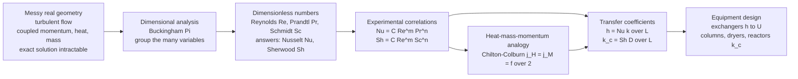

# ⚗️ Convective Transport and Correlations

> [!abstract] TL;DR
> **Convective transport correlations** are the practical toolkit that turns an *intractable* problem — predicting how fast heat and mass move between a surface and a flowing fluid in real, messy, often turbulent equipment — into a **lookup**. Rather than solving the full coupled equations of a swirling fluid inside a bundle of tubes, the chemical engineer does something pragmatic and powerful: **bundle the physics into dimensionless numbers and let experiments draw the map**. The dozen variables that govern a transfer coefficient (velocity, viscosity, density, conductivity, diffusivity, size, ...) collapse — by **dimensional analysis** — into a handful of **dimensionless groups**: **Reynolds** $Re$ (flow regime), **Prandtl** $Pr$ and **Schmidt** $Sc$ (the fluid's relative diffusivities), and the *answers* we want, **Nusselt** $Nu = hL/k$ (dimensionless heat-transfer coefficient) and **Sherwood** $Sh = k_c L/D$ (dimensionless mass-transfer coefficient). Thousands of experiments then collapse onto a single curve of the form $Nu = C\,Re^{m}Pr^{n}$ (Dittus-Boelter, Sieder-Tate, and geometry-specific cousins for shells, tube banks, packed beds, and particles), with a mass-transfer twin $Sh = C\,Re^{m}Sc^{n}$. The deepest payoff is the **heat-mass-momentum analogy** (Reynolds and Chilton-Colburn: $j_H = j_M \approx f/2$), which lets a single friction or heat measurement predict *all three* transports. These correlations are how the coefficients $h$ and $k_c$ are **actually obtained** for design — sizing heat exchangers ($h \to U$), separation columns ($k_c \to$ column height), reactors, dryers, and coolers — and how lab-scale data is made transferable to full-scale plants through **similarity and scale-up**.

## Intuition

**Analogy:** Imagine you must predict *exactly* how fast a hot tube cools the river of fluid rushing past it. In principle you would solve the equations of motion, energy, and diffusion together, everywhere, for all time. But the geometry is a tangle of baffles and tube bundles, and the flow is **turbulent** — chaos with a fractal of eddies. Solving that head-on is hopeless. So engineers pull a trick that is one of the great pragmatic moves in all of science: instead of asking *"what is the heat-transfer coefficient in **this** specific pipe at **this** flow?"* — a question with a million special answers — they ask *"what is the **Nusselt number** as a function of the **Reynolds** and **Prandtl** numbers?"* — a question with **one universal answer**. When you plot the dimensionless heat transfer against the dimensionless flow, thousands of experiments on different fluids, pipes, and speeds **collapse onto a single curve**.

It is the engineering equivalent of a discovery every physicist loves: *all pendulums, whatever their length or bob, obey the same scaling law once you use the right dimensionless combination.* A child's swing and a wrecking ball are the same equation in disguise. In the same way, water in a kitchen tap, oil in a refinery pipe, and air over a heat sink are the **same correlation** in disguise, once you speak in $Re$, $Pr$, $Nu$. The correlation is the **map** that experiment drew once so that no one ever has to solve the impossible equations again — you just look up your position on the curve.

---

## How It Works

### Core Mechanics

1. **State the intractable problem honestly.** A **transfer coefficient** — $h$ for heat (units $\mathrm{W/m^2K}$) or $k_c$ for mass ($\mathrm{m/s}$) — is defined by lumping all the complexity of the flow near a surface into one number: $q'' = h\,\Delta T$ and $N_A = k_c\,\Delta C$. But $h$ itself depends on velocity $v$, density $\rho$, viscosity $\mu$, conductivity $k$, heat capacity $c_p$, and a length $L$ — and in real, turbulent, complex geometry there is no closed-form way to compute it from first principles.

2. **Reduce the variables by dimensional analysis.** The **Buckingham Pi theorem** says a relation among $q$ dimensional variables built from $u$ fundamental units reduces to $q-u$ **dimensionless groups**. The seven heat-transfer variables above (three base dimensions: mass, length, time, temperature — four here) collapse to a relation among just **three** groups: $Nu = f(Re, Pr)$. This is the same [[Dimensional_Analysis_and_Similarity|similarity]] logic that governs all of fluid mechanics — the number of experiments needed drops from a combinatorial nightmare to a single curve.

3. **Know the key groups and what each contends.** Each group is a **ratio of competing effects**:
   - **Reynolds** $Re = \rho v L/\mu = vL/\nu$ — inertial vs viscous forces; sets the **flow regime** (laminar, transitional, turbulent).
   - **Prandtl** $Pr = \nu/\alpha = c_p\mu/k$ — momentum diffusivity vs **thermal** diffusivity; a *fluid property* (~0.7 for gases, ~7 for water, ~1000s for oils).
   - **Schmidt** $Sc = \nu/D$ — momentum diffusivity vs **mass** diffusivity; the mass-transfer twin of $Pr$.
   - **Nusselt** $Nu = hL/k$ — the *dimensionless heat-transfer coefficient*; ratio of convective to pure-conductive transport across the film (it is the **answer** to solve for).
   - **Sherwood** $Sh = k_c L/D$ — the *dimensionless mass-transfer coefficient*; the mass-transfer twin of $Nu$.
   - Supporting cast: **Stanton** $St = Nu/(Re\,Pr) = h/\rho v c_p$; **Peclet** $Pe = Re\,Pr$ (advection vs diffusion); **Grashof** $Gr$ and **Rayleigh** $Ra = Gr\,Pr$ (buoyancy vs viscosity — the drivers of **natural/free convection**).

4. **Let experiment draw the map — the correlation.** With variables reduced, one fits data to a **power law**:
   $$Nu = C\,Re^{m}\,Pr^{n} \qquad\text{(forced convection, heat)}$$
   $$Sh = C\,Re^{m}\,Sc^{n} \qquad\text{(forced convection, mass)}$$
   The famous **Dittus-Boelter** correlation for turbulent tube flow is $Nu = 0.023\,Re^{0.8}Pr^{n}$ ($n=0.4$ heating, $0.3$ cooling); **Sieder-Tate** adds a viscosity-ratio factor $(\mu/\mu_w)^{0.14}$ for large property variation; and there are geometry-specific forms for **shells, tube banks, packed beds, and single particles** (Ranz-Marshall). For **natural convection** the flow drives itself, so $Re$ is replaced by buoyancy: $Nu = C\,(Gr\,Pr)^{a} = C\,Ra^{a}$.

5. **Cash in the answer for design.** Invert the dimensionless coefficient back to a dimensional one: $h = Nu\,k/L$ and $k_c = Sh\,D/L$. These feed straight into the equipment sizing — $h$ combines into the overall coefficient $U$ of a **heat exchanger**, and $k_c$ sets the **height of a separation column** or the drying rate of a solid.

6. **Exploit the deep analogy.** Because momentum, heat, and mass are transported by the **same eddies**, their correlations are structurally identical, and the **Reynolds / Chilton-Colburn analogy** ties them together: the **j-factors** $j_H = St\,Pr^{2/3}$ and $j_M = St_m\,Sc^{2/3}$ satisfy $j_H = j_M \approx f/2$ (with $f$ the Fanning friction factor). One measurement — even a pressure drop — predicts the other two. Scarce data goes far.

### Flow / Architecture



---

## Key Concepts

### Secondary Level

- **The problem is too hard to solve, so we measure it once and reuse the answer forever.** Predicting exactly how fast heat leaves a real, complicated, turbulent piece of equipment is essentially impossible with pure math. Instead, engineers run experiments and package the result as a reusable formula — a **correlation**.
- **Dimensionless numbers are "smart ratios" that hide the messy details.** Instead of tracking a dozen separate quantities, you combine them into a few pure numbers (no units left). The **Reynolds number** tells you whether the flow is smooth (laminar) or chaotic (turbulent); the **Nusselt number** is just the heat-transfer coefficient in disguise.
- **One curve fits everyone.** When results are plotted in these smart ratios, water, oil, and air all fall on the *same* line. That is why a single correlation works across wildly different fluids and pipe sizes — the units-free plot erased the differences.
- **Heat and mass transfer are cousins.** The way heat spreads from a hot pipe and the way a smell spreads from an evaporating puddle obey **the same kind of formula**. Measure one and you can often predict the other — a huge shortcut.

### Undergraduate Level

- **Transfer coefficients hide the boundary-layer physics.** $h$ and $k_c$ are *defined* by $q'' = h\,\Delta T$ and $N_A = k_c\,\Delta C$; physically, near a wall a thin **film** ([[The_Boundary_Layer|boundary layer]]) resists transport, and $h \sim k/\delta_t$ — the coefficient is large when the thermal film is thin, which is exactly what turbulence and high velocity achieve.
- **The core dimensionless groups and their meaning.**
  $$Re = \frac{\rho v L}{\mu},\quad Pr = \frac{\nu}{\alpha} = \frac{c_p \mu}{k},\quad Sc = \frac{\nu}{D},\quad Nu = \frac{hL}{k},\quad Sh = \frac{k_c L}{D}.$$
  $Re$ selects the regime; $Pr$ and $Sc$ are *fluid properties* comparing how fast momentum diffuses relative to heat and mass; $Nu$ and $Sh$ are the dimensionless coefficients you solve for.
- **The workhorse correlation form.** $Nu = C\,Re^{m}Pr^{n}$. In **laminar fully developed pipe flow**, $Nu$ is a *constant* (3.66 for constant wall temperature, 4.36 for constant wall flux) — heat transfer does not improve with flow. In **turbulent** flow, **Dittus-Boelter** gives $Nu = 0.023\,Re^{0.8}Pr^{0.4}$: because $m = 0.8$, pushing more flow strongly *raises* $h$. This jump at the laminar-turbulent transition is why turbulence is deliberately promoted in exchangers.
- **Forced vs natural convection.** In **forced** convection an external pump/fan sets $v$ and hence $Re$. In **natural (free)** convection the fluid moves *because* it is heated (buoyancy), so $Re$ is irrelevant and the driver is the **Grashof** number $Gr = g\beta\Delta T\,L^3/\nu^2$; correlations take the form $Nu = C\,Ra^{a}$ with $Ra = Gr\,Pr$.
- **Corrections that matter in practice.** **Entrance effects** (transfer is higher where the boundary layer is still developing), **property variation** across the film (**Sieder-Tate** factor $(\mu/\mu_w)^{0.14}$ for viscous liquids), and **geometry** (a shell-side tube bank, a packed bed, or a sphere each has its own $C, m$) all modify the base power law.
- **From coefficient to design number.** Recover $h = Nu\,k/L$ and $k_c = Sh\,D/L$; then $h$ enters the **overall coefficient** $1/U = 1/h_i + R_{wall} + 1/h_o$ that sizes a heat exchanger, and $k_c$ enters the **mass-transfer unit** count that sets a column's height.

### Graduate Level

- **The analogies, from Reynolds to Chilton-Colburn.** If momentum, heat, and mass are carried by the same turbulent eddies and the diffusivities are equal ($Pr = Sc = 1$), **Reynolds' analogy** gives $St = f/2$ directly. Real fluids have $Pr, Sc \neq 1$, so **Chilton-Colburn** generalizes it with **j-factors**:
  $$j_H = St\,Pr^{2/3} = \frac{Nu}{Re\,Pr^{1/3}}, \qquad j_M = St_m\,Sc^{2/3} = \frac{Sh}{Re\,Sc^{1/3}}, \qquad j_H \approx j_M \approx \frac{f}{2}.$$
  This is the practical expression of the **transport trinity**: one correlation (or even a pressure-drop measurement) predicts all three. The Prandtl and von Karman analogies refine it by resolving the viscous sublayer, buffer, and turbulent core separately.
- **Why $Pr^{2/3}$ and where analogies break.** The $2/3$ exponent comes from boundary-layer theory: the ratio of thermal-to-momentum boundary-layer thickness scales as $Pr^{-1/3}$, so $Nu \sim Re^{1/2}Pr^{1/3}$ (laminar flat plate) or $Re^{0.8}Pr^{1/3}$ (turbulent). The analogy **fails when form drag dominates** (flow over bluff bodies, tube banks, packed beds) because pressure drag adds to $f$ without a matching heat/mass mechanism — then $j_H = j_M$ still holds but $j \neq f/2$.
- **Blending, entry regions, and the full correlation zoo.** **Gnielinski** ($Nu = (f/8)(Re-1000)Pr/[1 + 12.7\sqrt{f/8}(Pr^{2/3}-1)]$) is far more accurate than Dittus-Boelter across $3000 < Re < 5\times10^6$ and wide $Pr$; **Ranz-Marshall** ($Nu = 2 + 0.6\,Re^{1/2}Pr^{1/3}$) for spheres shows the conduction-limited floor $Nu \to 2$ as $Re \to 0$; **Colburn / Zukauskas** for tube banks; **Wilke-Chang / Frossling** analogs for mass transfer. The additive "$2 +$" and "$3.66$" floors are the pure-diffusion limits the correlations must reduce to.
- **Similarity and scale-up.** Because the correlation is written in dimensionless groups, **geometric + dynamic + thermal similarity** ($Re$, $Pr$ matched) makes small-scale data predictive of full scale. This is the rigorous basis of **scale-up**: run a bench exchanger at the plant's $Re$ and $Pr$ and the measured $Nu$ transfers. The limits appear when *not all* groups can be matched simultaneously (e.g. $Re$ and $Gr$, or free-surface $Fr$) — the classic scale-up compromise.
- **The transfer-coefficient / driving-force decomposition.** All of convective transport is $\text{flux} = \text{coefficient} \times \text{driving force}$, and the coefficient is a **resistance** in series with wall conduction and the other-side film; the heat-mass analogy lets a designer estimate an *unmeasured* mass-transfer coefficient from a *measured* heat-transfer coefficient (or friction), which is invaluable in drying, humidification (the **Lewis relation** $h/(k_c\rho c_p) = Le^{2/3}$), and catalytic-particle design.

---

## Python Demo

```python
# Convective transport correlations in ONE figure:
#
#   (a) NUSSELT CORRELATION -> heat-transfer coefficient h
#       Turbulent pipe flow follows Dittus-Boelter  Nu = 0.023 Re^0.8 Pr^0.4,
#       while fully developed LAMINAR flow has a CONSTANT Nu = 3.66.
#       Converting Nu -> h = Nu k / D shows how h barely moves in the laminar
#       regime but climbs steeply (as Re^0.8, i.e. with flow rate) once the
#       flow turns turbulent -- the reason exchangers are run turbulent.
#
#   (b) HEAT-MASS-MOMENTUM ANALOGY (Chilton-Colburn)
#       The j-factors  j_H = Nu/(Re Pr^{1/3})  and  j_M = Sh/(Re Sc^{1/3})
#       and half the Fanning friction factor  f/2  all COLLAPSE onto the same
#       curve  0.023 Re^-0.2 : one correlation predicts heat AND mass transfer
#       AND friction.
#
# Requires: numpy, matplotlib   (no scipy)
import numpy as np
import matplotlib.pyplot as plt

# ---- fluid + geometry: water in a 25 mm tube ----
k_th = 0.61      # W/(m K), thermal conductivity of water
D    = 0.025     # m, tube inside diameter
Pr   = 5.0       # Prandtl number of water (~ nu/alpha)
Sc   = 0.6       # Schmidt number of a typical gas (mass-transfer panel)

Re = np.logspace(2.0, 5.3, 500)          # Reynolds number 100 .. ~200000

# ---- (a) Nusselt correlation, split by regime ----
lam  = Re < 2100.0                        # laminar
turb = Re > 4000.0                        # fully turbulent
Nu = np.full_like(Re, np.nan)
Nu[lam]  = 3.66                           # constant-wall-temperature laminar
Nu[turb] = 0.023 * Re[turb]**0.8 * Pr**0.4   # Dittus-Boelter (heating)
h = Nu * k_th / D                         # W/(m^2 K), convert Nu -> h

# ---- (b) Chilton-Colburn j-factors (turbulent branch) ----
Re_t   = Re[turb]
Nu_col = 0.023 * Re_t**0.8 * Pr**(1.0/3.0)   # Colburn form (Pr^{1/3})
Sh_col = 0.023 * Re_t**0.8 * Sc**(1.0/3.0)   # mass-transfer twin
jH     = Nu_col / (Re_t * Pr**(1.0/3.0))     # -> 0.023 Re^-0.2
jM     = Sh_col / (Re_t * Sc**(1.0/3.0))     # -> 0.023 Re^-0.2
half_f = 0.046 * Re_t**(-0.2) / 2.0          # f_Fanning/2 -> 0.023 Re^-0.2

# ---- console summary ----
def nearest(arr, target):
    return int(np.argmin(np.abs(arr - target)))

iL, iT = nearest(Re, 1500.0), nearest(Re, 5.0e4)
print("=== (a) Dittus-Boelter: Nu and h for water, D = 25 mm ===")
print(f"  laminar   Re=1500 :  Nu = {Nu[iL]:6.2f}   h = {h[iL]:8.1f} W/m^2K")
print(f"  turbulent Re=50000:  Nu = {Nu[iT]:6.1f}   h = {h[iT]:8.1f} W/m^2K")
print(f"  -> turbulence raises h by ~{h[iT]/h[iL]:.0f}x at these conditions")
j = nearest(Re_t, 5.0e4)
print("=== (b) Chilton-Colburn analogy at Re = 50000 ===")
print(f"  j_H = {jH[j]:.5f}   j_M = {jM[j]:.5f}   f/2 = {half_f[j]:.5f}")
print("  -> all three coincide: one correlation predicts heat, mass, friction")

# ----------------------------- plotting -----------------------------
fig, (axL, axR) = plt.subplots(1, 2, figsize=(14, 6))
fig.suptitle("Convective transport by dimensionless correlations: "
             "Nu -> h, and the Chilton-Colburn heat-mass-momentum analogy",
             fontsize=13, fontweight="bold")

# LEFT: Nu (and h on twin axis) vs Re
axL.axvspan(2100, 4000, color="grey", alpha=0.15)          # transition band
axL.loglog(Re[lam],  Nu[lam],  color="#264653", lw=3,
           label="laminar  Nu = 3.66 (constant)")
axL.loglog(Re[turb], Nu[turb], color="#e76f51", lw=3,
           label="turbulent  Nu = 0.023 Re^0.8 Pr^0.4")
axL.set_xlabel("Reynolds number  Re  (proportional to flow rate)")
axL.set_ylabel("Nusselt number  Nu = h D / k", color="#e76f51")
axL.tick_params(axis="y", labelcolor="#e76f51")
axL.set_title("(a) NUSSELT CORRELATION -> heat-transfer coefficient", fontsize=11)
axL.grid(which="both", alpha=0.3)
axL.text(2600, 4.5, "transition", rotation=90, va="bottom", fontsize=8, color="grey")

axLh = axL.twinx()                                         # h on the right axis
axLh.loglog(Re[lam],  h[lam],  color="#2a9d8f", lw=1.6, ls="--")
axLh.loglog(Re[turb], h[turb], color="#2a9d8f", lw=1.6, ls="--",
            label="h = Nu k / D  [W/m^2K]")
axLh.set_ylabel("heat-transfer coefficient  h  [W/m^2K]", color="#2a9d8f")
axLh.tick_params(axis="y", labelcolor="#2a9d8f")
lines = axL.get_legend_handles_labels()[0] + axLh.get_legend_handles_labels()[0]
labs  = axL.get_legend_handles_labels()[1] + axLh.get_legend_handles_labels()[1]
axL.legend(lines, labs, loc="upper left", fontsize=8)

# RIGHT: j-factors and f/2 collapse
axR.loglog(Re_t, jH,     color="#e76f51", lw=3,  label="j_H = Nu / (Re Pr^1/3)  (heat)")
axR.loglog(Re_t, jM,     color="#264653", lw=1.6, ls="--",
           label="j_M = Sh / (Re Sc^1/3)  (mass)")
axR.loglog(Re_t[::12], half_f[::12], "o", color="#2a9d8f", ms=6,
           label="f / 2  (friction)")
axR.set_xlabel("Reynolds number  Re")
axR.set_ylabel("j-factor  /  f over 2")
axR.set_title("(b) HEAT-MASS-MOMENTUM ANALOGY: j_H = j_M = f/2", fontsize=11)
axR.grid(which="both", alpha=0.3)
axR.legend(loc="upper right", fontsize=8)

plt.tight_layout(rect=[0, 0, 1, 0.95])
plt.show()
```

Running this prints the coefficient jump and draws two panels. The **left panel** is the correlation-to-coefficient story: in the **laminar** regime the Nusselt number is *flat* at 3.66 — pushing more flow buys you almost no extra heat transfer — then, past the shaded **transition** band, the turbulent **Dittus-Boelter** curve takes over with its steep $Re^{0.8}$ slope. The dashed green twin axis shows the *dimensional* payoff: the heat-transfer coefficient $h = Nu\,k/D$ climbs by roughly an order of magnitude as flow turns turbulent, which is precisely why heat exchangers are deliberately run turbulent. The **right panel** is the analogy: the heat j-factor $j_H$, the mass j-factor $j_M$, and half the friction factor $f/2$ all **collapse onto one line**, $0.023\,Re^{-0.2}$. That single collapsed curve is the practical miracle — a pressure-drop measurement (friction) predicts the heat-transfer coefficient, which predicts the mass-transfer coefficient, letting scarce experimental data cover all three transports.

---

## Real-World Applications

> **Example — a shell-and-tube heat exchanger.** Sizing an exchanger is impossible without correlations. The engineer needs the **overall coefficient** $U$, where $1/U = 1/h_i + R_{wall} + 1/h_o$. The tube-side coefficient $h_i$ comes straight from **Dittus-Boelter or Gnielinski** ($Nu = 0.023\,Re^{0.8}Pr^{0.4} \to h_i = Nu\,k/D$), while the shell-side $h_o$ — flow across a bank of tubes through baffles, a geometry with no analytical solution — comes from a **Zukauskas / Colburn tube-bank correlation** or the Kern/Bell-Delaware method, each a fitted $Nu = C\,Re^{m}Pr^{n}$ for that specific arrangement. Every exchanger on the planet is sized this way; the correlation *is* the design equation.

- **Distillation and absorption columns.** The **height** of a packed column is set by mass transfer: $Z = H_{OG}\times N_{OG}$, and $H_{OG}$ depends on the gas- and liquid-film coefficients $k_c$ obtained from **Sherwood correlations** ($Sh = C\,Re^{m}Sc^{n}$) for the specific packing. Onda's correlations for random packings are textbook examples — no correlation, no column height.
- **Catalytic and packed-bed reactors.** External transport to catalyst particles is set by the **Ranz-Marshall** correlation $Nu = 2 + 0.6\,Re^{1/2}Pr^{1/3}$ (and its mass twin $Sh = 2 + 0.6\,Re^{1/2}Sc^{1/3}$), which decides whether the reaction is kinetics-limited or film-diffusion-limited — a first-order design question for every heterogeneous reactor.
- **Dryers and evaporative cooling.** Drying rate is a **mass-transfer** coefficient problem, but the surface temperature is set by the coupled **heat** transfer; the **Lewis relation** ($h/k_c\rho c_p = Le^{2/3}$), a direct consequence of the Chilton-Colburn analogy, links the two so a dryer or cooling tower can be designed from a single set of transfer data. Wet-bulb thermometry is this analogy in action.
- **Cooling of electronics and process equipment.** Heat-sink and cold-plate design uses forced-convection $Nu$ correlations; when fans fail, **natural-convection** correlations $Nu = C\,Ra^{a}$ (buoyancy-driven) set the safe passive dissipation limit.
- **Scale-up from pilot plant to production.** Because correlations are dimensionless, a coefficient measured on a bench unit at the plant's $Re$ and $Pr$ transfers to the full-scale vessel — the rigorous, everyday use of **similarity** to de-risk a hundred-million-dollar plant from a benchtop rig.

---

## Common Pitfalls

- **Using a correlation outside its validity range.** Every correlation is a *fit* over a stated window — Dittus-Boelter is for $Re > 10^4$, $0.6 < Pr < 160$, $L/D > 10$, smooth tubes, *moderate* property variation. Applying it at $Re = 1500$ (laminar), to a viscous oil, or in the entrance region gives silently wrong numbers. Always check the range and pick the geometry-matched form.
- **Ignoring the laminar-turbulent distinction.** In laminar flow $Nu$ is a *constant* (3.66 or 4.36), so heat transfer does **not** improve with velocity; assuming the turbulent $Re^{0.8}$ scaling in the laminar regime badly over-predicts $h$. Check $Re$ first, then choose the correlation.
- **Forgetting property variation across the film.** Fluid properties ($\mu$, $k$, $\rho$) are evaluated at a reference temperature (often the bulk or film mean), but a large wall-to-bulk temperature difference makes them vary sharply — hence the **Sieder-Tate** $(\mu/\mu_w)^{0.14}$ correction for viscous liquids. Evaluating all properties at the bulk temperature for a heated viscous oil can be off by tens of percent.
- **Blindly applying $j_H = f/2$ where form drag dominates.** For flow over tube banks, packed beds, and bluff bodies, the friction factor includes **pressure (form) drag** that has no heat-transfer counterpart, so $f/2$ over-predicts $j_H$. The heat-mass analogy $j_H = j_M$ still holds, but the momentum leg does not — do not use friction to predict heat transfer there.
- **Mismatching the characteristic length and driving force.** $Nu = hL/k$ requires the *same* $L$ the correlation was fit with (diameter for tubes, plate length for flat plates, particle diameter for beds), and the coefficient must pair with the correct **mean driving force** (LMTD for exchangers, log-mean concentration for columns). Mixing an arithmetic-mean $\Delta T$ with a coefficient fit to LMTD is a classic sizing error.
- **Confusing the Prandtl and Schmidt roles, or the fluid vs flow groups.** $Re$ is a *flow* group (changes with pump speed); $Pr$ and $Sc$ are *fluid-property* groups (fixed for a given fluid and temperature). Treating $Pr$ as if it changed with flow, or reusing a gas-phase $Sc$ for a liquid, breaks the correlation.
- **Assuming forced-convection forms when buoyancy dominates.** At low forced velocities with large $\Delta T$, **natural convection** (governed by $Gr$/$Ra$, not $Re$) can dominate or combine with forced convection (mixed convection, characterized by $Gr/Re^2$). Using a pure forced-convection correlation there under-predicts transfer.

---

## Related Concepts

**Fluid Dynamics vault — the machinery the correlations rest on**
- [[Dimensional_Analysis_and_Similarity]] — the Buckingham-Pi and similarity engine that *produces* the dimensionless groups and justifies why one curve fits all fluids; the theoretical basis of every correlation and of scale-up
- [[The_Boundary_Layer]] — the thin near-wall film whose thickness *is* the transfer resistance ($h \sim k/\delta_t$); boundary-layer theory supplies the $Re^{1/2}Pr^{1/3}$ scaling the correlations codify
- [[Turbulence_Fundamentals]] — why the exact problem is intractable and why the *same* eddies carry momentum, heat, and mass, which is the physical root of the Chilton-Colburn analogy
- [[Fluid_Dynamics_Overview]] — the parent map of momentum transport that feeds the friction factor $f$ appearing in the analogy

**Mechanical Engineering vault — the heat-transfer companion**
- [[Convection_and_Radiation]] — the mechanical-engineering treatment of the same convective heat coefficient $h$ and its Nusselt correlations, aimed at heat exchangers and thermal systems

*Section siblings (to be written): this note is the practical toolkit that the transport section's Transport_Phenomena_Overview introduces and that Momentum_Transport_and_Fluid_Flow (which supplies the friction factor $f$ and the Reynolds number), Heat_Transfer_in_Process_Equipment (which turns $h$ into an exchanger's $U$), and Mass_Transfer_and_Diffusion (which turns $k_c$ into a column height) all depend on; Scale_Up_and_Process_Intensification uses the dimensionless-similarity argument developed here to make bench data transferable to full-scale equipment.*

---

## Review Questions

**Secondary**
1. An engineer needs to know how fast a hot pipe will heat the fluid flowing through it, but the real equipment is too complicated to solve exactly. Explain, in plain terms, how *dimensionless numbers* and a *correlation* let them get the answer anyway — and why the same formula can work for water, oil, and air. Use the pendulum-scaling analogy in your explanation.

**Undergraduate**
2. Water ($Pr = 5$, $k = 0.61\,\mathrm{W/mK}$) flows through a 25 mm tube. (a) At $Re = 1500$ the flow is laminar; state the Nusselt number and compute $h$. (b) At $Re = 50{,}000$ the flow is turbulent; use Dittus-Boelter $Nu = 0.023\,Re^{0.8}Pr^{0.4}$ to compute $Nu$ and $h$. (c) By roughly what factor did $h$ increase, and why does this justify deliberately operating heat exchangers in the turbulent regime? (d) Name two conditions under which Dittus-Boelter should *not* be used and give the appropriate alternative.

**Graduate**
3. A dryer designer has good **heat-transfer** data for a given gas-solid geometry but no **mass-transfer** data. (a) State the Chilton-Colburn analogy in terms of the j-factors and explain the physical reason momentum, heat, and mass correlations share the same form. (b) Show how the analogy lets them estimate the mass-transfer coefficient $k_c$ from the measured heat-transfer coefficient $h$ (introduce the Lewis relation $h/(k_c\rho c_p) = Le^{2/3}$). (c) The same designer wants to reuse the *friction* factor to predict $h$ for flow across a packed bed and finds the prediction too high — explain why $j_H = f/2$ fails there even though $j_H = j_M$ still holds, and what that says about form drag.

---

## Sources

- R. B. Bird, W. E. Stewart & E. N. Lightfoot — *Transport Phenomena*, 2nd ed. (Wiley, 2007) — the definitive unified treatment of momentum, heat, and mass transport, dimensional analysis, and the analogies among them
- J. R. Welty, C. E. Wicks, R. E. Wilson & G. L. Rorrer — *Fundamentals of Momentum, Heat, and Mass Transfer*, 6th ed. (Wiley, 2014) — the classic parallel development of the three transports, dimensionless groups, and correlations
- F. P. Incropera & D. P. DeWitt — *Fundamentals of Heat and Mass Transfer*, 8th ed. (Wiley, 2017) — comprehensive convection correlations (Dittus-Boelter, Sieder-Tate, Gnielinski, Zukauskas, Churchill-Chu) and the heat-mass analogy
- C. J. Geankoplis — *Transport Processes and Separation Process Principles*, 4th ed. (Prentice Hall, 2003) — chemical-engineering-oriented correlations for pipes, packed beds, particles, and separation equipment
- T. K. Sherwood, R. L. Pigford & C. R. Wilke — *Mass Transfer* (McGraw-Hill, 1975) — the reference on mass-transfer coefficients, Sherwood correlations, and the Chilton-Colburn j-factor framework

---

#chemical-engineering #convection #dimensionless-numbers #nusselt #correlations
