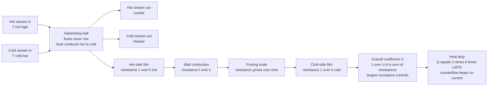

# 🌡️ Heat Transfer in Process Equipment

> [!abstract] TL;DR
> A chemical plant is a machine for **moving heat**: reactions must be lit or cooled, products boiled apart and chilled for storage. **Heat transfer** is the transport leg that does this, and its workhorse is the **heat exchanger** — a bundle of tubes where a hot stream and a cold stream flow past each other, trading warmth through a metal wall **without ever mixing**. Heat crosses that wall through a chain of **series resistances** (hot-side film, wall conduction, **fouling** scale, cold-side film) that combine into one **overall heat-transfer coefficient** $U$ via $\frac{1}{UA} = \sum R$. Equipment is sized from the **heat duty** $Q = U A\,\Delta T_{lm}$ (the **LMTD method**) or rated with **effectiveness-NTU**; **counterflow** beats co-current because the cold outlet can cross above the hot outlet. Boiling **reboilers**, condensing **condensers**, **fired heaters**, and **evaporators** exploit the enormous coefficients of phase change, while **pinch analysis** wires many exchangers into a network that recovers waste heat. Sizing $U$, $A$, and $\Delta T_{lm}$, and fighting fouling, are core chem-eng tasks — and efficient heat integration is central to process economics and decarbonization.

## Intuition

**Analogy:** Picture **two rivers running side by side, separated only by a shared stone bank.** One river is hot, the other cold. Not a single drop crosses over — yet the hot river warms the bank, the bank warms the cold river, and the two leave with their temperatures nudged toward each other. That shared bank, quietly conducting heat while keeping the streams apart, is a **heat exchanger**. A distillation **reboiler**, an overhead **condenser**, a crude **fired heater**, and a reactor **cooling jacket** are all this same idea wearing different costumes — the entire thermal life of a plant runs on it.

Now think about *how much* heat actually gets across that bank. Heat behaves **exactly like electric current flowing through resistors in series**: it must fight its way through the stagnant fluid film clinging to the hot wall, then through the pipe wall itself, then through any crusty **fouling scale** that has built up, then through the cold-side film. Each layer *resists*. The resistances add up, and their sum sets how many watts squeeze through per degree of temperature difference. Make any one resistance dominate — usually a sluggish gas film or a fouled tube — and it throttles the whole exchanger, no matter how good the rest is.

---

## How It Works

### Core Mechanics

1. **The three modes, briefly.** Heat moves by **conduction** (Fourier's law, $q = -kA\,dT/dx$, through solid walls — the domain of [[Conduction_Heat_Transfer]]); **convection** (Newton's law of cooling, $q = h A\,\Delta T$, where the **film coefficient** $h$ governs fluid-to-wall transfer and is correlated from the **Nusselt**, **Reynolds**, and **Prandtl** numbers — see [[Convection_and_Radiation]]); and **radiation** (Stefan-Boltzmann, $q = \varepsilon\sigma A T^4$, which becomes a leading term only in **furnaces and fired heaters**). Process equipment stitches these three together.

2. **Heat crosses a wall through resistances in series.** From hot fluid to cold fluid, heat fights, in order: the **hot-side convective film** $1/(h_h A_h)$, **wall conduction** $t/(k A_w)$, any **fouling** layers $R_{foul}$, and the **cold-side film** $1/(h_c A_c)$. Because they are in series they simply add, and their sum defines the **overall heat-transfer coefficient** $U$: $\frac{1}{U A} = \frac{1}{h_h A_h} + \frac{t}{k A_w} + R_{foul} + \frac{1}{h_c A_c}$. The **largest** resistance (often a gas-side film) controls the whole device — which is why gas surfaces are finned.

3. **Fouling degrades $U$ over time.** Scale, biofilm, coke, and corrosion products deposit on the tubes, adding a **fouling resistance** $R_{foul}$ that grows month by month. It is bundled into $U$ through tabulated *fouling factors*, and it is a genuine operating headache: a fouled crude-preheat train or condenser silently loses duty, forcing more fuel or lost throughput until it is cleaned.

4. **The driving force is a temperature difference that changes along the exchanger.** Near the hot inlet the gap $T_h - T_c$ is wide; downstream it shrinks. The correct average is the **log-mean temperature difference**, $\Delta T_{lm} = \dfrac{\Delta T_1 - \Delta T_2}{\ln(\Delta T_1/\Delta T_2)}$, giving the **heat duty** $Q = U A\,\Delta T_{lm}$ — the **LMTD method**, used to *size* the area when all four terminal temperatures are known (multipass and crossflow units add a correction factor $F$).

5. **When outlets are unknown, use effectiveness-NTU.** With capacity rates $C = \dot m c_p$, define $\mathrm{NTU} = UA/C_{min}$ and $C_r = C_{min}/C_{max}$; the **effectiveness** $\varepsilon = Q/Q_{max}$ follows a closed form set by the flow arrangement, and $Q = \varepsilon\,C_{min}(T_{h,in}-T_{c,in})$. **Counterflow** (streams enter opposite ends) keeps a wide driving gap the whole length, extracts more heat than **co-current** flow, and uniquely permits a **temperature cross** where the cold outlet leaves hotter than the hot outlet.

### Flow / Architecture



---

## Key Concepts

### Secondary Level

- **A heat exchanger moves heat, not fluid.** Two streams at different temperatures pass a shared wall; the hot one cools, the cold one warms, and they never mix. A distillation reboiler, a car radiator, and a refrigerator's coils are all heat exchangers.
- **Heat flows like electricity through resistances.** To get from the hot stream to the cold stream, heat must push through several layers stacked in a row — the fluid film on each side, the metal wall, and any scale. Each layer slows it down; together they decide how much heat gets through.
- **Bigger temperature gap, faster heat.** Heat always flows from hot to cold, and the wider the temperature difference, the faster it moves — so exchangers pack in huge surface area with thin tubes and fins.
- **Boiling and condensing move heat spectacularly well.** When a liquid boils or a vapor condenses, it soaks up or dumps enormous amounts of heat at almost constant temperature. Plants exploit this in reboilers and condensers.

### Undergraduate Level

- **The three modes in equipment.** *Conduction* through tube walls ($q=-kA\,dT/dx$); *convection* fluid-to-wall through a boundary-layer film whose coefficient $h$ comes from a **Nusselt correlation** $Nu = C\,Re^m Pr^n$ (e.g. Dittus-Boelter for turbulent tube flow); *radiation* ($q=\varepsilon\sigma A T^4$), important only in fired heaters and furnaces where wall temperatures are high.
- **The overall coefficient and controlling resistance.** $\frac{1}{UA} = \frac{1}{h_h A_h} + \frac{t}{kA_w} + R_{foul} + \frac{1}{h_c A_c}$. The **smallest** $h$ (usually a gas or viscous side) sets $U$; polishing the fast side does nothing. Referencing to a chosen area (inside or outside) matters when $A_h \neq A_c$.
- **LMTD method (sizing).** With all four terminal temperatures known, form $\Delta T_1$ and $\Delta T_2$ at the ends, compute $\Delta T_{lm}$, and solve $A = Q/(U\,\Delta T_{lm})$. Apply the correction factor $F$ for multipass shell-and-tube and crossflow geometries: $Q = F\,U A\,\Delta T_{lm}$.
- **Effectiveness-NTU method (rating).** Counterflow: $\varepsilon = \dfrac{1-e^{-\mathrm{NTU}(1-C_r)}}{1 - C_r e^{-\mathrm{NTU}(1-C_r)}}$ (and $\mathrm{NTU}/(1+\mathrm{NTU})$ when $C_r=1$); co-current: $\varepsilon = \dfrac{1-e^{-\mathrm{NTU}(1+C_r)}}{1+C_r}$. The **phase-change limit** $C_r \to 0$ (a boiling or condensing stream at constant temperature) gives $\varepsilon = 1 - e^{-\mathrm{NTU}}$ for any arrangement.
- **Exchanger types.** **Shell-and-tube** (rugged, high-pressure, the industry standard); **plate** (compact, high $U$, easy to clean, food and hydronic duty); **double-pipe** (small duties, true counterflow); **air-cooled** (fin-fan banks where cooling water is scarce).
- **Co-current vs counterflow.** For identical $U$, $A$, and inlets, **counterflow transfers more heat** and permits a temperature cross. Co-current forces both temperatures to converge toward a common value, capping the cold outlet below the hot outlet.

### Graduate Level

- **Boiling curve and critical heat flux.** As wall superheat rises, boiling passes from natural convection to **nucleate boiling** (bubbles at nucleation sites — very high $h$, the desirable regime), through the **critical heat flux (CHF)** peak, into **transition** and **film boiling**, where an insulating vapor blanket collapses $h$ and can burn out the tube. Reboilers are designed to sit safely *below* CHF; the analogous **Nukiyama curve** governs why boiling is both prized and dangerous.
- **Condensation regimes.** **Filmwise** condensation (a continuous liquid film, Nusselt's falling-film analysis) versus **dropwise** condensation (droplets that shed and expose bare wall, giving coefficients up to an order of magnitude higher but hard to sustain). Condenser $U$ hinges on which regime, on non-condensable gas blanketing, and on drainage.
- **Reboiler and condenser configurations.** Thermosiphon, kettle, and forced-circulation reboilers each manage the boiling regime and circulation differently; overhead condensers may be total or partial. These set the vapor and liquid traffic that a distillation column's separation depends on, coupling heat transfer directly to mass transfer.
- **Fouling dynamics and design margin.** $R_{foul}$ is time-dependent and uncertain; **over-sizing** for a clean $U$ can paradoxically *lower velocities* and accelerate deposition. TEMA fouling factors, cleaning cycles, and velocity/surface selection are live design trade-offs, and asymptotic vs linear fouling models inform run-length scheduling.
- **Effectiveness saturation and exergy.** $\varepsilon$ rises with NTU but **saturates**; past the knee, extra area buys negligible heat while adding cost and **pressure drop**. Heat transferred across a large $\Delta T$ **destroys exergy** at rate $\dot X_{dest} = T_0 \dot S_{gen}$ — the thermodynamic reason a *minimum approach* $\Delta T$ is chosen (links to [[Laws_of_Thermodynamics]]).
- **Energy integration and pinch analysis.** Composite hot- and cold-stream enthalpy-temperature curves reveal the thermodynamic **minimum utility** demand and the **pinch** temperature no feasible design may cross. A well-integrated **heat-exchanger network** recovers 20-40 percent of a plant's heat, turning individual exchanger duties into a plant-wide efficiency and emissions target.

---

## Python Demo

```python
# Heat transfer in process equipment, in one figure:
#
#   (a) RESISTANCE NETWORK -> U : heat crosses the wall through series
#       resistances (hot film + wall + cold film, plus FOULING). We stack
#       them for a clean vs fouled exchanger, show which one DOMINATES,
#       and print how fouling degrades the overall coefficient U.
#
#   (b) TEMPERATURE PROFILES : the same duty run COUNTERFLOW vs CO-CURRENT
#       (same U*A, capacity rates, inlets). Counterflow keeps a wider
#       driving gap, moves more heat, and lets the cold outlet CROSS above
#       the hot outlet -- impossible in co-current flow. We verify
#       Q = U*A*LMTD against Q = eps*Cmin*dT_in.
#
#   (c) EFFECTIVENESS vs NTU : arrangement ranking and the diminishing
#       returns of piling on more area.
#
# Requires: numpy, matplotlib
import numpy as np
import matplotlib.pyplot as plt

# =====================================================================
# PART (a): SERIES RESISTANCES and the overall coefficient U (per m^2)
# =====================================================================
h_hot   = 1500.0        # W/m^2K  hot-side film (condensing / liquid)
h_cold  = 800.0         # W/m^2K  cold-side film (cooling water, sluggish)
t_wall  = 2.5e-3        # m       tube wall thickness
k_wall  = 16.0          # W/mK    stainless steel conductivity
Rf_hot  = 2.0e-4        # m^2K/W  fouling, hot side
Rf_cold = 4.0e-4        # m^2K/W  fouling, cold side

R_hot  = 1.0 / h_hot                     # hot-side film resistance
R_wall = t_wall / k_wall                 # wall conduction resistance
R_cold = 1.0 / h_cold                    # cold-side film resistance
R_foul = Rf_hot + Rf_cold                # total fouling resistance

R_clean  = R_hot + R_wall + R_cold
R_fouled = R_clean + R_foul
U_clean  = 1.0 / R_clean
U_fouled = 1.0 / R_fouled

print("Series resistances (m^2K/W):")
print(f"  hot film   = {R_hot:.2e}")
print(f"  wall cond. = {R_wall:.2e}")
print(f"  cold film  = {R_cold:.2e}   <- largest single resistance (controls U)")
print(f"  fouling    = {R_foul:.2e}")
print(f"U clean  = {U_clean:6.1f} W/m^2K")
print(f"U fouled = {U_fouled:6.1f} W/m^2K   ({100*(U_clean-U_fouled)/U_clean:.0f} percent loss from fouling)")

# =====================================================================
# PART (b): temperature profiles, counterflow vs co-current
# =====================================================================
Th_in, Tc_in = 180.0, 30.0     # deg C hot and cold inlet temperatures
Ch = 2000.0                     # W/K hot-stream capacity rate  (m_dot*cp)
Cc = 3000.0                     # W/K cold-stream capacity rate
UA = 3000.0                     # W/K overall conductance = U * A

Cmin, Cmax = min(Ch, Cc), max(Ch, Cc)
Cr    = Cmin / Cmax
NTU   = UA / Cmin
dT_in = Th_in - Tc_in

def eff(NTU, Cr, kind):
    if kind == "counter":
        if np.isclose(Cr, 1.0):
            return NTU / (1.0 + NTU)
        e = np.exp(-NTU * (1.0 - Cr))
        return (1.0 - e) / (1.0 - Cr * e)
    if kind == "parallel":
        return (1.0 - np.exp(-NTU * (1.0 + Cr))) / (1.0 + Cr)
    raise ValueError(kind)

eps_cf, eps_pf = eff(NTU, Cr, "counter"), eff(NTU, Cr, "parallel")
Q_cf, Q_pf     = eps_cf * Cmin * dT_in, eps_pf * Cmin * dT_in

x = np.linspace(0.0, 1.0, 200)          # fraction of area, hot flows +x

# --- co-current: both enter at x = 0, exact exponential ---
beta_pf = UA * (1.0 / Ch + 1.0 / Cc)
q_pf = dT_in * (1.0 - np.exp(-beta_pf * x)) * (Ch * Cc / (Ch + Cc))
Th_pf = Th_in - q_pf / Ch
Tc_pf = Tc_in + q_pf / Cc

# --- counterflow: hot enters x=0, cold exits x=0 (enters x=1) ---
Tc_out = Tc_in + Q_cf / Cc               # cold outlet from effectiveness
beta_cf = UA * (1.0 / Ch - 1.0 / Cc)     # >0 since Ch < Cc
dT0 = Th_in - Tc_out                     # driving gap at x = 0
q_cf = dT0 * (1.0 - np.exp(-beta_cf * x)) * (Ch * Cc / (Cc - Ch))
Th_cf = Th_in - q_cf / Ch
Tc_cf = Tc_out - q_cf / Cc               # cold cools as x -> 1 (its inlet)

def lmtd(d1, d2):
    return d1 if np.isclose(d1, d2) else (d1 - d2) / np.log(d1 / d2)

lm_cf = lmtd(Th_in - Tc_cf[0], Th_cf[-1] - Tc_cf[-1])
print(f"\nNTU = {NTU:.2f}   Cr = {Cr:.2f}")
print(f"COUNTER : eps={eps_cf:.3f}  Q={Q_cf/1e3:6.1f} kW  "
      f"Th_out={Th_cf[-1]:5.1f}  Tc_out={Tc_cf[0]:5.1f}  U*A*LMTD={UA*lm_cf/1e3:6.1f} kW")
print(f"CO-CURR : eps={eps_pf:.3f}  Q={Q_pf/1e3:6.1f} kW  "
      f"Th_out={Th_pf[-1]:5.1f}  Tc_out={Tc_pf[-1]:5.1f}")
print(f"Counterflow moves {100*(Q_cf-Q_pf)/Q_pf:.0f} percent more heat for the same hardware.")

# =====================================================================
# PLOTS
# =====================================================================
fig, (axA, axB, axC) = plt.subplots(1, 3, figsize=(17, 5.2))
fig.suptitle("Heat transfer in process equipment: resistances set U, arrangement sets the duty",
             fontsize=14, fontweight="bold")

# (a) stacked resistance bars: clean vs fouled
labels = ["clean", "fouled"]
hot  = [R_hot,  R_hot]
wall = [R_wall, R_wall]
cold = [R_cold, R_cold]
foul = [0.0,    R_foul]
b0 = np.array(hot)
b1 = b0 + np.array(wall)
b2 = b1 + np.array(cold)
axA.bar(labels, hot,  label="hot film",  color="#d62728")
axA.bar(labels, wall, bottom=b0, label="wall conduction", color="#7f7f7f")
axA.bar(labels, cold, bottom=b1, label="cold film (dominant)", color="#1f77b4")
axA.bar(labels, foul, bottom=b2, label="fouling", color="#8c564b")
axA.text(0, R_clean*1.02,  f"U = {U_clean:.0f}",  ha="center", fontsize=10, fontweight="bold")
axA.text(1, R_fouled*1.01, f"U = {U_fouled:.0f}", ha="center", fontsize=10, fontweight="bold")
axA.set_ylabel("thermal resistance  [m^2 K per W]")
axA.set_title("(a) Series resistances -> U\nfouling silently steals duty")
axA.legend(loc="upper left", fontsize=8)
axA.grid(alpha=0.3, axis="y")

# (b) temperature profiles: counterflow (solid) vs co-current (dashed)
axB.plot(x, Th_cf, color="#d62728", lw=2.6, label="hot  (counterflow)")
axB.plot(x, Tc_cf, color="#1f77b4", lw=2.6, label="cold (counterflow)")
axB.plot(x, Th_pf, color="#d62728", lw=1.8, ls="--", label="hot  (co-current)")
axB.plot(x, Tc_pf, color="#1f77b4", lw=1.8, ls="--", label="cold (co-current)")
axB.axhline(Th_cf[-1], color="#d62728", ls=":", lw=0.9)
axB.axhline(Tc_cf[0],  color="#1f77b4", ls=":", lw=0.9)
axB.annotate("cold OUT above hot OUT\n(temperature cross)",
             xy=(0.02, Tc_cf[0]), xytext=(0.28, 150), fontsize=9,
             color="#0b5394", fontweight="bold",
             arrowprops=dict(arrowstyle="->", color="#0b5394"))
axB.set_xlabel("position along exchanger  [fraction of area]")
axB.set_ylabel("temperature  [deg C]")
axB.set_title(f"(b) Counterflow (eps={eps_cf:.2f}) beats\nco-current (eps={eps_pf:.2f})")
axB.set_ylim(0, 200)
axB.grid(alpha=0.3)
axB.legend(loc="center right", fontsize=8)

# (c) effectiveness vs NTU
NTU_ax = np.linspace(0.01, 6.0, 300)
axC.plot(NTU_ax, 1 - np.exp(-NTU_ax), "k:", lw=1.6, label="phase change  Cr=0")
axC.plot(NTU_ax, eff(NTU_ax, Cr, "counter"),  color="#2a9d8f", lw=2.4,
         label=f"counterflow  Cr={Cr:.2f}")
axC.plot(NTU_ax, eff(NTU_ax, Cr, "parallel"), color="#e76f51", lw=2.2,
         label=f"co-current  Cr={Cr:.2f}")
axC.scatter([NTU], [eps_cf], color="#2a9d8f", zorder=5)
axC.scatter([NTU], [eps_pf], color="#e76f51", zorder=5)
axC.annotate("our design", xy=(NTU, eps_cf), xytext=(NTU + 0.7, eps_cf - 0.08),
             fontsize=8, arrowprops=dict(arrowstyle="->"))
axC.axvspan(4, 6, color="gray", alpha=0.08)
axC.text(4.5, 0.15, "diminishing\nreturns", fontsize=8, color="#555555")
axC.set_xlabel("NTU = U*A / C_min")
axC.set_ylabel("effectiveness  eps")
axC.set_title("(c) Effectiveness saturates with area")
axC.set_ylim(0, 1.02)
axC.grid(alpha=0.3)
axC.legend(loc="lower right", fontsize=8)

plt.tight_layout(rect=[0, 0, 1, 0.93])
plt.show()
```

Running this prints the resistance breakdown — the **cold-side film is the single largest resistance and controls $U$**, and adding fouling drops $U$ from roughly 480 to 375 W/m²K, a **22 percent loss** that no amount of extra area can recover. **Panel (a)** stacks those resistances for a clean versus fouled tube. **Panel (b)** overlays the two flow arrangements on identical hardware: counterflow (solid) holds a wide driving gap the whole length and produces a **temperature cross** where the cold stream leaves hotter than the hot stream does, while co-current (dashed) forces the curves to converge and caps the duty — counterflow moves noticeably more heat for the same exchanger. **Panel (c)** shows effectiveness climbing steeply then **saturating**, the diminishing-returns wall that limits every real design, with the phase-change curve ($C_r=0$) marking the reboiler/condenser ceiling.

---

## Real-World Applications

> **Example:** A distillation column's **reboiler and overhead condenser** are the two heat exchangers that *make separation happen*. The **reboiler** (often a kettle or thermosiphon type) boils up vapor at the column base — exploiting **nucleate boiling**'s very high coefficients while staying safely below the **critical heat flux** that would blanket its tubes in vapor and burn them out. The **condenser** at the top condenses the overhead vapor at nearly constant temperature (a $C_r \to 0$ exchanger, so $\varepsilon = 1 - e^{-\mathrm{NTU}}$), returning reflux. Because both duties are dominated by *latent* heat, distillation is one of the most energy-hungry operations in the chemical industry — roughly 40 percent of a refinery's energy — so the sizing of $U$, $A$, and $\Delta T_{lm}$ here directly sets fuel cost and CO₂ emissions.

- **Crude-preheat trains and fired heaters.** A refinery preheats crude by recovering heat from hot product streams across a **network of shell-and-tube exchangers**, then a **fired heater** (radiant + convective sections) supplies the final duty to vaporize it. Fouling in the preheat train raises furnace firing and is a multi-million-dollar operating concern.
- **Exothermic reactor cooling.** Jacketed and internal-coil reactors remove reaction heat through $Q = UA(T - T_c)$; if heat generation outruns this removal, the reactor runs away. The heat-transfer area and coolant temperature are safety-critical sizing decisions (the reactor-safety companion note).
- **Evaporators and crystallizers.** Multiple-effect evaporators concentrate solutions (juice, caustic, brine) by boiling, reusing each effect's vapor as the next effect's heating medium — a heat-integration cascade that slashes steam use.
- **Air-cooled exchangers.** Where cooling water is scarce, fin-fan banks reject process heat straight to the atmosphere; the air-side film is the controlling resistance, so the tubes are heavily finned.
- **Heat integration / pinch analysis.** Wiring many unit duties into a heat-exchanger network recovers 20-40 percent of plant heat, the single largest lever for energy efficiency and decarbonization in process design.

---

## Common Pitfalls

- **Ignoring the controlling resistance.** $U$ is dominated by the **smallest** $h$ (usually a gas or viscous side). Improving the fast side while the slow side sets the limit does nothing — that is why gas surfaces are **finned** and why a handbook "clean $U$" can be wildly optimistic.
- **Forgetting fouling.** $R_{foul}$ grows with time and can **halve** $U$ between cleanings. Designs that omit it are undersized within months; designs that over-compensate run at low velocity and foul *faster*. Choose velocities and margins deliberately.
- **Using LMTD when outlets are unknown.** The **LMTD method** needs all four terminal temperatures. If two outlets are unknown, iterate or — far better — switch to **effectiveness-NTU**, which was invented for exactly that rating problem.
- **Defaulting to co-current flow.** For identical $U$, $A$, and inlets, **counterflow transfers more heat** and uniquely allows a temperature cross. Plumbing an exchanger co-current silently wastes area and effectiveness.
- **Believing more area always helps.** Effectiveness **saturates** with NTU. Past the knee, extra area buys almost no heat while adding cost, weight, and **pressure drop** (pumping power).
- **Designing a reboiler above critical heat flux.** Push the wall superheat too high and boiling flips into **film boiling** — an insulating vapor blanket that collapses $h$ and can burn out the tube. Reboilers must sit on the nucleate-boiling side of the boiling curve.
- **Neglecting non-condensable gases in condensers.** A trace of air or inert gas blankets the condensing surface, sharply cutting the condensing $h$ and stealing duty; condensers need proper venting.
- **Treating $U$ as constant.** Film coefficients depend on flow rate, viscosity, and phase; $U$ can vary strongly along the exchanger (e.g. partial condensation). Zone the exchanger when properties change a lot.

---

## Related Concepts

**Mechanical Engineering — heat-transfer foundations (this note is the process-equipment framing built atop them)**
- [[Conduction_Heat_Transfer]] — Fourier's law and the wall-conduction resistance $t/kA$ that sits inside the overall coefficient $U$
- [[Convection_and_Radiation]] — Newton's law of cooling, the film coefficient $h$ from Nusselt/Reynolds/Prandtl correlations, and the radiation term that dominates in fired heaters
- [[Heat_Exchangers_and_HVAC]] — the mechanical-engineering companion developing LMTD, effectiveness-NTU, and exchanger types; this note applies the same machinery to chemical process duty

**Physics vault — the governing laws**
- [[Laws_of_Thermodynamics]] — heat flows hot to cold, a condenser's cold-side temperature sets a plant's Carnot ceiling, and transfer across a finite $\Delta T$ destroys exergy

**Fluid Dynamics vault — where the film coefficients come from**
- [[The_Boundary_Layer]] — the thin near-wall layer whose thickness sets the convective film coefficient $h$ that governs fluid-to-wall transfer
- [[Convection_and_Thermal_Fluid_Dynamics]] — the coupled momentum-and-heat transport (forced and natural convection) that underlies every film coefficient and Nusselt correlation

*(Chemical-engineering siblings referenced in prose but not yet created: Transport_Phenomena_Overview, Momentum_Transport_and_Fluid_Flow, Convective_Transport_and_Correlations, and Process_Design_and_Economics; this note takes the heat duties computed by Energy_Balances_in_Processes and turns them into sized equipment, feeding reactor and separation design.)*

---

## Review Questions

**Secondary**
1. A distillation reboiler and a car radiator are both called heat exchangers. What single job do they share, and what is the one thing that must **never** happen to the two fluids inside them? Explain, using the "two rivers with a shared bank" picture, why building up scale on the tubes makes an exchanger perform worse.

**Undergraduate**
2. A shell-and-tube exchanger has hot-side film coefficient $h_h = 1500$, cold-side $h_c = 800$ W/m²K, a 2.5 mm steel wall ($k = 16$ W/mK), and fouling of $2\times10^{-4}$ and $4\times10^{-4}$ m²K/W on the two sides. (a) Compute the clean and fouled overall coefficients $U$ and identify which resistance controls. (b) For $UA = 3000$ W/K, $C_h = 2000$, $C_c = 3000$ W/K, hot in at 180 °C and cold in at 30 °C, find NTU, $C_r$, and the counterflow effectiveness, then the duty $Q$, the outlet temperatures, and verify $Q = UA\,\Delta T_{lm}$. (c) Show the cold outlet exceeds the hot outlet and explain why co-current flow could never achieve this.

**Graduate**
3. You must design a thermosiphon reboiler and its overhead condenser for a distillation column. (a) Using the boiling curve, explain where on the curve you must keep the reboiler and what physically happens if the heat flux exceeds the critical heat flux. (b) The condenser is a $C_r \to 0$ device — derive why its effectiveness reduces to $1 - e^{-\mathrm{NTU}}$ regardless of arrangement, and explain how a trace of non-condensable gas degrades it. (c) Over a year the crude-preheat train upstream fouls, cutting its $U$ by 30 percent; discuss the trade-off between over-sizing for the fouled condition and the risk that low velocities accelerate fouling, and how pinch analysis would frame the whole network's utility target.

---

## Sources

- R. B. Bird, W. E. Stewart & E. N. Lightfoot — *Transport Phenomena*, 2nd ed. (Wiley, 2007) — the energy-transport foundations and the analogy among momentum, heat, and mass transfer.
- F. P. Incropera, D. P. DeWitt, T. L. Bergman & A. S. Lavine — *Fundamentals of Heat and Mass Transfer*, 8th ed. (Wiley, 2017) — conduction, convection, radiation, LMTD, and effectiveness-NTU exchanger analysis.
- D. Q. Kern — *Process Heat Transfer* (McGraw-Hill, 1950) — the classic on shell-and-tube design, fouling factors, reboilers, and condensers.
- W. L. McCabe, J. C. Smith & P. Harriott — *Unit Operations of Chemical Engineering*, 7th ed. (McGraw-Hill, 2005) — process heat-transfer equipment, boiling, condensation, and evaporators.

---

#chemical-engineering #heat-transfer #heat-exchanger #overall-coefficient #LMTD
