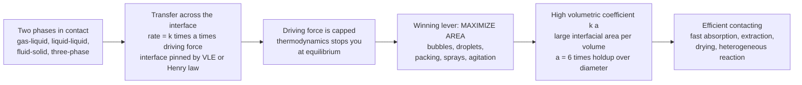

# 🫧 Interphase and Multiphase Transport

> [!abstract] TL;DR
> **Interphase and multiphase transport** is the branch of transport phenomena that governs heat and mass transfer *across the boundary between two phases* — the place where distillation, absorption, extraction, drying, adsorption, and heterogeneous reactions actually happen. Nearly every process operation is **multiphase** (gas-liquid, liquid-liquid, gas-solid, liquid-solid, or three-phase), and the transfer rate obeys one brutally simple law: **rate = transfer coefficient $\times$ interfacial AREA $\times$ driving force**. Because the driving force is capped by thermodynamics — you can only push a concentration or temperature difference so far before equilibrium stops you — the decisive engineering lever is almost always to **maximize interfacial area**, which is why engineers atomize liquids into fine sprays, sparge gas into tiny bubbles, whip up emulsions, and pack columns with intricate shapes that expose acres of surface. The key design quantity is therefore the **volumetric coefficient $k\,a$** (coefficient times area per unit volume). The rate across the boundary is set by the **two-film / two-resistance model** with interfacial equilibrium fixed by VLE or Henry's law; continuous contactors are sized by the **NTU / HTU** framework; and the hardware runs from **packed and tray columns** to **spray towers, stirred tanks, and fluidized beds**. In one line: multiphase transport is the art of *engineering interfaces*.

## Intuition

**Analogy:** Most process magic happens exactly where two phases *meet* — gas bubbling up through a liquid, droplets of one liquid falling through another, a solid catalyst pellet bathed in flowing fluid. And the golden rule at every one of these interfaces is almost insultingly simple: **transfer rate = coefficient $\times$ AREA $\times$ driving force**. The driving force you can only push so far — thermodynamics slams the door the instant equilibrium is reached, and no cleverness gets you past it. The coefficient you can nudge with more turbulence, but only modestly. That leaves exactly one lever you can crank almost without limit: **area**. So the winning move, over and over, is to *manufacture surface*. Engineers smash liquids into a mist of tiny droplets, whip gas into clouds of fine bubbles, and cram columns full of intricate ceramic and plastic shapes whose only job is to expose surface. A column packed with little plastic saddles is not really full of saddles — it is a **machine for manufacturing interfacial area**.

Put a number on it and the reason is obvious. Break a fixed volume of liquid into droplets of diameter $d$ and the total surface you expose scales as $1/d$ — halve the droplet size and you *double* the area, and with it the transfer rate. That one fact, area $\propto 1/d$, is the hidden logic behind sprayers, spargers, atomizers, agitators, and packing, and it is why the quantity engineers actually design around is not the bare coefficient $k$ but the **volumetric coefficient $k\,a$**. Multiphase transport is the discipline of getting two phases to touch over as much area as possible, for as long as possible, so heat and mass can cross the boundary fast.

---

## How It Works

### Core Mechanics

1. **Locate the interface and split the resistance in two (two-film theory).** At a gas-liquid boundary a solute must cross a stagnant **gas film** and then a stagnant **liquid film** in series. Each film has its own coefficient, so the flux is
   $$N_A = k_G\,(p_{A,\text{bulk}} - p_{A,i}) = k_L\,(c_{A,i} - c_{A,\text{bulk}}),$$
   where subscript $i$ denotes the interface. Two resistances in series — exactly like heat conduction through two walls glued together.

2. **Pin the interface with equilibrium.** The two films meet at the interface, and *there* the phases are assumed to be in **local equilibrium** — no accumulation, no resistance at the surface itself. That equilibrium is a thermodynamic relation: **Henry's law** $p_{A,i} = H\,c_{A,i}$ for a dilute gas, or full **vapor-liquid equilibrium (VLE)** for concentrated systems. This is the hinge that links the two films into one rate.

3. **Collapse the films into an overall coefficient and find who controls.** Because interfacial concentrations are hard to measure, engineers use **overall coefficients** referenced to a hypothetical equilibrium driving force:
   $$N_A = K_G\,(p_{A,\text{bulk}} - p_A^\ast), \qquad \frac{1}{K_G} = \frac{1}{k_G} + \frac{H}{k_L}.$$
   The two terms are the **two resistances** added in series. Whichever term dominates is the **controlling resistance**: a highly soluble gas (small $H$, e.g. ammonia or HCl in water) is **gas-film controlled**; a sparingly soluble gas (large $H$, e.g. oxygen or CO$_2$ in water) is **liquid-film controlled**. Knowing which side controls tells you where design effort actually pays off.

4. **Multiply by area — the whole game.** A flux per unit area is useless until you know *how much* area there is. Per unit volume of equipment the rate is
   $$R_A = K_G\,a\,(p_{A,\text{bulk}} - p_A^\ast),$$
   where $a$ is the **specific interfacial area** in m$^2$ of interface per m$^3$ of contactor. For a dispersion of holdup $\varepsilon_d$ in droplets or bubbles of diameter $d$,
   $$a = \frac{6\,\varepsilon_d}{d},$$
   so **area scales as $1/d$** — the fundamental reason fine dispersion wins. The product $K_G\,a$ (or $k_L a$) is the **volumetric coefficient**, the single number that sizes the column.

5. **Stack the area into a column — NTU and HTU.** For a continuous differential contactor such as a packed absorber, integrating the rate equation over height $Z$ gives the elegant split
   $$Z = \underbrace{\frac{G}{K_y\,a}}_{\text{HTU}} \times \underbrace{\int \frac{dy}{y - y^\ast}}_{\text{NTU}} = H_{OG}\,N_{OG}.$$
   The **NTU (number of transfer units)** measures *how hard the separation is* — how many driving-force "e-foldings" it takes. The **HTU (height of a transfer unit)** measures *how good the hardware is* — small when $K_y a$ is large. More interfacial area $\Rightarrow$ smaller HTU $\Rightarrow$ shorter column for the same duty.

6. **Fluid-solid contacting — packed versus fluidized.** Push fluid up through a bed of particles. At low velocity the bed sits still (a **packed bed**); raise the superficial velocity until drag just balances the particles' net weight and the bed unlocks — the **minimum fluidization velocity** $u_{mf}$, found by setting the Ergun pressure drop equal to the bed weight per unit area. Above $u_{mf}$ the bed **fluidizes**: particles churn like a boiling liquid, giving near-isothermal temperatures and superb solid-fluid heat and mass transfer. Push past each particle's **terminal velocity** $u_t$ and the fines blow out the top — **elutriation**.

7. **When heat and mass cross together.** In drying, humidification, and evaporative cooling, mass transfer (evaporation) and heat transfer are coupled at the surface. At steady state the sensible heat arriving equals the latent heat leaving with the vapor, which fixes the **wet-bulb temperature**:
   $$h\,(T_\text{gas} - T_{wb}) = k_y\,\lambda\,(Y_{wb} - Y_\text{gas}),$$
   the balance every psychrometric chart and every dryer design silently rests on.

### Flow / Architecture



---

## Key Concepts

### Secondary Level

- **Most process operations happen where two phases touch.** Gas dissolving into liquid, a liquid boiling into vapor, a solid catalyst reacting with fluid around it — the action is at the *interface*, not in the bulk.
- **The universal rate law is rate = coefficient $\times$ area $\times$ driving force.** Three knobs, but only one you can freely turn.
- **The driving force is capped; the area is not.** You can only push a concentration or temperature gap so far before equilibrium stops you, so engineers win by making *more surface*.
- **Small bubbles and droplets mean more area means faster transfer.** Break a fixed volume into finer pieces and you expose far more surface — the reason for sprayers, spargers, and mixers.

### Undergraduate Level

- **Two-film (two-resistance) theory.** A solute crosses a gas film and a liquid film in series; each contributes a resistance, and they add: $1/K_G = 1/k_G + H/k_L$. The interface between them is at **local equilibrium**.
- **Controlling resistance and Henry's law.** For a very soluble gas (small $H$) the **gas film controls**; for a sparingly soluble gas (large $H$) the **liquid film controls**. This decides whether to intensify the gas or the liquid side.
- **Specific interfacial area and the volumetric coefficient.** $a = 6\varepsilon_d/d$ (area per volume for a dispersion), and $k\,a$ — coefficient times area per unit volume — is *the* design quantity. Because $a \propto 1/d$, fine dispersion is the cheapest way to raise capacity.
- **NTU and HTU for continuous contactors.** Column height $Z = H_{OG}\,N_{OG}$: **NTU** captures the separation difficulty (driving force), **HTU** captures hardware quality (small when $k a$ is large). Doubling area halves HTU.
- **Gas-liquid contactor hardware.** Packed columns (random or structured packing), tray/plate columns, bubble columns, spray towers, and stirred tanks — each a different way to create and hold interfacial area. Watch for **holdup**, **flooding** (gas velocity so high liquid cannot drain), and **weeping** (liquid draining through tray holes).
- **Coupled heat and mass transfer.** In drying and humidification, evaporation cools the surface to the **wet-bulb temperature**; the near-unity **Lewis relation** $h/(k_y c_s) \approx 1$ for air-water is what makes the wet-bulb and adiabatic-saturation temperatures nearly coincide.

### Graduate Level

- **Beyond film theory: penetration and surface renewal.** Film theory predicts $k_L \propto D_{AB}$; **Higbie penetration** and **Danckwerts surface-renewal** theories, which model brief unsteady contact of fluid elements at the interface, predict $k_L \propto \sqrt{D_{AB}}$ — closer to experiment for turbulent gas-liquid systems. The difference matters when scaling data between solutes.
- **Mass transfer with reaction — enhancement.** When the absorbed solute reacts fast in the liquid film, the concentration gradient steepens and absorption is boosted by an **enhancement factor** $E$, governed by the **Hatta number** $\mathrm{Ha} = \sqrt{k_{rxn} D_{AB}}/k_L$. For fast reactions the liquid-film resistance can nearly vanish, shifting control to the gas film — the design principle behind reactive absorption (amine CO$_2$ capture, flue-gas desulfurization).
- **Fluidization mechanics.** $u_{mf}$ from Ergun-drag = bed-weight; **Geldart A/B/C/D** classes predict fluidization quality by particle size and density; regimes progress **bubbling $\to$ slugging $\to$ turbulent $\to$ fast/pneumatic transport** as velocity rises. Terminal velocity $u_t$ bounds the operating window before **elutriation**. Fluidized beds trade the packed bed's high area-per-volume for spectacular mixing and near-isothermal operation.
- **Liquid-liquid dispersions.** Drop size is set by a breakup-coalescence balance (a critical **Weber number** in agitated systems), summarized by the **Sauter mean diameter** $d_{32}$ that fixes $a = 6\varepsilon_d/d_{32}$. Mixer-settlers deliberately disperse to transfer, then coalesce to separate.
- **Interfacial phenomena.** **Surface tension** and **wetting** (contact angle) govern how phases spread and hold on packing; **Marangoni effects** — flows driven by surface-tension gradients — can enhance or wreck transfer; **surfactants** stabilize emulsions and foams and can throttle coalescence, changing $a$ and often lowering $k_L$ by rigidifying the interface.

---

## Python Demo

```python
# Interphase & Multiphase Transport in one figure:
#
#   (a) AREA IS THE LEVER
#       Break a fixed volume of dispersed phase (holdup eps_d) into droplets
#       or bubbles of diameter d. The specific interfacial area is
#           a = 6 * eps_d / d      [m^2 interface per m^3 contactor]
#       so a -- and with it the transfer rate and the volumetric coefficient
#       k*a -- scales as 1/d. Halving the drop size DOUBLES the area. This is
#       why sprays, spargers, and agitators exist.
#
#   (b) STACKING AREA INTO A COLUMN: NTU / HTU
#       A soluble gas is scrubbed as it rises through a packed absorber. For a
#       dilute, gas-side-controlled, effectively-irreversible absorption the
#       remaining solute decays exponentially with height:
#           y(z)/y_in = exp(-(k*a/u_g) * z) = exp(-z/HTU)
#       The number of transfer units NTU = z/HTU sets the outlet purity. More
#       interfacial area a -> larger k*a -> smaller HTU -> purer outlet for the
#       SAME column height.
#
# Requires: numpy, matplotlib   (no scipy)
import numpy as np
import matplotlib.pyplot as plt

# ---------- (a) interfacial area vs droplet / bubble size ----------
eps_d = 0.10                        # dispersed-phase holdup (10% by volume)
k_L   = 1.0e-4                      # m/s, liquid-film mass-transfer coefficient
d     = np.logspace(-4, -2, 200)    # diameter, 0.1 mm ... 10 mm
a     = 6.0 * eps_d / d             # m^2/m^3, specific interfacial area
kLa   = k_L * a                     # 1/s, volumetric mass-transfer coefficient

# ---------- (b) packed-column contacting: approach to equilibrium ----------
u_g   = 0.30                        # m/s, superficial gas velocity
Z     = 4.0                         # m, packed height
k_g   = 5.0e-3                      # m/s, lumped overall gas-side coefficient
a_col = np.array([30., 60., 120., 240.])   # m^2/m^3, four packings (coarse->fine)
z     = np.linspace(0.0, Z, 200)

profiles = {}
for aval in a_col:
    kap   = k_g * aval              # 1/s, volumetric coefficient K_y*a
    HTU   = u_g / kap               # m, height of a transfer unit
    NTU   = kap * Z / u_g           # dimensionless number of transfer units
    yfrac = np.exp(-(kap / u_g) * z)   # y(z)/y_in
    profiles[aval] = (yfrac, HTU, NTU)

# ---------- console summary ----------
print("=== (a) area scales as 1/d  (holdup = 10%) ===")
for dd in (5e-3, 1e-3, 2e-4):
    print(f"  d = {dd*1e3:5.2f} mm ->  a = {6*eps_d/dd:7.0f} m2/m3,"
          f"  k_L*a = {k_L*6*eps_d/dd:6.3f} 1/s")
print("=== (b) packed column, Z = 4 m ===")
for aval in a_col:
    yfrac, HTU, NTU = profiles[aval]
    print(f"  a = {aval:4.0f} m2/m3 ->  HTU = {HTU:4.2f} m,"
          f"  NTU = {NTU:5.2f},  outlet y/y_in = {yfrac[-1]:.2e}")

# ------------------------------ plotting ------------------------------
fig, (axL, axR) = plt.subplots(1, 2, figsize=(14, 6))
fig.suptitle("Interphase & Multiphase Transport: maximize interfacial AREA, "
             "then stack it into a contactor",
             fontsize=13, fontweight="bold")

# LEFT: area & volumetric coefficient vs droplet size (log-log)
axL.loglog(d * 1e3, a, color="#2a9d8f", lw=2.5,
           label="specific area  a = 6*eps_d / d")
axL.set_xlabel("droplet / bubble diameter  d  [mm]")
axL.set_ylabel("interfacial area  a  [m2/m3]", color="#2a9d8f")
axL.tick_params(axis="y", labelcolor="#2a9d8f")
axL.grid(alpha=0.3, which="both")
axL.set_title("(a) AREA IS THE LEVER:  a and k*a scale as 1/d", fontsize=11)

axL2 = axL.twinx()
axL2.loglog(d * 1e3, kLa, color="#d62728", lw=2.5, ls="--",
            label="volumetric coeff  k_L * a")
axL2.set_ylabel("volumetric coefficient  k_L * a  [1/s]", color="#d62728")
axL2.tick_params(axis="y", labelcolor="#d62728")

lines1, labs1 = axL.get_legend_handles_labels()
lines2, labs2 = axL2.get_legend_handles_labels()
axL.legend(lines1 + lines2, labs1 + labs2, loc="upper right", fontsize=8)

# RIGHT: column approach to equilibrium for several interfacial areas
colors = ["#8d99ae", "#457b9d", "#1d3557", "#e76f51"]
for aval, c in zip(a_col, colors):
    yfrac, HTU, NTU = profiles[aval]
    axR.plot(z, yfrac, color=c, lw=2.2,
             label=f"a = {aval:.0f} m2/m3  (HTU={HTU:.2f} m, NTU={NTU:.1f})")
axR.set_xlabel("height up the column  z  [m]")
axR.set_ylabel("remaining solute  y(z) / y_in")
axR.set_title("(b) STACK AREA INTO A COLUMN: NTU / HTU set the purity",
              fontsize=11)
axR.set_ylim(0, 1.02)
axR.legend(loc="upper right", fontsize=8)
axR.grid(alpha=0.3)

plt.tight_layout(rect=[0, 0, 1, 0.95])
plt.show()
```

The **left panel** is the core lesson in one line: on log-log axes both the specific interfacial area $a = 6\varepsilon_d/d$ and the volumetric coefficient $k_L a$ fall as straight lines of slope $-1$ — halve the droplet or bubble diameter and you double the area *and* double the transfer rate, at no extra driving force. This is the quantitative reason spray nozzles, gas spargers, and high-shear agitators exist. The **right panel** stacks that area into a packed absorber: the fraction of solute still in the gas decays exponentially up the column, $y/y_\text{in} = e^{-z/\text{HTU}}$. The coarsest packing ($a = 30$ m$^2$/m$^3$) manages only NTU $\approx 2$ and leaves about 14 percent of the solute unabsorbed; the finest ($a = 240$ m$^2$/m$^3$) reaches NTU $\approx 16$ and scrubs the gas essentially clean *in the same 4-metre column*. Same height, same driving force — the only thing that changed was interfacial area, and it changed everything.

---

## Real-World Applications

> **Example — a packed CO$_2$ absorption (amine) column.** Post-combustion carbon capture and natural-gas sweetening both run flue or process gas up a tall column against a falling amine solution. The tower is filled with **structured or random packing** whose entire purpose is to spread the liquid into thin films over hundreds of m$^2$ per m$^3$ of **interfacial area** — literally a machine for manufacturing surface. Absorption is **liquid-film limited** until the amine's fast chemical reaction kicks in an **enhancement factor** that partly lifts that resistance, and the column height follows directly from **HTU $\times$ NTU**: the deeper the required cleanup (higher NTU), or the poorer the packing (higher HTU), the taller and more expensive the tower. Every lever the designer has — packing choice, liquid distribution, solvent chemistry — is a lever on $k\,a$.

- **Fluid catalytic cracking (FCC).** The archetypal **fluidized bed**: fine catalyst powder fluidized by hydrocarbon vapor behaves like a boiling liquid, giving near-isothermal reaction and superb gas-solid contact, while the circulating solid carries coke to a regenerator to burn off — a design impossible without fluidization's mixing and heat transfer.
- **Spray drying (milk powder, detergents, pharmaceuticals).** A pumpable slurry is **atomized** into a hot gas so that a huge droplet surface flashes off water in seconds; drop size directly sets both the drying rate (area) and the final particle size — a pure interfacial-area engineering problem.
- **Aerobic bioreactors and fermenters.** Oxygen is sparingly soluble, so oxygen supply is **liquid-film controlled** and the whole scale-up hinges on the **$k_L a$** for oxygen; engineers fight for it with fine-bubble spargers, impellers, and pressure, because $k_L a$ is the number that caps cell density.
- **Liquid-liquid extraction (mixer-settlers, PUREX nuclear reprocessing).** A solvent is deliberately **dispersed** into fine drops to transfer solute across the liquid-liquid interface, then **coalesced** in a settler to separate — dispersion for area, coalescence for phase splitting.
- **Wastewater aeration and gas scrubbing.** Fine-bubble diffusers in aeration basins and packed/spray scrubbers on stacks are all interfacial-area machines; their energy cost is dominated by the price of creating and holding bubble or droplet surface.

---

## Common Pitfalls

- **Chasing $k$ instead of $a$.** Engineers sometimes agonize over squeezing a few percent more out of the transfer coefficient with extra agitation, when doubling the interfacial area (finer bubbles, better packing, more holdup) is far cheaper and doubles $k\,a$ outright. The lever is almost always **area**.
- **Ignoring which resistance controls.** Intensifying the liquid side of a *gas-film-controlled* absorption (or vice versa) wastes money and moves nothing. Always compute $1/k_G$ versus $H/k_L$ first and attack the dominant term.
- **Using bulk instead of interfacial concentrations.** The two-film model works only because the *interface* sits at equilibrium; writing the flux with a bulk-to-bulk driving force and no equilibrium relation gives wrong overall coefficients. Anchor the calculation on VLE or Henry's law at the interface.
- **Assuming interfacial area is a fixed constant.** $a$ depends on operating conditions — gas rate, holdup, coalescence, surfactant level. Push gas velocity up and bubbles may coalesce and *shrink* the area you were counting on; add a surfactant and drops resist coalescence but $k_L$ can fall. Design for the $a$ you will actually have.
- **Overdriving a column into flooding or weeping.** More throughput is not free: raise gas velocity too far and liquid can no longer drain (**flooding**); run trays too lightly and liquid **weeps** through the holes. Both destroy the contacting you paid for.
- **Confusing minimum fluidization velocity with terminal velocity.** Below $u_{mf}$ the bed is fixed; above $u_t$ the particles are carried away (**elutriation**). The useful fluidized window lives strictly between them — miss it and you either fail to fluidize or blow the bed out the top.
- **Forgetting that heat and mass are coupled in drying and humidification.** Treating evaporation as pure mass transfer while ignoring the latent-heat feedback that sets the **wet-bulb temperature** gives wrong surface temperatures and wrong drying rates.

---

## Related Concepts

**Fluid mechanics of the same multiphase systems**
- [[Multiphase_and_Free_Surface_Flows]] — the fluid-dynamics companion: how bubbles, droplets, and interfaces actually form, deform, and move, plus the **surface tension** and interface-tracking physics that set the very area this note exploits
- [[Engineering_Fluid_Mechanics]] — supplies the **particle drag, terminal velocity, and packed-bed pressure drop** (Ergun) that decide fluidization limits and the energy cost of creating dispersion

**The interfacial equilibrium that pins the two films**
- [[Phase_Equilibria_and_Colligative_Properties]] — the **VLE and Henry's-law** relations that fix the interfacial concentrations, the hinge of the two-resistance model
- [[Chemical_Process_Thermodynamics]] — fugacity and VLE from the process side: the same equilibria that *cap the driving force* and therefore force the "maximize area" strategy

**Rate coupling and colloidal interfaces**
- [[Chemical_Kinetics]] — where surface reaction and interphase transport compete: for heterogeneous and fast-reaction systems the **Hatta number and enhancement factor** decide whether transport or kinetics controls
- [[Nanoparticles_and_Colloidal_Systems]] — emulsions, foams, surfactants, and surface-to-volume ratio: the colloidal science behind stabilizing (or destroying) interfacial area

*Section siblings (Chemical Engineering, Transport Phenomena): this note is the culmination of the transport sequence begun in Transport_Phenomena_Overview, built on the molecular picture of Mass_Transfer_and_Diffusion and the boundary-layer coefficients of Convective_Transport_and_Correlations. It is the direct machinery beneath the separations note Absorption_and_Stripping and beneath Catalysis_and_Heterogeneous_Reactions, where transport across the fluid-solid interface competes with surface kinetics.*

---

## Review Questions

**Secondary**
1. Chemical plants spend real money to spray liquids into fine mists, bubble gas into tiny bubbles, and pack columns with intricate shapes. Using the rule *rate = coefficient $\times$ area $\times$ driving force*, explain why all of these tactics attack the same variable, and why engineers cannot simply solve the problem by pushing the driving force harder.

**Undergraduate**
2. A dilute, highly soluble gas is scrubbed from air in a packed absorption column. (a) Write the two-film flux and the overall coefficient $1/K_G = 1/k_G + H/k_L$; for a very soluble gas (small $H$), which film controls, and why? (b) For superficial gas velocity $u_g = 0.30$ m/s, packed height $Z = 4$ m, lumped coefficient $k_g = 5\times10^{-3}$ m/s, and specific area $a = 120$ m$^2$/m$^3$, compute the volumetric coefficient $k_g a$, the HTU, the NTU, and the fraction of solute remaining at the outlet. (c) If you switch to a finer packing that doubles $a$, what happens to HTU, NTU, and outlet purity for the same column height?

**Graduate**
3. (a) Derive the condition for **minimum fluidization velocity** by balancing the Ergun-drag pressure drop across a bed against the bed's buoyant weight per unit area, and explain physically why a fluidized bed gives near-isothermal, high-heat-transfer operation that a packed bed cannot. (b) Compare the predictions of **film theory** and **surface-renewal (Danckwerts) theory** for the dependence of $k_L$ on molecular diffusivity, and explain why the difference matters when transferring mass-transfer data from one solute to another. (c) For gas absorption accompanied by a fast liquid-phase reaction, explain how the **Hatta number** and **enhancement factor** change which resistance controls, and how reactive absorption can raise column capacity well beyond what physical absorption alone allows.

---

## Sources

- R. B. Bird, W. E. Stewart & E. N. Lightfoot — *Transport Phenomena*, 2nd ed. (Wiley, 2007) — the rigorous foundation of interphase mass and heat transfer, film theory, and interfacial transport
- R. E. Treybal — *Mass-Transfer Operations*, 3rd ed. (McGraw-Hill, 1980) — the classic treatment of two-film theory, overall coefficients, NTU/HTU, and gas-liquid and liquid-liquid contacting equipment
- W. L. McCabe, J. C. Smith & P. Harriott — *Unit Operations of Chemical Engineering*, 7th ed. (McGraw-Hill, 2005) — practical design of packed and tray columns, spray towers, drying, humidification, and fluidized beds
- D. Kunii & O. Levenspiel — *Fluidization Engineering*, 2nd ed. (Butterworth-Heinemann, 1991) — the definitive reference on minimum fluidization, regimes, elutriation, and fluid-solid heat and mass transfer
- J. D. Seader, E. J. Henley & D. K. Roper — *Separation Process Principles*, 3rd ed. (Wiley, 2011) — modern integration of interphase mass transfer with staged and continuous separation design

---

#chemical-engineering #multiphase #interfacial-area #mass-transfer #fluidization
