# 🌫️ Mass Transfer and Diffusion

> [!abstract] TL;DR
> **Mass transfer** is the movement of a chemical species from one place or phase to another, and it is the **rate engine of every separation** — the third sibling of the transport trinity alongside momentum and heat. Its molecular mechanism is **diffusion**, governed by **Fick's law**: the molar flux of a species is proportional to its concentration gradient, $N_A = -D_{AB}\,\dfrac{dC_A}{dx}$, with the **diffusivity** $D_{AB}$ large in gases, small in liquids, and tiny in solids. In flowing systems the molecular picture is bundled into a **mass-transfer coefficient** $k$ (flux $= k\,\Delta C$), correlated through the **Sherwood number** $Sh = f(Re, Sc)$ — the exact analog of Nusselt/Prandtl in heat transfer. When two phases meet, the **two-film theory** stacks a gas-film resistance and a liquid-film resistance *in series* at an interface that sits at equilibrium (Henry's law / VLE), giving overall coefficients $K_G, K_L$ and a **controlling resistance**. Thermodynamics decides *which way* a species wants to go (down its concentration gradient); mass transfer decides *how fast* — and because a distillation column, absorber, extractor, dryer, membrane, or catalyst is only as good as the rate at which molecules cross its interfaces, mass-transfer coefficients and interfacial area set **column heights, packing volumes, and equipment size**. This note is the physical foundation of the separations section and the third pillar that completes the momentum-heat-mass analogy.

## Intuition

**Analogy:** Open a perfume bottle in the corner of a still, closed room. Minutes later someone across the room smells it — even with no breeze, no fan, no air current at all. The scent molecules **wandered** from where they were crowded (the bottle mouth) to where they were scarce (the far wall), purely by random thermal jostling. Nobody carried them; they diffused. That aimless molecular walk, biased ever so slightly toward the emptier direction, *is* **diffusion** — mass transfer's molecular engine.

Now scale that from a party trick to a billion-dollar chemical plant. A **distillation column** only works because the volatile molecules must physically *migrate* out of the liquid, across the vapor-liquid interface, and into the rising vapor. **Thermodynamics** tells you which way they *want* to go — down the concentration (really, the chemical-potential) gradient toward equilibrium. But it says nothing about *how fast*. **Mass transfer** answers that, and in a separator speed is everything: slow mass transfer means each tray or each metre of packing does less work, which means a **taller, heavier, more expensive column** to hit the same purity. Diffusion is the third sibling of the transport family — momentum moves (that is drag and pressure drop), heat moves (that is heating and cooling), and here **mass** moves — and it is the one that decides whether you can actually pull a mixture apart, and what it costs to do so.

---

## How It Works

### Core Mechanics

1. **Diffusion is driven by a concentration gradient (Fick's first law).** A species spreads from high to low concentration. For a binary mixture $A$ in $B$, the *molecular* molar flux relative to the mixture is
   $$J_A = -D_{AB}\,\frac{dC_A}{dx},$$
   where $D_{AB}$ is the **binary diffusivity** and the minus sign encodes "downhill." This is the mass-transfer twin of Fourier's law (heat $\propto -k\,dT/dx$) and Newton's law of viscosity (momentum $\propto -\mu\,dv/dx$) — the same gradient-driven transport law, three different quantities.

2. **Diffusivity sets the scale, and it is wildly different by phase.** $D_{AB}$ is roughly $10^{-5}\,\mathrm{m^2/s}$ in **gases** (molecules fly between sparse collisions — see kinetic theory), about $10^{-9}\,\mathrm{m^2/s}$ in **liquids** (molecules shove through a crowd, ~10000x slower), and $10^{-12}$ or smaller in **solids**. Because liquid diffusion is so slow, liquid-phase mass transfer is very often the bottleneck that controls how big a separator must be.

3. **Total flux includes bulk flow (the convection-diffusion equation).** The *absolute* flux $N_A$ of $A$ past a fixed point is the diffusive part *plus* the amount carried by the bulk motion of the mixture: $N_A = J_A + x_A(N_A + N_B)$. Two canonical steady cases fall out. In **equimolar counter-diffusion** (as in distillation, where a mole of vapor rises for every mole of liquid that falls) $N_B = -N_A$, the bulk term vanishes, and the profile is linear. In **diffusion through a stagnant film** ($B$ not moving, e.g. evaporation into still air — *Stefan diffusion*), the bulk term is *not* zero, the flux is enhanced by a log-mean drift factor, and the profile is logarithmic.

4. **Transient diffusion spreads as the square root of time (Fick's second law).** With no steady state, a mass balance on the diffusing species gives $\dfrac{\partial C_A}{\partial t} = D_{AB}\dfrac{\partial^2 C_A}{\partial x^2}$ — identical in form to the heat-conduction equation. For a semi-infinite medium suddenly exposed at its surface, the solution is the **error-function** profile $C_A(x,t)=C_{As}\,\mathrm{erfc}\!\big(x/\sqrt{4 D_{AB} t}\big)$, and the **penetration depth grows as $\sqrt{D_{AB}\,t}$** — the same $\sqrt{Dt}$ scaling that underlies *penetration theory*.

5. **In flow, we lump diffusion + convection into a mass-transfer coefficient.** Rather than resolve the concentration boundary layer everywhere, engineers define a **mass-transfer coefficient** $k$ so that flux $=k\,\Delta C$ (a *linear rate law*: flux equals coefficient times driving force). $k$ is correlated dimensionlessly through the **Sherwood number** $Sh = k\,L/D_{AB} = f(Re, Sc)$, where the **Schmidt number** $Sc = \nu/D_{AB}$ plays the role that Prandtl plays in heat transfer. $Sh$ is the direct analog of Nusselt — the whole heat-transfer correlation toolkit transfers over by analogy.

6. **Across a phase boundary, resistances add in series (two-film theory).** When $A$ moves from a gas into a liquid, it must cross a **gas film** and a **liquid film** on either side of the interface. The interface itself is assumed to be at **equilibrium** (Henry's law $p_{Ai}=H\,C_{Ai}$, or a VLE relation), and the two film resistances stack **in series**, giving an **overall coefficient**: $\dfrac{1}{K_G}=\dfrac{1}{k_G}+\dfrac{H}{k_L}$. Whichever term dominates is the **controlling resistance** — and since liquid diffusivities are tiny, the liquid film often controls. The true driving force is the *departure from equilibrium*, e.g. $N_A = K_G\,(p_{AG}-p_A^{*})$ where $p_A^{*}=H\,C_{AL}$.

### Flow / Architecture

```mermaid
graph LR
    GRAD["Concentration gradient<br/>species crowded here,<br/>scarce there"]
    FICK["Molecular diffusion<br/>Ficks law molar flux<br/>N = minus D times dC/dx"]
    CONV["Convective mass transfer<br/>flux = k times driving force<br/>Sherwood = f of Re and Sc"]
    FILM["Interphase transfer<br/>gas film plus liquid film<br/>resistances in series"]
    INTERFACE["Interface at equilibrium<br/>Henrys law and VLE<br/>controlling resistance"]
    RATE["Rate set by diffusivity,<br/>coefficient k and area a<br/>flux times area"]
    USES["Drives separations<br/>and reactant supply<br/>to catalysts"]

    GRAD --> FICK
    FICK --> CONV
    CONV --> FILM
    FILM --> INTERFACE
    INTERFACE --> RATE
    RATE --> USES
```



---

## Key Concepts

### Secondary Level

- **Mass transfer is stuff moving from where there is a lot to where there is little.** Perfume spreading across a still room, sugar dissolving through unstirred tea, a smell filling a kitchen — all are diffusion, molecules wandering down a concentration gradient by random motion.
- **It is the third member of the transport family.** Momentum transfer moves motion (friction, drag), heat transfer moves warmth, and **mass transfer moves molecules**. The three obey the same "flow is proportional to a gradient" rule.
- **Thermodynamics says which way; mass transfer says how fast.** Nature *wants* a mixture to even out (that is thermodynamics), but the *speed* of the evening-out is mass transfer — and speed is what decides whether a separation is quick and cheap or slow and expensive.
- **Gases diffuse fast, liquids slow, solids barely.** Molecules in a gas move freely; in a liquid they push through neighbours; in a solid they are nearly locked. This is why the slow liquid step usually sets the pace.
- **Separations live or die on mass transfer.** Distillation, absorbing a gas into a liquid, extracting with a solvent, drying — every one of these is just "getting molecules to cross from one phase into another," and mass transfer sets how fast that happens.

### Undergraduate Level

- **Fick's first law and the diffusive flux.** For binary $A$-$B$, the molar diffusion flux is $J_A = -D_{AB}\,dC_A/dx$ (or $= -c\,D_{AB}\,dx_A/dx$ in mole-fraction form). $D_{AB}$ has units of $\mathrm{m^2/s}$, exactly like thermal diffusivity $\alpha$ and momentum diffusivity $\nu$ — the three transport diffusivities.
- **Absolute flux and the bulk-flow term.** The flux past a fixed frame is $N_A = -c\,D_{AB}\,dx_A/dx + x_A(N_A+N_B)$. Two limits matter:
  - **Equimolar counter-diffusion** ($N_B=-N_A$): bulk term vanishes, profile linear, $N_A = D_{AB}(C_{A1}-C_{A2})/\delta$.
  - **Diffusion through stagnant $B$ (Stefan / one-way diffusion):** $N_A = \dfrac{c\,D_{AB}}{\delta}\ln\!\dfrac{x_{B2}}{x_{B1}} = \dfrac{c\,D_{AB}}{\delta\,x_{B,\mathrm{lm}}}(x_{A1}-x_{A2})$, enhanced by the log-mean inert fraction $x_{B,\mathrm{lm}}$.
- **Fick's second law (transient diffusion).** $\partial C_A/\partial t = D_{AB}\,\partial^2 C_A/\partial x^2$. Semi-infinite medium with a step at the surface gives $C_A = C_{As}\,\mathrm{erfc}\big(x/\sqrt{4D_{AB}t}\big)$; the surface flux is $N_A|_{x=0}=C_{As}\sqrt{D_{AB}/(\pi t)}$ and the penetration depth scales as $\sqrt{D_{AB}t}$.
- **Convective mass-transfer coefficient.** $N_A = k_c\,(C_{As}-C_{A\infty})$ defines $k_c$ (units $\mathrm{m/s}$). Dimensionless groups:
  - **Sherwood** $Sh = k_c L/D_{AB}$ (dimensionless mass-transfer coefficient, analog of Nusselt),
  - **Schmidt** $Sc = \nu/D_{AB}$ (ratio of momentum to mass diffusivity, analog of Prandtl),
  - correlations look just like heat transfer, e.g. $Sh = 0.023\,Re^{0.8}Sc^{1/3}$ for turbulent tube flow.
- **Two-film theory and overall coefficients.** Interfacial equilibrium ($y_{Ai}=m\,x_{Ai}$ or $p_{Ai}=H\,C_{Ai}$) plus series film resistances give
  $$\frac{1}{K_G}=\frac{1}{k_G}+\frac{H}{k_L}, \qquad \frac{1}{K_L}=\frac{1}{k_L}+\frac{1}{H\,k_G}.$$
  The larger term is the **controlling resistance**. Overall driving forces are equilibrium departures: $N_A=K_G(p_{AG}-p_A^{*})=K_L(C_A^{*}-C_{AL})$.

### Graduate Level

- **The multicomponent reality — Maxwell-Stefan diffusion.** Fick's law is a binary idealization. In mixtures of three or more species, fluxes are coupled and set by the **Maxwell-Stefan** equations, $\nabla x_i = \sum_{j\ne i}\dfrac{x_i N_j - x_j N_i}{c\,\mathfrak{D}_{ij}}$, which can produce *reverse diffusion*, *osmotic diffusion*, and *diffusion barriers* that Fickian $D$'s cannot. The proper driving force is the **chemical-potential** gradient, not the concentration gradient — non-idealities enter through a thermodynamic factor $\Gamma = \partial\ln a_i/\partial\ln x_i$.
- **Penetration and surface-renewal theories.** The two-film model's assumption of steady film diffusion is often unphysical for turbulent fluids. **Higbie penetration theory** treats each fluid element as exposed to the interface for a fixed contact time $t_c$, giving $k_L = 2\sqrt{D_{AB}/(\pi t_c)}$ — note the $k \propto D^{1/2}$ dependence, versus $k \propto D^{1}$ for the film model. **Danckwerts surface-renewal theory** replaces the fixed time with a distribution of element ages (renewal rate $s$), giving $k_L=\sqrt{D_{AB}\,s}$, again $\propto D^{1/2}$. The exponent on $D$ is a fingerprint of which model reality obeys.
- **Diffusion with reaction — the Hatta / Thiele coupling.** When $A$ diffuses into a film *and* reacts, the interplay of diffusion rate and reaction rate is captured by the **Hatta number** (gas-liquid) or **Thiele modulus** (catalyst pellets), $\phi = L\sqrt{k_r/D_{AB}}$. Large $\phi$ means reaction consumes $A$ before it penetrates — the process is **mass-transfer / diffusion limited**, quantified by an **effectiveness factor** $\eta = \tanh\phi/\phi$ for a slab. This is the bridge to heterogeneous catalysis and gas-liquid reactor design.
- **Rate laws for a packed column — the transfer-unit concept.** Integrating the two-film rate over a differential column height gives the design equation $Z = H_{OG}\cdot N_{OG}$, where the **height of a transfer unit** $H_{OG}=G/(K_G a\,P)$ bundles the mass-transfer coefficient $K_G$ and the **interfacial area per volume** $a$, and the **number of transfer units** $N_{OG}=\int dy/(y-y^{*})$ measures the separation difficulty. Column height is literally (rate resistance) x (thermodynamic difficulty) — the mass-transfer coefficient and interfacial area sit inside $H_{OG}$ and set the physical size of the equipment.
- **The transport analogy made quantitative.** The three transport diffusivities $\nu$ (momentum), $\alpha$ (heat), $D_{AB}$ (mass) give $Pr=\nu/\alpha$, $Sc=\nu/D_{AB}$, and $Le=\alpha/D_{AB}=Sc/Pr$. The **Chilton-Colburn analogy** $j_D=j_H$, i.e. $St_m\,Sc^{2/3}=St_h\,Pr^{2/3}=C_f/2$, lets a measured heat-transfer or friction correlation *predict* the mass-transfer coefficient — the formal statement that momentum, heat, and mass are one phenomenon in three guises.

---

## Python Demo

```python
# Mass Transfer and Diffusion in one figure:
#
#   (a) FICK'S LAW / TRANSIENT DIFFUSION PROFILE
#       Species A suddenly contacts the surface (x = 0) of a still,
#       semi-infinite liquid (initial concentration 0, surface held at C_s).
#       Fick's 2nd law gives the ERROR-FUNCTION profile
#           C(x,t) = C_s * erfc( x / sqrt(4 D t) ).
#       We plot the profile at several times: the front PENETRATES as
#       sqrt(D t), and the surface molar flux N = C_s * sqrt(D/(pi t))
#       is exactly proportional to the diffusivity x gradient.
#
#   (b) TWO-FILM MODEL / MASS-TRANSFER COEFFICIENT
#       Species A crosses a gas film and a liquid film in series at an
#       interface that sits at equilibrium (Henry's law p = H*C).
#       The flux N = k_G*(p_AG - p_Ai) = k_L*(C_Ai - C_AL) is set by the
#       coefficients; 1/K_G = 1/k_G + H/k_L reveals the CONTROLLING film.
#
# Requires: numpy, matplotlib   (no scipy; erf comes from the stdlib math module)
import numpy as np
import matplotlib.pyplot as plt
import math

erf_vec = np.vectorize(math.erf)          # vectorized error function (no scipy)
def erfc(z):
    return 1.0 - erf_vec(z)

# ============================================================
# (a) Transient diffusion: error-function concentration profile
# ============================================================
D   = 2.0e-9          # m^2/s, a typical LIQUID diffusivity (slow)
Cs  = 1.0             # mol/m^3, fixed surface concentration
x   = np.linspace(0.0, 8.0e-3, 400)       # 0 to 8 mm into the liquid
times = [10.0, 100.0, 1000.0, 5000.0]     # seconds

profiles = {t: Cs * erfc(x / np.sqrt(4.0 * D * t)) for t in times}
# surface flux N = -D dC/dx|_0 = C_s * sqrt(D/(pi t))  [mol/(m^2 s)]
surf_flux = {t: Cs * np.sqrt(D / (np.pi * t)) for t in times}
# penetration depth (where C/Cs ~ 0.01 -> arg erfc ~ 1.82) : delta ~ 1.82*sqrt(4Dt)
pen_depth = {t: 1.82 * np.sqrt(4.0 * D * t) for t in times}

# ============================================================
# (b) Two-film model: concentration drop across gas & liquid films
# ============================================================
p_AG = 10.0     # kPa,          bulk gas partial pressure of A
C_AL = 1.0      # mol/m^3,      bulk liquid concentration of A
H    = 2.0      # kPa*m^3/mol,  Henry's constant  (p_i = H * C_i)
k_G  = 0.010    # mol/(m^2 s kPa),  gas-film coefficient
k_L  = 0.005    # m/s,              liquid-film coefficient

# overall gas-phase coefficient: resistances add in series
inv_KG = 1.0 / k_G + H / k_L                 # (m^2 s kPa)/mol
K_G    = 1.0 / inv_KG
p_star = H * C_AL                             # equilibrium partial pressure of bulk liquid
N      = K_G * (p_AG - p_star)                # interphase molar flux, mol/(m^2 s)

# interface values (must satisfy Henry's law p_Ai = H*C_Ai)
p_Ai = p_AG - N / k_G
C_Ai = C_AL + N / k_L

# resistance split (in gas-phase units) -> which film controls?
R_gas = 1.0 / k_G
R_liq = H / k_L
frac_liq = R_liq / (R_gas + R_liq)

# spatial profiles across the two films (arbitrary film-thickness units)
xg = np.linspace(-1.0, 0.0, 50)              # gas film
xl = np.linspace(0.0, 1.0, 50)               # liquid film
p_gas = p_AG + (p_Ai - p_AG) * (xg + 1.0)    # linear drop p_AG -> p_Ai
C_liq = C_Ai + (C_AL - C_Ai) * xl            # linear drop C_Ai -> C_AL

# ---------------------------- console summary ----------------------------
print("=== (a) Transient diffusion (error-function solution) ===")
for t in times:
    print(f"  t = {t:6.0f} s :  surface flux = {surf_flux[t]:.3e} mol/(m^2 s)"
          f"   penetration ~ {pen_depth[t]*1e3:5.2f} mm")
print("  -> flux falls as 1/sqrt(t); front advances as sqrt(D t)\n")
print("=== (b) Two-film interphase mass transfer ===")
print(f"  overall K_G          : {K_G:.4e} mol/(m^2 s kPa)")
print(f"  molar flux N         : {N:.4e} mol/(m^2 s)")
print(f"  interface p_Ai, C_Ai : {p_Ai:.2f} kPa , {C_Ai:.2f} mol/m^3"
      f"   (check H*C_Ai = {H*C_Ai:.2f} kPa)")
print(f"  liquid-film share of resistance : {100*frac_liq:.0f} percent"
      f"  -> {'LIQUID' if frac_liq>0.5 else 'GAS'} film controls")

# ------------------------------- plotting --------------------------------
fig, (axL, axR) = plt.subplots(1, 2, figsize=(14, 6))
fig.suptitle("Mass Transfer and Diffusion: molecular diffusion profile "
             "and the two-film interphase resistance",
             fontsize=13, fontweight="bold")

# LEFT: transient diffusion profiles
colors = plt.cm.viridis(np.linspace(0.15, 0.85, len(times)))
for t, col in zip(times, colors):
    axL.plot(x * 1e3, profiles[t], color=col, lw=2.3,
             label=f"t = {t:.0f} s  (flux {surf_flux[t]:.1e})")
axL.set_xlabel("distance into liquid  x  [mm]")
axL.set_ylabel("concentration  C_A / C_s")
axL.set_title("(a) FICK'S 2nd LAW: erfc profile, front ~ sqrt(D t)",
              fontsize=11)
axL.legend(loc="upper right", fontsize=8, title="later = deeper, slower flux")
axL.grid(alpha=0.3)

# RIGHT: two-film concentration drop (twin axes for the two phases)
axR.plot(xg, p_gas, color="#1f77b4", lw=2.6, label="gas-film p_A  [kPa]")
axR.axvline(0.0, color="k", ls="-", lw=1.5)
axR.plot(0.0, p_Ai, "o", color="#1f77b4", ms=8)
axR.set_xlabel("position across interface  (gas film | liquid film)")
axR.set_ylabel("gas partial pressure  p_A  [kPa]", color="#1f77b4")
axR.tick_params(axis="y", labelcolor="#1f77b4")
axR.set_ylim(0, 11)
axR.text(-0.55, p_AG - 0.4, "bulk gas p_AG", color="#1f77b4", fontsize=9)
axR.text(-0.15, p_Ai + 0.3, "interface p_Ai", color="#1f77b4", fontsize=9,
         ha="right")

ax2 = axR.twinx()
ax2.plot(xl, C_liq, color="#d62728", lw=2.6, label="liquid-film C_A  [mol/m^3]")
ax2.plot(0.0, C_Ai, "s", color="#d62728", ms=8)
ax2.set_ylabel("liquid concentration  C_A  [mol/m^3]", color="#d62728")
ax2.tick_params(axis="y", labelcolor="#d62728")
ax2.set_ylim(0, 5)
ax2.text(0.15, C_Ai + 0.1, "interface C_Ai\n(equilibrium: p_Ai = H C_Ai)",
         color="#d62728", fontsize=9)
ax2.text(0.55, C_AL + 0.15, "bulk liquid C_AL", color="#d62728", fontsize=9)

axR.set_title(f"(b) TWO-FILM: liquid film controls ({100*frac_liq:.0f} percent of R),"
              f"  N = {N:.3f}", fontsize=11)
axR.text(-0.9, 5.5, "GAS FILM", fontsize=9, fontweight="bold", color="#1f77b4")
axR.text(0.55, 5.5, "LIQUID FILM", fontsize=9, fontweight="bold",
         color="#d62728")

plt.tight_layout(rect=[0, 0, 1, 0.95])
plt.show()
```

Running this prints the flux accounting and draws two panels. The **left panel** is pure diffusion: the error-function profiles march deeper into the still liquid as time passes, the concentration front advancing as $\sqrt{D_{AB}t}$ while the **surface flux falls as $1/\sqrt{t}$** — the printout shows the flux dropping decade by decade as the gradient at the wall flattens, the concrete meaning of "flux is proportional to diffusivity times gradient." The **right panel** is the two-film interphase picture: the blue curve (left axis) is species $A$'s partial pressure dropping across the **gas film** from bulk $p_{AG}$ to the interface value $p_{Ai}$, and the red curve (right axis) is its concentration dropping across the **liquid film** from the interface value $C_{Ai}$ down to the bulk $C_{AL}$. The two meet at the interface, which sits exactly on the Henry's-law equilibrium line ($p_{Ai}=H\,C_{Ai}$). The console reports that the liquid film carries about 80 percent of the total resistance — the **controlling film** — which is why real absorbers with sparingly soluble gases are designed around $k_L$ and interfacial area, not $k_G$.

---

## Real-World Applications

> **Example — a packed absorption column scrubbing CO2 from flue gas with amine solution.** This single unit is mass transfer from top to bottom. CO2 molecules must diffuse out of the rising gas, cross the **gas film**, hit the wet interface (in equilibrium via a modified Henry's law), and diffuse into the falling amine liquid where they **react** — a textbook case of diffusion-with-reaction whose speed is set by the Hatta number. The packing exists for one reason: to create enormous **interfacial area per volume** $a$, because the flux times area is what actually removes CO2. The column's height comes straight from $Z=H_{OG}\cdot N_{OG}$: the **mass-transfer coefficient** $K_G$ and area $a$ sit inside $H_{OG}$ (the rate resistance), while $N_{OG}$ measures the thermodynamic difficulty of the separation. Improve the mass-transfer coefficient or the area and the column gets shorter and cheaper; misjudge them and you build a tower that never meets the emissions spec. Every distillation, absorption, stripping, and extraction tower on earth is sized by exactly this logic.

- **Distillation columns.** The workhorse separation. Volatile species must transfer from liquid to vapor on every tray or through every metre of packing — **equimolar counter-diffusion** is the governing regime. Tray efficiency (Murphree efficiency) and packing HETP are pure mass-transfer quantities; slow mass transfer means more trays and a taller, costlier column.
- **Gas absorption and stripping.** Removing a solute gas into a liquid (absorption) or the reverse (stripping) is governed directly by the **two-film theory** and overall coefficients $K_G, K_L$; the controlling resistance (usually liquid-side for sparingly soluble gases) dictates the whole design.
- **Liquid-liquid extraction and membranes.** Solute crossing a solvent-solvent interface, or permeating a membrane, is interphase mass transfer with a partition/equilibrium relation at the boundary — reverse osmosis, dialysis, and gas-separation membranes are all flux $= $ permeability $\times$ driving force.
- **Drying and humidification.** Water must diffuse to a solid's surface and then evaporate through a **stagnant air film** (Stefan diffusion) into the bulk gas; the constant-rate drying period is entirely gas-film mass-transfer controlled, correlated by the Sherwood number.
- **Heterogeneous catalysis and reactor design.** A reactant must diffuse from the bulk fluid to, and then *inside*, a porous catalyst pellet before it can react. The **Thiele modulus** and **effectiveness factor** decide whether the reactor is reaction-limited or diffusion-limited — a fast intrinsic reaction is worthless if reactant cannot reach the active sites fast enough.
- **Adsorption and chromatography.** Uptake onto activated carbon, zeolites, or a chromatographic packing is governed by external film transfer plus intraparticle diffusion; breakthrough curves and column sizing follow directly from these mass-transfer resistances.

---

## Common Pitfalls

- **Confusing thermodynamics (which way / how far) with mass transfer (how fast).** Equilibrium (VLE, Henry's law, solubility) tells you the *destination*; mass-transfer coefficients tell you the *speed of arrival*. A separation that is thermodynamically easy can still demand a huge column if the mass transfer is slow. Never size equipment from equilibrium alone.
- **Dropping the bulk-flow term when it matters.** For **diffusion through stagnant $B$** (evaporation, absorption of a dilute solute into an inert), the convective drift term is real and the flux carries a log-mean inert-fraction correction. Using the simple linear equimolar formula there *underpredicts* the flux. Check whether $N_B=0$ (stagnant) or $N_B=-N_A$ (equimolar) before picking the equation.
- **Adding conductances instead of resistances.** In two-film theory the *resistances* $1/k_G$ and $H/k_L$ add in series — you cannot add coefficients $k_G$ and $k_L$ directly. And you must convert both resistances into the *same* driving-force units (all gas-phase for $K_G$, all liquid-phase for $K_L$) using the equilibrium slope $H$ before summing.
- **Assuming the gas film always controls (or always the liquid film).** The controlling resistance depends on the equilibrium slope $H$ (solubility). Highly soluble gases (ammonia in water) are **gas-film controlled**; sparingly soluble gases (oxygen, CO2 in water) are **liquid-film controlled**. Guessing wrong sends you optimizing the wrong coefficient.
- **Using a Fickian diffusivity for a strongly non-ideal or multicomponent mixture.** Near azeotropes, in electrolyte solutions, or in three-plus-component systems, coupled **Maxwell-Stefan** effects (reverse and osmotic diffusion) appear that a single binary $D_{AB}$ cannot represent. The proper driving force is the chemical-potential gradient, not the concentration gradient.
- **Ignoring interfacial area.** Engineers obsess over the coefficient $k$ and forget that the *rate* is $k\,a\,\Delta C$ — the coefficient times the **interfacial area per volume** $a$. Packing, trays, spray nozzles, and bubble spargers all exist to manufacture area; a great $k$ over tiny area transfers nothing.
- **Forgetting the $D$-exponent tells you the model.** Film theory predicts $k\propto D$, while penetration and surface-renewal theories predict $k\propto D^{1/2}$. Measured mass-transfer data that scale as $D^{1/2}$ signal a renewing turbulent interface, not a steady film — using the wrong model mis-scales the coefficient when you change the diffusing species.

---

## Related Concepts

**Physics vault — the molecular origin of diffusion**
- [[Kinetic_Theory_of_Gases]] — where the gas-phase diffusivity $D_{AB}\sim\tfrac{1}{3}\bar{v}\,\lambda$ comes from: mean molecular speed times mean free path, the microscopic root of Fick's law and of why gases diffuse ~10000x faster than liquids

**Chemistry vault — the rate partner and the equilibrium boundary condition**
- [[Chemical_Kinetics]] — the *reaction* rate that competes with the *transport* rate; their interplay (Thiele modulus, Hatta number, effectiveness factor) decides whether a catalyst or gas-liquid reactor is reaction-limited or diffusion-limited

**Fluid Dynamics vault — the boundary layer that mass transfer rides on**
- [[The_Boundary_Layer]] — the concentration boundary layer is the mass-transfer twin of the velocity and thermal boundary layers; its thickness (set by $Re$ and $Sc$) is what the mass-transfer coefficient and Sherwood number actually measure
- [[Viscosity_and_Stress_in_Fluids]] — the **momentum** leg of the transport trinity: Newton's law of viscosity ($\tau=-\mu\,dv/dy$) is the exact structural analog of Fick's law, and the Chilton-Colburn analogy ties the two coefficients together

**Biology vault — diffusion as the transport mechanism of life**
- [[The_Cell_Membrane_and_Transport]] — passive diffusion, facilitated diffusion, and osmosis across cell membranes are the same Fick's-law physics, with the lipid bilayer playing the role of the diffusion resistance (a biological "film")

*Section siblings (to be written): this note is the mass leg of the transport trinity introduced in Transport_Phenomena_Overview alongside momentum and heat; the mass-transfer coefficient and Sherwood correlations here are generalized in Convective_Transport_and_Correlations; the two-film picture and controlling resistance extend to multiple phases in Interphase_and_Multiphase_Transport; and the transfer-unit / rate machinery of this note is the physical engine that sizes the equipment in Distillation and Absorption_and_Stripping.*

---

## Review Questions

**Secondary**
1. A drop of ink is placed in a glass of perfectly still water and, without any stirring, slowly colours the whole glass over hours. Explain what is physically happening in terms of molecules and concentration, why it is slow, and why it would be far faster if the ink were released into a still *gas* instead of a liquid. Then explain, in one sentence, why a chemical plant that relied on this slow spreading would want to speed it up.

**Undergraduate**
2. Species $A$ is absorbed from a gas into a liquid across a gas film and a liquid film in series. The gas-film coefficient is $k_G=0.010\ \mathrm{mol/(m^2\,s\,kPa)}$, the liquid-film coefficient is $k_L=0.005\ \mathrm{m/s}$, the Henry's constant is $H=2\ \mathrm{kPa\,m^3/mol}$, the bulk gas partial pressure is $p_{AG}=10\ \mathrm{kPa}$, and the bulk liquid concentration is $C_{AL}=1\ \mathrm{mol/m^3}$. (a) Compute the overall coefficient $K_G$ from the series-resistance rule and the flux $N_A=K_G(p_{AG}-H\,C_{AL})$. (b) Find the interface values $p_{Ai}$ and $C_{Ai}$ and verify they satisfy Henry's law. (c) Which film controls, and by what percentage of the total resistance? If you could double either $k_G$ or $k_L$, which should you choose and why?

**Graduate**
3. A sparingly soluble gas is absorbed into a turbulent, rapidly renewing liquid, and measurements show the liquid-side mass-transfer coefficient scales as $k_L\propto D_{AB}^{1/2}$ rather than $D_{AB}^{1}$. (a) Which interphase model does this exponent point to, and what physical assumption of the simple two-film model does it overturn? Give the expression for $k_L$ from both Higbie penetration theory and Danckwerts surface-renewal theory. (b) If the same gas now undergoes a fast pseudo-first-order reaction in the liquid film, define the Hatta number and explain how the reaction changes the effective liquid-film resistance and the flux. (c) A packed absorber is sized by $Z=H_{OG}\,N_{OG}$; identify which term the mass-transfer coefficient and interfacial area live in, and argue how switching to a packing with higher $a$ but the same $k$ changes the required column height and why the separation's thermodynamic difficulty ($N_{OG}$) is unaffected.

---

## Sources

- R. B. Bird, W. E. Stewart & E. N. Lightfoot — *Transport Phenomena*, 2nd ed. (Wiley, 2007) — the definitive unified treatment of momentum, heat, and mass transport; Fick's laws, the equations of change for multicomponent mixtures, and the transport analogies
- E. L. Cussler — *Diffusion: Mass Transfer in Fluid Systems*, 3rd ed. (Cambridge University Press, 2009) — the clearest modern text on diffusion, film/penetration/surface-renewal theories, Maxwell-Stefan multicomponent diffusion, and diffusion with reaction
- C. J. Geankoplis — *Transport Processes and Separation Process Principles*, 4th ed. (Prentice Hall, 2003) — the classic bridge from mass-transfer fundamentals to separation-equipment design; steady/transient diffusion, coefficients, and column sizing
- R. E. Treybal — *Mass-Transfer Operations*, 3rd ed. (McGraw-Hill, 1980) — the enduring reference on interphase mass transfer, two-film theory, transfer units, and the design of absorbers, strippers, and distillation columns
- W. L. McCabe, J. C. Smith & P. Harriott — *Unit Operations of Chemical Engineering*, 7th ed. (McGraw-Hill, 2005) — practical mass-transfer coefficients, HTU/NTU design, and the Chilton-Colburn analogy in unit-operations context

---

#chemical-engineering #mass-transfer #diffusion #ficks-law #two-film-theory
