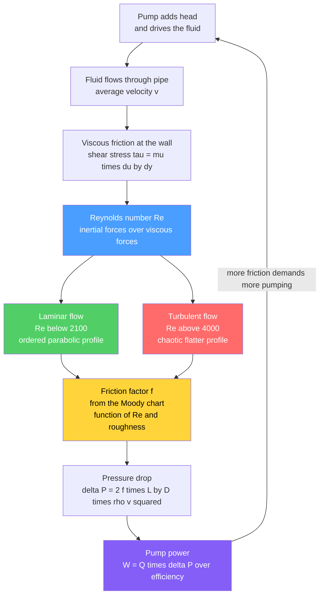

# 🌊 Momentum Transport and Fluid Flow

> [!abstract] TL;DR
> **Momentum transport** is fluid mechanics viewed as one of the three transport phenomena: just as heat flows down a temperature gradient and mass flows down a concentration gradient, **momentum flows down a velocity gradient**, carried by **viscosity** (Newton's law, $\tau = -\mu\,du/dy$). In a chemical plant this shows up as the everyday, expensive business of **pushing fluids through pipes and equipment**. The master number is the **Reynolds number** $Re = \rho v D / \mu$: below about **2100** the flow is **laminar** (ordered layers, a parabolic Hagen-Poiseuille profile, pressure drop proportional to flow); above about **4000** it is **turbulent** (chaotic eddies, a flat profile, far higher friction). The **friction factor** — read off the **Moody chart** as a function of $Re$ and pipe roughness — converts flow into **pressure drop** through the mechanical-energy (Bernoulli-with-friction) balance, and pressure drop times flow sets the **pump power** you must pay for. Because nearly every process moves fluid, momentum transport determines pipe, pump, and compressor sizing, sets a major operating cost, and fixes the flow regime that in turn governs mixing and heat and mass transfer. It is the momentum leg of the transport trinity.

## Intuition

**Analogy:** A chemical plant is a **circulatory system**. Miles of pipes are its arteries, pumps are its heart, and process fluids are its blood — everything the plant does depends on moving that fluid from unit to unit. But circulation is never free. Just as your heart must push blood against the drag of vessel walls, a pump must shove fluid against **friction at the pipe walls** that steals pressure the entire length of the run. Every metre of pipe, every bend, every valve bleeds away a little of the pressure the pump worked to build — and the pump answers by burning more energy to keep shoving. **Momentum transport is the study of exactly this trade**: how fast the fluid can go, how much pressure it costs to move it, and how big a pump you need to pay the bill.

The surprising twist is that the fluid can move in **two utterly different personalities**, and it flips between them at a sharp tipping point called the **Reynolds number**. Below the threshold the fluid glides in smooth, orderly **laminar** layers, like cars in disciplined lanes — quiet, predictable, low friction. Push past the threshold and the flow **erupts into turbulence**: swirling, chaotic eddies, like the same cars merging into a churning traffic jam. Cross that line and everything changes character overnight — the pressure cost jumps, mixing becomes violent, and heat and mass transfer speed up dramatically. A chemical engineer lives on both sides of that line and must always know which one the plant is on.

---

## How It Works

### Core Mechanics

1. **Momentum is transported, exactly like heat and mass.** When one layer of fluid slides faster than the layer beside it, the fast layer drags the slow one forward and the slow one holds the fast one back. That drag is a **transfer of momentum** across the velocity gradient, and the property that carries it is **viscosity**. Newton's law of viscosity states the shear stress is proportional to the velocity gradient, $\tau = -\mu\,\dfrac{du}{dy}$ — the minus sign says momentum flows *down* the gradient, from fast fluid to slow, the direct analogue of Fourier's law for heat. The full accounting is the **momentum balance** (a shell momentum balance, or in general the Navier-Stokes equations), which sets the rate of momentum in and out plus pressure and gravity forces equal to accumulation.

2. **Pipe flow is the process staple.** Solve the momentum balance for steady flow in a round pipe and two regimes emerge. In **laminar** flow the answer is exact — the **Hagen-Poiseuille** result: a **parabolic velocity profile** peaking at twice the average velocity, with pressure drop **linearly proportional to flow rate**. In **turbulent** flow no exact solution exists; time-averaged eddies flatten the profile into a blunt plug and raise the wall friction sharply.

3. **The Reynolds number decides the regime.** The dimensionless group $Re = \rho v D / \mu$ is the ratio of inertial forces to viscous forces. Below $Re \approx 2100$ viscosity wins and flow stays laminar; above $Re \approx 4000$ inertia wins and flow is fully turbulent; between them lies an unpredictable **transition** zone engineers avoid designing into.

4. **The friction factor turns flow into pressure drop.** Rather than re-solve the flow every time, engineers package all the wall friction into a single dimensionless **friction factor** $f$. In laminar flow it is exact, $f = 16/Re$ (Fanning convention). In turbulent flow it is correlated against $Re$ and the relative **roughness** $\varepsilon/D$ and plotted as the famous **Moody chart**. The pressure drop follows from the Fanning equation $\Delta P = 2 f \dfrac{L}{D}\rho v^2$, and additional losses from **fittings, valves, expansions and contractions** are added as **equivalent lengths** or **$K$-factors**.

5. **The mechanical-energy balance ties it together.** The Bernoulli equation *with a friction term* — the mechanical-energy balance — accounts for pressure, velocity, elevation, the pump head added, and the friction lost. Rearranged, it tells you the **head a pump must supply**, and the **pump power** is $\dot W = \dot Q\,\Delta P / \eta$ (equivalently flow times head times density times $g$, divided by efficiency). This single chain — flow, $Re$, regime, friction factor, pressure drop, pump power — is the backbone of process hydraulics.

### Flow / Architecture



---

## Key Concepts

### Secondary Level

- **Moving fluid costs energy.** Whenever a liquid or gas flows through a pipe, it rubs against the pipe walls. That rubbing — **friction** — slows it down and eats up pressure, so a **pump** has to keep pushing to make up for it. The longer and narrower the pipe, the more it costs.
- **Thick fluids are harder to push.** Honey resists flowing far more than water. That resistance is **viscosity** — the "stickiness" of a fluid — and it is what carries the friction inside the flow.
- **Two ways to flow.** Slow, gentle flow moves in **smooth layers** (laminar) — think of a calm stream. Fast flow breaks into **swirling chaos** (turbulent) — think of rapids. A single number, the **Reynolds number**, tells you which one you get: small means smooth, large means chaotic.
- **Pumps are the heart of a plant.** They add the "push" (called **head**) that keeps fluid circulating. Bigger pushes over bigger flows need bigger, more power-hungry pumps — which is why engineers work hard to keep friction low.
- **You can measure flow from pressure.** A narrowing in a pipe speeds the fluid up and drops its pressure; measuring that pressure drop tells you the flow rate — the idea behind an orifice or venturi flow meter.

### Undergraduate Level

**Newton's law and momentum as a flux.** Shear stress is momentum flux. For a **Newtonian** fluid,

$$\tau_{yx} = -\mu\,\frac{du_x}{dy}$$

$\tau_{yx}$ is read as the flux of $x$-momentum in the $y$-direction, and $\mu$ is the **dynamic viscosity** (Pa·s). Kinematic viscosity is $\nu = \mu/\rho$. This is the exact structural twin of Fourier's law ($q = -k\,dT/dy$) and Fick's law ($J = -D\,dC/dy$) — the unifying idea of transport phenomena.

**The Reynolds number and the transition.**

$$Re = \frac{\rho v D}{\mu} = \frac{v D}{\nu}$$

| Regime | Range (pipe) | Character |
|--------|-------------|-----------|
| Laminar | $Re \lesssim 2100$ | Ordered layers; parabolic profile; friction $\propto v$ |
| Transition | $2100 \lesssim Re \lesssim 4000$ | Intermittent, unpredictable — avoid by design |
| Turbulent | $Re \gtrsim 4000$ | Chaotic eddies; flat profile; friction $\propto v^{1.75\text{–}2}$ |

**Laminar pipe flow — the Hagen-Poiseuille result.** Integrating the shell momentum balance for steady laminar flow gives a parabolic profile and a linear pressure-drop law:

$$u(r) = u_{max}\left[1 - \left(\frac{r}{R}\right)^2\right],\qquad u_{max} = 2\,\bar u,\qquad \Delta P = \frac{32\,\mu L\,\bar u}{D^2}$$

Volumetric flow scales as the **fourth power of diameter** ($\dot Q \propto D^4 \Delta P$) — halving a pipe's diameter cuts its laminar capacity sixteenfold.

**Friction factor and the Moody chart.** The **Fanning** friction factor is defined from the wall shear stress, $\tau_w = f\,\tfrac{1}{2}\rho \bar u^2$, giving the pressure drop

$$\Delta P = 2 f\,\frac{L}{D}\,\rho\,\bar u^2$$

(The **Darcy** friction factor is $f_D = 4 f_{Fanning}$; always state which you mean.) Laminar: $f = 16/Re$ exactly. Turbulent: correlated by the **Colebrook** equation (or explicit **Haaland** approximation) against $Re$ and relative roughness $\varepsilon/D$, and plotted as the **Moody chart**. At high $Re$ on rough pipe, $f$ becomes nearly independent of $Re$ (fully rough regime).

**Minor losses.** Fittings, valves, bends, and sudden area changes add friction accounted for by a loss coefficient $K$ ($h_L = K\,\bar u^2/2g$) or an **equivalent length** $L_{eq}/D$ added to the straight pipe. In a plant with many valves and elbows, these "minor" losses are frequently the *majority* of the total.

**The mechanical-energy balance (Bernoulli with friction).** Between points 1 and 2 with a pump:

$$\frac{P_1}{\rho} + \frac{\bar u_1^2}{2} + g z_1 + w_{pump} = \frac{P_2}{\rho} + \frac{\bar u_2^2}{2} + g z_2 + \sum h_f$$

Solve for pump work $w_{pump}$, then **pump power** $\dot W = \dot m\,w_{pump}/\eta = \dot Q\,\Delta P/\eta$.

### Graduate Level

- **Pump and system curves, NPSH, and cavitation.** A **centrifugal pump** delivers a head-versus-flow characteristic that *falls* with flow; the **system curve** (static head plus friction $\propto \dot Q^2$) *rises* with flow. Their intersection is the **operating point**. If the suction-side pressure falls below the fluid's vapour pressure, liquid flashes to vapour and collapses violently — **cavitation** — pitting the impeller; the guard is keeping the **Net Positive Suction Head available** above the pump's **NPSH required**. **Positive-displacement pumps** instead deliver near-constant flow regardless of head and must be protected by relief valves.
- **Flow through packed beds — the Ergun equation.** For flow through granular or catalyst-packed beds the pressure gradient combines a viscous (Blake-Kozeny) and an inertial (Burke-Plummer) term:
$$\frac{\Delta P}{L} = \frac{150\,\mu\,(1-\epsilon)^2}{\epsilon^3 D_p^2}\,u_s + \frac{1.75\,\rho\,(1-\epsilon)}{\epsilon^3 D_p}\,u_s^2$$
central to reactor, adsorber, and distillation-packing design ($\epsilon$ = void fraction, $D_p$ = particle diameter, $u_s$ = superficial velocity).
- **Flow around particles — drag and settling.** A single particle feels a drag force set by a particle Reynolds number; in the creeping (Stokes) regime the terminal settling velocity is $u_t = \dfrac{g D_p^2(\rho_p - \rho)}{18\mu}$, the workhorse for sedimentation, classification, and fluidization design.
- **Non-Newtonian fluids — a chemical-engineering staple.** Many process fluids (polymer melts, slurries, foodstuffs, drilling muds) are **not** Newtonian. **Shear-thinning** (pseudoplastic, $n<1$) fluids obey the power law $\tau = K\dot\gamma^{\,n}$; **Bingham plastics** need a yield stress before they flow at all. Viscosity becomes a function of shear rate, so friction factors and pump sizing use a **generalized Reynolds number** and modified correlations. (See [[Non_Newtonian_and_Complex_Fluids]].)
- **Compressible and two-phase flow.** For gases at high velocity, density varies along the pipe and **choked (sonic) flow** limits throughput; compressor sizing uses polytropic head. **Two-phase gas-liquid** flow adds flow-pattern maps (bubbly, slug, annular) and specialized correlations (Lockhart-Martinelli), coupling momentum transport to the multiphase and interphase transport that comes later in the sequence.

---

## Python Demo

```python
# Pipe flow, pressure drop, and pump power for process engineering.
#
#   (a) VELOCITY PROFILE  -> the ordered LAMINAR parabola (Hagen-Poiseuille,
#       peak = 2x average) versus the blunt, flatter TURBULENT profile
#       (1/7-power law), both drawn for the SAME average velocity so the
#       difference in shape is the whole story.
#
#   (b) FRICTION FACTOR / MOODY  -> Fanning friction factor vs Reynolds number
#       for several pipe roughnesses (the Moody-chart behavior: f = 16/Re in
#       laminar flow, a turbulent branch from the Colebrook/Haaland relation).
#
#   (c) PRESSURE DROP & PUMP POWER  -> sweep the flow rate for a real water
#       line and compute delta P and pump power, marking the laminar->turbulent
#       transition where the cost of moving fluid changes character.
#
# Requires: numpy, matplotlib
import numpy as np
import matplotlib.pyplot as plt

# ---------------- fluid & pipe (water in commercial steel) ----------------
rho = 998.0          # density            [kg/m^3]
mu  = 1.0e-3         # dynamic viscosity  [Pa.s]
D   = 0.05           # inside diameter    [m]  (~2 inch)
L   = 100.0          # pipe length        [m]
eps = 0.045e-3       # roughness          [m]  (commercial steel)
eta = 0.70           # pump efficiency    [-]
g   = 9.81           # gravity            [m/s^2]
A   = np.pi * D**2 / 4.0

# =====================================================================
# (a) LAMINAR vs TURBULENT VELOCITY PROFILES (same average velocity)
# =====================================================================
R  = D / 2.0
r  = np.linspace(-R, R, 400)               # radial position across the pipe
u_avg = 1.0                                 # normalize to unit average velocity

# laminar: parabola, peak = 2 * average
u_lam = 2.0 * u_avg * (1.0 - (r / R)**2)

# turbulent: 1/7-power law; for it, u_avg / u_max = 49/60 = 0.8167
u_max_turb = u_avg / (49.0 / 60.0)
u_turb = u_max_turb * (1.0 - np.abs(r) / R)**(1.0 / 7.0)

# =====================================================================
# (b) FANNING FRICTION FACTOR vs REYNOLDS NUMBER (Moody behavior)
# =====================================================================
def fanning_friction(Re, rel_rough):
    """Fanning f: 16/Re if laminar, else Haaland (explicit Colebrook)."""
    Re = np.asarray(Re, dtype=float)
    f = np.empty_like(Re)
    lam = Re < 2100.0
    f[lam] = 16.0 / Re[lam]
    # Haaland gives Darcy f_D; Fanning = f_D / 4
    Re_t = Re[~lam]
    inv_sqrt_fD = -1.8 * np.log10((rel_rough / 3.7)**1.11 + 6.9 / Re_t)
    fD = 1.0 / inv_sqrt_fD**2
    f[~lam] = fD / 4.0
    return f

Re_grid = np.logspace(2.5, 7, 500)          # 316 -> 1e7
roughnesses = [0.0, 1e-4, 1e-3, 5e-3]       # relative roughness eps/D

# =====================================================================
# (c) PRESSURE DROP & PUMP POWER across a range of flow rates
# =====================================================================
Q = np.linspace(2e-5, 6e-3, 500)            # volumetric flow [m^3/s]
v = Q / A                                    # average velocity [m/s]
Re = rho * v * D / mu
f  = fanning_friction(Re, eps / D)
dP = 2.0 * f * (L / D) * rho * v**2          # Fanning pressure drop [Pa]
P_pump = Q * dP / eta                         # pump power [W]

# flow rate at the laminar->turbulent transition (Re = 2100)
v_crit  = 2100.0 * mu / (rho * D)
Q_crit  = v_crit * A

print("=== pipe hydraulics (water, D = 50 mm, L = 100 m) ===")
for Qi in [5e-4, Q_crit, 3e-3]:
    vi  = Qi / A
    Rei = rho * vi * D / mu
    fi  = float(fanning_friction(np.array([Rei]), eps / D))
    dPi = 2.0 * fi * (L / D) * rho * vi**2
    Pi  = Qi * dPi / eta
    regime = "laminar" if Rei < 2100 else ("transition" if Rei < 4000 else "turbulent")
    print(f"  Q = {Qi*1e3:5.2f} L/s | v = {vi:4.2f} m/s | Re = {Rei:8.0f}"
          f" ({regime:10s}) | dP = {dPi/1e3:7.2f} kPa | pump = {Pi/1e3:6.2f} kW")

# ------------------------------ plotting ------------------------------
fig = plt.figure(figsize=(15, 5))
fig.suptitle("Momentum Transport and Fluid Flow: pipe velocity profiles, "
             "Moody friction, pressure drop & pump power",
             fontsize=13, fontweight="bold")

# (left) velocity profiles
ax1 = fig.add_subplot(1, 3, 1)
ax1.plot(u_lam,  r * 1e3, color="#2ca02c", lw=2.5, label="laminar (parabolic)")
ax1.plot(u_turb, r * 1e3, color="#d62728", lw=2.5, label="turbulent (1/7 power)")
ax1.axvline(u_avg, color="k", ls="--", lw=1, label="average velocity")
ax1.set_xlabel("velocity / average velocity")
ax1.set_ylabel("radial position  [mm]")
ax1.set_title("(a) laminar vs turbulent profile\n(same mean flow)", fontsize=10)
ax1.legend(fontsize=8); ax1.grid(alpha=0.3)

# (middle) Moody chart
ax2 = fig.add_subplot(1, 3, 2)
for rr in roughnesses:
    fvals = fanning_friction(Re_grid, rr)
    lab = "smooth" if rr == 0.0 else f"eps/D = {rr:g}"
    ax2.loglog(Re_grid, fvals, lw=2, label=lab)
ax2.axvspan(2100, 4000, color="gray", alpha=0.2)
ax2.text(2700, 0.02, "transition", rotation=90, fontsize=7, va="center")
ax2.set_xlabel("Reynolds number  Re")
ax2.set_ylabel("Fanning friction factor  f")
ax2.set_title("(b) Moody chart\nf = 16/Re laminar, rough turbulent branch", fontsize=10)
ax2.legend(fontsize=8); ax2.grid(alpha=0.3, which="both")

# (right) pressure drop and pump power vs flow
ax3 = fig.add_subplot(1, 3, 3)
ax3.plot(Q * 1e3, dP / 1e3, color="#1f77b4", lw=2.5, label="pressure drop")
ax3.set_xlabel("volumetric flow  [L/s]")
ax3.set_ylabel("pressure drop  [kPa]", color="#1f77b4")
ax3.tick_params(axis="y", labelcolor="#1f77b4")
ax3b = ax3.twinx()
ax3b.plot(Q * 1e3, P_pump / 1e3, color="#845ef7", lw=2.5, label="pump power")
ax3b.set_ylabel("pump power  [kW]", color="#845ef7")
ax3b.tick_params(axis="y", labelcolor="#845ef7")
ax3.axvline(Q_crit * 1e3, color="k", ls="--", lw=1)
ax3.text(Q_crit * 1e3, ax3.get_ylim()[1]*0.5, " laminar->turbulent",
         fontsize=8, rotation=90, va="center")
ax3.set_title("(c) cost of moving fluid\nvs flow rate", fontsize=10)
ax3.grid(alpha=0.3)

plt.tight_layout(rect=[0, 0, 1, 0.93])
plt.show()
```

Running this prints a small hydraulics table and draws three panels. Panel (a) contrasts the tall laminar parabola (peaking at twice the mean) with the blunt turbulent plug — the same average velocity, radically different shape, which is why turbulent flow mixes and transfers heat so much better while costing more pressure. Panel (b) reproduces the **Moody-chart** behaviour: a single $f=16/Re$ line in the laminar zone that splits into a family of roughness curves once turbulent, flattening into the fully-rough regime at high $Re$. Panel (c) sweeps the flow rate and shows both **pressure drop** and **pump power** climbing steeply — and marks the flow where the regime flips, the point at which the character of the cost changes.

---

## Real-World Applications

> **Example:** The **Trans-Alaska Pipeline** moves crude oil 1,300 km, and its entire design is a momentum-transport problem at industrial scale. Pump stations along the route each add head to overcome the accumulated **friction pressure drop**; the flow is deeply **turbulent** (high $Re$), so the friction factor sits on the rough-turbulent branch of the Moody chart, and the pumping energy is one of the pipeline's largest operating costs. Engineers even inject **drag-reducing polymers** — long-chain molecules that damp turbulent eddies near the wall — to shrink the friction factor and push more oil with the same pumps, a direct manipulation of the momentum-transport physics in this note.

- **Pump and piping specification.** Every process plant sizes pumps by building the **system curve** (static head plus $f L/D$ friction plus fitting $K$-factors) and intersecting it with the **pump curve**. Get the friction factor or the minor losses wrong and the pump is either starved or overpowered — and cavitation from ignored NPSH is a leading cause of pump failure in the field.
- **Packed-bed reactors and columns.** Catalyst beds, adsorbers, and structured or random distillation packing are sized against the **Ergun equation**: too much pressure drop wastes compressor power and can crush packing; too little may mean poor distribution. Pressure-drop budgeting is central to reactor and separation design.
- **Flow measurement and control.** **Orifice plates, venturi meters, and rotameters** all infer flow from a Bernoulli-based pressure difference, and they are the sensing element behind the flow-control loops that keep a plant on spec. The same momentum-transport equations that predict friction also calibrate the meters.
- **Slurry and polymer processing.** Mineral slurries, paints, foodstuffs, and polymer melts are **non-Newtonian** and shear-thinning; pumping them uses generalized Reynolds numbers and power-law friction correlations, and mis-modelling their viscosity leads to under-sized pumps and blocked lines. This is a distinctive chemical-engineering flavour of fluid flow rarely met in classical hydraulics.
- **Heat and mass transfer coupling.** Because turbulent flow mixes far more aggressively than laminar, engineers often *deliberately* run heat-exchanger tubes and reactor feeds turbulent to boost transfer coefficients — accepting a higher pressure drop as the price of better heat and mass transfer, the explicit trade that links the three transport phenomena.

---

## Common Pitfalls

- **Confusing Fanning and Darcy friction factors.** They differ by exactly a factor of four ($f_D = 4 f_F$). Plugging a Darcy value into a Fanning pressure-drop formula (or the reverse) mis-sizes the pump by 4x. Always confirm which convention a chart or correlation uses.
- **Ignoring minor losses.** In a real plant the elbows, tees, valves, and reducers frequently contribute *more* pressure drop than the straight pipe. Sizing on straight-pipe friction alone badly under-predicts the required pump head. Always add equivalent lengths or $K$-factors.
- **Designing into the transition zone.** Between $Re \approx 2100$ and $4000$ the flow flickers unpredictably between laminar and turbulent, so friction factor and heat transfer are ill-defined. Design comfortably on one side of the line, not in the no-man's-land between.
- **Forgetting NPSH and cavitation.** A pump can meet its head-flow duty on paper yet still destroy itself if suction pressure drops below vapour pressure. Always check that available NPSH exceeds required NPSH, especially for hot or volatile liquids and long suction lines.
- **Assuming Newtonian behaviour.** Treating a shear-thinning slurry or polymer as if it had a single fixed viscosity gives the wrong Reynolds number, the wrong friction factor, and an under-powered pump. Non-Newtonian fluids need the appropriate rheological model.
- **Using gauge pressure or inconsistent units in the mechanical-energy balance.** The Bernoulli-with-friction balance mixes pressure, velocity, and elevation heads; a stray gauge-vs-absolute error or a unit slip (psi vs Pa, ft vs m) silently corrupts the whole head calculation.

---

## Related Concepts

This note is the **momentum leg of the transport trinity** and the fluid-mechanics backbone of the process vault. Its Chemical Engineering siblings build directly on it: the *Transport_Phenomena_Overview* frames the shared analogy across momentum, heat, and mass; *Heat_Transfer_in_Process_Equipment* and *Convective_Transport_and_Correlations* reuse the very Reynolds number and turbulent-mixing physics developed here to predict film coefficients; *Interphase_and_Multiphase_Transport* extends pipe flow to gas-liquid and packed-bed systems; and *Process_Variables_and_Flowsheets* supplies the flow rates, densities, and pressures that feed every hydraulic calculation. The links below reach into the deeper Fluid Dynamics theory and the Mechanical Engineering turbomachinery notes that this process-and-piping treatment deliberately complements.

- [[Viscosity_and_Stress_in_Fluids]] — the Newtonian stress law $\tau=\mu\,du/dy$ that makes viscosity the carrier of momentum (Fluid Dynamics vault)
- [[Internal_and_Pipe_Flow]] — the same laminar/turbulent pipe-flow, friction-factor, and Moody-chart theory from the mechanical-engineering viewpoint (Mechanical Engineering vault)
- [[Pumps_Compressors_and_Turbines]] — the machines that supply the head and power computed here, with pump curves and cavitation (Mechanical Engineering vault)
- [[Bernoulli_and_Energy_in_Flows]] — the energy balance that, with a friction term, becomes the process mechanical-energy balance (Fluid Dynamics vault)
- [[Non_Newtonian_and_Complex_Fluids]] — shear-thinning slurries and polymers, the chemical-engineering fluids that break the simple friction correlations (Fluid Dynamics vault)
- [[Engineering_Fluid_Mechanics]] — the broader engineering fluid-mechanics foundation underlying this process-flow treatment (Mechanical Engineering vault)

---

## Review Questions

**Secondary**
1. Water is pumped through a long, thin pipe. Explain in plain language why a pump has to keep working the whole time the water flows, and what would happen to the pumping cost if you doubled the length of the pipe. Then describe, using the "calm stream versus rapids" picture, what changes when flow turns from laminar to turbulent.

**Undergraduate**
2. Water ($\rho = 998\ \text{kg/m}^3$, $\mu = 1.0\times10^{-3}\ \text{Pa·s}$) flows at $\bar u = 1.5\ \text{m/s}$ through a $D = 0.05\ \text{m}$, $L = 80\ \text{m}$ commercial-steel pipe ($\varepsilon = 0.045\ \text{mm}$). (a) Compute the Reynolds number and state the flow regime. (b) Using the Fanning friction factor, estimate the pressure drop and the pump power for a pump efficiency of 70%. (c) If the same flow were laminar (imagine a very viscous oil at the same $Re$ boundary of 2100), how would the pressure-drop *dependence on velocity* differ from the turbulent case, and why?

**Graduate**
3. You must move a concentrated, **shear-thinning** mineral slurry through a plant. (a) Explain why the ordinary Reynolds number and Moody chart cannot be used directly, and what a *generalized* Reynolds number and power-law model provide instead. (b) Discuss how you would guard the centrifugal pump against **cavitation** on the suction side, including the role of NPSH and how a hot or long suction line changes the risk. (c) The same line feeds a **packed catalytic reactor**; describe how the Ergun equation governs its pressure drop and the design tension between low pressure drop and good flow distribution.

---

## Sources

- R. B. Bird, W. E. Stewart & E. N. Lightfoot — *Transport Phenomena*, 2nd ed. (Wiley) — Part I, momentum transport, shell balances, and Newton's law of viscosity
- W. L. McCabe, J. C. Smith & P. Harriott — *Unit Operations of Chemical Engineering*, 7th ed. (McGraw-Hill) — fluid flow, friction factors, pumps, and flow measurement
- C. J. Geankoplis — *Transport Processes and Separation Process Principles*, 4th ed. (Prentice Hall) — momentum transport and pipe-flow correlations
- D. W. Green & M. Z. Southard (eds.) — *Perry's Chemical Engineers' Handbook*, 9th ed. (McGraw-Hill) — Section 6, fluid and particle dynamics, friction and pressure-drop data
- R. H. Perry & Ergun (original) — S. Ergun, *Chem. Eng. Prog.* 48 (1952) 89 — pressure drop through packed beds (the Ergun equation)

---

#chemical-engineering #fluid-flow #pressure-drop #reynolds-number #pumps
