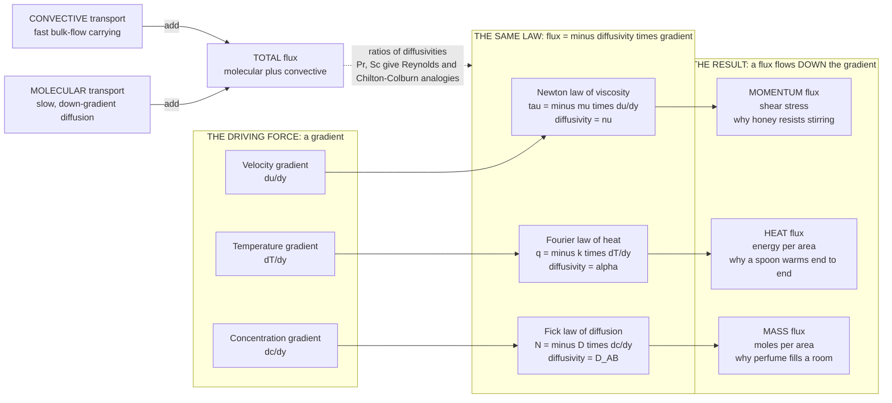

# 🌊 Transport Phenomena: Momentum, Heat, and Mass Under One Roof

> [!abstract] TL;DR
> **Transport phenomena** is the unified study of the three things that flow through every piece of process equipment — **momentum**, **heat**, and **mass** — and the astonishing discovery that all three are governed by *the same equation wearing three costumes*. Each is a **flux** driven **down a gradient** at a rate set by a molecular **diffusivity**: momentum obeys **Newton's law of viscosity** ($\tau = -\mu\,du/dy$), heat obeys **Fourier's law** ($q = -k\,dT/dy$), and mass obeys **Fick's law** ($N_A = -D_{AB}\,dc_A/dy$). Rewritten in "diffusivity form," all three read *flux $= -(\text{diffusivity})\times(\text{gradient})$*, with kinematic viscosity $\nu$, thermal diffusivity $\alpha$, and mass diffusivity $D_{AB}$ playing identical roles — each with units of $\text{length}^2/\text{time}$. Transport happens by two mechanisms: slow **molecular** diffusion and fast **convective** bulk flow. The payoff is enormous: the same "conservation + flux" template gives the **equations of change** (continuity, Navier-Stokes, energy, species), and dimensionless ratios of the diffusivities — the **Prandtl** ($\nu/\alpha$) and **Schmidt** ($\nu/D$) numbers — let the **Reynolds and Chilton-Colburn analogies** predict heat and mass transfer straight from friction data. Where thermodynamics says *how far* a process can go, transport phenomena says *how fast* — it sets the **rates** of every reactor, column, exchanger, pipe, and dryer in the plant.

---

## Intuition

**Analogy:** Nature moves three completely different things around in almost exactly the same way. Watch a spoon in honey and it *resists* your stir — that is **momentum** being dragged from the fast-moving spoon out into the slow fluid. Hold a metal spoon with its tip in hot tea and after a minute the handle warms in your fingers — that is **heat** creeping from the hot end to the cold. Open a bottle of perfume in the corner of a still room and minutes later someone across the room smells it — that is **mass** spreading from where it is concentrated to where it is not. Three unrelated-seeming events, one identical story: *stuff flows DOWN a gradient — from fast to slow, hot to cold, concentrated to dilute — at a rate proportional to how steep the gradient is.*

That single sentence is Newton's law of viscosity, Fourier's law of heat, and Fick's law of diffusion, all at once — they are literally the same equation in three disguises. And this parallel is the secret weapon of chemical engineering: **learn the mathematics once, and you have learned all three.** The same equations that predict how fast a pipe loses pressure also predict how fast a heat exchanger warms a stream and how fast a distillation tray transfers vapour into liquid. One framework, the whole plant.

---

## How It Works

### The one idea: flux equals diffusivity times gradient

Every transport process is built from the same two-part statement:

1. **A gradient is the driving force.** Nothing moves without an imbalance. A velocity gradient drives momentum; a temperature gradient drives heat; a concentration gradient drives mass. Remove the gradient (uniform speed, uniform temperature, uniform composition) and the flux stops. This is *transport's version* of "water runs downhill."

2. **A flux flows down that gradient, in proportion to its steepness.** The constant of proportionality is a **molecular diffusivity** — a material property measuring how readily the fluid passes the quantity along. Steeper gradient or larger diffusivity means a larger flux.

Written as one-dimensional rate laws:

$$
\underbrace{\tau_{yx} = -\mu\,\frac{du}{dy}}_{\textbf{Newton — momentum}}
\qquad
\underbrace{q_y = -k\,\frac{dT}{dy}}_{\textbf{Fourier — heat}}
\qquad
\underbrace{N_{A,y} = -D_{AB}\,\frac{dc_A}{dy}}_{\textbf{Fick — mass}}
$$

The **minus sign** encodes "down the gradient": flux points from high toward low. The magic appears when you rewrite each in **diffusivity form**, dividing through so the gradient is of a *conserved concentration* (momentum concentration $\rho u$, thermal energy concentration $\rho c_p T$, species concentration $c_A$):

$$
\tau = -\nu\,\frac{d(\rho u)}{dy},\qquad
q = -\alpha\,\frac{d(\rho c_p T)}{dy},\qquad
N_A = -D_{AB}\,\frac{dc_A}{dy}
$$

Now the three laws are **algebraically identical** — *flux $= -(\text{diffusivity})\times(\text{gradient of a concentration})$* — and the three diffusivities share one unit, $\text{m}^2/\text{s}$:

| Transport | Diffusivity | Symbol | Typical value (air) |
|-----------|-------------|--------|---------------------|
| Momentum | kinematic viscosity | $\nu = \mu/\rho$ | $\sim 1.6\times10^{-5}\ \text{m}^2/\text{s}$ |
| Heat | thermal diffusivity | $\alpha = k/(\rho c_p)$ | $\sim 2.2\times10^{-5}\ \text{m}^2/\text{s}$ |
| Mass | mass diffusivity | $D_{AB}$ | $\sim 2.5\times10^{-5}\ \text{m}^2/\text{s}$ |

That the three numbers for a gas are almost equal is not a coincidence — kinetic theory (see [[Kinetic_Theory_of_Gases]]) shows all three arise from the *same* molecular motion carrying *different* cargo, so for gases $\nu \approx \alpha \approx D$, and the analogy is nearly perfect.

### Two mechanisms: molecular and convective

The rate laws above describe **molecular transport** — the slow, down-gradient spread driven purely by random molecular motion (diffusion). But in flowing systems a second, usually faster mechanism dominates: **convective transport**, where the bulk flow physically *carries* momentum, heat, and species along with it. The **total flux** is the sum:

$$
\text{total flux} = \underbrace{\text{molecular (diffusive)}}_{-(\text{diffusivity})\nabla(\ldots)} + \underbrace{\text{convective (bulk)}}_{(\text{velocity})\times(\text{concentration})}
$$

Convection is why stirring a coffee mixes it in seconds when diffusion alone would take hours, and why a fan cools you far faster than still air. Almost all process equipment is engineered to *exploit convection* — pumps, agitators, and turbulence exist to beat the slowness of pure diffusion.

### The equations of change

Apply the universal accounting habit of the field — **accumulation = in − out + generation** (developed for chemical processes in [[Material_and_Mass_Balances]]) — to a tiny fluid element, insert the appropriate flux law, and out drop the **equations of change**, one conserved quantity at a time:

- **Continuity** (total mass): $\partial\rho/\partial t + \nabla\cdot(\rho\vec{u}) = 0$
- **Momentum** (Navier-Stokes, using Newton's law): the $\mu\nabla^2\vec u$ viscous term is momentum *diffusion* — see [[Viscosity_and_Stress_in_Fluids]] and [[Fluid_Dynamics_Overview]]
- **Energy** (using Fourier's law): the $k\nabla^2 T$ term is heat *diffusion* — see [[Conduction_Heat_Transfer]]
- **Species** (convection-diffusion, using Fick's law): the $D_{AB}\nabla^2 c_A$ term is mass *diffusion*

They are the *same conservation + flux template* applied four times. Solving them for a specific geometry — usually via a **shell balance** on a thin slice plus **boundary conditions** (no-slip walls, fixed temperatures, equilibrium interfaces) — is the working method of the entire field.

### Dimensionless groups and the analogies

Because the three transports share a form, their *ratios* are meaningful dimensionless numbers that quantify how alike the three processes are in a given fluid:

- **Reynolds number** $Re = uL/\nu$ — momentum convection vs momentum diffusion (sets laminar vs turbulent)
- **Prandtl number** $Pr = \nu/\alpha$ — momentum diffusivity vs *heat* diffusivity
- **Schmidt number** $Sc = \nu/D_{AB}$ — momentum diffusivity vs *mass* diffusivity
- **Nusselt** $Nu$ and **Sherwood** $Sh$ — dimensionless heat- and mass-transfer *coefficients* (the convective analogues)

When $Pr \approx 1$ and $Sc \approx 1$ (true for gases), the velocity, temperature, and concentration profiles have the *same shape*, and the **Reynolds analogy** and its refinement the **Chilton-Colburn analogy** let you predict a heat- or mass-transfer coefficient directly from a *friction* measurement — the practical jackpot of the whole framework. This is why a pressure-drop test on a pipe can size the heat exchanger and the absorber that share it.



---

## Key Concepts

### Secondary Level

- **Three things flow the same way.** Momentum (why syrup drags on a spoon), heat (why a metal handle gets hot), and a smell (why perfume spreads) all move for the same reason: something is uneven, and stuff flows from "a lot" toward "a little" until it evens out.
- **Steeper means faster.** The bigger the imbalance — the hotter the difference, the stronger the smell, the faster the sliding — the faster the flow. Halve the gap and you roughly halve the rate.
- **Stirring beats waiting.** Left alone, these flows are *slow* (that is diffusion). Moving the fluid — stirring, pumping, blowing a fan — carries the stuff along far faster (that is convection). Every factory stirs and pumps for exactly this reason.
- **Learn one, get three free.** Because the three follow the same rule, an engineer who understands how a pipe loses pressure already understands how a radiator sheds heat and how a scrubber absorbs a gas.

### Undergraduate Level

- **The three rate laws.** $\tau = -\mu\,du/dy$ (Newton), $q = -k\,dT/dy$ (Fourier), $N_A = -D_{AB}\,dc_A/dy$ (Fick) — each a flux equal to a **transport property** times a gradient, minus sign for "down-gradient."
- **Diffusivity form unifies them.** Divide by $\rho$, $\rho c_p$, or 1 respectively and all three become $\text{flux} = -(\text{diffusivity})\times\nabla(\text{concentration})$, with $\nu$, $\alpha$, $D_{AB}$ all in $\text{m}^2/\text{s}$. For **gases** kinetic theory gives $\nu\approx\alpha\approx D$, so $Pr\approx Sc\approx 1$.
- **Molecular vs convective.** Total flux $= -(\text{diffusivity})\nabla c + \vec{u}\,c$. The **Péclet number** $Pe = uL/\text{(diffusivity)}$ measures which wins; large $Pe$ means convection-dominated.
- **Transfer coefficients.** For engineering we lump the near-wall gradient into a coefficient: friction factor $f$, heat-transfer coefficient $h$ ($q = h\,\Delta T$), and mass-transfer coefficient $k_c$ ($N_A = k_c\,\Delta c$) — nondimensionalized as $f$, $Nu = hL/k$, $Sh = k_c L/D$.
- **The dimensionless family.** $Re = uL/\nu$ (flow regime), $Pr = \nu/\alpha$ (momentum/heat), $Sc = \nu/D$ (momentum/mass), $Le = \alpha/D$ (heat/mass). Correlations take the form $Nu = f(Re, Pr)$ and, by analogy, $Sh = f(Re, Sc)$ with the *same function*.
- **Reynolds and Chilton-Colburn analogies.** When profiles are similar, $\dfrac{f}{2} = St\,Pr^{2/3} = St_m\,Sc^{2/3}$ — the **j-factor** identity $j_H = j_D = f/2$ that predicts heat and mass transfer from friction (the demo below).

### Graduate Level

- **Tensorial constitutive laws.** In 3D, Newton's law generalizes to a linear relation between the viscous **stress tensor** and the symmetric **strain-rate tensor**; Fourier and Fick generalize to $\vec q = -k\nabla T$ and $\vec N_A = -D_{AB}\nabla c_A + x_A(\vec N_A + \vec N_B)$ (Fick with a convective/reference-frame correction). Multicomponent mass transfer requires the **Maxwell-Stefan** equations, where $D_{AB}$ is no longer a single scalar.
- **The equations of change as one template.** Continuity, Navier-Stokes, energy, and species are each $\partial(\text{conc})/\partial t + \nabla\cdot(\text{convective flux}) = -\nabla\cdot(\text{diffusive flux}) + \text{generation}$. Nondimensionalizing them *produces* $Re$, $Pr$, $Sc$, $Pe$, $Br$ (Brinkman), $Da$ (Damköhler) as the coefficients — dimensional analysis is not a trick, it is the structure of the equations (see [[Dimensional_Analysis_and_Similarity]]).
- **Boundary layers.** Near a wall, the momentum, thermal, and concentration **boundary layers** grow with thicknesses in ratio $\delta:\delta_T:\delta_c \sim 1:Pr^{-1/3}:Sc^{-1/3}$. Blasius/Pohlhausen similarity solutions give $Nu\sim Re^{1/2}Pr^{1/3}$ and $Sh\sim Re^{1/2}Sc^{1/3}$ — the analogy made rigorous (see [[The_Boundary_Layer]]).
- **Where the analogy breaks.** The Reynolds/Chilton-Colburn analogies assume no form drag and similar profiles. They fail when **pressure drag** dominates (bluff bodies), when $Pr$ or $Sc$ is far from 1 (liquids: $Sc\sim 10^2$–$10^3$, so mass boundary layers are far thinner than thermal), or when there is strong **coupling** (Soret/Dufour cross-effects, variable properties, high mass-transfer blowing).
- **Interphase transport.** At a gas-liquid or solid-fluid interface, **two-film** and **penetration/surface-renewal** theories model coupled resistances; the flux is set by the *slower* film, and equilibrium (thermodynamics) sets the interface condition while transport sets the rate to reach it — the rate-vs-equilibrium division of labor at the heart of separations.
- **Turbulent closure.** In turbulence, effective **eddy diffusivities** for momentum, heat, and mass ($\varepsilon_M$, $\varepsilon_H$, $\varepsilon_D$) dwarf the molecular ones; the **turbulent Prandtl/Schmidt numbers** ($\varepsilon_M/\varepsilon_H \approx \varepsilon_M/\varepsilon_D \approx 0.7$–$0.9$) restore an approximate analogy that underlies nearly all industrial transfer correlations.

---

## Python Demo

```python
# THE TRANSPORT ANALOGY -- momentum, heat, and mass as one equation in three costumes.
#
#   (a) THREE PARALLEL LAWS:  flux = -(diffusivity) x (gradient), identical in form.
#       Newton  (momentum):  tau  = -nu    * d(rho u)/dy      diffusivity = nu
#       Fourier (heat):      q    = -alpha  * d(rho cp T)/dy   diffusivity = alpha
#       Fick    (mass):      N_A  = -D_AB   * dc/dy            diffusivity = D_AB
#       Plotting |flux| vs |gradient| gives three straight lines whose SLOPES are
#       the three diffusivities -- literally the same law, three cargos.
#
#   (b) DIMENSIONLESS ANALOGY: the diffusivity RATIOS (Prandtl nu/alpha, Schmidt
#       nu/D, Lewis alpha/D) measure how alike the three transports are, and the
#       CHILTON-COLBURN analogy  f/2 = St*Pr^(2/3) = St_m*Sc^(2/3)  predicts heat
#       and mass transfer straight from FRICTION data.
#
# Requires: numpy, matplotlib
import numpy as np
import matplotlib.pyplot as plt

# ---------------------------------------------------------------------
# Molecular diffusivities [m^2/s] at ~25 C, 1 atm
#   Air:   nu, alpha, D are all ~2e-5  -> Pr, Sc near 1  (analogy nearly perfect)
#   Water: nu, alpha, D span orders    -> Pr~6, Sc~450   (mass analogy weak)
# ---------------------------------------------------------------------
props = {
    "Air (gas)":   dict(nu=1.56e-5, alpha=2.20e-5, D=2.50e-5, c="#1f77b4"),
    "Water (liquid)": dict(nu=0.90e-6, alpha=1.43e-7, D=2.00e-9, c="#d62728"),
}
for name, p in props.items():
    p["Pr"] = p["nu"] / p["alpha"]      # Prandtl  = momentum / heat
    p["Sc"] = p["nu"] / p["D"]          # Schmidt  = momentum / mass
    p["Le"] = p["alpha"] / p["D"]       # Lewis    = heat / mass
    print(f"{name:16s}  nu={p['nu']:.2e}  alpha={p['alpha']:.2e}  D={p['D']:.2e}"
          f"   Pr={p['Pr']:6.2f}  Sc={p['Sc']:8.2f}  Le={p['Le']:7.2f}")

# ---------------------------------------------------------------------
# (b) Chilton-Colburn analogy over turbulent pipe flow, Re = 1e4 .. 1e6
#   Fanning friction factor (smooth pipe):  f = 0.046 * Re^-0.2
#   Colburn heat correlation:  Nu = 0.023 Re^0.8 Pr^(1/3)
#   Analogous mass correlation: Sh = 0.023 Re^0.8 Sc^(1/3)
#   j-factors:  j_H = St*Pr^(2/3),  j_D = St_m*Sc^(2/3),  both == f/2
# ---------------------------------------------------------------------
Re = np.logspace(4, 6, 200)
Pr_air, Sc_air = props["Air (gas)"]["Pr"], props["Air (gas)"]["Sc"]
f_fanning = 0.046 * Re**-0.2
Nu = 0.023 * Re**0.8 * Pr_air**(1/3)
Sh = 0.023 * Re**0.8 * Sc_air**(1/3)
St   = Nu / (Re * Pr_air)                 # Stanton (heat)
St_m = Sh / (Re * Sc_air)                 # Stanton (mass)
jH = St   * Pr_air**(2/3)                  # Colburn j for heat
jD = St_m * Sc_air**(2/3)                  # Colburn j for mass
print(f"\nChilton-Colburn check @ Re=1e5:  f/2={0.5*0.046*1e5**-0.2:.5f}  "
      f"jH={ (0.023*1e5**0.8*Pr_air**(1/3)/(1e5*Pr_air))*Pr_air**(2/3):.5f}  "
      f"jD={ (0.023*1e5**0.8*Sc_air**(1/3)/(1e5*Sc_air))*Sc_air**(2/3):.5f}"
      f"   (all equal -> analogy holds)")

# ============================== PLOTS ==============================
fig, ax = plt.subplots(2, 2, figsize=(13, 9.5))
fig.suptitle("The Transport Analogy: One Equation, Three Costumes",
             fontsize=15, fontweight="bold")

# --- A: three parallel flux laws (slope = diffusivity) ---
axA = ax[0, 0]
grad = np.linspace(0, 1, 50)          # normalized gradient (arb. units)
for label, diff, col, ls in [
        ("Newton (momentum): slope = nu",   props["Air (gas)"]["nu"],    "#1f77b4", "-"),
        ("Fourier (heat): slope = alpha",    props["Air (gas)"]["alpha"], "#2ca02c", "--"),
        ("Fick (mass): slope = D_AB",        props["Air (gas)"]["D"],     "#ff7f0e", "-.")]:
    axA.plot(grad, diff * grad * 1e5, col, ls=ls, lw=2.6, label=label)
axA.set_xlabel("normalized gradient  |d(concentration)/dy|")
axA.set_ylabel("flux  (x 1e-5, same units for all)")
axA.set_title("A. Same law, three cargos:  flux = -(diffusivity) x gradient\n"
              "for a gas the three slopes nearly coincide (Pr, Sc ~ 1)")
axA.legend(fontsize=8, loc="upper left"); axA.grid(alpha=0.3)

# --- B: the three diffusivities, air vs water (log scale) ---
axB = ax[0, 1]
labels = [r"$\nu$" + "\nmomentum", r"$\alpha$" + "\nheat", r"$D_{AB}$" + "\nmass"]
x = np.arange(3); w = 0.36
for i, (name, p) in enumerate(props.items()):
    axB.bar(x + (i - 0.5) * w, [p["nu"], p["alpha"], p["D"]], w,
            color=p["c"], alpha=0.85, label=name)
axB.set_yscale("log"); axB.set_xticks(x); axB.set_xticklabels(labels)
axB.set_ylabel("diffusivity  [m^2/s]  (log)")
axB.set_title("B. Gases: all three near 2e-5 (analogy strong)\n"
              "Liquids: spread over orders (analogy weaker for mass)")
axB.legend(fontsize=8); axB.grid(alpha=0.3, axis="y")

# --- C: dimensionless ratios Pr, Sc, Le ---
axC = ax[1, 0]
groups = ["Pr = nu/alpha", "Sc = nu/D", "Le = alpha/D"]
xg = np.arange(3)
for i, (name, p) in enumerate(props.items()):
    axC.bar(xg + (i - 0.5) * w, [p["Pr"], p["Sc"], p["Le"]], w,
            color=p["c"], alpha=0.85, label=name)
axC.axhline(1.0, ls=":", color="k", lw=1.2)
axC.text(2.35, 1.15, "ratio = 1\n(perfect analogy)", fontsize=8)
axC.set_yscale("log"); axC.set_xticks(xg); axC.set_xticklabels(groups, fontsize=8)
axC.set_ylabel("dimensionless ratio (log)")
axC.set_title("C. Diffusivity ratios: how ALIKE the three transports are")
axC.legend(fontsize=8); axC.grid(alpha=0.3, axis="y")

# --- D: Chilton-Colburn analogy -- j-factors collapse onto f/2 ---
axD = ax[1, 1]
axD.loglog(Re, f_fanning / 2, "k-",  lw=3.2, label="f/2  (from FRICTION)")
axD.loglog(Re, jH, color="#2ca02c", ls="--", lw=2.2, label="j_H = St*Pr^(2/3)  (heat)")
axD.loglog(Re, jD, color="#ff7f0e", ls=":",  lw=2.6, label="j_D = St_m*Sc^(2/3)  (mass)")
axD.set_xlabel("Reynolds number  Re")
axD.set_ylabel("j-factor  /  f/2")
axD.set_title("D. Chilton-Colburn analogy:  f/2 = j_H = j_D\n"
              "predict heat and mass transfer from a friction test")
axD.legend(fontsize=8); axD.grid(alpha=0.3, which="both")

plt.tight_layout(rect=[0, 0, 1, 0.95])
plt.show()
```

Running this prints the diffusivity table and the Chilton-Colburn check, then draws four panels. Panel **A** is the headline: plot flux against gradient for momentum, heat, and mass and you get three straight lines of the *same form*, their slopes being the three diffusivities — for a gas the lines nearly overlap. Panel **B** shows *why* the analogy is strong for gases (all three diffusivities cluster near $2\times10^{-5}\ \text{m}^2/\text{s}$) but weaker in liquids (they span orders of magnitude). Panel **C** distills that into the dimensionless ratios: $Pr$, $Sc$, $Le$ all near 1 for air (the transports are interchangeable) versus a Schmidt number of hundreds for water (mass diffuses far slower than momentum). Panel **D** is the practical payoff: the heat j-factor and the mass j-factor collapse exactly onto $f/2$ computed from **friction** — so one pressure-drop measurement predicts the heat exchanger *and* the absorber.

---

## Real-World Applications

> **Example:** A **shell-and-tube heat exchanger** recovering heat from a hot process stream is transport phenomena made steel. The engineer never solves the full energy equation on the plant floor; instead they use a correlation like $Nu = 0.023\,Re^{0.8}Pr^{0.4}$ (Dittus-Boelter) to get the tube-side heat-transfer coefficient $h$, then $\dot Q = UA\,\Delta T_{lm}$ to size the area — and that correlation *exists* only because the momentum-heat analogy lets it be built by adapting the friction correlation $f = 0.046\,Re^{-0.2}$. The *identical* Reynolds and Prandtl-number structure that governs the pressure drop the pump must overcome also governs the heat the exchanger transfers. Momentum and heat, one design, one framework.

- **Distillation and absorption columns.** Separation rate is set by **mass transfer** across the vapour-liquid interface; column height is sized from a mass-transfer coefficient $k_c$ (via $Sh = f(Re, Sc)$) and the number of transfer units. Thermodynamics fixes the equilibrium the trays approach; transport fixes how many trays (or how much packing) it takes to get there.
- **Chemical reactors.** In a packed catalytic bed, reactant must diffuse from the bulk gas to the pellet surface and *into* its pores before reacting; the **Damköhler** and **Thiele** numbers compare reaction rate to transport rate, and mass transfer often — not kinetics — limits the achievable rate. The energy equation simultaneously governs whether the exotherm runs away.
- **Pipelines and pumping.** Pressure drop is pure **momentum transport**: the Moody/friction-factor chart, $Re$, and the boundary layer set the pumping power for every stream in the plant (see [[Fluid_Dynamics_Overview]]).
- **Drying and humidification.** A wet solid dries by **coupled heat and mass transfer** — heat flows *in* to evaporate water while vapour diffuses *out*; the Lewis number $Le = \alpha/D \approx 1$ for air-water is exactly why the wet-bulb thermometer works and why psychrometrics is tractable.
- **Cooling towers, scrubbers, and membranes.** Every gas-cleaning and water-treatment unit is an interphase transport device; two-film theory and the analogy convert lab friction/heat data into full-scale designs.
- **Microelectronics and CVD.** Chemical vapour deposition of thin films is diffusion of reactive species through a boundary layer to a wafer — transport-limited film growth, designed with the very same $Sh(Re,Sc)$ correlations.

---

## Common Pitfalls

- **Confusing "how far" with "how fast."** Thermodynamics and equilibrium tell you the *destination* — the maximum conversion, the vapour composition a tray can reach. Transport phenomena tells you the *rate* of getting there. A process can be thermodynamically wide-open yet uselessly slow (transport-limited), or fast yet capped at low conversion. You need both analyses; neither substitutes for the other.
- **Assuming the analogy always holds.** The Reynolds/Chilton-Colburn analogies are seductive but conditional. They require similar velocity/temperature/concentration profiles, which fails when **form (pressure) drag** dominates over skin friction (bluff bodies, packed beds), or when $Pr$ / $Sc$ are far from 1. In water, $Sc \sim 500$: the mass boundary layer is an order of magnitude thinner than the thermal one, so borrowing a heat coefficient for mass transfer is badly wrong.
- **Dropping convection (or dropping diffusion).** Using a pure-diffusion (molecular) estimate in a stirred or flowing system underpredicts the rate by orders of magnitude; conversely, ignoring the thin diffusive **film** at the wall/interface misses the resistance that actually controls the flux. The total flux is molecular *plus* convective — and near any surface the molecular film is where the action is.
- **Sign and driving-force errors.** The minus sign means flux runs *down* the gradient; getting it backward reverses the predicted direction of heat or species flow. And the driving force for interphase mass transfer is a difference from the *equilibrium* interface value ($c_A - c_A^{*}$), not the bulk-to-bulk difference — mixing these up mis-sizes every separator.
- **Using one diffusivity where several are needed.** Fick's binary $D_{AB}$ is fine for a dilute species in a solvent, but multicomponent mixtures need **Maxwell-Stefan** diffusivities, and in gases mass, heat, and momentum diffusivities are *close* while in liquids they are wildly different. Copying gas-phase intuition into a liquid is a classic scale-up trap.
- **Forgetting property variation.** $\mu$, $k$, and $D$ change strongly with temperature and composition; treating them as constant across a big temperature drop (a reboiler, a quench) can throw a design off by tens of percent. Evaluate properties at the appropriate film temperature.

---

## Related Concepts

**This section's siblings (developed in dedicated notes)** — this opener frames threads carried forward in *Momentum_Transport_and_Fluid_Flow* (viscous flow, friction, and pressure drop in process piping), *Heat_Transfer_in_Process_Equipment* (conduction, convection, and radiation sizing every exchanger and jacket), *Mass_Transfer_and_Diffusion* (Fick's law, diffusion coefficients, and interphase films), *Convective_Transport_and_Correlations* (the $Nu(Re,Pr)$ / $Sh(Re,Sc)$ correlations and the analogies in engineering form), and *Interphase_and_Multiphase_Transport* (two-film and penetration theory across gas-liquid-solid boundaries).

**Within the Chemical Engineering vault**
- [[Chemical_Engineering_Overview]] — the hub note; transport phenomena is Principle 3, the *rates* beneath every unit operation
- [[Material_and_Mass_Balances]] — the accumulation = in − out + generation accounting that, applied to a shell, *produces* the equations of change
- [[Energy_Balances_in_Processes]] — the macroscopic energy ledger whose local, differential form is the transport energy equation

**The physics of momentum transport (Fluid Dynamics vault)**
- [[Viscosity_and_Stress_in_Fluids]] — Newton's law of viscosity and the stress tensor, the momentum-transport rate law in full
- [[Fluid_Dynamics_Overview]] — the flow field that convects momentum, heat, and mass; source of the Reynolds number
- [[The_Boundary_Layer]] — where velocity, thermal, and concentration layers grow together; the geometric heart of the analogy
- [[Dimensional_Analysis_and_Similarity]] — how nondimensionalizing the equations of change yields $Re$, $Pr$, $Sc$, and the correlation structure

**The physics of heat and molecular transport (sister vaults)**
- [[Conduction_Heat_Transfer]] — Fourier's law and the heat-diffusion equation, the heat-transport twin of Fick's law
- [[Convection_and_Radiation]] — convective heat-transfer coefficients ($Nu$) and the non-analogous radiation mode
- [[Kinetic_Theory_of_Gases]] — the molecular origin of *all three* diffusivities, and why $\nu\approx\alpha\approx D$ for gases

---

## Review Questions

**Secondary**
1. Give one everyday example each of momentum, heat, and mass "flowing downhill." In each case, name what is uneven (the gradient) and which way the flow goes. Why does stirring or blowing a fan speed all three up?

**Undergraduate**
2. Write Newton's, Fourier's, and Fick's laws and rewrite each in "diffusivity form." Show that the three diffusivities ($\nu$, $\alpha$, $D_{AB}$) share the units $\text{m}^2/\text{s}$. Air has $Pr\approx 0.7$ and $Sc\approx 0.6$ while water has $Pr\approx 6$ and $Sc\approx 500$ — explain physically why the momentum-heat-mass analogy is nearly perfect for the gas but poor (for mass) in the liquid, and state one engineering consequence.

**Graduate**
3. You have measured the friction factor $f$ for turbulent flow of a gas through a tube and want to predict the heat- and mass-transfer coefficients without further experiments. State the Chilton-Colburn analogy $f/2 = St\,Pr^{2/3} = St_m\,Sc^{2/3}$, derive $h$ and $k_c$ from it, and identify three physical situations (e.g., bluff-body flow, high-$Sc$ liquids, strong wall blowing) in which this prediction would fail. For the high-$Sc$ case, use the boundary-layer thickness ratio $\delta_c/\delta_T \sim (Sc/Pr)^{-1/3}$ to argue *why* it fails.

---

## Sources

- R. B. Bird, W. E. Stewart & E. N. Lightfoot — *Transport Phenomena*, 2nd ed. (Wiley, 2007) — the canonical "BSL" that unified the three transports
- J. R. Welty, C. E. Wicks, R. E. Wilson & G. L. Rorrer — *Fundamentals of Momentum, Heat, and Mass Transfer*, 5th ed. (Wiley, 2008)
- C. J. Geankoplis — *Transport Processes and Separation Process Principles*, 4th ed. (Prentice Hall, 2003)
- W. M. Deen — *Analysis of Transport Phenomena*, 2nd ed. (Oxford University Press, 2012)
- T. K. Sherwood, R. L. Pigford & C. R. Wilke — *Mass Transfer* (McGraw-Hill, 1975) — classic treatment of the Chilton-Colburn analogy

---

#chemical-engineering #transport-phenomena #momentum-heat-mass #ficks-law #analogy
