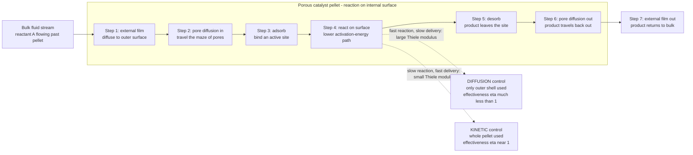

# ⚗️ Catalysis and Heterogeneous Reactions: Speeding Reactions on a Solid Surface

> [!abstract] TL;DR
> A **catalyst** is a substance that **accelerates a reaction without being consumed** by offering an alternative pathway of **lower activation energy** — it changes only *how fast* you approach equilibrium, never *where* equilibrium sits. Most industrial catalysts are **heterogeneous**: a **solid** (a precious-metal-flecked porous pellet) working on **fluid** reactants, prized because it is easy to separate and robust at high temperature. The reaction happens on the catalyst's enormous **internal surface**, so a reactant must complete a **seven-step journey** — diffuse from the bulk fluid to the pellet (**external film**), diffuse **into the pores** (internal diffusion), **adsorb** on an active **site**, **react**, **desorb**, and diffuse back out. Surface kinetics follow **Langmuir-Hinshelwood** (or Eley-Rideal) mechanisms whose rate **saturates** as sites fill — unlike a simple power law. When the intrinsic reaction is fast, **diffusion controls**: the dimensionless **Thiele modulus** $\phi$ (reaction rate vs pore-diffusion rate) sets the **effectiveness factor** $\eta$ — the fraction of the pellet actually used. Small pellets are reaction-limited ($\eta\to1$); large pellets are diffusion-limited ($\eta\propto1/\phi$, and their *apparent* activation energy falls to half the true value). Real catalysts also **deactivate** — poisoning, sintering, coking — which drives operating strategy. Catalysis is the heart of the chemical and energy industries: ammonia, refining, sulfuric acid, methanol, polymers, and the automotive converter all run on it.

---

## Intuition

**Analogy:** A catalyst is a **molecular matchmaker**. Two reactants drifting past each other rarely have the energy and the right orientation to bond — like two shy strangers at a crowded party who never quite connect. The matchmaker grabs each of them, holds them in *just the right pose* to react, nudges the bond into place, then lets the finished couple go and turns immediately to the next pair — itself completely **unchanged**, ready to do it again millions of times. Crucially, the matchmaker does **not** change *who is compatible* — it does not move the destination, only the speed of getting there. It carves an easier path over the mountain: instead of hauling everyone over the high, exhausting pass (the **activation energy**), it opens a **lower tunnel** through the ridge.

Now add the industrial twist: the matchmaker is not floating in the crowd but sits at a fixed desk deep inside a vast, mazelike office building — a **porous solid pellet** whose useful surface is almost entirely *inside*, riddled with tiny pores. So every reactant must **journey in**: travel from the flowing crowd outside, through the front door, down the corridors to a desk, get introduced, react, and travel back out with its product. That commute can become the bottleneck. Sometimes the introductions are lightning-fast but the corridors are jammed, so the desks deep in the building sit idle — a big pellet is only **partly used**. Understanding catalysis means understanding both the chemistry *at the desk* and the *traffic in the corridors* — and knowing which one is actually limiting you.

---

## How It Works

### What a catalyst does (and does not do)

A catalyst provides an **alternative reaction pathway with a lower activation energy** $E_a$. By the Arrhenius law the rate constant $k = A\,e^{-E_a/RT}$ rises exponentially as $E_a$ falls, so shaving the barrier can multiply the rate by many orders of magnitude. Three non-negotiable facts follow from thermodynamics (see [[Chemical_Equilibrium]] and [[Chemical_Reaction_Equilibrium]]):

1. **It is not consumed.** The catalyst is regenerated each cycle, so a tiny amount turns over reactant indefinitely (until it deactivates).
2. **It does not shift equilibrium.** A catalyst lowers the barrier for the *forward and reverse* reactions equally, so it speeds *both* — the equilibrium constant $K_{eq}$, fixed by $\Delta G$, is untouched. Catalysis changes only the **approach** to equilibrium, never its position.
3. **It can change selectivity.** By favouring one pathway's barrier over another's, a catalyst steers *which* product forms — often its most valuable industrial trait.

### Homogeneous vs heterogeneous

- **Homogeneous catalysis** — catalyst and reactants share one phase (e.g. acid catalysis in solution, organometallic complexes). High activity and selectivity, but hard to separate from the product.
- **Heterogeneous catalysis** — a **solid** catalyst acts on a **fluid** (gas or liquid) stream. Slightly less selective per site but the **industrial workhorse**: the catalyst never leaves the reactor, is easily separated, and survives high temperatures and pressures. This note focuses on the heterogeneous case.

### The seven-step journey

For a solid-catalyzed reaction, a reactant molecule must complete a sequence of **transport** and **chemical** steps in series. Because they are in series, the **slowest step controls** the overall rate:

1. **External (film) diffusion** — from the bulk fluid across a thin boundary-layer film to the outer pellet surface.
2. **Internal (pore) diffusion** — into the pellet's maze of pores toward an interior active site.
3. **Adsorption** — the reactant binds to an active **site** on the surface.
4. **Surface reaction** — the adsorbed species react (the actual bond-making step, over the lowered barrier).
5. **Desorption** — the product releases from the site, freeing it for reuse.
6. **Pore diffusion out** — the product travels back out through the pores.
7. **External diffusion out** — the product crosses the film back to the bulk fluid.

Steps 1, 2, 6, 7 are **physical transport**; steps 3, 4, 5 are **chemical kinetics** on the surface.

### Surface kinetics: Langmuir-Hinshelwood

Because there are a **finite number of active sites**, surface reactions do not follow a simple power law. The **Langmuir adsorption isotherm** gives the fractional site coverage $\theta$ of a species at partial pressure $P$:

$$
\theta = \frac{K P}{1 + K P}
$$

where $K$ is the adsorption equilibrium constant. In the **Langmuir-Hinshelwood (LH)** mechanism, reaction occurs between two *adsorbed* species, so the rate is proportional to their coverages. For a single reactant whose adsorption controls,

$$
r = \frac{k\,K\,P}{1 + K\,P}
$$

At **low pressure** ($KP \ll 1$) this is first order, $r\approx kKP$; at **high pressure** ($KP \gg 1$) the surface **saturates** and the rate **plateaus** at $r\to k$ — the sites are all occupied and adding more reactant cannot help. (In the alternative **Eley-Rideal** mechanism, an adsorbed species reacts with one striking directly from the gas.) This saturation is the surface-chemistry signature that distinguishes catalytic kinetics from elementary gas-phase kinetics (see [[Chemical_Kinetics]]); it is the exact structural twin of **Michaelis-Menten** enzyme kinetics (see [[Enzyme_Kinetics_and_Catalysis]]).

### When diffusion takes over: the Thiele modulus and effectiveness factor

If the intrinsic surface reaction is **fast**, reactant is consumed near the pellet's mouth before it can diffuse deep inside — the core sits starved and idle. The competition between **reaction rate** and **pore-diffusion rate** is captured by the dimensionless **Thiele modulus**:

$$
\phi = L\sqrt{\frac{k}{D_e}}
\qquad\text{(reaction rate / diffusion rate)}
$$

where $L$ is a characteristic pellet size, $k$ the rate constant, and $D_e$ the **effective diffusivity** in the pores. Its consequence is the **effectiveness factor**:

$$
\eta = \frac{\text{actual rate with diffusion resistance}}{\text{rate if the whole pellet saw surface conditions}}
$$

- **Small $\phi$ (reaction-limited):** diffusion is easy, the whole pellet is used, $\eta\to1$.
- **Large $\phi$ (diffusion-limited):** only an outer shell reacts, $\eta\propto1/\phi$ — the pellet is badly under-utilized. For a flat slab, $\eta = \tanh\phi/\phi$.

This is why **pellet size and porosity matter**: a smaller pellet or wider pores (larger $D_e$) lower $\phi$ and raise $\eta$, but cost more pressure drop. A tell-tale of diffusion control is that the **apparent activation energy falls to roughly half** the true value (since $\eta\propto1/\phi\propto1/\sqrt{k}$, the observed $k_{obs}=\eta k\propto\sqrt{k}$), and the apparent order shifts toward $(n{+}1)/2$.



### Engineering the catalyst

A working catalyst is a designed material: an **active phase** (often a precious or transition metal — Pt, Pd, Ni, Fe) dispersed as tiny crystallites on a high-surface-area **support** (alumina, silica, carbon, zeolite) to maximize exposed area per gram. **Promoters** (small additives) tune activity or stability; **shape-selective** supports such as **zeolites** admit or release only molecules of a certain size, adding a molecular-sieving selectivity. Physical form sets the reactor: **packed beds** of pellets, **fluidized beds** of fine powder, and **monoliths** (the honeycomb of a catalytic converter). And all catalysts **deactivate** over time — the central practical worry addressed below.

---

## Key Concepts

### Secondary Level

- **A catalyst is a helper that never gets used up.** It makes a reaction go much faster, then comes out unchanged and does it again — millions of times. A pinch of it can convert a mountain of reactant.
- **It opens an easier path.** Reactions need a burst of energy to get going (the "hill" to climb). A catalyst digs a lower tunnel through the hill, so far more molecules make it over per second.
- **It does not change the finish line.** A catalyst only changes *how fast* you get to equilibrium, not *where* equilibrium is. It cannot make an impossible reaction happen — only a slow possible one go faster.
- **Most industrial catalysts are solid sponges.** They are porous pellets with a huge hidden surface inside. Reactants have to travel *into* the pellet, react on the inner surface, and travel back out — and that commute can be the slow part.
- **It is everywhere.** The fuel in your car, the fertilizer that grows your food, and the converter that cleans your exhaust all depend on catalysts.

### Undergraduate Level

- **Definition and thermodynamic limits.** A catalyst lowers $E_a$, raising $k=Ae^{-E_a/RT}$, without being consumed and without changing $K_{eq}$ or $\Delta G$. It accelerates forward and reverse equally.
- **Homogeneous vs heterogeneous.** Same-phase (selective, hard to separate) vs solid-on-fluid (robust, easily separated — the industrial default).
- **The seven steps in series.** External film diffusion, pore diffusion, adsorption, surface reaction, desorption, pore diffusion out, external diffusion out. The **slowest step controls**; steps split into transport (1,2,6,7) and kinetics (3,4,5).
- **Langmuir isotherm and LH kinetics.** $\theta = KP/(1+KP)$; single-reactant LH rate $r = kKP/(1+KP)$ is first-order at low $P$ and **saturates** at high $P$. Eley-Rideal: adsorbed + gas-phase species.
- **Thiele modulus.** $\phi = L\sqrt{k/D_e}$ compares reaction rate to pore-diffusion rate. Small $\phi$ = reaction-limited; large $\phi$ = diffusion-limited.
- **Effectiveness factor.** $\eta$ = fraction of the pellet doing useful work. Slab result $\eta=\tanh\phi/\phi$: $\eta\to1$ (small $\phi$), $\eta\to1/\phi$ (large $\phi$). Sphere: $\eta=(3/\phi)(\coth\phi - 1/\phi)$.
- **Two regimes, two apparent activation energies.** Kinetic control shows the *true* $E_a$; strong pore-diffusion control shows $\approx E_a/2$ (and a temperature-independent, then film-controlled, regime at very high $T$). Diagnosing which regime you are in from an Arrhenius plot is a classic exam and lab exercise.
- **Deactivation.** Poisoning (impurities blocking sites, e.g. sulfur on Pt), sintering (metal crystallites coalescing at high $T$, losing area), and coking/fouling (carbon laydown plugging pores). Drives regeneration cycles and guard beds.

### Graduate Level

- **Reaction-diffusion in a pellet.** Steady-state species balance in a slab, $D_e\,d^2C/dx^2 = k\,C$ (first order), with $C(L)=C_s$ and $dC/dx|_0=0$, solves to $C/C_s=\cosh(\phi x/L)/\cosh\phi$; integrating the flux gives $\eta=\tanh\phi/\phi$. The **generalized Thiele modulus** $\phi = \frac{V_p}{S_x}\sqrt{\frac{(n{+}1)}{2}\frac{k\,C_s^{n-1}}{D_e}}$ collapses all geometries and orders onto one $\eta(\phi)$ curve.
- **Weisz-Prater criterion.** The observable group $C_{WP}=\eta\phi^2 = \dfrac{r_{obs}\,\rho_p L^2}{D_e C_s}$ uses only *measured* rate — $C_{WP}\ll1$ means no internal diffusion limitation, $C_{WP}\gg1$ means severe limitation. Lets you diagnose diffusion control without knowing $k$.
- **External vs internal resistance.** Total resistance sums the film and pore contributions in series; the **Mears criterion** flags external mass-transfer control. The **Biot number** for mass, $Bi_m=k_c L/D_e$, sets which dominates.
- **Non-isothermal pellets and $\eta>1$.** For exothermic reactions, internal temperature rise (Prater number $\beta$) can make interior sites *hotter* and faster, giving $\eta>1$ and even **multiple steady states** — captured by the coupled Thiele modulus and Arrhenius number $\gamma=E_a/RT_s$.
- **Diffusion-disguised selectivity.** In series ($A\to B\to C$) or parallel networks, pore diffusion changes *observed* selectivity: intermediate $B$ is over-consumed inside a diffusion-limited pellet, cutting yield. Shape-selective zeolites exploit differing $D_e$ of isomers.
- **Pore-transport regimes.** When pore diameter approaches the mean free path, **Knudsen diffusion** dominates; a **Bosanquet** combination blends molecular and Knudsen resistances, and **configurational** diffusion governs molecular-sieve zeolites. Multicomponent pore transport needs the **dusty-gas / Maxwell-Stefan** model, not a single Fickian $D_e$ (see [[Diffusion_in_Solids_and_Ficks_Laws]]).
- **Deactivation kinetics and reactor strategy.** Activity decay $a(t)$ with $r=a(t)\,r_0$; separate rate laws for poisoning, sintering (usually second-order in dispersion), and coking (often coupled to conversion). Drives moving-bed and **regenerating** designs — the FCC riser burns coke off catalyst continuously; SMR uses sulfur guard beds; reforming runs continuous-catalyst-regeneration (CCR) loops.
- **Structure sensitivity and modern frontiers.** Turnover frequency can depend on crystallite facet, size, and metal-support interactions; single-atom catalysts, electro- and photo-catalysis, and CO$_2$ conversion extend the same transport-reaction framework to the energy transition.

---

## Python Demo

```python
# CATALYSIS AND DIFFUSION LIMITS -- the two curves every reaction engineer must know.
#
#   (a) SURFACE KINETICS (Langmuir-Hinshelwood): a solid catalyst has a FINITE number
#       of active sites, so the rate cannot rise forever. As pressure climbs the sites
#       fill (Langmuir isotherm) and the rate SATURATES -- unlike a naive power law
#       that grows without bound. This is the surface-chemistry twin of Michaelis-Menten.
#
#   (b) INTERNAL DIFFUSION (Thiele modulus & effectiveness factor): when the reaction
#       is fast, reactant is eaten near the pellet mouth and the core sits idle. The
#       effectiveness factor eta = (actual rate)/(rate if whole pellet were active)
#       falls from 1 (small pellet, reaction-limited) toward 1/phi (large pellet,
#       diffusion-limited). This is WHY pellet size and porosity matter.
#
# Requires: numpy, matplotlib
import numpy as np
import matplotlib.pyplot as plt

# ---------------------------------------------------------------------
# (a) Langmuir adsorption isotherm and Langmuir-Hinshelwood rate
#     theta = K P / (1 + K P)             fractional site coverage
#     r_LH  = k K P / (1 + K P)           saturates at k as sites fill
#     r_pow = k K P                       naive first-order (no saturation)
# ---------------------------------------------------------------------
P = np.linspace(0, 10.0, 400)      # reactant partial pressure [bar]
k = 1.0                            # surface rate constant [arb.]
K_values = [0.3, 1.0, 3.0]         # adsorption equilibrium constants [1/bar]

# ---------------------------------------------------------------------
# (b) Effectiveness factor vs Thiele modulus, slab and sphere geometry
#     slab:   eta = tanh(phi) / phi                 -> 1/phi for large phi
#     sphere: eta = (3/phi)(1/tanh(phi) - 1/phi)    -> 3/phi for large phi
#     Concentration profile in a slab (first order):
#     C/Cs = cosh(phi * xi) / cosh(phi),  xi = x/L in [0,1] (center->surface)
# ---------------------------------------------------------------------
phi = np.logspace(-1, 1.6, 400)                       # Thiele modulus 0.1 .. ~40
eta_slab   = np.tanh(phi) / phi
eta_sphere = (3.0 / phi) * (1.0 / np.tanh(phi) - 1.0 / phi)
eta_asym   = 1.0 / phi                                # large-phi asymptote (slab)

xi = np.linspace(0, 1, 200)                           # 0 = pellet center, 1 = surface
profiles = {0.5: "phi=0.5 (reaction-limited)",
            2.0: "phi=2 (transition)",
            8.0: "phi=8 (diffusion-limited)"}

# print a few diagnostic numbers
print("Thiele phi   eta_slab   eta_sphere   center C/Cs (slab)")
for pv in [0.5, 2.0, 8.0]:
    es = np.tanh(pv) / pv
    esp = (3.0 / pv) * (1.0 / np.tanh(pv) - 1.0 / pv)
    center = 1.0 / np.cosh(pv)
    print(f"  {pv:5.1f}     {es:6.3f}     {esp:7.3f}       {center:7.4f}")

# ============================== PLOTS ==============================
fig, ax = plt.subplots(2, 2, figsize=(13, 9.5))
fig.suptitle("Catalysis & Heterogeneous Reactions: Surface Saturation and Diffusion Limits",
             fontsize=15, fontweight="bold")

# --- A: Langmuir adsorption isotherm ---
axA = ax[0, 0]
for Kv in K_values:
    axA.plot(P, Kv * P / (1 + Kv * P), lw=2.4, label=f"K = {Kv} /bar")
axA.axhline(1.0, ls=":", color="k", lw=1.0)
axA.text(6.2, 0.93, "full monolayer (all sites filled)", fontsize=8)
axA.set_xlabel("reactant partial pressure  P  [bar]")
axA.set_ylabel(r"site coverage  $\theta$")
axA.set_title("A. Langmuir isotherm: sites fill and saturate\n"
              "stronger adsorption (larger K) saturates sooner")
axA.set_ylim(0, 1.05); axA.legend(fontsize=8); axA.grid(alpha=0.3)

# --- B: Langmuir-Hinshelwood rate vs naive power law ---
axB = ax[0, 1]
Kv = 1.0
axB.plot(P, k * Kv * P / (1 + Kv * P), "#d62728", lw=2.8,
         label="Langmuir-Hinshelwood  r = kKP/(1+KP)")
axB.plot(P, k * Kv * P, "#1f77b4", ls="--", lw=2.0,
         label="naive power law  r = kKP")
axB.axhline(k, ls=":", color="k", lw=1.0)
axB.text(5.5, k * 1.02, "rate ceiling = k (sites saturated)", fontsize=8)
axB.set_xlabel("reactant partial pressure  P  [bar]")
axB.set_ylabel("surface reaction rate  r  [arb.]")
axB.set_title("B. Real catalytic rate PLATEAUS as sites fill;\n"
              "a power law would grow without bound")
axB.set_ylim(0, 3.2); axB.legend(fontsize=8, loc="upper left"); axB.grid(alpha=0.3)

# --- C: effectiveness factor vs Thiele modulus (log-log) ---
axC = ax[1, 0]
axC.loglog(phi, eta_slab,   "#2ca02c", lw=2.8, label=r"slab  $\eta=\tanh\phi/\phi$")
axC.loglog(phi, eta_sphere, "#ff7f0e", ls="--", lw=2.4,
           label=r"sphere  $\eta=(3/\phi)(\coth\phi-1/\phi)$")
axC.loglog(phi, eta_asym,   "k:", lw=1.6, label=r"asymptote  $\eta=1/\phi$")
axC.axvspan(0.1, 0.4, color="#2ca02c", alpha=0.08)
axC.axvspan(3.0, 40,  color="#d62728", alpha=0.08)
axC.text(0.13, 0.18, "reaction\nlimited\neta -> 1", fontsize=8, color="#2ca02c")
axC.text(6.0, 0.22, "diffusion\nlimited\neta ~ 1/phi", fontsize=8, color="#d62728")
axC.set_xlabel(r"Thiele modulus  $\phi = L\sqrt{k/D_e}$")
axC.set_ylabel(r"effectiveness factor  $\eta$")
axC.set_title("C. Big/fast pellets are UNDER-USED:\n"
              "eta collapses once diffusion cannot keep up")
axC.set_ylim(2e-2, 1.3); axC.legend(fontsize=8); axC.grid(alpha=0.3, which="both")

# --- D: reactant profile inside a slab pellet ---
axD = ax[1, 1]
for pv, lab in profiles.items():
    axD.plot(xi, np.cosh(pv * xi) / np.cosh(pv), lw=2.6, label=lab)
axD.set_xlabel("position in pellet  (0 = center, 1 = outer surface)")
axD.set_ylabel(r"reactant conc.  $C/C_s$")
axD.set_title("D. Why eta falls: fast reaction STARVES the core\n"
              "high phi -> reactant never reaches the pellet center")
axD.set_ylim(0, 1.05); axD.legend(fontsize=8, loc="upper left"); axD.grid(alpha=0.3)

plt.tight_layout(rect=[0, 0, 1, 0.95])
plt.show()
```

Running this prints an $\eta$/profile table, then draws four panels. Panel **A** is the **Langmuir isotherm**: coverage $\theta$ climbs toward a full monolayer and saturates, sooner for more strongly adsorbing species (larger $K$). Panel **B** turns that into a **rate**: the Langmuir-Hinshelwood curve rises then *plateaus* at the ceiling $k$ once every site is occupied, while the naive power law keeps climbing — the qualitative fingerprint of surface catalysis. Panel **C** is the **effectiveness factor** vs **Thiele modulus** on log-log axes: for small $\phi$ (small pellet, slow reaction) $\eta\approx1$ and the whole pellet works, but once $\phi\gtrsim3$ the curve falls as $1/\phi$ — a large or highly active pellet is badly under-utilized, and slab and sphere differ only by their asymptotic prefactor. Panel **D** shows *why*: the reactant concentration profile inside the pellet collapses toward the center as $\phi$ grows, so at $\phi=8$ the core is essentially starved and contributes nothing — the physical reason pellet size and pore structure are design variables.

---

## Real-World Applications

> **Example:** The **Haber-Bosch ammonia synthesis** ($\text{N}_2+3\text{H}_2\rightleftharpoons2\text{NH}_3$) over a promoted **iron catalyst** is the reaction that feeds roughly half the planet. Nitrogen's triple bond is so strong that the uncatalyzed reaction is hopelessly slow; the iron surface **dissociatively adsorbs** N$_2$ — the rate-determining step — dropping the barrier enough to run at industrial rates. It changes nothing about the unfavourable equilibrium (which is why the process still needs high pressure and moderate temperature), only the *speed* of reaching it. The catalyst is shaped into pellets sized so that pore diffusion does not choke the interior, and it carries **potassium and alumina promoters** to boost activity and resist sintering. A century of reactor design here is exactly the transport-plus-surface-kinetics story of this note.

- **Petroleum refining.** **Fluid catalytic cracking (FCC)** shatters heavy gas-oil into gasoline over zeolite catalyst in a riser reactor, with catalyst circulating continuously to a regenerator that **burns off coke** — deactivation management built into the flowsheet. **Catalytic reforming** (Pt/Re on alumina) upgrades octane; **hydrotreating** removes sulfur over Co-Mo/Ni-Mo.
- **Sulfuric acid (Contact process).** SO$_2$ oxidation to SO$_3$ over **vanadium pentoxide** in staged packed beds — the world's largest-volume industrial chemical, entirely catalytic.
- **Methanol and Fischer-Tropsch.** Syngas to methanol over Cu/ZnO/Al$_2$O$_3$, and to liquid fuels over Fe/Co catalysts — surface-kinetics-limited, exothermic, and heat-integrated.
- **Polymerization.** **Ziegler-Natta** and metallocene catalysts control polyolefin stereochemistry — catalysis as a tool for molecular architecture, not just speed.
- **Automotive catalytic converter.** A **monolith** honeycomb coated with Pt/Pd/Rh oxidizes CO and hydrocarbons and reduces NO$_x$ — a deliberately *transport-limited* design (thin washcoat, high geometric area) chosen so it lights off fast and is insensitive to kinetics; sulfur and lead are catalyst **poisons**, which is why leaded fuel had to go.
- **Green and energy-transition chemistry.** Electro- and photo-catalysis for water splitting and **CO$_2$ conversion**, and catalytic biomass upgrading — all governed by the same coupling of surface kinetics and pore/film transport.

---

## Common Pitfalls

- **Believing a catalyst shifts equilibrium.** It does not. A catalyst accelerates the *approach* to equilibrium but leaves $K_{eq}$ (set by $\Delta G$) untouched, speeding forward and reverse equally. If your target conversion is equilibrium-limited, a better catalyst will not raise it — you need to change $T$, $P$, or remove product (see [[Chemical_Reaction_Equilibrium]]).
- **Measuring "kinetics" that are really diffusion.** In a diffusion-limited pellet the *observed* rate is $\eta k$, not $k$, so the measured activation energy drops to roughly **half** its true value and the apparent order shifts. Reporting these as intrinsic kinetics is a classic error — always check the **Weisz-Prater** criterion or crush the pellet finer and see if the rate rises.
- **Ignoring the external film.** At high temperature or low flow, the boundary-layer film (step 1) can control, giving a nearly temperature-independent, flow-sensitive rate. Confusing this with intrinsic kinetics leads to reactors that mysteriously stop responding to more active catalyst.
- **Scaling up pellet size naively.** Bigger pellets cut pressure drop but raise the Thiele modulus, collapsing $\eta$ and wasting catalyst interior. The trade-off between $\eta$ (favours small pellets) and pressure drop (favours large ones) must be optimized, often with shaped or eggshell catalysts that put the active phase only where reactant reaches.
- **Forgetting deactivation.** Fresh-catalyst rates flatter the design. Poisoning (sulfur, chlorine, heavy metals), sintering (loss of metal area at high $T$), and coking (pore-plugging carbon) steadily erode activity; a reactor sized for day-one performance is under-sized by end-of-run. Guard beds, regeneration cycles, and excess catalyst are the countermeasures.
- **Assuming diffusion never touches selectivity.** For series or parallel reactions, pore diffusion changes *observed* selectivity — a diffusion-limited pellet over-consumes valuable intermediates. Optimizing only for conversion can quietly destroy yield.
- **Using one Fickian $D_e$ in narrow pores.** When pore size nears the molecular mean free path, **Knudsen** and configurational diffusion dominate and a single bulk $D_{AB}$ is wrong. Effective diffusivity must fold in porosity, tortuosity, and the Knudsen contribution (see [[Diffusion_in_Solids_and_Ficks_Laws]]).

---

## Related Concepts

**This section's siblings (Reaction Engineering, developed in dedicated notes)** — this note supplies the surface-and-transport foundation for threads carried forward in *Reaction_Kinetics_and_Rate_Laws* (Arrhenius behaviour, elementary steps, and rate-law fitting that the surface kinetics here specialize), *Chemical_Reaction_Engineering_Overview* (the design hub that turns rate laws into reactor volumes), *Ideal_Reactors_Batch_CSTR_PFR* (the ideal-reactor models into which a packed catalytic bed's effectiveness factor plugs), *Mass_Transfer_and_Diffusion* (the film and pore diffusion coefficients that set the Thiele modulus), and *Interphase_and_Multiphase_Transport* (the gas-solid boundary resistances of steps 1 and 7).

**Within the Chemical Engineering vault**
- [[Chemical_Engineering_Overview]] — the hub note; catalysis sits where reaction kinetics meets transport phenomena, the core coupling of the discipline
- [[Chemical_Reaction_Equilibrium]] — fixes *where* the reaction ends up; catalysis governs only *how fast* it gets there, never this endpoint
- [[Transport_Phenomena_Overview]] — the momentum-heat-mass framework whose mass-transfer half supplies the film and pore diffusion in the seven steps
- [[Reactive_Systems_and_Combustion_Balances]] — stoichiometry, conversion, and extent of reaction, the bookkeeping a catalytic reactor's output feeds
- [[Material_and_Mass_Balances]] — the accumulation = in − out + generation shell balance that, applied to a pellet, *produces* the Thiele-modulus reaction-diffusion equation

**Chemistry vault (the molecular-scale companion)**
- [[Chemical_Kinetics]] — rate constants, order, and the Arrhenius law that catalysis modifies by lowering $E_a$
- [[Chemical_Equilibrium]] — why a catalyst cannot move $K_{eq}$: it speeds forward and reverse equally
- [[Enzyme_Kinetics_and_Catalysis]] — biological catalysis; Michaelis-Menten saturation is the exact structural twin of Langmuir-Hinshelwood

**Materials Science vault (the catalyst as a material)**
- [[Diffusion_in_Solids_and_Ficks_Laws]] — the pore-diffusion physics (effective diffusivity, Knudsen regime) behind the Thiele modulus
- [[Nanoparticles_and_Colloidal_Systems]] — high-surface-area supports and metal nanoparticles that maximize active sites per gram

---

## Review Questions

**Secondary**
1. A catalyst is often described as "a helper that is not used up." Explain in your own words how it speeds a reaction, and why adding a catalyst can *never* make a reaction produce more product at equilibrium — only reach it faster. Give one everyday or industrial example of a catalyst you rely on.

**Undergraduate**
2. A solid-catalyzed gas reaction is run on pellets of two sizes at the same temperature. On the small pellets the measured activation energy is 120 kJ/mol; on the large pellets it is about 60 kJ/mol and the rate per gram is lower. (a) Which pellet is diffusion-limited, and how do you know? (b) Sketch the effectiveness factor vs Thiele modulus and mark where each pellet sits. (c) Name two changes to the catalyst that would raise the effectiveness factor of the large pellet, and state the cost of each.

**Graduate**
3. For a first-order reaction in a slab pellet, start from the steady reaction-diffusion balance $D_e\,d^2C/dx^2 = kC$ with boundary conditions $C(L)=C_s$ and $dC/dx|_{x=0}=0$. (a) Show the profile is $C/C_s=\cosh(\phi x/L)/\cosh\phi$ and derive $\eta=\tanh\phi/\phi$. (b) Explain how the **Weisz-Prater** group $\eta\phi^2 = r_{obs}\rho_p L^2/(D_e C_s)$ lets you diagnose internal diffusion control using only *measured* quantities. (c) For a strongly exothermic reaction, explain physically how the effectiveness factor can exceed 1, and name the two dimensionless numbers (a Prater/heat-generation number and an Arrhenius number) that control whether it does.

---

## Sources

- H. Scott Fogler — *Elements of Chemical Reaction Engineering*, 5th ed. (Prentice Hall, 2016) — the standard text; catalysis, Langmuir-Hinshelwood, and internal-diffusion effectiveness factors
- Octave Levenspiel — *Chemical Reaction Engineering*, 3rd ed. (Wiley, 1999) — pellet models, Thiele modulus, and the two-regime treatment
- I. Chorkendorff & J. W. Niemantsverdriet — *Concepts of Modern Catalysis and Kinetics*, 3rd ed. (Wiley-VCH, 2017) — surface mechanisms, adsorption, and molecular-scale catalysis
- Charles N. Satterfield — *Heterogeneous Catalysis in Industrial Practice*, 2nd ed. (McGraw-Hill, 1991) — supports, deactivation, and reactor practice
- J. J. Carberry — *Chemical and Catalytic Reaction Engineering* (Dover, 2001) — classic transport-and-reaction coupling in catalytic beds

---

#chemical-engineering #catalysis #heterogeneous #thiele-modulus #effectiveness-factor
