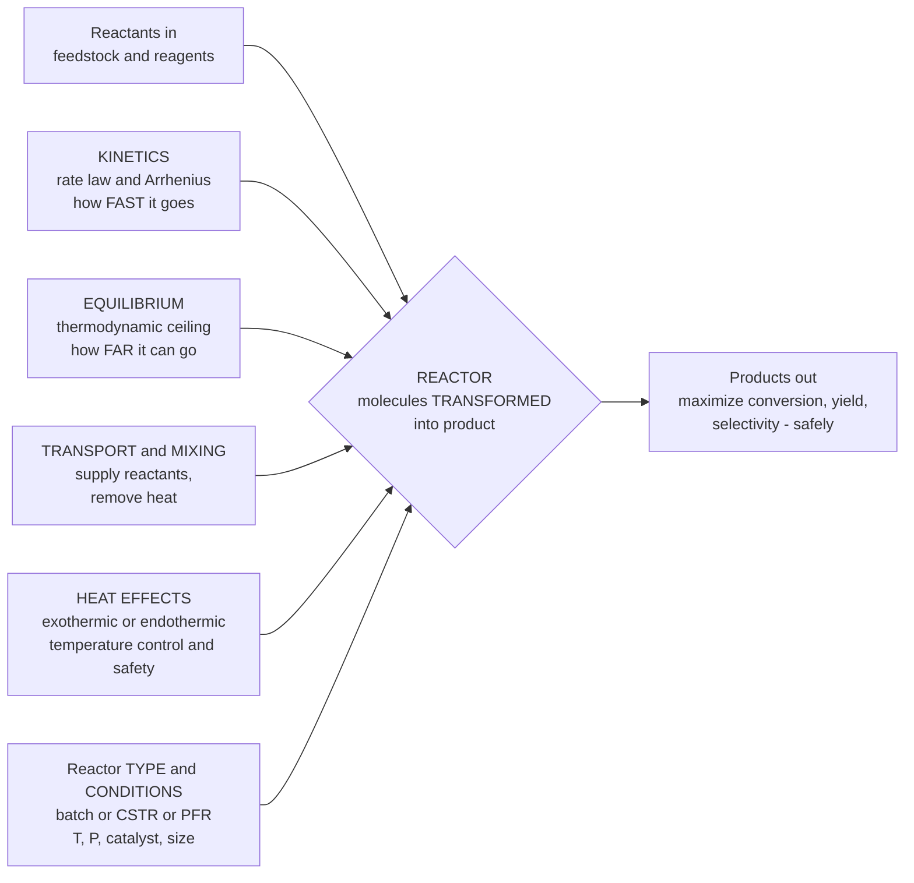

# ⚗️ Chemical Reaction Engineering Overview

> [!abstract] TL;DR
> **Chemical reaction engineering (CRE)** is the discipline that designs the **reactor** — the one vessel in a chemical plant where feedstock is actually *transformed* into the product being sold; everything else (pumps, heat exchangers, distillation columns) merely feeds it or cleans up after it. CRE answers three questions *simultaneously*: **how fast** the reaction goes (**kinetics** — the rate law and its Arrhenius temperature dependence), **how far** it can possibly go (**equilibrium** — the thermodynamic ceiling), and **how to arrange the vessel** — a batch pot, a flowing tube, or a stirred tank — to get the most product, purest, cheapest, and safest. It fuses four things into a design: **kinetics** (rate), **thermodynamics** (equilibrium and heat of reaction), **transport** (delivering reactants and removing heat), and **reactor geometry** (type, size, temperature, pressure, catalyst). The deliverables are the numbers a plant lives on — the **rate** $-r_A$, the **conversion** $X$, and the **yield and selectivity** that matter the moment side reactions compete — linked to reactor size through **design equations**. The three ideal building blocks are the **batch** reactor (charge, react, empty — flexible, small-scale, pharma), the **CSTR** (continuous stirred tank — well mixed, uniform, easy temperature control), and the **PFR** (plug-flow tube — no back-mixing, usually the most efficient per unit volume). Because the reactor sets *what* a plant makes, *how much*, and *at what cost*, CRE is the transformative core of chemical engineering — underpinning petrochemicals, pharmaceuticals, polymers, and fuels, and driving emerging fields like batteries, biofuels, and CO$_2$ conversion.

## Intuition

**Analogy:** A chemical plant is a body, and the **reactor is its heart** — the one organ where the raw material genuinely *becomes* something new. Feed lines are the arteries bringing raw blood in; separation columns and recycle loops are the veins and kidneys that purify and return what wasn't used. But the transformation itself — molecules broken apart and reassembled into the product on the invoice — happens *only* in the reactor. Reaction engineering is the art of designing that heart: choosing how big it is, how hot it runs, how fast blood flows through it, and how to keep it from going into fibrillation (a runaway).

To design that heart you must hold three questions in your head at once. **How fast** does the reaction beat — its *kinetics*, the rate at which molecules actually react, doubling roughly every ten degrees you heat it. **How far** can it possibly go — its *equilibrium*, the hard ceiling thermodynamics places on conversion no matter how long you wait. And **what shape** is the chamber — do you fill a pot, let it react, and empty it (**batch**); pour reactants continuously into a well-stirred tank and skim product off the overflow (**CSTR**); or push everything down a long pipe so it reacts as it flows (**PFR**)? This is exactly where chemistry's *"what reacts"* meets engineering's *"now make a ton of it every hour, at the lowest cost, without blowing up."*

---

## How It Works

### Core Mechanics

1. **The reactor is the transformation step; everything reduces to a mole balance on it.** Every reactor design begins with the general **mole balance** on a reacting species $A$ over the vessel:
   $$\underbrace{F_{A0}}_{\text{in}} - \underbrace{F_A}_{\text{out}} + \underbrace{\int_V r_A\,dV}_{\text{generation}} = \underbrace{\frac{dN_A}{dt}}_{\text{accumulation}}.$$
   Specializing this one equation to different idealizations of *mixing* and *flow* gives the design equation for each reactor type. Everything else is choosing constants.

2. **Kinetics sets the rate — how fast.** The **rate of reaction** $-r_A$ (moles of $A$ consumed per unit volume per unit time) is given by a **rate law**, typically a power law $-r_A = k\,C_A^{\,n}$ of order $n$, with the rate constant obeying the **Arrhenius** temperature dependence $k = A\,e^{-E_a/RT}$. Rate is what a bigger or hotter reactor buys you — but only up to the ceiling set by equilibrium.

3. **Thermodynamics sets the ceiling — how far.** No reactor, however large, can push conversion past the **equilibrium** limit set by $\Delta G^{\circ} = -RT\ln K$. For reversible reactions the *net* rate falls to zero at equilibrium, so kinetics and equilibrium together — not kinetics alone — fix the achievable conversion. (This is developed in the section note on chemical reaction equilibrium.)

4. **Transport and heat effects decide whether the ideal is realized.** Reactants must physically *reach* each other (mixing, diffusion to a catalyst surface) and the **heat of reaction** must be managed: an **exothermic** reaction releases heat that, if not removed fast enough, raises $T$, which by Arrhenius raises the rate, which releases *more* heat — the positive-feedback loop that becomes a **thermal runaway**. Reactor design is therefore also *heat-exchange and safety* design.

5. **The three key performance numbers.** From the outlet the engineer reads:
   - **Conversion** $X_A = (F_{A0} - F_A)/F_{A0}$ — the fraction of reactant consumed.
   - **Yield** — desired product formed relative to the maximum possible from the reactant fed.
   - **Selectivity** — desired product formed relative to *undesired* byproduct, the decisive number whenever side reactions compete (high conversion with poor selectivity can be worthless).

6. **The ideal reactor toolkit and its design equations** (isothermal, single reaction):
   - **Batch** — no flow in or out; composition changes with *time*. $\;t = N_{A0}\!\int_0^{X}\! \dfrac{dX}{(-r_A)\,V}$. Flexible, ideal for small volumes, expensive specialty chemicals, and pharmaceuticals.
   - **CSTR** (continuous stirred-tank) — perfectly mixed, so the whole vessel sits at the *outlet* composition. $\;V = \dfrac{F_{A0}\,X}{(-r_A)_{\text{exit}}}$. Uniform conditions, easy temperature control, but operates at the *lowest* rate (exit concentration), so it needs the *largest* volume.
   - **PFR** (plug-flow tubular) — no axial back-mixing; concentration falls smoothly along the tube like a batch reactor in space. $\;V = F_{A0}\!\int_0^{X}\! \dfrac{dX}{-r_A}$. Usually the most volume-efficient for normal kinetics.
   The **space time** $\tau = V/v_0$ (reactor volume per volumetric feed rate) is the master sizing variable; grouped with kinetics it forms the dimensionless **Damköhler number** $\mathrm{Da} = k\,C_{A0}^{\,n-1}\,\tau$ = (reaction rate) / (convective feed rate), which sets conversion.

### Flow / Architecture



---

## Key Concepts

### Secondary Level

- **The reactor is where the product is made.** In the whole plant, only the reactor turns cheap feedstock into the valuable product on the invoice — every other unit just prepares the feed or purifies the output. Reaction engineering designs that one critical vessel.
- **Three questions at once.** *How fast* (kinetics), *how far* (equilibrium), and *what shape of vessel* (reactor type). A good design answers all three together, because a fast reaction in the wrong reactor still wastes money.
- **Conversion is the headline number.** Conversion is simply the fraction of the reactant that got used up. Higher conversion means less wasted feedstock — but pushing it too far can cost far more reactor than it is worth.
- **Three basic reactor shapes.** A **batch** pot (fill it, let it react, empty it), a **stirred tank** with continuous flow (**CSTR**), and a **long tube** reactants flow through (**PFR**). Each wins in different situations.

### Undergraduate Level

- **The general mole balance is the parent equation.** $F_{A0} - F_A + \int_V r_A\,dV = dN_A/dt$. Batch (no flow), CSTR (well mixed, uniform), and PFR (no back-mixing) are just three simplifications of this one balance.
- **Rate law and Arrhenius.** $-r_A = k\,C_A^{\,n}$ with $k = A\,e^{-E_a/RT}$. A rough rule of thumb: rate roughly doubles per $10\,^{\circ}$C rise. Temperature is the most powerful lever an engineer has — and the most dangerous.
- **CSTR vs PFR sizing (the Levenspiel view).** Plot $F_{A0}/(-r_A)$ against conversion $X$. The **PFR volume is the area under the curve** from $0$ to $X$; the **CSTR volume is the rectangle** of height $F_{A0}/(-r_A)$ evaluated *at the exit* times width $X$. For a normal reaction whose rate falls as reactant is consumed, the rectangle exceeds the area — **the PFR needs less volume for the same conversion**.
- **Space time and Damköhler number.** Space time $\tau = V/v_0$ is residence-time-like sizing; the **Damköhler number** $\mathrm{Da} = k\,C_{A0}^{\,n-1}\tau$ compares reaction rate to feed rate. Small $\mathrm{Da}$ (fast flow / slow reaction) gives low conversion; large $\mathrm{Da}$ gives high conversion. For a first-order reaction: PFR gives $X = 1 - e^{-\mathrm{Da}}$, CSTR gives $X = \mathrm{Da}/(1+\mathrm{Da})$ — the PFR always wins.
- **Yield and selectivity govern multi-reaction systems.** When a desired reaction competes with side reactions, you optimize **selectivity**, not just conversion. Reactor type, temperature, and concentration profile are tuned to *steer* the chemistry toward the wanted product (e.g. a PFR's high concentrations favor some pathways, a CSTR's low uniform concentration favors others).
- **Heat management is part of the design.** The energy balance couples to the mole balance through the heat of reaction. Adiabatic, isothermal (cooled/heated), and non-isothermal operation each demand different reactor and heat-exchange choices.

### Graduate Level

- **Non-ideal reactors and residence-time distribution (RTD).** Real vessels are neither perfectly mixed nor perfectly plug-flow; **RTD** analysis (pulse/step tracer tests giving $E(t)$ and $F(t)$) quantifies channeling, dead zones, and bypassing, and models like **tanks-in-series** or **dispersion** interpolate between the CSTR and PFR ideals to predict real conversion.
- **Multiple reactions, yield optimization, and reactor networks.** With parallel and series reactions the objective becomes maximizing selectivity: the analysis of instantaneous vs overall selectivity dictates *concentration and temperature profiles*, motivating reactor networks (PFR–CSTR combinations, side-stream feeds, membrane reactors) that no single ideal reactor achieves.
- **Non-isothermal design, multiplicity, and stability.** Coupling the energy balance to the mole balance yields the CSTR heat-generation vs heat-removal curves whose intersections give **multiple steady states**; stability analysis identifies the ignition/extinction points and the runaway boundary — the mathematics of **thermal runaway** as a positive-feedback instability (see [[Nonlinearity_and_Feedback]]).
- **Heterogeneous catalysis and transport limitations.** Most industrial reactors are catalytic. The observed rate can be masked by external film diffusion and internal pore diffusion (the **effectiveness factor** $\eta$ and **Thiele modulus** $\phi$); packed-bed and fluidized-bed design must reconcile intrinsic kinetics with these transport resistances, plus catalyst deactivation over time.
- **The reactor within the process.** A reactor rarely reaches full conversion economically, so the standard architecture is **reactor + separator + recycle of unreacted feed**. Reaction engineering is optimized *jointly* with separation and recycle, since a smaller reactor (lower per-pass conversion) may be cheaper overall if separation and recycle are inexpensive.

---

## Python Demo

```python
# Chemical Reaction Engineering: how REACTOR CHOICE and KINETICS set performance.
#
#   (a) CSTR vs PFR SIZING (the Levenspiel-plot area interpretation)
#       For a liquid-phase 2nd-order reaction  A -> products,  -r_A = k C_A^2,
#       the DIMENSIONLESS reactor size needed for a target conversion X is
#         PFR :  Da = k C_A0 tau = integral_0^X dX/(1-X)^2 = X/(1-X)
#         CSTR:  Da = k C_A0 tau =  X / (1-X)^2      (rate frozen at the EXIT)
#       The CSTR "rectangle" always exceeds the PFR "area under the curve",
#       so a PFR needs LESS volume for the same conversion -- dramatically so
#       as X -> 1.
#
#   (b) CONVERSION vs RESIDENCE TIME (Damkohler number)
#       Inverting the design equations shows how kinetics + reactor choice
#       set conversion. Shown for 1st- and 2nd-order reactions.
#
# Requires: numpy, matplotlib   (no scipy)
import numpy as np
import matplotlib.pyplot as plt

# ---------------------------------------------------------------
# (a) Required dimensionless size  Da = k*C_A0^(n-1)*tau  vs conversion
#     (2nd-order reaction, constant density)
# ---------------------------------------------------------------
X = np.linspace(0.0, 0.95, 300)          # fractional conversion
Da_PFR_2  = X / (1.0 - X)                 # PFR : area under the Levenspiel curve
Da_CSTR_2 = X / (1.0 - X)**2             # CSTR: rectangle at the exit rate
ratio     = Da_CSTR_2 / Da_PFR_2          # = 1/(1-X): CSTR/PFR volume penalty

for Xt in (0.5, 0.8, 0.9):
    i = int(np.argmin(np.abs(X - Xt)))
    print(f"X = {Xt:.2f} :  PFR size Da = {Da_PFR_2[i]:5.2f},  "
          f"CSTR size Da = {Da_CSTR_2[i]:6.2f},  "
          f"CSTR needs {ratio[i]:.1f}x the PFR volume")

# ---------------------------------------------------------------
# (b) Conversion vs residence time (Damkohler) -- parametric in X
#     1st order:  PFR  X = 1 - exp(-Da) ;  CSTR  X = Da/(1+Da)
#     2nd order:  invert the design equations above (Da as function of X)
# ---------------------------------------------------------------
Da_axis   = np.linspace(0.0, 12.0, 400)   # Damkohler number = k*C_A0^(n-1)*tau
X_PFR_1   = 1.0 - np.exp(-Da_axis)                    # 1st-order PFR
X_CSTR_1  = Da_axis / (1.0 + Da_axis)                 # 1st-order CSTR
X_PFR_2   = Da_axis / (1.0 + Da_axis)                 # 2nd-order PFR: Da=X/(1-X)
# 2nd-order CSTR: Da = X/(1-X)^2  ->  Da X^2 - (2 Da + 1) X + Da = 0
with np.errstate(divide="ignore", invalid="ignore"):
    X_CSTR_2 = np.where(
        Da_axis > 0,
        (2.0 * Da_axis + 1.0 - np.sqrt(4.0 * Da_axis + 1.0)) / (2.0 * Da_axis),
        0.0)

# ---------------------------------------------------------------
# PLOTS
# ---------------------------------------------------------------
fig, (axL, axR) = plt.subplots(1, 2, figsize=(14, 6))
fig.suptitle("Reaction Engineering: reactor type and kinetics set performance",
             fontsize=13, fontweight="bold")

# LEFT: Levenspiel-style size vs conversion (2nd order)
axL.plot(X, Da_PFR_2,  color="#2a9d8f", lw=2.5, label="PFR  (area under curve)")
axL.plot(X, Da_CSTR_2, color="#d62728", lw=2.5, label="CSTR (rectangle at exit)")
axL.fill_between(X, Da_PFR_2, Da_CSTR_2, color="#e76f51", alpha=0.18,
                 label="extra volume a CSTR wastes")
axL.set_xlabel("conversion  X")
axL.set_ylabel(r"required size  Da = $k\,C_{A0}\,\tau$")
axL.set_title("(a) CSTR vs PFR volume for the same conversion (2nd order)",
              fontsize=11)
axL.set_ylim(0, 20)
axL.legend(loc="upper left", fontsize=9)
axL.grid(alpha=0.3)

# RIGHT: conversion vs Damkohler (residence time)
axR.plot(Da_axis, X_PFR_1,  color="#2a9d8f", lw=2.4, label="PFR,  1st order")
axR.plot(Da_axis, X_CSTR_1, color="#2a9d8f", lw=2.0, ls="--",
         label="CSTR, 1st order")
axR.plot(Da_axis, X_PFR_2,  color="#8338ec", lw=2.4, label="PFR,  2nd order")
axR.plot(Da_axis, X_CSTR_2, color="#8338ec", lw=2.0, ls="--",
         label="CSTR, 2nd order")
axR.set_xlabel(r"Damkohler number  Da = $k\,C_{A0}^{\,n-1}\,\tau$   (residence time)")
axR.set_ylabel("conversion  X")
axR.set_title("(b) Conversion vs residence time: kinetics + reactor choice",
              fontsize=11)
axR.set_ylim(0, 1)
axR.legend(loc="lower right", fontsize=9)
axR.grid(alpha=0.3)

plt.tight_layout(rect=[0, 0, 1, 0.95])
plt.show()
```

Running this prints the sizing comparison and draws two panels. The **left panel** is the Levenspiel story for a second-order reaction: the green **PFR** curve is the *area under* the $F_{A0}/(-r_A)$ curve, while the red **CSTR** curve is the *rectangle* evaluated at the (slower) exit rate — and the orange band between them is pure wasted volume. At 50% conversion the CSTR needs twice the PFR volume; at 90% it needs *ten times* as much, because the CSTR runs the whole tank at the sluggish exit concentration. The **right panel** shows conversion climbing with residence time (Damköhler number): for every kinetic order the **PFR (solid) beats the CSTR (dashed)** at the same $\mathrm{Da}$, and the second-order curves (purple) rise more slowly than first-order (green) — a vivid reminder that *both* the chemistry (rate law) and the vessel choice determine how big and how hot your reactor must be.

---

## Real-World Applications

> **Example — the Haber-Bosch ammonia reactor.** Ammonia synthesis ($\text{N}_2 + 3\text{H}_2 \rightleftharpoons 2\text{NH}_3$) is reaction engineering in its purest form and feeds roughly half the planet. Every lever in this note appears at once: the reaction is **equilibrium-limited** (exothermic and mole-reducing, so favored by high pressure ~150–300 bar and *low* temperature), yet the **kinetics** are hopelessly slow when cold — so an **iron catalyst** and ~400–500 °C are used, deliberately trading some equilibrium ceiling for usable rate. Because per-pass conversion is only ~15–20% (that equilibrium ceiling), the plant is built as **reactor + separation + recycle**: unreacted N$_2$/H$_2$ is condensed away from the product and looped back. The reactor bed is staged with inter-cooling to manage the **exothermic heat of reaction** and keep each stage near its optimal temperature — a textbook coupling of kinetics, equilibrium, catalysis, heat management, and recycle.

- **Petrochemical cracking and reforming (fluidized and packed beds).** Catalytic cracking (FCC) and catalytic reforming size enormous **fluidized-bed** and packed-bed reactors around intrinsic kinetics *and* transport limitations and catalyst deactivation — the industrial heart of fuels and olefins production.
- **Polymerization reactors.** Polymer plants choose **batch, CSTR, or tubular (PFR)** reactors specifically to control the *molecular-weight distribution*, since residence-time distribution directly shapes product properties — a case where RTD is a product-quality knob, not just an efficiency one.
- **Pharmaceutical and fine-chemical batch reactors.** High-value, low-volume specialty and pharmaceutical synthesis overwhelmingly uses **batch** reactors for flexibility across many products and campaigns, with careful thermal-runaway safety analysis for reactive intermediates.
- **Automotive catalytic converters (monolith PFR).** The three-way catalyst is effectively a **plug-flow catalytic reactor** in the exhaust stream, converting CO, NO$_x$, and unburned hydrocarbons — reaction engineering applied to emissions at the tailpipe.
- **Emerging: CO$_2$ conversion, electrochemical, and bioreactors.** Electrolyzers, fermentation bioreactors, and CO$_2$-to-fuels reactors are all designed with the same CRE framework (rate, equilibrium, transport, reactor type), extending the discipline into decarbonization and biomanufacturing.

---

## Common Pitfalls

- **Confusing "how fast" with "how far."** Kinetics (rate) and thermodynamics (equilibrium) are independent questions. A reaction can be thermodynamically favorable yet immeasurably slow (needs a catalyst), or fast yet capped at low conversion by equilibrium. Sizing a reactor from a rate law while ignoring the equilibrium ceiling gives a design that can never reach the target conversion, no matter how large.
- **Optimizing conversion while ignoring selectivity.** With competing side reactions, maximizing conversion can *destroy* value — you convert the reactant into byproduct. Yield and selectivity, not conversion alone, are the economic targets whenever multiple reactions occur.
- **Assuming reactors are ideal.** Real vessels channel, bypass, and form dead zones. Using the ideal PFR or CSTR design equation for a poorly mixed reactor over-predicts conversion; a **residence-time-distribution** check is essential before trusting the ideal model.
- **Underestimating thermal runaway.** For exothermic reactions, the Arrhenius feedback — more heat raises $T$, higher $T$ raises rate, higher rate makes more heat — can trigger a runaway. Sizing cooling for the *average* rather than the *worst-case* heat-generation curve is a classic and dangerous error; multiplicity and stability analysis is not optional for exothermic systems.
- **Sizing the reactor in isolation from separation and recycle.** The cheapest overall process often uses a *smaller* reactor at low per-pass conversion with recycle, not a huge reactor chasing high conversion. Optimizing the reactor alone, divorced from separation cost, gives the wrong plant.
- **Forgetting transport limitations in catalytic reactors.** When pore or film diffusion is slow, the *observed* rate is far below the intrinsic kinetic rate (effectiveness factor $\eta < 1$). Designing a catalytic bed from intrinsic kinetics without checking the Thiele modulus badly oversizes or undersizes the reactor.

---

## Related Concepts

**Section 04 foundations (existing vault notes this overview builds on)**
- [[Reactive_Systems_and_Combustion_Balances]] — the extent-of-reaction, conversion, yield, and selectivity bookkeeping that the reactor design equations are built on
- [[Material_and_Mass_Balances]] — the general mole balance that, specialized to different mixing/flow idealizations, *becomes* the batch, CSTR, and PFR design equations
- [[Energy_Balances_in_Processes]] — the energy accounting that couples to the mole balance via the heat of reaction, governing non-isothermal design and runaway
- [[Chemical_Process_Thermodynamics]] — supplies the reaction-equilibrium ceiling ($\Delta G^{\circ} = -RT\ln K$) and the heat of reaction that reaction engineering must respect
- [[Chemical_Engineering_Overview]] — the discipline-level parent note; CRE is the transformative core it introduces

**Chemistry vault — the science underneath**
- [[Chemical_Kinetics]] — rate laws, reaction order, and the Arrhenius temperature dependence that fix the rate $-r_A$
- [[Chemical_Equilibrium]] — the equilibrium constant $K$ and $\Delta G$ that cap how far any reactor can push conversion
- [[Chemical_Thermodynamics]] — heat of reaction and spontaneity, the feasibility and energy backbone of reactor design

**Physics and mechanical-engineering vaults — the energy laws**
- [[Laws_of_Thermodynamics]] — the first and second laws that every reactor energy balance and equilibrium limit rest on
- [[Engineering_Thermodynamics]] — the mechanical-engineering companion for heat-of-reaction management, cooling, and heat integration

**Systems-thinking bridge**
- [[Nonlinearity_and_Feedback]] — thermal runaway is exactly a positive-feedback instability; the multiplicity and stability of exothermic reactors is a nonlinear-dynamics phenomenon

*Section siblings (developed in the notes that follow this opener): **Reaction Kinetics and Rate Laws** derives the rate expressions and Arrhenius behavior in depth; **Ideal Reactors: Batch, CSTR, and PFR** works the design equations and Levenspiel plots fully; **Non-Ideal Reactors and RTD** treats real mixing, tracer tests, and dispersion; **Catalysis and Heterogeneous Reactions** adds catalytic rate laws, effectiveness factors, and packed/fluidized beds; and **Chemical Reaction Equilibrium** develops the thermodynamic conversion ceiling that reaction engineering operates beneath.*

---

## Review Questions

**Secondary**
1. In a chemical plant with pumps, heat exchangers, a reactor, and distillation columns, which single unit actually *creates* the product being sold, and what does that imply about why reaction engineering is called the "core" of chemical engineering? Explain the three questions a reactor designer must answer at once.

**Undergraduate**
2. A liquid-phase second-order reaction $A \rightarrow$ products must reach 90% conversion. (a) Using the design equations, show that the required dimensionless size $\mathrm{Da} = k\,C_{A0}\,\tau$ is $X/(1-X)$ for a PFR and $X/(1-X)^2$ for a CSTR, and compute both at $X = 0.9$. (b) By what factor is the CSTR larger, and *why physically* does the well-mixed tank need so much more volume than the tube at high conversion? (c) Sketch the Levenspiel plot and identify which region is the "wasted" CSTR volume.

**Graduate**
3. An exothermic reaction is to be run continuously to high conversion. (a) Explain, using the Arrhenius law and the heat/mole-balance coupling, how a **thermal runaway** arises as a positive-feedback loop and how it appears as multiple steady states on the CSTR heat-generation vs heat-removal diagram. (b) Discuss two reactor-engineering strategies (choice of reactor type, staging/inter-cooling, dilution, temperature profile) that mitigate runaway *without* sacrificing the equilibrium-limited conversion. (c) Given that per-pass conversion is limited by equilibrium, argue why the reactor should be optimized *jointly* with the separation and recycle system rather than sized alone for maximum conversion.

---

## Sources

- Fogler, H. S. — *Elements of Chemical Reaction Engineering*, 6th ed. (Pearson/Prentice Hall). [Publisher page](https://www.pearson.com/en-us/subject-catalog/p/elements-of-chemical-reaction-engineering/P200000003449)
- Levenspiel, O. — *Chemical Reaction Engineering*, 3rd ed. (Wiley). [Publisher page](https://www.wiley.com/en-us/Chemical+Reaction+Engineering%2C+3rd+Edition-p-9780471254249)
- Froment, G. F., Bischoff, K. B., & De Wilde, J. — *Chemical Reactor Analysis and Design*, 3rd ed. (Wiley). [Publisher page](https://www.wiley.com/en-us/Chemical+Reactor+Analysis+and+Design%2C+3rd+Edition-p-9780470565414)
- Davis, M. E., & Davis, R. J. — *Fundamentals of Chemical Reaction Engineering* (McGraw-Hill / Dover reprint). [Caltech open access](https://authors.library.caltech.edu/records/mr885-e6817)
- Rawlings, J. B., & Ekerdt, J. G. — *Chemical Reactor Analysis and Design Fundamentals*, 2nd ed. (Nob Hill). [Book page](https://www.nobhillpublishing.com/rawlings-ekerdt-2nd/)

---

#chemical-engineering #reaction-engineering #reactor-design #conversion #CSTR-PFR
