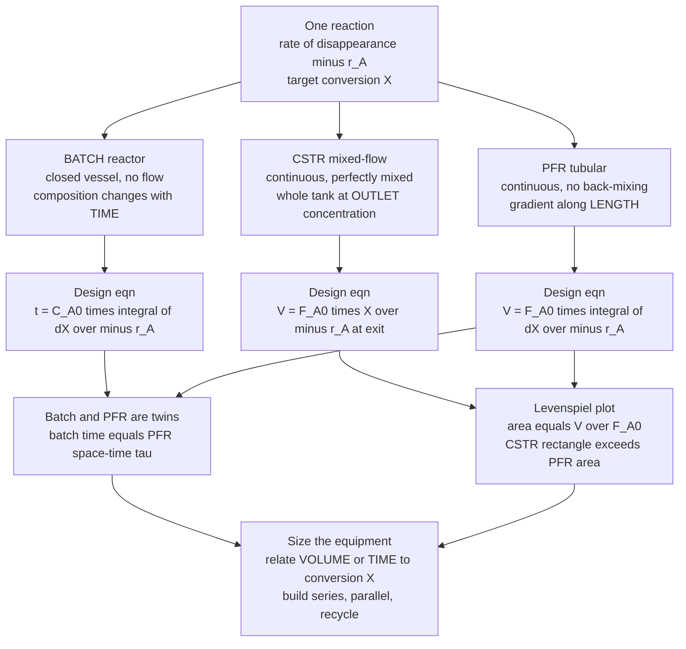

# ⚗️ Ideal Reactors: Batch, CSTR, and PFR

> [!abstract] TL;DR
> There are exactly **three idealized ways** to run a chemical reaction, and every real reactor is analyzed as one of them or built from them. A **batch reactor** is a closed pot: charge everything, let it cook, and composition changes with **time** — its design equation is $t = C_{A0}\!\int_0^X \! dX/(-r_A)$. A **CSTR** (continuous stirred-tank, or *mixed-flow*) runs steadily and is **perfectly mixed**, so the entire vessel sits at the *low outlet* concentration; that makes the rate slow and the design equation a single algebraic step, $V = F_{A0}\,X/(-r_A)$ evaluated at the exit. A **PFR** (plug-flow tube) runs steadily with **no back-mixing**, so concentration stays high early and falls smoothly along the length, $V = F_{A0}\!\int_0^X \! dX/(-r_A)$ — making it the *mathematical twin of the batch reactor* (space-time equals batch time) and usually the **most volume-efficient**. The **Levenspiel plot** (graphing $1/(-r_A)$ versus conversion $X$, where area equals $V/F_{A0}$) makes the punchline visual: for ordinary positive-order kinetics the CSTR's *rectangle* always exceeds the PFR's *area*, so a CSTR needs more volume — while a chain of CSTRs in series marches back toward PFR behavior. These three design equations, plus space-time $\tau = V/v_0$, the series/recycle configurations, and the isothermal-versus-adiabatic energy balance, are the quantitative toolkit that turns **kinetics into equipment**.

## Intuition

**Analogy:** There are three fundamentally different ways to run a reaction, and **cooking** makes all three click before any equation. A **batch reactor is a pot of stew**: you throw everything in, let it simmer, and serve when it is done. Nothing flows in or out while it cooks; the flavor develops purely with *time*. It is wonderfully flexible — perfect for small, varied jobs like a pharmacy compounding one drug today and another tomorrow — but between batches you must fill, heat, empty, and clean, so the stove sits idle a lot.

A **CSTR is a fondue pot kept permanently full and constantly stirred**: cheese and wine trickle in on one side, melted fondue trickles out the other, and a paddle keeps the inside perfectly uniform. Because it is so well mixed, the *instant* fresh reactant drops in, it is diluted into the pot's already-reacted, low-concentration contents. Reaction rate depends on concentration — so the whole pot runs at that sluggish *final* concentration. Easy to control, easy to keep at a steady temperature, but the reaction crawls, so you need a **big** pot.

A **PFR is a sushi conveyor belt**: reactants board single-file at one end and ride down a pipe, reacting steadily as they travel, never sliding backward to mix with fresh arrivals. Right after boarding, the concentration is *high*, so the reaction is *fast*; it slows gracefully toward the exit as reactant is consumed. Because it never dilutes the fresh feed, a PFR usually does the same job in the **least volume** — it is the efficient one. Same reaction, same chemistry, three very different vessels: the pot, the fondue, and the conveyor belt.

---

## How It Works

### Core Mechanics

Everything starts from a mole balance on reactant $A$ over a control volume: **in − out + generation = accumulation**, where the generation term is the reaction rate $r_A$ (negative for a species being consumed, so $-r_A > 0$ is the rate of disappearance). Which terms survive defines the reactor.

1. **Conversion is the common currency.** Define **conversion** $X = (N_{A0}-N_A)/N_{A0}$ (batch) or $(F_{A0}-F_A)/F_{A0}$ (flow) — the fraction of $A$ consumed. Every design equation below relates the reactor's **size or time** to a target $X$, given the kinetics $-r_A(C_A,T)$.

2. **BATCH — no flow, everything changes with time.** With no streams in or out, the balance is pure accumulation equals generation: $dN_A/dt = r_A V$. For a constant-volume (liquid) batch this simplifies to $-dC_A/dt = -r_A$, and integrating gives the **batch time** to reach conversion $X$:
   $$t = N_{A0}\int_0^{X}\frac{dX}{-r_A\,V} \;\;\xrightarrow{\;V=\text{const}\;}\;\; t = C_{A0}\int_0^{X}\frac{dX}{-r_A}.$$
   Time, not volume, is the design variable. Flexible and low-capital, but each cycle carries dead time for charging, heating, discharging, and cleaning.

3. **CSTR — continuous, perfectly mixed, sits at the exit.** At steady state accumulation is zero, and *perfect mixing* means the entire tank is at the **outlet** composition. The balance $F_{A0}-F_A + r_A V = 0$ rearranges to a single **algebraic** design equation:
   $$V = \frac{F_{A0}\,X}{-r_A}\Bigg|_{\text{exit conditions}}.$$
   The rate $-r_A$ is evaluated at the *low* exit concentration — the reason a CSTR is inefficient. No integral, no profile: one steady operating point. Its saving grace is superb temperature control (a big, stirred, jacketed tank) and the ability to run indefinitely.

4. **PFR — continuous, no back-mixing, a gradient down the tube.** Model the tube as a train of thin slices, each a tiny batch riding along. A steady-state balance on a differential slice gives $F_{A0}\,dX = -r_A\,dV$, which integrates to:
   $$V = F_{A0}\int_0^{X}\frac{dX}{-r_A}.$$
   Because $-r_A$ starts high (fresh feed) and falls along the length, the PFR does the job in less volume than the CSTR. Compare the batch and PFR forms: they are **identical** once you set batch time $t$ against PFR **space-time** $\tau = V/v_0$. The PFR is the batch reactor unrolled in space.

5. **Space-time, space velocity, and residence.** **Space-time** $\tau = V/v_0$ (reactor volume divided by inlet volumetric flow) is the time to process one reactor-volume of feed; **space velocity** is its reciprocal, $\text{SV}=v_0/V$. For constant density $\tau$ equals the mean residence time; when the volumetric flow changes (gas-phase reactions with a mole-count change, captured by the expansion factor $\varepsilon$), $\tau$ and true residence time diverge.

6. **The Levenspiel plot — reactor selection made visual.** Plot $1/(-r_A)$ against $X$. Then **PFR volume is the area under the curve** ($V/F_{A0}=\int dX/(-r_A)$), while **CSTR volume is the rectangle** of height $1/(-r_A)|_{\text{exit}}$ and width $X$. For any normal positive-order reaction $1/(-r_A)$ *rises* with $X$ (rate falls as reactant depletes), so the rectangle always overtops the area: **$V_{CSTR} > V_{PFR}$** for the same duty. The exception is **autocatalytic** kinetics, where the rate is low at the start, peaks in the middle, and a CSTR (or a CSTR-then-PFR combination) can win.

7. **Building real systems — series, parallel, recycle.** A cascade of **CSTRs in series** climbs the Levenspiel curve in steps; as the number of tanks grows, the staircase of rectangles converges on the smooth PFR area — infinitely many infinitesimal CSTRs *are* a PFR. **Recycle** around a PFR makes it behave partway toward a CSTR (and is essential for autocatalytic or highly exothermic reactions). These combinations, not the pure ideals, are what most plants actually run.

8. **Isothermal versus non-isothermal.** The design equations above are complete only when the reactor is **isothermal** ($-r_A$ is then a fixed function of $X$). Once heat of reaction matters, an **energy balance** couples $T$ to $X$: an **adiabatic** reactor rides a heat-driven temperature trajectory that changes the rate as it goes, and a **cooled/heated** reactor adds a duty term. For exothermic CSTRs this coupling can produce **multiple steady states** (ignition/extinction) — the same S-curve behavior studied in reactor control.

### Flow / Architecture



---

## Key Concepts

### Secondary Level

- **Three ways to run a reaction.** *Batch* is a pot of stew — fill it, cook it, empty it. *Continuous* reactors never stop: reactants flow in and product flows out all day long. The two continuous kinds are the **stirred tank (CSTR)** and the **tube (PFR)**.
- **Conversion** is simply *what fraction of the starting material got used up*. Reaching 90 % conversion means 90 % of the reactant turned into product. Higher conversion needs more time or a bigger reactor.
- **The stirred tank is uniform but slow.** Because a CSTR is mixed so thoroughly, everything inside is at the same (already-reacted, dilute) condition, and dilute mixtures react slowly — so a stirred tank has to be **big**.
- **The tube is efficient.** In a plug-flow tube the reactant is fresh and concentrated when it enters, so it reacts fast; the same job usually fits in a **smaller** tube than a stirred tank would need.
- **Batch is flexible, continuous is high-volume.** Make many different products in small amounts? Use batch. Make one product by the trainload? Use a continuous reactor that runs nonstop.

### Undergraduate Level

- **The three design equations.** Batch: $t = C_{A0}\int_0^X dX/(-r_A)$ (constant volume). CSTR: $V = F_{A0}X/(-r_A)$, evaluated at *exit* conditions. PFR: $V = F_{A0}\int_0^X dX/(-r_A)$. Each converts a kinetics expression $-r_A(X)$ plus a target $X$ into a size (or time).
- **Batch and PFR are mathematically identical.** The PFR integral and the batch integral are the same; set batch **time** equal to PFR **space-time** $\tau = V/v_0$. A PFR is a batch reactor laid out along a pipe. This is why lab batch kinetics transfer directly to PFR sizing.
- **Why the CSTR loses on volume.** Its rate is fixed at the *low* exit concentration, whereas the PFR enjoys high concentration over most of its length. On the **Levenspiel plot** ($1/(-r_A)$ vs $X$) the CSTR is a tall rectangle and the PFR is the smaller area beneath the curve; the ratio $V_{CSTR}/V_{PFR}$ grows as you push toward high conversion.
- **Space-time and space velocity.** $\tau = V/v_0$ has units of time and equals residence time at constant density; space velocity $v_0/V$ is throughput per unit volume. Both are the natural "how big / how fast" figures for continuous reactors.
- **First-order worked forms.** For $-r_A = kC_A$ with constant density: batch/PFR give $X = 1-e^{-k\tau}$ (equivalently $\tau_{PFR}=-\ln(1-X)/k$), while a CSTR gives $\tau_{CSTR}=X/[k(1-X)]$ — always larger, and blowing up faster as $X\to 1$.
- **Reactors in series.** $N$ equal CSTRs in series need total space-time $\tau = (N/k)[(1-X)^{-1/N}-1]$ for a first-order reaction; as $N\to\infty$ this collapses to the PFR value $-\ln(1-X)/k$. Staging tanks recovers most of the PFR's efficiency while keeping stirred-tank temperature control.

### Graduate Level

- **The Damköhler number.** $Da = k C_{A0}^{n-1}\tau$ (a dimensionless reaction-to-convection ratio) collapses reactor performance onto a single group: $Da \ll 1$ means kinetically limited (low conversion regardless of reactor type), $Da \gg 1$ means the reactor-type difference dominates. It is the right lens for scale-up and for comparing configurations.
- **Variable density (gas-phase) design.** When moles change, $v = v_0(1+\varepsilon X)$ with expansion factor $\varepsilon = y_{A0}\,\delta$; concentrations become $C_A = C_{A0}(1-X)/(1+\varepsilon X)$ and the integrals no longer have the clean constant-density forms. Space-time and residence time separate, and gas expansion can penalize conversion.
- **Non-isothermal coupling and multiple steady states.** The mole balance and an **energy balance** must be solved simultaneously; $-r_A$ carries an Arrhenius $T$-dependence. For an exothermic CSTR the heat-generation curve (S-shaped in $T$) can cross the heat-removal line at **three** points — two stable, one unstable — producing **ignition/extinction hysteresis**, a classic nonlinear-dynamics and control problem.
- **Adiabatic operating lines.** With no cooling, energy balance ties $T$ to $X$ linearly ($T = T_0 + (-\Delta H_{rxn})C_{A0}X/(\rho c_p)$); for reversible exothermic reactions this operating line intersects a falling equilibrium-conversion curve, motivating **staged adiabatic beds with inter-stage cooling** (ammonia, SO₃).
- **When the CSTR actually wins.** For **autocatalytic** kinetics (rate low at the start, e.g. many fermentations and some polymerizations), $1/(-r_A)$ has a minimum at intermediate $X$; a CSTR operated *at* that minimum, or a CSTR followed by a PFR, beats a lone PFR — the one systematic exception to "PFR is best."
- **Optimal reactor sequencing.** The Levenspiel construction generalizes to a rule: to minimize total volume, use a CSTR where $1/(-r_A)$ is falling and a PFR where it is rising, sizing each stage against the shape of the inverse-rate curve. This is the quantitative core of reactor-network synthesis (attainable-region theory).
- **RTD as the bridge to reality.** Real vessels are neither perfectly mixed nor perfectly plug; the **residence-time distribution** quantifies the departure, and the ideal CSTR/PFR are its two limiting cases (exponential vs Dirac-delta RTD) — the entry point to non-ideal reactor analysis.

---

## Python Demo

```python
# Ideal reactor DESIGN EQUATIONS for a first-order, constant-density liquid
# reaction  A -> products,  with  -rA = k * CA  and  CA = CA0 (1 - X).
#
#   (a) BATCH & PFR PROFILES : integrate the (identical) design equation and show
#       that BATCH TIME t  and  PFR SPACE-TIME tau  are the same number.
#   (b) LEVENSPIEL PLOT      : 1/(-rA) vs X, with PFR volume = AREA under curve and
#       CSTR volume = RECTANGLE (height at exit). Rectangle > area  ->  CSTR bigger.
#   (c) VOLUME vs CONVERSION : reactor volume required vs target X, CSTR vs PFR.
#   (d) CSTRs IN SERIES      : N equal tanks approach the PFR as N grows.
#
# Requires: numpy, matplotlib
import numpy as np
import matplotlib.pyplot as plt

k   = 0.30           # 1/min   rate constant
CA0 = 2.0            # mol/L   inlet / initial concentration of A
v0  = 5.0            # L/min   volumetric feed rate (flow reactors)
FA0 = CA0 * v0       # mol/min molar feed rate of A  = 10 mol/min

# ---------- (a) BATCH & PFR profile: integrate the design equation ----------
# Batch : dX/dt   = (-rA)/CA0 = k (1 - X)
# PFR   : dX/dtau = (-rA)/CA0 = k (1 - X)   <-- SAME ODE, tau replaces t
def dXd(X):
    return k * (1.0 - X)

tmax, n = 15.0, 300
t  = np.linspace(0.0, tmax, n)
dt = t[1] - t[0]
Xnum = np.zeros(n)
for i in range(1, n):                     # RK4 integration of the design equation
    x  = Xnum[i-1]
    a1 = dXd(x)
    a2 = dXd(x + 0.5*dt*a1)
    a3 = dXd(x + 0.5*dt*a2)
    a4 = dXd(x + dt*a3)
    Xnum[i] = x + (dt/6.0)*(a1 + 2*a2 + 2*a3 + a4)
Xexact = 1.0 - np.exp(-k * t)             # closed form for first order

print("=== (a) batch time  ==  PFR space-time  (same kinetics) ===")
for Xt in (0.5, 0.9, 0.99):
    tau = -np.log(1.0 - Xt) / k
    print(f"  X = {Xt*100:5.1f} %  ->  batch time = PFR space-time = {tau:6.2f} min")

# ---------- (b)+(c) Levenspiel / volume comparison  CSTR vs PFR ----------
X = np.linspace(0.0, 0.95, 400)
inv_rate = 1.0 / (k * CA0 * (1.0 - X))    # 1/(-rA)  [L.min/mol] = Levenspiel ordinate

# PFR volume = FA0 * cumulative area under 1/(-rA);  CSTR volume = FA0 * X * height(X)
area  = np.concatenate(([0.0],
        np.cumsum(0.5*(inv_rate[1:] + inv_rate[:-1]) * np.diff(X))))
V_PFR  = FA0 * area
V_CSTR = FA0 * X * inv_rate

print("\n=== (b/c) reactor VOLUME required (CSTR always >= PFR, positive order) ===")
for Xt in (0.5, 0.9, 0.95):
    j = int(np.argmin(np.abs(X - Xt)))
    print(f"  X = {Xt*100:4.0f} % :  V_PFR = {V_PFR[j]:6.1f} L ,"
          f"  V_CSTR = {V_CSTR[j]:6.1f} L ,  ratio = {V_CSTR[j]/V_PFR[j]:4.2f}")

# ---------- (d) N equal CSTRs in series approach the PFR ----------
Xf = 0.90
Ns = np.arange(1, 13)
tau_series = (Ns / k) * ((1.0 - Xf)**(-1.0/Ns) - 1.0)
tau_pfr    = -np.log(1.0 - Xf) / k        # limit N -> infinity
V_series   = tau_series * v0
V_pfr_lim  = tau_pfr * v0
print(f"\n=== (d) N equal CSTRs in series -> PFR   (target X = {int(Xf*100)} %) ===")
print(f"  1 tank : V = {V_series[0]:6.1f} L ;  12 tanks : V = {V_series[-1]:6.1f} L ;"
      f"  PFR limit : V = {V_pfr_lim:6.1f} L")

# ================================ plots ================================
fig, ax = plt.subplots(2, 2, figsize=(13, 9))
fig.suptitle("Ideal Reactors:  Batch / CSTR / PFR   (first-order  A -> products)",
             fontsize=14, fontweight="bold")

# A: batch & PFR conversion profile
axA = ax[0, 0]
axA.plot(t, Xexact*100, lw=3, color="#1f77b4", label="analytic  X = 1 - exp(-k t)")
axA.plot(t[::12], Xnum[::12]*100, "o", ms=6, color="#d62728",
         label="RK4 integration of design eqn")
axA.set_xlabel("batch time t   =   PFR space-time tau   [min]")
axA.set_ylabel("conversion  X   [%]")
axA.set_title("A. Batch profile == PFR profile\n(same kinetics: t and tau are twins)")
axA.legend(loc="lower right", fontsize=9); axA.grid(alpha=0.3); axA.set_ylim(0, 100)

# B: Levenspiel plot -- PFR area (fill) vs CSTR rectangle
axB = ax[1, 0]
Xstar = 0.90
js = int(np.argmin(np.abs(X - Xstar)))
axB.plot(X, inv_rate, lw=3, color="#2ca02c")
axB.fill_between(X[:js+1], inv_rate[:js+1], alpha=0.30, color="#2ca02c",
                 label="PFR volume = AREA under curve")
axB.add_patch(plt.Rectangle((0, 0), Xstar, inv_rate[js], fill=False,
              edgecolor="#d62728", lw=2.5, ls="--",
              label="CSTR volume = RECTANGLE (exit height)"))
axB.set_xlabel("conversion  X"); axB.set_ylabel("1 / (-rA)   [L.min/mol]")
axB.set_title("B. Levenspiel plot: why CSTR > PFR\n(rectangle at exit vs area under curve)")
axB.legend(loc="upper left", fontsize=8.5); axB.grid(alpha=0.3); axB.set_xlim(0, 0.95)

# C: required volume vs target conversion
axC = ax[0, 1]
axC.plot(X, V_PFR,  lw=3, color="#2ca02c", label="PFR")
axC.plot(X, V_CSTR, lw=3, color="#d62728", label="CSTR")
axC.set_xlabel("target conversion  X"); axC.set_ylabel("reactor volume required  [L]")
axC.set_title("C. Volume blows up near X = 1;\nCSTR always needs more (positive order)")
axC.legend(loc="upper left", fontsize=10); axC.grid(alpha=0.3)
axC.set_xlim(0, 0.95); axC.set_ylim(0, V_CSTR[int(np.argmin(np.abs(X-0.95)))])

# D: CSTRs in series approach PFR
axD = ax[1, 1]
axD.plot(Ns, V_series, "o-", lw=2.5, ms=7, color="#9467bd",
         label="N equal CSTRs in series")
axD.axhline(V_pfr_lim, ls="--", lw=2, color="#2ca02c", label="PFR limit (N -> infinity)")
axD.set_xlabel("number of tanks in series  N")
axD.set_ylabel(f"total volume for X = {int(Xf*100)} %   [L]")
axD.set_title("D. Many small CSTRs in series\nmarch back toward one PFR")
axD.legend(loc="upper right", fontsize=9); axD.grid(alpha=0.3)

plt.tight_layout(rect=[0, 0, 1, 0.95])
plt.show()
```

Running this prints the design tables and draws four panels. Panel **A** integrates the batch/PFR design equation by RK4 and overlays the closed form: the two coincide, and the x-axis label makes the key claim explicit — **batch time and PFR space-time are the same number** for identical kinetics (50 % conversion at ~2.3 min, 99 % at ~15.4 min). Panel **B** is the **Levenspiel plot**: the shaded area is the PFR volume, the dashed rectangle is the CSTR volume, and because $1/(-r_A)$ climbs with conversion the rectangle plainly overtops the area. Panel **C** turns that into engineering numbers — required volume versus target $X$ — and shows both curves blowing up as $X\to 1$ while the **CSTR sits well above the PFR** (about 4× the volume at 90 %). Panel **D** is the reconciliation: a single CSTR needs ~150 L, but chaining twelve small tanks in series drops the total to ~42 L, converging on the PFR's ~38 L — many little mixed tanks *become* a plug-flow tube.

---

## Real-World Applications

> **Example — the three archetypes on one plant map.** A pharmaceutical company making a low-volume active ingredient runs a **jacketed batch reactor**: one vessel, one recipe today and a different molecule next week, with full control over addition order and temperature ramps — flexibility beats efficiency when volumes are small and product changes often. Down the road, a petrochemical complex cracks ethane to ethylene in **fired tubular PFRs**: feed screams through long alloy coils in a furnace with residence times under a second, high concentration all the way, sized straight from the PFR integral. And a wastewater or continuous-polymerization plant leans on the **CSTR**: a huge stirred, temperature-controlled tank that runs at a steady state indefinitely, trading volume for rock-solid control and easy heat removal. Same three design equations, three completely different pieces of steel.

- **Batch — pharmaceuticals, specialty and fine chemicals, fermentation.** Small, high-value, multi-product campaigns where a single flexible vessel amortizes across many recipes. Antibiotics and beer are classic (fed-)batch fermentations; the design variable is *time*, and cycle economics hinge on minimizing charge/heat/discharge/clean downtime.
- **CSTR — polymerization, biological treatment, continuous fermentation.** The LDPE autoclave, activated-sludge aeration basins, and continuous bioreactors all exploit the CSTR's uniform environment and superb heat control. The low, uniform concentration that hurts rate is often a *feature*: it avoids hot spots and controls molecular-weight distribution.
- **PFR / packed-bed — steam cracking, catalytic synthesis, exhaust cleanup.** Ethylene furnaces, the ammonia and methanol converters (packed catalytic beds analyzed as near-PFR), and the automotive three-way catalytic converter all use plug-flow geometry to keep concentration high and squeeze conversion into minimal volume with tight residence-time control.
- **Reactors in series — staged conversion.** SO₃ (Contact process) and ammonia synthesis use **multiple adiabatic beds with inter-stage cooling**: each stage climbs toward the shifting equilibrium, then gas is cooled before the next — a physical embodiment of "CSTRs/PFRs in series" chasing a moving target to high overall conversion.
- **Recycle reactors — autocatalytic and highly exothermic duties.** Fermenters and some hydrogenations wrap a recycle loop around a plug-flow core so the reactor behaves partway toward a CSTR, seeding the inlet with product (essential when the rate is autocatalytic) or diluting a violent exotherm.

---

## Common Pitfalls

- **Evaluating the CSTR rate at inlet conditions.** The single most common error. A CSTR is at its *outlet* composition everywhere inside, so $-r_A$ in $V=F_{A0}X/(-r_A)$ must use the **exit** concentration ($C_A = C_{A0}(1-X)$), not the feed. Using the inlet rate wildly undersizes the tank.
- **Confusing space-time with residence time.** $\tau = V/v_0$ equals mean residence time *only at constant density*. For gas-phase reactions with a changing mole count, the volumetric flow $v = v_0(1+\varepsilon X)$ shifts, and the two quantities diverge — use the right one or your conversion prediction is off.
- **Assuming the PFR is always smaller.** True for ordinary positive-order kinetics, but **autocatalytic** reactions invert the Levenspiel curve (a minimum in $1/(-r_A)$ at intermediate $X$), and there a CSTR — or a CSTR-then-PFR combination — needs *less* volume. Check the shape of the inverse-rate curve before deciding.
- **Forgetting variable volumetric flow in gas-phase PFRs.** Reactions that change moles expand or contract the gas, altering concentration and velocity along the tube. Dropping the $(1+\varepsilon X)$ factor mis-sizes the reactor and misplaces the conversion profile.
- **Ignoring multiple steady states in exothermic CSTRs.** Heat generation is S-shaped in temperature while heat removal is linear; they can intersect three times. A reactor designed only from the mole balance may sit at an unstable point or jump between a cold (extinguished) and hot (ignited) state — a control and safety hazard, not a curiosity.
- **Neglecting batch dead time.** The batch *reaction* time from the design integral is not the *cycle* time. Charging, heating, cooling, discharging, and cleaning can dominate; sizing throughput on reaction time alone overstates production badly.
- **Treating a real reactor as perfectly ideal.** True vessels have channeling, dead zones, and back-mixing. The ideal CSTR and PFR are the two limiting cases of the residence-time distribution; when a real reactor sits between them, ideal design equations over- or under-predict conversion — the reason RTD analysis exists.

---

## Related Concepts

**Sibling notes in this vault (Reaction Engineering)** — these three ideal reactors sit at the center of the reactor-engineering story, and the neighbours supply what feeds into and out of them. *Chemical_Reaction_Engineering_Overview* frames the whole discipline of turning kinetics into equipment; *Reaction_Kinetics_and_Rate_Laws* provides the $-r_A(C_A,T)$ that every design equation here integrates; *Non_Ideal_Reactors_and_RTD* relaxes the perfect-mixing / perfect-plug idealizations using residence-time distributions; *Catalysis_and_Heterogeneous_Reactions* supplies the packed-bed and surface-rate physics behind real PFR/CSTR catalytic reactors; and *Reactor_Design_and_Multiple_Reactions* extends this single-reaction sizing to selectivity, yield, and networks of reactions.

**The reaction rate being scaled up**
- [[Chemical_Kinetics]] — the beaker-scale rate laws and Arrhenius temperature dependence that become the $-r_A$ inside every design equation on this page
- [[Chemical_Reaction_Equilibrium]] — the thermodynamic *ceiling* on conversion; the reactor can approach it but never pass it, and staged/recycle designs exist precisely to chase it

**Conservation-law foundations (Chemical Engineering vault)**
- [[Material_and_Mass_Balances]] — the in-minus-out-plus-generation accounting from which all three reactor design equations are derived
- [[Energy_Balances_in_Processes]] — the heat balance that couples temperature to conversion, turning isothermal design into adiabatic/cooled non-isothermal design

**Mathematical machinery**
- [[First_Order_ODEs]] — the batch/PFR design equation *is* a first-order ODE in conversion; its solution gives the concentration-vs-time (or vs space-time) profile
- [[Systems_of_ODEs]] — coupled mole-plus-energy balances (and multiple-reaction networks) become systems of ODEs integrated down a PFR or in a transient batch

**Systems and control connections**
- [[Control_of_Mechanical_Systems]] — the feedback-control ideas used to hold a CSTR's temperature steady and to manage its ignition/extinction multiple steady states
- [[Stocks_Flows_and_System_Dynamics]] — the CSTR is the canonical *stock-and-flow* unit (a well-mixed tank with inflow, outflow, and internal generation), the same structure that underlies system-dynamics models

---

## Review Questions

**Secondary**
1. You need to make a small batch of a custom flavoring one week and a completely different one the next, in modest amounts. Would you build a huge pipe that runs nonstop, or use a stirred pot you fill and empty each time? Explain your choice using the pot-of-stew versus conveyor-belt picture, and say what you give up by choosing flexibility.

**Undergraduate**
2. For a first-order liquid reaction $-r_A = kC_A$, derive (or state) the space-time a PFR and a CSTR each need to reach conversion $X$, and show that their ratio $V_{CSTR}/V_{PFR}$ grows without bound as $X\to 1$. Then explain, using the Levenspiel plot, *why* the CSTR is the tall rectangle and the PFR is the area beneath the curve — and what physical fact about mixing makes the CSTR's rate so low.

**Graduate**
3. An exothermic reaction is to run in a single CSTR. Explain how the heat-generation curve and the heat-removal line can intersect at three steady states, which are stable, and what "ignition" and "extinction" mean operationally. Then contrast this with staging the same duty as several **adiabatic beds with inter-stage cooling**: why does staging let you chase a *falling* equilibrium-conversion curve to a far higher overall conversion, and how does the Levenspiel/attainable-region view tell you when to insert a CSTR versus a PFR in the sequence?

---

## Sources

- H. S. Fogler — *Elements of Chemical Reaction Engineering*, 6th ed. (Prentice Hall, 2020), Ch. 1–5 (mole balances, conversion, sizing, isothermal reactor design)
- O. Levenspiel — *Chemical Reaction Engineering*, 3rd ed. (Wiley, 1999), Ch. 5–6 (ideal reactors, the Levenspiel plot, reactors in series)
- L. D. Schmidt — *The Engineering of Chemical Reactions*, 2nd ed. (Oxford University Press, 2005)
- J. B. Rawlings & J. G. Ekerdt — *Chemical Reactor Analysis and Design Fundamentals*, 2nd ed. (Nob Hill Publishing, 2012)
- R. Aris — *Elementary Chemical Reactor Analysis* (Butterworth-Heinemann, 1989)

---

#chemical-engineering #reactor-design #CSTR #PFR #levenspiel
