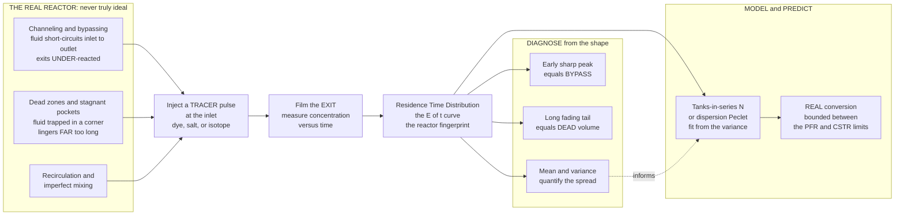

# ⏱️ Non-Ideal Reactors and Residence Time Distribution (RTD)

> [!abstract] TL;DR
> The two ideal reactor models — the perfectly mixed **CSTR** and the perfect single-file **PFR** — are *beautiful, useful lies*. Real reactors are **neither**: fluid **channels** and **bypasses** (short-circuits through, barely reacted), fluid piles up in **dead zones** (stuck far too long), and mixing is imperfect — all of which quietly drag conversion and selectivity *below* the ideal predictions. To see the truth you run a **tracer experiment**: inject a **pulse** of dye and film when it comes out. The spread of exit times is the **Residence Time Distribution** $E(t)$ — a probability density over how long fluid elements linger, and a *fingerprint* of how the reactor really behaves. A **PFR gives a sharp spike** (everything takes the same time); a **CSTR gives an exponential decay**; an **early peak flags bypass** and a **long tail flags dead volume**. The distribution's **mean** $\bar{t}=\int t\,E\,dt$ and **variance** $\sigma^2=\int (t-\bar t)^2 E\,dt$ quantify the spread, and two models turn that spread into predictions: the **tanks-in-series model** ($N$ equal CSTRs, with $\sigma_\theta^2=1/N$, so $N=1$ is a CSTR and $N\to\infty$ is a PFR) and the **axial dispersion model** (a PFR with back-mixing set by a **Péclet number**). For **linear (first-order) kinetics the RTD alone fixes conversion**; for nonlinear kinetics it only *bounds* it (between the **segregation** and **maximum-mixedness** micromixing limits). RTD is, in short, **diagnostic imaging for reactors** — the essential tool for troubleshooting, quantifying mixing, and predicting real conversion during scale-up.

---

## Intuition

**Analogy:** The ideal reactor models are lies — *beautiful, useful lies*. Real reactors never mix perfectly, and fluid never flows through them in perfect single file. Picture a crowd of people (molecules) all entering a building (the reactor) at the same instant, told to walk to the far exit. In the fantasy of the models, they either march in a perfectly ordered column and all leave together (that is a **PFR**), or they instantly scatter and mix so thoroughly that the crowd is uniform everywhere (that is a **CSTR**). Reality is messier: a few people find a fast **shortcut corridor** and rush out the exit almost immediately, barely having spent time inside; others wander into a **quiet dead-end room in the corner** and get stuck there far too long before finally drifting out. Everyone spends a *different* amount of time inside.

So engineers do something clever and almost cinematic: they **release a puff of coloured dye at the entrance and film the exit**, recording exactly *when* the colour comes out and how strongly. The resulting spread of exit times — the **Residence Time Distribution** — is a fingerprint of how the building *really* channels its crowd. A sharp burst of dye means everyone took the same path; a smear with an early spike and a long fading tail reveals the shortcut and the dead-end room. It is **diagnostic imaging for reactors**: an X-ray that exposes the channeling, dead zones, and bypassing that would otherwise *silently wreck conversion* while every gauge on the panel reads normal.

---

## How It Works

### Core Mechanics

1. **Why ideal fails.** The two ideal models bracket the extremes of mixing. A **PFR** assumes *zero* axial mixing — every fluid element spends exactly the space time $\tau = V/Q$ inside, so all molecules react for identical times. A **CSTR** assumes *infinite* mixing — the feed is instantly homogenised, so the exit stream is a random sample of ages. Real reactors sit *between* and *outside* these idealisations because of **channeling / bypassing** (a fast stream short-circuits inlet to outlet and leaves under-reacted), **dead zones / stagnant regions** (pockets of fluid that barely exchange with the main flow and linger far too long), **recirculation** (internal loops that re-expose fluid), and plain **imperfect mixing**. Every one of these degrades conversion and selectivity below the ideal number.

2. **The tracer experiment.** You cannot see molecular ages directly, so you tag them. Inject a **pulse** (an idealised spike, a Dirac delta) of an inert, detectable **tracer** — dye, salt (conductivity), a dye of known absorbance, or a radio-isotope — at the inlet and measure its concentration $C(t)$ at the outlet. Normalising by the injected amount gives the **exit-age distribution** directly:
$$
E(t) = \frac{C(t)}{\displaystyle\int_0^\infty C(t)\,dt}, \qquad \int_0^\infty E(t)\,dt = 1 .
$$
$E(t)\,dt$ is the fraction of the exiting fluid that spent between $t$ and $t+dt$ inside — a genuine probability density (see [[Random_Variables]]). A **step** input instead yields the cumulative **F-curve**, $F(t)=\int_0^t E\,dt'$, and the two are linked by $E=dF/dt$.

3. **Reading the fingerprint.** The *shape* of $E(t)$ diagnoses the pathology. **PFR** $\Rightarrow$ a sharp **spike** at $t=\tau$ (all elements identical). **CSTR** $\Rightarrow$ an **exponential decay** $E(t)=\tfrac{1}{\tau}e^{-t/\tau}$ (memoryless mixing). An **early, sharp peak** before the expected mean signals **bypassing** — fluid escaping too soon. A **long, slowly fading tail** signals **dead volume** — fluid trickling out of stagnant pockets. A tracer **mean** that comes out *earlier* than the calculated $\tau=V/Q$ means part of the volume is dead (not participating).

4. **Two numbers that summarise it.** The **mean residence time** is the first moment, $\bar{t}=\int_0^\infty t\,E(t)\,dt$ (equal to $\tau=V/Q$ only if there is no dead volume), and the **variance** is the second central moment, $\sigma^2=\int_0^\infty (t-\bar t)^2 E(t)\,dt$. The **dimensionless variance** $\sigma_\theta^2=\sigma^2/\bar t^{\,2}$ measures spread on a scale where PFR is $0$ and CSTR is $1$ — the single knob that tells you *where between the ideal limits* your reactor lives.

5. **Modelling non-ideal flow.** Two one-parameter models convert the RTD into engineering predictions:
   - **Tanks-in-series (TIS):** picture the real reactor as $N$ equal CSTRs in series. Its RTD is $E(\theta)=\dfrac{N^{N}}{(N-1)!}\,\theta^{\,N-1}e^{-N\theta}$ (with $\theta=t/\bar t$), and crucially $\sigma_\theta^2 = 1/N$, so you **fit $N$ directly from the measured variance**. $N=1$ recovers the CSTR; $N\to\infty$ recovers the PFR. Intuitive, discrete, and forgiving.
   - **Axial dispersion:** picture a PFR with a superimposed diffusion-like **back-mixing**, governed by an axial dispersion coefficient $D_{ax}$ bundled into the **Péclet number** $Pe = uL/D_{ax}$. Large $Pe$ (little dispersion) $\to$ PFR; small $Pe$ $\to$ CSTR. For small dispersion $\sigma_\theta^2 \approx 2/Pe$, tying the two models together ($N\approx Pe/2$). The dispersion picture connects reactor mixing to the same convection-diffusion physics as [[Mixing_Dispersion_and_Turbulent_Transport]] and [[Transport_Phenomena_Overview]].

6. **From RTD to conversion.** For **first-order** (linear) kinetics the RTD *alone* determines conversion exactly — it is the Laplace transform of $E$ evaluated at the rate constant: $\;\bar{C}/C_0 = \int_0^\infty e^{-kt}E(t)\,dt$. For **nonlinear** kinetics the RTD is *not enough*: outcome also depends on **micromixing** — whether molecules stay segregated in "packets" until they exit (the **segregation model**) or mix at the earliest possible moment (the **maximum-mixedness model**). These two extremes **bracket** the true conversion, and the RTD supplies both bounds. Assuming ideal (usually PFR) behaviour when the reactor is really closer to a CSTR can badly **over-predict** conversion — which is exactly why RTD analysis is the front-line diagnostic in **scale-up and troubleshooting**.

### Flow / Architecture



---

## Key Concepts

### Secondary Level

- **Perfect reactors do not exist.** Textbooks describe two dream reactors: one where everything is stirred so well it is the same everywhere, and one where the liquid marches through in a neat line and all of it takes the same time. Real tanks and pipes are messier than both.
- **Some bits rush, some bits dawdle.** In a real reactor, a little of the fluid finds a **shortcut** and shoots straight out barely changed, while some gets stuck in a **quiet corner** and stays far too long. Different molecules spend different amounts of time inside.
- **A dye test reveals the truth.** Squirt a **puff of colour** into the inlet and watch the outlet. If the colour comes out in one clean burst, everything took the same path. If it comes out as an early splash followed by a long faint smear, you have caught a shortcut *and* a dead corner — invisible problems you could never see from the outside.
- **Why it matters.** Those hidden shortcuts and dead corners mean the reactor makes **less product** than the design promised. The dye test — the **residence time distribution** — is how engineers find and fix the problem.

### Undergraduate Level

- **The E-curve and F-curve.** A **pulse** (delta) input gives the exit-age density $E(t)=C(t)/\!\int C\,dt$ with $\int_0^\infty E\,dt=1$; a **step** input gives the cumulative $F(t)=\int_0^t E\,dt'$, so $E=dF/dt$ and $F(\infty)=1$. Both are read straight off a tracer trace.
- **Moments.** Mean residence time $\bar t=\int_0^\infty t\,E\,dt$; variance $\sigma^2=\int_0^\infty (t-\bar t)^2E\,dt$; dimensionless variance $\sigma_\theta^2=\sigma^2/\bar t^{\,2}$ (0 for PFR, 1 for CSTR). If $\bar t < \tau=V/Q$, some volume is **dead**.
- **Ideal signatures.** PFR: $E(t)=\delta(t-\tau)$ (a spike). CSTR: $E(t)=\tfrac1\tau e^{-t/\tau}$ (exponential). Deviations diagnose: **early peak $\Rightarrow$ bypass**, **long tail $\Rightarrow$ dead volume**, **double peak $\Rightarrow$ parallel paths / internal recycle**.
- **Tanks-in-series model.** $N$ equal CSTRs give $E(\theta)=\dfrac{N^N}{(N-1)!}\theta^{N-1}e^{-N\theta}$ and $\boxed{N=1/\sigma_\theta^2}$ — measure the variance, get $N$. $N=1$ is a CSTR; large $N$ approaches a PFR.
- **Dispersion model.** A PFR plus back-mixing, characterised by $Pe=uL/D_{ax}$ (the vessel dispersion number is $1/Pe$). For small dispersion, $\sigma_\theta^2\approx 2/Pe$, so $N\approx Pe/2$. Large $Pe\Rightarrow$ plug flow; small $Pe\Rightarrow$ well-mixed.
- **RTD and first-order conversion.** For a first-order reaction, $\dfrac{C}{C_0}=\displaystyle\int_0^\infty e^{-kt}E(t)\,dt$ — conversion depends *only* on the RTD. Tanks-in-series: $X=1-(1+k\bar t/N)^{-N}$, which slides from the CSTR value $k\bar t/(1+k\bar t)$ at $N=1$ up to the PFR value $1-e^{-k\bar t}$ as $N\to\infty$.

### Graduate Level

- **Micromixing and the segregation–maximum-mixedness bounds.** The RTD fixes the *macromixing* (distribution of ages) but not the *micromixing* (when molecules of different ages actually meet). The **complete-segregation model** (Danckwerts) treats the fluid as independent batches that only mix at the exit — $\bar C=\int_0^\infty C_{batch}(t)E(t)\,dt$; the **maximum-mixedness model** (Zwietering) mixes at the earliest possible life expectancy via $\frac{dC}{d\lambda}=k\text{-term}+\frac{E(\lambda)}{1-F(\lambda)}(C-C_0)$. For a given RTD these **bracket** the true conversion. For **positive-order** kinetics segregation gives higher conversion; the ordering flips for order $<1$. For **first-order** the two limits coincide — the RTD alone suffices.
- **Closed vs open boundary conditions (dispersion model).** The exact variance–Péclet relation for a **closed–closed** vessel is $\sigma_\theta^2=\dfrac{2}{Pe}-\dfrac{2}{Pe^2}\!\left(1-e^{-Pe}\right)$; the open–open vessel differs. Danckwerts boundary conditions (flux continuity at inlet/outlet) matter at low $Pe$, and using the wrong pair mis-estimates $D_{ax}$.
- **Convolution / linear-systems view.** The RTD is the reactor's **impulse response**; for any inlet tracer signal the outlet is the **convolution** $C_{out}(t)=\int_0^t C_{in}(t')\,E(t-t')\,dt'$ — the exact same input-output algebra as a moving-average / impulse-response filter (see [[MA_Models]]). Compartment (mixing-cell) models chain CSTRs, PFRs, dead volumes, and bypass/recycle streams whose combined transfer function is fitted to the measured $E(t)$.
- **Higher moments and skew.** Beyond mean and variance, the **third moment (skewness)** distinguishes a long dead-zone tail from symmetric dispersion, and helps choose between competing compartment models when two models fit the variance equally well.
- **Scale-up mixing failure.** Geometric similarity does **not** preserve mixing: as a stirred tank scales, the **circulation/blend time** grows relative to reaction and feed times, so a reactor that behaved near-ideal in the lab develops **channeling, feed-plume segregation, and dead zones** at plant scale — the classic cause of yield/selectivity loss on scale-up, and the reason RTD/CFD mixing studies precede commissioning.
- **RTD does not uniquely determine the flow.** Different physical flow structures can share the *same* $E(t)$ (RTD is necessary but not sufficient). Pairing tracer data with a **mechanistic compartment model or CFD** — not curve-fitting alone — is required to pin down the real hydrodynamics before trusting a conversion prediction.

---

## Python Demo

```python
# NON-IDEAL REACTORS and the RESIDENCE TIME DISTRIBUTION (RTD)
# ------------------------------------------------------------
#   (a) RTD CURVES from a simulated tracer test:
#         * PFR      -> a sharp SPIKE at t = tau           (all elements same age)
#         * CSTR     -> an EXPONENTIAL decay (1/tau) e^-t/tau
#         * REAL     -> a spread curve with an EARLY BYPASS bump + a LONG DEAD-ZONE tail
#       We compute the mean residence time and the variance from the E-curve.
#   (b) MODELS & CONVERSION:
#         * tanks-in-series RTD morphs from CSTR (N=1) toward PFR (N large)
#         * first-order conversion slides between the CSTR and PFR limits with N
#         * assuming an IDEAL PFR when the reactor is really non-ideal OVER-predicts conversion
#
# Requires: numpy, matplotlib   (no scipy -- gamma/factorial done with math.factorial)
import numpy as np
import matplotlib.pyplot as plt
from math import factorial

# ------------------------------------------------------------------
# helpers
# ------------------------------------------------------------------
def gaussian(t, m, s):
    return np.exp(-0.5 * ((t - m) / s) ** 2) / (s * np.sqrt(2.0 * np.pi))

def tis_time(t, N, tmean):
    """Tanks-in-series RTD in real time, mean = tmean (a gamma density, shape N)."""
    return (N / tmean) ** N * t ** (N - 1) * np.exp(-N * t / tmean) / factorial(N - 1)

def tis_theta(theta, N):
    """Tanks-in-series RTD in dimensionless time theta = t/tmean (mean 1)."""
    return N ** N / factorial(N - 1) * theta ** (N - 1) * np.exp(-N * theta)

def moments(t, E):
    """Mean and variance of an RTD by numerical integration (trapezoid)."""
    area = np.trapz(E, t)
    E = E / area                          # enforce normalization
    tbar = np.trapz(t * E, t)
    var  = np.trapz((t - tbar) ** 2 * E, t)
    return tbar, var, E

# ------------------------------------------------------------------
# (a) simulated tracer test:  tau = 10 min nominal space time
# ------------------------------------------------------------------
tau = 10.0
t = np.linspace(0.0, 60.0, 4000)

E_cstr = (1.0 / tau) * np.exp(-t / tau)                 # ideal CSTR: exponential
E_pfr  = gaussian(t, tau, 0.35)                          # ideal PFR: near-delta spike

# REAL reactor = 12% early bypass + 73% main (skewed) flow + 15% slow dead-zone tail
E_real = (0.12 * gaussian(t, 1.6, 0.7)                   # early bypass bump
          + 0.73 * tis_time(t, 5, 11.0)                  # main channel, slightly delayed
          + 0.15 * (1.0 / 22.0) * np.exp(-t / 22.0))     # long dead-zone tail
tbar_r, var_r, E_real = moments(t, E_real)
sig2_theta = var_r / tbar_r ** 2                         # dimensionless variance
N_fit  = 1.0 / sig2_theta                                # tanks-in-series fit
Pe_fit = 2.0 / sig2_theta                                # dispersion fit (small-dispersion approx)

print("=== (a) RTD of the SIMULATED REAL reactor (tracer pulse) ===")
print(f"  nominal space time tau = V/Q      : {tau:6.2f} min")
print(f"  measured mean residence time tbar : {tbar_r:6.2f} min   "
      f"({'DEAD volume present' if tbar_r < tau - 0.2 else 'no dead volume'})")
print(f"  variance sigma^2                  : {var_r:6.2f} min^2")
print(f"  dimensionless variance sig_theta2 : {sig2_theta:6.3f}   (0 = PFR, 1 = CSTR)")
print(f"  fitted tanks-in-series N          : {N_fit:6.2f}")
print(f"  fitted dispersion Peclet          : {Pe_fit:6.2f}")

# ------------------------------------------------------------------
# (b) conversion between the ideal limits (first-order reaction)
# ------------------------------------------------------------------
Da = np.linspace(0.0, 5.0, 300)                          # Damkohler = k * tbar
X_cstr = Da / (1.0 + Da)                                 # CSTR limit (N = 1)
X_pfr  = 1.0 - np.exp(-Da)                               # PFR  limit (N -> inf)
def X_tis(Da, N): return 1.0 - (1.0 + Da / N) ** (-N)    # tanks-in-series

# conversion at a fixed duty Da0 as a function of N -> climbs from CSTR toward PFR
Da0 = 2.0
Nrange = np.arange(1, 51)
X_vsN = X_tis(Da0, Nrange)
X_pfr0, X_cstr0 = 1 - np.exp(-Da0), Da0 / (1 + Da0)
X_real_pred = X_tis(Da0, N_fit)                          # honest prediction using fitted N

print(f"\n=== (b) conversion at Da = k*tbar = {Da0:.1f} (first-order) ===")
print(f"  assume ideal PFR   : X = {X_pfr0*100:5.1f} %   <-- OVER-predicts")
print(f"  real reactor (N={N_fit:4.1f}) : X = {X_real_pred*100:5.1f} %   <-- honest RTD-based value")
print(f"  assume ideal CSTR  : X = {X_cstr0*100:5.1f} %   <-- lower bracket")
print(f"  penalty of pretending it is a PFR: {100*(X_pfr0 - X_real_pred):4.1f} percentage points")

# ================================ PLOTS ================================
fig, ax = plt.subplots(2, 2, figsize=(13, 9.5))
fig.suptitle("Non-Ideal Reactors & the Residence Time Distribution (RTD)",
             fontsize=15, fontweight="bold")

# A: the three RTD curves
axA = ax[0, 0]
axA.plot(t, E_pfr,  color="#2ca02c", lw=2.4, label="ideal PFR  (spike at tau)")
axA.plot(t, E_cstr, color="#1f77b4", lw=2.4, label="ideal CSTR  (exponential)")
axA.plot(t, E_real, color="#d62728", lw=2.8, label="REAL reactor  (bypass + tail)")
axA.axvline(tbar_r, ls="--", color="#d62728", lw=1.2)
axA.annotate("early bypass\n(short-circuit)", xy=(1.6, gaussian(1.6, 1.6, 0.7)*0.12*0.9),
             xytext=(6, 0.16), fontsize=8, arrowprops=dict(arrowstyle="->", color="gray"))
axA.annotate("long DEAD-ZONE tail", xy=(38, E_real[np.argmin(abs(t-38))]),
             xytext=(30, 0.055), fontsize=8, arrowprops=dict(arrowstyle="->", color="gray"))
axA.set_xlim(0, 45); axA.set_ylim(0, 0.20)
axA.set_xlabel("residence time  t  [min]"); axA.set_ylabel("E(t)  [1/min]")
axA.set_title("A. Tracer fingerprint: PFR spike vs CSTR decay\nvs a real reactor's bypass + dead-zone tail")
axA.legend(fontsize=8, loc="upper right"); axA.grid(alpha=0.3)

# B: tanks-in-series morphs CSTR -> PFR
axB = ax[0, 1]
theta = np.linspace(1e-3, 3.0, 600)
for N, col in zip([1, 2, 5, 20], ["#1f77b4", "#17becf", "#ff7f0e", "#2ca02c"]):
    axB.plot(theta, tis_theta(theta, N), color=col, lw=2.4,
             label=f"N = {N}" + ("  (CSTR)" if N == 1 else "  (-> PFR)" if N == 20 else ""))
axB.axvline(1.0, ls=":", color="k", lw=1.0)
axB.set_xlabel("dimensionless time  theta = t / tbar"); axB.set_ylabel("E(theta)")
axB.set_title("B. Tanks-in-series: N=1 is a CSTR,\nlarge N sharpens toward the PFR spike at theta=1")
axB.legend(fontsize=8); axB.grid(alpha=0.3)

# C: conversion vs Damkohler between the limits
axC = ax[1, 0]
axC.plot(Da, X_pfr * 100,  color="#2ca02c", lw=2.8, label="PFR limit  (best)")
axC.plot(Da, X_tis(Da, 3) * 100, color="#ff7f0e", lw=2.2, ls="--", label="tanks-in-series N=3")
axC.plot(Da, X_tis(Da, N_fit) * 100, color="#d62728", lw=2.4, ls="-.",
         label=f"real reactor N={N_fit:.1f}")
axC.plot(Da, X_cstr * 100, color="#1f77b4", lw=2.8, label="CSTR limit  (worst)")
axC.fill_between(Da, X_cstr * 100, X_pfr * 100, color="gray", alpha=0.12)
axC.set_xlabel("Damkohler number  Da = k * tbar"); axC.set_ylabel("conversion X  [%]")
axC.set_title("C. First-order conversion is trapped BETWEEN\nthe CSTR and PFR limits (shaded band)")
axC.legend(fontsize=8, loc="lower right"); axC.grid(alpha=0.3); axC.set_ylim(0, 100)

# D: conversion vs N at fixed duty -- the cost of assuming ideal
axD = ax[1, 1]
axD.plot(Nrange, X_vsN * 100, color="#d62728", lw=2.8, label=f"tanks-in-series, Da={Da0}")
axD.axhline(X_pfr0 * 100,  ls="--", color="#2ca02c", lw=1.8, label="PFR ideal (over-predicts)")
axD.axhline(X_cstr0 * 100, ls="--", color="#1f77b4", lw=1.8, label="CSTR ideal")
axD.axvline(N_fit, ls=":", color="k", lw=1.2)
axD.scatter([N_fit], [X_real_pred * 100], color="k", zorder=5, s=45)
axD.annotate(f"real reactor\nN={N_fit:.1f}, X={X_real_pred*100:.0f}%",
             xy=(N_fit, X_real_pred * 100), xytext=(N_fit + 6, X_real_pred * 100 - 14),
             fontsize=8, arrowprops=dict(arrowstyle="->", color="gray"))
axD.set_xlabel("number of tanks  N  (mixing quality)"); axD.set_ylabel("conversion X  [%]")
axD.set_title("D. At fixed duty, conversion rises with N.\nPretending the real reactor is a PFR over-predicts yield")
axD.legend(fontsize=8, loc="lower right"); axD.grid(alpha=0.3)

plt.tight_layout(rect=[0, 0, 1, 0.95])
plt.show()
```

Running this prints the tracer moments and the conversion comparison, then draws four panels. Panel **A** is the headline: the ideal **PFR** is a sharp spike and the ideal **CSTR** an exponential decay, while the **real** reactor's $E(t)$ shows the tell-tale pathology — an **early bypass bump** (fluid escaping too soon) and a **long dead-zone tail** (fluid trickling out of stagnant pockets); its measured mean also comes out *earlier* than the nominal $\tau=V/Q$, the numerical signature of dead volume. Panel **B** shows the **tanks-in-series** RTD morphing from the CSTR's exponential ($N=1$) toward the PFR's narrow spike as $N$ grows — the model's one knob $N=1/\sigma_\theta^2$ interpolating the whole mixing spectrum. Panel **C** proves that first-order conversion is **trapped in the shaded band** between the CSTR (worst) and PFR (best) limits, with the fitted real reactor sitting inside. Panel **D** is the punchline for practice: at a fixed reaction duty, conversion climbs with mixing quality $N$, so **assuming an ideal PFR when the reactor is really non-ideal over-predicts yield** by several percentage points — the exact scale-up trap RTD analysis exists to catch.

---

## Real-World Applications

> **Example — the chlorine contact tank at a drinking-water plant.** Disinfection credit is regulated by the **CT** value (disinfectant *concentration* × *contact time*), but the "time" that actually counts is **not** the nominal $\tau=V/Q$ — it is the **T10**, the time by which the *fastest* 10 % of the water has already left (read straight off the tracer **F-curve**). If the basin **short-circuits** — a jet of incoming water skimming across the surface straight to the outlet — a slug of pathogens can exit with far less contact than the average, and the RTD's early rise exposes it immediately. Utilities therefore run **tracer studies** and add **baffles** precisely to push T10 up toward $\tau$ (raise the baffling factor), turning a near-CSTR basin into something closer to plug flow. RTD here is not academic; it is the difference between compliant, safe water and a waterborne-disease outbreak.

- **Reactor scale-up and troubleshooting.** The single most common industrial use: a reactor that hit target conversion in the pilot plant **underperforms at full scale**. A tracer study reveals whether the culprit is **channeling** in a packed/fixed bed, a **dead zone** behind an internal, feed-plume **segregation** in a stirred tank, or an unintended internal **recycle** — telling the engineer whether to add baffles, redesign the distributor, or move the feed point rather than blaming the catalyst or kinetics.
- **Fixed-bed and trickle-bed catalytic reactors.** Poor liquid **maldistribution** over the packing lets some fluid bypass catalyst while other fluid stagnates; RTD (often via the dispersion model and $Pe$) quantifies the spread and sizes redistributors, and flags **wall channeling** in small tube-to-particle ratios.
- **Continuous pharmaceutical manufacturing.** In continuous direct compression, twin-screw granulation, and tubular API synthesis, the RTD sets **traceability and quality**: it defines how a material or a disturbance **smears** through the line (out-of-spec material removal, batch-genealogy for recalls) and is a core **Process Analytical Technology (PAT)** measurement mandated for control strategy.
- **Wastewater and environmental basins.** Activated-sludge aeration tanks, ozone contactors, and UV reactors are all sized around their RTDs; **short-circuiting** wastes reactor volume and reagent, while **dead zones** breed sludge and odour — tracer tests guide baffle and inlet redesign.
- **Indicator-dilution physiology (the same math elsewhere).** Cardiac **output** is measured by injecting a dye or cold-saline bolus into the bloodstream and recording the downstream concentration-time curve — the **Stewart–Hamilton** method is literally a tracer RTD experiment on the circulatory "reactor," proof that the framework is domain-agnostic.

---

## Common Pitfalls

- **Assuming ideal behaviour and over-predicting conversion.** Designing to the **PFR** ideal when the real reactor is closer to a CSTR (or is channeling) inflates the predicted conversion — sometimes by many percentage points, as the demo shows. For any positive-order reaction, more back-mixing means less conversion; ideal assumptions are optimistic lies until the RTD proves otherwise.
- **Confusing $\bar t$ with $\tau=V/Q$.** They are equal **only if there is no dead volume**. If the tracer mean comes out *earlier* than $V/Q$, part of the reactor is **stagnant** and effectively not there; using the nominal $\tau$ then over-states the working volume. Always compare the *measured* mean to the calculated space time.
- **RTD does not uniquely fix the flow.** Two physically different hydrodynamics can produce the **same** $E(t)$. A curve fit alone cannot prove a mechanism; pin the flow structure down with a **mechanistic compartment model, CFD, or independent measurements** before trusting a conversion prediction — RTD is necessary, not sufficient.
- **Forgetting micromixing for nonlinear kinetics.** For anything other than first-order, the RTD only **bounds** conversion (segregation vs maximum-mixedness). Treating the RTD as if it *determines* conversion for a second-order or autocatalytic reaction can be wrong in either direction; you must decide which micromixing limit your system is near.
- **Sloppy tracer experiments.** A tracer that **adsorbs, reacts, or is not truly inert**, an injection that is not a clean pulse/step, a detector that **misses the long tail** (truncating the integral distorts $\bar t$ and especially $\sigma^2$), or **mismatched density** that makes the tracer sink/float — any of these silently corrupts the RTD. The variance is dominated by the tail, so tails must be captured.
- **Wrong dispersion boundary conditions.** Using the open-vessel $\sigma_\theta^2=2/Pe$ formula for a **closed** vessel (or vice-versa) mis-estimates $D_{ax}$, badly at low $Pe$. Match the variance–Péclet relation and the Danckwerts boundary conditions to the real inlet/outlet geometry.
- **Believing lab-scale near-ideality survives scale-up.** Blend/circulation time grows faster than reaction time as vessels scale, so a lab reactor that behaved like a PFR/well-mixed CSTR can develop **channeling and dead zones** at plant scale. Re-measure the RTD (or CFD-model it) at scale rather than assuming the pilot result transfers.

---

## Related Concepts

**Sibling notes in this section (Chemical Reaction Engineering)** — this note is the *reality check* on the idealisations. *Ideal_Reactors_Batch_CSTR_PFR* defines the perfectly-mixed and plug-flow limits that RTD reveals real reactors to violate; *Chemical_Reaction_Engineering_Overview* frames conversion, selectivity, and reactor sizing that non-ideal flow degrades; *Reaction_Kinetics_and_Rate_Laws* supplies the rate law that the RTD is convolved against to predict real conversion; *Interphase_and_Multiphase_Transport* governs the mass-transfer resistances that compound with mixing non-idealities in multiphase reactors; and *Scale_Up_and_Process_Intensification* is where RTD analysis earns its keep, catching the channeling and dead zones that appear when a lab reactor is grown to plant scale.

**Within the Chemical Engineering vault**
- [[Chemical_Engineering_Overview]] — the hub note; reaction engineering (and its non-idealities) is one of the core unit-operation disciplines
- [[Chemical_Reaction_Equilibrium]] — sets the thermodynamic *ceiling* on conversion; RTD and kinetics decide how closely a real reactor *approaches* it
- [[Transport_Phenomena_Overview]] — axial dispersion and mixing are momentum-and-mass transport; the same convection-diffusion template underlies the dispersion model
- [[Momentum_Transport_and_Fluid_Flow]] — the flow field whose maldistribution *causes* channeling, dead zones, and recirculation in the first place

**Kinetics being scaled up (Chemistry vault)**
- [[Chemical_Kinetics]] — the beaker-scale rate laws; equilibrium sets *how far*, kinetics *how fast*, and RTD *how the real vessel's mixing distorts both*

**The mathematics of the distribution**
- [[Random_Variables]] — $E(t)$ is a genuine probability density; $\bar t$ and $\sigma^2$ are its first moment and variance
- [[Common_Probability_Distributions]] — the CSTR RTD is an exponential density and the tanks-in-series RTD is a gamma density, so RTD analysis is applied distribution theory
- [[MA_Models]] — the linear-systems twin: the RTD is the reactor's *impulse response*, and outlet = *convolution* of inlet with $E(t)$, exactly the moving-average/impulse-response algebra

**The physics of mixing (Fluid Dynamics vault)**
- [[Mixing_Dispersion_and_Turbulent_Transport]] — turbulent dispersion and mixing set the axial dispersion coefficient $D_{ax}$ and the Péclet number that quantify non-ideal flow

---

## Review Questions

**Secondary**
1. An engineer squirts a puff of red dye into the inlet of a big stirred tank and films the outlet. In case A the dye comes out in one clean burst; in case B a little dye appears almost instantly and then a faint smear keeps coming out for a long time afterward. What does each result tell you about how the fluid is moving through the tank, and why would case B make *less* product than the design predicted?

**Undergraduate**
2. A tracer pulse test on a reactor with nominal space time $\tau=V/Q=8$ min returns a mean residence time $\bar t=6.5$ min and a variance $\sigma^2=15\ \text{min}^2$. (a) What does $\bar t<\tau$ tell you physically? (b) Compute the dimensionless variance and the number of tanks $N$ in an equivalent tanks-in-series model, and state where the reactor sits between the CSTR and PFR limits. (c) For a first-order reaction with $k\bar t=2$, estimate the conversion using $X=1-(1+k\bar t/N)^{-N}$ and compare it to what an *ideal PFR* assumption would have predicted.

**Graduate**
3. You measure the RTD of a full-scale reactor and find it can be fit *equally well* by (i) a tanks-in-series model with $N=4$ and (ii) a compartment model consisting of a plug-flow zone in parallel with a well-mixed bypass and a small dead volume. (a) Explain why the two models share the same variance yet imply different hydrodynamics, and what additional information (e.g. higher moments, the F-curve shape, CFD, independent probes) you would use to discriminate. (b) For a *second-order* reaction, explain why the RTD alone cannot give a single conversion, define the segregation and maximum-mixedness limits, and state which limit gives the higher conversion and why. (c) The pilot reactor behaved nearly like a PFR but the plant reactor does not — give the mixing-time-versus-reaction-time argument for why non-ideality typically *worsens* on scale-up.

---

## Sources

- H. S. Fogler — *Elements of Chemical Reaction Engineering*, 6th ed. (Prentice Hall, 2020), Ch. 16–18 (Residence-Time Distributions, Models for Nonideal Reactors)
- O. Levenspiel — *Chemical Reaction Engineering*, 3rd ed. (Wiley, 1999), Ch. 11–16 (Basics of Non-Ideal Flow, Compartment/Dispersion/Tanks-in-Series Models)
- O. Levenspiel — *Tracer Technology: Modeling the Flow of Fluids* (Springer, 2012)
- E. B. Nauman — *Chemical Reactor Design, Optimization, and Scaleup*, 2nd ed. (Wiley, 2008)
- G. F. Froment, K. B. Bischoff & J. De Wilde — *Chemical Reactor Analysis and Design*, 3rd ed. (Wiley, 2010)

---

#chemical-engineering #RTD #non-ideal-reactors #tracer #mixing
