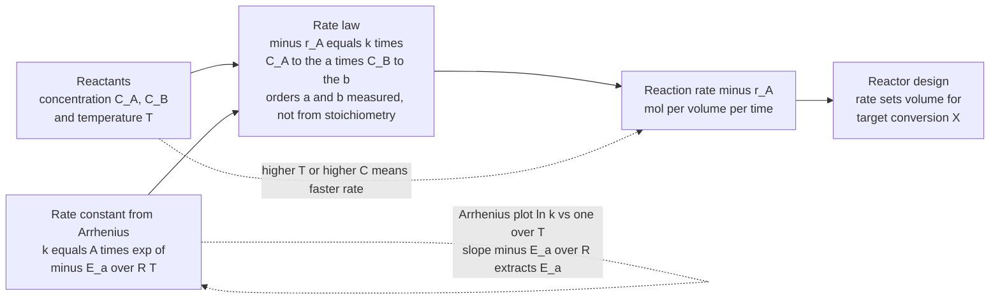

# ⚗️ Reaction Kinetics and Rate Laws

> [!abstract] TL;DR
> **Reaction kinetics** is the "how fast" that reactor engineering is built on: thermodynamics tells you a reaction *can* happen and how far it can go, but kinetics tells you the *rate* — and in a factory, fast is everything, because a reaction that takes a century to finish is worthless no matter how favourable. The rate of reaction $-r_A$ (moles of $A$ consumed per unit volume per unit time) is captured by a **rate law**, $-r_A = k\,C_A^a C_B^b$, whose exponents give the **reaction order** — determined *experimentally*, never read off the stoichiometry — and whose **rate constant** $k$ obeys the **Arrhenius equation** $k = A\,e^{-E_a/RT}$: rate climbs exponentially with temperature (roughly doubling every 10 °C) because only molecules carrying enough energy to clear the **activation-energy hill** actually react. The rate law is the essential *input* to reactor design — it sets how big a reactor must be for a target conversion, how temperature governs throughput (and the exothermic-runaway safety limit), and, through **selectivity** in complex networks, how to favour the desired product. Kinetics turns chemistry into quantitative engineering, and pairs with equilibrium (the ceiling) to define reactor performance.

## Intuition

**Analogy:** Thermodynamics is the map that tells you a valley on the far side of the mountain is *lower* than where you stand — the reaction *can* happen and this is how far it will run. But the map says nothing about the **hike**. Kinetics is the study of the *mountain pass itself*: how high the ridge is (the **activation energy** $E_a$), and how fast a crowd of hiker-molecules actually gets over it. Two things you can control set the pace. First, how **crowded** the trailhead is — more molecules packed together (higher **concentration**) means more collisions per second at the base of the pass. Second, how **hot** it is — temperature is the dramatic lever, because heat is what gives molecules the energy to clear the ridge.

Here is why temperature is so dramatic: only the molecules carrying *more than* $E_a$ of energy can make it over, and the fraction that hot is $e^{-E_a/RT}$ — a Boltzmann tail that swells explosively as you heat the system. That is the **Arrhenius law**: rate climbs *exponentially* with temperature, roughly doubling for every 10 °C. A reaction that is thermodynamically eager can still crawl if its pass is high and its trailhead cold — which is exactly why a chemical plant lives or dies by kinetics, not just by whether a reaction is "favourable."

---

## How It Works

### Core Mechanics

The whole subject is an effort to pin down one function — the **rate of reaction** — and then use it to size equipment.

1. **Define the rate unambiguously.** For $aA + bB \rightarrow cC + dD$, the reaction rate is defined so a *single* number describes the whole reaction no matter which species you watch: $r = -\frac{1}{a}\frac{dC_A}{dt} = -\frac{1}{b}\frac{dC_B}{dt} = +\frac{1}{c}\frac{dC_C}{dt}$. Engineers usually quote the rate of consumption of a key reactant, $-r_A$, in $\text{mol}\,\text{m}^{-3}\,\text{s}^{-1}$ — the natural units for a reactor's *volumetric* production.

2. **The rate law — a power law in concentration.** Experiment shows the rate is usually a product of concentrations raised to powers: $-r_A = k\,C_A^{a}C_B^{b}$. The exponent $a$ is the **order with respect to $A$**, $b$ the order with respect to $B$, and $a+b$ the **overall order**. The single most important warning in all of kinetics: **the orders are measured, not derived from stoichiometry.** They match the coefficients only for a true *elementary* step (one that happens in a single molecular collision); for the vast majority of real (*non-elementary*) reactions, the orders can be fractional, negative, or zero, because they encode a hidden multi-step mechanism.

3. **The rate constant and its temperature dependence — Arrhenius.** The proportionality constant $k$ hides the temperature sensitivity: $k = A\,e^{-E_a/RT}$. The **activation energy** $E_a$ is the height of the energy barrier; the **pre-exponential factor** $A$ bundles the collision frequency and the fraction of collisions with the right *orientation*. Because $E_a$ sits in an exponential, small temperature changes produce large rate changes — the near-universal rule of thumb is a *doubling of rate per 10 °C*. Taking logs linearizes it: $\ln k = \ln A - \frac{E_a}{R}\cdot\frac{1}{T}$, so a plot of $\ln k$ versus $1/T$ (the **Arrhenius plot**) is a straight line of slope $-E_a/R$ — the standard way to *extract* $E_a$ from lab data. **Collision theory** motivates $A$ (rate of properly-oriented, sufficiently energetic collisions); **transition-state (Eyring) theory** refines it via the free energy of the activated complex.

4. **Determining the kinetics — the experimental core.** You cannot design a reactor without a rate law, and a rate law must be *measured*. The workhorse methods: the **integral method** (guess an order, integrate the rate law, and see which linearized concentration-time plot comes out straight — $C_A$ vs $t$ for zero order, $\ln C_A$ vs $t$ for first, $1/C_A$ vs $t$ for second); the **differential method** (estimate $-r_A = -dC_A/dt$ by numerical slopes and fit $\ln(-r_A)$ vs $\ln C_A$, whose slope *is* the order); the **half-life method** (how $t_{1/2}$ scales with initial concentration betrays the order); and the **method of initial rates** (vary one reactant, watch the initial slope). Each converts messy batch data into $k$, $A$, $E_a$, and the orders.

5. **From rate law to reactor size.** This is the payoff. Combine the rate law with a mole balance and you get the reactor design equation. For an ideal batch or plug-flow reactor, $-r_A$ dictates the time or volume needed to reach a target conversion $X$: e.g. $\tau = C_{A0}\int_0^{X}\frac{dX}{-r_A}$. A slow reaction (small $k$, high $E_a$) demands a *big* reactor or a *hot* one; the rate law quantifies exactly how big.

6. **Complex kinetics — reversibility, multiplicity, catalysis.** Real networks add structure. **Reversible** reactions carry a back-reaction term, $-r_A = k_f C_A - k_r C_C$, so the *net* rate falls to zero at **equilibrium** (tying kinetics back to the equilibrium ceiling). **Series** ($A\rightarrow B\rightarrow C$) and **parallel** ($A\rightarrow B$, $A\rightarrow C$) reactions raise the question of **selectivity** — favouring the wanted product by tuning temperature and concentration (a higher-$E_a$ pathway is favoured by *high* temperature). **Chain** and **catalytic** mechanisms are analyzed by identifying the **rate-determining step** and applying the **steady-state** or **pre-equilibrium** approximation to a reactive intermediate, often collapsing to a **pseudo-order** law when one reactant is in vast excess. Two canonical saturating forms recur: **Michaelis-Menten** kinetics for enzymes, $-r_S = \frac{V_{max}C_S}{K_M + C_S}$, and **Langmuir-Hinshelwood** kinetics for heterogeneous catalysis, where rate depends on *surface coverage* and can even *decrease* with reactant pressure.

### Flow / Architecture



---

## Key Concepts

### Secondary Level

- **Two knobs make reactions go faster: crowding and heat.** Pack the reactant molecules closer (raise **concentration**) and they collide more often. Heat them up and each collision is more violent. Both speed the reaction — and each maps to a term in the rate equations below.
- **The activation-energy hill.** Molecules must gather a minimum amount of energy — the **activation energy** — before they can react at all. Most collisions are too gentle and just bounce off. Heating the mixture gives many more molecules enough energy to clear the hill, which is why warmth speeds things up so sharply.
- **Roughly double the rate per 10 °C.** A famous rule of thumb: warming a reaction by about 10 degrees roughly *doubles* how fast it goes. That is why a refrigerator slows food spoilage and a pressure cooker speeds cooking.
- **Fast is not the same as favourable.** A reaction can be strongly "downhill" (thermodynamically favourable) yet crawl for years — diamonds are technically unstable relative to graphite but their reaction is so slow it never matters. Kinetics, not thermodynamics, decides whether a reaction is *useful*.

### Undergraduate Level

- **The rate law and reaction order.** $-r_A = k\,C_A^{a}C_B^{b}$. The orders $a,b$ (and the overall order $a+b$) are found by **experiment**; they equal the stoichiometric coefficients *only* for elementary steps. Orders can be fractional, negative, or zero.
- **The rate constant is not constant in $T$.** The **Arrhenius equation** $k = A\,e^{-E_a/RT}$ makes $k$ climb exponentially with temperature. Linearized: $\ln k = \ln A - (E_a/R)(1/T)$; the **Arrhenius plot** ($\ln k$ vs $1/T$) is a straight line whose slope $-E_a/R$ gives the **activation energy** and whose intercept gives $\ln A$.
- **Integrated rate laws (batch reactor).** For $A \rightarrow$ products with $-r_A = kC_A^n$: **zero order** $C_A = C_{A0} - kt$ (half-life $t_{1/2}=C_{A0}/2k$, shrinks as you deplete); **first order** $C_A = C_{A0}e^{-kt}$, i.e. $\ln C_A$ linear in $t$ (half-life $t_{1/2}=\ln 2/k$, *constant*); **second order** $1/C_A = 1/C_{A0} + kt$, i.e. $1/C_A$ linear in $t$ (half-life $t_{1/2}=1/kC_{A0}$, grows as you deplete). *Which* linearization comes out straight tells you the order.
- **Determining kinetics.** Integral, differential, half-life, and initial-rate methods each turn concentration-time data into orders and $k$. The **pseudo-order** trick: flood the reactor with one reactant so its concentration is ~constant, collapsing a two-reactant law to an apparent lower order in the other.
- **Elementary vs non-elementary.** An **elementary** reaction happens in one molecular event and its order equals its molecularity. A **non-elementary** reaction is a sum of elementary steps; the observed rate law reflects the **rate-determining step** and any fast pre-equilibria, not the overall balanced equation.
- **Reversibility ties to equilibrium.** With a back reaction, $-r_A = k_f C_A^{...} - k_r C_C^{...}$; the net rate vanishes at equilibrium, where $k_f/k_r = K$. Kinetics governs *how fast* you approach the ceiling that equilibrium sets.

### Graduate Level

- **Selectivity and yield in complex networks.** For **parallel** reactions $A\rightarrow D$ (desired, activation energy $E_{a,D}$) and $A\rightarrow U$ (undesired, $E_{a,U}$), the instantaneous selectivity is $S_{D/U}=(k_D/k_U)C_A^{\,a_D-a_U}\propto e^{-(E_{a,D}-E_{a,U})/RT}C_A^{\,a_D-a_U}$. This dictates operating strategy: if the desired path has the *higher* $E_a$, run *hot*; if it is higher-order in $A$, keep $C_A$ *high* (favour a batch/PFR over a CSTR). For **series** reactions $A\rightarrow B\rightarrow C$ with $B$ the target, there is an *optimal* residence time that maximizes $B$ before it over-reacts to $C$.
- **The steady-state and pre-equilibrium approximations.** For a mechanism with a reactive intermediate $I$, the **quasi-steady-state assumption** sets $dC_I/dt\approx 0$, algebraically eliminating $I$ to yield the observable rate law — the derivation behind **Michaelis-Menten** ($-r_S = V_{max}C_S/(K_M+C_S)$, with $V_{max}=k_{cat}E_0$ and $K_M$ the half-saturation constant) and behind chain-reaction and free-radical kinetics.
- **Heterogeneous catalysis — Langmuir-Hinshelwood.** When reaction occurs on a catalyst surface, the rate depends on **fractional coverage** $\theta_i = K_i P_i/(1+\sum_j K_j P_j)$. A bimolecular surface reaction gives $-r = \frac{k K_A K_B P_A P_B}{(1+K_A P_A + K_B P_B)^2}$ — a form that *rises, peaks, then falls* with reactant pressure as reactants competitively crowd each other off the surface. This surface-coverage dependence is why catalytic rate laws rarely look like simple power laws.
- **Transition-state (Eyring) theory.** $k = \frac{k_B T}{h}e^{-\Delta G^{\ddagger}/RT} = \frac{k_B T}{h}e^{\Delta S^{\ddagger}/R}e^{-\Delta H^{\ddagger}/RT}$ recasts the barrier as a *free energy* of activation, separating an enthalpic barrier $\Delta H^{\ddagger}$ (roughly $E_a$) from an entropic term $\Delta S^{\ddagger}$ that captures the ordering/orientation folded into Arrhenius' $A$. It explains why tightly-ordered transition states (large negative $\Delta S^{\ddagger}$) have small pre-exponentials.
- **Non-isothermal reactors and thermal runaway.** In an exothermic reactor the released heat raises $T$, which raises $k$ *exponentially*, which releases heat *faster* — a positive-feedback loop. When heat generation ($\propto e^{-E_a/RT}$) outpaces heat removal (linear in $T$), the steady states multiply and the reactor can jump to a high-temperature runaway. This coupling of the Arrhenius rate law to the energy balance is the central safety problem of reactor design (Semenov/Frank-Kamenetskii analysis).
- **Diffusion vs reaction limitation.** In porous catalysts and fast reactions, the *observed* rate can be masked by mass transfer. The **Thiele modulus** and **effectiveness factor** quantify when the intrinsic (Arrhenius) kinetics are throttled by diffusion — a diagnostic sign is an *apparent* $E_a$ about half the true value, because diffusivity is only weakly temperature-dependent.

---

## Python Demo

```python
# Reaction kinetics & rate laws — the two pillars a reactor design depends on:
#   (a) ARRHENIUS  : how the rate constant k depends on TEMPERATURE, and how the
#                    Arrhenius plot (ln k vs 1/T) EXTRACTS the activation energy;
#                    plus a check of the "~doubling per 10 K" rule of thumb.
#   (b) ORDER      : integrated concentration-time curves for zero-, first-, and
#                    second-order reactions in a BATCH reactor, and how the ORDER
#                    is DETERMINED from data (which linearized plot is straight).
#
# Requires: numpy, matplotlib
import numpy as np
import matplotlib.pyplot as plt

R = 8.314  # J/mol/K

# ============================================================================
# (a) ARRHENIUS:  k(T) = A * exp(-Ea / (R T))
# ============================================================================
A_pre = 1.0e11          # pre-exponential factor (1/s), first-order-like units
Ea    = 52.9e3          # activation energy (J/mol) -> ~doubling per 10 K near 300 K

def k_arrhenius(T):
    return A_pre * np.exp(-Ea / (R * T))

T = np.linspace(280.0, 360.0, 400)            # K
k = k_arrhenius(T)

# --- the "~double per 10 K" rule: ratio k(T+10)/k(T) at a few temperatures ---
print("=== (a) Arrhenius: rate roughly doubles per +10 K ===")
for Tc in (290.0, 300.0, 330.0):
    ratio = k_arrhenius(Tc + 10.0) / k_arrhenius(Tc)
    print(f"  k({Tc+10:.0f} K) / k({Tc:.0f} K) = {ratio:4.2f}x   "
          f"(the rule is exact only near ~300 K for this Ea)")

# --- extract Ea from a synthetic Arrhenius experiment (ln k vs 1/T, slope = -Ea/R) ---
T_exp   = np.array([300., 310., 320., 330., 340., 350.])        # measured temps
rng     = np.random.default_rng(0)
k_exp   = k_arrhenius(T_exp) * (1 + 0.05 * rng.standard_normal(T_exp.size))  # +/-5% noise
x, y    = 1.0 / T_exp, np.log(k_exp)
slope, intercept = np.polyfit(x, y, 1)          # y = ln A + (-Ea/R) * (1/T)
Ea_fit  = -slope * R
print(f"\n  Arrhenius plot linear fit: slope = {slope:.1f} K  ->  "
      f"Ea_fit = {Ea_fit/1000:5.1f} kJ/mol   (true = {Ea/1000:.1f} kJ/mol)")

# ============================================================================
# (b) ORDER: integrated batch rate laws  -dC_A/dt = k * C_A^n
# ============================================================================
CA0 = 1.0                                       # mol/L initial concentration
t   = np.linspace(0.0, 100.0, 500)              # s

k0, k1, k2 = 0.010, 0.030, 0.060                # rate constants (mixed units by order)
C_zero  = np.clip(CA0 - k0 * t, 0.0, None)      # zero  order: C = C0 - k t
C_first = CA0 * np.exp(-k1 * t)                 # first order: C = C0 exp(-k t)
C_secnd = CA0 / (1.0 + k2 * CA0 * t)            # second order: 1/C = 1/C0 + k t

# half-lives (note how they scale differently with C0):
print("\n=== (b) Half-life fingerprints (depend on order) ===")
print(f"  zero  order: t_half = C0/(2k) = {CA0/(2*k0):5.1f} s  (shrinks as C depletes)")
print(f"  first order: t_half = ln2/k   = {np.log(2)/k1:5.1f} s  (CONSTANT, order-1 signature)")
print(f"  second order: t_half = 1/(k C0) = {1/(k2*CA0):5.1f} s  (grows as C depletes)")

# --- ORDER DETERMINATION: generate noisy FIRST-order data, test all 3 linearizations ---
t_d   = np.linspace(2.0, 60.0, 12)
C_d   = CA0 * np.exp(-k1 * t_d) * (1 + 0.02 * rng.standard_normal(t_d.size))

def r2(xv, yv):                                 # goodness of straight-line fit
    m, b = np.polyfit(xv, yv, 1)
    yhat = m * xv + b
    ss_res = np.sum((yv - yhat) ** 2)
    ss_tot = np.sum((yv - yv.mean()) ** 2)
    return 1 - ss_res / ss_tot

R2_zero  = r2(t_d, C_d)                          # C   vs t straight -> zero order
R2_first = r2(t_d, np.log(C_d))                 # lnC vs t straight -> first order
R2_secnd = r2(t_d, 1.0 / C_d)                   # 1/C vs t straight -> second order
print("\n=== ORDER determination: which linearization is straightest? ===")
print(f"  R^2(C   vs t) = {R2_zero:.4f}   [zero  order test]")
print(f"  R^2(lnC vs t) = {R2_first:.4f}  [first order test]  <-- winner")
print(f"  R^2(1/C vs t) = {R2_secnd:.4f}   [second order test]")

# ============================================================================
# PLOTS
# ============================================================================
fig, ax = plt.subplots(2, 2, figsize=(13, 9))
fig.suptitle("Reaction Kinetics & Rate Laws:  Arrhenius (temperature) + Order (concentration-time)",
             fontsize=14, fontweight="bold")

# A: k vs T -- exponential rise
axA = ax[0, 0]
axA.plot(T, k, lw=2.5, color="#d62728")
axA.set_xlabel("temperature  [K]"); axA.set_ylabel("rate constant k  [1/s]")
axA.set_title("A. Arrhenius: k rises EXPONENTIALLY with T\n(the dramatic temperature lever)")
axA.grid(alpha=0.3)

# B: Arrhenius plot ln k vs 1/T -- straight line, slope = -Ea/R
axB = ax[0, 1]
axB.plot(1.0 / T * 1e3, np.log(k), lw=2.0, color="#1f77b4", label="model")
axB.plot(x * 1e3, y, "o", color="#ff7f0e", label="noisy data")
axB.plot(x * 1e3, slope * x + intercept, "--", color="k", lw=1.4,
         label=f"fit: Ea = {Ea_fit/1000:.1f} kJ/mol")
axB.set_xlabel("1000 / T  [1/K]"); axB.set_ylabel("ln k")
axB.set_title("B. Arrhenius plot: ln k vs 1/T is a LINE\nslope = -Ea/R extracts activation energy")
axB.legend(loc="upper right", fontsize=9); axB.grid(alpha=0.3)

# C: concentration vs time for the three orders
axC = ax[1, 0]
axC.plot(t, C_zero,  lw=2.5, color="#2ca02c", label="zero order  (C = C0 - k t)")
axC.plot(t, C_first, lw=2.5, color="#1f77b4", label="first order (C = C0 exp(-k t))")
axC.plot(t, C_secnd, lw=2.5, color="#9467bd", label="second order (1/C = 1/C0 + k t)")
axC.set_xlabel("time  [s]"); axC.set_ylabel("concentration C_A  [mol/L]")
axC.set_title("C. Integrated batch rate laws\ndifferent orders decay with different shapes")
axC.legend(loc="upper right", fontsize=9); axC.grid(alpha=0.3); axC.set_ylim(0, 1.02)

# D: order determination -- the three linearizations of the SAME first-order data
axD = ax[1, 1]
axD.plot(t_d, C_d / C_d.max(),            "s-", color="#2ca02c",
         label=f"C   vs t   (R2={R2_zero:.3f})")
axD.plot(t_d, np.log(C_d) / abs(np.log(C_d)).max() + 1.0, "o-", color="#1f77b4",
         label=f"lnC vs t   (R2={R2_first:.3f})  straight")
axD.plot(t_d, (1.0 / C_d) / (1.0 / C_d).max(), "^-", color="#9467bd",
         label=f"1/C vs t   (R2={R2_secnd:.3f})")
axD.set_xlabel("time  [s]"); axD.set_ylabel("linearized coordinate (normalized)")
axD.set_title("D. Determining the order (data is FIRST order):\nonly ln C vs t is straight -> order = 1")
axD.legend(loc="best", fontsize=8); axD.grid(alpha=0.3)

plt.tight_layout(rect=[0, 0, 1, 0.95])
plt.show()
```

Running this prints the doubling-per-10 K check (about 2.0x near 300 K, shrinking at higher $T$ because the factor is $e^{E_a\cdot 10/(RT^2)}$), recovers the activation energy from a noisy Arrhenius plot (~53 kJ/mol), lists the three half-life fingerprints, and identifies the reaction order by testing which linearization is straightest. **Panel A** shows the exponential explosion of $k$ with temperature — the reason temperature is the master lever. **Panel B** is the Arrhenius plot: turning the exponential into a straight line whose slope $-E_a/R$ *is* the measurement of the barrier. **Panel C** contrasts the shapes of zero-, first-, and second-order decay in a batch reactor. **Panel D** is the experimental heart of the subject: given concentration-time data, you test the three linearizations, and the one that comes out straight (here $\ln C_A$ vs $t$) reveals the order — first order — which, together with the Arrhenius $k$, is exactly the rate law a reactor designer needs.

---

## Real-World Applications

> **Example — sizing the reactor is impossible without the rate law.** In Fogler's core design workflow, every ideal reactor volume comes from combining a mole balance with $-r_A$: a plug-flow reactor needs $V = F_{A0}\int_0^{X}\frac{dX}{-r_A}$. Feed the *wrong* order or a $k$ off by an Arrhenius factor and the reactor is sized wrong by orders of magnitude — too small and you miss the conversion target, too big and you waste capital. The rate law is not academic; it is the single input that turns a target conversion into steel.

- **Steam cracking of naphtha/ethane to ethylene.** The world's largest-volume petrochemical process is a *free-radical chain* reaction with a very high activation energy, which is precisely why cracking furnaces run at 800–900 °C — the Arrhenius law demands extreme temperature to make the rate industrially useful, and short residence times (milliseconds) plus fast quench are tuned to maximize ethylene *selectivity* before it over-reacts. Textbook complex kinetics driving furnace design.
- **Haber-Bosch ammonia synthesis.** The kinetics over an iron catalyst are slow at the temperatures where equilibrium is favourable, so the plant runs *hotter* (400–500 °C) to buy rate — the classic kinetics-versus-equilibrium compromise. The surface rate law (dissociative N₂ adsorption as the rate-determining step) is Langmuir-Hinshelwood in form.
- **Automotive catalytic converters.** Three-way catalysts convert CO, NOₓ, and hydrocarbons through *heterogeneous* Langmuir-Hinshelwood kinetics on Pt/Pd/Rh. The "light-off temperature" — the point where the Arrhenius rate suddenly becomes fast enough — is why converters barely work in the first cold minute of a drive, the largest source of tailpipe emissions.
- **Pharmaceutical shelf life and the Arrhenius accelerated-stability test.** Drug degradation is a rate process; regulators use *accelerated* aging at elevated temperature and the Arrhenius equation to extrapolate a room-temperature expiry date — the same $\ln k$ vs $1/T$ line, run backwards to predict years from weeks.
- **Runaway-reaction safety.** Exothermic batch and semi-batch reactors (nitrations, polymerizations) are governed by the Arrhenius feedback between temperature and rate; the entire discipline of reactor thermal-hazard analysis exists because $k\propto e^{-E_a/RT}$ makes heat generation accelerate faster than cooling can remove it.

---

## Common Pitfalls

- **Reading the order off the stoichiometry.** The most damaging beginner error: assuming $2A + B \rightarrow$ products means the rate is $k C_A^2 C_B$. Orders are *experimental*; they equal the coefficients only for elementary steps. Fractional and negative orders are real and common. Always measure.
- **Confusing kinetics with thermodynamics.** A favourable $\Delta G$ says nothing about speed; a fast rate says nothing about how far the reaction goes. You need *both* — kinetics for the reactor size and dynamics, equilibrium for the ceiling. Treating "spontaneous" as "fast" (or vice versa) mis-designs the process.
- **Unit chaos in $k$.** The rate constant's units *depend on the overall order* ($\text{s}^{-1}$ for first order, $\text{L}\,\text{mol}^{-1}\text{s}^{-1}$ for second, etc.). Reporting $k$ without units, or comparing $k$ values across different orders, is meaningless. Carry the units.
- **Extrapolating Arrhenius too far.** The $\ln k$ vs $1/T$ line is only linear while a *single* mechanism dominates. Across a wide temperature range the rate-determining step can change, mass-transfer limitation can set in (halving the apparent $E_a$), or the pre-exponential can drift — the plot then bends. Fit within the regime you will actually operate.
- **Ignoring the reverse reaction near equilibrium.** For reversible reactions the *net* rate is $k_f(\cdot) - k_r(\cdot)$, and using only the forward term over-predicts conversion — the rate must fall to zero at equilibrium. Reactor models that omit the back-reaction "reach" impossible conversions past the thermodynamic ceiling.
- **Mistaking diffusion limitation for intrinsic kinetics.** In porous catalysts or viscous media, the *observed* rate may be throttled by mass transfer, not chemistry. A tell-tale sign is an apparent activation energy far below the true one (often ~half). Scaling such "kinetics" to a bigger reactor with different transport gives wrong predictions — check the Thiele modulus / effectiveness factor.
- **Assuming a single global order across all conditions.** Saturating kinetics (Michaelis-Menten, Langmuir-Hinshelwood) look *first order* at low concentration and *zero order* at high concentration. Fitting one power law across the whole range mis-sizes the reactor at one end or the other.

---

## Related Concepts

**Sibling notes in this vault (Chemical Engineering)** — this note supplies the *rate*; the neighbours turn it into hardware. *Chemical_Reaction_Engineering_Overview* frames how a rate law becomes a design; *Ideal_Reactors_Batch_CSTR_PFR* plugs $-r_A$ into the batch, CSTR, and PFR design equations to compute the volume for a target conversion; *Catalysis_and_Heterogeneous_Reactions* develops the surface (Langmuir-Hinshelwood) rate laws sketched here; *Chemical_Reaction_Equilibrium* supplies the *ceiling* that the reversible rate law approaches (kinetics = how fast, equilibrium = how far); and *Non_Ideal_Reactors_and_RTD* handles the real-reactor mixing that convolves with these intrinsic kinetics.

**The science being scaled up (Chemistry vault)**
- [[Chemical_Kinetics]] — the beaker-scale kinetics (rate laws, Arrhenius, mechanisms, steady-state/pre-equilibrium) that this note reframes for reactor engineering; the companion note this one links to
- [[Chemical_Equilibrium]] — the ceiling the *net* reversible rate approaches; where $k_f/k_r = K$ and the rate falls to zero
- [[Chemical_Thermodynamics]] — the $\Delta G$/$\Delta H$ that decide *whether and how far*, complementing the *how fast* of kinetics

**Physical and mathematical foundations**
- [[Kinetic_Theory_of_Gases]] — the Maxwell-Boltzmann energy distribution whose high-energy tail $e^{-E_a/RT}$ *is* the physical origin of the Arrhenius factor and collision theory
- [[First_Order_ODEs]] — integrated rate laws are first-order ODEs in concentration; the separable-equation machinery behind $C_A = C_{A0}e^{-kt}$ and its zero/second-order siblings

**Catalytic and biological kinetics**
- [[Enzyme_Kinetics_and_Catalysis]] — Michaelis-Menten saturation kinetics derived from the steady-state approximation, the biological cousin of Langmuir-Hinshelwood
- [[Enzymes_and_Catalysis]] — how catalysts lower $E_a$ to accelerate reactions without shifting equilibrium, the biological view of the activation-energy barrier

---

## Review Questions

**Secondary**
1. A cook finds that a marinade reaction happens twice as fast when they warm the kitchen from 20 °C to 30 °C, and roughly twice as fast again from 30 °C to 40 °C. Using the idea of an "activation-energy hill" and the rule of thumb about temperature, explain *why* a 10-degree rise produces such a large speed-up — and why cooling food in a refrigerator preserves it.

**Undergraduate**
2. You run a batch reaction and collect concentration-versus-time data. You plot $C_A$ vs $t$, $\ln C_A$ vs $t$, and $1/C_A$ vs $t$, and only the middle plot comes out as a straight line. (a) What is the reaction order, and how do you get $k$ from the slope? (b) You then repeat the whole experiment at three temperatures and plot $\ln k$ vs $1/T$. What does the slope give you, and why must this plot be a straight line if a single mechanism dominates?

**Graduate**
3. You are designing a reactor for the parallel network $A \rightarrow D$ (desired) and $A \rightarrow U$ (undesired), where the desired path has the *higher* activation energy but is *first order* in $A$, while the undesired path is *second order* in $A$. (a) Write the instantaneous selectivity $S_{D/U}$ and use it to argue for a specific temperature policy and a specific concentration policy (high vs low $C_A$, and hence CSTR vs PFR/batch). (b) Now suppose the reaction is strongly exothermic; explain qualitatively how the Arrhenius temperature dependence couples to the energy balance to create the possibility of **thermal runaway**, and what that implies for the safe operating window.

---

## Sources

- H. S. Fogler — *Elements of Chemical Reaction Engineering*, 6th ed. (Prentice Hall, 2020), Ch. 3–5, 7–10 (rate laws, stoichiometry, collection & analysis of rate data, multiple reactions)
- O. Levenspiel — *Chemical Reaction Engineering*, 3rd ed. (Wiley, 1999), Ch. 2–3, 7 (kinetics of homogeneous reactions, interpretation of batch data)
- P. Atkins & J. de Paula — *Atkins' Physical Chemistry*, 11th ed. (Oxford, 2018), Chapters on chemical kinetics and reaction dynamics
- J. I. Steinfeld, J. S. Francisco & W. L. Hase — *Chemical Kinetics and Dynamics*, 2nd ed. (Prentice Hall, 1999)
- R. B. Bird, W. E. Stewart & E. N. Lightfoot — *Transport Phenomena*, 2nd ed. (Wiley, 2007) — for diffusion-vs-reaction limitation

---

#chemical-engineering #kinetics #rate-law #arrhenius #activation-energy
