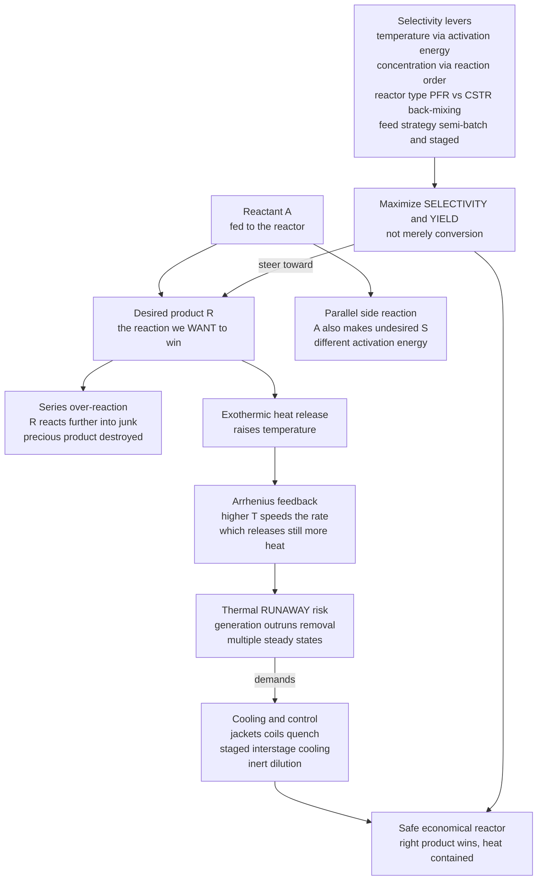

# ⚗️ Reactor Design and Multiple Reactions

> [!abstract] TL;DR
> Real reactions almost never do *only* what you want. A reactant makes your **desired product** but also spawns **byproducts** (parallel reactions, $A \to R$ vs $A \to S$), and your precious product can react **further into junk** (series reactions, $A \to R \to S$). So reactor design stops being about *conversion* alone and becomes a game of **steering**: you want the **right** reaction to win — high **selectivity** and **yield**, not just a lot of reaction. You have four real levers — **temperature** (favor the step with the higher or lower activation energy), **concentration** (favor different reaction orders), **reactor type** (a PFR preserves intermediate; a back-mixed CSTR destroys it), and **feed strategy** (semi-batch, staged/distributed feed, membrane reactors). Layered on top is a lethal complication: **exothermic reactions heat themselves up**, and heat speeds the rate (Arrhenius), which makes more heat — a self-amplifying loop that can end in **thermal runaway**. The heat-generation-versus-heat-removal balance produces **multiple steady states**, ignition, and extinction. Mastering multiple-reaction selectivity *and* non-isothermal stability is what separates a safe, economical reactor from a wasteful or explosive one.

## Intuition

**Analogy:** Imagine you run a kitchen and you want to caramelize onions. Turn the heat too high and you don't just get sweet golden onions — you *also* get bitter burnt bits (a competing reaction), and the onions you *did* caramelize keep cooking until they turn to charcoal (an over-reaction). Simply cooking "more" (more conversion) is not the goal; cooking the **right** thing while the **wrong** things stay small is the goal. You steer with your levers: the **burner temperature**, how **crowded the pan** is, whether you use a **flat wide pan or a deep pot** (how much the food mixes and back-mixes), and whether you **add ingredients all at once or a little at a time**. And there is a danger every cook knows — a pan of oil that starts smoking heats itself faster and faster until it bursts into flame. That is a **runaway**, and in a chemical reactor holding tonnes of reacting material it is not a ruined dinner but an explosion.

Translated to the plant: your reactant makes the molecule you can sell, but it *also* makes molecules you must separate out, purify away, and pay to dispose of — every byproduct is wasted raw material and extra separation cost. Meanwhile an **exothermic** reaction pours heat into its own pot; if the cooling cannot keep up, the temperature climbs, the rate climbs faster (the Arrhenius law from [[Chemical_Kinetics]]), the heat release climbs faster still, and the reactor runs away. Real reactor design is optimizing the desired product while dodging byproducts **and** thermal catastrophe — at once.

---

## How It Works

### Core Mechanics

1. **The goal shifts from conversion to selectivity and yield.** For a single clean reaction, *conversion* $X$ (fraction of reactant consumed) tells the whole story. With **multiple reactions** it does not. Define **selectivity** $S_{R/S}$ as moles of desired product $R$ made per mole of undesired product $S$, and **yield** $Y_R$ as moles of $R$ made per mole of reactant fed. High conversion with low selectivity is a disaster — you have consumed all your feedstock making garbage.

2. **Two archetypes of "extra" reactions.**
   - **Parallel (competing) reactions:** $A \to R$ (desired, rate $\propto k_1 C_A^{\alpha_1}$) and $A \to S$ (undesired, rate $\propto k_2 C_A^{\alpha_2}$). The **instantaneous selectivity** is the ratio of the two rates, $\dfrac{r_R}{r_S} = \dfrac{k_1}{k_2}\,C_A^{\alpha_1 - \alpha_2}$.
   - **Series (sequential) reactions:** $A \to R \to S$. Here $R$ is an **intermediate** — it is created, then over-reacted into $S$. Run the reactor too long and you convert everything, but your desired $R$ has already been eaten. There is an **optimum residence time** that maximizes $R$.

3. **Lever 1 — temperature (via activation energy).** From Arrhenius, $\dfrac{k_1}{k_2} = \dfrac{A_1}{A_2}\exp\!\left[-\dfrac{E_{a1}-E_{a2}}{RT}\right]$. If the **desired** step has the **higher** activation energy, raising temperature favors it — run **hot**. If the desired step has the **lower** activation energy, run **cold**. Temperature tilts the competition, and which way depends only on the sign of $E_{a1}-E_{a2}$.

4. **Lever 2 — concentration (via reaction order).** The selectivity ratio $C_A^{\alpha_1-\alpha_2}$ says: if the desired reaction is **higher order** in $A$ ($\alpha_1 > \alpha_2$), keep $C_A$ **high** (a batch or PFR at high concentration, high pressure for gases). If it is **lower order**, keep $C_A$ **low** (a CSTR that dilutes the reactant, or dropwise semi-batch addition).

5. **Lever 3 — reactor type (back-mixing matters).** A **PFR/batch** holds each element of fluid at high reactant concentration and moves it cleanly through, so the intermediate is exposed and then removed — good for series selectivity. A **CSTR** is perfectly **back-mixed**: every molecule sees the low outlet concentration and the intermediate lingers in the pool being destroyed — **back-mixing hurts series selectivity**. Which reactor wins depends on whether high or low concentration favors your desired step.

6. **Lever 4 — feed strategy.** You need not dump all reagents in at once. **Semi-batch** (slow addition of one reagent) keeps one concentration low; **staged / distributed feed** (side injections along a PFR) controls the local concentration profile; **membrane reactors** continuously *remove* a product to beat an equilibrium limit or *feed* a reactant gradually. Feed policy is a design variable as powerful as temperature.

7. **Non-isothermal design — couple the mole balance to the energy balance.** An exothermic reaction releases $(-\Delta H_{rxn})\,r\,V$ watts of heat. That raises $T$; Arrhenius makes $r$ climb **exponentially** with $T$; the heat release climbs with it. Cooling (a jacket, coils) removes heat roughly **linearly** in $T$: $\dot Q_{rem} = UA(T - T_c)$. **Where the exponential generation outruns the linear removal, no stable operating point exists** — the reactor undergoes **thermal runaway**. Plotting the two curves (the van Heerden / Semenov analysis) reveals **multiple steady states**: a cool "extinguished" branch, a hot "ignited" branch, and an unstable middle — with **ignition** and **extinction** jumps as coolant conditions change.

8. **Manage the heat.** The design answers are: **cooling** (jackets, internal coils, external heat exchangers), **quench** or cold-shot injection, **inert dilution** to lower the adiabatic rise, **staged adiabatic beds with inter-stage cooling** (as in SO$_3$ and ammonia converters), and tight **temperature control**. Parametric sensitivity — a runaway triggered by a tiny change in coolant temperature or feed rate — is a leading cause of industrial accidents, tying reactor design directly to *process safety*.

### Flow / Architecture



---

## Key Concepts

### Secondary Level

- **A reaction rarely does only what you want.** Alongside the product you are after, the same ingredients make **byproducts**, and your product can keep reacting into something useless. Making *a lot* of reaction is not the goal; making the **right** reaction is.
- **Selectivity vs conversion.** **Conversion** is how much reactant you used up. **Selectivity** is how much of what you made is the *good* stuff. You can have 100 percent conversion and still fail if it all turned into junk.
- **Levers you can pull.** You steer the outcome with a few knobs: **how hot** you run it, **how concentrated** the mixture is, **what shape of reactor** you use, and **how you add the ingredients** (all at once, or slowly).
- **Runaway heat is dangerous.** A reaction that gives off heat can warm itself up, which makes it go faster, which makes more heat — a vicious circle. If cooling cannot keep up, the reactor can overheat and explode. This is why big reactors have cooling and alarms.

### Undergraduate Level

- **Selectivity and yield, defined.** Overall selectivity $\tilde{S}_{R/S} = \dfrac{N_R}{N_S}$ (desired over undesired product); yield $Y_R = \dfrac{N_R}{N_{A0}-N_A}$ or $\dfrac{N_R}{N_{A0}}$ depending on convention. **Instantaneous** selectivity is the *rate* ratio $r_R/r_S$ at a point; **overall** selectivity integrates it over the reactor.
- **Parallel reactions — the concentration and temperature rules.** For $A \to R$ (order $\alpha_1$) and $A \to S$ (order $\alpha_2$): keep $C_A$ **high** if $\alpha_1 > \alpha_2$, **low** if $\alpha_1 < \alpha_2$. Run **hot** if $E_{a1} > E_{a2}$, **cold** if $E_{a1} < E_{a2}$. These two rules choose your reactor type and temperature.
- **Series reactions and the optimum residence time.** For $A \xrightarrow{k_1} R \xrightarrow{k_2} S$ in a PFR/batch, $C_R = C_{A0}\dfrac{k_1}{k_2-k_1}\left(e^{-k_1 t}-e^{-k_2 t}\right)$ peaks at $t_{opt} = \dfrac{\ln(k_2/k_1)}{k_2-k_1}$. Stop the reactor at $t_{opt}$; run longer and you destroy your product.
- **PFR vs CSTR for series selectivity.** Because a CSTR forces the whole feed to the *low* outlet concentration where the intermediate sits and is consumed, a **PFR gives higher intermediate yield** than a CSTR for series reactions. Back-mixing is the enemy of a fragile intermediate.
- **The adiabatic temperature rise.** With no cooling, energy balance gives $T = T_0 + \dfrac{(-\Delta H_{rxn})\,X}{\sum \theta_i C_{p,i}}$ — the temperature climbs **linearly with conversion**. The maximum rise, $\dfrac{-\Delta H_{rxn}}{\sum \theta_i C_{p,i}}$, tells you instantly whether the reactor can cook itself past the point of no return; **inert dilution** shrinks it.
- **Heat generation vs heat removal.** In a cooled CSTR, $\dot Q_{gen}(T) = (-\Delta H_{rxn})\,F_{A0}\,X(T)$ is an **S-shaped** curve of $T$ (sigmoidal, from Arrhenius through the conversion), while $\dot Q_{rem}(T) = \dot m C_p (T-T_0) + UA(T-T_c)$ is a **straight line**. Their intersections are steady states; one line can cross the S-curve **three times**.

### Graduate Level

- **Multiplicity, ignition, and extinction.** The three-intersection case gives a **stable low (extinguished)** branch, an **unstable middle**, and a **stable high (ignited)** branch. Slowly raising the coolant temperature slides the removal line until the low and middle states annihilate — the reactor **ignites**, jumping discontinuously to the hot branch. Lowering it later triggers **extinction** at a *different* coolant temperature: a **hysteresis loop**. This is a **saddle-node (fold) bifurcation** — the same mathematics as [[Bifurcations_and_Tipping_Points]] and the [[Systems_of_ODEs]] phase-plane analysis of nonlinear systems.
- **Stability criterion (van Heerden / Semenov).** A steady state is stable when the removal line is *steeper* than the generation curve there, $\dfrac{d\dot Q_{rem}}{dT} > \dfrac{d\dot Q_{gen}}{dT}$. The **slope condition** is necessary but, for the CSTR dynamic model, the full **Semenov / Aris–Amundson** analysis adds a dynamic (oscillatory) criterion — a CSTR can exhibit limit-cycle oscillations even at a slope-stable point.
- **Parametric sensitivity and runaway in a PFR/tubular reactor.** A cooled tubular reactor can develop a **hot spot** whose peak temperature is hypersensitive to inlet temperature, coolant temperature, or wall coefficient $U$ — a tiny parameter change causes a huge excursion (the Barkelew / Semenov criteria bound the safe region). This *parametric sensitivity* is precisely the tipping-point behavior of a [[Nonlinearity_and_Feedback]] system near criticality.
- **Optimal reactor networks and feed policy.** For complex networks, the **attainable region** method finds the reactor configuration (combinations of PFRs, CSTRs, mixing, and side-feed) that maximizes yield — proving, for instance, that a **staged/distributed feed** or a PFR-then-CSTR train beats any single ideal reactor. Semi-batch and membrane reactors extend the concentration-profile control into time and space.
- **Non-isothermal multiple reactions.** When *both* selectivity *and* thermal effects act together, temperature is a two-edged sword: the temperature that maximizes rate may wreck selectivity (favoring a high-$E_a$ byproduct) or approach runaway. Real design solves the coupled species and energy balances (often stiff [[Systems_of_ODEs]]) simultaneously, frequently with an optimal **temperature progression** down the reactor.
- **Equilibrium-limited exothermics.** For reversible exothermic reactions the *equilibrium* conversion falls with temperature (see [[Chemical_Reaction_Equilibrium]] and [[Chemical_Equilibrium]]) while the *rate* rises — the optimum is a **declining temperature trajectory** or staged adiabatic beds with inter-stage cooling that chase the shifting equilibrium (ammonia, SO$_3$, water-gas shift).

---

## Python Demo

```python
# Reactor design with MULTIPLE REACTIONS and THERMAL EFFECTS.
#
# (a) SELECTIVITY in a SERIES reaction  A --k1--> R (desired) --k2--> S (junk),
#     run in a plug-flow / batch reactor. The intermediate R rises, PEAKS, then
#     is over-reacted into S -> there is an OPTIMUM residence time. The two steps
#     have DIFFERENT activation energies, so TEMPERATURE tilts the competition:
#     running hotter is faster but (here) less selective.
#
# (b) THERMAL RUNAWAY / MULTIPLICITY in a cooled CSTR: heat GENERATION is an
#     S-shaped Arrhenius curve, heat REMOVAL is a straight line. They can cross
#     THREE times (multiple steady states). Sweeping the coolant temperature
#     reveals IGNITION and EXTINCTION jumps -- a hysteresis loop (fold bifurcation).
#
# Requires: numpy, matplotlib
import numpy as np
import matplotlib.pyplot as plt

R = 8.314   # J/mol/K

# =====================================================================
# PART (a): SERIES reaction  A -> R -> S   (selectivity vs residence time)
# Arrhenius rate constants; the DESIRED formation step (k1) has the LOWER
# activation energy, so running COLD preserves R (but takes longer).
# =====================================================================
A1, Ea1 = 5.0e5, 50e3     # A -> R  (make the desired product)
A2, Ea2 = 1.0e8, 85e3     # R -> S  (destroy it; higher Ea -> punished more by heat)
CA0 = 1.0

def ks(T):
    return A1*np.exp(-Ea1/(R*T)), A2*np.exp(-Ea2/(R*T))

def series_profile(T, t):
    k1, k2 = ks(T)
    CA = CA0*np.exp(-k1*t)
    CR = CA0*k1/(k2 - k1)*(np.exp(-k1*t) - np.exp(-k2*t))
    XA = 1.0 - np.exp(-k1*t)
    t_opt = np.log(k2/k1)/(k2 - k1)          # residence time that maximizes R
    CR_max = CA0*k1/(k2 - k1)*(np.exp(-k1*t_opt) - np.exp(-k2*t_opt))
    return CA, CR, XA, t_opt, CR_max

t = np.linspace(0.0, 800.0, 1200)            # residence time, seconds
T_cold, T_hot = 350.0, 420.0
CA_c, CR_c, XA_c, topt_c, CRmax_c = series_profile(T_cold, t)
CA_h, CR_h, XA_h, topt_h, CRmax_h = series_profile(T_hot,  t)

print("=== (a) SERIES A -> R -> S : optimum residence time & peak yield of R ===")
print(f"  COLD run T={T_cold:.0f} K :  t_opt = {topt_c:6.1f} s ,  max yield of R = {CRmax_c:0.3f}")
print(f"  HOT  run T={T_hot:.0f} K :  t_opt = {topt_h:6.1f} s ,  max yield of R = {CRmax_h:0.3f}")
print("  -> hotter reaches the peak FASTER but at LOWER selectivity (R destroyed sooner)")

# =====================================================================
# PART (b): cooled CSTR -- heat GENERATION (S-curve) vs REMOVAL (lines)
# First-order reaction, steady-state conversion  X = tau*k/(1+tau*k).
# =====================================================================
Ea, Apre = 80e3, 1.0e10
tau   = 60.0          # s, mean residence time
FA0   = 1.0           # mol/s
negdH = 100e3         # J/mol, exothermic (heat released per mole reacted)
T0    = 300.0         # K, feed temperature
mCp   = 250.0         # W/K, flowing-stream heat capacity
UA    = 450.0         # W/K, jacket heat-transfer coefficient * area

def Qgen(T):
    k = Apre*np.exp(-Ea/(R*T))
    X = tau*k/(1.0 + tau*k)
    return negdH*FA0*X                        # S-shaped in T

def Qrem(T, Tc):
    return mCp*(T - T0) + UA*(T - Tc)         # straight line in T

Tg = np.linspace(280.0, 520.0, 1200)
Qg = Qgen(Tg)

# steady states = roots of Qgen - Qrem, found by sign changes on the grid
def steady_states(Tc):
    f = Qgen(Tg) - Qrem(Tg, Tc)
    roots = []
    for i in range(len(Tg)-1):
        if f[i] == 0.0 or f[i]*f[i+1] < 0.0:
            # linear interpolation for the crossing temperature
            Tr = Tg[i] - f[i]*(Tg[i+1]-Tg[i])/(f[i+1]-f[i])
            roots.append(Tr)
    return roots

for Tc in (250.0, 300.0, 350.0):
    ss = steady_states(Tc)
    print(f"\n=== (b) cooled CSTR, coolant Tc={Tc:.0f} K : {len(ss)} steady state(s) ===")
    print("   T_ss = " + ", ".join(f"{s:.0f} K" for s in ss)
          + ("   -> MULTIPLICITY (low / unstable / ignited)" if len(ss) == 3 else ""))

# ignition / extinction hysteresis: sweep coolant temperature, record all roots
Tc_sweep = np.linspace(230.0, 380.0, 400)
lo, mid, hi = [], [], []
for Tc in Tc_sweep:
    ss = sorted(steady_states(Tc))
    lo.append(ss[0]);            hi.append(ss[-1])
    mid.append(ss[1] if len(ss) == 3 else np.nan)

# =====================================================================
# PLOTS  (2 x 2)
# =====================================================================
fig, ax = plt.subplots(2, 2, figsize=(13, 9))
fig.suptitle("Reactor Design & Multiple Reactions: selectivity optimum + thermal runaway",
             fontsize=14, fontweight="bold")

# A. series intermediate R vs residence time (optimum), two temperatures
axA = ax[0, 0]
axA.plot(t, CR_c, color="#2563eb", lw=2.5, label=f"R at {T_cold:.0f} K (cold, selective)")
axA.plot(t, CR_h, color="#dc2626", lw=2.5, label=f"R at {T_hot:.0f} K (hot, fast)")
axA.plot(t, CA0*np.exp(-ks(T_cold)[0]*t), color="#2563eb", lw=1.0, ls=":", label="A (cold)")
axA.axvline(topt_c, color="#2563eb", ls="--", lw=1.0)
axA.axvline(topt_h, color="#dc2626", ls="--", lw=1.0)
axA.plot([topt_c, topt_h], [CRmax_c, CRmax_h], "ko", ms=6)
axA.set_xlabel("residence time  t  [s]"); axA.set_ylabel("concentration / CA0")
axA.set_title("A. Series A->R->S: desired R peaks then is over-reacted\n(dashed = optimum residence time)")
axA.legend(loc="upper right", fontsize=8); axA.grid(alpha=0.3); axA.set_xlim(0, 800)

# B. SELECTIVITY vs CONVERSION optimum (yield of R against conversion of A)
axB = ax[0, 1]
axB.plot(XA_c, CR_c, color="#2563eb", lw=2.5, label=f"{T_cold:.0f} K (cold)")
axB.plot(XA_h, CR_h, color="#dc2626", lw=2.5, label=f"{T_hot:.0f} K (hot)")
axB.plot(1-np.exp(-ks(T_cold)[0]*topt_c), CRmax_c, "ko", ms=6)
axB.plot(1-np.exp(-ks(T_hot)[0]*topt_h),  CRmax_h, "ko", ms=6)
axB.set_xlabel("conversion of A,  X_A"); axB.set_ylabel("yield of desired R  (CR / CA0)")
axB.set_title("B. Selectivity-vs-conversion: an OPTIMUM exists\npushing conversion too far destroys R")
axB.legend(loc="upper left", fontsize=9); axB.grid(alpha=0.3)
axB.set_xlim(0, 1); axB.set_ylim(0, 1)

# C. heat GENERATION S-curve vs heat REMOVAL lines -> multiplicity & runaway
axC = ax[1, 0]
axC.plot(Tg, Qg/1e3, color="#7c3aed", lw=3.0, label="heat GENERATION (Arrhenius S-curve)")
for Tc, col in zip((250.0, 300.0, 350.0), ("#059669", "#ea580c", "#dc2626")):
    axC.plot(Tg, Qrem(Tg, Tc)/1e3, lw=2.0, color=col, label=f"removal, Tc = {Tc:.0f} K")
    for s in steady_states(Tc):
        axC.plot(s, Qgen(s)/1e3, "o", color=col, ms=7, mec="k", mew=0.6)
axC.set_xlabel("reactor temperature  T  [K]"); axC.set_ylabel("heat rate  [kW]")
axC.set_title("C. Cooled CSTR: generation (curve) vs removal (lines)\nTc=300 K -> THREE steady states")
axC.legend(loc="upper left", fontsize=8); axC.grid(alpha=0.3)
axC.set_ylim(0, 130)

# D. ignition / extinction hysteresis of steady-state reactor temperature
axD = ax[1, 1]
axD.plot(Tc_sweep, lo,  color="#059669", lw=2.5, label="stable LOW (extinguished) branch")
axD.plot(Tc_sweep, hi,  color="#dc2626", lw=2.5, label="stable HIGH (ignited) branch")
axD.plot(Tc_sweep, mid, color="gray", lw=1.8, ls="--", label="UNSTABLE middle branch")
axD.set_xlabel("coolant temperature  Tc  [K]"); axD.set_ylabel("steady-state reactor T  [K]")
axD.set_title("D. Hysteresis: raise Tc -> IGNITION jump up;\nlower Tc -> EXTINCTION jump down (fold bifurcation)")
axD.legend(loc="upper left", fontsize=8); axD.grid(alpha=0.3)

plt.tight_layout(rect=[0, 0, 1, 0.95])
plt.show()
```

Running this prints the series-reaction optima and the CSTR steady-state counts, then draws four panels. Panel **A** shows the desired intermediate $R$ **rising, peaking, and then being over-reacted into junk** in a series reaction; the cold run (blue) reaches a *higher* peak yield but only after a much longer residence time, while the hot run (red) peaks fast but lower — the temperature-versus-selectivity trade-off made visible, with the **optimum residence time** marked. Panel **B** replots the same runs as **yield of $R$ versus conversion of $A$**, exposing the **selectivity-versus-conversion optimum**: chasing higher conversion past the peak *destroys* your product. Panel **C** is the safety picture — the S-shaped **heat-generation** curve against straight **heat-removal** lines; for a coolant temperature of 300 K the line crosses the curve **three times** (low, unstable, ignited), the signature of **multiplicity**. Panel **D** turns those crossings into the classic **hysteresis loop**: nudge the coolant temperature up and the low branch vanishes so the reactor **ignites** and jumps to the hot branch; bring it back down and the reactor **extinguishes** at a *different* temperature — a fold bifurcation and the mathematical heart of runaway.

---

## Real-World Applications

> **Example — ethylene oxide from ethylene ($C_2H_4 + \tfrac{1}{2}O_2 \to$ ethylene oxide).** This is the textbook selectivity-and-safety reactor. The desired partial oxidation to ethylene oxide competes with the far more exothermic **total combustion** to $CO_2 + H_2O$ — a parallel reaction that not only wastes feedstock but dumps enormous heat. The reactor is a **multitubular fixed bed** with thousands of narrow silver-catalyst tubes bathed in **boiling coolant**, deliberately small in diameter to shed heat and hold selectivity around 80 to 90 percent. Push the temperature a little too high and combustion wins **and** the tubes approach thermal runaway — both failure modes at once. Every design choice (tube diameter, coolant temperature, dilution) is a compromise between selectivity and thermal stability.

- **Sulfuric acid — SO$_2$ oxidation ($2SO_2 + O_2 \rightleftharpoons 2SO_3$).** Exothermic and equilibrium-limited, so the Contact process uses **four adiabatic catalyst beds with inter-stage cooling**: each bed lets the temperature rise (fast kinetics), then coolers drop it back toward the favorable equilibrium before the next bed — chasing the shifting [[Chemical_Reaction_Equilibrium]] to over 99.7 percent conversion.
- **Ammonia synthesis ($N_2 + 3H_2 \rightleftharpoons 2NH_3$).** Exothermic and reversible; converters use **quench (cold-shot) or inter-bed cooling** so the temperature follows a descending trajectory that balances rate against the collapsing equilibrium ceiling.
- **Nitration, polymerization, and batch fine-chemistry — where runaways happen.** Nitrations, epoxidations, and many polymerizations are strongly exothermic and often run in **semi-batch** mode: one reagent is fed **slowly** precisely so that the accumulated unreacted material — and therefore the potential heat release if cooling fails — stays bounded. The **1976 Seveso** dioxin release and numerous batch-reactor explosions trace to heat generation outrunning heat removal; controlling feed rate and cooling *is* the safety system (see the process-safety-and-hazard-analysis note).
- **Steam cracking and selective hydrogenation.** Cracking naphtha to ethylene exploits **very short residence times and rapid quench** to grab the desired olefins before series reactions carbonize them — a direct use of the series-reaction optimum-residence-time idea. Selective hydrogenation (e.g. acetylene to ethylene without going to ethane) tunes temperature and catalyst to win a series/parallel selectivity battle.
- **Process simulators and dynamic safety analysis.** Aspen Plus, gPROMS, and Cantera solve the coupled species-and-energy [[Systems_of_ODEs]] to predict hot spots, multiplicity, and runaway envelopes; dynamic simulation of the ignition/extinction hysteresis sizes relief systems and sets safe operating windows.

---

## Common Pitfalls

- **Optimizing conversion instead of selectivity/yield.** The classic beginner error: pushing a series reaction to near-complete conversion, only to find the desired intermediate has already been over-reacted into byproduct. **Stop at the optimum residence time**, not at maximum conversion — often the economic optimum runs at *modest* conversion with recycle.
- **Choosing the wrong reactor for the selectivity you need.** Using a CSTR for a series reaction because it is "well mixed and easy to control" — back-mixing drags every molecule to the low outlet concentration where the intermediate is destroyed. Match the reactor to the concentration/order rule: PFR/high-$C_A$ when the desired step is higher order, CSTR/low-$C_A$ when it is lower order.
- **Getting the temperature direction backwards.** Raising temperature helps selectivity *only* if the desired step has the higher activation energy. Blindly "running hotter for more rate" can accelerate a high-$E_a$ **byproduct** faster than your product and simultaneously march toward runaway. Always check the sign of $E_{a,\text{desired}} - E_{a,\text{undesired}}$.
- **Designing from an isothermal model when the reaction is exothermic.** An isothermal mole balance hides the entire thermal-stability problem. A reactor stable on paper can have a **hidden ignited steady state** and hysteresis; you must solve the coupled energy balance and check the slope/stability condition.
- **Underestimating parametric sensitivity.** Near the runaway boundary, a 2 to 3 K change in coolant temperature or a small drop in the heat-transfer coefficient $U$ (fouling!) can flip a safe reactor into runaway. Design with margin and monitor $U$ — do not sit on the edge of the fold.
- **Ignoring accumulation in semi-batch reactions.** Feeding a reagent faster than it reacts lets **unreacted material accumulate**; if the reaction then "wakes up" (temperature rises, or the inhibitor is exhausted) all that stored potential releases at once — a delayed runaway. The feed rate must be limited by the *cooling capacity*, not convenience.
- **Neglecting the equilibrium ceiling for reversible exothermics.** Cranking temperature for rate can push a reversible exothermic reaction *past* its equilibrium optimum, where conversion actually falls — the reason staged inter-cooled beds exist (see [[Chemical_Reaction_Equilibrium]]).

---

## Related Concepts

This note is the culmination of the reaction-engineering section, tying kinetics, ideal reactors, and energy balances into real design. Within this Chemical Engineering vault it builds directly on *Chemical_Reaction_Engineering_Overview* (the section's framing of conversion, rate, and reactor sizing), *Ideal_Reactors_Batch_CSTR_PFR* (the batch/CSTR/PFR models whose back-mixing differences decide series selectivity), *Reaction_Kinetics_and_Rate_Laws* (the Arrhenius temperature dependence and reaction orders that are the very levers of selectivity and the engine of runaway), *Energy_Balances_in_Processes* (the first-law bookkeeping that becomes the reactor energy balance and the heat-generation-versus-removal analysis), and it is the analytical core of *Process_Safety_and_Hazard_Analysis* (runaway prevention, relief sizing, and inherently safer design).

**The reaction science being scaled up (Chemistry vault)**
- [[Chemical_Kinetics]] — the Arrhenius rate and reaction orders that this note turns into selectivity levers and the exponential feedback behind thermal runaway.
- [[Chemical_Equilibrium]] — the beaker-scale law of mass action that limits reversible reactions and forces the inter-cooled staging of exothermic reactors.

**Sibling in this vault (thermodynamic ceiling)**
- [[Chemical_Reaction_Equilibrium]] — fixes the maximum attainable conversion; for reversible exothermics it fights the rate, dictating declining-temperature and staged-bed designs.

**The nonlinear-dynamics backbone (Systems Thinking & Mathematics)**
- [[Nonlinearity_and_Feedback]] — the self-amplifying heat-rate-heat loop is a positive feedback whose runaway is a nonlinear instability.
- [[Bifurcations_and_Tipping_Points]] — ignition and extinction are a saddle-node (fold) bifurcation; the reactor's hysteresis is a textbook tipping point.
- [[Systems_of_ODEs]] — the coupled species-and-energy balances are a nonlinear ODE system whose steady states and stability are exactly this note's multiplicity analysis.

**The heat-management engineering (Mechanical Engineering vault)**
- [[Convection_and_Radiation]] — the convective heat-transfer coefficient behind $UA$ that sets how fast a reactor can shed reaction heat.
- [[Heat_Exchangers_and_HVAC]] — the jackets, coils, and external exchangers that physically implement the heat removal the reactor energy balance demands.

---

## Review Questions

**Secondary**
1. A factory makes a valuable chemical, but the same reaction also produces a worthless byproduct, and if the mixture cooks too long the valuable product itself turns into tar. Explain why simply "reacting as much as possible" (high conversion) is a bad goal here, and name two knobs the engineer could turn to make *more* of the good product and *less* of the bad. Why is it dangerous if the reaction gives off a lot of heat?

**Undergraduate**
2. You must run the series reaction $A \xrightarrow{k_1} R \xrightarrow{k_2} S$ where $R$ is the product you want to sell. (a) Explain why there is an *optimum* residence time and what happens if you run longer. (b) The formation step $A \to R$ has a *lower* activation energy than the destruction step $R \to S$ — should you run the reactor hot or cold to maximize selectivity, and what do you sacrifice by that choice? (c) Would you choose a PFR or a CSTR, and why does back-mixing matter?

**Graduate**
3. A cooled CSTR runs a strongly exothermic first-order reaction. On axes of heat rate versus temperature, sketch the heat-generation curve and the heat-removal line, and show a case with three steady states. (a) Which states are stable and why, in terms of the slope condition? (b) Describe what happens to the operating point as you slowly raise the coolant temperature, and explain why bringing it back down does *not* retrace the same path — name the type of bifurcation. (c) A colleague proposes running at the middle steady state because its temperature is "moderate." Explain, using both the static slope condition and the idea of parametric sensitivity, why this is unsafe.

---

## Sources

- H. S. Fogler — *Elements of Chemical Reaction Engineering*, 6th ed. (Prentice Hall, 2020). Chapters on multiple reactions, selectivity, and non-isothermal reactor design and multiple steady states.
- O. Levenspiel — *Chemical Reaction Engineering*, 3rd ed. (Wiley, 1999). Parallel/series reactions, selectivity, and the optimum residence time; reactor-type comparisons.
- G. F. Froment, K. B. Bischoff & J. De Wilde — *Chemical Reactor Analysis and Design*, 3rd ed. (Wiley, 2010). Non-isothermal design, multiplicity, parametric sensitivity, and runaway.
- J. B. Rawlings & J. G. Ekerdt — *Chemical Reactor Analysis and Design Fundamentals*, 2nd ed. (Nob Hill, 2012). Coupled mass and energy balances, steady-state multiplicity, and stability.

---

#chemical-engineering #selectivity #multiple-reactions #thermal-runaway #reactor-design
