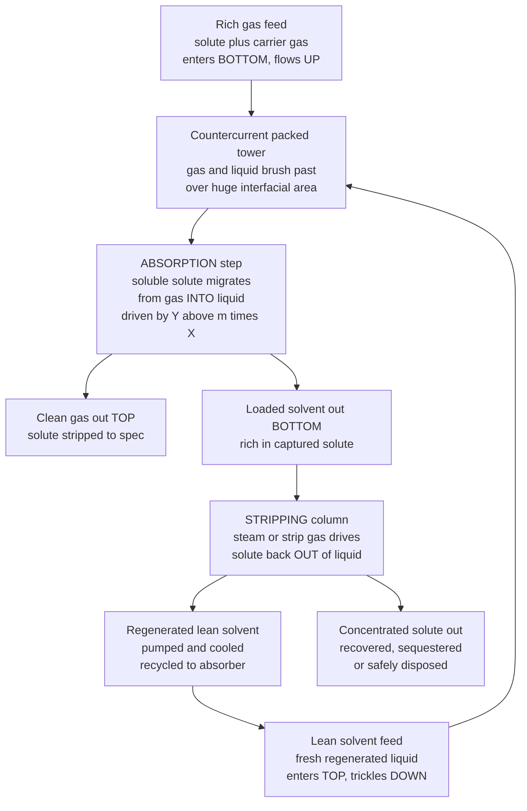

# 🧼 Absorption and Stripping

> [!abstract] TL;DR
> **Absorption** and **stripping** are the gas-liquid workhorse separations that move a single component between a gas and a liquid phase. In **absorption** a soluble gas component (the **solute**) is washed out of a gas mixture *into* a liquid **solvent** by contacting the two **countercurrently** — gas rising, solvent trickling down — in a **packed or tray tower**; the transfer is driven by the solute's departure from **equilibrium** (Henry's law, $y = m\,x$, for dilute solubility), and can be **physical** (pure dissolution) or **chemical/reactive** (the solvent reacts with the solute, e.g. amines grabbing CO2 and H2S, for far higher capacity). **Stripping** (desorption) is the identical move run backwards: a stripping medium (steam, air, or an inert gas) blows the dissolved solute back *out* of the liquid, **regenerating the solvent** so it can be pumped back to the absorber — closing the reusable absorption-stripping loop. Design turns on two lines on mole-ratio axes: the **operating line** (a mass balance, slope $L/G$, the liquid-to-gas ratio) versus the **equilibrium line** (Henry's law, slope $m$); you either **step off theoretical stages** between them or use the **NTU/HTU transfer-unit** method for packed columns, whose height is set by mass-transfer rate. The **minimum solvent rate** is the flow at which the operating line just *touches* the equilibrium line (a pinch → infinite stages), and every real design trades **more solvent** (fewer stages, shorter tower) against **more pumping and regeneration energy**. This is the rate-limited separation behind **gas sweetening**, **flue-gas SO2/VOC scrubbing**, **solvent recovery**, and — critically — **amine carbon capture**, one of the most consequential decarbonization technologies on earth.

## Intuition

**Analogy:** You want one unwanted gas gone from a mixture — say you need to scrub the toxic **H2S** and the acidic **CO2** out of a raw natural-gas stream before it can be sold or burned. So you **wash the gas with a liquid that the target loves to dissolve into**, exactly the way a rainstorm scrubs dust and soot out of the air: the falling water grabs the particles and carries them to the ground, leaving the sky washed clean. That washing move *is* **absorption** — run the dirty gas **up** a tall tower packed with material that spreads the liquid into a thin, enormous-area film, while the clean solvent trickles **down** through it; as gas and liquid brush past each other in opposite directions, the target molecules migrate out of the gas and into the liquid, so **cleaned gas leaves the top** and **loaded solvent leaves the bottom**.

Now, that loaded solvent is expensive and you cannot just throw it away — so you run the same move **backwards**. In a second tower you blow a hot gas (steam) through the loaded liquid to **yank the dissolved solute back out**, concentrating it into a small stream and **regenerating** the solvent so you can pump it right back to the absorber. That reverse step is **stripping**. Put the two towers together and you have built a **reusable molecular sponge for gases**: the absorber soaks the target up, the stripper wrings the sponge out, and the solvent circulates forever between them. The only questions an engineer must answer are *how tall* each tower has to be and *how much solvent* to circulate — and both answers come from a simple race between where the molecules *want* to end up (equilibrium) and how fast they can *get there* (mass transfer).

---

## How It Works

### Core Mechanics

1. **Countercurrent contacting maximizes the driving force.** Gas enters the **bottom** rich in solute and flows **up**; lean solvent enters the **top** and flows **down**. Running them in opposite directions keeps a gap between the gas composition and the composition it *would* have if it were in equilibrium with the local liquid — everywhere in the column. The rich gas at the bottom meets the most-loaded liquid, and the nearly-clean gas at the top meets the freshest solvent, so there is a positive driving force at **both** ends. Cocurrent flow, by contrast, would drive the two streams toward a single equilibrium and quit halfway.

2. **Equilibrium sets the destination (Henry's law).** For a dilute, physically absorbed solute the vapor and liquid at the interface obey **Henry's law**, $y_A = m\,x_A$ (or $p_A = H\,C_A$), where the slope $m$ measures how badly the solute wants to stay in the gas. A **small $m$ means high solubility** (the liquid is greedy for the solute — easy absorption), a **large $m$ means low solubility** (the solute clings to the gas — hard absorption, and the natural direction for *stripping*). This equilibrium line is the wall the operating line can approach but never cross.

3. **A mass balance sets the path (the operating line).** Envelope the top of the column down to any plane and balance the solute: what the gas gives up, the liquid must gain. In **mole-ratio** coordinates $Y$ (mol solute per mol carrier gas) and $X$ (mol solute per mol solvent), the balance is a **straight line** $Y = Y_\text{out} + \tfrac{L_s}{G_s}\,(X - X_\text{in})$ whose **slope is the liquid-to-gas ratio $L_s/G_s$**. For absorption the operating line lies **above** the equilibrium line (gas richer than equilibrium → solute flows into liquid); for stripping it lies **below** (liquid richer than equilibrium → solute flows out into gas).

4. **Stages or transfer units size the column.** For a **tray tower** you count **theoretical stages** by *stepping off* a staircase between the operating and equilibrium lines (McCabe-Thiele style), or compute them in one shot with the **Kremser equation** using the **absorption factor** $A = L_s/(m\,G_s)$. For a **packed tower** the separation is continuous and mass-transfer-limited, so height is written as $Z = H_{OG}\cdot N_{OG}$: the **number of transfer units** $N_{OG}=\int \mathrm{d}y/(y-y^{*})$ measures the *difficulty* of the separation, and the **height of a transfer unit** $H_{OG}=G/(K_G a\,P)$ bundles the mass-transfer coefficient and interfacial area (the *rate* of the separation). Height is literally difficulty times resistance.

5. **The minimum solvent rate is a pinch.** If you starve the column of solvent, the loaded liquid leaving the bottom rises toward equilibrium with the incoming rich gas; at the **minimum $L_s/G_s$** the operating line just **touches** the equilibrium line (a *pinch point*), the driving force there collapses to zero, and you would need **infinitely many stages / infinite height** to finish the job. Real designs run at roughly **1.2 to 1.5 times the minimum** — steepening the operating line pulls it away from the equilibrium line, shrinking the stage count at the cost of pumping and regenerating more solvent.

6. **Stripping closes the loop, and chemistry supercharges capacity.** The loaded solvent is sent to a **stripper**, where raising temperature (steam) or lowering pressure flips the equilibrium so the solute boils back out, concentrating it and returning **lean solvent** to the absorber. **Chemical (reactive) absorption** — an amine that chemically bonds CO2 or H2S rather than merely dissolving it — bends the equilibrium line down dramatically, letting a small solvent flow carry a huge solute load; the price is paid back in the **regeneration energy** needed to reverse the reaction in the stripper (the reboiler duty that dominates carbon-capture operating cost).

### Flow / Architecture



---

## Key Concepts

### Secondary Level

- **Absorption is washing a gas with a liquid.** To pull one gas out of a mixture, you run it up a tall tower while a liquid it dissolves into trickles down; the target gas jumps into the liquid, so clean gas leaves the top and dirty liquid leaves the bottom — just like rain scrubbing dust from the air.
- **Stripping is the same thing in reverse.** Blow a gas (usually steam) through the loaded liquid and the dissolved stuff comes back out, so you can **reuse the liquid**. Absorb, then strip, then absorb again — the solvent goes round and round like a sponge you keep wringing out.
- **Countercurrent means opposite directions.** Gas goes up, liquid comes down. Running them against each other keeps the "pull" going all the way through the tower, so it cleans the gas far better than if both flowed the same way.
- **Some liquids grab the gas by dissolving it, some by reacting with it.** Plain dissolving (physical absorption) works for easy gases; for tough ones like CO2, a liquid that **chemically reacts** with the gas (an amine) holds far more of it — which is exactly how carbon capture works.
- **More solvent means a shorter tower, but it costs more.** Pump more liquid and you need fewer stages to hit your target — but pumping and re-cleaning all that liquid burns energy. Every design balances the two.

### Undergraduate Level

- **Operating line vs equilibrium line (the whole design on one graph).** Plot solute in the liquid ($X$) against solute in the gas ($Y$) as **mole ratios**. The **equilibrium line** is Henry's law $Y^{*} = m\,X$; the **operating line** is the column mass balance $Y = Y_\text{out} + (L_s/G_s)(X - X_\text{in})$, a straight line of slope $L_s/G_s$. Absorption puts the operating line **above** equilibrium; stripping puts it **below**. The vertical gap between them is the local driving force.
- **Stepping off stages.** Starting at the lean (top) end, alternate horizontal moves to the equilibrium line and vertical moves to the operating line; each step is one **theoretical stage**. A steeper operating line (more solvent) sits farther from equilibrium and takes **fewer, bigger steps** — fewer stages.
- **The Kremser equation.** For dilute systems with straight lines, the theoretical stage count is
  $$N = \frac{\ln\!\left[\dfrac{Y_{N+1}-m X_0}{Y_1 - m X_0}\left(1-\dfrac{1}{A}\right)+\dfrac{1}{A}\right]}{\ln A},\qquad A=\frac{L_s}{m\,G_s},$$
  where $A$ is the **absorption factor**; $A>1$ gives a workable absorber, $A<1$ favors stripping.
- **Minimum solvent rate.** The pinch condition (loaded liquid in equilibrium with entering rich gas) gives
  $$\left(\frac{L_s}{G_s}\right)_\text{min}=\frac{Y_{N+1}-Y_1}{Y_{N+1}/m - X_0},$$
  at which $A\to$ the pinch and $N\to\infty$. Designers pick $L_s/G_s \approx 1.2$–$1.5\times$ this minimum.
- **NTU/HTU for packed columns.** Instead of discrete stages, packed height is $Z=H_{OG}\,N_{OG}$ with $N_{OG}=\int_{y_\text{out}}^{y_\text{in}}\mathrm{d}y/(y-y^{*})$ (separation difficulty) and $H_{OG}=G/(K_G a\,P)$ (rate resistance, containing the overall mass-transfer coefficient $K_G$ and the interfacial area per volume $a$).
- **Packing, flooding, and pressure drop.** Random (Raschig, Pall rings) or structured packing manufactures interfacial area $a$. Push gas and liquid too hard and the tower **floods** (liquid backs up, pressure drop soars); columns are designed at a fixed fraction (often ~70 percent) of the flooding velocity.

### Graduate Level

- **Physical vs reactive absorption and the enhancement factor.** Chemical reaction in the liquid film consumes solute *as it arrives*, steepening the concentration gradient and **enhancing** the liquid-side flux by a factor $E$ tied to the **Hatta number** $Ha=\sqrt{k_r D_A}/k_L^0$. For a fast pseudo-first-order reaction $E\approx Ha$, so the liquid-film resistance collapses and the process becomes **gas-film controlled** — the whole reason amine absorbers are so compact for a gas as sparingly soluble as CO2. The bridge here is [[Chemical_Kinetics]]: reaction rate and transport rate compete inside the same film.
- **Rate-based vs equilibrium-stage modeling.** The equilibrium-stage (Kremser / stage-efficiency) picture is a convenient fiction; modern column simulation is **rate-based**, solving simultaneous Maxwell-Stefan multicomponent mass transfer, film reaction, and heat effects on each segment. This matters most for reactive systems where the "stage" never reaches equilibrium and Murphree efficiencies exceed 100 percent or go negative.
- **Non-isothermal absorption.** Dissolving and (especially) reacting release the **heat of absorption**, so the liquid warms as it descends. Since solubility falls with temperature, this raised temperature bulge can create an internal pinch that a purely isothermal design misses — coupling the solute balance to an [[Laws_of_Thermodynamics|energy balance]] is essential for concentrated systems like CO2 in aqueous amines.
- **Solvent selection and the regeneration-energy penalty.** The choice of solvent (MEA, MDEA, piperazine-promoted blends, chilled ammonia, physical solvents like Selexol/Rectisol) is an optimization over **cyclic capacity**, reaction kinetics, corrosivity, degradation, and above all **reboiler duty**. In post-combustion capture the **stripper regeneration energy** (roughly 3–4 GJ per tonne CO2 for conventional MEA, driving research toward advanced solvents) dominates operating cost — the absorption side is easy; wringing the sponge out cheaply is the hard part.
- **Minimum work and the second law.** The thermodynamic floor for separating a dilute solute is the **minimum work of separation**, $-RT\sum x_i\ln x_i$-type mixing-reversal, set by the [[Laws_of_Thermodynamics|second law]]. Real absorption-stripping loops run at a large multiple of this floor; the gap (largely the latent heat cycled through the reboiler) is where process intensification, heat integration, and advanced solvents chase efficiency.
- **Coupled column design and the L/G optimum.** The absorber and stripper are not independent: the **lean solvent loading** returned by the stripper sets the top-end driving force of the absorber, and the **rich loading** leaving the absorber sets the stripper's job. The true design variable is the **cyclic loading difference**, optimized jointly against solvent circulation rate, reboiler steam, packing volume, and pumping — a system-level optimization, not two isolated towers.

---

## Python Demo

```python
# Absorber design on the operating / equilibrium diagram, plus the
# stage-count vs solvent-rate tradeoff.
#
#   (a) OPERATING & EQUILIBRIUM LINES + STEP-OFF STAGES
#       On mole-ratio (X liquid, Y gas) axes we draw:
#         - the EQUILIBRIUM line  Y* = m*X            (Henry's law)
#         - the OPERATING line    Y  = Y_out + (L/G)*(X - X_in)   (mass balance)
#         - the MINIMUM-SOLVENT operating line, which just TOUCHES
#           equilibrium at the rich end (a PINCH -> infinite stages)
#       and we STEP OFF the theoretical stages needed to hit the gas spec.
#       A steeper operating line (more solvent) needs fewer stages.
#
#   (b) STAGES vs SOLVENT RATIO
#       Using the Kremser equation we plot N (theoretical stages) against
#       the L/G ratio. As L/G -> (L/G)_min the count blows up (the pinch);
#       adding solvent buys fewer stages but more pumping/regeneration cost.
#
# Requires: numpy, matplotlib
import numpy as np
import matplotlib.pyplot as plt

# ---------------- Absorber specification (dilute, mole-ratio basis) ----------------
Y_in  = 0.020    # rich gas in  : mol solute per mol carrier gas   (column BOTTOM)
Y_out = 0.001    # clean gas out: spec at the TOP  ->  95 percent removal
X_in  = 0.000    # lean solvent in: fresh/regenerated liquid       (column TOP)
m     = 0.80     # equilibrium slope, Henry's law in ratio form:  Y* = m * X
Gs    = 1.0      # carrier-gas molar flow (basis)

# ---------------- Minimum solvent rate (the pinch) ----------------
# Pinch: liquid leaving the bottom is in equilibrium with entering rich gas
X_out_max = Y_in / m                                  # richest possible loaded liquid
LG_min    = (Y_in - Y_out) / (X_out_max - X_in)       # (Ls/Gs)_min

# ---------------- Design solvent rate: 1.5 x minimum ----------------
LG    = 1.5 * LG_min
X_out = X_in + (Y_in - Y_out) / LG                    # loaded solvent leaving bottom
A_des = LG / m                                        # absorption factor

def kremser_stages(LG_ratio):
    """Theoretical stages from the Kremser equation for a dilute absorber."""
    A = LG_ratio / m
    r = (Y_in - m * X_in) / (Y_out - m * X_in)        # = Y_in / Y_out when X_in = 0
    if abs(A - 1.0) < 1e-9:
        return r - 1.0
    return np.log(r * (1.0 - 1.0 / A) + 1.0 / A) / np.log(A)

N_design = kremser_stages(LG)

# ---------------- Step off stages graphically (McCabe-Thiele on Y-X) ----------------
xs, ys = [X_in], [Y_out]                              # start at the lean (top) end
Y, n_steps = Y_out, 0
while Y < Y_in and n_steps < 100:
    X = Y / m                                         # horizontal -> equilibrium line
    xs.append(X); ys.append(Y)
    Y = Y_out + LG * (X - X_in)                       # vertical -> operating line
    xs.append(X); ys.append(min(Y, Y_in * 1.02))
    n_steps += 1

# ---------------- Curve: stages vs solvent ratio ----------------
LG_grid = np.linspace(LG_min * 1.03, LG_min * 3.2, 300)
N_grid  = np.array([kremser_stages(v) for v in LG_grid])

# ---------------------------- console summary ----------------------------
print("=== Absorber design summary ===")
print(f"  gas cleanup            : Y_in {Y_in:.3f} -> Y_out {Y_out:.3f} "
      f"({100*(1-Y_out/Y_in):.0f} percent removal)")
print(f"  equilibrium slope m    : {m:.2f}")
print(f"  minimum solvent (L/G)  : {LG_min:.3f}")
print(f"  design solvent   (L/G) : {LG:.3f}  (= 1.5 x min)")
print(f"  absorption factor A    : {A_des:.3f}")
print(f"  loaded solvent X_out   : {X_out:.4f}   (pinch cap X_out_max = {X_out_max:.4f})")
print(f"  theoretical stages     : {N_design:.2f}  (Kremser)  ->  {n_steps} stepped off")

# ------------------------------- plotting --------------------------------
fig, (axL, axR) = plt.subplots(1, 2, figsize=(14, 6))
fig.suptitle("Absorption column design: operating vs equilibrium lines, "
             "and the stages-vs-solvent tradeoff",
             fontsize=13, fontweight="bold")

# LEFT: operating / equilibrium lines + step-off
Xline = np.linspace(0.0, X_out_max * 1.08, 100)
axL.plot(Xline, m * Xline, color="#d62728", lw=2.4, label="equilibrium line  Y* = m X")
axL.plot(Xline, Y_out + LG * (Xline - X_in), color="#1f77b4", lw=2.4,
         label=f"operating line  L/G = {LG:.2f}")
axL.plot(Xline, Y_out + LG_min * (Xline - X_in), color="#2ca02c", lw=2.0, ls="--",
         label=f"minimum solvent  L/G = {LG_min:.2f}")
axL.plot(xs, ys, color="#333333", lw=1.4, label=f"stepped stages  (~{n_steps})")
axL.plot(X_out_max, m * X_out_max, "o", color="#2ca02c", ms=10,
         label="PINCH (touches equilibrium)")
axL.annotate("pinch: infinite stages", xy=(X_out_max, m * X_out_max),
             xytext=(X_out_max * 0.42, m * X_out_max * 1.02),
             arrowprops=dict(arrowstyle="->", color="#2ca02c"),
             color="#2ca02c", fontsize=9)
axL.set_xlabel("solute in liquid  X  [mol solute / mol solvent]")
axL.set_ylabel("solute in gas  Y  [mol solute / mol carrier]")
axL.set_title("(a) OPERATING vs EQUILIBRIUM: step off the stages", fontsize=11)
axL.legend(loc="upper left", fontsize=8)
axL.grid(alpha=0.3)
axL.set_xlim(0, X_out_max * 1.08)
axL.set_ylim(0, Y_in * 1.15)

# RIGHT: stages vs solvent ratio
axR.plot(LG_grid, N_grid, color="#1f77b4", lw=2.6)
axR.axvline(LG_min, color="#2ca02c", ls="--", lw=2.0, label=f"minimum L/G = {LG_min:.2f}")
axR.plot(LG, N_design, "o", color="#d62728", ms=10,
         label=f"design: L/G = {LG:.2f}, N = {N_design:.1f}")
axR.annotate("more solvent\nfewer stages\nbut more pumping\n& regeneration cost",
             xy=(LG * 1.25, kremser_stages(LG * 1.25)),
             xytext=(LG * 1.35, N_design + 4),
             arrowprops=dict(arrowstyle="->", color="#555555"),
             fontsize=8.5, color="#555555")
axR.set_xlabel("solvent-to-gas ratio  L/G")
axR.set_ylabel("theoretical stages  N")
axR.set_title("(b) THE L/G TRADEOFF: stages blow up at the minimum", fontsize=11)
axR.legend(loc="upper right", fontsize=9)
axR.grid(alpha=0.3)
axR.set_ylim(0, min(N_grid.max(), 40))

plt.tight_layout(rect=[0, 0, 1, 0.95])
plt.show()
```

Running this prints the design summary and draws two panels. The **left panel** is the classic absorber diagram: the red **equilibrium line** ($Y^{*}=m\,X$) is the wall the gas can never cross, the blue **operating line** (slope $L_s/G_s = 1.14$) is the actual mass balance sitting safely above it, and the black **staircase** counts about six theoretical stages climbing from the clean-gas top corner to the rich-gas bottom corner. The dashed green line is the **minimum-solvent** operating line — notice it runs at a shallower slope and just kisses the equilibrium line at the green **pinch point** $(0.025, 0.020)$, where the driving force vanishes and the staircase would need infinitely many vanishing steps to squeeze through. The **right panel** makes the tradeoff quantitative: theoretical stages plotted against $L_s/G_s$ shoot toward infinity as the ratio approaches its minimum (0.76), fall steeply as you add solvent, then flatten into diminishing returns. The red design dot sits at $1.5\times$ the minimum — the sweet spot where a modest solvent surplus has bought a compact tower, but pushing further would only trade a fraction of a stage for a lot more liquid to pump and, crucially, to **regenerate in the stripper**.

---

## Real-World Applications

> **Example — amine gas treating and post-combustion carbon capture.** A single **absorber-stripper loop** is the beating heart of both natural-gas sweetening and CO2 capture. Sour gas (or power-plant flue gas) enters the bottom of a packed **absorber**; a lean **aqueous amine** solution (MEA, MDEA, or a piperazine-promoted blend) trickles down and **chemically reacts** with the acid gases, so the CO2 and H2S are not merely dissolved but *bonded* into the liquid — reactive absorption that lets a modest solvent flow carry an enormous acid-gas load. Cleaned gas leaves the top on-spec. The **rich (loaded) amine** leaving the bottom is pumped through a cross-exchanger to a **stripper (regenerator)**, where a steam-heated reboiler drives the reaction backwards, boiling the CO2 back out as a concentrated stream (ready for compression and geological **sequestration**) and returning **lean amine** to the absorber. Everything this note covers is on display: Henry's-law-plus-reaction equilibrium, the operating-line/L-G mass balance, the minimum-solvent pinch, NTU/HTU packed-column sizing, and above all the **regeneration-energy penalty** — the reboiler duty (~3–4 GJ per tonne CO2 for conventional MEA) that dominates the cost of decarbonization and drives the search for better solvents. This is a climate-critical embodiment of a rate-limited gas-liquid separation.

- **Natural-gas and syngas sweetening.** Removing CO2 and H2S ("acid gas removal") from raw natural gas and from gasifier/reformer syngas is the largest-volume industrial absorption duty, using amines (chemical) or Selexol/Rectisol (physical) solvents, always with a stripper to regenerate.
- **Flue-gas desulfurization and acid-gas scrubbing.** Wet scrubbers absorb SO2 from power-plant and smelter flue gas into limestone slurry or caustic/ammonia solution — environmental-compliance absorption where the "stripper" is replaced by precipitation of gypsum or sulfite salts.
- **VOC and odor control.** Vent and process off-gases are scrubbed of volatile organics, ammonia, HCl, and Cl2 by absorption into water or reactive liquors before discharge — pollution control mandated by air-quality regulation.
- **Air stripping of water.** The reverse duty: volatile contaminants (TCE, chloroform, ammonia, dissolved CO2/H2S) are **stripped** out of groundwater or process water by blowing air or steam through a packed tower — remediation and boiler-feedwater deaeration.
- **Solvent and product recovery.** Absorption recovers valuable light components (e.g. C3+ from refinery gas in a "lean oil" absorber) and captures solvent vapors from process vents, with stripping regenerating the absorbing liquid for reuse.
- **Post-combustion and direct-air carbon capture.** Amine and hydroxide/carbonate absorption-stripping loops are the leading deployed technology for capturing CO2 from flue gas and, increasingly, from ambient air — a workhorse of the decarbonization industry.

---

## Common Pitfalls

- **Confusing where the molecules want to go (equilibrium) with how fast they get there (mass transfer).** The equilibrium line (Henry's law, VLE) tells you the *thermodynamic limit* — the $N_{OG}$ / stage count and the pinch. The mass-transfer coefficient and interfacial area tell you the *rate* — the $H_{OG}$ / tower height. A separation can be thermodynamically easy yet demand a tall tower because the transfer is slow. Never size a column from equilibrium alone.
- **Running too close to the minimum solvent rate.** At $(L_s/G_s)_\text{min}$ the operating line touches equilibrium and the stage count / height diverges — a tower that never quite meets spec. Designing at, say, $1.05\times$ minimum "to save solvent" produces an absurdly tall, pinch-prone column. Stay near $1.2$–$1.5\times$ minimum.
- **Forgetting the regeneration side.** More solvent means fewer absorber stages, but every extra litre must be **pumped, heated, and stripped**. Optimizing the absorber in isolation ignores that the **stripper reboiler duty** usually dominates operating cost — the real objective is the coupled loop, not the tower.
- **Using constant $L$ and $G$ when the transfer is not dilute.** The mole-*fraction* operating line is only straight for dilute solutes; when a large fraction of the gas is absorbed, the carrier flows change and you must switch to **mole ratios** ($L_s$, $G_s$ on a solute-free basis) or the mass balance curves and your stage count is wrong.
- **Ignoring heat effects in reactive/concentrated absorption.** Heats of absorption and reaction warm the liquid, and since solubility falls with temperature this can create an internal temperature-bulge pinch that an isothermal design never sees — CO2-in-amine columns *must* be modeled non-isothermally.
- **Designing the packing at the wrong hydraulic point.** Push gas velocity too high and the column **floods** (liquid holds up, pressure drop explodes, efficiency collapses); too low and you waste interfacial area and get channeling. Columns are sized at a fixed fraction of the flooding velocity, not at the mass-transfer optimum alone.
- **Assuming physical-absorption equilibrium for a reacting solvent.** With amines the effective solubility is set by chemical reaction, not Henry's law — the equilibrium line bends sharply and the liquid-film flux is *enhanced*. Treating an amine absorber with a plain physical $m$ badly under-predicts its capacity.

---

## Related Concepts

**Chemistry vault — the solubility physics that sets the equilibrium line**
- [[Phase_Equilibria_and_Colligative_Properties]] — Henry's law for dilute gas solubility ($p_A = H\,x_A$) and the temperature/pressure dependence of solubility are exactly the **equilibrium line** ($y=m\,x$) an absorber is built around; raising temperature lowers solubility, which is *why* heating a stripper drives the solute back out
- [[Chemical_Kinetics]] — the **reactive-absorption** partner: when an amine chemically reacts with CO2 or H2S in the liquid film, reaction rate competes with diffusion (Hatta number, enhancement factor), collapsing the liquid-film resistance and giving the huge capacity that physical solubility alone could never reach

**Physics vault — the thermodynamic floor and the regeneration penalty**
- [[Laws_of_Thermodynamics]] — the second law fixes the **minimum work of separation** that an absorption-stripping loop can only approach, and the first-law **energy balance** governs the reboiler duty that regenerates the solvent (the dominant cost of the whole cycle) and the temperature bulge inside a reactive absorber

**Meteorology & Climatology vault — the decarbonization application**
- [[Anthropogenic_Climate_Change]] — **amine carbon capture** is a direct absorption-stripping application aimed at the CO2 emissions that drive anthropogenic warming; the regeneration-energy penalty of this note is precisely what determines whether capture is affordable at climate-relevant scale

*Section siblings (Chemical Engineering, some to be written): this note is the gas-liquid member of the separations family surveyed in Separation_Processes_Overview; it shares the operating-line / equilibrium-line / stage-and-transfer-unit machinery with its vapor-liquid cousin Distillation, and its solute-crossing-a-phase-boundary logic with the liquid-liquid cousin Liquid_Liquid_Extraction. Its rate engine — Fick's law, mass-transfer coefficients, the two-film picture, and the NTU/HTU relations — is developed in Mass_Transfer_and_Diffusion and extended to multiple contacting phases in Interphase_and_Multiphase_Transport; the $Z = H_{OG}\,N_{OG}$ column-sizing result comes straight from that transport foundation.*

---

## Review Questions

**Secondary**
1. A factory's exhaust contains a small amount of a smelly, water-soluble gas that must not be released. Describe, in plain terms, how you could clean the exhaust by "washing" it with water in a tall tower, why the gas and the water should flow in *opposite* directions, and what you would then do to the dirty water so you do not have to keep throwing it away and buying fresh water. Explain in one sentence why using *more* water makes the cleaning tower shorter but is not free.

**Undergraduate**
2. A dilute absorber must reduce a gas from $Y_\text{in}=0.020$ to $Y_\text{out}=0.001$ (mol solute per mol carrier), using fresh solvent ($X_\text{in}=0$) with an equilibrium slope $m=0.80$. (a) Find the **minimum solvent ratio** $(L_s/G_s)_\text{min}$ from the pinch condition, and state what physically happens to the stage requirement at that ratio. (b) At a design ratio $L_s/G_s = 1.5\times$ the minimum, compute the **absorption factor** $A$, the loaded-solvent composition $X_\text{out}$, and the number of theoretical stages from the Kremser equation. (c) If you doubled the solvent rate again, what would happen to the stage count and the operating cost, and why is $1.5\times$ minimum usually a better choice than $3\times$?

**Graduate**
3. An amine absorber captures CO2 from flue gas by **reactive absorption**, and the loaded solvent is regenerated in a steam-heated stripper. (a) Explain, using the Hatta number and the enhancement factor, why the fast liquid-phase reaction makes this column **gas-film controlled** even though CO2 is only sparingly soluble in water, and how that reshapes the equilibrium line relative to physical Henry's-law absorption. (b) The absorber and stripper are thermodynamically coupled through the **lean and rich solvent loadings**; explain why optimizing the absorber's $L/G$ in isolation is wrong, and identify which operating cost the coupled optimization is really minimizing. (c) The regeneration duty for conventional MEA is roughly 3–4 GJ per tonne CO2. Using the second law's minimum-work-of-separation as a reference, explain where this large energy gap comes from and name two design levers (solvent choice, heat integration, or process configuration) that push the real duty toward the thermodynamic floor.

---

## Sources

- J. D. Seader, E. J. Henley & D. K. Roper — *Separation Process Principles: Chemical and Biochemical Operations*, 3rd ed. (Wiley, 2011) — the modern standard on equilibrium-stage and rate-based absorption/stripping, the operating-line/equilibrium-line construction, Kremser analysis, and packed-column NTU/HTU design
- R. E. Treybal — *Mass-Transfer Operations*, 3rd ed. (McGraw-Hill, 1980) — the enduring reference on interphase mass transfer, two-film theory, transfer units, and the design of gas absorbers and strippers
- P. C. Wankat — *Separation Process Engineering: Includes Mass Transfer Analysis*, 4th ed. (Prentice Hall, 2016) — clear, worked treatment of absorption and stripping columns, minimum solvent rate, staged and packed design, and dilute vs concentrated systems
- A. L. Kohl & R. B. Nielsen — *Gas Purification*, 5th ed. (Gulf Professional, 1997) — the definitive industrial handbook on amine and physical-solvent acid-gas removal, sweetening, and solvent regeneration, with real plant data
- W. L. McCabe, J. C. Smith & P. Harriott — *Unit Operations of Chemical Engineering*, 7th ed. (McGraw-Hill, 2005) — practical packed/tray absorber design, flooding and pressure drop, HTU/NTU, and mass-transfer coefficients in unit-operations context

---

#chemical-engineering #absorption #stripping #gas-scrubbing #carbon-capture
