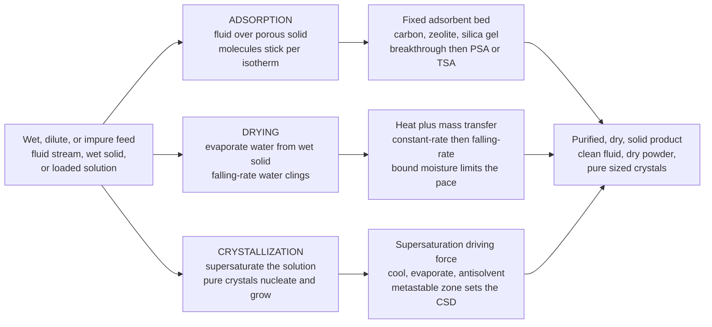

# 🧂 Adsorption, Drying, and Crystallization

> [!abstract] TL;DR
> **Adsorption, drying, and crystallization** are the three "finishing" separations that deliver a mixture's contents in their final **dry, pure, solid form** — the operations that make the sugar, salt, powdered milk, catalysts, and crystalline drugs you actually hold. **Adsorption** is molecular flypaper: pass a fluid over a super-porous solid (**activated carbon, zeolites/molecular sieves, silica gel, alumina**) and target molecules *stick* to its vast internal surface; how much sticks is set by the **adsorption isotherm** (**Langmuir/Freundlich** — loading versus concentration or pressure), the bed is run as a **fixed bed** whose **breakthrough curve** tracks a mass-transfer zone marching through until the solid saturates, and it is regenerated by **pressure-swing (PSA)** or **temperature-swing (TSA)** cycling — the basis of gas drying, air separation, VOC/solvent recovery, water purification, and chromatography. **Drying** evaporates a liquid (usually water) out of a wet solid by coupled **heat + mass transfer**; the **drying-rate curve** shows a **constant-rate period** (free surface moisture, evaporation-limited) followed by a **falling-rate period** (bound/internal moisture, diffusion-limited — the stubborn last water that clings), and the hardware spans tray, rotary, fluidized-bed, **spray dryers** (milk, coffee, detergents), and **freeze dryers** (pharma, food). **Crystallization** grows pure ordered solids from a solution or melt by creating **supersaturation** (cooling, evaporation, antisolvent, or reaction); **nucleation** (primary/secondary) and crystal **growth** — bounded by the **solubility curve** and its **metastable zone** — set the **crystal size distribution**, purity, and **polymorph**, because a growing crystal rejects impurities into the mother liquor (purification for free). Together these three round out the separations toolkit beyond the fluid-fluid operations and are indispensable to **pharmaceutical, food, and fine-chemicals manufacturing**, where dry, pure, correctly-sized solid product is the whole point.

## Intuition

**Analogy:** After the big fluid-fluid separations have done their work, you still need to hand over a real product — something dry, pure, and solid you can bag, press into a tablet, or pour into a cereal box. Three tricks finish the job, each exploiting a different bit of physics. **Adsorption is molecular flypaper.** Pass a fluid over a solid riddled with microscopic pores (a spoonful of **activated carbon** hides a surface area the size of a football field) and the molecules you want *stick* to that enormous hidden surface — exactly how a **Brita filter** grabs chlorine and off-flavours out of tap water, or how the little **silica-gel packet** in a shoebox quietly grabs moisture out of the air. **Drying is just evaporating water out of a wet solid** — turning brewed coffee into instant powder, or milk into milk powder. It sounds trivial until you meet the last stubborn bit of water, which clings to the solid's insides and refuses to leave at the same easy pace as the surface water. **Crystallization is nature's own purification.** Cool or concentrate a solution and the dissolved compound spontaneously assembles itself into **pure, ordered crystals**, leaving its impurities stranded behind in the leftover liquid — precisely how **sugar, salt, and most pharmaceuticals** are made pure enough to eat or swallow.

Notice the shared logic: each takes a fluid or a wet, dilute, impure feed and returns product in its **final solid form**, but each pulls a different lever — adsorption exploits **surface affinity**, drying exploits **evaporation**, crystallization exploits **the ordering drive of a supersaturated solution**. They are the workhorse *finishing* steps that sit at the tail end of nearly every chemical, food, and pharma process.

---

## How It Works

### Core Mechanics

1. **Adsorption — molecules accumulate on a porous solid's surface.** A fluid carrying an **adsorbate** flows over an **adsorbent** (activated carbon, zeolite/molecular sieve, silica gel, activated alumina) whose value is its colossal *internal* surface area — hundreds to over a thousand m²/g hidden inside micropores. Target molecules bind to that surface by van der Waals forces (**physisorption**) or, less reversibly, by chemical bonds (**chemisorption**). Selectivity comes from pore size (a molecular sieve literally admits small molecules and excludes big ones) and from surface chemistry.

2. **The adsorption isotherm sets capacity.** At fixed temperature the equilibrium loading $q$ (mass or moles adsorbed per mass of solid) rises with the fluid-phase concentration or partial pressure and then **saturates** as the surface fills. The **Langmuir isotherm** assumes a finite monolayer of identical sites, $q = \dfrac{q_m\,b\,C}{1 + b\,C}$ (plateaus at $q_m$); the **Freundlich isotherm** is the empirical power law $q = K_F\,C^{1/n}$ (never truly plateaus, good for heterogeneous surfaces). The isotherm is the thermodynamic ceiling: it tells you how much solid you need.

3. **Fixed beds and the breakthrough curve.** Adsorbers are usually **packed beds**. As feed enters, the inlet layers saturate first and a **mass-transfer zone (MTZ)** — the band where loading transitions from spent to fresh — travels downstream like a wave. The outlet stays clean until the MTZ reaches the exit; then the outlet concentration climbs in an **S-shaped breakthrough curve** until it equals the inlet (bed exhausted). You stop at the **breakpoint**, take the bed offline, and **regenerate** it — by dropping pressure (**pressure-swing adsorption, PSA**) or raising temperature (**temperature-swing adsorption, TSA**) to strip the adsorbate off — then cycle back. Two or more beds swing so the process runs continuously.

4. **Drying — coupled heat and mass transfer out of a wet solid.** Heat is supplied (hot gas, a hot surface, radiation) to evaporate liquid, and the vapour must then diffuse away from the solid. The **drying-rate curve** (rate of moisture loss versus the solid's free-moisture content) has two acts. In the **constant-rate period**, a film of free surface moisture keeps the surface saturated; the solid behaves like a puddle and the rate is set purely by external heat/mass transfer (the surface sits at the **wet-bulb temperature**). Once the surface can no longer be resupplied fast enough — the **critical moisture content** — the process enters the **falling-rate period**: now **bound/internal moisture** must diffuse or wick from deep inside, so the rate falls, often steeply, toward the **equilibrium moisture** the solid holds in balance with the surrounding air. That last internal water is the slow, expensive part.

5. **Crystallization — supersaturation drives nucleation and growth.** A solution at or below its **solubility** is stable; nothing crystallizes. You must create **supersaturation** — a concentration *above* the solubility line — by **cooling**, **evaporating** solvent, adding an **antisolvent**, or by a **reaction** that makes an insoluble product. Supersaturation is the sole driving force, and it does two jobs: it triggers **nucleation** (birth of new crystals — *primary* from a clear solution, or *secondary*, seeded by existing crystals) and it feeds **growth** (molecules deposit onto crystal faces). A crystal lattice only accepts its own species, so impurities are **rejected into the mother liquor** — the separation *is* a purification.

6. **The metastable zone and the size/purity/polymorph payoff.** Between the solubility curve and the higher **metastable limit** lies the **metastable zone**: supersaturated but not yet spontaneously nucleating, where you can grow **seed** crystals in a controlled way. Push past the metastable limit and you get a burst of uncontrolled nucleation and a shower of tiny crystals. The balance of nucleation rate versus growth rate fixes the **crystal size distribution (CSD)** — governed formally by a **population balance** — while the choice of conditions can select which **polymorph** (crystal packing) you get, a make-or-break variable in pharmaceuticals where different polymorphs dissolve differently.

### Flow / Architecture



---

## Key Concepts

### Secondary Level

- **Adsorption is molecular flypaper.** Push a fluid past a super-porous solid and the molecules you want stick to its huge hidden surface — like a water filter grabbing chlorine, or a silica-gel packet grabbing moisture in a shoebox. When the solid fills up, you clean it off and reuse it.
- **Drying just means evaporating water out of a wet solid.** Coffee becomes instant powder, milk becomes milk powder. The first, easy water is the surface water; the last, stubborn water hides deep inside and comes out slowly — which is why the end of drying takes so long.
- **Crystallization is nature purifying itself.** Cool or thicken a solution and the dissolved stuff builds itself into **pure crystals**, leaving the dirt behind in the leftover liquid. This is how sugar and salt are made pure — and most medicines too.
- **All three deliver a dry, pure, solid product.** They are the *finishing* steps: after the big separations do their work, these hand you the powder or crystals you can actually bag, press into a pill, or pour into a box.

### Undergraduate Level

- **Adsorbents and internal area.** Activated carbon (broad, nonpolar organics/VOCs, water), **zeolites/molecular sieves** (uniform pores, size selectivity, strong water/CO₂ affinity, air separation), **silica gel** and **activated alumina** (desiccants). Value = **internal surface area** (often 300–1500 m²/g) plus pore-size and surface-chemistry selectivity.
- **Isotherm models.** **Langmuir:** $q = \dfrac{q_m b C}{1 + b C}$ — monolayer, finite capacity $q_m$, linearizes as $C/q = 1/(q_m b) + C/q_m$. **Freundlich:** $q = K_F C^{1/n}$ — empirical, heterogeneous surface, linearizes as $\ln q = \ln K_F + (1/n)\ln C$. **BET** extends Langmuir to multilayers (basis of surface-area measurement).
- **Fixed-bed operation and breakthrough.** The **MTZ** width is set by mass-transfer resistance and isotherm shape (favorable isotherms sharpen it toward a *constant-pattern* front). Usable capacity < equilibrium capacity because of the unused zone at breakthrough; the **length of unused bed (LUB)** quantifies the gap. Regenerate by **PSA** (adsorb high P, desorb low P — e.g. O₂/N₂ from air) or **TSA** (adsorb cold, desorb hot — e.g. gas drying, VOC recovery).
- **Drying periods and moisture.** **Free moisture** $X = X_{total} - X^{*}$ (above equilibrium). **Constant-rate period:** surface saturated, rate $\propto$ heat/mass-transfer coefficient and $(T - T_{wb})$; surface at **wet-bulb temperature**. **Critical moisture** $X_c$ marks the switch to the **falling-rate period**, where internal **diffusion/capillary** transport limits and rate falls to zero at $X^{*}$. **Bound** water (held in cell walls, capillaries, solution) has a lowered vapour pressure and is the hard part.
- **Supersaturation, solubility, and the metastable zone.** Driving force is the **supersaturation ratio** $S = C/C^{*}$ (or $\Delta C = C - C^{*}$). The **solubility curve** $C^{*}(T)$ and the higher **metastable-limit** curve bracket the zone where you can grow **seeds** without runaway nucleation. **Cooling** crystallization suits steep solubility curves; **evaporative** suits flat ones; **antisolvent** and **reactive (precipitation)** create supersaturation chemically.
- **Nucleation, growth, and CSD.** **Primary nucleation** (homogeneous/heterogeneous) needs high $S$; **secondary nucleation** (from existing crystals, e.g. by attrition) dominates in seeded industrial crystallizers. **Growth rate** competes with **nucleation rate** to set the **crystal size distribution** — high supersaturation favors many small crystals; gentle, seeded operation favors fewer large ones.

### Graduate Level

- **Fixed-bed dynamics and the constant-pattern front.** The column obeys a coupled solute mass balance plus an equilibrium (isotherm) and a rate law (often **linear driving force**, LDF, $\partial q/\partial t = k_{LDF}(q^{*}-q)$). For a **favorable** (concave-down, e.g. Langmuir) isotherm the self-sharpening front approaches a **constant-pattern** shape whose width is fixed by mass-transfer resistance and axial dispersion; for an **unfavorable** isotherm the front is **proportionate-pattern** and spreads. Bohart-Adams, Thomas, and Yoon-Nelson models give closed-form breakthrough fits; the **LUB** method scales lab breakthrough to plant beds.
- **PSA/TSA cycle design.** Real units are multi-bed cycles (Skarstrom cycle and elaborations) with pressurization, feed/adsorption, blowdown, purge, and repressurization steps; **working capacity** = loading difference between adsorption and regeneration conditions on the isotherm, not the absolute loading. Selectivity, cycle time, purge ratio, and heat management (adsorption is exothermic; the released heat travels as a **thermal wave**) govern purity and recovery. Kinetic separations (e.g. **carbon molecular sieves** separating O₂/N₂ by diffusion rate rather than equilibrium) are a distinct design class.
- **Drying transport and shrinkage.** Constant-rate flux follows the coupled heat/mass balance $h(T_g - T_s) = k_y \lambda (Y_s - Y_g)$ pinning the surface at $T_{wb}$; the falling-rate period is modeled by internal **moisture diffusion** (a Fick problem with a receding saturation front), **capillary** flow, or a **characteristic drying curve**. Complications: **case hardening** (a dried skin throttling internal diffusion), **shrinkage**, thermal degradation, and — for heat-sensitive pharma/food — **freeze drying (lyophilization)**, where water is removed by **sublimation** from the frozen state under vacuum, protecting labile structure at the cost of very long cycles.
- **Population balance and industrial CSD control.** The **population balance equation** tracks the crystal number density $n(L,t)$: $\dfrac{\partial n}{\partial t} + \dfrac{\partial (G n)}{\partial L} = B - D + \text{(flow terms)}$, coupled to nucleation $B$, size-dependent growth $G$, agglomeration, and breakage, plus a solute mass balance for supersaturation. The **MSMPR** (mixed-suspension, mixed-product-removal) idealization yields the classic exponential CSD $n = n^{0}\exp(-L/G\tau)$ and the dominant size $L_D = 3G\tau$. **Metastable zone width** and induction time set seeding strategy; controlled **supersaturation trajectories** (programmed cooling/antisolvent addition) steer the product toward the target size and polymorph.
- **Polymorphism and the crystallization of pharmaceuticals.** Different **polymorphs** (and hydrates/solvates, salts, co-crystals) have different lattice energies, solubilities, dissolution rates, stability, and bioavailability — so polymorph control is a *regulatory-critical* variable. **Ostwald's rule of stages** (the metastable form often appears first, then converts) and solvent-mediated transformations must be managed; **chiral resolution** by preferential or diastereomeric crystallization separates enantiomers. Impurity rejection depends on the **distribution coefficient** and on growth rate — too-fast growth traps mother liquor and impurities (inclusions), so purity trades against throughput.

---

## Python Demo

```python
# Adsorption, Drying, and Crystallization -- the three finishing separations,
# each visualized by its signature curve:
#
#   (a) ADSORPTION ISOTHERM  q(C):  Langmuir (saturating monolayer) vs
#       Freundlich (power law). The isotherm is the equilibrium CEILING that
#       sets how much adsorbent a bed needs.
#
#   (b) FIXED-BED BREAKTHROUGH  C_out/C_in vs time: the mass-transfer zone
#       (MTZ) marches through the bed; the outlet stays clean, then rises in an
#       S-curve as the bed saturates. You stop at the breakpoint and regenerate
#       (PSA / TSA). This is the basis of adsorber cycling.
#
#   (c) DRYING-RATE CURVE  rate vs free-moisture content: a flat CONSTANT-RATE
#       period (free surface water) then a FALLING-RATE period (bound internal
#       water clings) sloping to zero at the equilibrium moisture.
#
#   (d) SOLUBILITY & METASTABLE ZONE  concentration vs temperature: the
#       solubility curve, the higher metastable limit, and a cooling-
#       crystallization path -- cool at fixed C into the zone, nucleate at the
#       limit, then track down near solubility as crystals grow.
#
# Requires: numpy, matplotlib   (no scipy)
import numpy as np
import matplotlib.pyplot as plt

# ============================================================
# (a) Adsorption isotherms: Langmuir vs Freundlich
# ============================================================
C  = np.linspace(0.0, 10.0, 400)          # fluid-phase concentration (arb. units)
qm, b = 1.0, 0.8                          # Langmuir: monolayer capacity, affinity
q_lang = qm * b * C / (1.0 + b * C)       # saturates at qm
KF, ninv = 0.45, 0.5                      # Freundlich: coefficient, 1/n
q_freu = KF * C**ninv                     # power law, never plateaus

# ============================================================
# (b) Fixed-bed breakthrough curve (constant-pattern S-shape)
# ============================================================
t   = np.linspace(0.0, 120.0, 500)        # time (min)
t_s = 60.0                                # stoichiometric (50% breakthrough) time
k   = 0.18                                # front sharpness (1/min); larger = sharper MTZ
Cout = 1.0 / (1.0 + np.exp(-k * (t - t_s)))   # logistic breakthrough C_out/C_in
# breakpoint (5%) and exhaustion (95%) times, from inverting the logistic
t_break = t_s - np.log(1/0.05 - 1) / k
t_exh   = t_s - np.log(1/0.95 - 1) / k
frac_used = t_break / t_s                  # fraction of equilibrium capacity used

# ============================================================
# (c) Drying-rate curve: constant-rate then falling-rate
# ============================================================
X    = np.linspace(0.0, 0.40, 400)        # free moisture content (kg water / kg dry solid)
Xc   = 0.18                               # critical moisture content
Rc   = 1.0                                # constant-rate flux (kg/m2 h), normalized
# constant rate for X > Xc; linear falling rate from Rc at Xc down to 0 at X=0
rate = np.where(X >= Xc, Rc, Rc * X / Xc)

# ============================================================
# (d) Solubility curve + metastable zone + cooling path
# ============================================================
T      = np.linspace(10.0, 80.0, 400)     # temperature (deg C)
Csat   = 20.0 + 1.6 * T                    # solubility curve C*(T)  (g solute / 100 g solvent)
Cmeta  = Csat + 22.0                       # metastable limit (supersaturation ceiling)
# cooling-crystallization path: start hot & saturated, cool at fixed C until we
# hit the metastable limit (nucleation), then follow just above solubility.
T_start = 75.0
C_op    = 20.0 + 1.6 * T_start             # operating concentration (saturated at start)
T_nuc   = (C_op - 22.0 - 20.0) / 1.6       # T where C_op meets the metastable limit
T_cool_flat = np.linspace(T_start, T_nuc, 60)
T_cool_grow = np.linspace(T_nuc, 20.0, 60)
C_flat = np.full_like(T_cool_flat, C_op)                       # cool at fixed C
C_grow = (20.0 + 1.6 * T_cool_grow) + 4.0                      # track just above solubility

# ---------------------------- console summary ----------------------------
print("=== (a) isotherms ===")
print(f"  Langmuir saturates at q_m = {qm:.2f}; half-capacity at C = 1/b = {1/b:.2f}")
print(f"  Freundlich q = {KF}*C^{ninv} keeps rising (no plateau)")
print("=== (b) fixed-bed breakthrough ===")
print(f"  breakpoint (5%)  t_b   = {t_break:5.1f} min")
print(f"  stoichiometric   t_s   = {t_s:5.1f} min")
print(f"  exhaustion (95%) t_e   = {t_exh:5.1f} min")
print(f"  usable fraction of equilibrium capacity ~ {frac_used*100:4.1f} percent"
      f"  (rest is length of unused bed)")
print("=== (c) drying ===")
print(f"  constant-rate period for X > Xc = {Xc:.2f} (surface at wet-bulb T)")
print(f"  falling-rate period for X < Xc  (bound water, diffusion-limited)")
print("=== (d) crystallization ===")
print(f"  cool at fixed C = {C_op:.0f} until nucleation at T ~ {T_nuc:4.1f} deg C,")
print(f"  then grow crystals while tracking down near the solubility curve")

# ------------------------------- plotting --------------------------------
fig, axes = plt.subplots(2, 2, figsize=(14, 10))
fig.suptitle("Adsorption, Drying, and Crystallization: three finishing "
             "separations, three signature curves",
             fontsize=14, fontweight="bold")
(a1, a2), (a3, a4) = axes

# (a) isotherms
a1.plot(C, q_lang, color="#1f77b4", lw=2.6, label="Langmuir  q = qm b C /(1+ b C)")
a1.plot(C, q_freu, color="#d62728", lw=2.6, ls="--", label="Freundlich  q = KF C^(1/n)")
a1.axhline(qm, color="#1f77b4", ls=":", lw=1.2)
a1.text(6.2, qm + 0.03, "monolayer capacity qm", color="#1f77b4", fontsize=9)
a1.set_xlabel("fluid-phase concentration  C")
a1.set_ylabel("amount adsorbed  q  (loading)")
a1.set_title("(a) ADSORPTION ISOTHERM: loading saturates with concentration",
             fontsize=11)
a1.legend(loc="lower right", fontsize=9)
a1.grid(alpha=0.3)

# (b) breakthrough
a2.plot(t, Cout, color="#2a9d8f", lw=2.8)
a2.axhline(0.05, color="grey", ls=":", lw=1.0)
a2.axhline(0.95, color="grey", ls=":", lw=1.0)
a2.axvline(t_break, color="#e76f51", ls="--", lw=1.6)
a2.axvline(t_exh,   color="#8d99ae", ls="--", lw=1.6)
a2.fill_between(t, 0, Cout, where=(t >= t_break) & (t <= t_exh),
                color="#2a9d8f", alpha=0.12)
a2.text(t_break, 0.55, "  breakpoint\n  (stop, regenerate)",
        color="#e76f51", fontsize=9, ha="left")
a2.text(t_exh, 0.30, "bed\nexhausted", color="#8d99ae", fontsize=9, ha="left")
a2.set_xlabel("time  (min)   ->  MTZ moves through the bed")
a2.set_ylabel("outlet / inlet  C_out / C_in")
a2.set_title("(b) FIXED-BED BREAKTHROUGH: the S-curve of a saturating bed",
             fontsize=11)
a2.set_ylim(-0.02, 1.05)
a2.grid(alpha=0.3)

# (c) drying-rate curve
a3.plot(X, rate, color="#6a4c93", lw=2.8)
a3.axvline(Xc, color="grey", ls="--", lw=1.4)
a3.fill_between(X, 0, rate, where=(X >= Xc), color="#6a4c93", alpha=0.10)
a3.fill_between(X, 0, rate, where=(X < Xc),  color="#e07a5f", alpha=0.15)
a3.text(0.27, Rc + 0.03, "CONSTANT-RATE\n(free surface water)",
        color="#6a4c93", fontsize=9, ha="center")
a3.text(0.075, 0.30, "FALLING-RATE\n(bound water clings)",
        color="#e07a5f", fontsize=9, ha="center")
a3.text(Xc + 0.005, 0.05, "critical\nmoisture Xc", color="grey", fontsize=8)
a3.set_xlabel("free moisture content  X  (kg water / kg dry solid)")
a3.set_ylabel("drying rate  R  (normalized)")
a3.set_title("(c) DRYING-RATE CURVE: constant-rate then falling-rate",
             fontsize=11)
a3.set_ylim(0, 1.15)
a3.grid(alpha=0.3)
a3.invert_xaxis()   # drying proceeds from high moisture (right) to low (left)

# (d) solubility + metastable zone + cooling path
a4.plot(T, Csat,  color="#1f77b4", lw=2.6, label="solubility curve  C*(T)")
a4.plot(T, Cmeta, color="#d62728", lw=2.2, ls="--", label="metastable limit")
a4.fill_between(T, Csat, Cmeta, color="#ffd166", alpha=0.30,
                label="metastable (supersaturation) zone")
a4.plot(T_cool_flat, C_flat, color="k", lw=2.2)
a4.plot(T_cool_grow, C_grow, color="k", lw=2.2)
a4.plot(T_start, C_op, "o", color="green", ms=9)
a4.plot(T_nuc, C_op, "*", color="red", ms=16)
a4.annotate("start: hot, saturated", (T_start, C_op),
            textcoords="offset points", xytext=(-70, 10), fontsize=9, color="green")
a4.annotate("nucleation\nat metastable limit", (T_nuc, C_op),
            textcoords="offset points", xytext=(6, -28), fontsize=9, color="red")
a4.set_xlabel("temperature  T  (deg C)")
a4.set_ylabel("concentration  (g solute / 100 g solvent)")
a4.set_title("(d) COOLING CRYSTALLIZATION: cool into the metastable zone",
             fontsize=11)
a4.legend(loc="upper left", fontsize=8)
a4.grid(alpha=0.3)
a4.invert_xaxis()   # cooling proceeds left along the T axis

plt.tight_layout(rect=[0, 0, 1, 0.96])
plt.show()
```

The four panels are the four fingerprints of these operations. **Panel (a)** is the **adsorption isotherm**: the Langmuir curve climbs and then flattens at the monolayer capacity $q_m$ (there are only so many sites), while the Freundlich power law keeps creeping up — the equilibrium ceiling that decides how many kilograms of carbon or zeolite a bed must hold. **Panel (b)** is the **fixed-bed breakthrough curve**: the outlet stays clean while the mass-transfer zone travels down the bed, then rises in a sharp S as the solid saturates; you cut the feed at the **breakpoint** (here the printout shows only a fraction of the equilibrium capacity is used before that — the rest is the "length of unused bed") and swing to a fresh bed while this one is regenerated by **PSA or TSA**. **Panel (c)** is the **drying-rate curve**, read right-to-left as the solid dries: a flat **constant-rate** plateau while free surface water evaporates at the wet-bulb temperature, then a **falling-rate** ramp once the surface dries below the critical moisture and the stubborn **bound water** must diffuse out from inside — the reason the last few percent of moisture costs the most. **Panel (d)** is the **solubility diagram**: the blue solubility curve, the red metastable limit, and the golden **metastable zone** between them; the black path shows **cooling crystallization** — cool at fixed concentration until you cross into the zone and hit the limit (the red star = nucleation), then grow crystals while the liquor tracks down just above solubility, depositing pure solid and leaving impurities behind.

---

## Real-World Applications

> **Example — the crystallization + drying finish of a pharmaceutical active ingredient (API).** After synthesis and the fluid-fluid workup, the drug substance is delivered to the patient as a pure crystalline powder, and two of these operations do that final job. **Crystallization** is the last purification and the point of quality control: the process engineer creates supersaturation by controlled **cooling** and **antisolvent** addition, **seeds** within the metastable zone, and follows a programmed supersaturation trajectory so that impurities stay in the mother liquor while the crystals grow to a target **size distribution** and — critically — the correct **polymorph**, because a different polymorph can dissolve too slowly (or too fast) and fail the bioavailability spec. The wet crystalline cake is then **dried** (often a filter-dryer or, for heat-sensitive biologics, **freeze drying/lyophilization**) down through its falling-rate period to a low, stable residual moisture so the solid neither degrades nor cakes. Get the crystallization wrong and you have the wrong polymorph or the wrong particle size; get the drying wrong and you have a wet, unstable, or thermally-damaged product. Both are as regulated as the chemistry itself.

- **Pressure-swing adsorption (PSA) air separation.** Zeolite molecular sieves preferentially adsorb N₂ over O₂; cycling two beds between high-pressure adsorption and low-pressure desorption produces **oxygen** (medical O₂ concentrators, industrial O₂) or, with carbon molecular sieves, **nitrogen** — a pure gas-phase separation run entirely on the isotherm and the breakthrough clock.
- **Gas dehydration and molecular-sieve driers (TSA).** Natural-gas and air driers pack **zeolite 3A/4A or silica gel** in fixed beds that adsorb water to sub-ppm dew points, then regenerate by hot purge gas (**temperature-swing**) — the reason pipeline gas and instrument air stay dry and hydrate-free.
- **Activated-carbon water and air purification.** Municipal and point-of-use filters (the **Brita** cartridge, granular activated-carbon beds) adsorb chlorine, taste/odour compounds, and trace organics; carbon canisters on process vents and gasoline systems recover **VOCs/solvents** for reuse or destruction.
- **Spray drying of food and detergents.** Milk, instant coffee, infant formula, detergents, and ceramic/catalyst precursors are **atomized** into hot gas so a huge droplet surface flashes off water in seconds; drop size sets both the drying rate and the final **particle size** and bulk density of the powder.
- **Freeze drying (lyophilization) of pharma and food.** Vaccines, biologics, and premium foods (coffee, fruit) are frozen and dried by **sublimation** under vacuum, avoiding the heat that would denature proteins or destroy aroma — trading a very long cycle for a stable, reconstitutable solid.
- **Bulk crystallization of sugar, salt, and fertilizers.** Cane/beet **sugar** and sea/brine **salt** are recovered by **evaporative** crystallization; ammonium sulphate, urea, and potash **fertilizers** by cooling/evaporative crystallization — commodity-scale processes where CSD controls handling, caking, and dust.

---

## Common Pitfalls

- **Confusing equilibrium capacity with usable capacity in an adsorber.** The isotherm gives the *equilibrium* loading, but a real bed is taken offline at **breakthrough** with a partly-spent **mass-transfer zone** still inside — the **length of unused bed**. Sizing a bed from the isotherm alone (ignoring the MTZ and cycle time) badly under-sizes it.
- **Using the wrong isotherm — or extrapolating it.** Fitting Freundlich to data that actually plateau (or Langmuir to a heterogeneous surface) mis-predicts capacity, and *any* isotherm extrapolated outside its measured concentration/pressure and temperature range is unreliable. Adsorption is exothermic, so capacity falls as the bed heats up during loading — an isothermal isotherm can flatter you.
- **Forgetting to size for regeneration, not just adsorption.** PSA/TSA **working capacity** is the *difference* between loading at adsorption and at regeneration conditions, not the absolute loading. A solid that adsorbs beautifully but is hard to regenerate (too strong, too much purge/heat) can be useless in a cycle.
- **Treating drying as a single first-order process.** The **constant-rate** and **falling-rate** periods have completely different physics (external transfer versus internal diffusion). Assuming one rate law throughout wildly mis-predicts drying time — almost all the *time* is spent in the slow falling-rate removal of bound water, not the fast surface evaporation.
- **Case hardening and thermal damage in drying.** Drying the surface too aggressively can form a hard, low-permeability skin (**case hardening**) that traps internal moisture, or can thermally degrade heat-sensitive product. Heat-labile materials often *require* gentle or **freeze** drying, not a hotter dryer.
- **Nucleating uncontrollably instead of growing seeded crystals.** Crashing the system past the **metastable limit** (cooling or adding antisolvent too fast) triggers a burst of primary nucleation and a shower of fine, impure, hard-to-filter crystals. Controlled crystallization stays *within* the metastable zone and grows **seeds** on a programmed supersaturation trajectory.
- **Ignoring polymorphism and impurity inclusion.** Different **polymorphs/hydrates** have different solubility, stability, and bioavailability — a make-or-break issue in pharma — and **too-fast growth** traps mother liquor and impurities as inclusions, defeating the purification. Purity and throughput trade off; you cannot simply crank the supersaturation for speed.
- **Overlooking that a growing crystal purifies while a filtered slurry does not.** The purification happens in the **lattice rejection** of impurities into the mother liquor; if you do not then wash and separate the crystals from that liquor properly, the surface-adhering impure liquor re-contaminates the "pure" product.

---

## Related Concepts

**Adsorption as a chromatographic separation**
- [[Chromatography]] — analytical and preparative chromatography *is* adsorption (and partition) run as a moving front: the same isotherm, mass-transfer zone, and band-broadening physics that shape an adsorber breakthrough curve set chromatographic retention and resolution

**Crystallization — nucleation, growth, and the solid that forms**
- [[Nucleation_Growth_and_Solidification]] — the materials-science twin of crystallization: primary/secondary **nucleation**, crystal **growth**, and the free-energy barrier and undercooling/supersaturation driving force are the identical physics, applied to solidifying metals and alloys instead of solutions
- [[Solid_State_and_Crystal_Structures]] — the ordered **lattices** that crystallization builds, and the basis of **polymorphism**: why the same molecule can pack into different crystal forms with different solubility and stability
- [[Chemical_Kinetics]] — nucleation and crystal growth are **rate** processes competing against the transport of solute to the crystal face; their relative rates set the crystal size distribution, exactly the kinetics-versus-transport contest seen throughout reaction engineering

**Solubility and phase equilibrium — the thermodynamic backdrop**
- [[Solutions_and_Concentration]] — solubility, saturation, and concentration measures: the **solubility curve** and **supersaturation ratio** $S = C/C^{*}$ that provide crystallization's sole driving force
- [[Phase_Equilibria_and_Colligative_Properties]] — the phase-equilibrium framework behind the solubility curve, the metastable zone, and the vapour-pressure lowering of **bound** water that makes the last moisture in drying so hard to remove

**Drying — internal moisture transport**
- [[Diffusion_in_Solids_and_Ficks_Laws]] — the **falling-rate period** is a Fick's-law problem: bound/internal moisture must diffuse (or wick) from deep inside the solid to the surface, and that slow solid-state transport, not surface evaporation, controls the tail of every drying curve

*Section siblings (Chemical Engineering, Separation Processes): these three finishing operations sit alongside the fluid-fluid separations catalogued in Separation_Processes_Overview and rest directly on the rate physics of Mass_Transfer_and_Diffusion (Fick's law, mass-transfer coefficients, the wet-bulb balance) and Interphase_and_Multiphase_Transport (the two-film/two-resistance picture, interfacial area, and coupled heat-and-mass transfer in drying). Adsorption and crystallization are the surface-affinity and phase-change cousins of the solvent-based separation in Liquid_Liquid_Extraction, and fixed-bed adsorption shares its fluid-solid contacting and intraparticle-diffusion machinery with Catalysis_and_Heterogeneous_Reactions.*

---

## Review Questions

**Secondary**
1. A silica-gel packet in a shoebox keeps the shoes dry, a Brita filter makes tap water taste cleaner, and a bag of instant coffee started life as brewed liquid. For each, name which of the three operations (adsorption, drying, crystallization) is at work, explain in plain terms *what is physically happening to the target molecules*, and say why crystallizing sugar out of syrup also makes it **purer**, not just solid.

**Undergraduate**
2. A dilute solute is removed from water in a fixed bed of activated carbon whose equilibrium follows a **Langmuir** isotherm $q = q_m b C/(1+bC)$. (a) Sketch the isotherm and explain why it **saturates**, and contrast it with a **Freundlich** fit. (b) Describe how the **mass-transfer zone** moves through the bed and why the outlet concentration follows an **S-shaped breakthrough curve**; mark the **breakpoint** and explain why the bed's *usable* capacity is less than its *equilibrium* capacity. (c) The bed is regenerated by **temperature-swing (TSA)**; using the isotherm, explain what "working capacity" means and why simply having a high equilibrium loading is not enough.

**Graduate**
3. You must crystallize a pharmaceutical API to a target particle size and the correct polymorph, then dry it. (a) On a concentration-temperature diagram, mark the **solubility curve**, the **metastable limit**, and a controlled **cooling + antisolvent** path that seeds within the metastable zone; explain, using nucleation-versus-growth rates and the **population balance** (MSMPR $n = n^{0}e^{-L/G\tau}$, $L_D = 3G\tau$), how the supersaturation trajectory sets the **crystal size distribution**. (b) Explain why **polymorph** control and impurity **inclusion** are critical and how growth rate trades against purity. (c) For the subsequent drying step, distinguish the **constant-rate** and **falling-rate** periods, explain why the falling-rate period (internal moisture diffusion) dominates the total drying time, and justify choosing **freeze drying** over hot-air drying for a heat-labile biologic.

---

## Sources

- J. D. Seader, E. J. Henley & D. K. Roper — *Separation Process Principles*, 3rd ed. (Wiley, 2011) — modern, integrated treatment of adsorption (isotherms, fixed beds, PSA/TSA), drying, and crystallization within the separations framework
- W. L. McCabe, J. C. Smith & P. Harriott — *Unit Operations of Chemical Engineering*, 7th ed. (McGraw-Hill, 2005) — the classic unit-operations account of adsorption, dryer types and drying-rate curves, and industrial crystallization
- D. M. Ruthven — *Principles of Adsorption and Adsorption Processes* (Wiley, 1984) — the definitive reference on adsorption equilibria, kinetics, fixed-bed dynamics, and cyclic (PSA/TSA) processes
- J. W. Mullin — *Crystallization*, 4th ed. (Butterworth-Heinemann, 2001) — the standard text on solubility, supersaturation and the metastable zone, nucleation and growth, CSD, and industrial crystallizer design
- A. S. Mujumdar (ed.) — *Handbook of Industrial Drying*, 4th ed. (CRC Press, 2014) — comprehensive coverage of drying mechanisms, constant/falling-rate periods, dryer selection, spray and freeze drying

---

#chemical-engineering #adsorption #drying #crystallization #isotherm
