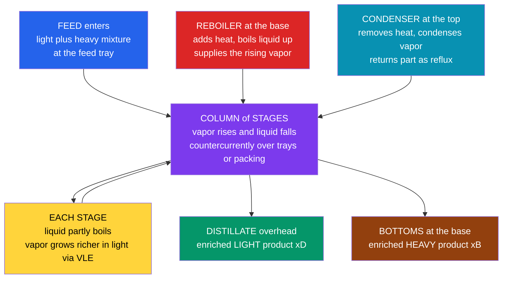

# 🗼 Distillation

> [!abstract] TL;DR
> **Distillation** separates a liquid mixture by exploiting differences in **volatility** (boiling point): partially vaporize the mixture and the vapor comes off **richer in the more volatile (light) component**, the liquid richer in the heavy — the split quantified by **[[Vapor_Liquid_Equilibrium|relative volatility]]** $\alpha = K_{\text{light}}/K_{\text{heavy}}$. A single boil-condense step barely separates anything, so a **column stacks dozens of equilibrium stages** with vapor rising and liquid falling **countercurrently**, compounding a modest per-stage enrichment into a near-perfect split — pure light **distillate** overhead, pure heavy **bottoms** at the base. A **reboiler** boils vapor up from the bottom, a **condenser** condenses it at the top and returns part as **reflux**, and the **feed tray** divides the **rectifying** (above) and **stripping** (below) sections. The iconic design tool is the **McCabe-Thiele** graphical method: draw the $x$-$y$ equilibrium curve, the two operating lines (set by the **reflux ratio** and the feed **q-line**), and *step off* the theoretical stages between the product specs. The whole economics live in one tradeoff — **more reflux buys fewer trays but burns more reboiler energy** — bounded by **minimum reflux** (infinite stages) and **minimum stages** (total reflux, Fenske). Distillation refines crude oil into gasoline/jet/diesel, separates air into $\mathrm{O_2}$/$\mathrm{N_2}$, purifies chemicals, and distills spirits; it is the dominant industrial separation and an enormous energy consumer, so its design is central to plant economics and sustainability.

---

## Intuition

**Analogy first.** Distillation is nothing more than **repeated boiling and condensing**, and a tall distillation column is really a *stack* of these boil-condense steps. Picture a **staircase inside a tower**. On each tray a pool of liquid partly boils; because the light component is more eager to evaporate, the vapor it sends **up** to the next tray is slightly *richer* in the volatile component, while the liquid that trickles **down** grows slightly richer in the heavy one. That is a tiny, unimpressive one-step enrichment — a 60/40 mixture might come off as 70/30. But do it again on the tray above, and again on the one above that, over dozens of trays, with vapor rising and liquid falling **past each other** (countercurrently), and the modest step compounds like interest: a near-perfect split, pure light out the top, pure heavy out the bottom.

That staircase is the single most important machine in the process industries. It is the workhorse that refines crude oil into gasoline, jet fuel, and diesel, that pulls oxygen and nitrogen out of the air, that purifies almost every bulk chemical, and that distills spirits. And it is an unapologetic **energy glutton**: you boil the *entire* stream at the bottom and condense it again at the top, so distillation alone accounts for a large slice of all the energy the chemical and refining industries burn. Thermodynamics (**[[Vapor_Liquid_Equilibrium|VLE]]**) tells you *how much* enrichment each step can deliver; the column's job is to chain enough steps together to finish the separation, and the engineer's job is to decide how many stages and how much reflux — trays versus energy — that takes.

---

## How It Works

### Core Mechanics

1. **One equilibrium stage enriches a little.** Bring vapor and liquid to equilibrium on a tray and they leave with *different* compositions: the vapor carries mole fraction $y$ of the light component, the liquid $x$, and $y > x$ whenever the light component is more volatile. The size of that gap is fixed by **[[Vapor_Liquid_Equilibrium|relative volatility]]**, $y/(1-y) = \alpha\,\big[x/(1-x)\big]$. If $\alpha = 1$ the phases are identical and *nothing* separates; the larger $\alpha$, the more each stage does.

2. **A column stacks stages and runs them countercurrently.** A single stage caps out fast, so a column places many stages in series. Crucially, **vapor rises and liquid descends past each other**: the vapor leaving stage $n$ contacts the liquid falling from stage $n+1$. This countercurrent arrangement keeps a driving force (a composition gap) alive at *every* stage, so the enrichments add up instead of stalling at one equilibrium.

3. **A reboiler and a condenser close the loop.** At the base, a **reboiler** adds heat and boils vapor back up into the column — it is the engine that supplies all the rising vapor. At the top, a **condenser** removes heat and condenses the overhead vapor; part is drawn off as **distillate** and part is returned down the column as **reflux**. Reflux is what creates the descending liquid stream in the top section; without it the rectifying section could not work.

4. **The feed splits the column into two sections.** The feed enters partway up at the **feed tray**. Above it is the **rectifying (enriching) section**, which polishes the vapor toward the light-product spec; below it is the **stripping section**, which strips the last light component out of the descending liquid so the bottoms come off heavy. The two products are the **distillate** $x_D$ (overhead, light) and the **bottoms** $x_B$ (base, heavy).

5. **Mass balances give straight operating lines.** A material balance around the top of the column yields the **rectifying operating line** $y = \tfrac{R}{R+1}\,x + \tfrac{x_D}{R+1}$, whose slope is set entirely by the **reflux ratio** $R = L/D$. A balance around the bottom gives the **stripping operating line**, and the feed condition gives the **q-line** (vertical for a saturated-liquid feed) where the two operating lines meet. These lines describe the *actual* passing streams, the equilibrium curve describes the *ideal* per-stage jump, and stepping between them counts stages.

6. **McCabe-Thiele steps off the stages.** Plot $y$ vs $x$: the equilibrium curve, the two operating lines, and a **staircase** drawn between them (horizontal to the equilibrium curve = one equilibrium stage, vertical back to the operating line = the passing stream). Count the steps from $x_D$ down to $x_B$ and you have the **number of theoretical stages** — the column's height in one picture.

7. **Two limits bracket every design.** Crank reflux to infinity (**total reflux**, no products drawn) and the operating lines collapse onto the $y=x$ diagonal, giving the **fewest possible stages** — the **Fenske** minimum, $N_{\min} = \ln[(x_D/(1-x_D))((1-x_B)/x_B)]/\ln\alpha$. Drop reflux until an operating line just touches the equilibrium curve (a **pinch**) and you reach **minimum reflux** $R_{\min}$, which needs **infinitely many** stages. Real columns run at $R \approx 1.1$–$1.5\,R_{\min}$, trading capital (trays) against energy (reboiler duty).

### Flow / Architecture



---

## Key Concepts

### Secondary Level

- **Boil, catch the richer vapor, repeat.** Heat a mixture and the steam that rises is richer in whatever boils more easily. Condense it and you have a purer liquid; boil *that* and it gets purer still. Distillation is this cycle done many times over.
- **A column is a stack of these steps.** Instead of doing the cycle by hand over and over, a tall tower with many **trays** does all the steps at once — light product accumulates at the top, heavy product at the bottom.
- **Vapor goes up, liquid comes down.** The rising vapor and the falling liquid brush past each other on every tray, handing off molecules: the vapor keeps getting lighter as it climbs, the liquid keeps getting heavier as it falls.
- **Two helpers at the ends.** A **reboiler** at the bottom is the heater that boils vapor up; a **condenser** at the top cools the vapor back to liquid, keeping some as product and pouring the rest back down as **reflux** to feed the process.
- **It is everywhere, and it is thirsty.** Distillation makes gasoline and jet fuel from crude oil, separates air into oxygen and nitrogen, and distills whiskey — but because you boil the whole stream, it uses a *lot* of energy, which is why engineers work hard to design it well.

### Undergraduate Level

- **Relative volatility sets the difficulty.** With $\alpha = K_{\text{light}}/K_{\text{heavy}}$ (from [[Vapor_Liquid_Equilibrium|VLE]]), the constant-$\alpha$ equilibrium curve is $y = \dfrac{\alpha x}{1 + (\alpha - 1)x}$. Benzene-toluene ($\alpha \approx 2.4$) is easy; close-boiling isomers ($\alpha \approx 1.05$) demand hundreds of stages.
- **The rectifying operating line.** A balance around the condenser end gives $y_{n+1} = \dfrac{R}{R+1}\,x_n + \dfrac{x_D}{R+1}$, a straight line through $(x_D, x_D)$ with slope $R/(R+1)$, where $R = L/D$ is the **reflux ratio**.
- **The stripping operating line.** A balance around the reboiler end gives a straight line through $(x_B, x_B)$; its slope $\bar L / \bar V$ depends on reflux, feed rate, and feed condition.
- **The q-line.** The feed **quality** $q$ (fraction of feed that is liquid: $q=1$ saturated liquid, $q=0$ saturated vapor) fixes where the operating lines meet: the q-line passes through $(x_F, x_F)$ with slope $q/(q-1)$ — **vertical** for a saturated-liquid feed. The two operating lines intersect *on* the q-line.
- **Stepping off stages.** Start at $(x_D, x_D)$. Step horizontally to the equilibrium curve (one theoretical stage), then vertically to the operating line (the passing stream). Repeat, switching from the rectifying to the stripping line at the feed, until you pass $x_B$. The number of steps is the theoretical stage count; the reboiler counts as the last stage.
- **Minimum reflux $R_{\min}$.** Lower reflux tilts the rectifying line flatter until it just touches the equilibrium curve at a **pinch point**; there separation requires infinite stages. For a saturated-liquid feed the pinch is where the q-line meets the equilibrium curve, and $\dfrac{R_{\min}}{R_{\min}+1} = \dfrac{x_D - y_{\text{pinch}}}{x_D - x_{\text{pinch}}}$.
- **Minimum stages and the Fenske equation.** At **total reflux** ($R \to \infty$, no products drawn), both operating lines lie on the diagonal and the stage count is smallest: $N_{\min} = \dfrac{\ln\!\big[(x_D/(1-x_D))\,((1-x_B)/x_B)\big]}{\ln \alpha}$.
- **The capital-vs-energy tradeoff.** Between $R_{\min}$ (infinite trays, minimum energy) and total reflux (minimum trays, infinite energy) lies the design. Higher $R$ = fewer trays (shorter, cheaper column) but larger reboiler/condenser duty and running cost. Optimum reflux is typically $1.1$–$1.5\,R_{\min}$.
- **Real vs theoretical stages.** Trays are not perfect equilibrium contactors; a **tray (Murphree) efficiency** converts theoretical stages to actual trays. Packed columns are rated instead by **HETP** (height equivalent to a theoretical plate) — actual packed height $=$ (theoretical stages) $\times$ HETP.

### Graduate Level

- **Constant molal overflow and its failure.** McCabe-Thiele assumes **constant molal overflow** (equal molar latent heats, negligible sensible-heat and heat-of-mixing effects), which makes the operating lines *straight*. When latent heats differ or heat effects are large, the operating lines curve; the **Ponchon-Savarit** method restores rigor by working on an **enthalpy-composition** ($H$-$x$-$y$) diagram, carrying the full energy balance so reboiler and condenser duties fall out directly.
- **Multicomponent shortcut design — the FUG sequence.** With three or more components there is no single $x$-$y$ diagram. The **Fenske-Underwood-Gilliland (FUG)** shortcut is standard: **Fenske** gives $N_{\min}$ and the distribution of non-key components at total reflux; **Underwood** gives $R_{\min}$ from the roots of $\sum_i \alpha_i z_i/(\alpha_i - \theta) = 1 - q$; and the **Gilliland correlation** interpolates actual stages between the two limits. One designates a **light key** and **heavy key** — the two adjacent components whose split is specified.
- **Rigorous stage-by-stage models.** Full simulators solve the coupled **MESH** equations on every stage — **M**aterial balances, **E**quilibrium relations, **S**ummation (mole fractions sum to one), and en**H**alpy (energy) balances — typically by the **Wang-Henke** (bubble-point) or **Naphtali-Sandholm** (simultaneous-correction, Newton) methods. These handle nonideal thermodynamics, side draws, multiple feeds, and pumparounds that shortcut methods cannot.
- **Breaking azeotropes.** When [[Vapor_Liquid_Equilibrium|VLE]] non-ideality forms an **azeotrope** ($x_i = y_i$, e.g. ethanol-water at 95.6 wt%), ordinary distillation stalls. Options: **pressure-swing distillation** (the azeotrope shifts with pressure, so two columns at different pressures step around it); **azeotropic distillation** (add an **entrainer** that forms a new low-boiling azeotrope carried overhead); **extractive distillation** (add a high-boiling solvent that alters relative volatilities without vaporizing); or hybrids with **membranes/pervaporation** or **adsorption** (molecular sieves for anhydrous ethanol).
- **Reactive and dividing-wall intensification.** **Reactive distillation** runs reaction and separation in one vessel, pulling products out as they form to beat equilibrium and heat-integrate the reaction exotherm (the Eastman methyl-acetate process is the classic). **Dividing-wall columns** put a vertical baffle inside one shell to separate a ternary mixture in a single column, cutting capital and energy ~30% versus two columns.
- **Energy and heat integration.** Because the reboiler duty dwarfs most plant utilities, distillation is the prime target for **pinch analysis** and heat integration: **feed preheat**, **thermal coupling** (Petlyuk/dividing-wall arrangements), **multi-effect** column trains (heat-integrating columns at staggered pressures), **vapor recompression** (mechanical heat pumping of the overhead vapor back into the reboiler), and diabatic/internally-heat-integrated (HIDiC) designs. These are where distillation's sustainability battle is fought.
- **Batch distillation.** For small volumes and frequent product changes (specialty chemicals, pharma, spirits), a **batch still** with a rectifying column runs *transiently*: the pot composition drifts heavier over time, so reflux is ramped to hold the distillate on-spec (constant-composition operation) or the distillate quality is allowed to slide (constant-reflux operation) — a moving-target version of the McCabe-Thiele picture.
- **Column hydraulics bound the design.** Real columns are limited by **flooding** (upward vapor entrains liquid), **weeping/dumping** (too little vapor lets liquid fall through), **downcomer capacity**, and pressure drop. Tray spacing, hole area, and packing choice size the *diameter*; the stage count sizes the *height*. A thermodynamically fine design that floods is worthless.

---

## Python Demo

```python
# ============================================================
# McCabe-Thiele distillation design for a binary mixture with
# constant relative volatility alpha.
#
#   (a) McCABE-THIELE: draw the x-y equilibrium curve, the
#       rectifying and stripping OPERATING LINES (set by the
#       reflux ratio R and the feed q-line), and STEP OFF the
#       theoretical stages between the product specs (xD, xB).
#
#   (b) REFLUX TRADEOFF: count stages over a range of reflux
#       ratios. As R -> R_min the stage count blows up (pinch,
#       infinite stages); as R -> infinity it flattens to the
#       Fenske minimum (total reflux, fewest stages). This is
#       the classic CAPITAL (trays) vs ENERGY (reflux) tradeoff:
#       more reflux -> fewer trays but more reboiler duty.
#
# Requires: numpy, matplotlib   (no scipy)
import numpy as np
import matplotlib.pyplot as plt

# ---- binary system specification ----
alpha = 2.45     # relative volatility (benzene-toluene-like: an EASY split)
xF    = 0.50     # feed  mole fraction of the LIGHT component
xD    = 0.95     # distillate (overhead) spec
xB    = 0.05     # bottoms  spec
q     = 1.0      # feed quality: 1.0 = saturated liquid (vertical q-line)

def y_eq(x):
    """Equilibrium vapor comp from liquid comp (constant alpha)."""
    return alpha * x / (1.0 + (alpha - 1.0) * x)

def x_eq(y):
    """Inverse: liquid comp in equilibrium with a given vapor comp y."""
    return y / (alpha - (alpha - 1.0) * y)

# ============================================================
# Reference limits: minimum reflux and Fenske minimum stages
# ============================================================
# Minimum reflux (saturated-liquid feed): pinch where the vertical
# q-line at xF meets the equilibrium curve.
y_pinch  = y_eq(xF)
slope_min = (xD - y_pinch) / (xD - xF)
R_min    = slope_min / (1.0 - slope_min)

# Fenske minimum stages (total reflux, constant alpha)
N_min = np.log((xD / (1 - xD)) * ((1 - xB) / xB)) / np.log(alpha)

# ============================================================
# Operating lines for a given reflux ratio R
# ============================================================
def operating_lines(R):
    m_r = R / (R + 1.0)                 # rectifying slope
    b_r = xD / (R + 1.0)                # rectifying intercept -> through (xD, xD)
    if abs(q - 1.0) < 1e-9:             # saturated liquid -> vertical q-line at xF
        x_int = xF
    else:
        m_q = q / (q - 1.0)
        b_q = -xF / (q - 1.0)           # q-line through (xF, xF)
        x_int = (b_q - b_r) / (m_r - m_q)
    y_int = m_r * x_int + b_r           # operating-line intersection (on q-line)
    m_s = (y_int - xB) / (x_int - xB)   # stripping line through (xB, xB) & intersection
    b_s = xB - m_s * xB
    return (m_r, b_r), (m_s, b_s), (x_int, y_int)

# ============================================================
# Step off theoretical stages for a given R
# ============================================================
def count_stages(R, max_stages=80):
    (m_r, b_r), (m_s, b_s), (x_int, y_int) = operating_lines(R)
    x, y = xD, xD                        # start on the diagonal at the distillate
    steps = [(x, y)]
    stages = 0
    while x > xB and stages < max_stages:
        x_new = x_eq(y)                  # horizontal to equilibrium curve = 1 stage
        steps.append((x_new, y))
        y_new = (m_r * x_new + b_r) if x_new > x_int else (m_s * x_new + b_s)
        steps.append((x_new, y_new))     # vertical back to the operating line
        x, y = x_new, y_new
        stages += 1
    return stages, steps

# ---- design case at R = 1.5 * R_min ----
R_design = 1.5 * R_min
N_design, steps = count_stages(R_design)
(m_r, b_r), (m_s, b_s), (x_int, y_int) = operating_lines(R_design)

print(f"Relative volatility  alpha      = {alpha:.2f}")
print(f"Minimum reflux       R_min      = {R_min:.3f}")
print(f"Fenske min stages    N_min      = {N_min:.2f}  (total reflux)")
print(f"Design reflux        R          = {R_design:.3f}  (= 1.5 x R_min)")
print(f"Theoretical stages at design R  = {N_design}")

# ============================================================
# (b) stage count vs reflux ratio over the feasible range
# ============================================================
R_grid = np.linspace(1.03 * R_min, 8.0, 80)
N_grid = np.array([count_stages(R)[0] for R in R_grid])

# ============================================================
# PLOTS
# ============================================================
fig, (axL, axR) = plt.subplots(1, 2, figsize=(14, 6))
fig.suptitle("Distillation design: McCabe-Thiele stage-stepping "
             "and the reflux (energy) vs stages (capital) tradeoff",
             fontsize=13, fontweight="bold")

# ---- LEFT: McCabe-Thiele diagram ----
xx = np.linspace(0, 1, 200)
axL.plot(xx, y_eq(xx), "b-", lw=2.2, label=f"equilibrium curve (alpha = {alpha})")
axL.plot([0, 1], [0, 1], "k--", lw=1, label="y = x diagonal")

# operating lines
xr = np.linspace(x_int, xD, 50)
axL.plot(xr, m_r * xr + b_r, "-", color="#059669", lw=2.2, label="rectifying line")
xs = np.linspace(xB, x_int, 50)
axL.plot(xs, m_s * xs + b_s, "-", color="#dc2626", lw=2.2, label="stripping line")
axL.plot([xF, x_int], [xF, y_int], "-", color="#d97706", lw=2.2, label="q-line (sat. liquid)")

# staircase of theoretical stages
sx, sy = zip(*steps)
axL.plot(sx, sy, "-", color="0.35", lw=1.4)
axL.plot(sx, sy, ".", color="0.2", ms=5)

# spec markers
for xv, lab, col in [(xB, "xB", "#dc2626"), (xF, "xF", "#d97706"), (xD, "xD", "#059669")]:
    axL.axvline(xv, color=col, ls=":", lw=1, alpha=0.7)
    axL.text(xv, 0.02, lab, color=col, fontsize=9, ha="center")

axL.set_xlabel("liquid mole fraction (light)  x")
axL.set_ylabel("vapor mole fraction (light)  y")
axL.set_title(f"(a) McCABE-THIELE:  {N_design} theoretical stages at "
              f"R = {R_design:.2f}", fontsize=11)
axL.set_xlim(0, 1); axL.set_ylim(0, 1)
axL.legend(loc="lower right", fontsize=8); axL.grid(alpha=0.3)

# ---- RIGHT: stages vs reflux ratio ----
axR.plot(R_grid, N_grid, "-o", color="#7c3aed", ms=3, lw=1.8, label="theoretical stages")
axR.axvline(R_min, color="#dc2626", ls="--", lw=1.5,
            label=f"R_min = {R_min:.2f}  (infinite stages)")
axR.axhline(N_min, color="#059669", ls="--", lw=1.5,
            label=f"N_min = {N_min:.1f}  (total reflux, Fenske)")
axR.plot(R_design, N_design, "k*", ms=15,
         label=f"design: R = {R_design:.2f}, N = {N_design}")
axR.set_xlabel("reflux ratio  R = L / D")
axR.set_ylabel("theoretical stages  N")
axR.set_title("(b) REFLUX TRADEOFF: more reflux (energy) -> fewer trays (capital)",
              fontsize=11)
axR.set_ylim(0, min(50, N_grid.max() + 3))
axR.legend(loc="upper right", fontsize=9); axR.grid(alpha=0.3)

plt.tight_layout(rect=[0, 0, 1, 0.95])
plt.show()
```

The **left panel** is the classic McCabe-Thiele staircase: the blue equilibrium curve bows well above the diagonal (an easy $\alpha = 2.45$ split), the green rectifying and red stripping operating lines meet on the orange vertical q-line at the feed, and the grey staircase steps from $x_D = 0.95$ down to $x_B = 0.05$ — each horizontal tread is one theoretical stage. The **right panel** makes the economics visible: as the reflux ratio approaches $R_{\min}$ the required stages shoot toward infinity (the pinch), while pushing reflux higher flattens the count toward the **Fenske minimum** $N_{\min}$ (total reflux). Real columns live at the knee of that curve — near $1.1$–$1.5\,R_{\min}$ — because each extra unit of reflux buys fewer and fewer saved trays while every unit costs proportionally more reboiler steam.

---

## Real-World Applications

> **Example — a crude-oil atmospheric distillation tower, the beating heart of every refinery.** Preheated crude (a mixture of thousands of hydrocarbons) is flashed into the base of a tall tray column while a **reboiler**/furnace and stripping steam drive vapor up and a top **condenser** returns reflux down. Because heavier hydrocarbons condense at higher temperatures, the tower runs a smooth temperature gradient from ~350 °C at the bottom to ~120 °C at the top, and **side-draw** trays tap off cuts at their condensation windows: heavy gas oil and diesel low down, kerosene/jet in the middle, naphtha (future gasoline) high up, and non-condensable gas overhead. It is McCabe-Thiele logic generalized to a continuous boiling-range feed — relative volatility (here, boiling point) sorts the components, and countercurrent contact over dozens of trays sharpens each cut. What the atmospheric tower cannot boil without cracking goes to a **vacuum tower**, which lowers pressure to distill the heaviest fractions at survivable temperatures. Every litre of gasoline, jet fuel, and diesel on Earth starts in one of these columns.

- **Air separation (cryogenic distillation).** Air is liquefied and distilled in a **double column** to produce high-purity $\mathrm{N_2}$, $\mathrm{O_2}$, and argon. With $\alpha$ near unity for $\mathrm{O_2}$/$\mathrm{N_2}$, the columns need many stages and tight energy integration — a textbook hard separation done at industrial scale.
- **Petrochemical fractionation.** Ethylene/ethane, propylene/propane ("C3 splitters"), and BTX (benzene-toluene-xylene) columns are the backbone of the chemical industry. Propylene splitters are famously tall (100+ trays) because the C3 relative volatility is small — a direct consequence of the McCabe-Thiele staircase needing many steps.
- **Fuel-grade and beverage ethanol.** Fermentation broth is concentrated by distillation up to the ethanol-water **azeotrope** (95.6 wt%); anhydrous fuel ethanol then requires **molecular sieves**, **pressure-swing**, or **extractive distillation** to cross it. Spirits (whiskey, vodka, rum) are the oldest application — pot stills and continuous **column (Coffey) stills** are distillation in its original form.
- **Natural-gas processing.** **Demethanizer**, **deethanizer**, and **depropanizer** columns fractionate gas liquids into methane, ethane, LPG, and heavier NGLs, often at elevated pressure where equation-of-state VLE governs the design.
- **Solvent recovery and chemical purification.** Recovering acetone, methanol, or IPA from process streams, and hitting the >99.9% purity many chemicals and pharma intermediates demand, is almost always a distillation (batch for small/varied campaigns, continuous for bulk).
- **Process simulators and the energy question.** Every flowsheet in Aspen Plus, HYSYS, or DWSIM sizes its columns with FUG shortcut plus rigorous MESH models; because distillation consumes a large share of industrial process energy, **heat integration, dividing-wall columns, and vapor recompression** are where sustainability gains are actively pursued.

---

## Common Pitfalls

- **Expecting more trays to beat an azeotrope.** At the azeotropic composition vapor and liquid are identical ($\alpha = 1$ locally), so *infinite* stages still fail. Ordinary distillation of ethanol-water tops out at 95.6 wt% no matter how tall the column — crossing it requires pressure swing, an entrainer, a membrane, or adsorption.
- **Confusing minimum reflux with an operating point.** $R_{\min}$ is a *limit* requiring infinite stages, not a design. Operating too close to it makes the column enormous; too far above it wastes reboiler energy. The economic optimum sits at the knee, roughly $1.1$–$1.5\,R_{\min}$.
- **Confusing theoretical stages with real trays.** McCabe-Thiele counts *equilibrium* stages; actual trays are imperfect. Forgetting to divide by **tray efficiency** (or to multiply by **HETP** for packing) undersizes the column height, sometimes badly.
- **Assuming constant molal overflow blindly.** Straight operating lines assume equal molar latent heats and negligible heat effects. For mixtures with very different latent heats or strong heat-of-mixing (or large temperature swings), operating lines curve and you need an energy-balance method (Ponchon-Savarit) or a rigorous simulator — otherwise the stage count is wrong.
- **Picking the wrong VLE/property method.** The entire diagram is built on [[Vapor_Liquid_Equilibrium|relative volatility]]. Using ideal Raoult for a polar/associating system (or the wrong activity model) can *hide an azeotrope* and predict a separation that is physically impossible. Garbage VLE in, garbage column out.
- **Ignoring column hydraulics.** A stage-count that is thermodynamically perfect is useless if the column **floods** or **weeps**. Vapor and liquid loadings set the diameter and tray/packing choice; a design that neglects flooding, downcomer capacity, and pressure drop cannot be built.
- **Forgetting distillation is an energy glutton.** Sizing only for stages and reflux while ignoring the reboiler duty misses the dominant operating cost. Feed preheat, heat integration, and vapor recompression are not optional polish — they often decide whether the column is economic at all.
- **Mislabeling the feed quality $q$.** A saturated-liquid feed ($q=1$) gives a vertical q-line; a saturated-vapor feed ($q=0$) a horizontal one; subcooled or superheated feeds tilt it the other way. Getting $q$ wrong misplaces the operating-line intersection and therefore the feed-tray location and the whole stage count.

---

## Related Concepts

Distillation is the flagship of the separations section of a chemical-engineering curriculum, and it sits directly on top of phase-equilibrium thermodynamics. Its foundation is **[[Vapor_Liquid_Equilibrium|Vapor-Liquid Equilibrium]]**, whose $x$-$y$ curve and relative volatility $\alpha$ are the raw material the McCabe-Thiele staircase steps across, and whose azeotropes define distillation's hard limits; multicomponent columns generalize this through **[[Multicomponent_Phase_Behavior|Multicomponent Phase Behavior]]** (key components, residue-curve maps, FUG shortcut design). The *rate* at which molecules actually cross the vapor-liquid interface on each tray — and therefore tray efficiency and packing HETP — is governed by **[[Mass_Transfer_and_Diffusion|Mass Transfer and Diffusion]]**, while the reboiler and condenser that drive the column are **[[Heat_Transfer_in_Process_Equipment|heat-transfer equipment]]** whose duties dominate distillation's energy bill. The molecular thermodynamics of boiling, Raoult's law, and azeotrope formation are developed from the physical-chemistry side in **[[Phase_Equilibria_and_Colligative_Properties|Phase Equilibria and Colligative Properties]]**.

Cross-vault connections (verified to exist):

- [[Vapor_Liquid_Equilibrium]] *(Chem. Eng. — Thermodynamics)* — the $x$-$y$ equilibrium curve, K-values, relative volatility, and azeotropes that every distillation design reads off directly
- [[Multicomponent_Phase_Behavior]] *(Chem. Eng. — Thermodynamics)* — residue-curve maps and multicomponent VLE behind the Fenske-Underwood-Gilliland shortcut and rigorous MESH column models
- [[Mass_Transfer_and_Diffusion]] *(Chem. Eng. — Transport)* — the interphase transfer that sets tray (Murphree) efficiency and packed-column HETP, converting theoretical stages into real ones
- [[Heat_Transfer_in_Process_Equipment]] *(Chem. Eng. — Transport)* — the reboiler and condenser duties, heat integration, and vapor recompression that dominate distillation economics and sustainability
- [[Phase_Equilibria_and_Colligative_Properties]] *(Chemistry)* — the physical-chemistry roots of vapor pressure, Raoult's law, boiling, and azeotropes underlying distillation
- [[Laws_of_Thermodynamics]] *(Physics)* — the first and second laws that bound the minimum work of separation and explain why boiling-and-condensing every stage is so energy-intensive
- [[Heat_Exchangers_and_HVAC]] *(Mechanical Eng.)* — the reboiler, condenser, and feed-preheat exchangers that surround every distillation column
- [[Power_and_Refrigeration_Cycles]] *(Mechanical Eng.)* — the refrigeration cycles that supply the cryogenic cold for air-separation columns and low-temperature condensers
- [[Pumps_Compressors_and_Turbines]] *(Mechanical Eng.)* — reflux pumps and the compressors that make vapor-recompression (heat-pumped) distillation possible

*Section siblings (to be written): this note is the flagship of the separations arc introduced in Separation_Processes_Overview; it shares the equilibrium-stage / two-film machinery with Absorption_and_Stripping (gas-liquid contacting for solute removal); and the trays-vs-reflux capital-vs-energy tradeoff developed here is exactly the optimization studied in Process_Design_and_Economics.*

---

## Review Questions

**Secondary**
1. You gently boil a pot of 50/50 alcohol-water, catch the first vapor, condense it, then boil *that* liquid and repeat several times. Explain, in terms of "which molecule escapes more eagerly," why the collected liquid gets more alcoholic each cycle, and describe how a tall distillation column performs all these boil-condense cycles at once instead of one at a time. Why does the process use so much energy?

**Undergraduate**
2. A binary mixture with constant relative volatility $\alpha = 2.45$ is to be distilled to $x_D = 0.95$ and $x_B = 0.05$ (light-component mole fractions) with a saturated-liquid feed at $x_F = 0.50$. (a) Write the constant-$\alpha$ equilibrium relation and the rectifying operating line. (b) Using the Fenske equation, compute the minimum number of theoretical stages $N_{\min}$. (c) Find the pinch composition and the minimum reflux ratio $R_{\min}$ for this saturated-liquid feed. (d) Explain physically why operating at exactly $R_{\min}$ would require an infinitely tall column, and where you would actually set $R$ and why.

**Graduate**
3. A ternary mixture must be separated, and the client wants both a first estimate and a rigorous design. (a) Outline how the **Fenske-Underwood-Gilliland (FUG)** shortcut produces $N_{\min}$, $R_{\min}$, and the actual stage count, and explain the role of the **light key / heavy key** designation and the Underwood roots. (b) The mixture turns out to contain a minimum-boiling azeotrope between the two keys; describe two distinct strategies (naming the physical principle of each) to obtain both pure products, and state what a residue-curve map tells you about which products are even reachable. (c) The reboiler duty is the plant's single largest energy user — describe two heat-integration or intensification options (e.g. vapor recompression, dividing-wall, multi-effect) and the tradeoff each introduces.

---

## Sources

- Seader, Henley & Roper — *Separation Process Principles: Chemical and Biochemical Operations*, 3rd ed. (Wiley) — equilibrium-stage theory, McCabe-Thiele, FUG shortcut and rigorous MESH methods, azeotropic and extractive distillation
- Wankat — *Separation Process Engineering: Includes Mass Transfer Analysis*, 4th ed. (Prentice Hall) — the clearest modern treatment of McCabe-Thiele, reflux/stage tradeoffs, multicomponent and batch distillation
- King — *Separation Processes*, 2nd ed. (McGraw-Hill / Dover) — the classic rigorous text on the thermodynamic and energy basis of distillation and other separations
- Kister — *Distillation Design* and *Distillation Operation* (McGraw-Hill) — the practicing engineer's reference on tray/packing hydraulics, efficiency, flooding, and real-column troubleshooting
- McCabe, Smith & Harriott — *Unit Operations of Chemical Engineering*, 7th ed. (McGraw-Hill) — the original unit-operations treatment where the McCabe-Thiele method and constant molal overflow are developed

---

#chemical-engineering #distillation #mccabe-thiele #reflux #relative-volatility
