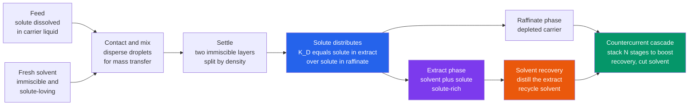

# ⚗️ Liquid-Liquid Extraction

> [!abstract] TL;DR
> **Liquid-liquid extraction** (solvent extraction) separates a dissolved component not by *boiling* it but by *dissolving* it out — you contact the feed (a **solute** carried in one liquid) with a second **immiscible solvent** that the solute prefers, let the mixture settle into two layers, and pour off the solute-rich layer. The physics is a single equilibrium: the solute distributes between the two phases according to the **distribution (partition) coefficient** $K_D = c_{\text{extract}} / c_{\text{raffinate}}$, and the solvent's usefulness is set by its **selectivity** for the solute over the carrier. After mixing and settling you get an **extract** (solvent + solute) and a **raffinate** (depleted feed). It is the go-to separation exactly where distillation *fails*: **heat-sensitive** materials that would decompose if boiled (pharmaceuticals, antibiotics, biologicals), **close-boiling** or **azeotropic** mixtures, and **dilute** solutes. Recovery is maximized and solvent minimized by staging in a **countercurrent cascade**, whose design turns on the **extraction factor** $E = K_D \, S/F$ and is read off the **ternary (triangular) LLE diagram** with its binodal, tie-lines, and plait point. The extract is then usually worked up — most often by **distillation** — to recover the pure solute and recycle the solvent.

## Intuition

**Analogy:** Some things are simply too fragile or too alike to distill. Heat a delicate antibiotic and it decomposes before it ever boils; try to distill two liquids that boil within a degree of each other and you would need a distillation column the height of a skyscraper. So instead of *boiling*, you *dissolve the target out*. Add a second liquid that does not mix with the first — like oil poured onto water — but that the target compound happens to *like better* than its current home. Shake the two together, then let them settle back into two clean layers. The target molecule, given the choice, migrates into the new solvent; you simply pour that layer off and you have separated it, all at room temperature.

This is precisely how you lift a grease stain out of fabric with the right solvent, and it is how **caffeine is pulled out of coffee beans** and how **penicillin is recovered from fermentation broth** — gently, selectively, and without ever cooking the product. The whole art is choosing a solvent the target strongly prefers, and then arranging the contacting so that almost every last molecule of target ends up in it.

---

## How It Works

### Core Mechanics

1. **Set up two immiscible phases.** Start with the **feed**: the target **solute** dissolved in a **carrier** (diluent) liquid. Add a **solvent** chosen to be (nearly) *immiscible* with the carrier so the two form distinct layers, and chosen so the solute is far more soluble in it. The three species — solute, carrier, solvent — make this a **ternary** system, the classic home of the triangular phase diagram.

2. **Contact to reach equilibrium.** Disperse one liquid as fine droplets in the other (stirring, a packed bed, or perforated trays) to create huge interfacial area. Solute diffuses across the interface — this is a **mass-transfer** limited step — until the two phases reach equilibrium, where the solute's *chemical potential* (escaping tendency) is equal in both.

3. **Let it distribute per the distribution coefficient.** At equilibrium the solute splits between phases according to the **distribution (partition) coefficient**
   $$K_D = \frac{c_{\text{solute, extract}}}{c_{\text{solute, raffinate}}}$$
   A large $K_D$ means the solute strongly prefers the solvent. Crucially, you also need **selectivity** $\beta = K_{D,\text{solute}}/K_{D,\text{carrier}} > 1$ — the solvent must grab the *solute* far more than it grabs the *carrier*, or you extract everything and separate nothing.

4. **Settle into two layers.** Stop mixing and let density difference pull the phases apart: the **extract** (solvent + recovered solute) and the **raffinate** (carrier depleted of solute). Good separation needs a real density gap and a low tendency to emulsify.

5. **Stage for high recovery.** One equilibrium contact removes only a limited fraction. Repeating the contact recovers more. **Cross-current** staging adds *fresh* solvent at every stage (better recovery, but solvent-hungry). **Countercurrent** staging flows feed and solvent in opposite directions through a cascade, so the leanest raffinate meets the freshest solvent and the richest extract meets the incoming feed — this achieves the *highest recovery for the least solvent*, and is how nearly all industrial extraction is run.

6. **Work up the extract.** The solute is now in the solvent, not yet pure. **Solvent recovery** — usually by **distillation** — separates solute from solvent and recycles the solvent back to the column. The economics of extraction live or die on how cheaply the solvent can be regenerated.

### Flow / Architecture



---

## Key Concepts

### Secondary Level

**Separate by *dissolving*, not boiling.** Distillation splits mixtures by making one part turn to vapor. Extraction never heats anything — it splits a mixture by offering the target a *better liquid to live in*. That is why it works for things that would burn, decompose, or react if you tried to boil them.

**Oil-and-water is the whole idea.** Two liquids that refuse to mix form two layers. If your target prefers one of them, it will move into that layer when you shake and settle. The "extract" is the layer you keep; the "raffinate" is the leftover you throw away or process further.

**The distribution coefficient is a *preference score*.** If a solute is four times more soluble in the solvent than in water, $K_D = 4$: after mixing, four out of every five molecules end up in the solvent layer. The bigger this number, the easier the job.

**One shake is rarely enough — so you repeat.** A single contact leaves some target behind. Extract again with fresh solvent and you get more. Chemists doing this by hand call it "washing three times"; engineers do it continuously in a tall column where feed falls one way and solvent rises the other. Doing it *countercurrent* squeezes out the most target with the least solvent.

### Undergraduate Level

**Equilibrium and the distribution coefficient.** At equilibrium the solute's activity is equal in both phases: $\gamma^{E} x^{E} = \gamma^{R} x^{R}$. For a dilute solute this collapses to a constant ratio, the **distribution coefficient** $K_D = c^{E}/c^{R}$ (defined on mass, mole, or mole-ratio concentrations — be consistent). $K_D$ is temperature-dependent and, for extractions involving ionizable species, strongly **pH-dependent** (you often adjust pH to switch a drug between its extractable neutral form and its non-extractable ionic form).

**Single-stage split and the extraction factor.** For immiscible carrier and solvent with feed rate $F$ and solvent rate $S$, define the **extraction factor**
$$E = K_D \, \frac{S}{F}.$$
A single equilibrium stage with clean entering solvent leaves a fraction $\dfrac{1}{1+E}$ of the solute in the raffinate, so single-stage recovery is $\dfrac{E}{1+E}$. $E$ is *the* master group of extraction design: $E>1$ means the solvent stream can, in principle, carry more solute than the feed brings — the precondition for near-complete countercurrent recovery.

**Cross-current vs countercurrent staging.** Split the same total solvent among $N$ **cross-current** stages (fresh solvent each) and the fraction remaining is $\left(1 + E/N\right)^{-N}$, which even with infinite stages only reaches a recovery of $1 - e^{-E}$ — it *plateaus*. A **countercurrent** cascade of $N$ ideal stages with clean entering solvent leaves (the **Kremser** result)
$$\phi = \frac{E - 1}{E^{\,N+1} - 1}, \qquad \text{recovery} = 1 - \phi,$$
which drives toward *complete* recovery as $N$ grows whenever $E>1$. Same solvent, dramatically better result — this is why countercurrent is the industrial default.

**The ternary (triangular) LLE diagram.** Because solute, carrier, and solvent form a ternary, the design map is a triangle: the **binodal** curve encloses the two-phase region, **tie-lines** join each raffinate composition to its equilibrium extract (their slope encodes $K_D$), and the **plait point** is where the two phases merge. Feed and solvent points are placed on the triangle, the **mixing point** found by the lever rule, and stages are **stepped off** graphically (the Hunter-Nash construction) to count how many equilibrium stages a given separation needs.

**Number of stages.** For dilute, immiscible systems the **Kremser equation** gives $N$ analytically from $E$ and the required recovery; for concentrated or partially-miscible systems you step off stages on the ternary diagram. Real columns add **stage efficiency** (Murphree efficiency) and **HETP** (height equivalent to a theoretical stage) to convert ideal stages into real height.

### Graduate Level

**Selectivity, solvent choice, and the recoverability trade-off.** A good solvent maximizes *both* capacity ($K_D$ large, so less solvent) *and* selectivity ($\beta$ large, so a pure product), but these often trade against each other, and against **recoverability** (the extract must be cheaply separated from the solute downstream, usually by distillation, so a solvent boiling far from the solute is preferred) and against **safety, cost, density difference, interfacial tension, and low mutual solubility**. Solvent screening is a genuinely multi-objective design problem, increasingly guided by activity-coefficient models (NRTL, UNIQUAC, predictive UNIFAC) and COSMO-RS.

**Minimum solvent and the operating-line/tie-line pinch.** On the ternary diagram, as you reduce $S/F$ the operating point migrates until an operating line becomes tangent to (coincident with) a tie-line — a **pinch** requiring *infinite* stages. This defines the **minimum solvent-to-feed ratio**; practical designs run at 1.2 to 2 times $(S/F)_{\min}$, the direct analog of minimum reflux in distillation. There is thus a continuous trade of *solvent flow* against *number of stages* — more stages let you approach the minimum-solvent asymptote.

**Type-I vs Type-II systems and partial miscibility.** Real systems rarely have perfectly immiscible carrier and solvent. **Type-I** ternaries have one partially-miscible pair (the binodal meets the base on one side); **Type-II** have two. Partial miscibility bends the tie-lines, moves the plait point, and forces the full triangular treatment rather than the immiscible short-cuts — and it means some solvent is lost into the raffinate and some carrier into the extract, both of which usually need recovery.

**Equipment and hydrodynamics.** Contactor choice balances stages, throughput, and settling: **mixer-settlers** (one robust stage each, easy to add stages, large footprint — favored in hydrometallurgy), **packed / spray / sieve-tray columns** (gravity-driven counterflow), and **agitated or centrifugal contactors** (rotating-disc contactors, RDC; centrifugal Podbielniak units) for fast throughput, short residence time (heat- and shear-sensitive products), or hard-to-settle emulsions with small density difference. Design must avoid **flooding**, control **drop size** (mass transfer vs settling), and identify which phase is **dispersed** vs continuous.

**Reactive and supercritical variants.** **Reactive (chemical) extraction** uses a solvent-borne reagent (amines, phosphoric-acid esters, chelating extractants, crown ethers) that *reacts* with the solute to boost $K_D$ and selectivity by orders of magnitude — the basis of metal and rare-earth separations and of carboxylic-acid recovery. **Supercritical-CO₂ extraction** replaces the organic solvent with dense CO₂ whose solvent power is tuned by pressure and which leaves *zero residue* on depressurization — used for decaffeination and hops/flavor extraction. **PUREX** in nuclear reprocessing extracts U and Pu with tributyl phosphate (TBP) in kerosene, switching oxidation states to strip them selectively.

---

## Python Demo

```python
# Liquid-liquid extraction design in two views:
#   (a) DISTRIBUTION AND STAGING: for a fixed distribution coefficient K_D
#       and a fixed TOTAL solvent, compare a single stage, N CROSS-CURRENT
#       stages (fresh solvent split N ways), and an N-stage COUNTERCURRENT
#       cascade. Plot solute recovery vs number of stages -- countercurrent
#       climbs toward 100 percent while cross-current plateaus at 1 - e^-E.
#   (b) SOLVENT ECONOMY: countercurrent recovery vs solvent-to-feed ratio
#       S/F (hence extraction factor E = K_D * S/F) for several stage counts.
#       Shows how adding stages lets you reach high recovery with far less
#       solvent -- the minimum-solvent / more-stages trade-off.
import numpy as np
import matplotlib.pyplot as plt

# ---- Extraction relations (dilute solute, immiscible carrier & solvent) ----
def rec_single(E):
    # one equilibrium stage, clean entering solvent: fraction remaining = 1/(1+E)
    return E / (1.0 + E)

def rec_cross(E, N):
    # total solvent split equally among N stages -> per-stage factor E/N
    return 1.0 - (1.0 + E / N) ** (-N)

def rec_counter(E, N):
    # Kremser cascade, clean entering solvent: phi = (E-1)/(E^(N+1)-1)
    E = np.asarray(E, dtype=float)
    phi = np.where(np.isclose(E, 1.0),
                   1.0 / (N + 1.0),                       # E = 1 limit
                   (E - 1.0) / (E ** (N + 1.0) - 1.0))
    return 1.0 - phi

# ============================ PART (a) ============================
K_D = 4.0            # solute prefers solvent 4:1
S_over_F = 0.5       # total solvent-to-feed ratio
E_tot = K_D * S_over_F                                   # extraction factor = 2.0
N = np.arange(1, 11)

r_single = np.full_like(N, rec_single(E_tot), dtype=float)   # ignores extra stages
r_cross  = np.array([rec_cross(E_tot, n) for n in N])
r_count  = np.array([rec_counter(E_tot, n) for n in N])
cross_ceiling = 1.0 - np.exp(-E_tot)                    # cross-current plateau

print(f"Extraction factor  E = K_D * S/F = {K_D} * {S_over_F} = {E_tot:.2f}")
print(f"Single stage recovery ............ {rec_single(E_tot)*100:5.1f} %")
print(f"Cross-current ceiling (N->inf) ... {cross_ceiling*100:5.1f} %  = 1 - e^-E")
print(f"Countercurrent, N=5 .............. {rec_counter(E_tot,5)*100:5.1f} %")
print(f"Countercurrent, N=10 ............. {rec_counter(E_tot,10)*100:5.1f} %")
print("\n N   cross%   counter%")
for n, rc, rk in zip(N, r_cross, r_count):
    print(f"{n:2d}   {rc*100:6.1f}   {rk*100:7.1f}")

# ============================ PART (b) ============================
sf = np.linspace(0.05, 1.5, 200)        # solvent-to-feed ratio
E_b = K_D * sf                          # extraction factor along the axis
stage_list = [1, 2, 3, 5, 10]

# ================================ PLOTS ================================
fig, (ax1, ax2) = plt.subplots(1, 2, figsize=(13.5, 5.6))

# --- (a) recovery vs number of stages: cross vs countercurrent ---
ax1.plot(N, r_count*100, "o-", color="#059669", lw=2.5, ms=6,
         label="countercurrent (Kremser)")
ax1.plot(N, r_cross*100, "s-", color="#ea580c", lw=2.5, ms=6,
         label="cross-current (fresh solvent each)")
ax1.plot(N, r_single*100, "--", color="#6b7280", lw=1.8,
         label="single stage (reference)")
ax1.axhline(cross_ceiling*100, color="#ea580c", ls=":", lw=1.4)
ax1.text(6.2, cross_ceiling*100 - 5, "cross-current ceiling = 1 - e^-E",
         color="#ea580c", fontsize=8.5)
ax1.set_xlabel("number of equilibrium stages  N")
ax1.set_ylabel("solute recovery  (%)")
ax1.set_title(f"(a) Same total solvent (E = {E_tot:.0f}):\ncountercurrent wins as stages grow")
ax1.set_ylim(50, 102); ax1.grid(alpha=0.3); ax1.legend(loc="lower right", fontsize=8.5)

# --- (b) countercurrent recovery vs solvent-to-feed ratio, several N ---
colors = plt.cm.viridis(np.linspace(0.15, 0.85, len(stage_list)))
for n, c in zip(stage_list, colors):
    ax2.plot(sf, rec_counter(E_b, n)*100, lw=2.3, color=c, label=f"N = {n} stages")
ax2.axvline(1.0/K_D, color="#111827", ls="--", lw=1.4)      # E = 1 threshold
ax2.text(1.0/K_D + 0.02, 55, "E = 1\n(S/F = 1/K_D)", fontsize=8.5, color="#111827")
ax2.set_xlabel("solvent-to-feed ratio  S/F      (E = K_D * S/F)")
ax2.set_ylabel("countercurrent recovery  (%)")
ax2.set_title("(b) More stages reach high recovery\nwith far less solvent")
ax2.set_ylim(0, 102); ax2.grid(alpha=0.3); ax2.legend(loc="lower right", fontsize=8.5)

# secondary axis showing the extraction factor E for panel (b)
axE = ax2.twiny()
axE.set_xlim(ax2.get_xlim())
ticks = np.array([0.25, 0.5, 0.75, 1.0, 1.25, 1.5])
axE.set_xticks(ticks); axE.set_xticklabels([f"{K_D*x:.1f}" for x in ticks])
axE.set_xlabel("extraction factor  E = K_D * S/F", fontsize=9)

plt.tight_layout()
plt.savefig("liquid_liquid_extraction.png", dpi=120)
plt.show()
```

Running this prints the **staging ledger** and draws two panels. Panel (a) fixes the *total* solvent (extraction factor $E=2$) and asks what happens as you use more stages: a **single stage** recovers only 67%, **cross-current** staging climbs but *plateaus* at its $1-e^{-E}\approx 86\%$ ceiling no matter how many stages you add, while the **countercurrent** cascade sails past 98% by five stages and toward 100% — the same solvent, arranged smarter, does far more. Panel (b) plots countercurrent recovery against the **solvent-to-feed ratio** (top axis: the extraction factor $E=K_D\,S/F$): with only one stage you must flood the system with solvent to recover much, but with ten stages you reach near-complete recovery with barely more solvent than the $E=1$ threshold ($S/F=1/K_D$) — the graphical statement of the *minimum-solvent vs number-of-stages* trade-off that defines extraction design.

---

## Real-World Applications

- **Pharmaceutical and antibiotic recovery (the reason extraction exists).** **Penicillin** and many other antibiotics and biologicals are recovered from dilute, heat-sensitive **fermentation broth** by solvent extraction — often pH-swing extraction into an organic solvent then back-extraction into buffer — because boiling would destroy the molecule. Centrifugal extractors (Podbielniak) give the seconds-long contact times these labile products demand.
- **Decaffeination.** Caffeine is pulled from green coffee beans and tea using a selective solvent — historically dichloromethane or ethyl acetate, today most often **supercritical CO₂**, whose solvent power is pressure-tuned and which leaves no residue on depressurization — a textbook case of separating a compound too heat-sensitive and dilute to distill.
- **Metals, rare earths, and nuclear reprocessing (hydrometallurgy).** Copper, cobalt, nickel, uranium, and the mutually-similar **rare-earth elements** are separated from leach liquors by **reactive solvent extraction** with chelating or acidic extractants in mixer-settler trains, exploiting tiny selectivity differences over many stages. The **PUREX** process extracts uranium and plutonium into tributyl-phosphate/kerosene, using oxidation-state changes to strip them selectively — one of the largest industrial extraction operations in the world.
- **Petroleum refining and petrochemicals.** **Aromatics recovery** (benzene-toluene-xylene) from catalytic reformate uses selective solvents (sulfolane, NMP, glycols) because the aromatics and paraffins are close-boiling; **lube-oil dewaxing/refining** and **caprolactam** purification are other large extraction duties where distillation is impractical.
- **Food, biochemical, and environmental processing.** Recovering **carboxylic** and **amino acids**, flavors, vitamins, and oils; **aqueous two-phase systems** (PEG/salt) for gentle protein purification; and **wastewater treatment** removing phenols and metals — all rely on a solute preferring a second liquid phase over water without any heating.

---

## Common Pitfalls

- **Confusing high capacity with good separation.** A solvent with a huge $K_D$ but poor **selectivity** ($\beta \approx 1$) extracts the carrier along with the solute and separates nothing. Always check that the solvent prefers the *solute over the carrier*, not merely that it dissolves the solute well.
- **Forgetting that the extract must be worked up.** Extraction moves the solute *into the solvent* — it is not done. If the solvent cannot be cheaply regenerated (usually by **distillation**) and recycled, the process is uneconomic. A solvent boiling close to the solute, or forming a new azeotrope, can quietly ruin the downstream recovery.
- **Assuming cross-current can match countercurrent.** Splitting more fresh solvent over more cross-current stages *plateaus* at $1-e^{-E}$; it can never reach complete recovery. Recovery beyond that ceiling requires **countercurrent** contacting — a design change, not just more solvent.
- **Running below the minimum solvent-to-feed ratio.** If $E \le 1$ (i.e. $S/F \le 1/K_D$), no finite number of countercurrent stages gives complete recovery — the design pinches at a tie-line and demands infinite stages. Size $S/F$ above $(S/F)_{\min}$ (typically $1.2$-$2\times$), exactly as with minimum reflux in distillation.
- **Ignoring hydrodynamics: emulsions, small density difference, and flooding.** A separation that is thermodynamically favorable can fail physically if the phases **emulsify**, the density difference is too small to settle, or the column **floods**. Interfacial tension, drop size, dispersed-phase choice, and settler sizing are as decisive as $K_D$.
- **Mis-specifying the concentration basis or neglecting mutual solubility.** $K_D$ defined on mass fractions, mole fractions, or mole ratios gives different numbers; mixing bases corrupts stage counts. And assuming perfectly immiscible phases when the pair is **partially miscible** (Type-I/II) overstates recovery and misses solvent lost into the raffinate — use the full **ternary diagram** when miscibility is non-trivial.

---

## Related Concepts

- [[Phase_Equilibria_and_Colligative_Properties]] — the physical-chemistry basis of *why* two liquids form separate phases and *how* a solute partitions between them; extraction is applied liquid-liquid phase equilibrium with the distribution coefficient as its central number.
- [[Solutions_and_Concentration]] — the solubility and concentration language ($K_D$ is a ratio of solute concentrations, and "like dissolves like" is exactly the selectivity that makes a solvent work).
- [[Chromatography]] — the analytical cousin of extraction: it separates by the *same* partitioning of a solute between two phases (a distribution/retention factor), but runs it as a continuous differential migration rather than discrete stages.
- [[Vaccines_and_Antibiotics]] — the bioprocess side of the flagship application: antibiotics such as penicillin are produced in fermentation broth and then *recovered* by gentle solvent extraction because they cannot survive distillation.

Within this section, liquid-liquid extraction is the alternative you reach for when **Distillation** cannot separate a mixture, and both are introduced in the **Separation Processes Overview**. Its thermodynamic foundations come from **Multicomponent Phase Behavior** (the ternary binodal, tie-lines, and plait point that form its design diagram) and from **Solution Thermodynamics and Activity** (the activity coefficients that set the distribution coefficient and drive the two liquids to split at all). Its rate of contacting is governed by **Mass Transfer and Diffusion**, and it sits alongside **Adsorption, Drying and Crystallization** as the family of separations that work by *affinity* rather than by *volatility*.

---

## Review Questions

1. **(Secondary)** You need to separate a delicate vitamin from water, but heating it above 40 °C destroys it — so distillation is out. Explain, using the oil-and-water picture, how you could still separate it with a second liquid, and what the "distribution coefficient" of that vitamin would need to look like for the plan to work well.
2. **(Undergraduate)** A solute has $K_D = 3$ between an organic solvent and water. You have a fixed total amount of solvent giving an extraction factor $E = 1.5$. Explain why arranging the contacting as a *countercurrent* cascade recovers far more solute than splitting the same solvent among the same number of *cross-current* stages — and state the recovery ceiling the cross-current scheme can never beat.
3. **(Undergraduate)** On a ternary (triangular) LLE diagram, what do the *binodal curve*, the *tie-lines*, and the *plait point* each represent? How does the slope of a tie-line relate to the distribution coefficient, and what happens to the required number of stages as the solvent-to-feed ratio is lowered toward its minimum?
4. **(Graduate)** You are choosing a solvent for a new extraction. Beyond a large $K_D$, list the competing properties you must trade off (selectivity, recoverability, density difference, interfacial tension, mutual solubility, cost, safety) and explain how each affects either product purity, solvent consumption, downstream distillation, or the choice of contactor (mixer-settler vs column vs centrifugal). When would *reactive* or *supercritical-CO₂* extraction change the calculus?

---

## Sources

- Seader, J. D., Henley, E. J., & Roper, D. K. — *Separation Process Principles: Chemical and Biochemical Operations* (3rd ed.), Wiley. Extraction fundamentals, ternary diagrams, Hunter-Nash staging, and equipment.
- Treybal, R. E. — *Mass-Transfer Operations* (3rd ed.), McGraw-Hill. Classic treatment of liquid extraction, distribution equilibria, and countercurrent cascade design.
- Wankat, P. C. — *Separation Process Engineering* (4th ed.), Prentice Hall. Extraction factor, Kremser analysis, cross- vs countercurrent staging, and dilute-system short-cuts.
- Robbins, L. A., & Cusack, R. W. — "Liquid-Liquid Extraction Operations and Equipment," in *Perry's Chemical Engineers' Handbook* (Section 15), McGraw-Hill. Solvent selection, distribution data, contactor selection, and industrial practice.
- Rydberg, J., Cox, M., Musikas, C., & Choppin, G. R. — *Solvent Extraction Principles and Practice* (2nd ed.), CRC Press. Reactive/metal extraction, PUREX, and coordination chemistry of extractants.

---

#chemical-engineering #extraction #distribution-coefficient #countercurrent #solvent
