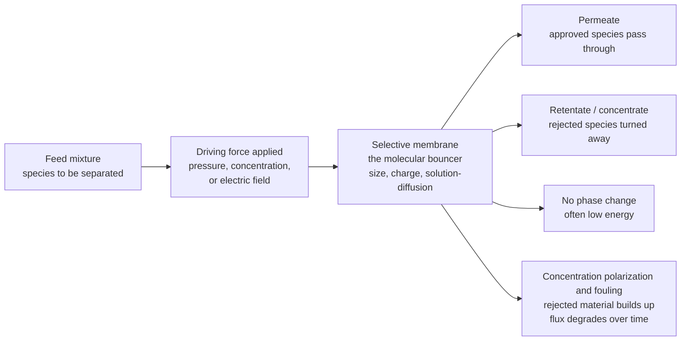

# 🧫 Membrane Separations

> [!abstract] TL;DR
> **Membrane separations** pull a mixture apart with a thin **selective barrier** rather than by boiling, freezing, or extracting — the membrane lets *some* species permeate while **rejecting** others, driven by a **pressure, concentration, or electrical driving force**, so the feed splits into a **permeate** (what passes) and a **retentate / concentrate** (what is turned away). Because most membrane processes involve **no phase change** (unlike distillation), they can be remarkably **energy-lean**, compact, and modular. Selectivity comes from four mechanisms: **sieving / size exclusion** in porous membranes, the **solution-diffusion** model in dense membranes (species dissolve into the polymer and diffuse through — the physics behind reverse osmosis and gas separation), **charge exclusion** in ion-exchange membranes, and **facilitated transport**. Ranked by pore size and driving force, the pressure-driven family runs **microfiltration → ultrafiltration → nanofiltration → reverse osmosis** (finer and finer, RO rejecting dissolved salts for **desalination**), joined by **gas separation** (air, H2 recovery, CO2 capture) and **pervaporation** (breaking azeotropes); concentration-driven **dialysis**; and electrically-driven **electrodialysis**. Performance is an eternal tug-of-war between **flux** (throughput per unit area) and **selectivity / rejection** (purity) — the fundamental tradeoff codified for gases by the **Robeson upper bound**. For reverse osmosis the applied pressure must first overcome the feed's **osmotic pressure** before any water flows: $J_w = A\,(\Delta P - \Delta\pi)$. And the practical Achilles heel is **concentration polarization and fouling** — rejected material piling up at the surface, throttling flux and forcing cleaning. Membranes are a **rate-based** separation that complements the equilibrium-staged operations, and they are among the fastest-growing and most researched unit operations in engineering.

## Intuition

**Analogy:** A membrane is a **molecular bouncer** — a thin barrier standing at the door of a mixture, checking every molecule and deciding who gets through. The criteria are simple and physical: **size** (too big to fit through the pore), **charge** (wrong sign, turned away), or **solubility** (how readily a molecule dissolves into the barrier material and slips across). Push the crowd against the door hard enough — with **pressure**, or with a **concentration difference** that makes molecules want to spread across — and the "approved" species pass to the far side (the **permeate**) while everyone else is rejected and left behind (the **retentate**). No one has to be boiled, evaporated, or dissolved into a solvent to make the split happen — the barrier does the sorting.

The most famous bouncer in the business is **reverse osmosis**. Salt water naturally wants to *dilute* fresh water across a membrane (that is osmosis); reverse osmosis shoves seawater against the membrane *hard enough to reverse that flow*, so tiny water molecules squeeze through a barrier so fine that hydrated salt ions cannot follow — and out the other side comes drinkable water, no kettle required. This is why membranes can be so energy-lean: separating **without a phase change** sidesteps the enormous latent heat that boiling demands. But the bouncer has a weakness — the door gets **clogged**. Rejected material piles up against the membrane (**fouling** and **concentration polarization**), and there is a permanent tug-of-war between how **much** gets through (flux) and how **pure** it is (selectivity): crank one up and the other tends to slip.

---

## How It Works

### Core Mechanics

1. **A driving force pushes the feed against the barrier.** Separation needs a gradient. Pressure-driven processes (microfiltration through reverse osmosis, plus gas separation) apply a **transmembrane pressure** $\Delta P$; dialysis uses a **concentration** difference; electrodialysis uses an **electric field** that drags ions through charged membranes. The feed stream splits into two: the **permeate** that crossed and the **retentate / concentrate** that did not.

2. **The membrane sorts by one of four mechanisms.** *(i)* **Sieving / size exclusion** — porous membranes act like a molecular sieve, passing anything smaller than the pore and blocking anything larger (microfiltration, ultrafiltration). *(ii)* **Solution-diffusion** — in *dense* (nonporous) membranes there are no fixed pores; a species must first **dissolve** into the polymer at the upstream face and then **diffuse** down its chemical-potential gradient to the downstream face. Permeability is the product **solubility $\times$ diffusivity**, and this single model governs both **reverse osmosis** and **gas separation**. *(iii)* **Charge exclusion (Donnan exclusion)** — fixed charges on ion-exchange or nanofiltration membranes repel co-ions of the same sign. *(iv)* **Facilitated transport** — a mobile carrier in the membrane selectively shuttles one species across.

3. **Reverse osmosis must beat the osmotic pressure first.** Under the solution-diffusion model the water flux is
   $$J_w = A\,(\Delta P - \Delta\pi),$$
   where $A$ is the membrane's **water permeability coefficient**, $\Delta P$ is the applied transmembrane pressure, and $\Delta\pi$ is the **osmotic pressure difference** between feed and permeate. No water flows until $\Delta P$ exceeds $\Delta\pi$ — for seawater ($\sim$35 g/L salt) that threshold is about **27 bar**, so practical seawater RO runs at **55-80 bar**. Salt, by contrast, permeates by its own solution-diffusion flux $J_s = B\,\Delta C_s$ that is roughly **independent of pressure**. Because more water dilutes the same trickle of leaked salt, **rejection rises as you push harder**.

4. **Flux and selectivity fight each other.** The two performance metrics are **flux** (volume or moles per unit area per time — throughput) and **selectivity / rejection** (how completely the unwanted species is excluded — purity). Making a membrane more permeable (open it up, thin it down) almost always lets more of the *wrong* species through too. For gas separation this tradeoff is so universal it has an empirical ceiling — the **Robeson upper bound**, a line on a log-log plot of selectivity versus permeability that real polymer membranes have historically been unable to cross.

5. **Rejected material piles up — concentration polarization and fouling.** As permeate leaves, the species it *rejected* accumulate in a thin layer right at the membrane face — **concentration polarization** — which raises the local osmotic pressure (cutting the effective driving force) and lowers observed rejection. Over longer times, particles, colloids, macromolecules, scale, and biofilm deposit and **foul** the membrane, throttling flux until it must be **cleaned or replaced**. This is the practical limit on almost every real installation.

6. **Modules pack enormous area into small volumes.** Because rate = flux $\times$ **area**, membranes are packaged to maximize area per volume: **spiral-wound** modules (flat sheets rolled around a permeate tube — the RO workhorse) and **hollow-fiber** bundles (thousands of self-supporting fibers — dominant in gas separation and dialysis), plus plate-and-frame and tubular geometries for fouling-prone feeds.

### Flow / Architecture



---

## Key Concepts

### Secondary Level

- **A membrane is a filter that sorts molecules.** It lets some things through and blocks others, based on how big they are, what charge they carry, or how easily they dissolve into the barrier.
- **You have to push.** A pressure or a concentration difference forces the mixture against the membrane; the stuff that passes is the **permeate**, and the stuff turned away is the **retentate** (concentrate).
- **Reverse osmosis makes fresh water from seawater.** Squeeze salt water hard against an extremely fine membrane and water molecules slip through while salt cannot — clean drinking water comes out the other side.
- **No boiling needed.** Unlike distillation, most membranes separate without changing the liquid into vapor, so they can use far less energy.
- **Membranes clog.** The rejected material builds up on the surface (**fouling**), slowly blocking the flow, so membranes must be cleaned or replaced — the main headache in real plants.
- **There is a trade-off.** You usually cannot get *both* a lot of flow (**flux**) *and* very pure product (**selectivity**) — improving one tends to worsen the other.

### Undergraduate Level

- **The membrane process ladder (by pore size and driving force).** Pressure-driven and getting finer: **microfiltration** (~0.1-10 µm: bacteria, suspended solids) → **ultrafiltration** (~1-100 nm: proteins, macromolecules, viruses) → **nanofiltration** (~1 nm: divalent ions, small organics — "loose RO") → **reverse osmosis** (dense, nonporous: rejects monovalent salts — desalination). Alongside sit **gas separation** (O2/N2, H2 recovery, CO2 capture), **pervaporation** (a liquid feed, vapor permeate — breaks **azeotropes** distillation cannot), concentration-driven **dialysis** (hemodialysis is the artificial kidney), and electrically-driven **electrodialysis** (ions dragged through ion-exchange membranes).
- **Solution-diffusion model.** For dense membranes there are no pores. Permeability $P = S \times D$ (solubility $\times$ diffusivity); flux $= (P/\ell)\,\times\,$driving force, where $\ell$ is membrane thickness. Thinner membrane → higher flux, which is why real membranes are **asymmetric** or **thin-film composite**: a paper-thin dense selective skin on a thick porous support that carries the pressure.
- **Reverse-osmosis flux law.** $J_w = A(\Delta P - \Delta\pi)$ for water and $J_s = B\,\Delta C_s$ for salt. Because $J_w$ grows with pressure but $J_s$ does not, the permeate concentration $C_p = J_s/J_w$ **falls** as you push harder, so **observed rejection** $R = 1 - C_p/C_f$ **rises** with applied pressure.
- **Osmotic pressure sets the floor.** Van 't Hoff: $\pi = i\,c\,R\,T$ (a colligative property). Seawater's $\pi \approx 27$ bar must be overcome before *any* fresh water is produced; this is the irreducible thermodynamic minimum energy of desalination.
- **Flux-selectivity tradeoff and the Robeson upper bound.** Plot gas selectivity $\alpha_{ij} = P_i/P_j$ against permeability $P_i$ on log-log axes: real polymers cluster **below** a straight-line ceiling (the Robeson bound). Rubbery polymers give high flux but low selectivity; glassy polymers give high selectivity but low flux — you rarely get both.
- **Concentration polarization.** Rejected solute accumulates in a boundary layer of thickness $\delta$; a film model gives a **polarization factor** $C_w/C_b = \exp(J_w/k)$, where $k$ is the mass-transfer coefficient. High flux worsens polarization, which is why cross-flow (sweeping the surface) beats dead-end filtration.
- **Module geometry.** Spiral-wound (high area/volume, moderate fouling resistance — RO/NF), hollow-fiber (very high area, low fouling resistance — gas separation, dialysis), tubular and plate-and-frame (low area, high fouling resistance — dirty feeds).

### Graduate Level

- **Solution-diffusion vs pore-flow, rigorously.** In the solution-diffusion model *pressure is uniform inside the membrane* and equal to the feed side; the transport driving force is the **chemical-potential (activity + pressure) gradient**, and the downstream face experiences a discontinuous pressure drop. This yields $J_w = A(\Delta P - \Delta\pi)$ and, crucially, predicts that water and salt permeate by **independent** parallel processes — the microscopic origin of the flux-vs-rejection behavior. Pore-flow (Hagen-Poiseuille) models instead apply to MF/UF where a continuous pressure gradient drives convective flow through fixed pores.
- **The permeability-selectivity ceiling and how to beat it.** The Robeson bound reflects a physical correlation: raising diffusivity selectivity (favoring small molecules) usually costs permeability. Materials that **transcend** the bound exploit different physics — **carbon molecular sieves**, **zeolite** and **metal-organic-framework (MOF) membranes**, **mixed-matrix membranes**, and **polymers of intrinsic microporosity (PIMs)** with rigid, contorted backbones that create interconnected free volume. The 1991 and 2008 Robeson analyses quantified the moving ceiling.
- **Concentration polarization and the flux paradox.** The film-theory result $\dfrac{C_w - C_p}{C_b - C_p} = \exp(J_w/k)$ shows that increasing driving pressure raises $J_w$, which *exponentially* raises wall concentration $C_w$, which raises local osmotic pressure and can drive observed rejection *down* — so beyond a point pushing harder buys little. In UF this produces a pressure-independent **limiting flux** $J_{lim} = k\ln(C_g/C_b)$ set by the **gel concentration** $C_g$, not by pressure.
- **Fouling taxonomy and control.** Reversible (cake/concentration polarization, removed by relaxation or backwash) vs irreversible (pore adsorption/blockage, chemical cleaning) vs **biofouling** (biofilm growth — the dominant RO fouling mode). Modeled by resistance-in-series $J_w = \Delta P /[\mu(R_m + R_c + R_f)]$. Mitigation: pretreatment, cross-flow shear, antiscalants, periodic backwash/CEB/CIP, and low-fouling surface chemistry.
- **Process configuration and energy.** RO in practice uses **staged arrays** with **energy-recovery devices** (pressure exchangers) that recapture the high-pressure retentate's energy, pushing seawater desalination toward its thermodynamic minimum (~1 kWh/m³ ideal; ~3-4 kWh/m³ in modern SWRO). **Recovery ratio** trades permeate yield against rising retentate osmotic pressure and scaling risk. Related driving-force-gradient processes include **forward osmosis** and **pressure-retarded osmosis** (osmotic power).
- **Maxwell-Stefan for membrane transport.** Rigorous multicomponent membrane flux (especially in gas separation, pervaporation, and electrodialysis with coupling) is described by Maxwell-Stefan equations with the membrane as an additional "component," capturing frame-of-reference and coupling effects that single-permeability Fickian models miss.

---

## Python Demo

```python
# Membrane Separations in one figure:
#
#   (a) FLUX-SELECTIVITY TRADEOFF  (gas separation, Robeson upper bound)
#       Real polymer membranes live on a log-log plot of SELECTIVITY
#       (alpha = P_fast / P_slow) vs PERMEABILITY of the fast gas. They
#       cluster BELOW an empirical ceiling, the Robeson upper bound:
#           alpha_upper = beta * P ** (-m)
#       Rubbery polymers -> high permeability, low selectivity.
#       Glassy polymers  -> low permeability, high selectivity.
#       You almost never get BOTH: that is the fundamental tradeoff.
#
#   (b) REVERSE-OSMOSIS FLUX vs APPLIED PRESSURE (solution-diffusion)
#       Water flux only turns on once applied pressure beats the feed's
#       OSMOTIC PRESSURE:
#           J_w = A * (dP - dPi)         (zero below the threshold dPi)
#       Salt leaks by a nearly pressure-independent flux, so the permeate
#       concentration C_p = J_s / J_w FALLS as you push harder and the
#       observed salt REJECTION  R = 1 - B / J_w  RISES with pressure.
#
# Requires: numpy, matplotlib   (no scipy)
import numpy as np
import matplotlib.pyplot as plt

# ============================================================
# (a) Flux-selectivity tradeoff:  Robeson-type upper bound (O2/N2)
# ============================================================
# Illustrative upper bound: alpha = beta * P**(-m)  (P in Barrer, O2)
beta, m = 12.0, 0.268
P_bound = np.logspace(-0.5, 3.2, 200)          # 0.3 ... ~1600 Barrer
alpha_bound = beta * P_bound ** (-m)

# A handful of representative O2/N2 membranes (P_O2 in Barrer, alpha=O2/N2)
membranes = {
    "Cellulose acetate":  (1.0,  4.0),
    "Polysulfone":        (1.4,  6.0),
    "Polyimide (glassy)": (2.0,  6.6),   # high selectivity, low flux
    "PIM-1 (microporous)":(370.,  4.0),  # near the bound
    "PDMS (rubbery)":     (600.,  2.1),  # high flux, low selectivity
    "Teflon AF2400":      (990.,  2.0),
}

# ============================================================
# (b) Reverse osmosis: solution-diffusion flux & rejection vs pressure
# ============================================================
A_w   = 1.0        # LMH/bar,  water permeability coefficient (typical SWRO)
dPi   = 28.0       # bar,      osmotic pressure of ~35 g/L seawater feed
B_s   = 0.25       # LMH,      lumped salt-passage coefficient (J_s ~ B*C_f)
Cf    = 35000.0    # mg/L,     seawater feed salinity

dP    = np.linspace(0.0, 80.0, 400)            # applied pressure, bar
Jw    = np.where(dP > dPi, A_w * (dP - dPi), 0.0)   # water flux, LMH
# permeate concentration & observed rejection (only where water flows)
with np.errstate(divide="ignore", invalid="ignore"):
    Cp  = np.where(Jw > 0, B_s * Cf / Jw, np.nan)   # mg/L
    Rej = np.where(Jw > 0, 1.0 - B_s / Jw, np.nan)  # fraction

# ---------------------------- console summary ----------------------------
print("=== (a) flux-selectivity tradeoff (O2/N2) ===")
for name, (P, al) in membranes.items():
    head = 100.0 * (al) / (beta * P ** (-m))    # % of upper-bound selectivity
    print(f"  {name:22s}  P_O2 = {P:7.1f} Barrer, alpha = {al:4.1f}"
          f"   ({head:3.0f} percent of the Robeson ceiling)")
print("  -> high permeability and high selectivity are mutually exclusive\n")

print("=== (b) seawater reverse osmosis (A=1 LMH/bar, osmotic dPi=28 bar) ===")
for p in (20, 28, 40, 60, 80):
    jw = max(A_w * (p - dPi), 0.0)
    if jw > 0:
        rej, cp = 1.0 - B_s / jw, B_s * Cf / jw
        print(f"  dP = {p:2d} bar -> Jw = {jw:5.1f} LMH,"
              f"  rejection = {100*rej:5.2f} percent,  permeate = {cp:6.1f} mg/L")
    else:
        print(f"  dP = {p:2d} bar -> Jw =   0.0 LMH   (below osmotic threshold, no flow)")

# ------------------------------- plotting --------------------------------
fig, (axL, axR) = plt.subplots(1, 2, figsize=(14, 6))
fig.suptitle("Membrane Separations: the flux-selectivity tradeoff and "
             "the reverse-osmosis osmotic threshold",
             fontsize=13, fontweight="bold")

# LEFT: Robeson upper bound + membrane scatter
axL.loglog(P_bound, alpha_bound, color="#264653", lw=2.5,
           label="Robeson-type upper bound")
axL.fill_between(P_bound, alpha_bound, 30, color="#e9c46a", alpha=0.25)
axL.text(3.0, 14.0, "FORBIDDEN\n(no membrane here)", fontsize=9,
         color="#9c6b0b", ha="center", fontweight="bold")
mk = ["o", "s", "^", "D", "v", "P"]
for (name, (P, al)), marker in zip(membranes.items(), mk):
    axL.scatter(P, al, s=90, marker=marker, zorder=5, label=name,
                edgecolor="k", linewidth=0.6)
axL.annotate("glassy: selective\nbut low flux", xy=(2.0, 6.6),
             xytext=(0.5, 9.5), fontsize=8, color="#2a6f4e",
             arrowprops=dict(arrowstyle="->", color="#2a6f4e"))
axL.annotate("rubbery: high flux\nbut poor selectivity", xy=(600, 2.1),
             xytext=(30, 1.35), fontsize=8, color="#8a3324",
             arrowprops=dict(arrowstyle="->", color="#8a3324"))
axL.set_xlabel("permeability of fast gas  P(O2)  [Barrer]  (throughput ->)")
axL.set_ylabel("selectivity  alpha = P(O2) / P(N2)  (purity ->)")
axL.set_title("(a) FLUX-SELECTIVITY TRADEOFF: the Robeson ceiling", fontsize=11)
axL.set_ylim(1.0, 20.0)
axL.grid(alpha=0.3, which="both")
axL.legend(loc="lower left", fontsize=7.5)

# RIGHT: RO flux + rejection vs applied pressure
axR.plot(dP, Jw, color="#1d3557", lw=2.6, label="water flux  Jw = A(dP - dPi)")
axR.fill_between(dP, 0, 55, where=(dP <= dPi), color="#adb5bd", alpha=0.30)
axR.axvline(dPi, color="#c1121f", ls="--", lw=2.0)
axR.text(dPi - 1.0, 50, "osmotic threshold\ndPi = 28 bar", color="#c1121f",
         fontsize=9, ha="right")
axR.text(9, 45, "no flow:\napplied P < osmotic P", fontsize=9, color="#495057",
         ha="center")
axR.set_xlabel("applied transmembrane pressure  dP  [bar]")
axR.set_ylabel("water flux  Jw  [LMH]", color="#1d3557")
axR.tick_params(axis="y", labelcolor="#1d3557")
axR.set_ylim(0, 55)
axR.set_title("(b) REVERSE OSMOSIS: beat the osmotic pressure first", fontsize=11)

ax2 = axR.twinx()
ax2.plot(dP, 100.0 * Rej, color="#2a9d8f", lw=2.6, ls="-.",
         label="salt rejection  R = 1 - B/Jw")
ax2.set_ylabel("salt rejection  [percent]", color="#2a9d8f")
ax2.tick_params(axis="y", labelcolor="#2a9d8f")
ax2.set_ylim(90, 100)

l1, lab1 = axR.get_legend_handles_labels()
l2, lab2 = ax2.get_legend_handles_labels()
axR.legend(l1 + l2, lab1 + lab2, loc="center right", fontsize=8)

plt.tight_layout(rect=[0, 0, 1, 0.95])
plt.show()
```

The **left panel** is the tradeoff made visible: on log-log axes every real gas-separation polymer sits *below* the Robeson upper bound, and they string out along it — the glassy polymers up in the high-selectivity / low-permeability corner, the rubbery silicones (PDMS, Teflon AF) down in the high-flux / low-selectivity corner. The shaded "forbidden" region above the line is territory ordinary polymers cannot reach; getting there at all requires exotic materials (carbon sieves, MOF and PIM membranes). The lesson is blunt: **you buy purity with throughput and vice versa**. The **right panel** is the reverse-osmosis reality: below the seawater osmotic pressure of ~28 bar the water flux is flat *zero* — you can press all you like and nothing comes through, because osmosis is pushing back at least as hard. Cross the threshold and flux climbs **linearly** with the excess pressure $\Delta P - \Delta\pi$, while the salt rejection (dash-dot, right axis) **climbs toward 99.5 percent** — because the same small salt leak is diluted by ever more permeating water. This is exactly why practical seawater RO runs at 55-80 bar: far above the thermodynamic floor, to get useful flux *and* high rejection at once.

---

## Real-World Applications

> **Example — seawater reverse osmosis desalination (SWRO).** A modern SWRO plant is a membrane process end to end. Pretreated seawater is pumped to ~55-80 bar and fed into **spiral-wound thin-film-composite** modules whose paper-thin polyamide skin rejects >99.5 percent of dissolved salt by **solution-diffusion**, so water permeates and brine is concentrated. The applied pressure exists for one reason — to **overcome the ~27 bar osmotic pressure** of seawater ($J_w = A(\Delta P - \Delta\pi)$) with enough margin left over to drive useful flux. The dominant operating problems are exactly the two this note stresses: **concentration polarization**, which raises the local osmotic pressure at the membrane face and eats into the driving force, and **fouling / biofouling / scaling**, which forces pretreatment, antiscalant dosing, and periodic cleaning. And because pumping to 80 bar is the energy cost, modern plants recover most of that energy from the high-pressure brine with **pressure-exchanger energy-recovery devices**, pushing consumption down toward ~3-4 kWh per m³ — a fraction of what thermal (multi-stage flash) desalination burns, precisely because no water is boiled. Reverse osmosis now supplies drinking water to hundreds of millions of people.

- **Water and wastewater purification.** Beyond seawater, **brackish-water RO**, **nanofiltration** for water softening and micropollutant removal, and **ultra/microfiltration** for turbidity, bacteria, and virus removal underpin municipal and industrial water treatment and water reuse.
- **Food, dairy, and beverage processing.** **Ultrafiltration** concentrates milk proteins and makes whey concentrates and cheese; **nanofiltration** demineralizes; **RO** concentrates juice and coffee — all *without heat*, preserving flavor and nutrients that thermal evaporation would destroy.
- **Gas separation membranes.** Hollow-fiber modules perform **air separation** (nitrogen generation, oxygen enrichment), **hydrogen recovery** from ammonia-plant and refinery purge gas, **natural-gas sweetening** (CO2/H2S removal), and **post-combustion CO2 capture** — every one a play on the permeability-selectivity tradeoff and the Robeson bound.
- **Pervaporation for azeotropes.** Dense hydrophilic membranes **dehydrate ethanol and solvents past the azeotrope** that ordinary distillation cannot cross, evaporating only the permeate — a hybrid that saves large amounts of energy in bioethanol and solvent recovery.
- **Hemodialysis — the artificial kidney.** Blood flows past a bundle of hollow-fiber membranes against a counter-current dialysate; **urea and toxins diffuse out** down their concentration gradient (dialysis) while blood cells and proteins are retained — a life-sustaining, concentration-driven membrane separation performed on millions of patients.
- **Electrodialysis and chlor-alkali.** Ion-exchange membranes driven by an electric field **desalinate brackish water**, recover acids and bases, and are central to **chlor-alkali** production and increasingly to green-hydrogen electrolyzers.

---

## Common Pitfalls

- **Forgetting to beat the osmotic pressure.** In reverse osmosis, *no* water permeates until $\Delta P > \Delta\pi$. Sizing an RO unit from applied pressure alone, without subtracting the feed's osmotic pressure (and its *rise* as the feed concentrates along the module), badly overpredicts flux. Always use the **net** driving force $\Delta P - \Delta\pi$.
- **Chasing flux and selectivity at the same time.** They trade off (the Robeson bound for gases, flux-vs-rejection for liquids). Opening pores or thinning the skin to boost flux lets more of the wrong species through. Pick the operating point the *separation* needs, and reach for exotic materials only when the ordinary tradeoff cannot meet spec.
- **Ignoring concentration polarization.** Rejected solute piles up at the membrane face, raising local osmotic pressure and *lowering observed rejection*, and it worsens *exponentially* with flux ($C_w/C_b = e^{J_w/k}$). Dead-end operation and low cross-flow velocity make it far worse; cross-flow that sweeps the surface is usually mandatory.
- **Confusing polarization (reversible) with fouling (often not).** Concentration polarization vanishes the moment you stop permeating; fouling and scale do not — they need backwash, chemical cleaning, or replacement. Treating a fouled membrane as merely polarized (or vice versa) leads to the wrong fix.
- **Under-designing pretreatment.** Most premature membrane death is **fouling and biofouling**. Skimping on pretreatment (coagulation, MF/UF, antiscalant, dechlorination) to save capital cost trades it back many times over in cleaning, lost flux, and shortened membrane life.
- **Assuming denser is always better.** A tighter membrane rejects more but permeates less and fouls faster; an over-tight choice can make a separation uneconomic. Match the process (MF/UF/NF/RO) to the *actual* size or charge of what must be removed.
- **Treating membranes as equilibrium stages.** Membrane separation is **rate-based**, not equilibrium-staged like distillation — there is no "theoretical plate." Design from **flux, area, permeability, and rejection**, not from equilibrium relations.

---

## Related Concepts

**Biology vault — membrane transport is the same physics in living cells**
- [[The_Cell_Membrane_and_Transport]] — passive diffusion, facilitated (carrier-mediated) transport, and **osmosis** across the lipid bilayer are exactly the mechanisms engineered here; the bilayer is nature's dense selective membrane, and cell osmotic behavior is the biological face of the same $\pi$ that reverse osmosis must overcome

**Chemistry vault — the thermodynamics of the osmotic driving force**
- [[Phase_Equilibria_and_Colligative_Properties]] — the **osmotic pressure** $\pi = i c R T$ that sets the reverse-osmosis threshold is a colligative property; this note supplies the equilibrium thermodynamics behind the $\Delta\pi$ term in $J_w = A(\Delta P - \Delta\pi)$

**Materials Science vault — what membranes are actually made of**
- [[Polymer_Structure_and_Glass_Transition]] — glassy vs rubbery polymers is the *material* origin of the flux-selectivity split: rigid glassy chains give high selectivity / low permeability, flexible rubbery chains the reverse, and free volume governs solution-diffusion transport
- [[Nanofabrication_and_Self_Assembly]] — the asymmetric, thin-film-composite, and nanoporous architectures (and emerging MOF / graphene-oxide membranes) that push past the Robeson bound are fabricated by exactly these nanoscale patterning and self-assembly routes

**Oceanography vault — the feedstock for desalination**
- [[Seawater_Composition_and_Major_Ions]] — the major-ion makeup and salinity of seawater fix its osmotic pressure and its scaling and fouling behavior, defining the feed that seawater reverse osmosis must separate

*Section siblings (Chemical Engineering, Separation Processes): this note is the **rate-based** member of the separations family introduced in Separation_Processes_Overview, and it rests directly on the molecular transport of Mass_Transfer_and_Diffusion (solution-diffusion, film theory, and the mass-transfer coefficient that governs concentration polarization) and on the interfacial-resistance ideas of Interphase_and_Multiphase_Transport. It **complements** the equilibrium-staged operations — Distillation and Absorption_and_Stripping — offering a phase-change-free, often lower-energy alternative, and hybridizing with them (for example, pervaporation breaking the azeotropes that trap distillation).*

---

## Review Questions

**Secondary**
1. A home reverse-osmosis unit turns tap water (or even seawater) into pure drinking water without ever boiling it. Using the "molecular bouncer" picture, explain *how* the membrane separates salt from water, *what* you have to do to make water pass through, and *why* this can use much less energy than boiling the water. Then explain, in one sentence, why the unit eventually needs its filter cleaned or replaced.

**Undergraduate**
2. A seawater RO membrane has a water permeability coefficient $A = 1.0\ \mathrm{LMH/bar}$, the feed osmotic pressure is $\Delta\pi = 28\ \mathrm{bar}$, the lumped salt-passage coefficient is $B = 0.25\ \mathrm{LMH}$, and the feed salinity is $C_f = 35{,}000\ \mathrm{mg/L}$. (a) Compute the water flux $J_w = A(\Delta P - \Delta\pi)$ at applied pressures of 20, 40, and 70 bar — what happens at 20 bar and why? (b) Using $C_p = B C_f / J_w$ and rejection $R = 1 - C_p/C_f$, find the observed salt rejection at 40 and 70 bar. (c) Explain physically why rejection *increases* with applied pressure even though the salt-passage coefficient $B$ does not change.

**Graduate**
3. A polymer gas-separation membrane for O2/N2 is being improved. (a) Sketch the Robeson upper bound on log-log selectivity-vs-permeability axes and explain, in terms of the solution-diffusion model ($P = S\times D$), *why* raising permeability tends to lower selectivity — the physical origin of the tradeoff. (b) Name two classes of materials that push past the bound and the distinct transport mechanism each exploits. (c) Separately, for a high-recovery ultrafiltration process, derive the **limiting flux** $J_{lim} = k\ln(C_g/C_b)$ from film theory, explain why beyond a certain pressure the flux becomes pressure-independent, and connect this to why concentration polarization — not the intrinsic membrane permeability — sets the practical ceiling.

---

## Sources

- R. W. Baker — *Membrane Technology and Applications*, 3rd ed. (Wiley, 2012) — the standard modern reference on membrane processes, the solution-diffusion model, the Robeson bound, and module and process design
- M. Mulder — *Basic Principles of Membrane Technology*, 2nd ed. (Kluwer, 1996) — a clear pedagogical foundation covering transport mechanisms, membrane preparation, polarization, and fouling
- J. D. Seader, E. J. Henley & D. K. Roper — *Separation Process Principles*, 3rd ed. (Wiley, 2011) — integrates membrane separations with the broader rate-based and equilibrium-staged separation framework
- P. C. Wankat — *Separation Process Engineering*, 4th ed. (Prentice Hall, 2016) — practical, design-oriented treatment of RO, UF, gas separation, pervaporation, and electrodialysis
- L. M. Robeson — "The upper bound revisited," *Journal of Membrane Science* 320 (2008) 390-400 — the definitive statement of the permeability-selectivity tradeoff for polymer gas-separation membranes

---

#chemical-engineering #membranes #reverse-osmosis #flux-selectivity #desalination
