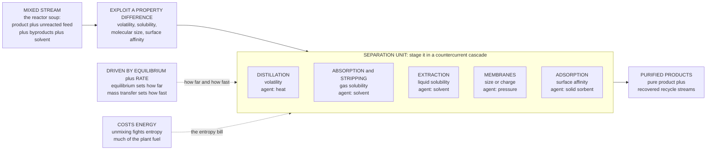

# ⚗️ Separation Processes: Unmixing the Reactor's Soup

> [!abstract] TL;DR
> **Separation processes** are the unit operations that pull a mixture back apart into pure streams — and they are the single largest slice of equipment, capital, and **energy** in most chemical plants (distillation alone consumes a notable fraction of all industrial energy). The reason they dominate is structural: a **reactor never makes a pure product**. It hands off a *soup* of product, unreacted feed, byproducts, and solvent, and delivering saleable product plus recovering feed for recycle *requires* separation. Every separation runs on **one unifying idea** — exploit a **property difference** between the components using a **separating agent**: volatility (distillation, agent = heat), gas solubility (absorption), liquid solubility (extraction), surface affinity (adsorption), or molecular size/charge (membranes). The central engineering device is the **equilibrium stage** — a theoretical contact that brings two streams to equilibrium (real stages fall short by a *stage efficiency*) — and the trick that turns a feeble one-stage split into a razor-sharp one is **staging in a countercurrent cascade**: chaining stages multiplies a tiny per-stage separation factor into a huge overall one ($S_{\text{overall}}\approx\alpha^{N}$). Two limits govern every design: **equilibrium** (thermodynamics — *how far* a stage can go, from VLE/LLE/isotherms) and **rate** (**mass transfer** — *how fast*, setting column height via HTU/NTU). The harder the split (separation factor near 1, close-boiling mixtures), the more stages and the more energy it takes — because **unmixing fights the Second Law**, and that entropy debt is paid in fuel. This opener frames distillation, absorption, extraction, membranes, and adsorption as variations on one theme — *exploit a property difference, stage it, and pay the energy* — and sets up the detailed notes that follow.

---

## Intuition

**Analogy:** Nature *loves* to mix things and *hates* to unmix them. Stir a drop of cream into coffee and it blends in seconds; you will wait until the heat death of the universe for it to spontaneously separate back out. That one-way street is the Second Law at work — mixing raises entropy, so it happens for free, and unmixing lowers it, so it never happens on its own. But almost everything a reactor makes comes out exactly as that kind of mess: a **soup** of the product you wanted, the feed that never reacted, the byproducts you did not want, and the solvent you dissolved it all in. To sell a pure chemical and to recycle the expensive unreacted feed, you must un-stir the coffee — and that takes a clever machine and a lot of energy.

Here is the whole trick. You can never grab "the product molecules" directly — they look nearly identical to everything else. Instead you find some **property** on which the components *differ*, even slightly: maybe one boils at a lower temperature, maybe one dissolves better in a solvent, maybe one is a bigger molecule, maybe one sticks harder to a surface. Then you build a device that **amplifies that one small difference**, over and over across many repeated stages, until it becomes a clean split. Distillation amplifies a difference in *boiling point*; extraction amplifies a difference in *solubility*; a membrane amplifies a difference in *size*. Every separation is the same idea wearing different clothes: **take a faint property difference, stage it until it's sharp, and pay the entropy bill in fuel.** And because that bill is unavoidable, separation is where a chemical plant spends much of its energy and much of its steel — half the plant, quite literally, exists just to unmix the soup.

---

## How It Works

### Core Mechanics

1. **Why separations exist: reactors make mixtures, not products.** A reactor is governed by equilibrium and kinetics, so it converts only *part* of the feed and always spawns byproducts, usually in a solvent. The plant must then (a) purify the product to spec, (b) recover and **recycle** unreacted feed (throwing it away is throwing away money), and (c) treat wastes. All three are separation jobs — which is why separation trains typically dominate a plant's **capital cost** and **energy** budget, and why mastering them is central to process economics and sustainability.

2. **The unifying principle: a property difference plus a separating agent.** No property difference, no separation — if two components were identical in every measurable way you could never split them. So every operation picks a property on which the components differ and applies a **separating agent** to act on it. The agent is either **energy** (an *energy-separating agent*, e.g. heat that boils off the volatile component) or **matter** (a *mass-separating agent*, e.g. a solvent, an adsorbent, or a membrane). The map of the field is essentially the map of which property and which agent:

   | Operation | Property exploited | Separating agent |
   |-----------|--------------------|------------------|
   | **Distillation** | volatility (boiling point) | heat (energy) |
   | **Absorption / stripping** | gas solubility in a liquid | solvent (mass) |
   | **Liquid-liquid extraction** | solubility in two liquids | solvent (mass) |
   | **Adsorption / chromatography** | affinity for a surface | solid sorbent (mass) |
   | **Membranes** (RO, UF, gas) | molecular size / charge | membrane + pressure (mass) |
   | **Crystallization / drying** | phase-change / solubility | heat, cooling (energy) |

3. **The equilibrium stage: the atom of separation.** The workhorse idealization is the **theoretical (equilibrium) stage** — a single contact in which the two streams (say vapor and liquid) mix so intimately that they *leave in equilibrium* with each other. One stage splits the components only as far as thermodynamics allows in a single step, quantified by the **separation factor** $\alpha$ (for distillation, the **relative volatility**; for extraction, the ratio of distribution coefficients). Real hardware never quite reaches equilibrium, so we multiply by a **stage efficiency** (Murphree efficiency, or HETP for packing) to convert *theoretical* stages into *actual* trays or metres of packing.

4. **Staging in a countercurrent cascade: amplifying a small split.** A single stage with $\alpha=2$ barely separates anything useful. The breakthrough is to **stack stages in a countercurrent cascade**: the two phases flow in *opposite* directions, so each stage sees fresh, not-yet-equilibrated partner material, and the small per-stage enrichment **compounds** stage after stage. At total reflux the overall separation factor is the *product* of the per-stage factors, $S_{\text{overall}}=\alpha^{N}$ (the **Fenske** result) — an exponential amplifier. This is why a distillation column has dozens of trays, and why the graphical **McCabe-Thiele** stage-stepping construction (or its rate-based cousin, HTU/NTU) is the central design tool.

5. **The two limits: equilibrium (how far) and rate (how fast).** Every separation is bounded from two sides. **Equilibrium** (thermodynamics) sets *how far* a stage can separate — read from a **VLE** curve, an **LLE** tie-line, or an **adsorption isotherm**; it fixes the *minimum* number of stages (at total reflux) and the *minimum* separating-agent flow (minimum reflux, minimum solvent). **Rate** (**mass transfer**) sets *how fast* the streams approach that equilibrium — it fixes real column **height** and diameter through the mass-transfer coefficient and interfacial area (the HTU/NTU or transfer-unit machinery). Thermodynamics says where you can go; transport says how big a machine it takes to get there.

6. **The energy price: unmixing fights entropy.** Producing pure streams from a mixture *lowers* entropy, so the Second Law demands a **minimum work of separation**, $W_{\min}=-RT\sum_i x_i\ln x_i$ per mole (times a factor for the split). Real processes spend *far* more than this thermodynamic floor — distillation, which pays with low-grade heat, is notoriously inefficient — which is exactly why **energy-efficient and intensified separations** (heat integration, hybrid membrane-distillation, reactive distillation) are a major research frontier. When the property difference is small (separation factor near 1, close-boiling mixtures), the required stages and reflux **explode**, and so does the energy bill.

### Flow / Architecture



---

## Key Concepts

### Secondary Level

- **A reactor makes a mess, not a product.** Whatever a chemical reaction produces comes out mixed with leftover ingredients, unwanted extras, and the liquid it was dissolved in. Getting the pure stuff out — and saving the leftovers to reuse — is a separate job called separation, and it takes about **half a chemical plant** to do.
- **You can't grab the molecules directly — you find a difference.** The product molecules look almost like everything else, so you cannot just pick them out. Instead you find something they do *differently*: boil at a different temperature, dissolve better in a solvent, be a different size. Then you build a machine that magnifies that one difference.
- **Boiling, dissolving, sticking, sieving.** The big families are: heat the soup so the easy-to-boil part evaporates (**distillation**); wash a gas or liquid with a solvent that grabs one part (**absorption**, **extraction**); let one part stick to a special solid (**adsorption**); or push it through a filter with holes the right size (**membranes**).
- **One weak difference, repeated, becomes a clean split.** A single step barely separates anything. But repeat the step many times, one after another (that is *staging*), and a tiny difference compounds into an almost perfect split — the same way many gentle sieves can sort sand from gravel that one sieve could not.
- **Unmixing always costs energy.** Mixing happens for free (stir cream into coffee), but un-mixing never happens on its own — you must *pay* for it with energy, usually heat. That is why separation is where a plant burns much of its fuel.

### Undergraduate Level

- **The separating-agent taxonomy.** Classify any operation by (i) the **property difference** it exploits and (ii) the **separating agent** — *energy-separating agent* (ESA: heat/cooling, as in distillation, crystallization) versus *mass-separating agent* (MSA: solvent, adsorbent, membrane, as in absorption, extraction, adsorption). ESAs avoid contaminating the product but are energy-hungry; MSAs can be gentler but introduce a new component that must itself be recovered (another separation!).
- **The equilibrium (theoretical) stage.** A stage where exiting streams leave in phase equilibrium. For a binary at constant molar overflow, VLE gives $y=\alpha x/[1+(\alpha-1)x]$ with **relative volatility** $\alpha=(y_A/x_A)/(y_B/x_B)$. Real trays reach only a fraction of this: **Murphree efficiency** $E_{MV}=(y_n-y_{n+1})/(y_n^*-y_{n+1})$; packed columns use **HETP** (height equivalent to a theoretical plate).
- **Countercurrent cascade and the Fenske limit.** In a countercurrent column, mass balances (operating lines) plus equilibrium (the VLE curve) are solved graphically by **McCabe-Thiele** stage-stepping. Two bounding cases: **total reflux** gives the *minimum stages* via **Fenske**, $N_{\min}=\ln[(x_D/(1-x_D))((1-x_B)/x_B)]/\ln\alpha$, and *infinite* stages gives the **minimum reflux** via **Underwood**. Real columns operate between these limits — a stages-versus-reflux trade-off.
- **Overall separation factor and amplification.** At total reflux the column multiplies the per-stage factor: $S_{\text{overall}}=(x_D/(1-x_D))\,((1-x_B)/x_B)=\alpha^{N}$. Taking logs, $N=\ln S_{\text{overall}}/\ln\alpha$ — the **stage count scales as $1/\ln\alpha$**, so it blows up as $\alpha\to 1$. Close-boiling mixtures ($\alpha\approx 1.05$) can need *hundreds* of stages.
- **Rate side: HTU and NTU.** Column height $Z=H_{OG}\cdot N_{OG}$, where the **height of a transfer unit** $H_{OG}=G/(K_G a\,P)$ bundles the mass-transfer coefficient and interfacial area (the *rate* resistance) and the **number of transfer units** $N_{OG}=\int dy/(y-y^*)$ measures the separation's thermodynamic *difficulty*. This is the continuous-contactor twin of stage-counting (see [[Mass_Transfer_and_Diffusion]]).
- **Minimum work of separation.** The thermodynamic floor to separate an ideal mixture is $W_{\min}=-RT\sum_i x_i\ln x_i$ per mole of mixture; a sharp binary split of a 50/50 feed needs at least $RT\ln 2$ per mole of feed. Real distillation spends 5-100x this because it degrades high-quality heat — the **thermodynamic efficiency** of separation is often only a few percent.

### Graduate Level

- **Equilibrium- vs rate-based classification.** Operations split into **equilibrium-stage** processes (distillation, absorption, extraction — modeled as trains of equilibrium stages corrected by efficiency) and **rate-governed** processes (membranes, most adsorption — where there is *no* equilibrium stage and flux is set directly by a driving force and a transport coefficient). Modern **rate-based (nonequilibrium) models** dissolve even the distillation "stage," solving the coupled Maxwell-Stefan mass-transfer and energy balances on each tray simultaneously — essential for reactive distillation and highly non-ideal systems where the equilibrium-stage-plus-efficiency shortcut fails.
- **The thermodynamic backbone.** Separation feasibility lives in the phase diagram. **Azeotropes** (where $\alpha\to 1$) impose distillation boundaries that ordinary columns cannot cross, forcing **azeotropic/extractive distillation**, pressure-swing, or hybrid schemes; **liquid-liquid** phase splits (from activity-coefficient models, see [[Solution_Thermodynamics_and_Activity]]) enable extraction; **adsorption isotherms** (Langmuir, favorable vs unfavorable) shape breakthrough fronts and set cyclic (PSA/TSA) design. Non-ideality — quantified by activity coefficients and the thermodynamic factor $\Gamma=\partial\ln a_i/\partial\ln x_i$ — is where real separations get hard.
- **Synthesis of separation *trains*.** A multicomponent mixture needs a *sequence* of columns; the number of possible sequences grows combinatorially, and their order dominates total cost. **Heuristics** (do the easiest/most-plentiful split first, remove the most volatile early, save the hardest/highest-purity split for last) and **superstructure optimization** (MINLP over the flowsheet) choose the train. This is a core task of **process synthesis** and is tightly coupled to heat integration.
- **Energy, exergy, and intensification.** Distillation's inefficiency is an **exergy** problem: heat is added at the reboiler (high $T$) and rejected at the condenser (low $T$), degrading work potential across the whole column. Remedies target the exergy loss — **heat-integrated / diabatic columns**, **mechanical vapor recompression**, **dividing-wall columns** (one shell doing the work of two, saving ~30% energy and capital), **reactive distillation** (reaction and separation in one vessel, sidestepping equilibrium limits), and **membrane-distillation hybrids**. Separation energy efficiency is a flagship sustainability and decarbonization target because separations are ~10-15% of *global* energy use.
- **Where the equilibrium-stage abstraction leaks.** Stage efficiency is not a constant — it varies with hydraulics, composition, and even *direction* of mass transfer (Murphree efficiencies can exceed 1 or go negative in multicomponent systems due to diffusional coupling). Entrainment, weeping, flooding, and maldistribution corrupt the idealized cascade. Membranes face **concentration polarization** and fouling that no equilibrium picture captures. The competent designer knows the equilibrium-stage model is a *scaffold*, not the building.
- **The rate-vs-equilibrium division of labor, formalized.** Interphase transfer stacks film resistances in series across an interface pinned at equilibrium (two-film theory); the *equilibrium* relation (VLE/LLE/Henry) supplies the boundary condition and the driving-force datum ($y-y^*$), while the *rate* (mass-transfer coefficient times interfacial area) supplies the flux. Column height is literally **(thermodynamic difficulty $N_{OG}$) × (rate resistance $H_{OG}$)** — the two limits multiplied. Every detailed separation note downstream is an elaboration of this single product.

---

## Python Demo

```python
# SEPARATION PROCESSES -- the essence of STAGED separation in one figure.
#
# The whole field rests on two facts:
#   (1) a single equilibrium stage gives only a LIMITED split, set by the
#       SEPARATION FACTOR alpha (relative volatility, or distribution-coeff
#       ratio); and
#   (2) STAGING many stages in a countercurrent CASCADE MULTIPLIES that split
#       -- at total reflux the overall separation factor is  S = alpha**N
#       (the Fenske result), an exponential amplifier that turns a feeble
#       per-stage difference into a razor-sharp overall separation.
#
# Panel A: product purity vs number of stages -> a small alpha still reaches
#          high purity, it just needs MORE stages (the cascade at work).
# Panel B: overall separation factor S = alpha**N vs N (log axis) -> the
#          exponential amplification made explicit.
# Panel C: stages required to hit 99% purity vs the separation factor alpha
#          -> as alpha -> 1 (close-boiling mixtures) the stage count EXPLODES.
# Panel D: minimum reflux (an ENERGY proxy) vs alpha -> the energy of
#          separation blows up for hard, near-unity-alpha splits.
#
# Requires: numpy, matplotlib
import numpy as np
import matplotlib.pyplot as plt

# ---------------------------------------------------------------------
# Symmetric total-reflux (Fenske) cascade model.
#   Overall factor S = (xD/(1-xD)) * ((1-xB)/xB) = alpha**N.
#   Take a SYMMETRIC split (xB = 1 - xD) so both product streams are
#   equally pure; then  (xD/(1-xD))**2 = alpha**N, giving the closed form
#       xD(N) = r / (1 + r),   r = alpha ** (N/2).
# ---------------------------------------------------------------------
def purity_vs_stages(alpha, N):
    r = alpha ** (N / 2.0)
    return r / (1.0 + r)                     # product mole fraction xD

def stages_for_purity(alpha, xD, xF=0.5):
    # symmetric split: N = ln[(xD/(1-xD))**2] / ln(alpha) = 2 ln(xD/(1-xD))/ln a
    return 2.0 * np.log(xD / (1.0 - xD)) / np.log(alpha)

def min_reflux_underwood(alpha, xD=0.99, xF=0.5):
    # Underwood minimum reflux, saturated-liquid feed, sharp binary split:
    #   R_min = (1/(alpha-1)) * (xD/xF - alpha*(1-xD)/(1-xF))
    # Reboiler duty scales with (R_min + 1) -> an ENERGY proxy.
    return (1.0 / (alpha - 1.0)) * (xD / xF - alpha * (1.0 - xD) / (1.0 - xF))

# ---------------------------------------------------------------------
# Console summary: how many stages to reach 99% for a range of alphas
# ---------------------------------------------------------------------
print("=== Staging amplifies a small per-stage split (target purity 99%) ===")
print(f"{'alpha':>7} {'stages N':>10} {'min reflux':>12}")
for a in [5.0, 2.5, 1.5, 1.2, 1.1, 1.05]:
    N99 = stages_for_purity(a, 0.99)
    Rm  = min_reflux_underwood(a, 0.99)
    print(f"{a:7.2f} {N99:10.1f} {Rm:12.2f}")
print("  -> as alpha -> 1 (close-boiling), stages AND reflux/energy explode\n")

# ============================== PLOTS ==============================
fig, ax = plt.subplots(2, 2, figsize=(13, 9.5))
fig.suptitle("Separation Processes: a cascade amplifies a small property "
             "difference into a sharp split -- and pays in energy",
             fontsize=14, fontweight="bold")

alphas = [1.1, 1.3, 2.0, 4.0]
colors = ["#d62728", "#ff7f0e", "#2ca02c", "#1f77b4"]

# --- A: product purity vs number of stages (the cascade at work) ---
axA = ax[0, 0]
N = np.arange(0, 61)
for a, c in zip(alphas, colors):
    axA.plot(N, 100 * purity_vs_stages(a, N), color=c, lw=2.6,
             label=f"alpha = {a}")
axA.axhline(99, ls=":", color="k", lw=1.2)
axA.text(1, 99.3, "99% purity target", fontsize=8)
axA.set_xlabel("number of equilibrium stages  N")
axA.set_ylabel("product purity  xD  [%]")
axA.set_title("A. Cascade amplification: even a weak alpha reaches\n"
              "high purity -- it just needs more stages")
axA.set_ylim(45, 101)
axA.legend(fontsize=9, loc="lower right"); axA.grid(alpha=0.3)

# --- B: overall separation factor S = alpha**N (exponential amplifier) ---
axB = ax[0, 1]
for a, c in zip(alphas, colors):
    axB.semilogy(N, a ** N, color=c, lw=2.6, label=f"alpha = {a}")
axB.set_xlabel("number of equilibrium stages  N")
axB.set_ylabel("overall separation factor  S = alpha^N  (log)")
axB.set_title("B. Staging MULTIPLIES the split:\n"
              "each stage multiplies S by alpha (Fenske)")
axB.legend(fontsize=9, loc="upper left"); axB.grid(alpha=0.3, which="both")

# --- C: stages needed for 99% purity vs separation factor (explosion) ---
axC = ax[1, 0]
a_grid = np.linspace(1.02, 5.0, 400)
N_needed = stages_for_purity(a_grid, 0.99)
axC.plot(a_grid, N_needed, color="#6a0dad", lw=3.0)
axC.fill_between(a_grid, N_needed, alpha=0.12, color="#6a0dad")
for a in [1.05, 1.2, 2.0]:
    axC.plot(a, stages_for_purity(a, 0.99), "o", color="#6a0dad", ms=7)
    axC.annotate(f"alpha={a}\n{stages_for_purity(a,0.99):.0f} stages",
                 (a, stages_for_purity(a, 0.99)),
                 textcoords="offset points", xytext=(12, 6), fontsize=8)
axC.set_xlabel("separation factor  alpha  (relative volatility)")
axC.set_ylabel("stages needed for 99% purity")
axC.set_title("C. The tyranny of alpha -> 1:\n"
              "close-boiling mixtures need a wall of stages")
axC.set_ylim(0, 250); axC.grid(alpha=0.3)

# --- D: minimum reflux (energy proxy) vs separation factor ---
axD = ax[1, 1]
a_grid2 = np.linspace(1.05, 5.0, 400)
Rmin = min_reflux_underwood(a_grid2, 0.99)
axD.plot(a_grid2, Rmin + 1.0, color="#c1121f", lw=3.0)
axD.fill_between(a_grid2, Rmin + 1.0, alpha=0.12, color="#c1121f")
axD.set_xlabel("separation factor  alpha  (relative volatility)")
axD.set_ylabel("boilup ~ (R_min + 1)   [energy proxy]")
axD.set_title("D. Unmixing costs energy: reboiler duty explodes\n"
              "as the split gets harder (alpha -> 1)")
axD.set_ylim(0, 45); axD.grid(alpha=0.3)

plt.tight_layout(rect=[0, 0, 1, 0.95])
plt.show()
```

Running this prints a stage/energy table, then draws four panels that together *are* the theory of staged separation. Panel **A** is the headline: a mixture with a weak separation factor (say $\alpha=1.1$, a close-boiling pair) still reaches 99% purity — it simply demands *many more stages*, exactly what a tall distillation column provides. Panel **B** shows *why*: the overall separation factor grows as $\alpha^{N}$, so the cascade is an **exponential amplifier** — each added stage multiplies the split by $\alpha$, turning a feeble per-stage difference into a sharp overall one. Panel **C** is the flip side and the field's central pain: to hit a fixed purity the required stage count scales as $1/\ln\alpha$, so as $\alpha\to 1$ it **explodes** — a $\alpha=1.05$ split can need ~180 stages where $\alpha=2$ needs ~13. Panel **D** ties it to money and fuel: the minimum reflux (hence reboiler duty and energy) also blows up as $\alpha\to 1$, because separating near-identical components fights the Second Law the hardest. Easy split, short cheap column; hard split, tall energy-hungry one — the entire economics of separation in one shape.

---

## Real-World Applications

> **Example — a crude-oil refinery's atmospheric distillation column, the largest separation on earth by volume.** Crude oil is the ultimate "reactor soup" (nature's reactor, over geologic time): a mixture of thousands of hydrocarbons. The refinery's first move is a single enormous **distillation** column that exploits one property difference — **volatility** — with one separating agent — **heat**. Vaporized crude rises through dozens of trays; the light components (LPG, naphtha, gasoline) concentrate up top where it is cool, the heavy ones (diesel, gas oil, residue) settle toward the hot bottom, and intermediate cuts are drawn off as **side streams** at intermediate stages. Each tray is an equilibrium-stage approximation; the *countercurrent* contact of rising vapor and descending reflux liquid is what amplifies the boiling-point spread into clean product cuts. That single column can process hundreds of thousands of barrels a day, and the heat it consumes is a large fraction of the refinery's — and the nation's — energy budget. Every downstream unit (catalytic reformers, crackers) then feeds *its* product soup into yet more separation trains. The refinery is, structurally, a giant separation plant with reactors bolted on.

- **Air separation (cryogenic distillation).** The oxygen for steelmaking and the nitrogen for inerting come from distilling *liquefied air* — an $\alpha$-near-1 split of O2/N2 that needs tall, superbly heat-integrated columns, a textbook case of the "close-boiling = many stages + much energy" story from the demo.
- **Natural-gas sweetening (absorption).** Amine **absorption** columns scrub CO2 and H2S out of raw natural gas by exploiting their **solubility** in an amine solvent; the loaded amine is then **stripped** (the reverse operation) with heat and recycled. The separating agent (amine) must itself be recovered — one separation spawning another.
- **Pharmaceutical purification (extraction, crystallization, chromatography).** Active ingredients are pulled from fermentation broths and reaction mixtures by **liquid-liquid extraction** (solubility difference), polished by **crystallization** (a phase-change separation delivering both purity and the right solid form), and, for high-value biologics, resolved by **chromatography** (surface-affinity separation) — often the most expensive step in the whole process.
- **Desalination and water treatment (membranes).** **Reverse-osmosis** membranes separate salt from water by exploiting **size/charge** under pressure — a *rate-governed* separation with no equilibrium stage — now the dominant desalination technology precisely because it sidesteps distillation's energy cost.
- **Hydrogen and gas purification (adsorption).** **Pressure-swing adsorption** (PSA) purifies H2 and separates air by cycling gases over a solid sorbent whose **surface affinity** differs between species — the industrial embodiment of the adsorption-isotherm side of the field.
- **Carbon capture (the frontier).** Post-combustion CO2 capture is a giant **absorption** problem whose energy penalty (the reboiler duty to regenerate the solvent) is *the* barrier to deployment — which is why energy-efficient and hybrid separations are a headline decarbonization research target.

---

## Common Pitfalls

- **Confusing "how far" (equilibrium) with "how fast" (rate).** VLE/LLE/isotherms tell you the *best* a stage can do and the *minimum* stages/reflux; mass transfer tells you the *size of machine* to approach it. Sizing a column from equilibrium alone (ignoring efficiency and HTU) gives a paper column that cannot be built; assuming infinitely fast transfer over-optimistically shrinks the hardware. You need **both** analyses — the two limits *multiply* to give real height.
- **Treating stage efficiency as a fixed number.** Murphree efficiency and HETP depend on hydraulics, composition, and system; in multicomponent, strongly non-ideal mixtures diffusional coupling can push efficiencies above 1 or even negative. Copying an efficiency from a different system (or a different section of the same column) mis-sizes the tower. When non-ideality is strong, use a **rate-based** model, not stages-plus-efficiency.
- **Forgetting that a mass-separating agent must itself be recovered.** Reaching for a solvent, adsorbent, or entrainer to make one split easy quietly *adds* a second separation to recover and recycle that agent — often the more expensive one. The absorber's amine must be stripped; the extraction solvent must be distilled off. Count the *whole* train, not the glamorous first split.
- **Ignoring azeotropes and other thermodynamic walls.** An ordinary distillation column *cannot* cross an azeotrope (where $\alpha\to 1$) no matter how many trays you add — a beginner design that specifies purity beyond the azeotrope is physically impossible. Recognizing distillation boundaries, and reaching for extractive/azeotropic distillation, pressure-swing, or a hybrid, is the mark of competence.
- **Underestimating the energy bill (and optimizing the wrong thing).** Because separations dominate plant energy, a "small" inefficiency in a column is a huge operating cost. Chasing capital savings while ignoring reboiler duty, or ignoring **heat integration** (using one column's condenser to reboil another), leaves the largest cost lever untouched. The minimum-work floor also warns you: a split of a near-pure stream to ultra-high purity costs disproportionately more energy.
- **Picking the separation-train sequence by habit.** For multicomponent mixtures the *order* of splits dominates cost, and the number of sequences grows combinatorially. Defaulting to "lightest-out-first every time" ignores heuristics (do the easiest and the most-plentiful splits early; save the hardest, highest-purity split for last) and misses large savings that systematic **process synthesis** would find.
- **Chasing the coefficient and forgetting interfacial area.** As in all mass transfer, the *rate* is $k\,a\,\Delta C$ — coefficient times **interfacial area per volume**. A brilliant mass-transfer coefficient over tiny area transfers nothing; packing, trays, and spargers exist to manufacture area. Sizing on $k$ alone (see [[Mass_Transfer_and_Diffusion]]) is a classic error.

---

## Related Concepts

**This section's siblings (developed in dedicated notes)** — this opener frames five threads carried forward in their own notes: *Distillation* (the volatility-based workhorse — McCabe-Thiele, trays and packing, reflux and reboiler energy, azeotropes and dividing-wall columns), *Absorption_and_Stripping* (scrubbing a solute gas into a solvent and its reverse, two-film design and packed-column sizing), *Liquid_Liquid_Extraction* (splitting on solubility across two liquid phases, tie-lines and the distribution coefficient), *Membrane_Separations* (rate-governed splits on size and charge — RO, UF, gas separation, and concentration polarization), and *Adsorption_Drying_and_Crystallization* (surface-affinity, phase-change, and solubility separations — isotherms, PSA/TSA cycles, breakthrough, and solid formation).

**Within the Chemical Engineering vault**
- [[Chemical_Engineering_Overview]] — the hub note; separations are the unit operations that turn reactor output into saleable product, the largest slice of plant capital and energy
- [[Vapor_Liquid_Equilibrium]] — the *equilibrium* limit for distillation: relative volatility $\alpha$, K-values, azeotropes, and the T-x-y curve that stage-stepping is drawn on
- [[Solution_Thermodynamics_and_Activity]] — activity coefficients and non-ideality that set distribution coefficients, LLE tie-lines, and the azeotropes that make separations hard
- [[Mass_Transfer_and_Diffusion]] — the *rate* limit: the two-film theory, mass-transfer coefficients, and the HTU/NTU machinery that converts a required separation into real column height
- [[Transport_Phenomena_Overview]] — the momentum-heat-mass framework whose mass leg is the rate engine of every separator, and whose analogies size the contacting hardware

**Physics vault — why unmixing costs energy**
- [[Entropy_and_Second_Law]] — mixing raises entropy and is free; separation lowers it and so demands a minimum work of separation, the thermodynamic floor beneath every column's energy bill
- [[Laws_of_Thermodynamics]] — the First and Second Laws that set both the energy balance on a reboiler/condenser and the irreversibility (exergy loss) that makes real distillation far costlier than the minimum

**Chemistry vault — the phase behavior separations exploit**
- [[Phase_Equilibria_and_Colligative_Properties]] — the Gibbs phase rule, Clausius-Clapeyron, and Raoult's law that underpin which phases coexist and how volatility and solubility differences arise

**Mechanical Engineering vault — the shared hardware and energy**
- [[Heat_Exchangers_and_HVAC]] — the reboilers, condensers, and heat-integration networks that supply and reject the energy a separation train consumes; separation economics is largely heat-exchange economics

---

## Review Questions

**Secondary**
1. A chemical reactor produces a mixture of the desired product, leftover ingredients, a byproduct, and a solvent. Explain in plain language (a) why the plant cannot just sell what comes out of the reactor, (b) why you cannot "pick out" the product molecules directly and must instead find a *property difference*, and (c) why repeating a weak separating step many times (staging) can give an almost perfect split. Name two everyday properties a separation might exploit.

**Undergraduate**
2. A binary mixture is to be separated by distillation at total reflux. The relative volatility is $\alpha=1.5$, and you want a symmetric split to 99% purity in both products. (a) Use the symmetric-cascade result $N=2\ln[x_D/(1-x_D)]/\ln\alpha$ to estimate the minimum number of stages, and repeat for $\alpha=1.1$. (b) Explain physically, in terms of the overall separation factor $S=\alpha^{N}$, why the stage count grows as $1/\ln\alpha$ and therefore *explodes* as $\alpha\to 1$. (c) Real columns are sized by $Z=H_{OG}\cdot N_{OG}$ — identify which factor carries the *thermodynamic difficulty* of the split and which carries the *rate resistance*, and state one design change that shrinks each.

**Graduate**
3. You must separate a 4-component mixture, one of whose binary pairs forms an azeotrope, into four pure products. (a) Explain why a single train of ordinary distillation columns cannot achieve this, and describe two strategies (e.g. extractive/azeotropic distillation, pressure-swing, or a hybrid membrane step) to cross the azeotropic boundary, noting for each the *new separating agent* introduced and the *extra separation* it creates. (b) The separation train's *sequence* dominates its cost — state two synthesis heuristics for ordering the splits and explain the energy logic behind each. (c) Distillation's low thermodynamic efficiency is an **exergy** problem: explain where exergy is destroyed in a simple column and how a dividing-wall column, mechanical vapor recompression, or reactive distillation each recovers some of it. Tie your answer back to why "energy-efficient separations" is a flagship decarbonization research area.

---

## Sources

- J. D. Seader, E. J. Henley & D. K. Roper — *Separation Process Principles: Chemical and Biochemical Operations*, 3rd ed. (Wiley, 2011) — the modern standard; equilibrium-stage and rate-based models across all major separations
- P. C. Wankat — *Separation Process Engineering: Includes Mass Transfer Analysis*, 4th ed. (Prentice Hall, 2017) — clear, design-oriented treatment of staged and continuous contactors with the transfer-unit framework
- W. L. McCabe, J. C. Smith & P. Harriott — *Unit Operations of Chemical Engineering*, 7th ed. (McGraw-Hill, 2005) — the classic unit-operations text; distillation, absorption, extraction, and the equilibrium-stage method
- C. J. King — *Separation Processes*, 2nd ed. (McGraw-Hill / Dover reprint, 2013) — the influential conceptual account of separation as the exploitation of a property difference with a separating agent
- C. J. Geankoplis — *Transport Processes and Separation Process Principles*, 4th ed. (Prentice Hall, 2003) — bridges mass-transfer fundamentals to separation-equipment design and energy

---

#chemical-engineering #separations #unit-operations #equilibrium-stage #distillation
