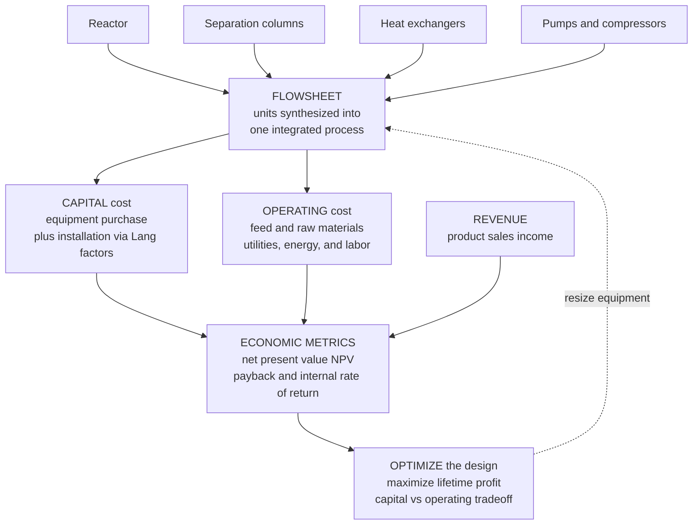

# 🏭 Process Design and Economics

> [!abstract] TL;DR
> **Process design** is where chemical engineering meets the balance sheet — the capstone activity that stitches individual **unit operations** (reactor, distillation columns, heat exchangers, pumps) into a single integrated **FLOWSHEET** that meets a production goal, then asks the ruthless business questions the science never asks: what will it cost to **BUILD** (capital), what will it cost to **RUN** (operating — feed, energy, labor), and will the product revenue beat both over the plant's life? **Process synthesis** assembles the flowsheet through a design hierarchy (Douglas' approach — batch vs continuous, input-output structure, recycle, separation system, heat integration). **Capital cost** is estimated from equipment sizing → purchased cost (the capacity-scaling **six-tenths rule** $C_2 = C_1 (S_2/S_1)^{0.6}$) → installed **fixed capital** (Lang factors), indexed to the present with **CEPCI**. **Operating cost** is dominated by raw materials, then **utilities** (steam, cooling water, electricity), labor, and maintenance. **Profitability analysis** discounts the resulting cash flows through the **time value of money** into **net present value (NPV)**, **internal rate of return (IRR)**, and **payback period**, which decide go/no-go. The signature tension is a seesaw: **capital versus operating cost** — a bigger heat exchanger costs more upfront but saves energy forever; more distillation reflux saves trays but burns steam — so good design hunts the **total-annualized-cost optimum**, and **heat integration / pinch analysis** wires a network of exchangers to slash utility cost. A process only gets built if it is **profitable**, so design economics is the ultimate arbiter of chemical engineering: it decides which technology, scale, and configuration win, and it is where balances → thermodynamics → transport → reaction → separation → control are synthesized into a plant that makes money, safely and sustainably.

## Intuition

**Analogy:** Knowing the science of every unit is useless if the plant loses money. Imagine you have mastered every organ of the body — you can design a flawless heart (the reactor), superb kidneys (the separators), a perfect circulatory system (the pumps and exchangers) — but medicine only pays you if the **whole patient survives and thrives on a budget**. Process design is that whole-body view. The engineer assembles the individual units into a living **flowsheet**, then plays accountant: what does it cost to *build the body* (capital), what does it cost to *keep it alive each day* (operating — its food, its warmth, its caretakers), and does the work it produces earn more than both? The clever design is not the one with the most elegant organ; it is the one that makes the most money over a lifetime.

The heart of the intuition is a **seesaw between capital and operating cost**. Spend more upfront and you often spend less forever: a bigger heat exchanger costs more steel today but recovers heat that would otherwise be bought as steam for decades; more distillation reflux lets you use a shorter column (fewer trays, less capital) but burns more steam in the reboiler every hour (more operating). Push the design variable one way and capital rises while operating falls; push it the other and the reverse. Somewhere in between sits the **sweet spot** — the total-annualized-cost minimum — the configuration that makes the most money over the plant's life, not the one that is cleverest.

---

## How It Works

### Core Mechanics

1. **Process synthesis assembles units into a flowsheet.** The reactor, separators, exchangers, and pumps from every prior topic are wired into one integrated process that turns feed into salable product. **Douglas' design hierarchy** decomposes this daunting synthesis into a decision onion: (1) batch or continuous; (2) input-output structure (feeds, products, purges); (3) recycle structure (unreacted feed looped back — see [[Recycle_Bypass_and_Purge]]); (4) separation system (vapor and liquid recovery); (5) heat integration. Each layer adds detail and reveals the **degrees of freedom** the engineer may optimize.

2. **Capital cost is built bottom-up from equipment.** Each unit is sized (area, volume, power) from the balances, thermodynamics, and transport correlations, then priced. Purchased equipment cost scales with capacity by the **six-tenths rule**, $C_2 = C_1 \left(\dfrac{S_2}{S_1}\right)^{0.6}$ — doubling size costs only about $2^{0.6}\approx 1.5\times$, the *economy of scale* that pushes plants ever larger. Purchased cost is inflated to **installed / fixed-capital** cost with **Lang factors** (typically $3$–$5\times$ purchased for a fluids-processing plant), covering piping, instrumentation, civil work, and engineering. **Working capital** (inventory, receivables) is added. Costs are moved to the present with the **CEPCI** (Chemical Engineering Plant Cost Index), and estimates carry an **accuracy class** (order-of-magnitude $\pm 30\text{–}50\%$ down to detailed $\pm 5\text{–}10\%$).

3. **Operating cost is dominated by feed, then energy.** Annual operating cost sums **raw materials** (usually the largest single item), **utilities** (steam, cooling water, electricity — the energy bill), **labor**, **maintenance**, and overhead. For a commodity chemical the margin is often a thin gap between feedstock and product price, so utility efficiency is decisive.

4. **Profitability folds cash flows through the time value of money.** Revenue minus operating cost, less tax (with depreciation shielding), gives an annual after-tax **cash flow**; the capital is a large negative outflow at year zero. Because a dollar tomorrow is worth less than a dollar today, cash flows are **discounted**: $\text{NPV} = \sum_t \dfrac{\text{CF}_t}{(1+r)^t}$. A positive **NPV** means the project beats its cost of capital; the **IRR** is the discount rate that zeroes the NPV; the **payback period** is how long until the cumulative cash flow turns positive. These metrics decide **go/no-go**.

5. **The core trade-off drives the optimization.** For most design variables, **capital and operating costs move in opposite directions**, so their sum — the **total annualized cost** — is U-shaped with an interior **economic optimum**. **Heat integration / pinch analysis** is the signature system-level version: composite hot- and cold-stream curves reveal the thermodynamic **minimum utility** and the **pinch** temperature, and a heat-exchanger network recovers 20–40 percent of plant heat, converting a capital investment in exchangers into a permanent operating saving. Safety, environmental, and sustainability constraints bound the whole search.

### Flow / Architecture



---

## Key Concepts

### Secondary Level

- **A plant is a team of machines that must earn its keep.** Designing one great machine is not enough; you must connect the reactor, the separators, and the exchangers into a whole **process** that turns cheap feed into a valuable product for less than it sells for.
- **Two kinds of cost.** There is the cost to **build** the plant (capital — you pay it once) and the cost to **run** it (operating — you pay it every day for feed, energy, and workers). A design must beat *both* with its sales.
- **The seesaw.** Bigger, fancier equipment usually costs more to build but less to run — like paying more for a well-insulated house that then costs less to heat. Good design finds the balance point where the total cost is lowest.
- **Money later is worth less than money now.** A plant spends a fortune upfront and earns it back slowly, so engineers ask how many years until it "pays back" and whether, after accounting for the wait, the whole venture actually makes a profit.

### Undergraduate Level

- **Process synthesis and the design hierarchy.** Following **Douglas**, a flowsheet is built in layers: continuous vs batch, input-output structure, recycle of unreacted feed, the separation system, and heat integration. Each layer exposes decision variables and screens out uneconomic options early, before detailed (expensive) design.
- **The six-tenths capacity rule.** Purchased equipment cost scales as $C_2 = C_1 (S_2/S_1)^{0.6}$. The exponent below one is the mathematical statement of **economy of scale** — why a plant twice as large costs far less than twice as much, and why the industry builds "world-scale" units.
- **Lang factors and fixed capital.** Installed cost is not just the equipment; piping, instruments, foundations, electrical, and engineering multiply purchased cost by a **Lang factor** of roughly $3$–$5$. Add **working capital** and startup to get total capital investment.
- **Cost indices and accuracy classes.** A price from five years ago is escalated to today with the **CEPCI**. Estimates are labelled by accuracy — a study estimate ($\pm 30\%$) for screening, a definitive estimate ($\pm 10\%$) for sanctioning — and reporting more digits than the class supports is false precision.
- **Operating cost structure.** Total product cost = raw materials + utilities + labor + maintenance + overhead + depreciation. For commodities, **raw materials dominate**; for energy-intensive separations, **utilities** are the next lever, which is why heat integration matters so much.
- **The time value of money.** $\text{NPV} = \sum_t \text{CF}_t/(1+r)^t$. Positive NPV at the firm's cost of capital $r$ means "invest." **IRR** is the break-even discount rate; **discounted payback** is when cumulative discounted cash flow crosses zero. Simple (undiscounted) payback is a quick screen but ignores the discount — never the sole criterion.
- **The total-annualized-cost optimum.** Annualize capital (multiply by a capital-recovery factor) and add annual operating cost; plot against a design variable (exchanger area, reflux ratio, per-pass conversion) and read the **minimum** — the economic optimum, distinct from the "maximum recovery" or "maximum conversion" a purely technical view would chase.

### Graduate Level

- **Simultaneous vs sequential optimization and superstructures.** Rigorous design formulates a **superstructure** embedding all candidate flowsheets and solves a mixed-integer nonlinear program (MINLP) for the topology *and* the operating point at once — the mathematics behind flowsheet optimizers. The constrained-optimization machinery of [[Lagrange_Multipliers]] and gradient methods like [[Gradient_Descent]] underlies these searches; the capital-vs-operating minimum is a KKT stationary point where marginal capital saving equals marginal operating cost.
- **Pinch analysis and heat-exchanger network synthesis.** Composite curves and the grand composite curve fix the **minimum hot and cold utility** and the **pinch**; the trade-off between minimum-approach $\Delta T_{min}$ (smaller = less utility but more area/capital) is itself a capital-vs-operating optimization. The pinch design method places exchangers to reach the utility target with the fewest units — a signature system-level result no unit-by-unit design finds.
- **Discounted cash-flow rigor.** Proper DCF handles depreciation schedules (straight-line vs MACRS), tax, working-capital recovery, salvage, and inflation; it distinguishes NPV (scale-aware) from IRR (rate, with multiple-root pathologies for non-conventional cash flows) and uses profitability index or annualized-worth to rank projects under capital rationing.
- **Sensitivity, risk, and real options.** Deterministic NPV hides uncertainty. **Sensitivity** (tornado charts over price, feed cost, capital), **Monte Carlo** on the cash-flow model, and **real-options** valuation of the flexibility to expand, switch feedstock, or abandon turn a single number into a risk-aware decision — the difference between a robust project and a fragile one.
- **Design under safety, environmental, and sustainability constraints.** Modern design internalizes what was once external: inherent safety (minimize inventory of hazardous material), emissions and carbon price, water and waste, and life-cycle assessment. A carbon price literally shifts the capital-vs-operating optimum toward heat integration and electrification, showing how economics and sustainability now co-determine the flowsheet.
- **The integrative capstone.** Process design is where mass and energy balances close the flowsheet, thermodynamics fixes the separations and equilibria, transport sizes the exchangers and pumps, reaction engineering sets the reactor and recycle, and control and dynamics decide operability — synthesized into one plant. The economics is the objective function that ranks all of it.

---

## Python Demo

```python
# Process design economics in one figure:
#
#   (a) CAPITAL vs OPERATING TRADEOFF (the economic optimum).
#       Design variable = heat-exchanger AREA for a heat-recovery duty.
#       - Bigger area recovers more process heat (effectiveness-NTU),
#         so it BUYS LESS steam -> operating/energy cost FALLS with area.
#       - Bigger area costs more steel: purchased cost by the six-tenths
#         rule, installed via a Lang factor, annualized -> capital cost
#         RISES with area.
#       Their SUM (total annualized cost) is U-shaped; the minimum is the
#       ECONOMIC OPTIMUM -- not the maximum-recovery design.
#
#   (b) PROFITABILITY: discounted cash flow / NET PRESENT VALUE.
#       Year-0 capital outlay, then annual after-tax profits over the
#       project life. Cumulative DISCOUNTED cash flow shows the discounted
#       PAYBACK and ends at the NPV. IRR is the rate that zeros the NPV.
#
#   (c) GO / NO-GO: NPV sensitivity to PRODUCT PRICE -> the break-even
#       price below which economics kills the project.
#
# Requires: numpy, matplotlib   (no scipy)
import numpy as np
import matplotlib.pyplot as plt

# =====================================================================
# (a) CAPITAL vs OPERATING TRADEOFF  ->  economic optimum area
# =====================================================================
U        = 0.5          # kW/m2K  overall heat-transfer coefficient
Cmin     = 30.0         # kW/K    minimum capacity rate of the streams
dT_in    = 150.0        # K       inlet temperature driving force
Qmax     = Cmin * dT_in # kW      maximum recoverable heat (= 4500 kW)
Qdemand  = Qmax         # kW      process heating demand
steam    = 0.020        # $/kWh   cost of make-up steam (utility)
hours    = 8000.0       # h/yr    annual operating hours
Cref     = 30000.0      # $       purchased cost of a reference exchanger
Aref     = 100.0        # m2      reference area
Lang     = 3.5          # installed = Lang * purchased
CRF      = 0.10 * 1.10**10 / (1.10**10 - 1.0)   # capital-recovery factor, i=10%, n=10 yr

A        = np.linspace(20.0, 800.0, 500)        # candidate exchanger areas
NTU      = U * A / Cmin
eps      = 1.0 - np.exp(-NTU)                    # effectiveness (Cr -> 0)
Qrec     = eps * Qmax                            # heat recovered (kW)
utility  = Qdemand - Qrec                        # steam still bought (kW)

op_annual  = steam * utility * hours             # $/yr, FALLS with area
purchased  = Cref * (A / Aref)**0.6              # six-tenths capacity rule
cap_annual = CRF * Lang * purchased              # $/yr, RISES with area
total      = cap_annual + op_annual              # total annualized cost

i_opt = int(np.argmin(total))
print("(a) CAPITAL-vs-OPERATING optimum")
print(f"    optimum area        A* = {A[i_opt]:6.0f} m2")
print(f"    heat recovered         = {Qrec[i_opt]:6.0f} kW of {Qmax:.0f} kW  "
      f"(effectiveness {eps[i_opt]:.2f})")
print(f"    annualized capital     = ${cap_annual[i_opt]/1e3:6.1f} k/yr")
print(f"    annual operating       = ${op_annual[i_opt]/1e3:6.1f} k/yr")
print(f"    total annualized cost  = ${total[i_opt]/1e3:6.1f} k/yr  <- minimum\n")

# =====================================================================
# (b) & (c) PROFITABILITY: discounted cash flow, NPV, IRR, price sweep
# =====================================================================
FCI    = 50.0           # $M   fixed capital investment
WC     = 0.15 * FCI     # $M   working capital (recovered at end of life)
life   = 10             # yr   project life
prod   = 50_000.0       # tonne/yr production rate
opcost = 45.0           # $M/yr operating cost (feed + utilities + labor)
tax    = 0.25           # corporate tax rate
depr   = FCI / life     # $M/yr straight-line depreciation
r_base = 0.10           # discount rate (cost of capital)
price0 = 1200.0         # $/tonne base product price

def annual_cash_flow(price):
    """After-tax operating cash flow ($M/yr) at a given product price."""
    revenue = price * prod / 1e6            # $M/yr
    ebitda  = revenue - opcost             # $M/yr before tax and depreciation
    taxable = ebitda - depr
    return taxable * (1.0 - tax) + depr    # add depreciation back (non-cash)

def cash_flows(price):
    """Full project cash-flow vector ($M), year 0 .. life."""
    cf = np.full(life + 1, annual_cash_flow(price))
    cf[0] = -(FCI + WC)                    # capital outlay at year 0
    cf[-1] += WC                           # recover working capital at end
    return cf

def npv(rate, cf):
    t = np.arange(len(cf))
    return np.sum(cf / (1.0 + rate)**t)

def irr(cf, lo=0.0, hi=0.60, n=2000):
    """IRR by scanning for the NPV sign change (no scipy)."""
    rates = np.linspace(lo, hi, n)
    vals  = np.array([npv(x, cf) for x in rates])
    s = np.where(np.diff(np.sign(vals)))[0]
    if len(s) == 0:
        return np.nan
    k = s[0]                               # linear interpolation to the zero
    return rates[k] - vals[k] * (rates[k+1] - rates[k]) / (vals[k+1] - vals[k])

cf_base = cash_flows(price0)
npv_base = npv(r_base, cf_base)
irr_base = irr(cf_base)
cum_disc = np.cumsum(cf_base / (1.0 + r_base)**np.arange(len(cf_base)))
payback  = np.argmax(cum_disc > 0.0)       # first year cumulative turns positive

print("(b) PROFITABILITY at base price")
print(f"    annual after-tax cash flow = ${annual_cash_flow(price0):5.1f} M/yr")
print(f"    NPV at {r_base:.0%}            = ${npv_base:6.1f} M")
print(f"    IRR                        = {irr_base:6.1%}")
print(f"    discounted payback         = ~{payback} years\n")

prices    = np.linspace(900.0, 1500.0, 400)
npv_price = np.array([npv(r_base, cash_flows(p)) for p in prices])
breakeven = prices[np.argmin(np.abs(npv_price))]
print("(c) GO / NO-GO")
print(f"    break-even price (NPV=0)   = ${breakeven:6.0f}/tonne "
      f"(base ${price0:.0f}) -> below this the project is rejected")

# =====================================================================
# PLOTS
# =====================================================================
fig, (axA, axB, axC) = plt.subplots(1, 3, figsize=(17, 5.2))
fig.suptitle("Process design economics: the capital-vs-operating optimum decides the design; "
             "the NPV decides go / no-go",
             fontsize=13, fontweight="bold")

# (a) capital vs operating vs total annualized cost
axA.plot(A, cap_annual / 1e3, color="#d62728", lw=2.4, label="capital (annualized)")
axA.plot(A, op_annual  / 1e3, color="#1f77b4", lw=2.4, label="operating (energy)")
axA.plot(A, total      / 1e3, color="#2a9d8f", lw=2.8, label="total annualized cost")
axA.axvline(A[i_opt], color="#333333", ls="--", lw=1.0)
axA.scatter([A[i_opt]], [total[i_opt] / 1e3], color="#2a9d8f", zorder=5)
axA.annotate("economic\noptimum", xy=(A[i_opt], total[i_opt] / 1e3),
             xytext=(A[i_opt] + 120, total[i_opt] / 1e3 + 25),
             fontsize=9, fontweight="bold",
             arrowprops=dict(arrowstyle="->"))
axA.set_xlabel("heat-exchanger area  A  [m2]")
axA.set_ylabel("annualized cost  [$ thousand / yr]")
axA.set_title("(a) Capital rises, operating falls\n-> total-cost minimum")
axA.set_ylim(0, 200)
axA.legend(loc="upper center", fontsize=9)
axA.grid(alpha=0.3)

# (b) cumulative discounted cash flow -> payback and NPV
years = np.arange(life + 1)
colors = ["#d62728" if v < 0 else "#2a9d8f" for v in cum_disc]
axB.bar(years, cum_disc, color=colors, alpha=0.85)
axB.axhline(0.0, color="black", lw=1.0)
axB.axvline(payback, color="#8338ec", ls="--", lw=1.2)
axB.annotate(f"discounted\npayback ~{payback} yr", xy=(payback, 0),
             xytext=(payback + 0.3, -35), fontsize=9, color="#5a189a")
axB.annotate(f"NPV = ${npv_base:.0f} M", xy=(life, cum_disc[-1]),
             xytext=(life - 4.5, cum_disc[-1] + 6), fontsize=10,
             fontweight="bold", color="#1b5e20",
             arrowprops=dict(arrowstyle="->", color="#1b5e20"))
axB.set_xlabel("project year")
axB.set_ylabel("cumulative discounted cash flow  [$M]")
axB.set_title(f"(b) Discounted cash flow (IRR = {irr_base:.0%})\n"
              "red = not yet paid back, green = in profit")
axB.grid(alpha=0.3, axis="y")

# (c) NPV vs product price -> break-even, go/no-go
axC.plot(prices, npv_price, color="#e76f51", lw=2.6)
axC.axhline(0.0, color="black", lw=1.0)
axC.axvline(breakeven, color="#8338ec", ls="--", lw=1.2)
axC.axvline(price0, color="#333333", ls=":", lw=1.0)
axC.fill_between(prices, npv_price, 0, where=(npv_price < 0),
                 color="#d62728", alpha=0.15)
axC.fill_between(prices, npv_price, 0, where=(npv_price >= 0),
                 color="#2a9d8f", alpha=0.15)
axC.annotate(f"break-even\n${breakeven:.0f}/tonne", xy=(breakeven, 0),
             xytext=(breakeven - 60, 40), fontsize=9, color="#5a189a")
axC.annotate("base price", xy=(price0, 0), xytext=(price0 + 10, -55),
             fontsize=9, color="#333333")
axC.set_xlabel("product price  [$ / tonne]")
axC.set_ylabel("NPV  [$M]")
axC.set_title("(c) NPV vs price: economics\ndecides go / no-go")
axC.grid(alpha=0.3)

plt.tight_layout(rect=[0, 0, 1, 0.92])
plt.show()
```

Running this prints the numbers and draws three panels. **Panel (a)** is the whole philosophy of design in one curve: the red **capital** cost climbs with exchanger area (six-tenths rule, annualized), the blue **operating** cost falls as the larger area recovers more heat and buys less steam, and their green **sum** dips to a clear **economic optimum** near a few hundred square metres — the design that makes the most money, which is *neither* the cheapest to build *nor* the one that recovers the most heat. **Panel (b)** turns the chosen plant into money over time: a large negative bar at year zero (the capital outlay), then annual after-tax profits whose **cumulative discounted** value climbs out of the red, crosses zero at the **discounted payback**, and lands at the final bar equal to the project **NPV** (with the **IRR** the rate that would flatten it to zero). **Panel (c)** shows why economics has the final word: sweep the product price and the NPV crosses from green (invest) to red (reject) at a **break-even price** — below it, no amount of clever engineering saves the project. Capital-vs-operating decides the *design*; NPV decides whether it gets *built*.

---

## Real-World Applications

> **Example — a world-scale ethylene (steam-cracker) or methanol plant, designed in Aspen Plus.** A grassroots petrochemical plant is process design and economics in full. Engineers build the **flowsheet** in a simulator (Aspen Plus / HYSYS), size every reactor, column, and exchanger from the converged balances, then push the geometry into **Aspen Economic Analyzer** to get purchased and installed **capital** (six-tenths scaling and installation factors) and the **operating** cost (naphtha or natural-gas feed usually dominates, then the enormous steam and refrigeration duties of the cold separation train). The decisive design moves are exactly the trade-offs in this note: the cracker's **heat integration** — recovering the furnace's white-hot effluent to raise high-pressure steam and preheat feed via **pinch analysis** — can swing the whole plant's profitability, and the go/no-go rests on an **NPV/IRR** model against volatile ethylene and feedstock prices. The reason such plants are built "world-scale" is the six-tenths rule itself: doubling capacity costs far less than double, so economy of scale is designed in from the first decision.

- **Refinery crude units and heat-exchanger networks.** A crude-preheat train is a textbook **pinch** retrofit: adding exchangers (capital) recovers heat that would otherwise be fired in a furnace (operating), and a multi-million-dollar-per-year fuel saving justifies the steel — the single largest energy lever in a refinery.
- **Green hydrogen electrolyzers (levelized cost of hydrogen).** Electrolyzer techno-economics is a pure capital-vs-operating problem: electrolyzer stacks are capital, electricity is operating, and the **LCOH** (a discounted-cash-flow unit cost) decides whether green H2 beats grey — the economics, not the chemistry, gate deployment.
- **Carbon capture (CCUS).** The industry reports capture as a **cost per tonne of CO2** — a techno-economic figure combining absorber/stripper capital with the steam penalty (operating). Whether a capture plant is built is decided by that number against the carbon price, a direct economics verdict.
- **Biorefineries and sustainable aviation fuel (NREL TEA).** NREL's public **techno-economic analyses** compute a minimum selling price for biofuels by exactly the machinery here — flowsheet, capital, operating, and discounted cash flow — to tell policymakers and investors whether a pathway can compete.
- **Pharmaceutical batch vs continuous.** The choice between flexible batch reactors and continuous manufacturing is settled on economics: capital, changeover cost, and inventory (working capital) versus yield and labor — the same NPV comparison, at high-value, low-volume scale.

---

## Common Pitfalls

- **Chasing the technical maximum instead of the economic optimum.** Maximum heat recovery, maximum conversion, or maximum purity is almost never the most profitable point. The **total-annualized-cost minimum** — where marginal capital saving equals marginal operating cost — is the target, and it sits *before* the technical limit.
- **Optimizing units in isolation.** Sizing each unit for its own local best gives a globally suboptimal plant. A *smaller* reactor at low per-pass conversion with cheap recycle, or a *smaller* exchanger accepting more utility, can be cheaper overall. The objective function is the whole flowsheet, not the sum of local optima.
- **Ignoring the time value of money.** Comparing an undiscounted payback to a competitor's NPV, or summing raw cash flows, flatters projects with distant returns. Discount every cash flow; simple payback is only a screen.
- **False precision in cost estimates.** Reporting an NPV to the dollar off a $\pm 30\%$ study estimate is meaningless. Honor the **accuracy class** and carry a **contingency**; over-confident capital estimates are a leading cause of over-budget plants.
- **Forgetting working capital, startup, and contingency.** Fixed capital is not total capital. Omitting working capital, startup costs, and contingency understates the year-zero outflow and inflates NPV.
- **CAPEX-only or OPEX-only tunnel vision.** Minimizing build cost yields a plant that is ruinous to run (thin exchangers, high utility bills); minimizing operating cost yields a gold-plated plant that never earns back its capital. The seesaw must be balanced, not pinned to one end.
- **Violating the pinch.** Transferring heat across the pinch, or using utility where recovery was possible, silently wastes energy for the life of the plant. The pinch is a hard thermodynamic target, not a suggestion.
- **Deterministic, single-point economics.** A lone NPV hides risk. Without **sensitivity** and **Monte Carlo** on feed and product prices, a project that looks profitable at one price can be deeply negative across the realistic price range.

---

## Related Concepts

**Chemical Engineering foundations — the topics that synthesis integrates**
- [[Material_and_Mass_Balances]] — the balances that must close on the whole flowsheet before any unit can be sized or costed
- [[Energy_Balances_in_Processes]] — the heat and power duties that become the plant's utility (operating) cost and the target of heat integration
- [[Recycle_Bypass_and_Purge]] — the recycle structure in Douglas' hierarchy; per-pass conversion versus recycle cost is a core design trade-off
- [[Chemical_Reaction_Engineering_Overview]] — the reactor at the flowsheet's core, optimized *jointly* with separation and recycle rather than for maximum conversion alone
- [[Chemical_Process_Thermodynamics]] — supplies the equilibria and energy quantities that fix separation feasibility and utility demand

**Finance vault — the money side made rigorous**
- [[Time_Value_of_Money]] — the discounting principle ($\text{PV} = \text{FV}/(1+r)^t$) that turns a plant's cash flows into a single present value
- [[Capital_Budgeting]] — the NPV / IRR / payback decision framework that process economics applies to a plant instead of a portfolio project
- [[DCF_Analysis]] — the discounted-cash-flow method whose valuation machinery is identical to a chemical plant's profitability analysis

**Optimization vault — the math of the optimum**
- [[Lagrange_Multipliers]] — the constrained-optimization backbone for finding the capital-vs-operating and pinch optima subject to design constraints
- [[Gradient_Descent]] — the iterative search underlying flowsheet and heat-exchanger-network optimizers

**Engineering Leadership vault — economics as a management discipline**
- [[Financial_Management_for_EMs]] — the budgeting, cost, and ROI thinking that mirrors, at the org level, the capital-vs-operating decisions engineers make at the plant level
- [[Technical_Roadmapping]] — sequencing investment against payoff, the leadership analogue of staging capital for the best discounted return

*(Chemical-engineering siblings referenced in prose but not wikilinked here: **Chemical_Engineering_Overview** is the discipline-level parent this note serves as the capstone of; **Separation_Processes_Overview** supplies the columns whose reflux-vs-trays trade-off is the archetypal capital-vs-operating seesaw; **Heat_Transfer_in_Process_Equipment** provides the exchangers and the pinch-analysis method that heat integration deploys; and **Process_Dynamics_and_Control** and **Process_Simulation_and_Optimization** turn this static design into an operable, computationally optimized plant.)*

---

## Review Questions

**Secondary**
1. A plant has two kinds of cost: the money to **build** it and the money to **run** it. Using the insulated-house analogy, explain why buying a bigger, more expensive heat exchanger can actually make the plant *cheaper overall*, and why a design that is the cheapest to build is often not the most profitable. What does "the money you earn years from now is worth less today" mean for deciding whether to build the plant at all?

**Undergraduate**
2. A heat-recovery exchanger has design variable area $A$. Its purchased cost scales by the six-tenths rule $C = C_{ref}(A/A_{ref})^{0.6}$ (installed via a Lang factor and annualized by a capital-recovery factor), while the steam it saves grows with effectiveness $\varepsilon = 1 - e^{-UA/C_{min}}$ so the annual utility cost falls with $A$. (a) Sketch capital, operating, and total annualized cost versus $A$ and locate the economic optimum. (b) Explain why the optimum is *not* at maximum heat recovery. (c) Separately, for a project with a year-0 capital outlay and constant annual after-tax cash flow, write the NPV and explain how IRR and discounted payback are read from the cumulative discounted cash flow.

**Graduate**
3. You are screening a grassroots plant. (a) Describe how Douglas' design hierarchy lets you build and screen the flowsheet before committing to detailed (expensive) design, and where the capital-vs-operating trade-off enters at the separation and heat-integration layers. (b) Explain how pinch analysis sets the minimum utility target and how the choice of minimum-approach $\Delta T_{min}$ is itself a capital-vs-operating optimization. (c) The base-case NPV is positive but the product price is volatile; discuss how sensitivity analysis, Monte Carlo on the cash-flow model, and a real-options view of the flexibility to expand or abandon change the invest/decline decision, and why a single deterministic NPV is an inadequate basis for sanctioning a plant.

---

## Sources

- Turton, R., Shaeiwitz, J. A., Bhattacharyya, D., & Whiting, W. B. — *Analysis, Synthesis, and Design of Chemical Processes*, 5th ed. (Pearson/Prentice Hall). [Publisher page](https://www.pearson.com/en-us/subject-catalog/p/analysis-synthesis-and-design-of-chemical-processes/P200000003469)
- Seider, W. D., Lewin, D. R., Seader, J. D., Widagdo, S., Gani, R., & Ng, K. M. — *Product and Process Design Principles: Synthesis, Analysis and Evaluation*, 4th ed. (Wiley). [Publisher page](https://www.wiley.com/en-us/Product+and+Process+Design+Principles%3A+Synthesis%2C+Analysis+and+Evaluation%2C+4th+Edition-p-9781119355212)
- Peters, M. S., Timmerhaus, K. D., & West, R. E. — *Plant Design and Economics for Chemical Engineers*, 5th ed. (McGraw-Hill). [Publisher page](https://www.mheducation.com/highered/product/plant-design-economics-chemical-engineers-peters-timmerhaus/M9780072392661.html)
- Towler, G., & Sinnott, R. — *Chemical Engineering Design: Principles, Practice and Economics of Plant and Process Design*, 3rd ed. (Butterworth-Heinemann/Elsevier). [Publisher page](https://www.elsevier.com/books/chemical-engineering-design/towler/978-0-12-821179-3)
- Douglas, J. M. — *Conceptual Design of Chemical Processes* (McGraw-Hill) — the design-hierarchy approach to process synthesis. [WorldCat](https://search.worldcat.org/title/17677894)

---

#chemical-engineering #process-design #economics #capital-cost #NPV
