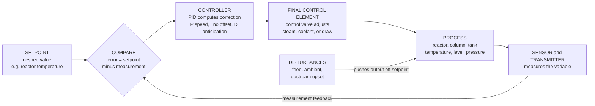

# 🎛️ Process Dynamics and Control

> [!abstract] TL;DR
> **Process dynamics and control** is the engineering of *keeping a chemical process at its desired operating point despite constant disturbances* — the always-on autopilot of every refinery, chemical plant, and factory. A plant never holds still: feed compositions drift, ambient temperature swings, upstream units upset the downstream ones, a pump hiccups — and left uncontrolled, a reactor's temperature or a tank's level would wander off toward runaway, off-spec product, or overflow. The discipline has two halves. **Dynamics** asks *how* a process output responds in *time* to a change in its input, and captures that behavior — derived from the same mass and energy balances used elsewhere in chemical engineering — as a **transfer function**: first-order (a **gain** and a **time constant**), first-order-plus-**deadtime** (a pure transport lag, the perennial bane of process control), second-order, or **integrating** (like a tank level that never settles on its own). **Control** then closes the loop: a **sensor** measures the variable, a **controller** compares it to the **setpoint** and computes a correction, and a **final control element** — almost always a control valve — acts to erase the deviation, thousands of times a second across thousands of loops. The workhorse is the **PID controller** (**P**roportional for speed, **I**ntegral to eliminate steady-state offset, **D**erivative for anticipation), and the art of choosing its gains — **tuning** (Ziegler-Nichols, IMC, trial-and-error) — is a direct trade of responsiveness against **stability**: too much gain, or too much deadtime, and the loop breaks into growing oscillation. Beyond single loops sit **feedforward** (correct a disturbance *before* it hits), **cascade** and **ratio** control, and the industrial gold standard for multivariable, constrained systems — **Model Predictive Control (MPC)** — all arranged in a **hierarchy** (regulatory → advanced → optimization) atop a **DCS** with safety **interlocks**. Process control is what lets plants run *safely* (no runaways or overpressure), consistently *on-spec* (product quality), and *economically* (near constraints and optima) — the nervous system of process systems engineering.

## Intuition

**Analogy:** A chemical plant is a *living thing that never holds still.* Feed compositions drift, the ambient temperature swings between night and day, an upstream unit burps a slug of hot liquid downstream, a pump momentarily loses suction. Left completely alone, the temperature inside a reactor or the level in a surge tank would slowly wander off — toward a runaway, an overflow, or a batch of ruined product. **Process control is the plant's autopilot.** And the whole idea fits in a device on your wall: the **thermostat**. It *senses* the room temperature, *compares* it to the target you dialed in, and *nudges* the heater on or off to close the gap. That is the entire concept — sense, compare, correct — repeated forever.

Now scale that humble thermostat up. Replace "room temperature" with the temperature of an exothermic reactor, the composition leaving a distillation column, the pressure in a vessel, or the level in a tank. Replace the heater with a **control valve** on a steam line, a coolant stream, or a product draw. Wire up *thousands* of these sense-compare-correct loops, layer smarter supervisors on top that coordinate them and push the plant toward its economic optimum, and you have the **nervous system of the modern process plant** — the reason a refinery can run for years, steady and safe and on-spec, while the world around it refuses to sit still.

---

## How It Works

### Core Mechanics

1. **Why control at all — disturbances plus limits.** Every process faces relentless **disturbances**: changes in feed flow and composition, ambient conditions, cooling-water temperature, and upsets propagating from upstream units. Every process also has hard **safety and quality limits**: a reactor must not run away, a vessel must not overpressure, a column's product must stay on-spec, a tank must not overflow or run dry. Because a disturbance will *always* push a variable toward a limit, nearly every important variable — **temperature, pressure, level, flow, composition** — is placed under **automatic control**. Manual operation cannot watch thousands of variables second by second; control systems can.

2. **Process dynamics — the response in *time*.** Control needs a model of *how the output moves when you move an input*. That model comes straight from the **mass and energy balances** used throughout chemical engineering, linearized around an operating point and written as a **transfer function** $G(s) = Y(s)/U(s)$ (via the Laplace transform). The canonical forms are:
   - **First-order:** $G(s) = \dfrac{K_p}{\tau_p s + 1}$ — a **gain** $K_p$ (how far the output ultimately moves per unit input) and a **time constant** $\tau_p$ (how *fast* it gets there — a stirred heated tank is the classic example).
   - **First-order-plus-deadtime (FOPDT):** $G(s) = \dfrac{K_p\,e^{-\theta s}}{\tau_p s + 1}$ — adds a pure **deadtime** (transport lag) $\theta$: the time before the output even *begins* to respond, caused by transport down a pipe or along a conveyor. Deadtime is the single most control-limiting feature of chemical processes, and FOPDT is the workhorse model fit to real step tests.
   - **Second-order** ($\tau^2 s^2 + 2\zeta\tau s + 1$ in the denominator) captures oscillatory or overdamped responses; **integrating** processes ($G(s) = K_p/s$, e.g. **tank level**) never settle on their own — a small imbalance drives the output away without bound.

3. **The feedback loop — sense, compare, correct.** Closed-loop control wires four elements in a ring: the **sensor/transmitter** measures the controlled variable; the **controller** forms the **error** $e = \text{setpoint} - \text{measurement}$ and computes a corrective signal; the **final control element** (a **control valve**, or a heater/pump/motor) acts on the process; the process responds, the sensor re-measures, and the loop repeats. Feedback is *reactive* — it acts only after the disturbance has already moved the output — but it is model-free and robust, which is why it dominates.

4. **The PID controller — the industrial workhorse.** Most loops use a **Proportional-Integral-Derivative** controller:
   $$u(t) = K_c\left[\,e(t) + \frac{1}{\tau_I}\int_0^t e(t')\,dt' + \tau_D\,\frac{de(t)}{dt}\,\right].$$
   - **Proportional ($K_c$):** correction proportional to the current error — provides **speed**, but a P-only controller leaves a steady-state **offset**.
   - **Integral ($\tau_I$):** accumulates past error until it is driven to *zero* — **eliminates offset**, the reason PI is the most common combination. Its hazard is **windup** when the valve saturates.
   - **Derivative ($\tau_D$):** responds to the *rate* of change — **anticipates** where the error is heading and damps overshoot, but amplifies measurement noise, so it is used sparingly (often omitted; PI dominates).

5. **Tuning — trading speed against stability.** Choosing $K_c$, $\tau_I$, $\tau_D$ is **tuning**, and it is fundamentally a trade-off: more aggressive tuning rejects disturbances faster but risks **overshoot, oscillation, and instability**. Standard methods include **Ziegler-Nichols** (from the ultimate gain/period or an open-loop reaction curve — fast but often oscillatory), **IMC / lambda tuning** (model-based, tunable robustness via a single closed-loop time constant $\lambda$), and structured **trial-and-error**. The enemy is **deadtime**: the more $\theta$ relative to $\tau_p$, the lower the gain a loop can tolerate before **too much gain drives it unstable** — a self-reinforcing oscillation that grows without bound.

6. **Beyond single loops — advanced and plant-wide control.** When feedback alone is too slow, engineers add structure:
   - **Feedforward** measures a disturbance and corrects for it *before* it reaches the output (paired with feedback for the errors the model misses).
   - **Cascade** nests a fast inner loop (e.g. jacket temperature) inside a slow outer loop (reactor temperature) to reject disturbances early.
   - **Ratio** control holds two flows in proportion (e.g. fuel-to-air).
   - **Model Predictive Control (MPC)** — the industrial standard for **multivariable, constrained** problems — uses a dynamic model to predict the future and solves an online optimization each step, honoring valve and safety **constraints** while pushing the plant toward its optimum.
   These sit in a **control hierarchy**: **regulatory** PID at the bottom, **advanced/MPC** above, **real-time optimization** on top — all running on a **Distributed Control System (DCS)** wired to sensors and control valves, with independent **safety instrumented systems (interlocks)** as the last line of defense.

### Flow / Architecture



---

## Key Concepts

### Secondary Level

- **A plant never sits still, so it needs an autopilot.** Feeds drift, the weather changes, pumps hiccup — and a reactor's temperature or a tank's level would wander off if nobody watched. Process control is the automatic system that keeps everything at its target.
- **The thermostat is the whole idea.** *Sense* the temperature, *compare* it to the target you set, *nudge* the heater. Every one of a plant's thousands of control loops is that same three-step idea, scaled up to reactors, columns, and tanks.
- **Setpoint, sensor, valve.** The **setpoint** is the value you want. A **sensor** measures what you actually have. A **control valve** is the muscle that changes something (adds coolant, opens a drain) to close the gap.
- **Why it matters: safe, on-spec, cheap.** Control keeps plants from blowing up or overflowing (**safe**), keeps the product the right quality (**on-spec**), and keeps energy and material waste low (**cheap**).

### Undergraduate Level

- **Process dynamics = the transfer function.** Linearize a mass or energy balance around an operating point and Laplace-transform it to get $G(s) = Y(s)/U(s)$. A stirred heated tank is **first-order**, $K_p/(\tau_p s + 1)$: a **gain** (final move per unit input) and a **time constant** (63% of the way there in one $\tau_p$).
- **Deadtime is the villain.** Add transport lag and you get **first-order-plus-deadtime**, $K_p e^{-\theta s}/(\tau_p s + 1)$. The output does *nothing* for $\theta$ seconds, then responds. Deadtime steals phase margin and is the main reason loops must be detuned; the ratio $\theta/\tau_p$ largely sets how hard a loop can be pushed.
- **Integrating processes never self-settle.** A **level** obeys $dV/dt = F_{in} - F_{out}$, so $G(s) = K_p/s$: any inflow-outflow imbalance ramps the level away forever. Levels *must* be controlled — there is no natural steady state to fall back on.
- **PID, term by term.** **P** gives speed but leaves **offset**; **I** integrates error to zero to kill that offset (PI is the default); **D** acts on the error's slope to anticipate and damp overshoot, but amplifies noise. The reset time $\tau_I$ and derivative time $\tau_D$ set the strength of I and D.
- **Tuning is a speed-vs-stability trade.** Increase $K_c$ and the loop reacts faster but overshoots more; push too far and it **oscillates and goes unstable**. **Ziegler-Nichols** (ultimate gain $K_u$ and period $P_u$, or an open-loop reaction curve) gives quick starting gains; **IMC/lambda tuning** trades a single robustness knob $\lambda$ for smoothness. The **closed-loop poles** must stay in the left half-plane for stability.
- **Servo vs regulatory.** *Servo* (setpoint tracking) and *regulatory* (disturbance rejection) are different objectives; most process loops are **regulatory** — hold the setpoint against disturbances — which is why disturbance-rejection performance dominates tuning choices.

### Graduate Level

- **Stability and frequency-domain design.** Closed-loop stability follows from the **characteristic equation** $1 + G_c(s)G_p(s) = 0$; the **Bode/Nyquist** criteria quantify **gain and phase margins**. Deadtime contributes phase lag $-\omega\theta$ that grows without bound with frequency, capping the achievable bandwidth — the fundamental limit a **Smith predictor** (model-based deadtime compensation) is designed to relax.
- **Feedforward-feedback and disturbance models.** Ideal feedforward is $G_{ff} = -G_d/G_p$ (the negative ratio of disturbance to process transfer functions); it is physically unrealizable when it demands prediction or inversion of deadtime, so a *realizable* lead-lag approximation is paired with feedback to clean up model error. Cascade control improves rejection by an amount set by the inner-loop bandwidth relative to the disturbance dynamics.
- **Multivariable interaction and pairing.** In multi-loop plants, manipulated and controlled variables **interact**; the **Relative Gain Array (RGA)** guides input-output **pairing** to minimize interaction, and strong coupling motivates decouplers or a fully multivariable controller.
- **Model Predictive Control (MPC).** MPC solves, at each sample, a finite-horizon **constrained optimization** — minimizing predicted tracking error and move effort subject to input/output constraints — then applies only the first move (receding horizon). It natively handles **MIMO** coupling, **hard constraints**, and deadtime, and is the industrial standard for refinery and large-unit advanced control (see [[Model_Predictive_Control]] for the robotics/optimal-control formulation).
- **The control hierarchy and instrumentation.** **Regulatory** PID (seconds), **advanced/MPC** (minutes), and **real-time optimization** (hours) form a temporal hierarchy executing on a **DCS**. Below the regulatory layer, **safety instrumented systems (SIS)** with independent sensors and logic enforce **interlocks** and shutdowns — the last-resort layer analyzed by process-hazard methods, distinct from the regulatory control that keeps the plant in normal operation.
- **Nonlinearity and multiplicity.** Exothermic reactors are **nonlinear** and can exhibit **multiple steady states** and limit cycles; linear PID tuned at one operating point can destabilize at another, motivating gain scheduling, nonlinear MPC, and the stability analysis shared with reactor design (see [[Nonlinearity_and_Feedback]]).

---

## Python Demo

```python
# Process Dynamics and Control: a first-order-plus-deadtime (FOPDT) process
# under PID control, and the speed-vs-stability trade-off of tuning.
#
#   (a) PID SETPOINT + DISTURBANCE response for a heated tank modeled as FOPDT:
#         tau_p dy/dt = -y + Kp*u(t-theta) + Kp*d(t-theta)
#       Compare a WELL-TUNED (IMC/lambda) controller against an AGGRESSIVE one:
#       the aggressive tuning is faster but overshoots and rings.
#
#   (b) STABILITY: sweep the controller gain Kc upward. Because of DEADTIME,
#       past an "ultimate gain" the loop breaks into GROWING oscillation --
#       instability. This is why every loop must be detuned for deadtime.
#
# Requires: numpy, matplotlib   (no scipy)
import numpy as np
import matplotlib.pyplot as plt

# ---- FOPDT process model (a stirred, heated tank with transport lag) --------
Kp, tau_p, theta = 2.0, 5.0, 1.5      # gain, time constant (min), deadtime (min)
dt      = 0.02
t       = np.arange(0.0, 60.0, dt)
n       = len(t)
nd      = int(round(theta / dt))      # number of deadtime steps


def simulate(Kc, tauI, tauD, sp_val=1.0, dist_time=30.0, dist_mag=0.5):
    """Discrete PID (derivative-on-measurement) driving the FOPDT process.
    Returns setpoint, output y, and manipulated variable u over time."""
    y = np.zeros(n)
    u = np.zeros(n)
    integ = 0.0
    sp = np.where(t >= 0.0, sp_val, 0.0)        # step setpoint at t = 0
    d  = np.where(t >= dist_time, dist_mag, 0.0)  # load disturbance later
    for k in range(1, n):
        e = sp[k] - y[k - 1]
        integ += e * dt
        deriv = -(y[k - 1] - y[k - 2]) / dt if k >= 2 else 0.0  # on measurement
        u[k] = Kc * (e + integ / tauI + tauD * deriv)
        u_del = u[k - 1 - nd] if k - 1 - nd >= 0 else 0.0       # deadtime on u
        d_del = d[k - 1 - nd] if k - 1 - nd >= 0 else 0.0       # deadtime on d
        y[k] = y[k - 1] + dt / tau_p * (-y[k - 1] + Kp * u_del + Kp * d_del)
    return sp, y, u


# ---- (a) IMC / lambda tuning vs an aggressive tuning -----------------------
lam       = 0.5 * tau_p                                   # IMC robustness knob
Kc_imc    = (1.0 / Kp) * (tau_p + theta / 2) / (lam + theta / 2)
tauI_imc  = tau_p + theta / 2
tauD_imc  = tau_p * theta / (2 * tau_p + theta)
Kc_aggr   = 3.0 * Kc_imc                                  # push gain 3x

sp, y_good, _ = simulate(Kc_imc, tauI_imc, tauD_imc)
_,  y_aggr, _ = simulate(Kc_aggr, tauI_imc, tauD_imc)

print(f"IMC tuning  : Kc={Kc_imc:.2f}, tauI={tauI_imc:.2f}, tauD={tauD_imc:.2f}")
print(f"Aggressive  : Kc={Kc_aggr:.2f} (3x) -> overshoot and ringing")

# ---- (b) gain sweep: deadtime makes high gain UNSTABLE ---------------------
gains = [0.9, 1.8, 2.7, 3.6]      # PI only (tauD=0); rising controller gain
sweep = [simulate(Kc, tauI=tau_p, tauD=0.0)[1] for Kc in gains]

# ---- plots -----------------------------------------------------------------
fig, (axL, axR) = plt.subplots(1, 2, figsize=(14, 6))
fig.suptitle("Process Control: PID on a first-order-plus-deadtime process",
             fontsize=13, fontweight="bold")

# LEFT: setpoint tracking + disturbance rejection, two tunings
axL.axhline(1.0, color="k", ls=":", lw=1, label="setpoint")
axL.axvline(30.0, color="grey", ls="--", lw=1, label="load disturbance")
axL.plot(t, y_good, color="#2a9d8f", lw=2.4, label="well-tuned (IMC)")
axL.plot(t, y_aggr, color="#d62728", lw=2.0, label="aggressive (3x gain)")
axL.set_xlabel("time  [min]")
axL.set_ylabel("controlled variable  y")
axL.set_title("(a) setpoint step + disturbance rejection", fontsize=11)
axL.set_ylim(0, 1.9)
axL.legend(loc="lower right", fontsize=9)
axL.grid(alpha=0.3)

# RIGHT: gain sweep -> instability from deadtime
colors = ["#2a9d8f", "#4895ef", "#f4a261", "#d62728"]
for Kc, yk, c in zip(gains, sweep, colors):
    tag = "  <-- UNSTABLE" if np.max(np.abs(yk[t > 40])) > 3 else ""
    axR.plot(t, yk, color=c, lw=2.0, label=f"Kc = {Kc:.1f}{tag}")
axR.axhline(1.0, color="k", ls=":", lw=1)
axR.set_xlabel("time  [min]")
axR.set_ylabel("controlled variable  y")
axR.set_title("(b) too much gain + deadtime -> growing oscillation", fontsize=11)
axR.set_ylim(-1.5, 3.5)
axR.legend(loc="upper left", fontsize=9)
axR.grid(alpha=0.3)

plt.tight_layout(rect=[0, 0, 1, 0.95])
plt.show()
```

Running this prints the two tunings and draws two panels. The **left panel** tells the everyday control story: at $t=0$ the setpoint steps to 1, and at $t=30$ min a load **disturbance** hits. The green **well-tuned (IMC)** controller climbs smoothly to setpoint and then quietly absorbs the disturbance; the red **aggressive** controller (three times the gain) reacts *faster* but pays for it with **overshoot and ringing** on both the setpoint and the disturbance — the classic responsiveness-versus-damping trade. The **right panel** isolates *why you cannot simply keep raising the gain*: with the process **deadtime** fixed, sweeping the controller gain upward walks the loop from sluggish (low $K_c$) through crisp, into decaying oscillation, and finally — past the effective **ultimate gain** — into **growing oscillation that never settles**. That last red curve is an unstable loop: the correction always arrives one deadtime too late, reinforcing the very swing it was meant to cancel. This single picture is the whole reason deadtime is called the bane of process control, and why tuning is an exercise in restraint, not aggression.

---

## Real-World Applications

> **Example — distillation column control.** A distillation column is the canonical multivariable process-control problem and runs in essentially every refinery and chemical plant. Its **level** loops (reflux drum, column base) are *integrating* processes that must be controlled or the column floods or runs dry; its **pressure** loop holds the operating pressure that fixes the vapor-liquid equilibrium; and its **composition/temperature** loops keep the distillate and bottoms *on-spec*. These loops **interact** strongly — moving reflux to purify the top disturbs the bottoms — so pairing is guided by the Relative Gain Array, and large columns are increasingly run by **MPC** that manipulates reflux and reboiler duty together, respecting flooding and product-purity **constraints** while minimizing energy. Every concept in this note (deadtime on the trays, integrating levels, interaction, PID at the base, MPC on top) appears in one unit.

- **Exothermic reactor temperature (cascade + interlocks).** Runaway is the nightmare of exothermic chemistry, so reactor temperature is held by a **cascade** loop — a fast jacket/coolant inner loop inside a slow reactor-temperature outer loop — backed by an independent **safety instrumented system** that trips the feed and dumps coolant if temperature or pressure crosses a hard limit. Control is literally the difference between a steady reactor and a runaway.
- **Refinery-wide Advanced Process Control (APC/MPC).** Modern refineries layer **MPC** over hundreds of regulatory PID loops on units like fluid catalytic crackers and crude columns; by controlling many variables against many constraints at once, APC pushes each unit closer to its true economic optimum, and the *incremental yield and energy savings* from advanced control are a major driver of plant profitability.
- **Compressor and pump control (anti-surge, ratio).** Large compressors run **anti-surge** control to stay out of the dangerous surge region, and combustion and blending processes use **ratio** control to hold fuel-to-air or component ratios — fast loops where getting the dynamics right is a safety and product-quality necessity.
- **Batch and pharmaceutical sequencing.** Batch reactors run **recipe-driven** control — timed sequences of temperature setpoint ramps and holds under PID, coordinated by the DCS/PLC — where reproducible dynamics directly determine product quality and regulatory compliance.
- **Utilities and continuous manufacturing.** Boiler drum level, steam header pressure, cooling-water temperature, and pH neutralization are ubiquitous loops whose steady regulation underpins the entire plant; pH in particular is a textbook *highly nonlinear* control problem that stresses every tuning idea in this note.

---

## Common Pitfalls

- **Ignoring deadtime when tuning.** Deadtime is the dominant limit on how hard a loop can be pushed; tuning as if $\theta = 0$ produces gains that look great on a first-order model and then **oscillate or go unstable** on the real, transport-lagged process. Always fit an FOPDT model (identify $K_p$, $\tau_p$, $\theta$ from a step test) before tuning, and consider a Smith predictor when $\theta/\tau_p$ is large.
- **Integral windup.** When a valve saturates (fully open or shut), the integral term keeps accumulating error it cannot act on; the controller then *overshoots badly* and is slow to recover when the valve comes off the limit. Anti-windup (clamping or back-calculation) is essential wherever saturation is possible — which is nearly everywhere.
- **Chasing speed into instability.** More gain feels like better control until it is not: aggressive tuning that minimizes rise time invites overshoot, oscillation, and eventual instability, and it hammers valves and amplifies noise. Real objectives (robustness to model error, valve wear, noise rejection) usually favor *smoother* tuning than a nominal-model optimum suggests.
- **Derivative on a noisy signal.** Derivative action amplifies high-frequency measurement noise, so applying D to a noisy flow or level measurement can make the valve chatter violently. Filter the measurement, take the derivative on the *measurement* not the error (to avoid setpoint-change "derivative kick"), or simply drop D — PI handles most loops.
- **Treating an integrating process like a self-regulating one.** A **level** (or any integrating process) has no natural steady state; a P-only controller leaves a persistent offset and integral tuning must respect that there is no open-loop settling to lean on. Mis-modeling level dynamics as first-order is a classic error that yields unstable or drifting level control.
- **Optimizing loops in isolation.** Loops interact; tuning each one for its own best response can *destabilize the plant* when coupled loops fight each other. Pairing (RGA), detuning interacting loops, or moving to multivariable MPC is required when interaction is strong — a single-loop mindset does not scale to a real unit.

---

## Related Concepts

**Robotics & Control vault — the control-theory foundations (this note is the process/plant framing of these)**
- [[Feedback_Control_Fundamentals]] — the general sense-compare-correct loop, error, and closed-loop response that process control specializes to plants
- [[PID_Control]] — the proportional-integral-derivative controller and its tuning, presented from the controls-theory side; process control is its largest deployment
- [[Transfer_Functions_and_Frequency_Response]] — the $G(s)$, Bode/Nyquist, gain-and-phase-margin machinery behind process dynamics and stability
- [[State_Space_Models_in_Control]] — the state-space alternative to transfer functions, the natural language for multivariable process models and MPC
- [[Model_Predictive_Control]] — the constrained receding-horizon optimal controller that is the industrial standard for multivariable, constrained plant-wide control

**Electrical & Mechanical engineering vaults — parallel control framings**
- [[Feedback_and_Control_Systems]] — the electrical-engineering treatment of feedback, useful for the signals/instrumentation and controller-hardware side
- [[Control_of_Mechanical_Systems]] — the mechanical-systems view of feedback control; complements the process view (mechatronic actuators, servo loops)
- [[Mechatronics_and_Automation]] — sensors, actuators, and the DCS/PLC automation layer that physically realizes process control loops

**Chemical Engineering vault — where the process models come from**
- [[Chemical_Engineering_Overview]] — the discipline-level parent note; process control is the operational heart of process systems engineering it introduces
- [[Material_and_Mass_Balances]] — the mass balances that, linearized, become the transfer functions of process dynamics (and the integrating dynamics of tank level)
- [[Energy_Balances_in_Processes]] — the energy balances behind reactor and column *temperature* dynamics, the most safety-critical controlled variables
- [[Ideal_Reactors_Batch_CSTR_PFR]] — the reactor models whose (often nonlinear, exothermic) dynamics reactor temperature control must stabilize
- [[Process_Variables_and_Flowsheets]] — the temperature/pressure/level/flow/composition variables and instrumentation symbols that populate every control loop

**Systems-thinking bridge**
- [[Nonlinearity_and_Feedback]] — the general feedback-and-instability dynamics (positive feedback, oscillation, multiple steady states) underlying reactor runaway and loop instability
- [[Feedback_Loops_and_Causality]] — the systems-thinking view of balancing (negative) feedback loops, exactly what a regulatory control loop implements

*Section 06 siblings (developed in the notes that follow this opener): **Process Design and Economics** frames the plant that control operates and its economic optima; **Process Simulation and Optimization** supplies the steady-state and dynamic models on which MPC and real-time optimization run; **Process Safety and Hazard Analysis** develops the safety-instrumented-system and interlock layer that sits beneath regulatory control; and **Reactor Design and Multiple Reactions** provides the nonlinear reactor dynamics that temperature control must stabilize.*

---

## Review Questions

**Secondary**
1. Explain how a home thermostat keeps a room at a set temperature, naming the three steps it performs. Then describe how that same three-step idea is used to keep the level in a plant's storage tank from overflowing, identifying what plays the role of the sensor, the target, and the "heater."

**Undergraduate**
2. A heated stirred tank is modeled as first-order-plus-deadtime, $G(s) = K_p e^{-\theta s}/(\tau_p s + 1)$ with $K_p = 2$, $\tau_p = 5$ min, $\theta = 1.5$ min. (a) Physically, what do $K_p$, $\tau_p$, and $\theta$ represent, and which one most limits how aggressively you can tune a controller, and why? (b) You install a PI controller and steadily increase the gain $K_c$: describe the sequence of closed-loop behaviors you would observe and what determines the gain at which the loop becomes unstable. (c) Why does a P-only controller leave a steady-state offset, and how does adding integral action remove it?

**Graduate**
3. A distillation column must hold both reflux-drum level and distillate composition, and the two loops interact. (a) Explain why the reflux-drum **level** is an *integrating* process and what that implies for its controller relative to a self-regulating temperature loop. (b) The composition loop has significant deadtime and interacts with the level loop; discuss how you would decide the input-output pairing (e.g. using the Relative Gain Array) and when you would abandon multi-loop PID in favor of **MPC**. (c) Contrast **feedforward** and **feedback** for rejecting a measured feed-composition disturbance, state the ideal feedforward controller $G_{ff} = -G_d/G_p$, and explain one reason it is typically only approximately realizable — and why it is therefore paired with feedback.

---

## Sources

- Seborg, D. E., Edgar, T. F., Mellichamp, D. A., & Doyle, F. J. — *Process Dynamics and Control*, 4th ed. (Wiley). [Publisher page](https://www.wiley.com/en-us/Process+Dynamics+and+Control%2C+4th+Edition-p-9781119285915)
- Stephanopoulos, G. — *Chemical Process Control: An Introduction to Theory and Practice* (Prentice Hall). [Publisher page](https://www.pearson.com/en-us/subject-catalog/p/chemical-process-control-an-introduction-to-theory-and-practice/P200000003356)
- Marlin, T. E. — *Process Control: Designing Processes and Control Systems for Dynamic Performance*, 2nd ed. (McGraw-Hill). [Open textbook site](https://pc-textbook.mcmaster.ca/)
- Ogunnaike, B. A., & Ray, W. H. — *Process Dynamics, Modeling, and Control* (Oxford University Press). [Publisher page](https://global.oup.com/academic/product/process-dynamics-modeling-and-control-9780195091199)
- Rawlings, J. B., Mayne, D. Q., & Diehl, M. — *Model Predictive Control: Theory, Computation, and Design*, 2nd ed. (Nob Hill). [Free PDF](https://sites.engineering.ucsb.edu/~jbraw/mpc/)

---

#chemical-engineering #process-control #PID #feedback #dynamics
