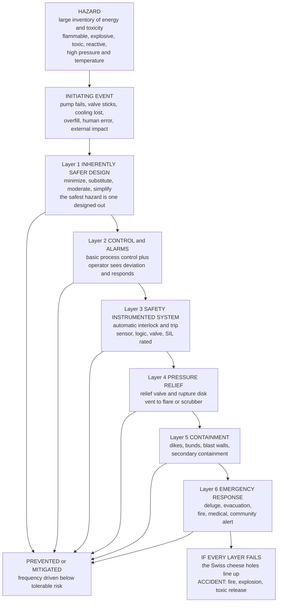

# ⚠️ Process Safety and Hazard Analysis

> [!abstract] TL;DR
> A chemical plant is a place where **enormous energy and toxicity are deliberately concentrated** — tons of flammable, explosive, poisonous, or reactive material held at high temperature and pressure — so when it fails, it can fail *catastrophically*: **Bhopal** killed thousands with a toxic release, **Flixborough** and **Texas City** flattened facilities, **Seveso** poisoned a region. **Process safety** is the hard-won discipline that prevents these disasters, and it is emphatically *not* the same as occupational safety (hard hats and slip-trips): it targets **low-frequency, high-consequence** loss of containment of hazardous material and energy. Its central empirical insight is that major accidents are almost never *one* big failure — they are a **chain of small failures lining up**, like holes in stacked slices of **Swiss cheese** momentarily aligning to let danger pass all the way through. So engineers build **layers of protection** (each slice a barrier) so that no single fault, and ideally no plausible combination, can reach catastrophe: first and best is **inherently safer design** (minimize inventory, substitute a safer material, moderate conditions, simplify) — the safest hazard is the one you designed *out*; then process control and **alarms**; then **safety instrumented systems** (automatic interlocks and trips, rated by **SIL**); then **pressure relief** (valves and rupture disks venting to flare or scrubber); then **containment** (dikes, blast walls); and finally **emergency response**. The toolkit that finds and quantifies the hazards is systematic: **HAZOP** (guideword-driven deviation analysis), what-if, FMEA, checklists, consequence modeling (flammability limits, dispersion, overpressure, thermal effects), and **QRA/LOPA** — where the probabilities of *independent* protection layers **multiply** to drive the frequency of a catastrophic outcome below a tolerable threshold. Because failures are as much **organizational** as technical, all of this is wrapped in a management system (PSM, **management of change**, and a genuine **safety culture**). Process safety is a **non-negotiable, ethical dimension of every plant** — inseparable from process design, reactor engineering (runaway), and control (interlocks).

## Intuition

**Analogy:** Imagine you must move a bucket of water across a room without spilling a drop, and to be *sure*, you nest five buckets one inside another — if the innermost leaks, the next catches it, then the next. That is **defense in depth**, and it is exactly how engineers keep a hazard from reaching people. Now picture each barrier not as a solid wall but as a **slice of Swiss cheese**: every real safeguard has holes — a relief valve that might stick, an alarm an operator might ignore, a shutdown that might be bypassed for maintenance. On any given day the holes sit in different places, so a hazard that slips through one slice is stopped by the next. A catastrophe happens only in the rare moment when the holes in *every* slice line up and a straight path opens from the hazard all the way to disaster. James Reason's **Swiss-cheese model** is the mental picture of the whole field: accidents are not single dramatic failures but **trajectories through aligned weaknesses**, so you defend by stacking independent slices and by keeping each one's holes few and small.

The deepest move, though, is to notice you never needed to carry that much water in the first place. **Inherently safer design** asks not "how do I add another slice?" but "how do I *remove the hazard*?" — store a hundred kilograms of a toxic intermediate instead of a hundred tons, generate it on demand rather than warehousing it, run at a pressure the vessel can never burst at, pick a solvent that will not catch fire. A hazard you have designed out needs no protecting, cannot fail, and cannot be bypassed. In a plant that concentrates energy and poison by the tankful, that is the difference between a discipline of *catching* danger and a discipline of *not creating it* — and it is why Trevor Kletz's line, *"what you don't have can't leak,"* is the motto of the entire field.

---

## How It Works

### Core Mechanics

Process safety runs on a single logical spine: **a hazard exists → an initiating event challenges it → layers of protection must stop or mitigate it → if every layer fails, an accident results.** Each step below is a place where the discipline intervenes.

1. **Name the hazard.** A hazard is a *stored potential for harm*: a large **inventory** of material that is **flammable** (fuels, solvents), **explosive** (reactive gases, dusts), **toxic** (methyl isocyanate at Bhopal, chlorine, ammonia), **reactive** (can self-heat and run away), or simply held at **high pressure/temperature/energy**. The magnitude of the consequence scales with *how much* you store and *how energetic* it is — which is why inventory reduction is the single most powerful lever.

2. **Characterize the fire and explosion hazard quantitatively.** A vapor burns only within its **flammability window**, between the **lower flammable limit (LFL)** and **upper flammable limit (UFL)** — too lean below LFL, too rich above UFL. The **flash point** is the temperature at which a liquid gives off enough vapor to ignite. A released cloud can become a **vapor cloud explosion (VCE)**, and a pressurized liquid above its boiling point that loses containment can flash violently into a **BLEVE** (boiling-liquid expanding-vapor explosion). Finely divided solids give **dust explosions**. Each is a distinct consequence model.

3. **Characterize toxic release and dispersion.** For a toxic hazard the chain is **source term** (how fast and how much escapes — a hole, a relief discharge, an evaporating pool) → **atmospheric dispersion** (how the plume spreads and dilutes downwind, set by weather and terrain) → **dose and effect** on people. Bhopal is the archetype: water ingress triggered a runaway that vented ~40 tons of methyl isocyanate over a sleeping city.

4. **Watch for runaway reactions.** An **exothermic** reaction releases heat; if heat *generation* (which climbs exponentially with temperature via Arrhenius kinetics) outpaces heat *removal* (which climbs only linearly with the temperature difference), the reactor **self-accelerates** — a **thermal runaway** that can vaporize contents, overpressure the vessel, and rupture it. This is the direct link to reactor engineering: the same energy balance that sizes a cooling jacket defines the boundary of runaway.

5. **Identify hazards systematically, not by intuition.** The industry does not trust "we thought of everything." It uses structured methods: **HAZOP** (Hazard and Operability study) walks every line and vessel applying **guidewords** — *No, More, Less, Reverse, As-well-as, Part-of, Other-than* — to each parameter (flow, pressure, temperature, level) to surface every credible **deviation** and its causes and consequences; **what-if** analysis; **FMEA** (failure modes and effects); and **checklists** for the routine. The output is a ranked list of hazard scenarios.

6. **Estimate the risk.** **Risk = frequency × consequence.** **Quantitative risk assessment (QRA)** combines **fault trees** (how combinations of component failures produce a top event) and **event trees** (how an initiating event branches through safeguards to outcomes) with consequence models to produce **F–N curves** (frequency of events causing ≥ N fatalities) and **risk matrices**. The result is compared against a **tolerable risk** criterion (ALARP — *as low as reasonably practicable*).

7. **Build layers of protection — defense in depth.** Between hazard and harm sit **independent protection layers (IPLs)**, each with a **probability of failure on demand (PFD)**. In order of preference: (i) **inherently safer design** — minimize/substitute/moderate/simplify to remove the hazard; (ii) **basic process control** and **alarms** with operator response; (iii) **safety instrumented systems (SIS)** — sensors + logic + final elements that trip the process automatically, rated by **Safety Integrity Level (SIL 1–4)**, each level cutting PFD by ~10×; (iv) **pressure relief** — relief valves and rupture disks that open before the vessel bursts, routing flow to a flare or scrubber; (v) **passive containment** — dikes, bunds, blast walls; (vi) **emergency response** — deluge, evacuation, community alert.

8. **Multiply the layers — the LOPA arithmetic.** In **Layer of Protection Analysis (LOPA)** the mitigated frequency of the accident is the initiating-event frequency **times the product of the PFDs** of every *independent* layer: $f_{\text{mit}} = f_{\text{init}} \times \prod_i \text{PFD}_i$. Because PFDs are small (0.1, 0.01, …) and *multiply*, a handful of modest layers can drive a once-per-decade challenge to a once-in-ten-million-years catastrophe — **provided the layers are genuinely independent** (no shared sensor, power, or common-mode failure).

9. **Manage it as a system.** Most disasters are **organizational** as much as technical. Regulations (OSHA **Process Safety Management**, the EU **Seveso** directives) mandate 14 elements including **management of change (MOC)** — every modification must be re-analyzed, because unreviewed changes (a temporary pipe at Flixborough) have caused catastrophes — plus mechanical integrity, operating procedures, incident investigation, and above all a **safety culture** where stopping a job for safety is rewarded, not punished.

### Flow / Architecture



---

## Key Concepts

### Secondary Level

- **Plants store danger on purpose.** A chemical factory deliberately holds huge amounts of stuff that can **burn, explode, or poison**, often hot and under pressure. That is what makes the products cheap — and what makes a failure potentially catastrophic. **Process safety** is the job of making sure it never gets out.
- **Accidents come from a chain, not one big mistake.** Picture safety barriers as **slices of Swiss cheese** stacked up. Each slice has holes (things that can go wrong), but the holes are in different places, so a problem that gets through one slice is caught by the next. A disaster happens only when the holes in *every* slice happen to line up at once.
- **So you stack many barriers.** Good design, warning **alarms**, automatic **shut-off switches**, safety **valves** that let off pressure, walls and ditches to catch spills, and an **emergency plan**. If one fails, another catches it — this is called **defense in depth**.
- **The best barrier is not needing one.** The smartest move is to **design the danger away**: store less, use a safer chemical, run at a gentler temperature. *"What you don't have can't leak."* A hazard you removed can never fail.
- **This is different from ordinary workplace safety.** Hard hats and non-slip floors matter, but process safety is about the *rare, huge* disasters — a whole plant exploding or a toxic cloud drifting over a town — not everyday cuts and falls.

### Undergraduate Level

- **The hazard categories and their consequence models.** *Fire/explosion*: a vapor is combustible only between its **LFL and UFL**; a liquid ignites above its **flash point**; releases can become a **VCE**, a superheated liquid a **BLEVE**, a dust cloud a dust explosion. *Toxic*: **source term → dispersion → dose**. *Runaway*: heat generation (Arrhenius, exponential in $T$) versus heat removal (linear in $\Delta T$). *Overpressure*: relief-system sizing.
- **HAZOP is the workhorse hazard-identification method.** A multidisciplinary team applies **guidewords** (No, More, Less, Reverse, As-well-as, Part-of, Other-than) to each process parameter on each node, systematically generating **deviations** ("More pressure," "No flow"), then tracing causes, consequences, existing safeguards, and recommended actions. It is deliberately exhaustive so nothing is missed by intuition.
- **Layers of protection follow a strict preference order.** **Inherently safer** (eliminate) > **passive** (a dike, a thicker wall — no action required) > **active** (an SIS trip, a relief valve — must detect and act) > **procedural** (an operator following a checklist — weakest, human-dependent). Higher layers are more reliable because they depend on less.
- **The LOPA calculation.** Mitigated frequency $f_{\text{mit}} = f_{\text{init}}\prod_i \text{PFD}_i$. A typical initiating frequency might be $10^{-1}/\text{yr}$; a basic control loop and an alarm each contribute $\text{PFD}\approx 10^{-1}$, a SIL-2 interlock $\approx 10^{-2}$, a relief valve $\approx 10^{-2}$ — the product can reach $10^{-7}/\text{yr}$, below a tolerable threshold near $10^{-5}/\text{yr}$.
- **Safety Integrity Level (SIL).** An SIS is rated SIL 1–4; each level demands a smaller **PFD** (SIL 1: $10^{-1}$–$10^{-2}$; SIL 2: $10^{-2}$–$10^{-3}$; SIL 3: $10^{-3}$–$10^{-4}$). Higher SIL means more redundancy, more testing, and more cost — you buy exactly the reliability the risk assessment demands, no more.
- **Independence is everything.** Layers only multiply if they are truly **independent** — different sensors, different power, different failure modes. A **common-cause failure** (one flood, one power loss, one corroded impulse line feeding two "independent" trips) collapses several slices into one and destroys the arithmetic.

### Graduate Level

- **Semenov/Frank-Kamenetskii thermal-runaway theory.** Steady states exist where heat generation $q_g(T)=(-\Delta H)\,V\,k_0 e^{-E/RT}C$ equals heat removal $q_r(T)=UA(T-T_a)$. The **critical condition** is tangency: $q_g=q_r$ *and* $dq_g/dT=dq_r/dT$. Below it, a stable low-temperature steady state exists; above it, no intersection remains and the reactor runs away. This connects directly to the multiple-steady-state (ignition/extinction) analysis of exothermic CSTRs.
- **Relief-system sizing and DIERS.** Emergency relief for runaways (two-phase flow, foamy/frothy venting) is sized by **DIERS** methodology, not single-phase gas equations. The relief device must pass enough mass flux to hold vessel pressure below the design rating while the reaction is at its peak self-heat rate — determined experimentally by **adiabatic calorimetry (ARC, VSP)** giving self-heat rate and time-to-maximum-rate.
- **Fault-tree and event-tree quantification.** A **fault tree** propagates component failure probabilities through AND/OR gates to a top-event frequency; an **event tree** branches an initiating event through each safeguard (success/failure) to enumerate outcome frequencies. Together they generate the **F–N curve**; **importance measures** (Fussell-Vesely, Birnbaum) rank which basic events dominate the risk and thus where to invest.
- **Tolerability of risk and ALARP.** Societal risk is judged against an **F–N tolerability line** (often slope −1 in log-log, i.e. $F \cdot N = \text{const}$, sometimes steeper to reflect aversion to catastrophes). Between an *intolerable* upper line and a *broadly acceptable* lower line lies the **ALARP** region, where further risk reduction is required until its cost is grossly disproportionate to the benefit.
- **Bhopal, Flixborough, Texas City as design lessons.** *Bhopal* (1984): vast **inventory** of a highly toxic intermediate + failed/bypassed safeguards → inherently-safer-design mandate to minimize and generate-on-demand. *Flixborough* (1974): an **un-reviewed temporary modification** (a bypass pipe) failed → the birth of formal **management of change**. *Texas City* (2005): normalized deviance, a full blowdown stack venting flammable liquid, and blurring occupational with process safety → CSB reforms and the primacy of *process*-safety leading indicators.
- **Inherently safer design as a design principle, not an add-on.** Kletz's four strategies — **minimize** (intensify, reduce inventory), **substitute** (safer material/route), **moderate** (dilute, run cooler/lower pressure, refrigerate), **simplify** (fewer, more tolerant components) — act at the *concept* stage, before any protection layers are even chosen. Their power is that they reduce the *consequence* term, whereas added layers only reduce the *frequency* term; a smaller inventory shrinks every downstream scenario simultaneously.
- **Organizational and cultural causation.** Modern loss causation (Reason's Swiss cheese, Rasmussen's **migration to the boundary**, Perrow's **Normal Accident Theory**, Leveson's **STAMP/systems-theoretic** view) reframes accidents as emergent properties of tightly coupled, interactively complex sociotechnical systems — so leading indicators, high-reliability-organization mindfulness, and management systems matter as much as any single valve.

---

## Python Demo

```python
# PROCESS SAFETY & HAZARD ANALYSIS -- four quantitative pictures of the discipline:
#
#   (A) THERMAL RUNAWAY : lumped exothermic reactor. Heat generation grows
#       EXPONENTIALLY with T (Arrhenius); heat removal grows only LINEARLY.
#       With adequate cooling the reactor is stable; with too little, it runs away
#       past the vessel design limit -> rupture. Cooling is a protection layer.
#
#   (B) FLAMMABILITY WINDOW : a vapor burns ONLY between LFL and UFL. Below = too
#       lean, above = too rich, between = explosive. Shows why concentration control
#       and inerting keep you out of the window.
#
#   (C) LOPA WATERFALL : independent protection layers MULTIPLY. Each layer's PFD
#       drives the accident frequency down; the product must fall below the
#       tolerable risk threshold.
#
#   (D) F-N CURVE : societal risk (frequency vs consequence) against an ALARP
#       tolerability line -- and how adding a layer moves a scenario into tolerance.
#
# Requires: numpy, matplotlib
import numpy as np
import matplotlib.pyplot as plt

# ============================ (A) THERMAL RUNAWAY ============================
# Lumped adiabatic-ish batch reactor:  dT/dt = (-dHr) * k0 * exp(-E/RT) * C / (rho cp)
#                                              - (UA/(rho cp V)) * (T - Ta)
#                                      dC/dt = -k0 * exp(-E/RT) * C
R      = 8.314          # J/mol/K
E      = 9.0e4          # J/mol   activation energy
k0     = 4.0e10         # 1/s     pre-exponential
dHr    = 6.0e5          # J/mol   exothermic heat of reaction (positive magnitude)
rho_cp = 2.0e6          # J/m^3/K volumetric heat capacity
C0     = 800.0          # mol/m^3 initial reactant concentration
Ta     = 300.0          # K       coolant temperature
T0     = 300.0          # K       initial temperature
T_design = 500.0        # K       vessel design-temperature limit (rupture above)

def simulate(UAoverV, t_end=6000.0, n=6000):
    """Integrate the lumped energy+species balance with Euler; UAoverV = UA/V [W/m^3/K]."""
    t  = np.linspace(0.0, t_end, n)
    dt = t[1] - t[0]
    T  = np.zeros(n); C = np.zeros(n)
    T[0], C[0] = T0, C0
    for i in range(1, n):
        k = k0 * np.exp(-E / (R * T[i-1]))
        qg = dHr * k * C[i-1]                       # heat generated  [W/m^3]
        qr = UAoverV * (T[i-1] - Ta)                # heat removed    [W/m^3]
        T[i] = T[i-1] + dt * (qg - qr) / rho_cp
        C[i] = max(0.0, C[i-1] - dt * k * C[i-1])
        if T[i] > 1200.0:                           # numerical ceiling once it runs away
            T[i:] = 1200.0; break
    return t, T

t_stable,  T_stable  = simulate(UAoverV=250.0)      # ample cooling -> controlled
t_runaway, T_runaway = simulate(UAoverV=120.0)      # marginal cooling -> RUNAWAY

print("=== (A) thermal runaway ===")
print(f"  ample cooling  : peak T = {T_stable.max():6.1f} K  (stays below design {T_design:.0f} K)")
print(f"  marginal cool. : peak T = {T_runaway.max():6.1f} K  -> exceeds design -> RUPTURE")

# ============================ (B) FLAMMABILITY WINDOW ============================
# Methane in air (vol %): LFL ~ 5.0, UFL ~ 15.0, stoichiometric ~ 9.5
LFL, UFL, stoich = 5.0, 15.0, 9.5
conc = np.linspace(0, 25, 500)                       # fuel vol %
flammable = (conc >= LFL) & (conc <= UFL)

# ============================ (C) LOPA WATERFALL ============================
f_init = 1.0e-1                                       # /yr  initiating event frequency
layers = [("Initiating\nevent",        1.0 ),        # starting point
          ("+ BPCS\ncontrol loop",     1.0e-1),      # basic process control  PFD
          ("+ Alarm +\noperator",      1.0e-1),      # independent alarm       PFD
          ("+ SIS\ninterlock (SIL2)",  1.0e-2),      # safety instrumented sys PFD
          ("+ Relief\nvalve",          1.0e-2)]       # pressure relief         PFD
labels  = [L[0] for L in layers]
freqs   = [f_init]
for _, pfd in layers[1:]:
    freqs.append(freqs[-1] * pfd)
tolerable = 1.0e-5                                    # /yr tolerable frequency
print("\n=== (C) LOPA: independent layers MULTIPLY ===")
for lab, f in zip(labels, freqs):
    print(f"  {lab.replace(chr(10),' '):24s}: f = {f:.1e} /yr")
print(f"  tolerable threshold      : {tolerable:.1e} /yr  -> "
      f"{'MET' if freqs[-1] < tolerable else 'NOT MET'}")

# ============================ (D) F-N CURVE ============================
N = np.logspace(0, 4, 200)                            # fatalities
F_tol = 1.0e-2 / N                                    # ALARP line: F*N = 1e-2 (slope -1)
# scenario points (N fatalities, F frequency /yr)
scen_bad  = (1000, 1.0e-3)    # large toxic release, few layers -> ABOVE line (intolerable)
scen_fix  = (1000, 3.0e-6)    # same release after adding layers -> BELOW line (tolerable)
scen_fire = (5,    5.0e-3)    # small flash fire

# ================================ PLOTS ================================
fig, ax = plt.subplots(2, 2, figsize=(13.5, 9.5))
fig.suptitle("Process Safety & Hazard Analysis:  runaway, flammability, and layers of protection",
             fontsize=14, fontweight="bold")

# A: thermal runaway
axA = ax[0, 0]
axA.plot(t_stable/60,  T_stable,  lw=3, color="#2ca02c", label="ample cooling: controlled")
axA.plot(t_runaway/60, T_runaway, lw=3, color="#d62728", label="marginal cooling: RUNAWAY")
axA.axhline(T_design, ls="--", lw=2, color="k", label=f"vessel design limit {T_design:.0f} K")
axA.fill_between(t_runaway/60, T_design, 1250, color="#d62728", alpha=0.08)
axA.set_xlabel("time  [min]"); axA.set_ylabel("reactor temperature  [K]")
axA.set_title("A. Thermal runaway\nheat generation (exp) outpaces removal (linear)")
axA.legend(loc="center right", fontsize=8.5); axA.grid(alpha=0.3); axA.set_ylim(280, 1250)

# B: flammability window
axB = ax[0, 1]
axB.fill_between(conc, 0, 1, where=conc < LFL,  color="#1f77b4", alpha=0.25)
axB.fill_between(conc, 0, 1, where=flammable,   color="#d62728", alpha=0.45,
                 label="FLAMMABLE / explosive")
axB.fill_between(conc, 0, 1, where=conc > UFL,  color="#7f7f7f", alpha=0.25)
axB.axvline(LFL,    ls="--", color="k"); axB.axvline(UFL, ls="--", color="k")
axB.axvline(stoich, ls=":",  color="darkred", label="stoichiometric")
axB.text(LFL/2,           0.5, "too LEAN\n(< LFL)",  ha="center", va="center", fontsize=9)
axB.text((LFL+UFL)/2,     0.72,"EXPLOSIVE\nwindow",   ha="center", va="center", fontsize=9, fontweight="bold")
axB.text((UFL+25)/2,      0.5, "too RICH\n(> UFL)",   ha="center", va="center", fontsize=9)
axB.set_xlabel("fuel concentration in air  [vol %]"); axB.set_yticks([])
axB.set_title("B. Flammability limits (methane)\nburns only between LFL and UFL")
axB.legend(loc="upper right", fontsize=8.5); axB.set_xlim(0, 25); axB.set_ylim(0, 1)

# C: LOPA waterfall
axC = ax[1, 0]
xpos = np.arange(len(freqs))
axC.bar(xpos, freqs, color="#9467bd", alpha=0.85, width=0.6, zorder=3)
axC.plot(xpos, freqs, "o-", color="#4b0082", lw=2, ms=7, zorder=4)
axC.axhline(tolerable, ls="--", lw=2, color="#2ca02c",
            label=f"tolerable  {tolerable:.0e}/yr")
axC.set_yscale("log")
axC.set_xticks(xpos); axC.set_xticklabels(labels, fontsize=8)
axC.set_ylabel("accident frequency  [1/yr]  (log)")
axC.set_title("C. LOPA: independent layers multiply\nPFDs stack to beat the tolerable line")
axC.legend(loc="upper right", fontsize=9); axC.grid(alpha=0.3, which="both", axis="y")

# D: F-N curve
axD = ax[1, 1]
axD.loglog(N, F_tol, lw=3, color="k", label="ALARP tolerability line")
axD.fill_between(N, F_tol, 1e0, color="#d62728", alpha=0.10)   # intolerable region
axD.fill_between(N, 1e-9, F_tol, color="#2ca02c", alpha=0.08)  # broadly tolerable
axD.plot(*scen_bad,  "o", ms=12, color="#d62728", label="toxic release, few layers")
axD.plot(*scen_fix,  "o", ms=12, color="#2ca02c", label="same release + layers")
axD.plot(*scen_fire, "s", ms=10, color="#ff7f0e", label="small flash fire")
axD.annotate("", xy=scen_fix, xytext=scen_bad,
             arrowprops=dict(arrowstyle="->", color="gray", lw=2))
axD.text(1100, 4e-5, "add\nlayers", fontsize=9, color="gray")
axD.set_xlabel("consequence  N  [fatalities]"); axD.set_ylabel("frequency F  [events > N per yr]")
axD.set_title("D. F-N curve: risk vs the tolerability line\n(risk = frequency x consequence)")
axD.legend(loc="lower left", fontsize=8); axD.grid(alpha=0.3, which="both")
axD.set_xlim(1, 1e4); axD.set_ylim(1e-8, 1e-1)

plt.tight_layout(rect=[0, 0, 1, 0.95])
plt.show()
```

Running this prints the safety tables and draws four panels. Panel **A** integrates a lumped exothermic reactor twice: with **ample cooling** the temperature climbs, then levels off as a stable steady state where generation balances removal; with only slightly **less cooling** the exponential heat-generation term overruns the linear removal term and the temperature blows through the **vessel design limit** — the essence of a thermal runaway, and the reason cooling capacity is a protection layer. Panel **B** shades the **flammability window** for methane: below the LFL the mixture is too lean to burn, above the UFL too rich, and only the red band between them is explosive — which is exactly why inerting and concentration control aim to keep the plant *out* of that band. Panel **C** is the **LOPA waterfall**: starting from a once-per-decade initiating event, each independent layer multiplies the frequency by its PFD, and on the log axis the bars march downward past the green **tolerable-risk** line — the multiplication of independent safeguards is what buys the required rarity. Panel **D** plots the scenarios on an **F–N** diagram against the **ALARP** tolerability line: a large toxic release with few layers sits in the intolerable (red) region, and the gray arrow shows how *adding layers* (panel C's mechanism) slides the same-consequence scenario down into the tolerable (green) zone.

---

## Real-World Applications

> **Example — Bhopal and the birth of inherently safer design.** On the night of 3 December 1984, water entered a storage tank holding roughly **40 tons of methyl isocyanate (MIC)** — a highly volatile, acutely toxic intermediate — at a Union Carbide plant in Bhopal, India. The resulting runaway reaction vented a toxic cloud over a densely populated area, killing thousands within hours and injuring hundreds of thousands. The disaster is the field's defining case study on **inventory**: the plant *stored* a large quantity of a lethal intermediate when the safer path was to generate MIC on demand and consume it immediately, keeping the inventory near zero. Multiple protection layers — a refrigeration system, a scrubber, a flare — were out of service or undersized, so the Swiss-cheese holes were pre-aligned. Bhopal drove the entire industry toward **inherently safer design** (minimize and substitute), rigorous **management of change**, and the modern **PSM** regime. Trevor Kletz's summary — *"what you don't have can't leak"* — is its permanent lesson.

- **HAZOP on every new and modified process.** Before a plant is built or changed, a multidisciplinary team runs a **HAZOP**, walking each node with guidewords to surface every credible deviation. It is a legal and insurance expectation across refining, petrochemicals, and pharmaceuticals, and it is the single most widely used hazard-identification method in the world.
- **Safety instrumented systems and SIL in refineries.** A fired heater, a compressor, or a reactor is protected by an **SIS** — independent sensors, logic solver, and shutdown valves — engineered to a **SIL** target set by LOPA (IEC 61508/61511). A high-pressure trip on an ammonia converter or a burner-management system on a fired furnace are everyday examples of active layers whose reliability is *quantified*, not assumed.
- **Pressure relief to flare and scrubber.** Every pressurized vessel carries **relief valves or rupture disks** sized (by API 520/521 and, for runaways, DIERS) to open before the design pressure is exceeded, routing discharge to a **flare** (which safely burns flammable vent) or a **scrubber** (which neutralizes toxic vent). The flare stack silhouetting every refinery is the visible face of this layer.
- **Seveso and land-use planning.** The 1976 dioxin release at Seveso, Italy, produced the EU **Seveso Directives**, which mandate major-accident-hazard reporting, safety-management systems, and — distinctively — **land-use planning** that keeps housing away from major-hazard sites, an organizational and regulatory protection layer around the plant fence.
- **Runaway prevention in fine-chemical and pharma batch reactors.** Exothermic batch chemistry (nitrations, oxidations, polymerizations) is screened by **adiabatic calorimetry** (ARC/VSP) to measure onset temperature, self-heat rate, and time-to-maximum-rate, which then set cooling requirements, dosing-controlled (semi-batch) operation, and emergency-relief sizing — a direct application of thermal-runaway theory to keep reactors on the stable side of the Semenov boundary.

---

## Common Pitfalls

- **Confusing occupational safety with process safety.** Low injury rates (slips, cuts) say almost nothing about the risk of a major explosion or toxic release. **Texas City (2005)** happened at a site with excellent *occupational* statistics; leaders mistook them for *process*-safety health. Track **process-safety leading indicators** (loss-of-containment events, safety-critical-device failures, overdue inspections), not just recordable-injury rates.
- **Assuming protection layers are independent when they are not.** LOPA's multiplication only holds for **truly independent** IPLs. A shared sensor, shared power supply, shared logic solver, or a **common-cause failure** (one flood, one instrument-air loss, one corroded impulse line) collapses several "independent" slices into one — the arithmetic silently overstates protection by orders of magnitude.
- **Adding layers instead of removing the hazard.** Bolting on more alarms and interlocks reduces the *frequency* term but leaves the *consequence* term — the huge inventory — untouched. **Inherently safer design** (minimize/substitute/moderate/simplify) attacks the consequence and shrinks *every* downstream scenario at once; it is cheaper and more robust than a stack of active safeguards, but it must be done at the concept stage, not retrofitted.
- **Skipping management of change.** **Flixborough (1974)** was destroyed by a *temporary* bypass pipe installed without proper engineering review. Any modification — a substituted part, a bypassed interlock for maintenance, a new operating limit — can invalidate the original hazard analysis. Unreviewed change is a leading cause of catastrophe; every change must be re-analyzed.
- **Undersizing emergency relief for a runaway.** Relief systems sized with single-phase gas equations fail catastrophically when a runaway produces **two-phase (frothy) venting**. Runaway relief must use **DIERS** methodology and calorimetric self-heat data, or the vessel over-pressures with the relief valve wide open.
- **Treating safety as purely technical.** Most major accidents trace to **organizational** roots — production pressure overriding caution, normalized deviance, a culture that punishes stopping the job. A perfect P&ID cannot compensate for a broken safety culture; the management system (procedures, training, incident learning, leadership) is itself a protection layer.
- **Ignoring the low-frequency tail.** Because catastrophes are *rare*, "it has never happened here" breeds complacency and the erosion of safeguards (deferred maintenance, disabled alarms). Risk is **frequency × consequence**; a once-in-ten-thousand-years event with thousands of fatalities still demands respect. Rarity is not safety.

---

## Related Concepts

**Sibling notes in this vault (Chemical Engineering)** — process safety is the dimension that touches *every other* topic in the vault, which is why it sits in the process-systems-and-frontiers section. *Reactor_Design_and_Multiple_Reactions* supplies the exothermic **runaway** physics: the same energy balance that sizes a cooling jacket defines the boundary between a stable reactor and a thermal explosion, and multiple-steady-state ignition/extinction is a safety problem as much as a design one. *Process_Dynamics_and_Control* provides the **basic process control and alarms** that form the first active protection layer and the **safety instrumented systems** (interlocks, trips) that form the automatic one. *Energy_Balances_in_Processes* is the accounting behind heat-of-reaction and relief-load calculations. *Process_Design_and_Economics* is where **inherently safer design** must be embedded — at the concept and flowsheet stage, when inventory, materials, and operating conditions are still choices rather than fixed constraints. And the *Chemical_Engineering_Overview* frames why safety is a *non-negotiable* deliverable of the whole discipline, not an afterthought — because scale amplifies hazard.

**Systems, failure, and risk (cross-vault)**
- [[Cascades_and_Systemic_Risk]] — the network view of how a single initiating failure propagates through coupled components; the same cascade logic underlies domino effects and common-cause failures that collapse "independent" protection layers
- [[Resilience_and_Robustness]] — defense-in-depth and safety margins are engineered **robustness**; the trade-off between efficiency (tight coupling, low inventory of slack) and resilience is exactly the tension a safe plant must manage
- [[Systems_Failure_and_Wicked_Problems]] — Perrow's **Normal Accident Theory** and the Swiss-cheese/STAMP view: major accidents as emergent properties of tightly coupled, interactively complex sociotechnical systems, not single component failures

**Quantitative foundations (cross-vault)**
- [[Probability_Theory]] — the machinery of fault trees, event trees, PFDs, and F–N curves; layers multiply because independent failure probabilities multiply, and QRA is applied probability

**Ethics and analogous engineering (cross-vault)**
- [[Business_Ethics]] — process safety is a core **professional and corporate responsibility**; catastrophic accidents cost lives, environment, and a firm's license to operate, making "doing right" and long-run value inseparable
- [[Avionics_and_Flight_Control_Systems]] — aerospace independently invented the same doctrine: **redundancy, voting, and fail-safe design** are defense-in-depth for flight-critical systems, and SIL is the process-industry cousin of aviation's DAL (design assurance levels)

---

## Review Questions

**Secondary**
1. A factory stores a large tank of a chemical that can catch fire. Using the **Swiss-cheese** picture, explain why the engineers add several different safety measures (alarms, automatic shut-offs, safety valves, a wall around the tank) instead of relying on just one really good one. Then explain what *"the safest hazard is the one you designed out"* means, and give one way the factory could reduce the danger by changing the process itself rather than adding another safety device.

**Undergraduate**
2. A hazard scenario has an initiating-event frequency of $10^{-1}$ per year. It is protected by a basic control loop ($\text{PFD}=10^{-1}$), an independent alarm with operator response ($\text{PFD}=10^{-1}$), and a SIL-2 safety instrumented function ($\text{PFD}=10^{-2}$). Compute the mitigated frequency and state whether it meets a tolerable target of $10^{-5}$ per year. Now suppose the alarm and the SIF share the *same* pressure transmitter. Explain qualitatively why the layers are no longer independent, why your LOPA number is now optimistic, and what a **common-cause failure** would do to the result.

**Graduate**
3. An exothermic reaction is run in a jacketed batch reactor. Using the Semenov picture — heat generation $q_g(T)$ rising *exponentially* with temperature versus heat removal $q_r(T)$ rising *linearly* — derive (or describe) the **critical condition** separating a controllable reaction from a thermal runaway, and explain how it relates to the multiple-steady-state behavior of an exothermic CSTR. Then contrast two risk-reduction strategies for this reactor: (i) **adding protection layers** (a high-temperature SIS trip plus an emergency relief system sized by DIERS), and (ii) **inherently safer redesign** (semi-batch dosing to limit accumulated energy, dilution, or a lower-concentration route). Which term of *risk = frequency × consequence* does each strategy attack, why is the inherently safer option generally preferred, and what practical constraints (product quality, throughput, capital) push designers toward the added-layers option instead?

---

## Sources

- D. A. Crowl & J. F. Louvar — *Chemical Process Safety: Fundamentals with Applications*, 4th ed. (Prentice Hall, 2019)
- Center for Chemical Process Safety (CCPS) — *Guidelines for Hazard Evaluation Procedures*, 3rd ed. (Wiley-AIChE, 2008)
- T. A. Kletz — *What Went Wrong? Case Histories of Process Plant Disasters* and *Process Plants: A Handbook for Inherently Safer Design*, 2nd ed. (CRC Press)
- S. Mannan (ed.) — *Lees' Loss Prevention in the Process Industries*, 4th ed. (Butterworth-Heinemann, 2012)
- CCPS — *Layer of Protection Analysis: Simplified Process Risk Assessment* (Wiley-AIChE, 2001)

---

#chemical-engineering #process-safety #HAZOP #layers-of-protection #inherently-safer-design
