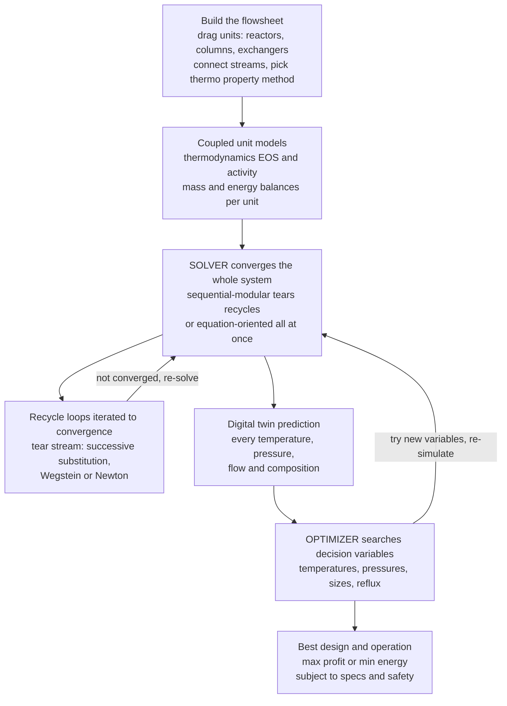

# 🖥️ Process Simulation and Optimization

> [!abstract] TL;DR
> Designing a whole chemical plant by hand — thousands of coupled mass, energy, equilibrium, and rate equations spread across dozens of units, with **recycle** loops that feed back on themselves — is humanly impossible. So modern process engineering builds the plant **in a computer first**. A **flowsheet simulator** (Aspen Plus, Aspen HYSYS, PRO/II, DWSIM) is a **digital twin**: you drop reactors and columns onto a flowsheet, connect the streams, pick a **thermodynamic property method**, and the solver converges the entire coupled system, predicting every temperature, pressure, flow, and composition — letting you ask *"what if we raise the pressure?"* without bending a single pipe. Two solver architectures dominate: **sequential-modular** (solve units one at a time, iterating **tear streams** until the recycles converge) and **equation-oriented** (solve all equations at once — faster for optimization). Then **optimization** goes further: instead of simulating one fixed design, it defines an **objective** (maximize profit or yield, minimize cost, energy, or emissions), turns temperatures, pressures, sizes, and reflux ratios into **decision variables**, imposes **constraints** (product specs, safety, physics), and searches — via **NLP**, **MINLP** for discrete unit choices, and even **superstructure** synthesis of the flowsheet itself — for the single best plant no human could find by hand. Simulation and optimization are how virtually every plant is now designed, debottlenecked, and run; they are the computational backbone of process systems engineering and the doorway to digital-twin and AI-driven operations.

---

## Intuition

**Analogy — building the plant in a computer before building it in steel.** Imagine being handed a blank sheet and told to design an ammonia plant: dozens of reactors, columns, compressors, and heat exchangers, all plumbed together, with unreacted gas looping back to the front. To know the temperature leaving *one* column you need to know its feed — which comes from a unit downstream of a recycle, which depends on the column you were trying to solve in the first place. Everything depends on everything. Solving it by hand, algebraically, across the whole plant, is simply beyond human patience.

So chemical engineers do what architects and aircraft designers do: **they build it in a computer first.** A **process simulator** is a digital twin of the plant. You *drag* a reactor onto the flowsheet, drop a distillation column beside it, draw the pipes (**streams**) that connect them, and tell the software which **thermodynamic model** describes your chemicals. Then you press solve, and the machine does the impossible bookkeeping — grinding through the coupled balances until every stream in the plant is consistent, recycle and all. Now the plant exists as numbers you can poke: *raise the pressure, add a stage, cut the reflux* — and watch the whole flowsheet respond, with nothing built and nothing at risk.

**Optimization** is the next, bolder question. A simulator tells you what *one* plant does. Optimization asks the computer to find the **best** plant — to treat the reflux ratio, the reactor temperature, the column pressure as dials it is allowed to turn, and to search the vast landscape of possible settings for the one that **maximizes profit** or **minimizes energy** while never violating a spec or a safety limit. It is the difference between *reading* the map and *finding the shortest road across it*.

---

## How It Works

### Core mechanics

1. **A flowsheet is a graph of unit models.** Each block — reactor, column, exchanger, pump, flash drum — carries a mathematical **model**: mass and energy balances, phase-equilibrium relations, and rate/design equations. Streams carry flow, composition, temperature, and pressure between blocks. Solving the flowsheet means finding stream values that make **every** unit's equations true simultaneously.

2. **The property method is the foundation — choose it first.** Before any unit solves, the simulator needs **thermodynamics**: how enthalpy, density, and phase split depend on temperature, pressure, and composition. Cubic **equations of state** (Peng-Robinson, SRK) suit hydrocarbons and gases; **activity-coefficient** models (NRTL, UNIQUAC, Wilson) suit polar and non-ideal liquids. Pick the wrong method and every downstream number is quietly wrong — the single most consequential decision in a simulation.

3. **Sequential-modular architecture — solve units one at a time.** The classic simulator (Aspen Plus, HYSYS in steady state) evaluates each block in flow order: feed in, product out, move to the next. This works cleanly for a straight-through process — but a **recycle** creates a loop with no starting point, because a downstream stream feeds an upstream unit.

4. **Recycle convergence via tear streams — the central computational challenge.** To break the loop, the solver **tears** one recycle stream: it *guesses* the torn stream's values, runs all the units forward around the loop, and gets a *new* estimate of that same stream. If the guess and the result disagree, it updates and repeats — **successive substitution**, accelerated by **Wegstein** or solved by **Newton's method** — until the tear stream stops changing. That fixed point is the converged flowsheet. Slow, near-unity convergence factors are why acceleration matters.

5. **Equation-oriented architecture — solve everything at once.** Instead of marching unit by unit, gather *all* the flowsheet equations into one giant system and solve it simultaneously with a Newton-type method. It converges recycles far faster and, crucially, exposes analytic derivatives — making it the natural engine for **optimization** and **dynamic** simulation, at the cost of harder initialization and debugging.

6. **Steady-state versus dynamic.** Steady-state simulation (accumulation = 0) sizes and rates equipment for normal operation. **Dynamic** simulation adds time derivatives to study startup, shutdown, disturbances, and control — the basis of operator-training simulators and safety studies.

7. **Optimization sits on top of simulation.** Wrap the converged flowsheet in an outer loop: define an **objective** $f(\mathbf{x})$ (e.g., annual profit), choose **decision variables** $\mathbf{x}$ (temperatures, pressures, sizes, reflux), impose **constraints** $g(\mathbf{x}) \le 0$ (specs, safety, physical bounds), and let an optimizer propose new $\mathbf{x}$, re-simulate, and climb toward the optimum. **NLP** handles continuous variables; **MINLP** adds integer decisions (*which* units exist); **superstructure** optimization embeds every candidate flowsheet and lets the solver pick the topology itself.

### Flow / architecture



---

## Key Concepts

### Secondary (plain-language)

- **Build the plant in a computer first.** Before spending millions on steel, engineers assemble the whole plant as a diagram in software and let the computer predict how it will behave. It is a flight simulator for factories.
- **A simulator is a digital twin.** Connect virtual reactors and columns, tell it what chemicals you have, and it calculates every temperature and flow in the plant — so you can test ideas safely.
- **Recycles make it hard.** Because leftover material loops back to the start, the answer at one point depends on itself. The computer solves this by guessing, checking, and correcting until it all fits — the loop *converges*.
- **Optimization finds the best plant, not just a working one.** Simulation says what one design does; optimization turns the knobs (temperature, pressure, reflux) to find the design that makes the most profit or uses the least energy.

### Undergraduate (the working formalism)

- **Flowsheet = coupled equations.** For every unit and stream: mass balances, energy balances, and phase-equilibrium relations. A converged simulation is a **root** of this large nonlinear system $F(\mathbf{z}) = \mathbf{0}$.
- **Tear-stream successive substitution.** Guess the torn recycle stream $R_0$, run the units to get $R_1 = g(R_0)$, iterate $R_{n+1} = g(R_n)$. It converges when the map's slope $|g'| < 1$; the closer to 1, the slower — motivating **Wegstein** acceleration $R_{n+1} = q\,g(R_n) + (1-q)R_n$ with $q$ from the secant slope.
- **Newton for recycles and specs.** Treat convergence as root-finding: $R^* = R - g'(R)^{-1}(R - g(R))$ converges quadratically near the solution — the [[Root_Finding|Newton method]] applied to a flowsheet, and the engine of equation-oriented solvers.
- **Property methods matter.** Ideal-gas or Raoult's-law assumptions fail for real mixtures; activity coefficients and cubic EOS set the vapour-liquid split that every distillation result depends on.
- **Optimization anatomy.** Minimize $f(\mathbf{x})$ subject to $g(\mathbf{x}) \le 0,\ h(\mathbf{x}) = 0$: $f$ is total cost or negative profit, $\mathbf{x}$ the operating/design variables, and the constraints are product purity, safety, and physical bounds. The optimum satisfies the **KKT conditions** (stationarity via [[Lagrange_Multipliers|Lagrange multipliers]] on the active constraints).
- **The classic distillation trade-off.** Total annualized cost = **capital** (stages, which explode as reflux approaches $R_{min}$) + **operating** (reboiler energy, which grows with reflux). The sum has an interior minimum near $1.1$–$1.5\times R_{min}$ — the archetypal one-variable process optimization solved in the demo.

### Graduate (design, synthesis, and modern practice)

- **Sequential-modular vs equation-oriented.** SM is robust and modular but slow to optimize (each objective evaluation re-converges every recycle); EO solves all equations and their Jacobian simultaneously, giving exact gradients and far faster optimization — the trade is initialization and diagnosability. Modern tools (Aspen, gPROMS) blend both.
- **NLP and MINLP.** Continuous optimization (SQP, interior-point, reduced-gradient) handles temperatures and sizes; **mixed-integer** formulations add binary variables for discrete structural decisions (whether a unit or stream exists), tying process synthesis to [[Integer_Programming|integer programming]] and branch-and-bound. Combinatorial size grows explosively.
- **Superstructure optimization / process synthesis.** Embed *all* plausible units and interconnections in one **superstructure**, attach binary switches, and let an MINLP select the optimal flowsheet topology — synthesizing the design, not just tuning a fixed one. Heat-exchanger-network and reactor-network synthesis are canonical cases.
- **Heat and mass integration.** Pinch analysis and simultaneous MINLP minimize utility use across the whole site; energy targets become optimization constraints, coupling the flowsheet to its utility system.
- **Derivative-based vs derivative-free.** Rigorous SM simulators often lack analytic gradients, so optimizers use finite differences (noisy, expensive) or **derivative-free** methods; EO models supply analytic Jacobians for [[Gradient_Descent|gradient-based]] and [[Newtons_Method|Newton-type]] search. Noise and non-convexity make **local vs global** optimality a real hazard.
- **Surrogate models and digital-twin operations.** Expensive rigorous units are increasingly replaced by cheap **surrogates** — polynomial/[[Linear_Regression|regression]] response surfaces, Kriging, or [[Neural_Network_Basics|neural networks]] trained on simulation data — enabling fast optimization, **real-time optimization (RTO)** against live plant data, and machine-learning-driven **digital twins** that continuously re-optimize operating plants.

---

## Python Demo

```python
# Process simulation and optimization, the two computational pillars of PSE.
#
# (a) SIMULATION -- converge a small flowsheet WITH A RECYCLE by iterating a
#     tear stream (what a sequential-modular simulator like Aspen Plus does).
#     Reactor (first-order CSTR) + separator + recycle of unreacted A.
#     We tear the recycle R, run the units forward to get a new R, and iterate:
#         total  = F + R                      reactor inlet (fresh + recycle)
#         x_sp   = Da / (total + Da)          single-pass conversion (CSTR)
#         unreact= (1 - x_sp) * total
#         R_new  = sigma * unreact            separator returns fraction sigma
#     -> successive substitution vs Wegstein acceleration (faster convergence).
#
# (b) OPTIMIZATION -- find the BEST distillation reflux ratio: total annualized
#     cost = capital (stages blow up near R_min) + operating (reboiler ~ R+1).
#     Plot the cost landscape with the optimum, and converge a golden-section
#     search (derivative-free) to it.
#
# Requires: numpy, matplotlib
import numpy as np
import matplotlib.pyplot as plt

# =====================================================================
# (a) FLOWSHEET CONVERGENCE WITH RECYCLE  (the core of a simulator)
# =====================================================================
F, Da, sigma = 10.0, 12.0, 0.95            # fresh feed, k*V group, separator recovery

def units_forward(R):
    """Run reactor + separator once given a guessed recycle R -> new recycle."""
    total   = F + R
    x_sp    = Da / (total + Da)            # first-order CSTR single-pass conversion
    unreact = (1.0 - x_sp) * total
    return sigma * unreact                 # separator sends this back as recycle

# converged reference (iterate to a tight fixed point)
R_ref = 0.0
for _ in range(2000):
    R_ref = units_forward(R_ref)

# --- successive substitution: R_{n+1} = g(R_n) ---
R = 0.0
hist_ss = [R]
for _ in range(60):
    R = units_forward(R)
    hist_ss.append(R)
hist_ss = np.array(hist_ss)

# --- Wegstein acceleration (secant on the fixed-point map) ---
x_old = 0.0
g_old = units_forward(x_old)
x_new = g_old                              # first step = plain substitution
hist_w = [x_old, x_new]
for _ in range(12):
    g_new  = units_forward(x_new)
    denom  = x_new - x_old
    s      = (g_new - g_old) / denom if denom != 0 else 0.0
    q      = s / (s - 1.0) if s != 1.0 else 0.0
    x_next = q * x_new + (1.0 - q) * g_new
    x_old, g_old, x_new = x_new, g_new, x_next
    hist_w.append(x_new)
hist_w = np.array(hist_w)

print("=== (a) recycle tear-stream convergence ===")
print(f"  converged recycle R* = {R_ref:6.3f}  mol/s")
print(f"  successive substitution after 60 iters: R = {hist_ss[-1]:6.3f}"
      f"  (residual {abs(hist_ss[-1]-R_ref):.2e})")
print(f"  Wegstein after {len(hist_w)-1} iters:          R = {hist_w[-1]:6.3f}"
      f"  (residual {abs(hist_w[-1]-R_ref):.2e})")

# =====================================================================
# (b) OPTIMIZATION: best distillation reflux ratio (min total cost)
# =====================================================================
Rmin, Nmin, K_stage, c_cap, c_op = 1.2, 10.0, 6.0, 1.0, 10.0

def TAC(R):
    N        = Nmin + K_stage / (R - Rmin)     # stages explode as R -> Rmin
    capital  = c_cap * N
    operating= c_op * (R + 1.0)                # reboiler duty ~ (R+1)
    return capital + operating, capital, operating

R_star = Rmin + np.sqrt(c_cap * K_stage / c_op)          # analytic optimum
tac_star = TAC(R_star)[0]

# golden-section search (derivative-free 1-D optimizer)
def golden_section(f, a, b, iters):
    gr = (np.sqrt(5.0) - 1.0) / 2.0
    c, d = b - gr * (b - a), a + gr * (b - a)
    mids = []
    for _ in range(iters):
        if f(c) < f(d):
            b = d
        else:
            a = c
        c, d = b - gr * (b - a), a + gr * (b - a)
        mids.append(0.5 * (a + b))
    return np.array(mids)

mids = golden_section(lambda R: TAC(R)[0], Rmin + 0.05, 6.0, 25)
print("\n=== (b) reflux optimization ===")
print(f"  optimal reflux ratio R* = {R_star:.3f}  ({R_star/Rmin:.2f} x R_min)")
print(f"  minimum total cost      = {tac_star:.2f}")
print(f"  golden-section estimate = {mids[-1]:.3f}"
      f"  (error {abs(mids[-1]-R_star):.2e})")

# =====================================================================
# PLOTS
# =====================================================================
fig, ax = plt.subplots(2, 2, figsize=(13, 9))
fig.suptitle("Process Simulation (converge the recycle) and Optimization "
             "(find the best design)", fontsize=14, fontweight="bold")

# A: recycle convergence -- successive substitution vs Wegstein
axA = ax[0, 0]
axA.plot(range(len(hist_ss)), hist_ss, "o-", ms=3, color="#1f77b4",
         label="successive substitution")
axA.plot(range(len(hist_w)), hist_w, "s-", ms=4, color="#d62728",
         label="Wegstein acceleration")
axA.axhline(R_ref, ls="--", color="k", lw=1.2, label=f"converged R* = {R_ref:.2f}")
axA.set_xlabel("iteration (tear-stream pass)")
axA.set_ylabel("recycle flow  R  (mol/s)")
axA.set_title("A. Converging the recycle: the core of a simulator")
axA.legend(fontsize=8); axA.grid(alpha=0.3)

# B: fixed-point cobweb of successive substitution
axB = ax[0, 1]
Rgrid = np.linspace(0, 1.3 * R_ref, 300)
axB.plot(Rgrid, [units_forward(r) for r in Rgrid], color="#1f77b4",
         lw=2, label="map  R_new = g(R)")
axB.plot(Rgrid, Rgrid, "k:", lw=1.2, label="y = x")
# staircase
xs, ys = [], []
for i in range(len(hist_ss) - 1):
    xs += [hist_ss[i], hist_ss[i]];  ys += [hist_ss[i], hist_ss[i + 1]]
    xs += [hist_ss[i], hist_ss[i+1]]; ys += [hist_ss[i+1], hist_ss[i+1]]
axB.plot(xs, ys, color="#ff7f0e", lw=1, alpha=0.8)
axB.plot(R_ref, R_ref, "k*", ms=13, label="fixed point")
axB.set_xlabel("recycle in  R"); axB.set_ylabel("recycle out  g(R)")
axB.set_title("B. Recycle as a fixed point:  R* where g(R) = R")
axB.legend(fontsize=8); axB.grid(alpha=0.3)

# C: total-cost landscape vs reflux ratio, optimum marked
axC = ax[1, 0]
Rr = np.linspace(Rmin + 0.05, 6.0, 400)
tot = np.array([TAC(r)[0] for r in Rr])
cap = np.array([TAC(r)[1] for r in Rr])
op  = np.array([TAC(r)[2] for r in Rr])
axC.plot(Rr, tot, lw=2.5, color="#2ca02c", label="total annualized cost")
axC.plot(Rr, cap, lw=1.6, ls="--", color="#9467bd", label="capital (stages)")
axC.plot(Rr, op,  lw=1.6, ls="--", color="#8c564b", label="operating (energy)")
axC.axvline(Rmin, color="gray", ls=":", lw=1)
axC.text(Rmin + 0.03, tot.max() * 0.9, "R_min", color="gray", fontsize=8)
axC.plot(R_star, tac_star, "r*", ms=15, label=f"optimum R* = {R_star:.2f}")
axC.set_xlabel("reflux ratio  R"); axC.set_ylabel("cost (arb. units)")
axC.set_title("C. Optimization landscape: the best reflux ratio")
axC.legend(fontsize=8); axC.grid(alpha=0.3); axC.set_ylim(0, tot.max())

# D: golden-section convergence to the optimum
axD = ax[1, 1]
axD.semilogy(range(1, len(mids) + 1), np.abs(mids - R_star), "o-",
             ms=4, color="#d62728")
axD.set_xlabel("optimizer iteration")
axD.set_ylabel("|R_estimate - R*|  (log scale)")
axD.set_title("D. Optimizer converging to the optimum")
axD.grid(alpha=0.3, which="both")

plt.tight_layout(rect=[0, 0, 1, 0.96])
plt.savefig("process_simulation_and_optimization.png", dpi=120)
plt.show()
```

Running it prints the converged recycle and the optimal reflux, then draws four panels. Panel **A** is what a simulator actually *does*: tear the recycle, guess it, and iterate until it stops moving — plain **successive substitution** crawls in because the fixed-point slope is near unity, while **Wegstein** acceleration snaps to the answer in a handful of passes. Panel **B** shows the same convergence as a **cobweb** climbing the staircase between the map $g(R)$ and the line $y=x$ to their intersection, the converged flowsheet. Panels **C** and **D** are optimization: the **total-cost landscape** is the sum of a capital term that blows up as reflux approaches $R_{min}$ and an energy term that rises with reflux, giving a clean interior **optimum**, which a derivative-free **golden-section** search brackets to it geometrically. Simulation finds *a* consistent plant; optimization finds the *best* one.

---

## Real-World Applications

> **Example:** An **oil refinery running real-time optimization (RTO)** is process simulation and optimization operating a live plant, continuously, for money. A rigorous **equation-oriented model** of a fluid catalytic cracker or crude unit — built in Aspen Plus, HYSYS, or a vendor RTO package — is reconciled against live sensor data every few minutes, then an **NLP** solver adjusts setpoints (feed rates, cut points, reactor severity, recycle flows) to **maximize margin** subject to product-spec, equipment, and safety **constraints**. The same coupled model that engineers first used to *design* the unit — converging its hydrogen and unconverted-feed **recycles** through tear streams — now *optimizes* it in real time, squeezing out a few percent of yield or energy that, at refinery scale, is worth tens of millions of dollars a year. Design tool and operations brain are the same digital twin.

- **Steady-state design and rating.** Nearly every new plant — ammonia, methanol, ethylene, LNG, pharmaceuticals — is designed in Aspen Plus, HYSYS, PRO/II, or open-source **DWSIM** before construction: sizing columns, rating exchangers, closing recycle loops, and testing "what-if" scenarios with zero physical risk.
- **Debottlenecking and revamps.** Existing plants are modelled to find the limiting unit and test modifications (add a stage, change a pump, re-route a stream) on the computer before touching the plant.
- **Dynamic simulation and operator training.** Aspen Plus Dynamics and gPROMS reproduce startup, shutdown, and upsets; high-fidelity **operator training simulators** let staff rehearse emergencies on a virtual plant.
- **Superstructure synthesis.** Heat-exchanger-network and reactor-network **MINLP** synthesis (GAMS, Pyomo) selects the optimal flowsheet topology and heat integration, not just tuned parameters — squeezing capital and utility cost simultaneously.
- **Energy-transition processes.** Carbon-capture absorber/stripper trains, green-hydrogen electrolysis balance-of-plant, and battery-materials processes are designed and optimized in the same simulators, where energy and emissions become explicit objectives.
- **Surrogates and AI-driven digital twins.** Kriging, response-surface, and neural-network **surrogates** trained on rigorous simulations enable fast global optimization and machine-learning **digital twins** that re-optimize operating plants against live data.

---

## Common Pitfalls

- **Wrong property method — garbage in, garbage out.** The most damaging mistake in the field: choosing an inappropriate thermodynamic model (ideal where a mixture is strongly non-ideal, an EOS where an activity model is needed). Every temperature, duty, and column result is then confidently wrong. Validate the property method against data *before* trusting any flowsheet.
- **Recycle that will not converge.** Tearing the wrong stream, a bad initial guess, or plain successive substitution on a near-unity fixed-point map can leave a flowsheet oscillating or crawling forever. Choose the tear stream well, provide a good initial estimate, and use Wegstein or a Newton/equation-oriented solver.
- **Trusting the simulator as truth.** A converged simulation is a *model*, not reality. Unvalidated kinetics, idealized units, and missing trace components mean results must be sanity-checked against pilot data, balances, and physical intuition — a beautifully converged flowsheet can still be nonsense.
- **Local versus global optimum.** Non-convex, noisy objectives (especially from finite-differenced sequential-modular models) trap gradient optimizers in local optima. Use multi-start, derivative-free, or global methods, and never assume the first converged optimum is *the* optimum.
- **MINLP combinatorial blow-up.** Superstructure and structural-decision problems grow exponentially with the number of binary choices. Naive formulations become intractable; good ones exploit convex relaxations, decomposition, and problem structure.
- **Confusing steady-state with dynamic.** A steady-state model says nothing about startup, controllability, or how fast a recycle-coupled plant recovers from an upset. Safety and control questions demand a dynamic simulation, not a steady-state one.
- **Over-constraining the specification.** Tight or conflicting design specs (asking a column to hit two purities it physically cannot) drive solvers to non-convergence. Check degrees of freedom and feasibility before blaming the solver.
- **Extrapolating a surrogate.** ML/response-surface surrogates are only valid inside their training range; an optimizer pushing decision variables outside that envelope gets confident, meaningless predictions. Bound the search and re-validate at the optimum with the rigorous model.

---

## Related Concepts

Process simulation and optimization are the **computational capstone** of the vault: they take the *models* every other section builds — the material and energy balances of *Material_and_Mass_Balances*, the property methods of *Chemical_Process_Thermodynamics* and *Vapor_Liquid_Equilibrium*, the reactor equations of *Chemical_Reaction_Engineering_Overview*, and the column models of *Separation_Processes_Overview* — and solve them all at once across a whole flowsheet. The **recycle** convergence at the heart of a simulator is exactly the loop analyzed in *Recycle_Bypass_and_Purge*; the objectives and constraints of optimization come straight from *Process_Design_and_Economics*; dynamic simulation and controllability tie into *Process_Dynamics_and_Control*; scale and topology choices connect to *Scale_Up_and_Process_Intensification*; and the whole enterprise is the frontier surveyed in *The_Reach_and_Future_of_Chemical_Engineering*, all framed by *Chemical_Engineering_Overview*. (These siblings live alongside this note and are referenced here in prose.)

Verified cross-vault connections:

- [[Gradient_Descent]] — the gradient-based descent underneath NLP process optimizers when analytic or numerical derivatives of the objective are available.
- [[Newtons_Method]] — the quadratically convergent root-finder that drives equation-oriented recycle convergence and Newton/SQP optimization.
- [[Root_Finding]] — converging a flowsheet is finding a root of the coupled balance equations; tear-stream iteration is fixed-point root-finding.
- [[Lagrange_Multipliers]] — the multipliers on active constraints (specs, safety) at a constrained process optimum; the basis of the KKT conditions.
- [[Integer_Programming]] — the discrete backbone of MINLP and superstructure synthesis, where binary variables decide *which* units and streams exist.
- [[Linear_Regression]] — response-surface and regression **surrogate** models that stand in for expensive rigorous units during optimization.
- [[Neural_Network_Basics]] — neural-network surrogates and machine-learning digital twins that accelerate optimization and real-time operation.
- [[Computational_Physics_Overview]] — the sister discipline of solving coupled physical equations on a computer; process simulation is its chemical-plant analogue.

---

## Review Questions

**Secondary.** A chemical engineer says she "built the whole plant in the computer before anyone poured concrete." In plain words, what is a process simulator, why is it called a *digital twin*, and what is the difference between using it to *simulate* a plant and using it to *optimize* one?

**Undergraduate.** A flowsheet has a reactor and a separator with a recycle of unreacted feed, so the recycle stream depends on itself. (a) Explain how a **sequential-modular** simulator uses a **tear stream** and **successive substitution** to converge the loop. (b) Why does convergence slow to a crawl when the fixed-point map has a slope close to 1, and how does **Wegstein** acceleration or a **Newton** step fix it? (c) For a distillation column, sketch why total annualized cost has a minimum at some reflux ratio a little above $R_{min}$, and identify the capital and operating terms that create the trade-off.

**Graduate.** You must design and optimize a reactor-separator-recycle process and are choosing between a **sequential-modular** and an **equation-oriented** simulation. (a) Contrast the two architectures for the *optimization* task, in terms of recycle convergence, gradient availability, initialization, and robustness. (b) The design also involves choosing *whether* to include a second reactor and a heat-integration exchanger — explain why this makes the problem an **MINLP / superstructure** problem rather than a plain NLP, and what makes such problems hard. (c) To speed the optimization you replace the rigorous reactor with a trained **surrogate** model; give two concrete risks this introduces and how you would guard against them.

---

## Sources

- W. D. Seider, D. R. Lewin, J. D. Seader, S. Widagdo, R. Gani & K. M. Ng — *Product and Process Design Principles: Synthesis, Analysis, and Evaluation*, 4th ed. (Wiley, 2017)
- L. T. Biegler, I. E. Grossmann & A. W. Westerberg — *Systematic Methods of Chemical Process Design* (Prentice Hall, 1997)
- T. F. Edgar, D. M. Himmelblau & L. S. Lasdon — *Optimization of Chemical Processes*, 2nd ed. (McGraw-Hill, 2001)
- R. Turton, R. C. Bailie, W. B. Whiting, J. A. Shaeiwitz & D. Bhattacharyya — *Analysis, Synthesis, and Design of Chemical Processes*, 4th ed. (Prentice Hall, 2012)
- L. T. Biegler — *Nonlinear Programming: Concepts, Algorithms, and Applications to Chemical Processes* (SIAM, 2010)

---

#chemical-engineering #process-simulation #optimization #flowsheet #digital-twin
