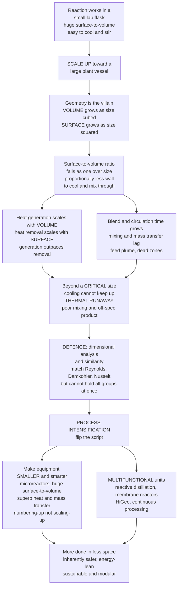

# 🏭 Scale-Up and Process Intensification

> [!abstract] TL;DR
> A reaction that runs beautifully in a **lab flask** can fail spectacularly in a **50,000-litre tank**, and the villain is **geometry**. When you make a vessel bigger, its **volume** — where heat is generated, where the reaction happens, where fluid is held — grows as the **cube** of size ($\propto L^3$), but its **surface** — through which you *remove* heat, transfer mass, and impose mixing — grows only as the **square** ($\propto L^2$). So the **surface-to-volume ratio falls as $1/L$**: a big reactor has *proportionally far less* wall to cool and stir itself through, so it can **overheat**, **mix poorly**, and even **run away** exactly where the little flask was safe. This **surface-to-volume tyranny** (a chemical-engineering face of the **square–cube law**) is why **scale-up** is treacherous — not all phenomena scale together, so a process proven at **lab → pilot → plant** rarely behaves identically. The disciplined defence is **dimensional analysis and similarity**: match the dimensionless groups (**Reynolds**, **Damköhler**, **Nusselt**, **power number**) across scales — but you **cannot hold all of them constant at once** (the **scale-up dilemma**), so you pick the *controlling* criterion (constant **power-per-volume**, constant **tip speed**, or constant **heat-transfer duty**) and de-risk the rest with **pilot plants, cold-flow mock-ups, and CFD**. **Process intensification** flips the whole script: instead of building ever-bigger tanks, make equipment radically **smaller and smarter** — **microreactors** and microchannel devices with *enormous* surface-to-volume (superb heat/mass transfer, inherently safer handling of violent chemistry, and easy **numbering-up** instead of scaling-up), **multifunctional** units that fuse steps (**reactive distillation**, membrane reactors, divided-wall columns), **rotating / HiGee** equipment, and **continuous processing** replacing batch. Scale-up is where lab breakthroughs live or die commercially; intensification is the field's **sustainability and safety frontier** — smaller, energy-lean, inherently-safer, continuous, modular plants — making this the forward-looking bridge to chemical engineering's future.

---

## Intuition

**Analogy:** Take a chemistry that *works* — a tidy exothermic reaction bubbling away in a **250 mL round-bottom flask** on the bench. It never overheats, it mixes with a flick of a stir bar, the yield is gorgeous. Now imagine your job is to make a thousand tonnes a year, so you "just build a bigger flask": a **50,000-litre steel tank**. The same chemistry now tries to **cook itself to death**. Why? Because when you scaled the vessel up, its **insides grew far faster than its skin**. Double the diameter and the **volume** — the amount of reacting, heat-spewing liquid — goes up **eight-fold** ($2^3$), while the **surface** — the cooling jacket, the wall you stir through — goes up only **four-fold** ($2^2$). Every doubling leaves the reactor with *proportionally half the skin* to shed its heat and impose order on its bulk. A mouse has enormous surface for its tiny volume and can never overheat; an elephant is mostly *inside* and must fight to stay cool. Your flask was a mouse; your tank is an elephant — and elephants overheat.

That single fact — **surface grows as the square, volume as the cube, so surface-to-volume falls as you get bigger** — is the tyrant behind almost every scale-up disaster: hot spots, thermal **runaway**, sluggish mixing, wrecked selectivity, off-spec product. **Process intensification** is the rebellion against the tyrant. Instead of surrendering to the big-tank penalty, you go the *other* way — make the equipment **tiny and clever**. A reactor with channels the width of a human hair has a *colossal* surface-to-volume ratio (thousands of times a stirred tank), so it strips heat away almost instantly, handles chemistry too violent to run in a bucket, and — instead of one scary big unit — you simply run **hundreds of identical little ones in parallel** ("numbering-up"). Small, in chemical engineering, is often **safer, greener, and smarter** than big.

---

## How It Works

### Core Mechanics

1. **The scale-up challenge — lab is not a small plant.** A process is proven in stages — **bench/lab** (millilitres), **pilot plant** (litres to cubic metres), then **full/production scale** (tens of cubic metres) — and it **rarely behaves identically** at each. The reason is deceptively simple: **not all phenomena scale together**. Chemistry (intrinsic kinetics, thermodynamics, equilibrium) is *size-independent* — a molecule does not know how big the tank is — but *transport* (heat removal, mixing, mass transfer) is brutally *size-dependent*. Grow the vessel and the chemistry stays put while the transport collapses, so the *balance* between them shifts and the outcome changes.

2. **The geometry that does the damage.** For any geometrically similar vessel of characteristic size $L$, **volume scales as $V \propto L^3$** and **surface area as $A \propto L^2$**, so the **surface-to-volume ratio falls**:
   $$\frac{A}{V} \propto \frac{L^2}{L^3} = \frac{1}{L}.$$
   For a sphere exactly $A/V = 6/L$ (with $L$ the diameter). Volume is *where things happen* — reaction rate, **heat generation** ($\dot{Q}_{gen}\propto V$), holdup, inventory. Surface is *how you intervene* — **heat removal** through the jacket ($\dot{Q}_{rem}\propto A$), mass transfer across walls, and the reach of mixing. As $L$ grows, the *doer* (volume) outgrows the *controller* (surface). This is the chemical-engineering incarnation of the **square–cube law**.

3. **The three transport penalties of bigness.** Everything you rely on to keep a reactor tame degrades with scale:
   - **Heat removal.** Generation grows as $L^3$, cooling area only as $L^2$, so the *volumetric* cooling capacity $\dot Q_{rem}/V \propto (A/V) \propto 1/L$ **falls with size**. Beyond a **critical size** the jacket can no longer carry away the heat the bulk produces — the reactor **overheats, forms hot spots, and can thermally run away** (a self-accelerating feedback: hotter → faster reaction → more heat → hotter). A flask that self-cools trivially becomes a bomb at tank scale.
   - **Mixing / blend time.** The time to homogenise a stirred tank grows with size (roughly with the circulation time), so at plant scale a **feed plume** can react locally before it disperses, creating concentration and temperature non-uniformity that **alters selectivity** and spawns by-products. Lab "instant" mixing becomes plant "slow" mixing.
   - **Mass transfer.** Interfacial area per volume (bubbles, drops, catalyst) generally *drops* with scale, so gas–liquid and liquid–liquid processes become **transport-limited** at scale even when they were kinetics-limited in the lab.

4. **The scale-up strategy — dimensional analysis and similarity.** The rigorous defence is to make the small and large units **similar** in the right dimensionless sense (the same logic that produces every transport correlation — see [[Dimensional_Analysis_and_Similarity]]):
   - **Geometric similarity** — same shape, all lengths in the same ratio.
   - **Kinematic similarity** — similar velocity/flow patterns.
   - **Dynamic similarity** — matching the **dimensionless groups** that govern the physics: **Reynolds** $Re$ (flow regime / turbulence), **Damköhler** $Da = k\bar t$ (reaction vs residence/transport time), **Nusselt** $Nu$ (convective heat transfer), the **Power number** $N_p = P/(\rho N^3 D^5)$ (impeller power draw), and companions ($Pe$, $Fr$, $We$).
   The **catch — the scale-up dilemma:** with a fixed geometry you have too few free variables to hold *all* the groups constant simultaneously. Classic example for a stirred tank (turbulent, $P = N_p\rho N^3 D^5$): if you **hold power-per-volume $P/V$ constant** (good for micromixing and gas dispersion), the **impeller tip speed $v_{tip}=\pi N D$ rises** as $L^{1/3}$ (bad for shear-sensitive cells/crystals); if you **hold tip speed constant**, then $P/V$ *falls* as $1/L$ (starving the mixing). You **must choose the controlling criterion** — constant $P/V$, constant tip speed, constant blend time, or constant heat-transfer coefficient — based on which phenomenon governs *your* process, and knowingly let the others drift.
   $$\text{const }P/V \Rightarrow v_{tip}\propto R^{1/3}, \qquad \text{const }v_{tip} \Rightarrow P/V \propto R^{-1}, \qquad R=\tfrac{L_2}{L_1}.$$

5. **De-risking the jump.** Because no single criterion is perfect, engineers **buy information before steel**: **pilot plants** and **demonstration units** at intermediate scale to expose scale-dependent failures; **cold-flow mock-ups** (water/air rigs) to study mixing and dispersion cheaply; and **CFD** to simulate the full 3-D velocity, temperature, and concentration fields the lumped correlations miss. Crucially, **residence-time distribution and non-ideal mixing worsen with scale** — channeling, dead zones, and feed-plume segregation that were invisible in the lab appear at plant scale (this is exactly where *Non_Ideal_Reactors_and_RTD* earns its keep), so RTD/tracer and CFD mixing studies precede commissioning.

6. **Process intensification — the counter-movement.** Rather than *fighting* the surface-to-volume penalty by scaling up, **intensification abolishes it** by making equipment dramatically **smaller, more efficient, and multifunctional** so the *same or greater* production happens in a fraction of the volume:
   - **Microreactors and microchannel devices.** Channels of $10$–$1000\,\mu\text{m}$ give **surface-to-volume ratios of $10^3$–$5\times10^4\ \text{m}^2/\text{m}^3$** (versus a few $\text{m}^2/\text{m}^3$ for a stirred tank) and heat-transfer coefficients an order of magnitude higher, so heat is removed **almost instantly**, dangerous exotherms and unstable intermediates are handled safely (small inventory = small hazard), and **scale-out / numbering-up** — running many identical units in parallel — sidesteps scale-up uncertainty entirely because *each unit is still lab-scale*.
   - **Multifunctional / combined units.** Fuse operations that were separate vessels: **reactive distillation** (react and separate in one column, shifting equilibrium by removing product — used industrially for methyl acetate, MTBE), **reactive extraction**, **membrane reactors** (remove a product like H₂ to push conversion past equilibrium), and **divided-wall columns** (two separations in one shell, big energy savings).
   - **Rotating / HiGee equipment.** Rotating packed beds use **high gravity** (centrifugal fields) to intensify mass transfer, shrinking absorbers by orders of magnitude.
   - **Continuous processing replacing batch.** Steady-state continuous operation (especially in **pharma's move to continuous manufacturing**) gives tighter control, smaller footprint, and consistent quality versus large stirred batch reactors.

7. **Why it matters.** Scale-up is the **commercial gate**: a huge fraction of promising lab and pilot chemistries **die in scale-up** because the surface-to-volume tyranny, mixing failure, or an unfavourable similarity trade-off makes the plant-scale process unsafe, unselective, or uneconomic. Mastering **similarity criteria and the S/V argument** is therefore essential to bringing chemistry to market. And **process intensification is a defining sustainability and safety frontier** — inherently-safer (tiny inventories), energy-efficient (less to heat, mix, and pump), lower-footprint, **modular and distributed** manufacturing — making it the forward-looking bridge to the future of the discipline.

### Flow / Architecture



---

## Key Concepts

### Secondary Level

- **A bigger version of the same thing is not just "more" — it behaves differently.** A reaction that is calm and safe in a small flask can overheat badly in a giant tank, even though it is *exactly the same chemistry*. The size itself changes the behaviour.
- **Insides grow faster than skin.** Make a vessel twice as wide and it holds **eight times** as much stuff, but it only has **four times** as much surface. The bigger it gets, the *less skin it has for its size* — and skin is how it cools down and gets stirred.
- **That is why big reactors overheat.** All the heat is made **inside** (the volume), but it can only escape through the **outside** (the surface). Because a big reactor has proportionally too little outside, the heat can build up faster than it leaves — and the reaction can **run away**.
- **The clever fix: go small, not big.** Instead of one enormous tank, engineers can use **tiny reactors with channels as thin as a hair**. These have *huge* surface for their size, so heat escapes instantly and even dangerous reactions become safe. To make more product, you just run **many little ones side by side** instead of one scary big one.
- **Why it matters.** Lots of great discoveries work in the lab but **fail when a company tries to build a full-size plant** — understanding the size problem is how engineers get chemistry out of the beaker and into the world, more safely and with less waste.

### Undergraduate Level

- **The square–cube law in reactors.** For geometrically similar vessels of size $L$: $V\propto L^3$, $A\propto L^2$, so $A/V\propto 1/L$ (a sphere: $A/V=6/L$). Heat generation $\dot Q_{gen}\propto V$; heat removal $\dot Q_{rem}=UA\,\Delta T\propto A$. The **volumetric cooling capacity** $\dot Q_{rem}/V = U\,\Delta T\,(A/V)\propto 1/L$ **falls with scale** — the root cause of scale-up heat problems.
- **The critical size for runaway.** Setting $\dot Q_{gen}=\dot Q_{rem}$ with $\dot Q_{gen}=\dot q_v V$ (volumetric heat release $\dot q_v$) gives, for a sphere, a **critical diameter** $L^\* = 6\,U\,\Delta T/\dot q_v$. For $L>L^\*$ the jacket cannot remove the generated heat and the reactor is prone to **thermal runaway** — a scale-dependent stability limit invisible in a small flask.
- **Similarity types.** **Geometric** (shape/length ratios), **kinematic** (velocity fields), **dynamic** (force/flux ratios via dimensionless groups). True similarity needs all three; scale-up approximates it.
- **The governing dimensionless groups.** $Re=\rho vL/\mu$ (regime), $Da=k\bar t$ (reaction vs residence time), $Nu=hL/k$ (heat transfer), power number $N_p=P/(\rho N^3 D^5)$, plus $Pe$, $Fr$, $We$. Matching these across scales is the definition of dynamic similarity.
- **The scale-up dilemma.** With fixed geometry you cannot hold every group constant at once. For a turbulent stirred tank ($P=N_p\rho N^3D^5$, $V\propto D^3$): **constant $P/V$** forces tip speed $v_{tip}=\pi ND\propto D^{1/3}$ to *rise*; **constant $v_{tip}$** forces $P/V\propto 1/D$ to *fall*; **constant blend time** demands constant $N$ (impossible power). You must pick the criterion matching the rate-controlling phenomenon.
- **Choosing the controlling criterion.** Micromixing/gas dispersion → constant $P/V$; shear-sensitive systems (cells, crystals, flocs) → constant tip speed; heat-transfer-limited → constant $UA/V$ or constant film coefficient; blend-time-limited → constant $N$ (rarely feasible). The choice *is* the engineering judgement of scale-up.
- **Process intensification metrics.** Compare equipment by **surface-to-volume ratio** ($\text{m}^2/\text{m}^3$) and **volumetric heat-removal / mass-transfer capacity**. Microchannels reach $A/V\sim10^3$–$10^4\ \text{m}^2/\text{m}^3$ vs a few for tanks — the quantitative case for going small.

### Graduate Level

- **Non-ideal (partial) similarity and the scale-up "compromise."** Because complete dynamic similarity is generally unattainable (e.g. you cannot match $Re$ *and* $Fr$ *and* $We$ simultaneously without changing fluids), scale-up rests on **partial similarity**: identify the *dominant* dimensionless group, hold it invariant, and correct the others by theory or supplementary experiments. Zlokarnik's framework formalises this — establish the complete **pi-set** of the process, determine which pi-numbers are essential, and recognise when a **material-system-dependent** pi-space (e.g. non-Newtonian rheology, temperature-dependent properties) breaks classical scale-up and forces model experiments in the *actual* material.
- **Thermal runaway and parametric sensitivity.** The falling volumetric cooling capacity converts scale-up into a **stability problem**: the steady-state heat-balance (Semenov / van Heerden analysis) can lose its low-temperature stable node through a **saddle-node bifurcation** as size (or feed concentration, or coolant temperature) crosses a critical value — the reactor "ignites" onto a high-temperature branch. This is literally a **tipping point** (see [[Bifurcations_and_Tipping_Points]]): near the boundary the response is **parametrically sensitive**, so a small scale-up error produces a large, discontinuous change in maximum temperature. Runaway is not a big version of a small hot spot; it is a *qualitatively different* dynamical regime.
- **Mixing scale-up and the multi-scale problem.** Turbulent mixing spans **macromixing** (bulk circulation, blend time $\theta_{blend}\propto$ tank turnovers), **mesomixing** (feed-plume dispersion), and **micromixing** (engulfment at the Kolmogorov/Batchelor scale, time $\propto(\nu/\varepsilon)^{1/2}$). These scales respond *differently* to size, so a single mixing criterion cannot preserve all three — fast, mixing-sensitive reactions (competitive-consecutive, precipitation) can shift selectivity and particle-size distribution on scale-up even at "constant $P/V$." CFD with micromixing models (e.g. engulfment or PDF methods) is used to resolve what lumped criteria cannot.
- **Numbering-up vs scaling-up, and its own failure modes.** Microreactor **scale-out** preserves the intensified transport by replication, but introduces **flow-distribution (maldistribution)** problems: identical channels in parallel must receive identical flow, so manifold design, fouling, and fabrication tolerance become the new bottlenecks. The engineering shifts from *transport* uncertainty to *equipartition* and *manufacturing* uncertainty — a different, often more tractable, problem.
- **Multifunctional unit operations and the reaction–separation synergy.** Combining functions is not merely compact; it can **change the achievable outcome**. Reactive distillation continuously removes a product, pushing an **equilibrium-limited** reaction past its stand-alone conversion (Le Chatelier in a column); membrane reactors do the same by selective permeation; but coupling creates a **design space with strong interactions** (reaction and separation must overlap in temperature, pressure, and composition windows, and can produce reactive azeotropes and multiple steady states) — powerful, but far harder to design and control than sequential units.
- **Intensification, inherent safety, and the sustainability calculus.** The intensification thesis — *smaller is safer and greener* — has a rigorous basis: hazard scales with **inventory**, so a microreactor holding grams of a violent intermediate is inherently safer than a tonne-scale batch (Kletz's inherent-safety principle: "what you don't have can't leak"). Energy and utility demand fall with volume and with process integration (divided-wall columns, HiGee). The frontier is **modular, distributed, on-demand** production (numbered-up skids) replacing monolithic world-scale plants — trading economy-of-scale for economy-of-*replication*, flexibility, and safety.
- **Self-similarity vs engineering similarity.** Both scale-up similarity and geometric **self-similarity** (see [[Fractals_and_Self_Similarity]]) ask *how do properties transform under a change of scale?* — but with opposite aims: fractals seek quantities that are *scale-invariant* (power-law scaling exponents), while scale-up confronts the quantities ($A/V$, blend time, $Da$) that are emphatically *not* invariant. Recognising which process metrics obey clean power-law scaling (and which do not) is the analytical heart of both fields.

---

## Python Demo

```python
# SCALE-UP and PROCESS INTENSIFICATION -- the surface-to-volume tyranny
# --------------------------------------------------------------------
#   (A) SURFACE-TO-VOLUME falls as ~1/L as a reactor grows (log-log).
#   (B) HEAT GENERATION (per volume, constant) vs HEAT-REMOVAL CAPACITY
#       (per volume, ~ 1/L): they cross at a CRITICAL SIZE beyond which
#       the jacket cannot keep up -> THERMAL RUNAWAY region.
#   (C) THE SCALE-UP DILEMMA: for a stirred tank you cannot hold every
#       dimensionless group constant at once -- hold power-per-volume
#       and tip speed drifts up (as R^1/3); hold tip speed and
#       power-per-volume drifts down (as 1/R).
#   (D) PROCESS INTENSIFICATION: a microreactor's surface-to-volume and
#       volumetric heat-removal capacity dwarf a big batch tank's.
#
# Requires: numpy, matplotlib   (no scipy)
import numpy as np
import matplotlib.pyplot as plt

# ------------------------------------------------------------------
# shared physical parameters (sphere-equivalent: A/V = 6/L)
# ------------------------------------------------------------------
U   = 250.0     # W/(m^2 K)  overall jacket heat-transfer coefficient
dT  = 50.0      # K          coolant-to-reaction driving force
qv  = 5.0e4     # W/m^3      volumetric heat-release rate of the reaction

L = np.logspace(-4, 1.0, 500)      # characteristic size 0.1 mm .. 10 m
SV = 6.0 / L                        # surface-to-volume ratio [m^2/m^3]

# landmark vessels: (label, diameter L in m)
marks = [("microchannel\n0.5 mm", 5.0e-4),
         ("lab flask\n5 cm",      5.0e-2),
         ("pilot\n0.5 m",         0.5),
         ("plant tank\n2 m",      2.0)]

# ------------------------------------------------------------------
# (B) critical size for runaway:  qv  =  U*dT*(6/L)  ->  L* = 6 U dT / qv
# ------------------------------------------------------------------
q_rem_vol = U * dT * (6.0 / L)      # volumetric heat-removal capacity [W/m^3]
L_star = 6.0 * U * dT / qv          # critical size where removal = generation
print("=== (A/B) surface-to-volume and the runaway threshold ===")
print(f"  reaction heat release        qv     = {qv:8.0f} W/m^3")
print(f"  critical size for runaway    L*     = {L_star:6.2f} m")
print(f"  (vessels larger than ~{L_star:.1f} m cannot be jacket-cooled alone)")
for name, Lm in marks:
    print(f"    {name.splitlines()[0]:<14s} L={Lm:8.4g} m  ->  A/V = {6/Lm:10.1f} m^2/m^3")

# ------------------------------------------------------------------
# (C) scale-up dilemma:  turbulent stirred tank, P = Np rho N^3 D^5
#     R = scale ratio D2/D1.
#       hold P/V const  -> tip speed  ~ R^(1/3)      (rises)
#       hold tip const  -> P/V        ~ R^(-1)       (falls)
# ------------------------------------------------------------------
R = np.logspace(0, 2, 200)          # scale ratio 1 .. 100
tip_if_constPV = R**(1.0/3.0)       # relative tip speed, holding P/V
PV_if_constTip = R**(-1.0)          # relative P/V, holding tip speed
print("\n=== (C) scale-up dilemma at scale ratio R = 100 ===")
print(f"  hold power/volume constant -> tip speed rises x{tip_if_constPV[-1]:5.2f}")
print(f"  hold tip speed constant    -> power/volume falls x{PV_if_constTip[-1]:.3f}")
print("  => you cannot hold both; choose the controlling criterion")

# ------------------------------------------------------------------
# (D) intensification: three systems compared
# ------------------------------------------------------------------
systems = ["batch\ntank\n(2 m)", "pilot\nreactor\n(0.5 m)", "micro-\nreactor\n(0.5 mm)"]
Lsys    = np.array([2.0, 0.5, 5.0e-4])
Usys    = np.array([300.0, 500.0, 15000.0])     # W/(m^2 K), micro >> tank
SVsys   = 6.0 / Lsys                             # m^2/m^3
qrem_sys = Usys * dT * SVsys                      # volumetric removal capacity W/m^3
print("\n=== (D) intensification: volumetric heat-removal capacity ===")
for s, sv, qr in zip(systems, SVsys, qrem_sys):
    print(f"    {s.splitlines()[0]:<8s} A/V={sv:9.1f} m^2/m^3   q_rem={qr:10.3g} W/m^3")
print(f"  microreactor removes heat ~{qrem_sys[2]/qrem_sys[0]:.0f}x faster per unit volume "
      f"than the tank")

# ============================ PLOTS ============================
fig, ax = plt.subplots(2, 2, figsize=(13.5, 10))
fig.suptitle("Scale-Up & Process Intensification: the surface-to-volume tyranny",
             fontsize=15, fontweight="bold")

# --- A: surface-to-volume vs size ---
axA = ax[0, 0]
axA.loglog(L, SV, color="#1f77b4", lw=2.8)
axA.loglog(L, SV, color="#1f77b4", lw=0)  # keep autoscale
for name, Lm in marks:
    axA.scatter([Lm], [6/Lm], color="#d62728", zorder=5, s=45)
    axA.annotate(name, xy=(Lm, 6/Lm), xytext=(Lm*1.4, 6/Lm*3.0),
                 fontsize=7.5, arrowprops=dict(arrowstyle="->", color="gray"))
axA.set_xlabel("characteristic size  L  [m]")
axA.set_ylabel("surface-to-volume  A/V  [m^2/m^3]")
axA.set_title("A. Surface-to-volume falls as 1/L\n(slope -1): big reactors have too little skin")
axA.grid(which="both", alpha=0.3)

# --- B: heat generation vs removal (per volume) ---
axB = ax[0, 1]
axB.loglog(L, np.full_like(L, qv), color="#d62728", lw=2.8,
           label="heat GENERATION / volume (const)")
axB.loglog(L, q_rem_vol, color="#2ca02c", lw=2.8,
           label="heat REMOVAL capacity / volume ~ 1/L")
axB.axvline(L_star, ls="--", color="k", lw=1.4)
runaway = L >= L_star
axB.fill_between(L, qv, q_rem_vol, where=runaway, color="#d62728", alpha=0.15)
axB.annotate(f"critical size L* = {L_star:.1f} m\nbeyond here cooling loses\n-> THERMAL RUNAWAY",
             xy=(L_star, qv), xytext=(L_star*1.3, qv*6),
             fontsize=8, arrowprops=dict(arrowstyle="->", color="gray"))
axB.set_xlabel("characteristic size  L  [m]")
axB.set_ylabel("volumetric heat rate  [W/m^3]")
axB.set_title("B. Generation (volume) outpaces removal (surface):\ncooling fails past a critical size")
axB.legend(fontsize=8, loc="lower left"); axB.grid(which="both", alpha=0.3)

# --- C: scale-up dilemma ---
axC = ax[1, 0]
axC.loglog(R, tip_if_constPV, color="#ff7f0e", lw=2.8,
           label="hold P/V const -> tip speed ~ R^(1/3)  (rises)")
axC.loglog(R, PV_if_constTip, color="#1f77b4", lw=2.8,
           label="hold tip const -> P/V ~ 1/R  (falls)")
axC.axhline(1.0, ls=":", color="k", lw=1.2)
axC.text(1.3, 1.12, "the group you CHOOSE to hold = 1.0", fontsize=7.5, color="gray")
axC.set_xlabel("scale ratio  R = D_large / D_small")
axC.set_ylabel("relative value of the OTHER group")
axC.set_title("C. The scale-up dilemma: hold one dimensionless\ngroup fixed and the others drift")
axC.legend(fontsize=7.6, loc="center left"); axC.grid(which="both", alpha=0.3)

# --- D: intensification bar chart ---
axD = ax[1, 1]
x = np.arange(len(systems))
colors = ["#8c564b", "#ff7f0e", "#2ca02c"]
bars = axD.bar(x, qrem_sys, color=colors, log=True, width=0.6, edgecolor="k")
axD.set_yscale("log")
axD.set_xticks(x); axD.set_xticklabels(systems, fontsize=8)
axD.set_ylabel("volumetric heat-removal capacity  [W/m^3]")
axD.set_title("D. Process intensification: the microreactor's\nremoval capacity dwarfs the batch tank")
for xi, sv, qr in zip(x, SVsys, qrem_sys):
    axD.text(xi, qr*1.6, f"A/V=\n{sv:,.0f}", ha="center", fontsize=7.5)
axD.set_ylim(1e4, 1e11)
axD.grid(which="both", axis="y", alpha=0.3)

plt.tight_layout(rect=[0, 0, 1, 0.95])
plt.show()
```

Running this prints the critical runaway size and the intensification comparison, then draws four panels. Panel **A** is the tyrant in one line: plotted log-log, the **surface-to-volume ratio is a straight line of slope $-1$** ($A/V = 6/L$), so a hair-width microchannel sits near $10^4\ \text{m}^2/\text{m}^3$ while a 2 m plant tank languishes at $3$ — four orders of magnitude less skin per unit of reacting bulk. Panel **B** turns that into danger: the **heat generation per volume is flat** (chemistry does not care about size) while the **removal capacity per volume falls as $1/L$**, so the two curves **cross at a critical diameter $L^\*\approx1.5$ m**; beyond it (shaded) the jacket cannot carry the generated heat and the reactor is prone to **thermal runaway** — a stability limit that simply does not exist at flask scale. Panel **C** is the **scale-up dilemma**: as the scale ratio grows, *choosing* to hold power-per-volume constant makes the **tip speed climb** ($\propto R^{1/3}$), while *choosing* to hold tip speed constant makes **power-per-volume collapse** ($\propto 1/R$) — you can pin one dimensionless group, never all of them. Panel **D** is the intensification punchline: on a log axis, the **microreactor's volumetric heat-removal capacity towers roughly five orders of magnitude above the batch tank's**, which is exactly why intensified, numbered-up microdevices can run chemistry that would be unthinkable in a big stirred vessel.

---

## Real-World Applications

> **Example — a violently exothermic nitration run in a microreactor instead of a batch tank.** Aromatic nitrations (and diazotisations, Grignard, organometallic, and peroxide chemistries) are fast and hugely exothermic — in a large stirred **batch reactor** the heat is generated throughout the *volume* but can only leave through the *jacket surface*, so as the vessel scales the reactor flirts with the **critical-size runaway threshold**, and a mixing hiccup or cooling failure can trigger a thermal excursion, decomposition, and over-pressurisation (the mechanism behind several industrial incidents). Flow-chemistry companies instead run the same reaction in a **microreactor / microchannel plate** with $A/V \sim 10^4\ \text{m}^2/\text{m}^3$ and heat-transfer coefficients above $10^4\ \text{W/m}^2\text{K}$: the reaction heat is stripped away essentially as fast as it is produced, the **inventory in the hot zone is grams not tonnes** (inherently safer), residence time and temperature are controlled to the second for razor-sharp selectivity, and production is raised by **numbering-up** identical channels rather than gambling on scale-up. This is process intensification's flagship win — safety, selectivity, and scalability from the *same* surface-to-volume physics that makes big reactors dangerous.

- **Bulk-chemical scale-up via similarity.** Petrochemical and commodity processes (crackers, hydrotreaters, polymerisation, fermentation) are scaled from lab through pilot to world-scale plants using **dimensional analysis and partial similarity** — holding the controlling group (constant $P/V$ for gas-liquid dispersion, constant superficial velocity for packed/fluidised beds, constant tip speed for shear-sensitive fermentation broths) and de-risking the rest with pilot data and CFD. Getting the criterion wrong is a classic cause of a plant that never meets its design yield.
- **Reactive distillation (multifunctional intensification).** Eastman's **methyl acetate** process famously replaced a reactor-plus-eight-distillation-column train with a **single reactive-distillation column**, and **MTBE / ETBE** and various esterifications use the same reaction-plus-separation fusion to push equilibrium-limited reactions to high conversion while slashing capital and energy — the textbook industrial proof that combining unit operations changes the achievable economics.
- **Divided-wall and heat-integrated columns.** Placing a vertical partition inside one distillation shell performs two separations in one column, cutting energy use and footprint by up to ~30 percent — now standard practice (BASF, Linde, and others operate dozens) and a mainstream intensification of the field's most energy-hungry unit operation.
- **Continuous pharmaceutical manufacturing.** Regulators (FDA) actively encourage the shift from large **batch** to **continuous** API and drug-product manufacturing (continuous reactors, twin-screw granulation, flow synthesis) precisely because smaller, steadier, intensified equipment gives tighter quality control, smaller footprint, faster response, and improved safety — a live, decades-long scale-up-versus-intensification transformation of an entire industry.
- **HiGee / rotating packed beds.** Rotating packed beds (high-gravity absorbers/strippers, commercialised by Dow and used in deaeration, nanoparticle precipitation, and CO₂ capture) intensify gas-liquid mass transfer so a unit **tens of times smaller** than a conventional packed tower does the same duty — surface-to-volume intensification driven by centrifugal, not gravitational, fields.

---

## Common Pitfalls

- **"Just build a bigger flask."** Assuming a lab or pilot result transfers unchanged to full scale is the cardinal sin. Because $A/V\propto1/L$, heat removal and mixing degrade with size, so a process that was calm and selective at bench scale can overheat, mix poorly, and lose yield at plant scale. Every scale-up must be *engineered*, not merely *enlarged*.
- **Trying to hold every dimensionless group constant.** The **scale-up dilemma** is fundamental: with fixed geometry you have too few knobs to keep $Re$, $P/V$, tip speed, blend time, and heat-transfer duty all invariant. Insisting on total similarity is impossible; failing to *consciously choose* the controlling criterion means you end up holding the *wrong* one constant and letting the rate-limiting phenomenon drift.
- **Ignoring the volumetric heat balance until it is steel.** The runaway threshold $L^\*=6U\Delta T/\dot q_v$ should be checked *early*. Reactors designed for throughput without confirming the jacket (or added internal coils, or a switch to intensified equipment) can remove the *scaled* heat load will approach a thermal-stability cliff — a saddle-node **tipping point**, not a gentle warming.
- **Forgetting that mixing and RTD get worse with scale.** Blend and circulation times grow with size, so feed-plume segregation, channeling, and dead zones appear at plant scale even when the lab reactor looked ideal. Fast, mixing-sensitive reactions (precipitations, competitive-consecutive networks) can shift selectivity and particle size on scale-up; measure the RTD / run CFD before commissioning rather than blaming the catalyst afterwards.
- **Treating "numbering-up" as free.** Microreactor scale-out preserves the transport advantage only if every parallel channel receives identical flow. **Flow maldistribution**, fouling, and fabrication tolerances become the new failure modes; a poorly designed manifold silently defeats the intensification.
- **Over-coupling multifunctional units without respecting the interactions.** Reactive distillation and membrane reactors are powerful but couple reaction and separation into one interacting design space — reactive azeotropes, multiple steady states, and overlapping temperature/pressure/composition windows make them **harder to design and control** than sequential units. Fuse functions deliberately, with the interaction analysis done, not casually.
- **Assuming intensification is always the answer.** Microreactors and HiGee shine for fast, hazardous, transport-limited, or high-value chemistry; they are *not* automatically better for slow reactions, heavy solids/fouling duty, or ultra-high-tonnage commodities where economy-of-scale in one large vessel still wins. Match the tool (scale-up a big unit vs number-up small ones) to the chemistry and economics.

---

## Related Concepts

**Sibling notes in this section and vault (Chemical Engineering)** — this note is the *bridge from principles to plant*, so it draws every earlier topic together. *Non_Ideal_Reactors_and_RTD* is the diagnostic that exposes the channeling, dead zones, and feed-plume segregation which *appear on scale-up* — its warning that "blend time grows faster than reaction time as vessels scale" is the mixing half of the tyranny developed here. *Ideal_Reactors_Batch_CSTR_PFR* and the reactor-design-and-multiple-reactions material supply the conversion, selectivity, and reactor-sizing that non-ideal scale-up degrades and that intensified continuous reactors aim to protect. *Convective_Transport_and_Correlations* provides the very $Nu = C\,Re^{m}Pr^{n}$ similarity machinery — dimensionless heat/mass-transfer correlations — that makes bench data transferable to full scale, and that quantifies the microreactor's superior transfer coefficients. The separation notes (Distillation, and the separation-processes material such as *Liquid_Liquid_Extraction* and *Separation_Processes_Overview*) are where *reactive distillation* and *divided-wall columns* intensify the field's most energy-hungry operations. And *The_Reach_and_Future_of_Chemical_Engineering* is the natural next step: process intensification — smaller, safer, greener, modular, continuous plants — *is* a central thread of that future.

**Fluid Dynamics vault — the similarity engine of scale-up**
- [[Dimensional_Analysis_and_Similarity]] — the Buckingham-Pi and geometric/kinematic/dynamic-similarity framework that *is* the rigorous basis of scale-up; matching $Re$, $Da$, $Nu$, and the power number across scales (and confronting the impossibility of matching all at once) comes straight from here

**Mechanical Engineering vault — the fabrication of intensified devices**
- [[MEMS_and_Microengineering]] — the microfabrication and microfluidics that physically *make* the microreactors and microchannel plates whose enormous surface-to-volume ratios enable process intensification and numbering-up

**Systems Thinking & Complexity vault — the dynamics and scaling of it**
- [[Bifurcations_and_Tipping_Points]] — thermal runaway on scale-up is a saddle-node bifurcation: past the critical size the cool, stable steady state vanishes and the reactor "ignites" onto a hot branch — a genuine tipping point, not a gradual warming
- [[Fractals_and_Self_Similarity]] — the sister question "how do properties transform under a change of scale?"; scale-up wrestles with the metrics ($A/V$, blend time) that are *not* scale-invariant, the mirror image of fractal self-similarity's search for scale-invariant power laws

---

## Review Questions

**Secondary**
1. A student runs a reaction in a small flask and it stays cool and safe. The company then builds a giant tank to run the *exact same reaction* and it overheats badly. Using the idea that "insides grow faster than skin," explain in plain words why the big tank overheats when the small flask did not — and describe one clever way engineers avoid the problem by making equipment *smaller* instead of bigger.

**Undergraduate**
2. A spherical reactor releases heat at a volumetric rate $\dot q_v = 5\times10^4\ \text{W/m}^3$ and is cooled through its wall with $U = 250\ \text{W/m}^2\text{K}$ and a driving force $\Delta T = 50\ \text{K}$. (a) Write the surface-to-volume ratio $A/V$ for a sphere of diameter $L$ and explain why the *volumetric* cooling capacity scales as $1/L$. (b) Derive the critical diameter $L^\*$ at which heat removal just balances generation, and compute it. (c) For a stirred tank being scaled up by a factor $R=10$ in diameter, show how the impeller tip speed changes if you hold **power-per-volume** constant, and how power-per-volume changes if you instead hold **tip speed** constant — and state what this "scale-up dilemma" forces the engineer to do.

**Graduate**
3. A fast, exothermic, mixing-sensitive reaction gives excellent selectivity in a 1 L lab reactor but degrades on scale-up to a 10 m³ vessel, and pushing coolant harder risks a runaway. (a) Explain, using the volumetric heat balance and a Semenov/van-Heerden-style stability argument, why the runaway risk is a *scale-dependent bifurcation* rather than a bigger version of a lab hot spot. (b) The selectivity loss persists even at "constant $P/V$" — explain using the macro/meso/micromixing hierarchy why a single mixing criterion cannot preserve selectivity across scales. (c) Propose an intensified alternative (e.g. a numbered-up microreactor or a reactive-distillation configuration), state quantitatively (via $A/V$ and heat-transfer coefficient) why it defuses the heat problem, and identify the *new* failure mode your chosen intensification introduces.

---

## Sources

- M. Zlokarnik — *Scale-Up in Chemical Engineering*, 2nd ed. (Wiley-VCH, 2006) — the definitive treatment of dimensional analysis, the pi-space method, partial similarity, and the scale-up dilemma
- A. Stankiewicz & J. A. Moulijn (eds.) — *Re-Engineering the Chemical Processing Plant: Process Intensification* (Marcel Dekker, 2004) — the foundational reference on microreactors, multifunctional reactors, and intensified equipment
- J.-P. Euzen, P. Trambouze & J.-P. Wauquier — *Scale-Up Methodology for Chemical Processes* (Editions Technip, 1993) — practical, industry-oriented methodology for taking processes from lab to plant
- D. W. Green & M. Z. Southard (eds.) — *Perry's Chemical Engineers' Handbook*, 9th ed. (McGraw-Hill, 2018) — reference data and correlations for reactors, mixing, heat transfer, and scale-up practice
- E. B. Nauman — *Chemical Reactor Design, Optimization, and Scaleup*, 2nd ed. (Wiley, 2008) — reactor-focused scale-up including mixing, heat removal, and non-ideal-flow effects

---

#chemical-engineering #scale-up #process-intensification #microreactors #surface-to-volume
