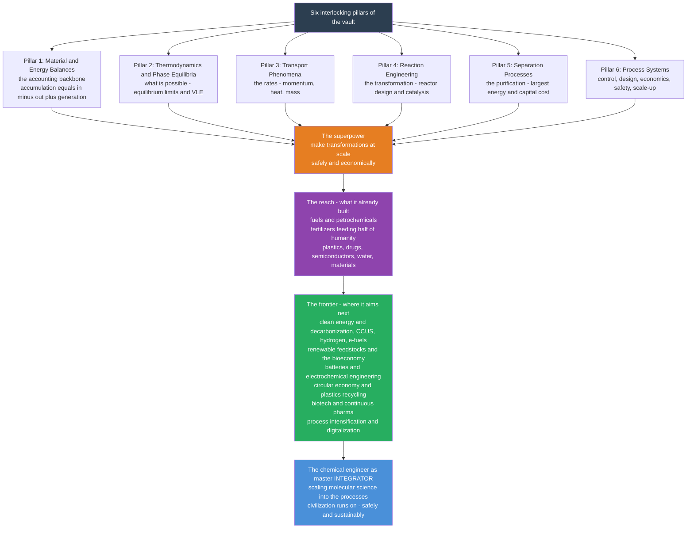

# 🌍 The Reach and Future of Chemical Engineering

> [!abstract] TL;DR
> **Chemical engineering** quietly built the modern **material** world — the fuels that move us, the fertilizers that feed billions (the **Haber-Bosch** process alone sustains roughly *half of humanity*), the plastics, drugs, semiconductors, clean water, and advanced materials in almost everything we touch. It did this by mastering one **superpower**: turning any chemical, physical, or biological **transformation** into a **safe, economical process at massive scale**. This capstone zooms all the way out and ties the whole vault together, showing how its **six interlocking pillars** — **material and energy balances** (the accounting backbone), **thermodynamics and phase equilibria** (what is possible), **transport phenomena** (the rates of momentum, heat, and mass), **reaction engineering** (the transformation), **separation processes** (the purification, and the largest energy and capital cost), and **process systems** (control, design, economics, safety, and scale-up that fuse it all into a real, profitable, safe plant) — combine in *every* process at once: design a reactor, wrap it in separators, integrate the heat, control it, scale it, and you have built a plant. The **enduring core** is permanent; the **frontier** is being redrawn in real time toward **sustainability and the energy transition** — decarbonization (carbon capture, green and blue hydrogen, electrification, e-fuels), renewable feedstocks and the **bioeconomy**, **batteries** and electrochemical engineering, the circular economy and plastics recycling, biotech and continuous pharmaceutical manufacturing, **process intensification** and modular plants, and **digitalization** (AI/ML, digital twins). The honest message: chemical engineering built the fossil-fuel age and is now central to **re-engineering it** for a sustainable future. The chemical engineer remains the master **integrator** who scales molecular science into the processes civilization runs on — and demand for that scale-it-safely-and-sustainably capability is only growing.

---

## Intuition

**Analogy — chemical engineering is the invisible discipline that built the material world.** Look around and mentally delete everything a chemical engineer helped make at scale: the gasoline in the tank and the plastics of the dashboard, the nitrogen fertilizer in the soil that grew your breakfast, the medicine in the cabinet, the clean water from the tap, the silicon in your phone, the lithium in its battery. What remains is a strikingly bare, pre-industrial world. Chemistry and biology *discover* the transformations; chemical engineering is the discipline that stands up next and makes them happen **by the megaton** — safely, cheaply, and continuously. That is its one **superpower**: taking a beaker reaction and turning it into a football-field factory of pipes, reactors, columns, and pumps that never stops.

And the reason a single field can reach so far is that it deploys the **same six tools** on every problem, whatever the molecule. This note is the culmination of the vault: it recalls each thread we have pulled — from the [[Material_and_Mass_Balances|balance]] we draw around every box, through [[Chemical_Process_Thermodynamics|what is thermodynamically possible]] and [[Transport_Phenomena_Overview|how fast heat and mass move]], to [[Chemical_Reaction_Engineering_Overview|the reactor that transforms]] and [[Separation_Processes_Overview|the columns that purify]] — shows how they weave into one fabric, and casts that fabric forward. Because the same superpower that built the fossil-fuel age is now being turned, urgently, on the harder problem of **undoing its damage**: the discipline that helped endanger the climate is re-engineering itself to help save it.

---

## How It Works

### Core Mechanics

Understand chemical engineering as **six pillars converging into one activity, then reaching toward a shifting frontier**. The pillars are the sub-disciplines this vault is organized around; the convergence is that *every real process needs all six at once*; and the frontier is what happens when that "make-it-at-scale" superpower is aimed at sustainability instead of fossil fuels.

1. **Pillar 1 — Material & Energy Balances: the accounting backbone.** Draw a boundary around any unit and insist that *accumulation = in − out + generation* for every species and every joule. This one habit ([[Material_and_Mass_Balances]], [[Energy_Balances_in_Processes]]) sizes equipment, tracks reaction heat ([[Reactive_Systems_and_Combustion_Balances]]), reads a flowsheet ([[Process_Variables_and_Flowsheets]]), and closes the [[Recycle_Bypass_and_Purge|recycle loops]] that let a poor reactor anchor a near-perfect plant. Nothing else in the field is trustworthy until the balance closes.

2. **Pillar 2 — Thermodynamics & Phase Equilibria: what is possible.** Before you design anything, thermodynamics sets the limits — how far a reaction *can* convert ([[Chemical_Reaction_Equilibrium]]), when a mixture splits into vapour and liquid ([[Vapor_Liquid_Equilibrium]], [[Multicomponent_Phase_Behavior]]), and what a separation must cost. It rests on [[Chemical_Process_Thermodynamics|process thermodynamics]], the non-idealities of [[Solution_Thermodynamics_and_Activity|activity models]], and the [[Equations_of_State_and_PVT_Behavior|equations of state]] that predict real fluid behaviour.

3. **Pillar 3 — Transport Phenomena: the rates.** Thermodynamics says *whether*; transport says *how fast*. The three deeply analogous transports ([[Transport_Phenomena_Overview]]) — **momentum** ([[Momentum_Transport_and_Fluid_Flow]]), **heat** ([[Heat_Transfer_in_Process_Equipment]]), and **mass** ([[Mass_Transfer_and_Diffusion]]) — set through [[Convective_Transport_and_Correlations|convective correlations]] and [[Interphase_and_Multiphase_Transport|interphase transport]] the size of every exchanger, pipe, and separation stage.

4. **Pillar 4 — Reaction Engineering: the transformation.** The reactor is the heart of the plant. Reaction engineering ([[Chemical_Reaction_Engineering_Overview]]) marries [[Reaction_Kinetics_and_Rate_Laws|kinetics]] with reactor *type* — [[Ideal_Reactors_Batch_CSTR_PFR|batch, CSTR, and PFR]] — plus [[Catalysis_and_Heterogeneous_Reactions|catalysis]] and the [[Non_Ideal_Reactors_and_RTD|non-ideal mixing]] that real vessels always show.

5. **Pillar 5 — Separation Processes: the purification.** Reactions are never complete or clean, so the product must be pulled from a mixture ([[Separation_Processes_Overview]]). [[Distillation]] by boiling point, [[Liquid_Liquid_Extraction|extraction]] by solubility, and [[Membrane_Separations|membranes]] by permeability are typically the **largest energy and capital consumers** in a plant — which is exactly why they are a prime target for the sustainability frontier.

6. **Pillar 6 — Process Systems: running it as a whole.** A collection of good units is not yet a good plant. Process **control** keeps it on setpoint, **design and economics** decide what is worth building, **simulation** solves the whole flowsheet at once, **safety** analysis guards against the ways scale amplifies hazard, and **scale-up and process intensification** carry it from pilot to full size. This is the integrating layer — the subject of this final vault section, of which this capstone is the opening note.

**The convergence.** No real process lives in one pillar. Ammonia synthesis is a *balance* on N and H, a *thermodynamic* equilibrium limit, a *catalytic reactor*, a *heat exchanger* condensing product, a *separation*, and a high-pressure *control* loop — **all at once**. The chemical engineer's real skill is not any single pillar but the **integration** of all six into a working, profitable, safe plant.

**The frontier.** Point the "make-it-at-scale" superpower at the climate instead of at oil and the field is redrawn: **decarbonization** (carbon capture, utilization, and storage; green and blue **hydrogen**; electrification of chemical processes; e-fuels), **renewable feedstocks** and the **bioeconomy** (biofuels, bio-based chemicals, biorefineries), **batteries and energy storage** (electrochemical engineering), the **circular economy** and plastics recycling, the **food-energy-water nexus**, **biotech and pharma** (continuous manufacturing, cell and gene therapy, synthetic biology), **process intensification** and modular/distributed manufacturing, and **digitalization** (AI/ML, digital twins, data-driven design and operations).

### Flow / Architecture



---

## Key Concepts

### Secondary Level

- **The invisible discipline that built the modern world.** Fuels, fertilizer, plastics, medicines, clean water, and phone chips all come out of chemical plants that chemical engineers design. Delete their work and you are back in a pre-industrial world.
- **One superpower: doing it at scale.** Chemists discover reactions in a test tube; chemical engineers make them happen by the thousands of tons, safely and cheaply, without stopping. That change of scale is the whole job.
- **Fertilizer feeds half the planet.** The Haber-Bosch process pulls nitrogen out of the *air* and turns it into fertilizer. Roughly **half of all the people alive** are fed by food grown with it — arguably the most consequential process ever built.
- **The field is reinventing itself for the climate.** The same discipline that built the oil-and-plastics world is now leading carbon capture, clean hydrogen, batteries, recycling, and biofuels — re-engineering the material world to be sustainable.

### Undergraduate Level

- **Six pillars, one superpower.** The vault's six sections are not six topics but six *tools* that combine on every process: balances (conservation accounting), thermodynamics/phase equilibria (feasibility and limits), transport (rates), reaction engineering (the transformation), separations (purification), and process systems (control, design, economics, safety, scale-up). Any real plant = a reactor + separators + heat integration + control, sized by all six at once.
- **The recycle lesson, one more time.** A reactor converting only a fraction of its feed per pass still anchors a near-complete *overall* process once the leftovers are separated and recycled: $X_{overall} = x_{sp}/[1 - f_R(1 - x_{sp})] \to 1$ as $f_R \to 1$. This single idea from Pillar 1 is why Haber-Bosch works at ~15 % single-pass conversion — it recurs in the demo below.
- **Separations are the energy story.** Purification is often 40–70 % of a plant's energy use, and distillation alone is estimated at roughly 10–15 % of *global* energy consumption. The thermodynamic *minimum* work to unmix, $W_{min} = -RT\sum_i x_i \ln x_i$, is tiny compared to what real columns spend — so the gap between minimum and actual is where the sustainability frontier (membranes, intensification, hybrid separations) does its work.
- **Reactor choice is a size/selectivity trade.** For a positive-order reaction a **PFR** needs less volume than a **CSTR** for the same conversion, but a CSTR runs at low reactant concentration (good for selectivity or safety). The reactor-sizing curves ($\tau k = X/(1-X)$ for a first-order CSTR versus $\tau k = -\ln(1-X)$ for a PFR) are the Pillar-4 panel of the demo.
- **The frontier is electrochemistry and biology, not just chemistry.** Decarbonization pushes the field toward **electrochemical engineering** (electrolyzers, fuel cells, batteries — see the Chemistry vault's [[Electrochemistry]]) and toward **biochemical engineering** (fermentation, biorefineries, continuous pharma) — the same unit-operations toolkit applied to electrons and cells.

### Graduate Level

- **The plant as a coupled, optimized system.** Real design is not unit-by-unit but plantwide: heat integration by **pinch analysis** links every stream's energy; **process synthesis** and superstructure optimization search over flowsheets, not just parameters; and **plantwide control** keeps a network of recycles and heat loops stable. The integrating layer (Pillar 6) is where a set of locally optimal units becomes a globally viable process.
- **The enduring core versus the shifting frontier.** Conservation, thermodynamics, transport, and reaction theory are permanent — true in a century as now. What changes is the *frontier* the core is aimed at. Master the invariant six so you can absorb whatever feedstock or product civilization needs next; the discipline that scaled crude oil can scale CO₂, biomass, or lithium with the same equations.
- **Decarbonization is a separations and reaction-engineering problem.** Post-combustion CO₂ capture is [[Liquid_Liquid_Extraction|absorption/stripping]] with amines; green hydrogen is electrochemical reaction engineering plus gas separation; e-fuels and CCU are catalytic reactors (CO₂ + H₂) wrapped in separations; direct air capture is mass transfer against a dilute stream. Each is a familiar unit operation redeployed — which is why the field, not a new discipline, owns the energy transition.
- **The bioeconomy and continuous manufacturing.** Biorefineries and continuous pharmaceutical lines replace batch chemistry with steady-state processes governed by the same balances, kinetics, and separations — but with living catalysts (fermentation), dilute aqueous streams (expensive separations), and stringent purity/quality control. Synthetic biology extends the "reactor" to an engineered cell.
- **Digital twins and data-driven operations.** High-fidelity simulators (Aspen Plus, gPROMS) coupled to plant data give a **digital twin** that mirrors an asset in real time; ML surrogate models replace hours of rigorous flowsheet solves with millisecond predictions, and data-driven control and optimization tune live plants. As tools automate the routine, the scarce, growing skill remains **integration** — framing the physics, judging the model, and scaling it safely.
- **The integrator's mandate.** Every frontier (electrification, bioeconomy, circularity, DAC) is ultimately a *scale-it-safely-and-economically* problem — precisely the master skill of the chemical engineer. The demand for people who can turn molecular science into a real, profitable, sustainable plant is rising, not shrinking.

---

## Python Demo

```python
# "Chemical engineering in one figure" -- a four-panel synthesis dashboard that
# recalls the whole vault, one pillar (roughly) per panel, and casts it forward:
#
#   (a) BALANCES  -> recycle drives OVERALL conversion toward 100 percent   (Pillar 1)
#   (b) THERMO/SEP-> vapor-liquid equilibrium x-y curve, the basis of distillation (Pillars 2 & 5)
#   (c) REACTION  -> CSTR vs PFR reactor size vs conversion                  (Pillar 4)
#   (d) FUTURE    -> minimum vs actual work of SEPARATION: the energy frontier (Pillars 5 & 6)
#
# Requires: numpy, matplotlib
import numpy as np
import matplotlib.pyplot as plt

# =====================================================================
# (a) BALANCES + RECYCLE:  A -> B reactor with separator + recycle.
#     Fresh feed F pure A (F = 1); single-pass conversion x_sp; separator
#     recycles fraction f_R of unreacted A.  Overall conversion:
#         X = x_sp / (1 - f_R*(1 - x_sp))   ->  1  as f_R -> 1
# =====================================================================
fR = np.linspace(0.0, 0.98, 300)
def overall_X(x_sp, fR):
    return x_sp / (1.0 - fR * (1.0 - x_sp))

# =====================================================================
# (b) THERMODYNAMICS / SEPARATION:  binary vapor-liquid equilibrium
#     (constant relative volatility alpha):
#         y = alpha*x / (1 + (alpha - 1)*x)
#     The bulge above the 45-degree line is exactly what makes
#     distillation work -- and shrinks to nothing as alpha -> 1.
# =====================================================================
x = np.linspace(0.0, 1.0, 200)
alphas = [1.3, 2.0, 5.0]
def vle_y(x, a):
    return a * x / (1.0 + (a - 1.0) * x)

# =====================================================================
# (c) REACTION ENGINEERING:  size (Damkohler = tau*k) vs conversion X
#     for a first-order irreversible reaction A -> products.
#         CSTR:  tau*k = X / (1 - X)
#         PFR :  tau*k = -ln(1 - X)
#     PFR always needs less volume for a positive-order reaction.
# =====================================================================
X = np.linspace(0.0, 0.97, 300)
Da_cstr = X / (1.0 - X)
Da_pfr = -np.log(1.0 - X)

# =====================================================================
# (d) THE FUTURE / SUSTAINABILITY:  the separations energy frontier.
#     Thermodynamic MINIMUM work to separate an ideal binary of
#     composition x (per mole of feed, units of RT):
#         Wmin/RT = -[x ln x + (1-x) ln(1-x)]
#     Real separations run at a small second-law efficiency (eta),
#     so ACTUAL work = Wmin / eta.  The huge shaded gap is the target
#     of process intensification, membranes, and decarbonization.
# =====================================================================
xf = np.linspace(0.001, 0.999, 400)
Wmin = -(xf * np.log(xf) + (1 - xf) * np.log(1 - xf))   # in units of RT
eta = 0.12                                              # ~12 percent 2nd-law eff (distillation)
Wact = Wmin / eta

# ------------------------------ console summary ------------------------------
print("=== Chemical engineering in one figure ===")
print("(a) BALANCES  overall conversion at 90 percent recycle:")
for xsp in (0.20, 0.40, 0.60):
    print(f"      single-pass {int(xsp*100):2d} percent -> overall {overall_X(xsp,0.90)*100:5.1f} percent")
print("(b) VLE       vapor mole fraction y at liquid x = 0.5:")
for a in alphas:
    print(f"      alpha = {a:>3} -> y = {vle_y(0.5,a):.3f}")
print("(c) REACTION  reactor size (tau*k) for 90 percent conversion:")
print(f"      CSTR tau*k = {0.9/(1-0.9):.2f}   PFR tau*k = {-np.log(1-0.9):.2f}"
      f"   (CSTR is {(0.9/(1-0.9))/(-np.log(1-0.9)):.1f}x larger)")
print("(d) FUTURE    separation work at feed x = 0.1 (units of RT):")
print(f"      Wmin = {-(0.1*np.log(0.1)+0.9*np.log(0.9)):.3f}   Wactual = "
      f"{-(0.1*np.log(0.1)+0.9*np.log(0.9))/eta:.2f}   (gap = the frontier)")

# --------------------------------- plotting ---------------------------------
fig, ax = plt.subplots(2, 2, figsize=(14, 10))
fig.suptitle("Chemical Engineering in One Figure: the Vault's Six Pillars, and the Frontier",
             fontsize=15, fontweight="bold")

# (a) recycle / overall conversion
for xsp, c in zip((0.2, 0.4, 0.6), ("#d62728", "#ff7f0e", "#2ca02c")):
    ax[0, 0].plot(fR * 100, overall_X(xsp, fR) * 100, lw=2.5, color=c,
                  label=f"single-pass = {int(xsp*100)} percent")
ax[0, 0].axhline(100, ls=":", color="k", lw=1)
ax[0, 0].set_title("(a) BALANCES: recycle drives overall conversion  ->  Pillar 1")
ax[0, 0].set_xlabel("recycle fraction of unreacted feed  [percent]")
ax[0, 0].set_ylabel("overall conversion  [percent]")
ax[0, 0].set_ylim(0, 105)
ax[0, 0].legend(fontsize=8, loc="lower right"); ax[0, 0].grid(alpha=0.3)

# (b) VLE x-y diagram
ax[0, 1].plot([0, 1], [0, 1], "k--", lw=1, label="45-degree line")
for a, c in zip(alphas, ("#1f77b4", "#9467bd", "#d62728")):
    ax[0, 1].plot(x, vle_y(x, a), lw=2.5, color=c, label=f"alpha = {a}")
ax[0, 1].set_title("(b) THERMO + SEPARATION: vapor-liquid equilibrium  ->  Pillars 2 & 5")
ax[0, 1].set_xlabel("liquid mole fraction  x")
ax[0, 1].set_ylabel("vapor mole fraction  y")
ax[0, 1].legend(fontsize=8, loc="lower right"); ax[0, 1].grid(alpha=0.3)
ax[0, 1].set_xlim(0, 1); ax[0, 1].set_ylim(0, 1)

# (c) CSTR vs PFR sizing
ax[1, 0].plot(X * 100, Da_cstr, lw=2.5, color="#ff7f0e", label="CSTR:  X / (1 - X)")
ax[1, 0].plot(X * 100, Da_pfr, lw=2.5, color="#1f77b4", label="PFR:  -ln(1 - X)")
ax[1, 0].fill_between(X * 100, Da_pfr, Da_cstr, color="#ff7f0e", alpha=0.12)
ax[1, 0].text(70, 2.6, "CSTR needs\nmore volume", fontsize=8, color="#ff7f0e")
ax[1, 0].set_title("(c) REACTION: reactor size vs conversion  ->  Pillar 4")
ax[1, 0].set_xlabel("conversion X  [percent]")
ax[1, 0].set_ylabel("dimensionless size  tau * k")
ax[1, 0].set_ylim(0, 6)
ax[1, 0].legend(fontsize=8, loc="upper left"); ax[1, 0].grid(alpha=0.3)

# (d) separations energy frontier
ax[1, 1].plot(xf, Wmin, lw=2.5, color="#2ca02c", label="thermodynamic minimum  Wmin/RT")
ax[1, 1].plot(xf, Wact, lw=2.5, color="#d62728",
              label=f"actual (eta = {int(eta*100)} percent)")
ax[1, 1].fill_between(xf, Wmin, Wact, color="#d62728", alpha=0.10)
ax[1, 1].text(0.30, 3.0, "the gap =\nthe frontier\n(intensify, membranes,\ndecarbonize)",
              fontsize=8, color="#d62728")
ax[1, 1].set_title("(d) FUTURE: the separations energy frontier  ->  Pillars 5 & 6")
ax[1, 1].set_xlabel("feed mole fraction  x")
ax[1, 1].set_ylabel("work of separation  [units of RT]")
ax[1, 1].set_ylim(0, 6)
ax[1, 1].legend(fontsize=8, loc="upper right"); ax[1, 1].grid(alpha=0.3)

plt.tight_layout(rect=[0, 0, 1, 0.95])
plt.show()
```

Each panel compresses a whole section of the vault into one curve, and the four together *are* the discipline. **(a)** the recycle curve $X = x_{sp}/[1 - f_R(1-x_{sp})]$ recalls Pillar 1 — a 20–60 % single-pass reactor anchors a near-100 % plant once you recycle, the accounting trick behind Haber-Bosch. **(b)** the vapour-liquid equilibrium bulge $y = \alpha x/[1+(\alpha-1)x]$ recalls Pillars 2 and 5 — the distance above the 45° line is precisely what makes [[Distillation]] possible, and it collapses as $\alpha \to 1$ (why close-boiling mixtures are so hard). **(c)** the reactor-sizing curves recall Pillar 4 — a **PFR** ($-\ln(1-X)$) always undercuts a **CSTR** ($X/(1-X)$) in volume for a positive-order reaction, the classic size-versus-selectivity trade. **(d)** the separations-energy gap recalls the frontier — the reversible minimum $W_{min}/RT = -\sum x_i\ln x_i$ is tiny beside what real columns spend, and that enormous shaded gap is exactly what membranes, [[Membrane_Separations|hybrid separations]], process intensification, and decarbonization are racing to close. Four curves, six pillars, one figure: chemical engineering, and its future, at a glance.

---

## Real-World Applications

> **Example — the Haber-Bosch ammonia process is the whole vault in one flowsheet, and the field's future in miniature.** Nitrogen from *air* and hydrogen (today from natural gas) are compressed and fed to a catalytic **reactor** where $N_2 + 3H_2 \rightleftharpoons 2NH_3$. Thermodynamics (Pillar 2) caps single-pass conversion near 15 %, so the outlet is cooled to **condense** the ammonia (heat transfer, Pillar 3; separation, Pillar 5) and the vast unreacted stream is **recycled** (balances, Pillar 1) — pushing overall conversion toward completion. Reaction engineering and catalysis (Pillar 4) run the converter; process control (Pillar 6) holds the high-pressure loop stable. All six pillars, one machine — and it feeds **roughly half of humanity**. Now watch it point at the future: replace the natural-gas hydrogen with **green hydrogen** from renewable-powered electrolysis and the *same flowsheet* becomes **green ammonia** — a carbon-free fertilizer and a candidate hydrogen carrier and marine fuel. The discipline does not need a new toolkit for the energy transition; it re-aims the one it already has.

- **Fuels, petrochemicals, and their reinvention.** Refineries separate crude by giant [[Distillation|distillation]] columns, then crack and reform it into fuels and the feedstocks for plastics. The frontier turns the same reactors and separators toward **e-fuels**, bio-derived feedstocks, and chemical **plastics recycling** that closes the loop.
- **Decarbonization: capture, hydrogen, electrification.** Post-combustion **carbon capture** is absorption/stripping with amine solvents; **direct air capture** is mass transfer against an ultra-dilute stream; **green/blue hydrogen** is electrochemical reaction engineering plus gas separation; **e-fuels and CCU** are catalytic CO₂-plus-H₂ reactors wrapped in separations — every one a familiar unit operation redeployed against the climate.
- **Batteries and electrochemical engineering.** Lithium-ion electrode coating, electrolyte formulation, and cell manufacturing — plus the electrochemistry of fuel cells and electrolyzers ([[Electrochemistry]]) — are chemical engineering's answer to energy storage, shared with the [[The_Reach_and_Future_of_Electrical_Engineering|electrical engineering]] and [[The_Reach_and_Future_of_Mechanical_Engineering|mechanical engineering]] disciplines building the grid and the hardware.
- **Pharma and biotech.** Drug manufacture scales delicate multi-step syntheses with crystallization, [[Chromatography|chromatography]], and drying under strict purity control — moving from batch to **continuous manufacturing**, and extending to cell and gene therapy and synthetic biology, where the "reactor" is an engineered cell.
- **Water and the food-energy-water nexus.** Reverse-osmosis desalination ([[Membrane_Separations]]), wastewater treatment, and emissions scrubbing are transport and separation problems at civic scale — central to a resource-constrained, climate-stressed world (see [[Anthropogenic_Climate_Change]]).
- **Materials and semiconductors.** Chemical vapour deposition, etching, and ultra-pure gas handling underlie every microchip; polymer and advanced-materials processing underlie everything from packaging to composites.

---

## Common Pitfalls

- **"Chemical engineering is just applied chemistry."** The most common misconception. Chemistry finds the transformation; chemical engineering solves the *entirely different* problems that appear only at scale — heat removal, mixing, separation, recycle, control, economics, and safety. Most of the work happens **after** the chemistry is settled, which is why the field is defined by *scale*, not by any one reaction.
- **Treating the six pillars as separate silos.** Students learn balances, thermodynamics, transport, reactions, separations, and process systems as separate courses and imagine real plants live in one box. They never do — an ammonia loop is all six at once. Reasoning in only one pillar blinds you to the failure hiding in the others (a thermodynamically favourable reactor that runs away thermally; a high-conversion reactor whose product cannot be economically separated).
- **Forgetting that separations, not reactions, dominate the bill.** Beginners obsess over the reactor and underestimate purification, yet separations are usually the largest energy and capital cost in a plant. Mis-judging the difficulty of a close-boiling distillation or a dilute-stream recovery sinks more designs than the reaction ever does.
- **Assuming the frontier needs a new discipline.** Decarbonization, the bioeconomy, and circularity are sometimes treated as separate fields. They are not — they are the *same* unit operations (absorption, catalysis, membranes, electrochemistry, fermentation) aimed at new feedstocks and products. Dismissing the classical core as "old" leaves you unable to engineer the very future that depends on it.
- **Chasing the core without the frontier — or the frontier without the core.** Two opposite errors. Master only classical petrochemical design and you miss electrification, biotech, and digital tools now expected of the field. Chase green hydrogen or ML twins without balances, thermodynamics, and transport and you have tools you cannot sanity-check. The move is *both*: an invariant core aimed at a renewed frontier.
- **Believing scale is just "bigger."** Doubling a reactor's linear size multiplies its volume (and heat generation) eightfold but its surface area (and heat *removal*) only fourfold; mixing slows and residence-time distributions widen. Many pilot successes die at full scale for exactly this reason — scale-up and process intensification are their own science, and the reason process **safety** is a pillar, not an afterthought.

---

## Related Concepts

**The hub this capstone closes**
- [[Chemical_Engineering_Overview]] — the vault hub; the "make it at scale" superpower and the six-principle map this capstone brings full circle.

**Pillar 1 — Material & Energy Balances (Section 1)**
- [[Material_and_Mass_Balances]] — the accounting backbone: accumulation = in − out + generation.
- [[Energy_Balances_in_Processes]] — tracking every joule; heating, cooling, and reaction heat.
- [[Process_Variables_and_Flowsheets]] — the language of streams, compositions, and the flowsheet.
- [[Recycle_Bypass_and_Purge]] — the recycle loop of the demo's panel (a) and of Haber-Bosch.
- [[Reactive_Systems_and_Combustion_Balances]] — balances with reaction and the heat of reaction.

**Pillar 2 — Thermodynamics & Phase Equilibria (Section 2)**
- [[Chemical_Process_Thermodynamics]] — what is possible; the energy and feasibility limits.
- [[Equations_of_State_and_PVT_Behavior]] — predicting real-fluid PVT behaviour.
- [[Vapor_Liquid_Equilibrium]] — the x-y curve of the demo's panel (b), the basis of distillation.
- [[Solution_Thermodynamics_and_Activity]] — non-ideal mixtures and activity coefficients.
- [[Chemical_Reaction_Equilibrium]] — the equilibrium ceiling that caps single-pass conversion.
- [[Multicomponent_Phase_Behavior]] — phase behaviour of real multicomponent streams.

**Pillar 3 — Transport Phenomena (Section 3)**
- [[Transport_Phenomena_Overview]] — momentum, heat, and mass under one mathematical roof.
- [[Momentum_Transport_and_Fluid_Flow]] — flow and pressure drop that move every stream.
- [[Heat_Transfer_in_Process_Equipment]] — the rate laws that size every exchanger and jacket.
- [[Mass_Transfer_and_Diffusion]] — the diffusion rate that governs every separation.
- [[Convective_Transport_and_Correlations]] — the dimensionless correlations for real geometries.
- [[Interphase_and_Multiphase_Transport]] — transport across gas-liquid and liquid-liquid interfaces.

**Pillar 4 — Reaction Engineering (Section 4)**
- [[Chemical_Reaction_Engineering_Overview]] — designing the reactor, the heart of the plant.
- [[Reaction_Kinetics_and_Rate_Laws]] — the rate laws turned into reactor sizes.
- [[Ideal_Reactors_Batch_CSTR_PFR]] — the CSTR-vs-PFR sizing of the demo's panel (c).
- [[Catalysis_and_Heterogeneous_Reactions]] — catalysts and porous-pellet transport.
- [[Non_Ideal_Reactors_and_RTD]] — real mixing and residence-time distribution.

**Pillar 5 — Separation Processes (Section 5)**
- [[Separation_Processes_Overview]] — purification, the largest energy and capital cost.
- [[Distillation]] — separation by boiling point; the VLE panel realized as trays.
- [[Liquid_Liquid_Extraction]] — separation by solubility; also amine CO₂ capture.
- [[Membrane_Separations]] — permeability-based separation; RO desalination and the low-energy frontier.

**Sibling-discipline capstones and the science being scaled**
- [[The_Reach_and_Future_of_Mechanical_Engineering]] — the neighbouring capstone; the physical hardware of the energy transition.
- [[The_Reach_and_Future_of_Electrical_Engineering]] — the sibling capstone; electrons, the grid, and electrification.
- [[Chemical_Thermodynamics]] — the Chemistry-vault thermodynamics that process thermodynamics scales up.
- [[Chemical_Kinetics]] — the rate science behind reaction engineering.
- [[Electrochemistry]] — the science under batteries, electrolyzers, and fuel cells — the electrochemical-engineering frontier.
- [[Chromatography]] — the separation science central to pharma and biotech purification.
- [[Anthropogenic_Climate_Change]] — the climate challenge the field helped cause and is now central to solving.

---

## Review Questions

**Secondary**
1. Chemical engineering is described as having one "superpower": turning a beaker reaction into a safe, economical process at massive scale. Pick three products you used today (say a fuel, a plastic, and a medicine) and, for each, name one problem a chemical engineer had to solve to make it by the ton that a chemist working in a test tube never faces. Why is the Haber-Bosch process singled out as "feeding half of humanity"?

**Undergraduate**
2. Choose one process — ammonia synthesis, a refinery, or a lithium-battery electrode line — and show how it simultaneously involves *at least four* of the vault's six pillars. For each pillar, name its governing question and one specific note from this vault that develops it. Then explain why studying the pillars in separate courses is only a learning convenience and never how a real plant is engineered.

**Graduate**
3. It is often said that the energy transition needs a "new" discipline, distinct from the chemical engineering that built the fossil-fuel economy. Argue *against* that claim: take three frontier problems — post-combustion carbon capture, green hydrogen, and continuous pharmaceutical manufacturing — and show how each is a familiar unit operation (from Pillars 2–5) redeployed rather than reinvented. Then defend a position on whether the chemical engineer's *integrator* role grows or shrinks in value as digital twins and ML surrogate models automate the routine flowsheet work.

---

## Sources

- R. M. Felder, R. W. Rousseau & L. G. Bullard — *Elementary Principles of Chemical Processes*, 4th ed. (Wiley, 2015)
- Don W. Green & Marylee Z. Southard (eds.) — *Perry's Chemical Engineers' Handbook*, 9th ed. (McGraw-Hill, 2018)
- National Academies of Sciences, Engineering, and Medicine — *A Research Agenda for Transforming Separation Science* (2019) and AIChE's RAPID / sustainability & decarbonization roadmaps (nap.edu, aiche.org)
- E. L. Cussler & G. D. Moggridge — *Chemical Product Design*, 2nd ed. (Cambridge University Press, 2011)
- D. S. Sholl & R. P. Lively — "Seven chemical separations to change the world," *Nature* 532, 435–437 (2016)

---

#chemical-engineering #capstone #sustainability #decarbonization #future
