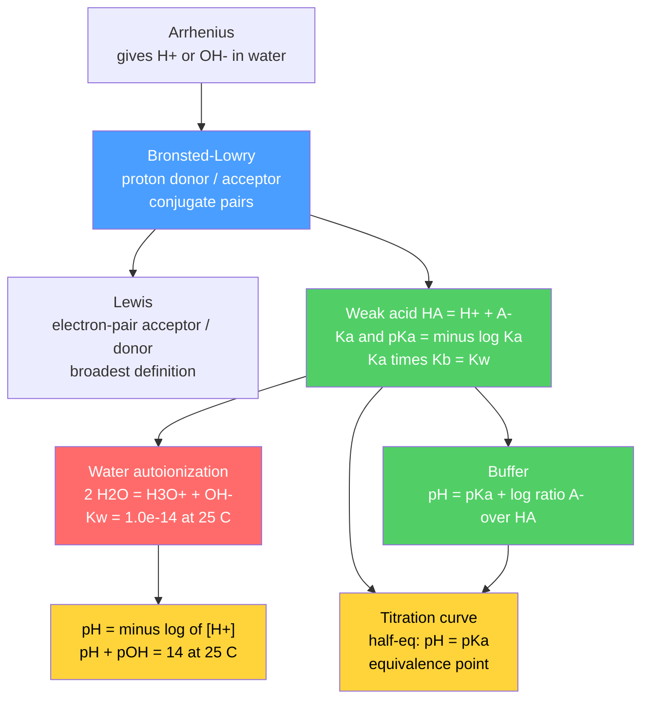

# ⚗️ Acids, Bases and pH

> [!abstract] TL;DR
> An **acid** and a **base** are defined by three nested lenses: **Arrhenius** (produces $\mathrm{H^+}$ or $\mathrm{OH^-}$ in water), **Brønsted–Lowry** (proton *donor* vs *acceptor*, forming **conjugate pairs**), and **Lewis** (electron-pair *acceptor* vs *donor* — the broadest). Water itself autoionizes, fixing $K_w = [\mathrm{H^+}][\mathrm{OH^-}] = 1.0\times10^{-14}$ at 25 °C, which defines the pH scale via $\mathrm{pH}=-\log[\mathrm{H^+}]$ and $\mathrm{pH}+\mathrm{pOH}=14$. Strong acids dissociate completely; weak acids reach equilibrium governed by $K_a$ (with $pK_a=-\log K_a$ and $K_aK_b=K_w$), solved with ICE tables. **Buffers** resist pH change via the Henderson–Hasselbalch equation $\mathrm{pH}=pK_a+\log\frac{[\mathrm{A^-}]}{[\mathrm{HA}]}$, and **titration curves** reveal $pK_a$ at the half-equivalence point. At the graduate level, acid strength is read off molecular structure (bond energy, electronegativity, induction, resonance, oxoacid rules) and the **leveling effect** limits what any solvent can distinguish.

## Intuition — analogy FIRST

Think of a proton ($\mathrm{H^+}$) as a hot potato that molecules toss around. An **acid** is a molecule eager to *throw* the potato; a **base** is one holding out its hands to *catch* it. The whole of acid–base chemistry is bookkeeping on who is throwing, who is catching, and how *willingly* — a strong acid flings the potato the instant it enters water, while a weak acid mostly clutches it and only occasionally lets go.

**pH is just a compressed scoreboard for how many loose potatoes are flying around.** Because free-proton concentrations span many orders of magnitude (from ~1 M in battery acid down to $10^{-14}$ M), we take the negative logarithm so the scale reads a friendly 0–14 instead of a blur of exponents. Every step down in pH means *ten times* more free protons — so lemon juice (pH 2) is a hundred times more acidic than black coffee (pH 4), not "twice."

---

## How It Works

Water is never truly inert: a tiny fraction of molecules swap a proton, $2\,\mathrm{H_2O}\rightleftharpoons \mathrm{H_3O^+}+\mathrm{OH^-}$. This **autoionization** pins the product $[\mathrm{H^+}][\mathrm{OH^-}]$ to a constant, so raising one ion must lower the other. Everything downstream — the pH scale, $K_a$, buffers, titrations — is that single equilibrium seen from different angles.



---

## Key Concepts / Details

### Secondary Level

**Three definitions.**

| Definition | Acid | Base | Scope |
|-----------|------|------|-------|
| Arrhenius (1884) | gives $\mathrm{H^+}$ in water | gives $\mathrm{OH^-}$ in water | aqueous only |
| Brønsted–Lowry (1923) | proton **donor** | proton **acceptor** | any solvent, gas phase |
| Lewis (1923) | electron-pair **acceptor** | electron-pair **donor** | broadest (e.g. $\mathrm{BF_3}$, $\mathrm{Ag^+}$) |

**Conjugate pairs.** When an acid donates its proton it becomes its **conjugate base**: $\mathrm{HA}\rightleftharpoons \mathrm{H^+}+\mathrm{A^-}$, so $\mathrm{HA}/\mathrm{A^-}$ is a conjugate pair. A *strong* acid has a *weak* (spectator) conjugate base, and vice versa.

**Water autoionization and the pH scale.**

$$K_w = [\mathrm{H^+}][\mathrm{OH^-}] = 1.0\times10^{-14}\ (25\,^\circ\mathrm{C})$$

$$\mathrm{pH} = -\log[\mathrm{H^+}], \qquad \mathrm{pOH} = -\log[\mathrm{OH^-}], \qquad \mathrm{pH}+\mathrm{pOH} = 14$$

At 25 °C: neutral $\mathrm{pH}=7$, acidic $<7$, basic $>7$. A **strong acid** fully dissociates, so 0.010 M HCl gives $[\mathrm{H^+}]=0.010$ and $\mathrm{pH}=2.00$. A **strong base**: 0.010 M NaOH gives $\mathrm{pOH}=2.00$, so $\mathrm{pH}=12.00$.

### Undergraduate Level

**Weak-acid equilibrium.** A weak acid only partially ionizes:

$$K_a = \frac{[\mathrm{H^+}][\mathrm{A^-}]}{[\mathrm{HA}]}, \qquad pK_a = -\log K_a$$

Set up an **ICE table** for initial concentration $C$, letting $x=[\mathrm{H^+}]$:

| | $\mathrm{HA}$ | $\mathrm{H^+}$ | $\mathrm{A^-}$ |
|---|---|---|---|
| Initial | $C$ | 0 | 0 |
| Change | $-x$ | $+x$ | $+x$ |
| Equilibrium | $C-x$ | $x$ | $x$ |

Then $K_a = \dfrac{x^2}{C-x}$, giving the exact quadratic $x^2 + K_a x - K_a C = 0$, so

$$x = [\mathrm{H^+}] = \frac{-K_a + \sqrt{K_a^2 + 4K_aC}}{2}$$

**The weak-acid approximation.** If ionization is small, $C-x\approx C$ and $x\approx\sqrt{K_aC}$, so $\mathrm{pH}\approx\tfrac12(pK_a-\log C)$. This is valid when ionization is under **5 %**, i.e. $\sqrt{K_a/C}<0.05$, equivalently $C/K_a\gtrsim 400$. **Always check afterward** — if it fails, use the quadratic.

**$K_a$, $K_b$, and the conjugate relationship.** For a conjugate pair, multiplying $K_a$ (acid) by $K_b$ (its conjugate base) gives

$$\boxed{K_a K_b = K_w = 1.0\times10^{-14}} \qquad\Longleftrightarrow\qquad pK_a + pK_b = 14$$

So the stronger an acid (larger $K_a$, smaller $pK_a$), the weaker its conjugate base.

**Polyprotic acids** donate protons in steps, each with its own constant and $K_{a1}\gg K_{a2}\gg K_{a3}$ (each successive proton leaves a more negative species):

| Acid | $pK_{a1}$ | $pK_{a2}$ | $pK_{a3}$ |
|------|-----------|-----------|-----------|
| $\mathrm{H_2CO_3}$ | 6.35 | 10.33 | — |
| $\mathrm{H_3PO_4}$ | 2.15 | 7.20 | 12.35 |
| $\mathrm{H_2SO_4}$ | strong | 1.99 | — |

Because the constants are well separated, the first ionization usually sets the pH.

**Buffers.** A buffer is a weak acid plus its conjugate base in comparable amounts. Rearranging $K_a$ and taking $-\log$ gives the **Henderson–Hasselbalch equation**:

$$\mathrm{pH} = pK_a + \log\frac{[\mathrm{A^-}]}{[\mathrm{HA}]}$$

It resists pH change because added $\mathrm{H^+}$ is mopped up by $\mathrm{A^-}$ and added $\mathrm{OH^-}$ is neutralized by $\mathrm{HA}$; only the *ratio* shifts, and $\log$ of a ratio moves slowly. **Buffer capacity** is maximal when $[\mathrm{A^-}]=[\mathrm{HA}]$ (so $\mathrm{pH}=pK_a$), and the useful range is $pK_a\pm 1$.

**Titration curves.** Adding strong base to an acid traces pH vs volume:

| Feature | Strong acid + strong base | Weak acid + strong base |
|---------|---------------------------|-------------------------|
| Start pH | very low | moderate (weak) |
| Half-equivalence | — | **$\mathrm{pH}=pK_a$** (buffer midpoint) |
| Equivalence pH | **7** | **> 7** (conjugate base hydrolyzes) |
| Best indicator | phenolphthalein / methyl orange | phenolphthalein ($pK_a\approx9$) |

Choose an indicator whose color-change $pK_a$ falls inside the steep vertical jump at the equivalence point. Full quantitative titration methodology lives in [[Titrations_and_Volumetric_Analysis]].

### Graduate Level

**Temperature dependence of $K_w$.** Autoionization is **endothermic** ($\Delta H^\circ \approx +55.8$ kJ/mol), so by Le Chatelier $K_w$ *rises* with temperature (see [[Chemical_Equilibrium]]):

| $T$ | $K_w$ | neutral pH ($[\mathrm{H^+}]=[\mathrm{OH^-}]$) |
|-----|-------|------|
| 0 °C | $1.1\times10^{-15}$ | 7.47 |
| 25 °C | $1.0\times10^{-14}$ | 7.00 |
| 100 °C | $5.1\times10^{-13}$ | 6.14 |

**Crucial subtlety:** at 100 °C pure water has pH ≈ 6.14 yet is still *neutral* — neutrality means $[\mathrm{H^+}]=[\mathrm{OH^-}]$, not "pH = 7."

**Acid strength vs structure.**

- **Binary acids $\mathrm{H{-}X}$.** *Down a group*, the $\mathrm{H{-}X}$ bond weakens, so acidity rises: $\mathrm{HF}\ll\mathrm{HCl}<\mathrm{HBr}<\mathrm{HI}$ (bond strength dominates). *Across a period*, electronegativity/bond polarity dominates: $\mathrm{CH_4}<\mathrm{NH_3}<\mathrm{H_2O}<\mathrm{HF}$.
- **Oxoacids — Pauling's rule.** For $(\mathrm{HO})_m X\mathrm{O}_n$, each additional *terminal* oxygen $n$ withdraws electron density and resonance-stabilizes the conjugate base, dropping $pK_a$ by roughly 5 units: $pK_a \approx 8 - 5n$. Thus $\mathrm{HOCl}$ ($n{=}0$, $pK_a\!\approx\!7.5$) $\ll \mathrm{HClO_2}$ ($n{=}1$) $\ll \mathrm{HClO_3}$ (strong) $\ll \mathrm{HClO_4}$ (superacid-strong).
- **Inductive effect.** Electron-withdrawing substituents stabilize the anion: acetic acid $pK_a=4.76$ vs trichloroacetic acid $pK_a=0.66$.
- **Resonance.** Carboxylic acids ($pK_a\!\approx\!5$) far outacid alcohols ($pK_a\!\approx\!16$) because the carboxylate charge delocalizes over two oxygens.

**Leveling effect.** Water cannot distinguish among acids stronger than $\mathrm{H_3O^+}$ — HCl, $\mathrm{HNO_3}$, $\mathrm{HClO_4}$ all appear equally strong because each is fully converted to $\mathrm{H_3O^+}$, the strongest acid that can exist in water. To *differentiate* them you need a weaker base solvent (e.g. glacial acetic acid), a **differentiating solvent**. Symmetrically, $\mathrm{OH^-}$ is the strongest base water permits.

```python
# Weak-acid pH via the exact quadratic, then a weak-acid / strong-base titration curve.
import numpy as np
import matplotlib.pyplot as plt

Kw = 1.0e-14

# --- Part 1: pH of a weak acid via the quadratic  x^2 + Ka*x - Ka*C = 0 -------
def weak_acid_pH(C, Ka):
    x = (-Ka + np.sqrt(Ka**2 + 4*Ka*C)) / 2      # x = [H+]
    return -np.log10(x), 100 * x / C             # pH, percent ionization

C, Ka = 0.100, 1.8e-5                            # 0.10 M acetic acid, pKa = 4.74
pH, pct = weak_acid_pH(C, Ka)
print(f"0.10 M acetic acid : pH = {pH:.2f}, ionization = {pct:.2f}%")
print(f"C/Ka = {C/Ka:.0f}  (>400 -> 5% approximation is also valid here)")

# --- Part 2: titrate 50 mL of 0.10 M HA with 0.10 M NaOH ---------------------
C, Va, Cb, Ka = 0.100, 50.0, 0.100, 1.8e-5
pKa = -np.log10(Ka)
Veq = C * Va / Cb                                # equivalence volume (mL)

def pH_at(Vb):
    # Exact solve of charge + mass balance:  [Na+] + [H+] = [OH-] + [A-]
    # -> f(h) = Na + h - Kw/h - Cat*Ka/(Ka+h) = 0 ,  f increasing in h
    V, Cat, Na = Va + Vb, C*Va/(Va+Vb), Cb*Vb/(Va+Vb)
    f = lambda h: Na + h - Kw/h - Cat*Ka/(Ka + h)
    lo, hi = 1e-14, 1.0
    for _ in range(100):                         # bisection in pH space
        mid = np.sqrt(lo*hi)
        lo, hi = (lo, mid) if f(mid) > 0 else (mid, hi)
    return -np.log10(np.sqrt(lo*hi))

Vb = np.linspace(0, 2*Veq, 400)
curve = np.array([pH_at(v) for v in Vb])

plt.figure(figsize=(7, 5))
plt.plot(Vb, curve, lw=2)
plt.axvline(Veq/2, ls="--", color="#4a9eff")     # half-equivalence: pH = pKa
plt.axvline(Veq,   ls="--", color="#ff6b6b")     # equivalence point
plt.scatter([Veq/2], [pKa], zorder=5, color="#4a9eff")
plt.annotate(f"half-eq: pH = pKa = {pKa:.2f}", (Veq/2, pKa),
             textcoords="offset points", xytext=(8, -14))
plt.annotate(f"equivalence: pH = {pH_at(Veq):.2f} (basic)", (Veq, pH_at(Veq)),
             textcoords="offset points", xytext=(-60, 12))
plt.xlabel("Volume of 0.10 M NaOH added (mL)"); plt.ylabel("pH")
plt.title("Titration of 0.10 M acetic acid with 0.10 M NaOH")
plt.grid(True, alpha=0.3); plt.tight_layout(); plt.show()
```

---

## Real-World Notes

- **Blood pH homeostasis.** The bicarbonate buffer $\mathrm{H_2CO_3}/\mathrm{HCO_3^-}$ ($pK_a=6.1$) holds arterial blood at 7.35–7.45; the lungs and kidneys adjust $\mathrm{CO_2}$ and $\mathrm{HCO_3^-}$ to keep the Henderson–Hasselbalch ratio near 20:1. A drift to 6.8 or 7.8 is fatal.
- **Ocean acidification.** Absorbed atmospheric $\mathrm{CO_2}$ forms carbonic acid, having already lowered surface-ocean pH from ~8.2 to ~8.1 — a ~30 % rise in $[\mathrm{H^+}]$ that undersaturates carbonate and dissolves shells.
- **Antacids.** $\mathrm{CaCO_3}$ and $\mathrm{Mg(OH)_2}$ neutralize excess stomach $\mathrm{HCl}$ (pH ≈ 1.5) by Brønsted proton transfer — a household strong-acid/weak-base reaction.
- **Enzyme catalysis.** Active-site residues (His $pK_a\approx6$, Asp/Glu $\approx4$) act as general acid/base catalysts; enzyme rate–pH profiles are titration curves of these residues — see [[Enzyme_Kinetics_and_Catalysis]].
- **Buffered consumer products.** Shampoos, contact-lens saline, and injectable drugs are formulated at a target pH with citrate or phosphate buffers so they resist dilution and skin contact.
- **Superacids and catalysis.** Media like $\mathrm{HF}/\mathrm{SbF_5}$ ($H_0 < -20$) protonate hydrocarbons; leveling is why such strength is only observable in non-aqueous, weakly basic solvents.

---

## Common Pitfalls

1. **Confusing "strong" with "concentrated."** Strength is *degree of ionization* ($K_a$); concentration is *amount*. Dilute HCl is still a strong acid; concentrated acetic acid is still weak.
2. **Assuming pH 7 is always neutral.** Neutral means $[\mathrm{H^+}]=[\mathrm{OH^-}]$. Because $K_w$ grows with temperature, neutral water at 100 °C sits at pH ≈ 6.14.
3. **Skipping the 5 % check.** The weak-acid approximation $x\approx\sqrt{K_aC}$ fails for dilute or moderately strong weak acids; if $C/K_a\lesssim400$, solve the quadratic.
4. **Expecting a weak-acid equivalence point at pH 7.** The conjugate base left at equivalence is itself a base, so the equivalence pH is **> 7**; only strong+strong titrations land at 7.
5. **Misusing Henderson–Hasselbalch outside the buffer range.** It assumes both $\mathrm{HA}$ and $\mathrm{A^-}$ are present in appreciable, comparable amounts; near the endpoints (ratio beyond ~10:1) it breaks and you must return to the full equilibrium.
6. **Dropping water's autoionization in very dilute or nearly neutral solutions.** For $C\lesssim10^{-6}$ M acid the $\mathrm{H^+}$ from water is no longer negligible; use the charge-balance equation, not $\mathrm{pH}=-\log C$.

---

## Related Concepts

- [[_MOC_General_Chemistry|↑ Section MOC]]
- [[Chemical_Equilibrium]] — $K_a$, $K_b$, and $K_w$ are equilibrium constants; supplies the full ICE/activity treatment and van 't Hoff temperature dependence
- [[Titrations_and_Volumetric_Analysis]] — the quantitative lab procedure behind the titration curves shown here
- [[Solutions_and_Concentration]] — molarity and dilution, the inputs to every pH calculation
- [[Stoichiometry_and_the_Mole]] — mole ratios that define the equivalence point in neutralization
- [[States_of_Matter_and_Gas_Laws]] — dissolved $\mathrm{CO_2}$ links gas partial pressure to carbonic-acid pH
- [[Periodic_Table_and_Periodic_Trends]] — electronegativity and bond trends explain binary/oxoacid strength
- [[Chemical_Bonding_and_Molecular_Geometry]] — bond polarity, induction, and resonance stabilize (or not) the conjugate base
- [[Atomic_Structure_and_Subatomic_Particles]] — the proton is the transferred particle at the heart of Brønsted theory
- [[Inorganic_Acids_Bases_and_Redox]] — descriptive chemistry of mineral acids, Lewis acids, and redox-coupled systems
- [[Enzyme_Kinetics_and_Catalysis]] — general acid/base catalysis and pH–rate profiles in biochemistry
- [[_MOC_Mathematics_Master]] (Math) — logarithms, root-finding, and the quadratic behind pH and titration curves

---

## Review Questions

1. **Secondary:** (a) What is the pH of 0.0050 M HCl? (b) What is the pH of 0.0050 M NaOH at 25 °C? (c) Identify the conjugate base of $\mathrm{HCO_3^-}$ and its conjugate acid.
2. **Undergraduate:** A 0.20 M solution of a weak acid has $K_a = 6.3\times10^{-5}$. (a) Use the quadratic to find $[\mathrm{H^+}]$ and pH. (b) Verify the 5 % approximation. (c) You then prepare a buffer that is 0.20 M in this acid and 0.10 M in its sodium salt — what is the pH, and in which direction does it move when a little NaOH is added?
3. **Graduate:** (a) Using Pauling's rule, rank $\mathrm{HClO}$, $\mathrm{HClO_2}$, $\mathrm{HClO_3}$, $\mathrm{HClO_4}$ by acidity and justify with terminal-oxygen count and conjugate-base resonance. (b) Explain the leveling effect and why $\mathrm{HCl}$ and $\mathrm{HClO_4}$ appear equally strong in water but not in glacial acetic acid. (c) Given $\Delta H^\circ>0$ for autoionization, predict qualitatively how the neutral pH of pure water changes between 10 °C and 60 °C.

---

## Sources

- Petrucci, Herring, Madura, Bissonnette — *General Chemistry: Principles and Modern Applications*, 11th ed., Ch. 16–17
- Atkins & de Paula — *Physical Chemistry*, Ch. 6 (acid–base equilibria, activities)
- Harris — *Quantitative Chemical Analysis*, 9th ed., Ch. 8–11 (buffers, titrations, pH systematics)
- Housecroft & Sharpe — *Inorganic Chemistry*, 4th ed. (oxoacid strength, leveling effect)
- IUPAC — *Quantities, Units and Symbols in Physical Chemistry* (Green Book), pH and standard-state conventions

---

#chemistry #general-chemistry #acids-bases #ph #bronsted-lowry #ka-kb #buffers #henderson-hasselbalch #titration #secondary #undergraduate #graduate
