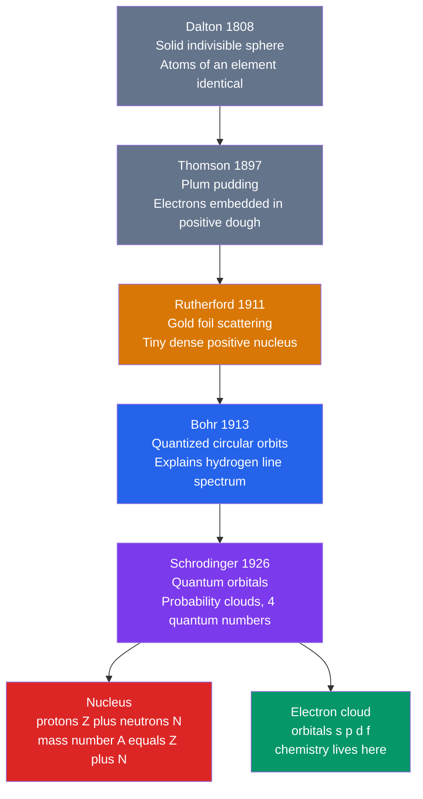

# ⚛️ Atomic Structure and Subatomic Particles

> [!abstract] TL;DR
> An atom is a dense, positively charged **nucleus** of protons and neutrons surrounded by a cloud of **electrons**. The number of protons — the **atomic number $Z$** — defines the element; the electrons determine its chemistry. Our picture evolved from Dalton's indivisible sphere, through Thomson's "plum pudding" and Rutherford's nuclear atom, to Bohr's quantized orbits (which explained the hydrogen line spectrum via the Rydberg formula), and finally to the **quantum-mechanical model** where electrons occupy orbitals described by four quantum numbers. At the graduate level these orbitals are exact solutions of the hydrogen-atom Schrödinger equation, and subtleties like spin–orbit coupling, shielding, and penetration explain fine structure and the ordering of orbital energies in real atoms.

## Intuition — analogy FIRST

Picture a tiny solar system — but a strange one. The Sun is the nucleus: unimaginably dense, holding almost all the mass in a speck at the center. The planets are electrons, whirling around at a distance thousands of times larger than the nucleus itself. If the nucleus were a marble on the center line of a football stadium, the electrons would be dust motes drifting near the top row of seats. **Atoms are almost entirely empty space.**

But electrons are not really little planets on fixed tracks. A better analogy is a **fan blade in motion**: you cannot point to where a single blade *is*, only to the blurred disc where it *probably is*. An orbital is that blurred region of probability — and, crucially, the electron can only spin at certain allowed "speeds" (energies), never in between. Those allowed rungs on the energy ladder are what make each element glow with its own signature colors.

---

## How It Works



---

## Key Concepts / Details

### Secondary Level

**The three subatomic particles**

| Particle | Symbol | Charge | Rest mass | Location |
|----------|--------|--------|-----------|----------|
| Proton | $p^+$ | $+1e = +1.602\times10^{-19}$ C | $1.6726\times10^{-27}$ kg $\approx 1.007$ u | Nucleus |
| Neutron | $n^0$ | $0$ | $1.6749\times10^{-27}$ kg $\approx 1.009$ u | Nucleus |
| Electron | $e^-$ | $-1e = -1.602\times10^{-19}$ C | $9.109\times10^{-31}$ kg $\approx 5.49\times10^{-4}$ u | Orbitals |

An electron is about **1/1836** the mass of a proton — nearly all of an atom's mass is in the nucleus, but nearly all of its *volume* is the electron cloud.

**Atomic number and mass number**

$$Z = \text{number of protons}, \qquad A = Z + N \;\;(\text{protons} + \text{neutrons})$$

A neutral atom has equal protons and electrons. The notation is $^{A}_{Z}\text{X}$, e.g. $^{12}_{6}\text{C}$ has 6 protons, 6 neutrons, 6 electrons.

**Isotopes and average atomic mass**

**Isotopes** are atoms of the same element (same $Z$) with different numbers of neutrons (different $A$). The atomic mass on the periodic table is the **abundance-weighted average**:

$$\bar{m} = \sum_i f_i \, m_i$$

*Chlorine example:* $^{35}\text{Cl}$ ($m = 34.969$ u, $f = 0.7577$) and $^{37}\text{Cl}$ ($m = 36.966$ u, $f = 0.2423$):
$$\bar{m} = (0.7577)(34.969) + (0.2423)(36.966) = 35.45 \text{ u} \;\checkmark$$

**Ions**

- **Cation** — atom that has **lost** electrons, net positive (e.g. $\text{Na}^+$, $\text{Ca}^{2+}$). Metals tend to form cations.
- **Anion** — atom that has **gained** electrons, net negative (e.g. $\text{Cl}^-$, $\text{O}^{2-}$). Nonmetals tend to form anions.

Adding or removing electrons changes charge and chemistry but **not** the element ($Z$ is unchanged).

### Undergraduate Level

**The Bohr model and line spectra**

Bohr postulated that the electron in hydrogen occupies only orbits where angular momentum is quantized, $L = n\hbar$, giving energy levels

$$E_n = -\frac{13.6\ \text{eV}}{n^2}, \qquad n = 1, 2, 3, \dots$$

When an electron falls from level $n_2$ to a lower level $n_1$, it emits a photon whose wavelength obeys the **Rydberg formula**:

$$\frac{1}{\lambda} = R_H\left(\frac{1}{n_1^2} - \frac{1}{n_2^2}\right), \qquad R_H = 1.097\times10^{7}\ \text{m}^{-1}$$

| Series | $n_1$ | Region | Discovered from |
|--------|-------|--------|-----------------|
| Lyman | 1 | Ultraviolet | H emission |
| Balmer | 2 | Visible | H visible lines ($\text{H}\alpha$ red at 656 nm) |
| Paschen | 3 | Infrared | H IR lines |

This exact match to observed spectra was the model's triumph — but it fails for any atom with more than one electron and cannot explain intensities or fine structure.

**Quantum numbers (the modern model)**

Each electron is labeled by four quantum numbers:

| Symbol | Name | Allowed values | Physical meaning |
|--------|------|----------------|------------------|
| $n$ | Principal | $1, 2, 3, \dots$ | Shell, size, energy |
| $\ell$ | Azimuthal | $0 \dots n-1$ | Subshell shape ($s,p,d,f$) |
| $m_\ell$ | Magnetic | $-\ell \dots +\ell$ | Orbital orientation |
| $m_s$ | Spin | $\pm\tfrac{1}{2}$ | Electron spin |

Subshell shapes: **s** ($\ell=0$) spherical; **p** ($\ell=1$) dumbbell, 3 orientations; **d** ($\ell=2$) cloverleaf, 5 orientations; **f** ($\ell=3$) complex, 7 orientations. A subshell holds $2(2\ell+1)$ electrons; a shell holds $2n^2$.

**Filling rules for electron configuration**

1. **Aufbau principle** — fill orbitals from lowest energy up (roughly $1s\,2s\,2p\,3s\,3p\,4s\,3d\,4p\dots$, the $n+\ell$ ordering).
2. **Pauli exclusion principle** — no two electrons share all four quantum numbers; an orbital holds at most 2 electrons, with opposite spins.
3. **Hund's rule** — within a subshell, fill each orbital singly (parallel spins) before pairing, to minimize electron–electron repulsion.

*Examples:* $\text{O}$: $1s^2\,2s^2\,2p^4$. Iron: $[\text{Ar}]\,3d^6\,4s^2$. The **noble-gas shorthand** replaces core electrons with the previous noble gas. **Valence electrons** (the outermost $s$ and $p$, and relevant $d$) drive bonding.

**Anomalous configurations** — half-filled and filled $d$ subshells are extra stable, so:
$$\text{Cr} = [\text{Ar}]\,3d^5\,4s^1 \quad(\text{not } 3d^4 4s^2), \qquad \text{Cu} = [\text{Ar}]\,3d^{10}\,4s^1 \quad(\text{not } 3d^9 4s^2)$$

### Graduate Level

**The hydrogen-atom Schrödinger solution**

Solving the time-independent [[Schrodinger_Equation]] for the Coulomb potential $V(r) = -\dfrac{e^2}{4\pi\varepsilon_0 r}$ gives separable eigenfunctions

$$\psi_{n\ell m}(r,\theta,\phi) = R_{n\ell}(r)\,Y_\ell^{m}(\theta,\phi)$$

where $Y_\ell^m$ are the **spherical harmonics** (angular part, shared with [[Angular_Momentum_and_Spin]]) and $R_{n\ell}$ is the radial part built from associated Laguerre polynomials. The eigen-energies are

$$E_n = -\frac{m_e e^4}{8\varepsilon_0^2 h^2}\,\frac{1}{n^2} = -\frac{13.606\ \text{eV}}{n^2}, \qquad a_0 = \frac{4\pi\varepsilon_0 \hbar^2}{m_e e^2} = 0.529\ \text{Å}$$

**Degeneracy.** In pure hydrogen, $E_n$ depends *only* on $n$, so all $\ell$ and $m_\ell$ within a shell are degenerate. The orbital degeneracy is $g_n = n^2$ ($2n^2$ including spin). This "accidental" $\ell$-degeneracy reflects a hidden $SO(4)$ symmetry of the Coulomb problem (the conserved Runge–Lenz vector).

**Spin–orbit coupling.** The electron's spin magnetic moment interacts with the magnetic field it sees from its orbital motion, adding a term $H_{SO} = \xi(r)\,\mathbf{L}\cdot\mathbf{S}$. This lifts part of the degeneracy into **fine structure**, with splittings of order $\alpha^2 \approx (1/137)^2$ relative to $E_n$ and scaling as $Z^4$. States are then labeled by total angular momentum $j = \ell \pm \tfrac{1}{2}$ (term symbols like $2p_{3/2}$) — the origin of the sodium D-line doublet at 589.0 / 589.6 nm.

**Shielding and penetration** (multi-electron atoms). With more than one electron, the $\ell$-degeneracy breaks: inner electrons **shield** the nucleus, so an outer electron feels an effective charge $Z_{\text{eff}} = Z - \sigma$. Low-$\ell$ orbitals **penetrate** closer to the nucleus (their radial functions are nonzero at $r=0$), feel a larger $Z_{\text{eff}}$, and are lowered in energy. Hence within a shell $E_{ns} < E_{np} < E_{nd} < E_{nf}$, and the $4s$ orbital drops *below* $3d$ — the reason $\text{K}$ and $\text{Ca}$ fill $4s$ before the $3d$ block begins.

```python
# Hydrogen emission spectrum from the Rydberg formula:
# plot the Lyman (UV) and Balmer (visible) series line positions.
import numpy as np
import matplotlib.pyplot as plt

R_H = 1.0967758e7  # Rydberg constant, 1/m

def wavelengths_nm(n1, n2_max=8):
    n2 = np.arange(n1 + 1, n2_max + 1)
    inv_lambda = R_H * (1.0 / n1**2 - 1.0 / n2**2)  # 1/lambda in 1/m
    return n2, 1e9 / inv_lambda  # nm

series = {"Lyman (n1=1)": (1, "purple"), "Balmer (n1=2)": (2, "crimson")}

fig, ax = plt.subplots(figsize=(8, 3.5))
for label, (n1, color) in series.items():
    n2, lam = wavelengths_nm(n1)
    for w, up in zip(lam, n2):
        ax.axvline(w, color=color, lw=1.5, alpha=0.8)
    ax.plot([], [], color=color, label=label)  # legend proxy

# Balmer-alpha (n=3 -> 2) should land at ~656.3 nm (visible red)
print("H-alpha wavelength:", round(wavelengths_nm(2)[1][0], 1), "nm")

ax.set_xlim(90, 700)
ax.set_xlabel("Wavelength (nm)")
ax.set_yticks([])
ax.set_title("Hydrogen Emission Lines (Rydberg formula)")
ax.legend()
plt.tight_layout()
```

---

## Real-World Notes

- **Flame tests and fireworks** rely on line spectra: strontium salts emit red, copper green, sodium the intense 589 nm yellow — each element's electron transitions give a fingerprint (see [[Atomic_Models_and_Spectroscopy]]).
- **Emission and absorption spectroscopy** identifies elements in stars and distant galaxies; the same Balmer lines seen in a lab discharge tube appear (redshifted) in stellar spectra.
- **Mass spectrometry** separates isotopes by mass-to-charge ratio, letting chemists measure the exact abundances that define average atomic masses on the periodic table.
- **Carbon-14 dating** exploits a radioactive isotope: same chemistry as $^{12}\text{C}$ but an unstable nucleus that decays with a 5730-year half-life.
- **MRI and PET** are subatomic in origin — MRI reads nuclear spin ($^1\text{H}$), while PET detects positron (antimatter electron) annihilation.
- **LED and laser colors** are engineered electron transitions: the quantization Bohr first invoked for hydrogen underlies every glowing screen.

---

## Common Pitfalls

1. **Confusing mass number with atomic mass** — $A$ is an integer count of nucleons for one atom; the periodic-table value is a *weighted average* over isotopes (e.g. Cl is 35.45, not 35 or 37). Fix: distinguish "one nuclide" from "natural mixture."
2. **Thinking orbits are physical paths** — the Bohr model's neat circles are a useful fiction; electrons occupy probability *orbitals*, not tracks. Fix: reason with $|\psi|^2$ densities, not planetary trajectories.
3. **Miswriting anomalous configurations** — writing $\text{Cr}=[\text{Ar}]3d^4 4s^2$. The half-filled $3d^5 4s^1$ is lower in energy. Fix: memorize Cr and Cu (and their group-mates Mo, W, Ag, Au).
4. **Ionization order for transition metals** — although $4s$ fills *before* $3d$, it is *removed first* on ionization (once $3d$ is occupied it sits lower). So $\text{Fe}^{2+}$ is $[\text{Ar}]3d^6$, not $3d^4 4s^2$. Fix: "$4s$ fills first, empties first."
5. **Forgetting Hund's rule** — pairing electrons in one $p$ orbital before singly occupying all three. Fix: fill degenerate orbitals singly with parallel spins first.
6. **Assuming hydrogen's $\ell$-degeneracy holds everywhere** — $E$ depends only on $n$ *only* for one-electron atoms. In every multi-electron atom, shielding/penetration make $E_{ns}<E_{np}<E_{nd}$. Fix: use $n+\ell$ ordering for real atoms.

---

## Related Concepts

- [[_MOC_General_Chemistry|↑ Section MOC]]
- [[Periodic_Table_and_Periodic_Trends]] — electron configuration and valence electrons directly generate the table's shape and periodic trends
- [[Quantum_Chemistry_and_Atomic_Orbitals]] — the full quantum-mechanical treatment of orbitals, radial/angular wavefunctions, and many-electron atoms
- [[Chemical_Bonding_and_Molecular_Geometry]] — valence electrons and orbitals are the raw material of chemical bonds
- [[Schrodinger_Equation]] — the wave equation whose hydrogen solution *is* the orbital picture
- [[Wave_Particle_Duality_and_Uncertainty]] — why electrons are probability clouds rather than point particles on orbits
- [[Angular_Momentum_and_Spin]] — physical origin of $\ell$, $m_\ell$, and $m_s$ and the spherical harmonics
- [[Atomic_Models_and_Spectroscopy]] — line spectra, selection rules, and the experimental basis of atomic structure
- [[Quantum_Harmonic_Oscillator]] — the companion exactly-solvable quantum system and its role in molecular vibrations

---

## Review Questions

1. **Secondary**: Bromine occurs as $^{79}\text{Br}$ (mass 78.918 u, 50.69%) and $^{81}\text{Br}$ (mass 80.916 u, 49.31%). Calculate the average atomic mass and identify how many protons, neutrons, and electrons are in a neutral $^{81}\text{Br}$ atom.
2. **Undergraduate**: Using the Rydberg formula, compute the wavelength of the $n=4 \to n=2$ Balmer transition and state its color. Then write the full and noble-gas electron configuration of a neutral chromium atom, explaining the anomaly.
3. **Graduate**: The hydrogen $n=2$ level is fourfold orbitally degenerate. Explain (a) why this $\ell$-degeneracy is exact for hydrogen but not for helium, and (b) how spin–orbit coupling further splits the $2p$ level, giving the resulting term symbols and the relative order of their energies.

---

## Sources

- Atkins & de Paula — *Physical Chemistry*, 11th ed., Ch. 7–8 (quantum theory and atomic structure)
- McQuarrie & Simon — *Physical Chemistry: A Molecular Approach*, Ch. 6–8
- Miessler, Fischer & Tarr — *Inorganic Chemistry*, 5th ed., Ch. 2 (atomic structure)
- Griffiths — *Introduction to Quantum Mechanics*, 3rd ed., Ch. 4 (the hydrogen atom, fine structure)
- Brown, LeMay et al. — *Chemistry: The Central Science*, Ch. 2 & 6

#chemistry #general-chemistry #atomic-structure #subatomic-particles #isotopes #bohr-model #quantum-numbers #electron-configuration #secondary #undergraduate #graduate
