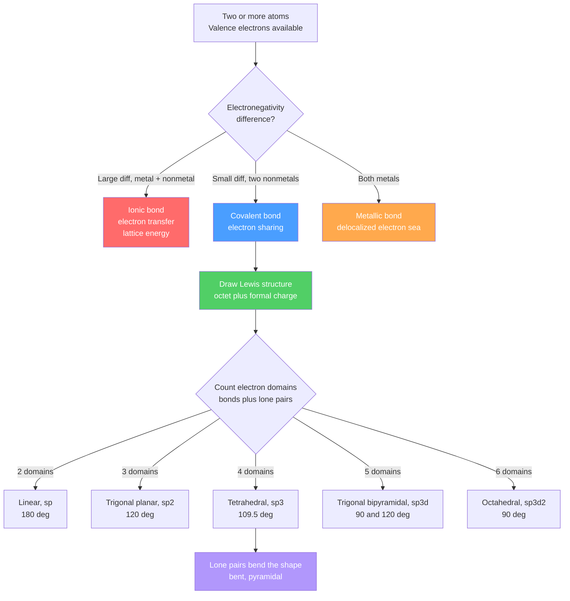

# 🔗 Chemical Bonding and Molecular Geometry

> [!abstract] TL;DR
> Atoms bond to *lower their total energy*, typically by reaching a noble-gas electron configuration (the octet rule). There are three idealized bonding types: **ionic** (electron transfer, held by lattice energy), **covalent** (electron sharing, polar or nonpolar depending on electronegativity difference), and **metallic** (a delocalized "electron sea"). Once we know which atoms are bonded, **Lewis structures** track valence electrons and **VSEPR theory** predicts 3-D shape from electron-domain repulsion. **Valence bond theory** explains those shapes via orbital **hybridization** ($sp$, $sp^2$, $sp^3$, $sp^3d$, $sp^3d^2$) and $\sigma/\pi$ bonds, while **molecular orbital theory** (graduate) explains subtleties like why $\text{O}_2$ is paramagnetic. Weak **intermolecular forces** — dispersion, dipole–dipole, hydrogen bonding — then set bulk properties like boiling point.

## Intuition — analogy FIRST

Think of atoms as people at a party, each holding a hand of cards (valence electrons) and wanting a "full hand" of eight. An **ionic bond** is a gift: one person hands their spare cards to another, and now oppositely "charged" partners stick together by electrostatic attraction. A **covalent bond** is a handshake: two people grip a shared pair of cards between them. A **metallic bond** is a mosh pit: everyone throws their cards into a common pool and the whole crowd is held together by the shared sea.

The *shape* of a molecule then follows a simple rule everyone already knows: **groups of electrons repel and spread as far apart as possible**, like balloons tied at a single knot pushing away from each other. That single idea — minimize repulsion — predicts almost every molecular geometry you will ever draw.

---

## How It Works



---

## Key Concepts / Details

### Secondary Level

**Why atoms bond: the octet rule.** A bonded system is stable when it sits in a potential-energy *well* — the atoms are closer than infinity but not so close that nuclei repel. Most main-group atoms achieve this by gaining, losing, or sharing electrons to reach eight valence electrons (a noble-gas shell); hydrogen aims for two.

**Three bonding types**

| Type | Mechanism | Holds together by | Typical property |
|------|-----------|-------------------|------------------|
| Ionic | Electron *transfer* (metal → nonmetal) | Electrostatic attraction of ions (lattice energy) | High melting, brittle, conducts when molten/dissolved |
| Covalent | Electron *sharing* (nonmetal + nonmetal) | Shared electron pair between nuclei | Molecular, lower melting, poor conductor |
| Metallic | Electrons *delocalized* | Cation lattice in an electron sea | Conductive, malleable, ductile, shiny |

**Polar vs nonpolar covalent.** Use the electronegativity difference $\Delta\chi$ (Pauling scale). Roughly: $\Delta\chi < 0.4$ nonpolar covalent, $0.4$–$1.7$ polar covalent, $> 1.7$ ionic. A polar bond has a partial charge separation, written $\delta^+$ / $\delta^-$.

**Lewis structures (basic recipe):** (1) count total valence electrons; (2) place the least electronegative atom in the center; (3) connect with single bonds; (4) fill lone pairs to complete octets; (5) if the center is short, form double/triple bonds.

### Undergraduate Level

**Ionic bonding energetics — Born–Haber cycle.** Forming NaCl(s) from elements is a sum of steps (Hess's law): sublimation of Na, ionization energy of Na, bond dissociation of $\text{Cl}_2$, electron affinity of Cl, and finally the large negative **lattice energy** $U$. Lattice energy follows the Coulomb form:
$$U \propto \frac{q_+\, q_-}{r_0}$$
so small, highly charged ions (e.g. $\text{MgO}$) have very large lattice energies and high melting points.

**Bond order, length, and energy.** For covalent bonds, higher bond order = shorter and stronger:

| Bond | Order | Length (pm) | Energy (kJ/mol) |
|------|-------|-------------|-----------------|
| C–C | 1 | 154 | 348 |
| C=C | 2 | 134 | 614 |
| C≡C | 3 | 120 | 839 |

**Formal charge** helps choose the best Lewis structure:
$$FC = (\text{valence } e^-) - (\text{lone-pair } e^-) - \tfrac{1}{2}(\text{bonding } e^-)$$
Prefer structures minimizing $|FC|$ and placing negative $FC$ on the more electronegative atom. **Resonance** (e.g. $\text{O}_3$, $\text{CO}_3^{2-}$) averages several valid structures. **Exceptions:** electron-deficient centers ($\text{BF}_3$, 6 e⁻), odd-electron radicals ($\text{NO}$, $\text{NO}_2$), and **expanded octets** for period-3+ atoms ($\text{PCl}_5$, $\text{SF}_6$).

**VSEPR shapes** (AXₙEₘ; A = center, X = bonded atoms, E = lone pairs):

| Domains | Geometry | 0 LP | 1 LP | 2 LP | 3 LP |
|---------|----------|------|------|------|------|
| 2 | Linear | linear (CO₂) | — | — | — |
| 3 | Trig. planar | trig. planar (BF₃) | bent (SO₂) | — | — |
| 4 | Tetrahedral | tetrahedral (CH₄) | trig. pyramidal (NH₃) | bent (H₂O) | — |
| 5 | Trig. bipyramidal | TBP (PCl₅) | seesaw (SF₄) | T-shaped (ClF₃) | linear (XeF₂) |
| 6 | Octahedral | octahedral (SF₆) | sq. pyramidal (BrF₅) | square planar (XeF₄) | — |

Lone pairs and multiple bonds repel *more* than single bonds, so they **compress** neighboring angles: CH₄ 109.5°, NH₃ 107°, H₂O 104.5°.

**Valence bond theory & hybridization.** Atomic orbitals mix to form equivalent hybrids matching the electron-domain count: 2 → $sp$ (180°), 3 → $sp^2$ (120°), 4 → $sp^3$ (109.5°), 5 → $sp^3d$, 6 → $sp^3d^2$. A **$\sigma$ bond** is head-on overlap along the internuclear axis; a **$\pi$ bond** is side-on overlap of unhybridized $p$ orbitals. A double bond = 1 $\sigma$ + 1 $\pi$; a triple bond = 1 $\sigma$ + 2 $\pi$. The $\pi$ system is what prevents rotation about C=C.

**Intermolecular forces (IMFs)** — always weaker than bonds, but they set melting/boiling points:

| Force | Occurs in | Relative strength |
|-------|-----------|-------------------|
| London dispersion | all molecules (instantaneous dipoles) | weakest, grows with molar mass/polarizability |
| Dipole–dipole | polar molecules | moderate |
| Hydrogen bonding | H bonded to N, O, F | strong (special dipole–dipole) |
| Ion–dipole | ion + polar solvent (Na⁺ in water) | strongest of these |

### Graduate Level

**Molecular orbital (MO) theory.** VSEPR and hybridization are localized pictures; MO theory is the rigorous delocalized one. Atomic orbitals combine (LCAO) into **bonding** (in-phase, lower energy) and **antibonding** (out-of-phase, $\ast$, higher energy) molecular orbitals. Bond order is:
$$\text{BO} = \tfrac{1}{2}\left(n_{\text{bonding}} - n_{\text{antibonding}}\right)$$

**The $\text{O}_2$ paradox.** A Lewis structure of $\text{O}_2$ shows all electrons paired, predicting it is diamagnetic — but liquid $\text{O}_2$ is famously drawn to a magnet. The MO diagram resolves this: the two highest electrons occupy the *degenerate* $\pi^\ast_{2p}$ pair singly with parallel spins (Hund's rule), making $\text{O}_2$ **paramagnetic** with bond order 2:
$$(\sigma_{2s})^2(\sigma^\ast_{2s})^2(\sigma_{2p})^2(\pi_{2p})^4(\pi^\ast_{2p})^2$$
For $\text{O}_2$: BO $= \tfrac{1}{2}(8-4)=2$. (Note the $\sigma_{2p}$/$\pi_{2p}$ ordering flips for $\text{B}_2$–$\text{N}_2$ due to $s$–$p$ mixing.) MO theory also cleanly gives the existence of odd-electron species and fractional bond orders. The full quantum treatment — LCAO-SCF, symmetry-adapted orbitals, and correlation — lives in the Physical Chemistry section: see [[Quantum_Chemistry_and_Atomic_Orbitals]].

---

```python
# Boiling point vs molar mass: dispersion (noble gases) vs hydrogen bonding (hydrides)
import numpy as np
import matplotlib.pyplot as plt

# Noble gases: only London dispersion -> BP rises smoothly with molar mass
noble_M  = np.array([4.0, 20.2, 39.9, 83.8, 131.3])          # g/mol
noble_bp = np.array([-269.0, -246.0, -186.0, -153.0, -108.0]) # deg C

# Group-16 hydrides: H2O is anomalously high due to hydrogen bonding
hyd_M    = np.array([18.0, 34.1, 81.0, 129.6])   # H2O, H2S, H2Se, H2Te
hyd_bp   = np.array([100.0, -60.0, -41.0, -2.0]) # deg C

plt.figure(figsize=(7, 5))
plt.plot(noble_M, noble_bp, 'o-', label='Noble gases (dispersion only)')
plt.plot(hyd_M,  hyd_bp,  's-', label='Group-16 hydrides (H-bonding in H2O)')
plt.annotate('H2O: H-bonding\nbreaks the trend',
             xy=(18, 100), xytext=(45, 70),
             arrowprops=dict(arrowstyle='->'))
plt.xlabel('Molar mass (g/mol)')
plt.ylabel('Boiling point (deg C)')
plt.title('Intermolecular Forces Set Boiling Points')
plt.legend()
plt.grid(True, alpha=0.3)
plt.tight_layout()
plt.show()
```

---

## Real-World Notes

- **Water's anomalies.** Hydrogen bonding is why water boils at 100 °C (not ~ −80 °C as its molar mass predicts), why ice floats, and why water is a superb solvent — all consequences of a bent, polar, H-bonding molecule.
- **Diamond vs graphite.** Both are pure carbon, but $sp^3$ diamond is a 3-D covalent network (hardest natural material) while $sp^2$ graphite has delocalized $\pi$ sheets, making it soft, conductive, and a lubricant.
- **Why metals conduct and bend.** The delocalized electron sea carries current and lets planes of cations slide without shattering bonds — the origin of malleability and ductility.
- **DNA base pairing.** A–T (2) and G–C (3) hydrogen bonds are strong enough to hold the double helix yet weak enough for enzymes to "unzip" during replication.
- **SF₆ as an insulator.** Its octahedral, sterically shielded $sp^3d^2$ sulfur makes SF₆ inert and non-flammable — used as a high-voltage gaseous insulator (though a potent greenhouse gas).
- **Nonstick and waterproofing.** Very low London-dispersion surfaces (PTFE/Teflon C–F bonds) minimize intermolecular attraction, giving low friction and non-wetting behavior.

---

## Common Pitfalls

1. **Confusing electron-domain geometry with molecular shape.** Water has *tetrahedral* electron geometry but a *bent* molecular shape — lone pairs count for geometry but not for the reported shape.
2. **Assuming polar bonds ⇒ polar molecule.** $\text{CO}_2$ has two polar C=O bonds, but its linear symmetry cancels the dipoles → nonpolar. Always sum bond dipoles as vectors.
3. **Forcing the octet rule.** $\text{BF}_3$ (6 e⁻), $\text{NO}$ (odd), $\text{PCl}_5$/$\text{SF}_6$ (expanded) are legitimate exceptions; blindly adding lone pairs gives wrong structures.
4. **Overtrusting hybridization.** Hybridization is a *bookkeeping model*, not a physical process; it fails to predict $\text{O}_2$ paramagnetism, where MO theory is required.
5. **Ranking IMFs by name instead of magnitude.** A large nonpolar molecule (e.g. I₂) can have *stronger* total dispersion forces than a small polar one — polarizability and molar mass matter.
6. **Mixing up bond energy and lattice energy.** Bond energy breaks a covalent bond in the gas phase; lattice energy assembles an ionic solid from gaseous ions — different processes, different magnitudes.

---

## Related Concepts

- [[_MOC_General_Chemistry|↑ Section MOC]]
- [[Atomic_Structure_and_Subatomic_Particles]] — valence electrons and shells are the raw material for every bond
- [[Periodic_Table_and_Periodic_Trends]] — electronegativity, atomic radius, and ionization energy govern bond type and polarity
- [[Stoichiometry_and_the_Mole]] — bonding determines formulas that stoichiometry then quantifies
- [[States_of_Matter_and_Gas_Laws]] — intermolecular forces decide which phase a substance takes
- [[Solutions_and_Concentration]] — ion–dipole and H-bonding drive dissolving and "like dissolves like"
- [[Acids_Bases_and_pH]] — bond polarity and lone pairs underlie proton donation and Lewis acid–base behavior
- [[Quantum_Chemistry_and_Atomic_Orbitals]] — the full MO/orbital treatment behind hybridization and bonding
- [[Molecular_Spectroscopy_and_Symmetry]] — molecular shape and symmetry set spectroscopic selection rules
- [[Solid_State_and_Crystal_Structures]] — ionic/metallic bonding extended to periodic lattices
- [[Schrodinger_Equation]] — (Physics) the wave equation whose solutions are the orbitals that bond
- [[Electromagnetic_Waves_and_Radiation]] — (Physics) how bonds interact with light in spectroscopy
- [[_MOC_Mathematics_Master]] — (Math) linear algebra and vectors behind LCAO and dipole summation

---

## Review Questions

1. **Secondary:** Classify the bonding in NaCl, $\text{Cl}_2$, and copper metal. For each, state what holds the particles together and predict one physical property (melting point, conductivity, or malleability).
2. **Undergraduate:** Draw the Lewis structure of $\text{SF}_4$. Determine its electron-domain geometry, molecular shape, hybridization of sulfur, and predict whether the molecule is polar. Explain the seesaw distortion in terms of lone-pair placement.
3. **Graduate:** Construct the MO diagram for $\text{O}_2$ and use it to explain (a) its bond order, (b) its paramagnetism, and (c) why the localized Lewis structure fails here. Then compare the bond orders of $\text{O}_2$, $\text{O}_2^+$, and $\text{O}_2^{2-}$.

---

## Sources

- Atkins & de Paula — *Physical Chemistry*, molecular structure & MO theory chapters
- Miessler, Fischer & Tarr — *Inorganic Chemistry*, VSEPR and MO chapters
- Housecroft & Sharpe — *Inorganic Chemistry*, bonding models
- Pauling — *The Nature of the Chemical Bond* (classic)
- Zumdahl — *Chemistry* (introductory bonding & Lewis structures)

#chemistry #generalchemistry #bonding #VSEPR #hybridization #molecularorbitals #intermolecularforces #secondary #undergraduate #graduate
