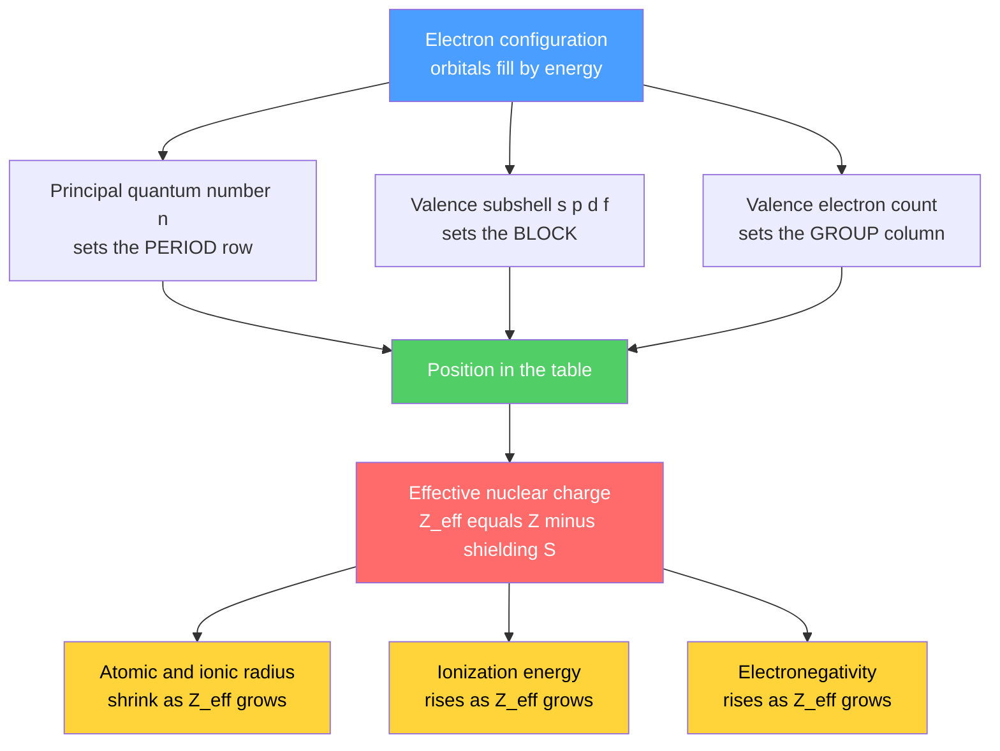

# 🧭 Periodic Table and Periodic Trends

> [!abstract] TL;DR
> The periodic table organizes the elements by **atomic number** into rows (periods) and columns (groups), so that elements with similar valence electron configurations line up and behave chemically alike. Mendeleev (1869) built it from atomic mass and chemical family patterns; Moseley (1913) proved the true ordering variable is the number of protons, $Z$. The block structure (s, p, d, f) is a direct fingerprint of orbital filling. Nearly every trend — atomic radius, ionic radius, ionization energy, electron affinity, electronegativity, metallic character — is explained by a tug-of-war between **effective nuclear charge** $Z_{eff}$ pulling electrons in and the **principal quantum number** $n$ plus **shielding** pushing them out. At the graduate level, $Z_{eff}$ is made quantitative by Slater's rules, and relativistic effects on heavy atoms explain gold's color, mercury's liquidity, and the lanthanide contraction.

## Intuition — analogy FIRST

Imagine a stadium filling from the front rows outward. Every fan (electron) wants a seat as close as possible to the field (the nucleus), because that is where the pull is strongest. The front rows fill first; once they are full, latecomers must sit farther back. Fans in the back can barely feel the field — the crowd in front of them **shields** the attraction. Two things decide how tightly a given fan is held: how strong the field's pull actually reaches them (**effective nuclear charge**), and how far back their row is (**principal quantum number**).

The periodic table is just the seating chart. Read left-to-right along a row and the nuclear pull grows while the row stays the same, so atoms shrink and hold their electrons harder. Drop down a column and you add whole new rows farther out, so atoms swell and lose their outer electrons more easily. Almost every "trend" is one of those two motions.

---

## How It Works



---

## Key Concepts / Details

### Secondary Level

**History.** Dmitri Mendeleev (1869) arranged the 63 known elements in order of increasing **atomic mass**, wrapping the list into rows so that chemically similar elements stacked into columns. His genius was to *leave gaps* rather than force a fit, and to predict the properties of missing elements — his "eka-silicon" was discovered as **germanium** (1886) with almost exactly the predicted density and oxide formula. A few pairs (e.g., Te before I) sat "wrong" by mass. Henry **Moseley** (1913) resolved this: X-ray emission frequencies scale with the nuclear charge, $\sqrt{\nu} \propto (Z - 1)$, proving that the true ordering variable is the **atomic number** $Z$ (proton count), not mass. This is the modern **periodic law**: properties are a periodic function of $Z$.

**Structure.**
- **Periods** — the 7 horizontal rows. The period number equals the highest principal quantum number $n$ of an occupied orbital.
- **Groups / families** — the 18 vertical columns. Members share the same valence configuration and hence similar chemistry.

| Family | Group | Valence | Signature behavior |
|--------|-------|---------|--------------------|
| Alkali metals | 1 | $ns^1$ | Soft, very reactive, form +1 ions |
| Alkaline earth metals | 2 | $ns^2$ | Reactive metals, form +2 ions |
| Transition metals | 3–12 | $(n-1)d^{1-10}ns^{0-2}$ | Variable oxidation states, colored ions |
| Halogens | 17 | $ns^2np^5$ | Reactive nonmetals, form −1 ions |
| Noble gases | 18 | $ns^2np^6$ | Full shell, nearly inert |

**Blocks.** The valence subshell being filled names the block: **s-block** (groups 1–2 + He), **p-block** (groups 13–18), **d-block** (transition metals), **f-block** (lanthanides + actinides). Electron configuration therefore *determines* an element's address: fill orbitals in energy order and the last electron tells you the period, block, and group.

### Undergraduate Level

**Effective nuclear charge.** An outer electron does not feel the full nuclear charge $Z$; inner electrons **shield** it. The net pull is

$$Z_{eff} = Z - S$$

where $S$ is the shielding constant. Across a period, $Z$ rises by one per element while the added electrons enter the *same* shell and shield each other poorly, so $Z_{eff}$ climbs steadily. Down a group, valence electrons occupy higher $n$ (farther out) and are shielded by full inner shells, so the outer $Z_{eff}$ grows only slowly while distance grows fast.

| Trend | Across a period (→) | Down a group (↓) | Cause |
|-------|--------------------|------------------|-------|
| Atomic radius | decreases | increases | $Z_{eff}$ up vs $n$ up |
| First ionization energy | increases | decreases | tighter vs farther valence |
| Electron affinity | more exothermic | less exothermic | $Z_{eff}$ up vs distance up |
| Electronegativity | increases | decreases | same as IE + EA |
| Metallic character | decreases | increases | ease of losing electrons |

**Ionic radius.** Removing electrons (cation) reduces electron–electron repulsion and raises $Z_{eff}$ per remaining electron, so **cation < parent atom**; adding electrons (anion) does the reverse, so **anion > parent atom**. In an **isoelectronic series** (same electron count, e.g., $N^{3-}, O^{2-}, F^-, Ne, Na^+, Mg^{2+}, Al^{3+}$, all with 10 electrons) radius shrinks as $Z$ rises, because more protons reel in the *same* electron cloud: $N^{3-} > O^{2-} > F^- > Ne > Na^+ > Mg^{2+} > Al^{3+}$.

**First ionization energy and its two famous exceptions.** IE generally rises across a period, but the sawtooth has two reproducible dips:

1. **Group 2 → 13** (e.g., $Be \to B$, $Mg \to Al$). The extra electron in group 13 enters a higher-energy $np$ orbital that is shielded by the filled $ns^2$ pair, so it is easier to remove than the $ns$ electron of group 2.
2. **Group 15 → 16** (e.g., $N \to O$, $P \to S$). Group 15 has a stable half-filled $np^3$ set (one electron per orbital, maximal exchange stabilization). Group 16 must place a *second* electron into one $p$ orbital; the added electron–electron repulsion of that pair makes it easier to remove.

**Successive ionization energies** always increase ($IE_1 < IE_2 < IE_3 \dots$), and show a huge jump when the next electron must come from a **noble-gas core**. That jump reveals the group number: sodium's leap after $IE_1$ confirms one valence electron.

**Electronegativity (Pauling scale).** Pauling defined it from bond energies:

$$\chi_A - \chi_B = 0.102\,\sqrt{\Delta}, \qquad \Delta = E_{AB} - \sqrt{E_{AA}\,E_{BB}}\;\;(\text{kJ/mol})$$

Fluorine is the anchor at $\chi = 3.98$; values fall down a group and rise across a period, peaking at the top-right (excluding noble gases).

**Diagonal relationships.** The first element of a group often resembles the *second* element of the next group down and to the right — $Li \sim Mg$, $Be \sim Al$, $B \sim Si$ — because moving down (bigger, less charged) and moving right (smaller, more charged) roughly cancel, giving similar **charge density / ionic potential** $q/r$.

### Graduate Level

**Slater's rules — $Z_{eff}$ made quantitative.** Group the configuration as $[1s]\,[2s,2p]\,[3s,3p]\,[3d]\,[4s,4p]\,[4d]\,[4f]\dots$ To shield an electron in an $ns$ or $np$ orbital:

- other electrons in the **same** group: $0.35$ each (but $0.30$ for $1s$),
- electrons in the $n-1$ shell: $0.85$ each,
- electrons in shells $\le n-2$: $1.00$ each.

For an $nd$ or $nf$ electron, everything to the left contributes $1.00$ and same-group electrons $0.35$.

*Worked example — a 2p electron in oxygen* ($Z=8$, $1s^2 2s^2 2p^4$):

$$S = \underbrace{5(0.35)}_{\text{same shell}} + \underbrace{2(0.85)}_{1s} = 1.75 + 1.70 = 3.45,\qquad Z_{eff} = 8 - 3.45 = 4.55$$

Contrast carbon's 2p electron: $S = 3(0.35) + 2(0.85) = 2.75$, $Z_{eff} = 3.25$. The steady climb in $Z_{eff}$ across period 2 (Li ≈ 1.3 → F ≈ 5.2) is exactly why the atoms contract.

**Relativistic effects on heavy elements.** For high $Z$, inner $1s$ electrons approach speeds where $v/c$ is non-negligible; the relativistic mass increase contracts and stabilizes $s$ (and to a lesser extent $p_{1/2}$) orbitals, while $d$ and $f$ orbitals *expand* because their shielding improves. Consequences:

- **Gold's color** — the relativistic $6s$ contraction lowers the $5d \to 6s$ absorption gap into the blue-violet, so gold reflects yellow instead of being silvery like idealized non-relativistic gold.
- **Mercury's liquidity** — the tightly held, contracted $6s^2$ pair behaves almost like a closed shell, weakening metallic bonding so much that mercury melts at $-39\,^\circ\text{C}$.
- **Lanthanide contraction** — poor shielding by diffuse $4f$ electrons lets $Z_{eff}$ creep up across the lanthanides, shrinking radii so that period-6 transition metals end up nearly the *same size* as their period-5 partners (e.g., $Zr \approx Hf$, $Nb \approx Ta$), which is why those pairs are chemically hard to separate.

```python
# First ionization energy vs atomic number (Z = 1..36):
# reveals the periodic "sawtooth" -- noble-gas peaks and group 2->13 / 15->16 dips.
import numpy as np
import matplotlib.pyplot as plt

Z = np.arange(1, 37)
symbols = ["H","He","Li","Be","B","C","N","O","F","Ne","Na","Mg","Al","Si",
           "P","S","Cl","Ar","K","Ca","Sc","Ti","V","Cr","Mn","Fe","Co","Ni",
           "Cu","Zn","Ga","Ge","As","Se","Br","Kr"]
# First ionization energies in kJ/mol (CRC values)
IE1 = np.array([1312,2372,520,899,801,1086,1402,1314,1681,2081,496,738,578,786,
                1012,1000,1251,1521,419,590,633,659,651,653,717,762,760,737,
                745,906,579,762,947,941,1140,1351])

plt.figure(figsize=(11, 5))
plt.plot(Z, IE1, "-o", color="#333", ms=4, lw=1)

# Noble-gas peaks
for z in [2, 10, 18, 36]:
    plt.scatter(z, IE1[z-1], s=90, color="#4a9eff", zorder=5)
    plt.annotate(symbols[z-1], (z, IE1[z-1]), textcoords="offset points",
                 xytext=(0, 8), ha="center", color="#4a9eff")

# Group 2 -> 13 and 15 -> 16 dips (B, O, Al, S)
for z in [5, 8, 13, 16]:
    plt.scatter(z, IE1[z-1], s=90, color="#ff6b6b", zorder=5)
    plt.annotate(symbols[z-1], (z, IE1[z-1]), textcoords="offset points",
                 xytext=(0, -14), ha="center", color="#ff6b6b")

plt.xlabel("Atomic number Z")
plt.ylabel("First ionization energy (kJ/mol)")
plt.title("Periodic sawtooth: noble-gas peaks (blue), group 2->13 & 15->16 dips (red)")
plt.grid(True, alpha=0.3)
plt.tight_layout()
plt.show()
```

---

## Real-World Notes

- **Predictive chemistry** — Mendeleev's gaps predicted gallium, scandium, and germanium before discovery; the same logic guided the placement of synthetic superheavy elements (oganesson, Z = 118) into period 7.
- **Battery and materials selection** — lithium's tiny radius and low ionization energy give it the highest charge density and cell voltage among alkali metals, the reason it dominates rechargeable batteries.
- **Semiconductors** — group 14 (Si, Ge) sits on the metalloid staircase; its intermediate ionization energy and band gap are precisely what make it a *semi*conductor rather than a metal or insulator.
- **Zr/Hf separation** — the lanthanide contraction makes zirconium and hafnium nearly identical in size, so nuclear-grade Hf-free zirconium requires costly, specialized separation.
- **Catalysis and color** — variable oxidation states of d-block metals (from partially filled d orbitals) underlie industrial catalysts and the vivid colors of transition-metal complexes.
- **Relativistic gold** — the same physics that colors gold enables its use in stable, inert electrical contacts and nanoparticle catalysts.

---

## Common Pitfalls

1. **Ordering by mass, not number** — the table is ordered by $Z$; the Ar/K, Co/Ni, and Te/I "mass inversions" are only anomalies if you cling to Mendeleev's original mass ordering.
2. **Forgetting the two IE dips** — expecting a perfectly monotonic rise across a period misses the group 2→13 (subshell energy) and 15→16 (electron-pair repulsion) exceptions that examiners love.
3. **Confusing atomic radius definitions** — covalent, metallic, and van der Waals radii differ; trends are consistent within one definition but absolute numbers are not comparable across them.
4. **Sign confusion in electron affinity** — many texts report EA as a *released* energy (positive when exothermic) while others report it as $\Delta H$ (negative when exothermic). State your convention.
5. **Ignoring $n$ when reasoning about size down a group** — larger atoms lower down come from higher $n$, not from a smaller $Z_{eff}$; $Z_{eff}$ actually rises slightly down a group.
6. **Treating shielding as perfect** — electrons in the same shell shield each other only partially (~0.35 by Slater), which is exactly why $Z_{eff}$ climbs across a period at all.

---

## Related Concepts

- [[_MOC_General_Chemistry|↑ Section MOC]]
- [[Atomic_Structure_and_Subatomic_Particles]] — protons set $Z$ and thus an element's identity and table position
- [[Chemical_Bonding_and_Molecular_Geometry]] — electronegativity differences (a periodic trend) govern bond polarity and type
- [[Periodic_Trends_and_Main_Group_Chemistry]] — applies these trends to the descriptive chemistry of the s- and p-blocks
- [[Quantum_Chemistry_and_Atomic_Orbitals]] — orbital energies and shapes underpin block structure and shielding
- [[Atomic_Models_and_Spectroscopy]] — Physics: Moseley's law and X-ray spectra that established atomic number
- [[Schrodinger_Equation]] — Physics: solving it for the atom yields the orbitals that build the table
- [[Angular_Momentum_and_Spin]] — Physics: $\ell$ and $m_\ell$ quantum numbers define the s/p/d/f subshells
- [[_MOC_Mathematics_Master]] — Math: the exponential/logarithmic fits used for trend regressions

---

## Review Questions

1. **Secondary**: Using only the periodic table, predict which is larger in each pair and give the reason: (a) Na or Cl, (b) Cl or Br, (c) $Na^+$ or $Na$, (d) $F^-$ or $Ne$.
2. **Undergraduate**: Explain, with electron configurations, why the first ionization energy of oxygen is *lower* than that of nitrogen even though oxygen has a higher nuclear charge. Then explain the analogous $Al < Mg$ dip.
3. **Graduate**: Use Slater's rules to compute $Z_{eff}$ for a $3p$ electron in sulfur and for a $4s$ electron in potassium. Discuss how your $4s$ result relates to the observed ordering of the $4s$ and $3d$ orbitals, and how relativistic corrections would modify $Z_{eff}$ arguments for a $6s$ electron in gold.

---

## Sources

- Petrucci, Herring, Madura, Bissonnette — *General Chemistry: Principles and Modern Applications*, 11th ed., Ch. 8–9
- Atkins & de Paula — *Physical Chemistry*, 11th ed. (atomic structure and periodicity)
- Miessler, Fischer, Tarr — *Inorganic Chemistry*, 5th ed. (Slater's rules, relativistic effects, lanthanide contraction)
- Housecroft & Sharpe — *Inorganic Chemistry*, 4th ed. (periodic trends, diagonal relationships)
- Slater, J. C. (1930) — "Atomic Shielding Constants," *Phys. Rev.* 36, 57
- Pyykkö, P. (1988) — "Relativistic Effects in Structural Chemistry," *Chem. Rev.* 88, 563

#chemistry #general-chemistry #periodic-table #periodic-trends #effective-nuclear-charge #ionization-energy #electronegativity #slaters-rules #relativistic-effects #secondary #undergraduate #graduate
