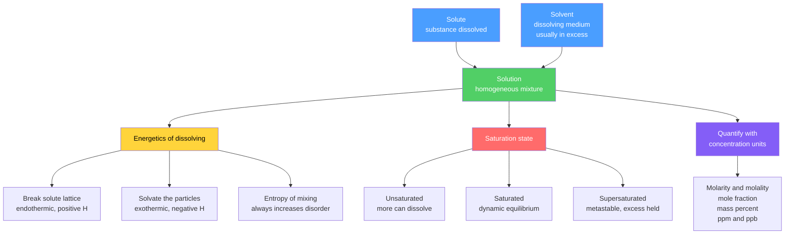

# 🧪 Solutions and Concentration

> [!abstract] TL;DR
> A **solution** is a homogeneous mixture of a **solute** dispersed in a **solvent**. Whether something dissolves is governed by energetics — the interplay of endothermic lattice/bond breaking, exothermic solvation, and the ever-favourable **entropy of mixing** — summarized by the rule *like dissolves like*. **Concentration** quantifies "how much solute per how much solution or solvent," with several interconvertible units: molarity ($M$, mol L⁻¹), molality ($m$, mol kg⁻¹), mole fraction, mass percent, and ppm/ppb. Dilutions follow $M_1V_1 = M_2V_2$. For electrolytes, the **van 't Hoff factor** $i$ counts dissolved particles, and at the graduate level real ions are described by **activities**, **ionic strength**, and the **Debye–Hückel** law.

## Intuition — analogy FIRST

Imagine dropping a sugar cube into hot tea versus dropping a pebble into it. The sugar disappears; the pebble does not. Water molecules, being polar with a positive and negative end, swarm the sugar molecules (also polar, full of –OH groups), surround them, and pull them into the liquid — the pebble's atoms are locked in a rigid, nonpolar lattice that water cannot grip. This is the whole story of dissolving in one image: *the solvent can only pull apart a solute whose particles it can hold onto*. Polar grabs polar, nonpolar grabs nonpolar — **like dissolves like**.

Now picture making lemonade. One spoon of sugar in a glass is weak; ten spoons is syrupy; and if you keep adding, sugar piles undissolved at the bottom — you have hit **saturation**. *Concentration* is just the bookkeeping that turns "weak" and "syrupy" into precise numbers.

---

## How It Works



---

### Secondary Level

**The three players.** The **solute** is what dissolves (present in the smaller amount); the **solvent** does the dissolving (present in excess); the **solution** is the uniform result. Water is the "universal solvent" because it is small and strongly polar.

**Like dissolves like.** Polar and ionic solutes dissolve in polar solvents (NaCl and sugar in water); nonpolar solutes dissolve in nonpolar solvents (oil and grease in hexane). Oil and water refuse to mix because water cannot solvate nonpolar chains.

**Saturation** — three states of a solution:

| State | Meaning | Behaviour |
|-------|---------|-----------|
| Unsaturated | below the solubility limit | more solute will still dissolve |
| Saturated | at the solubility limit | dissolving rate equals crystallizing rate |
| Supersaturated | above the limit, metastable | a seed crystal triggers sudden crystallization |

**Molarity** — the workhorse unit:

$$M = \frac{\text{moles of solute}}{\text{litres of solution}} \qquad [\text{mol L}^{-1}]$$

**Dilution.** Adding solvent lowers concentration but keeps the moles of solute fixed, so:

$$M_1 V_1 = M_2 V_2$$

Example: to make 100 mL of 0.10 M from a 1.0 M stock, $V_1 = M_2V_2/M_1 = (0.10)(100)/1.0 = 10$ mL of stock, topped up to 100 mL.

### Undergraduate Level

**Enthalpy of solution.** Dissolving is a three-step energy cycle:

$$\Delta H_{\text{soln}} = \underbrace{\Delta H_{\text{lattice}}}_{>0,\ \text{break solute}} + \underbrace{\Delta H_{\text{solvation}}}_{<0,\ \text{hydrate ions}}$$

where $\Delta H_{\text{lattice}}$ is the (positive) energy to separate the ionic lattice into gas-phase ions and $\Delta H_{\text{solvation}}$ (called **hydration** in water) is the (negative) energy released when the solvent surrounds those ions. If solvation more than pays the lattice bill, dissolving is exothermic (e.g. CaCl₂ warms); if not, it is endothermic (e.g. NH₄NO₃ cools — the basis of instant cold packs).

**Why endothermic dissolving still happens: entropy.** Mixing scatters solute through the solvent, raising disorder. The spontaneity criterion is $\Delta G = \Delta H_{\text{soln}} - T\Delta S_{\text{mix}}$; a positive $\Delta S_{\text{mix}}$ can drive dissolution even when $\Delta H_{\text{soln}} > 0$. (See [[Entropy_and_Second_Law]] and [[Laws_of_Thermodynamics]] for the free-energy logic.)

**Factors affecting solubility.**
- **Temperature (solids):** most ionic solids grow more soluble as $T$ rises; a few (Na₂SO₄ above 32 °C, Ce₂(SO₄)₃) become *less* soluble.
- **Temperature (gases):** gas solubility *falls* as $T$ rises — warm soda goes flat; warm rivers hold less dissolved O₂.
- **Pressure (gases) — Henry's law:** the dissolved concentration of a gas is proportional to its partial pressure above the liquid:

$$C_{\text{gas}} = k_H\, P_{\text{gas}} \qquad \text{(equivalently } P = K_H\, x_{\text{gas}}\text{)}$$

Pressure has negligible effect on solids and liquids.

**Concentration units and when to use them:**

| Unit | Definition | Formula | Temperature-independent? |
|------|-----------|---------|--------------------------|
| Molarity $M$ | mol solute per L **solution** | $n/V_{\text{soln}}$ | No (volume expands) |
| Molality $m$ | mol solute per kg **solvent** | $n/m_{\text{solvent}}$ | Yes |
| Mole fraction $x_i$ | mol $i$ per total mol | $n_i/n_{\text{total}}$ | Yes |
| Mass percent | mass solute per mass solution | $\tfrac{m_{\text{solute}}}{m_{\text{soln}}}\times 100$ | Yes |
| ppm / ppb | mass ratio $\times 10^6$ / $10^9$ | trace-level mass fraction | Yes |
| Normality $N$ | equivalents per L solution | $N = M \times$ (equiv/mol) | No — **deprecated** |

*Normality* depends on the reaction (H₂SO₄ is 1 M but 2 N in acid–base). IUPAC discourages it; prefer molarity plus a defined reaction.

**Key conversions** (with $\rho$ = solution density in g mL⁻¹, $\mathcal{M}$ = molar mass in g mol⁻¹):

$$m = \frac{1000\,M}{1000\rho - M\,\mathcal{M}_{\text{solute}}}, \qquad x_{\text{solute}} = \frac{m}{m + \dfrac{1000}{\mathcal{M}_{\text{solvent}}}}$$

For **dilute aqueous** solutions ($\rho \approx 1$ g mL⁻¹), ppm $\approx$ mg L⁻¹ and mg kg⁻¹ coincide.

**Electrolytes and the van 't Hoff factor.** **Nonelectrolytes** (glucose, urea) dissolve as intact molecules; **electrolytes** (NaCl, HCl) dissociate into ions. The **van 't Hoff factor**

$$i = \frac{\text{moles of particles in solution}}{\text{moles of formula units dissolved}}$$

is 1 for glucose, ideally 2 for NaCl, 3 for CaCl₂. Real values run slightly below the ideal because of ion pairing — the bridge to colligative properties (full treatment in [[Phase_Equilibria_and_Colligative_Properties]]).

### Graduate Level

**Activity — the "effective" concentration.** In real solutions ions interact electrostatically, so thermodynamic equations use **activity** rather than concentration:

$$a_i = \gamma_i \frac{c_i}{c^\circ}, \qquad c^\circ = 1\ \text{mol kg}^{-1}$$

where $\gamma_i$ is the **activity coefficient** ($\gamma_i \to 1$ as $c_i \to 0$, the ideal-dilute limit). Every $K$, $E$, and $\mu$ in rigorous thermodynamics is written in activities, not molarities.

**Ionic strength** measures the total electrostatic environment:

$$I = \frac{1}{2}\sum_i c_i z_i^2$$

summed over all ions ($z_i$ = charge). A 0.010 mol kg⁻¹ CaCl₂ solution has $I = \tfrac12[(0.010)(2^2) + (0.020)(1^2)] = 0.030$ mol kg⁻¹.

**Debye–Hückel limiting law.** For dilute electrolytes ($I \lesssim 0.01$ mol kg⁻¹), the **mean ionic activity coefficient** $\gamma_\pm$ obeys:

$$\log_{10}\gamma_\pm = -A\,|z_+ z_-|\,\sqrt{I}$$

with $A = 0.509\ \text{(mol kg}^{-1})^{-1/2}$ for water at 25 °C. Because $\gamma_\pm < 1$, ionic clouds lower the effective concentration. At higher $I$ the extended and Davies equations (adding an ion-size term) take over. This deviation from ideality is *why* measured equilibrium constants shift with added inert salt.

```python
# Molarity, single dilution, and serial-dilution calculator (SI units)
def molarity(mass_g, molar_mass, volume_L):
    """mol/L from mass (g), molar mass (g/mol), volume (L)."""
    return (mass_g / molar_mass) / volume_L

def dilute(c1, v1, v2):
    """Apply C1*V1 = C2*V2 -> final concentration when V1 is made up to V2."""
    return c1 * v1 / v2

def serial_dilution(c0, factor, tubes):
    """Concentrations after successive 1:factor dilutions."""
    return [c0 / factor**i for i in range(tubes)]

MW = 58.44  # g/mol, NaCl

# 1) Prepare a stock: 5.85 g NaCl dissolved to make 0.250 L of solution
stock = molarity(5.85, MW, 0.250)
print(f"Stock NaCl: {stock:.4f} M\n")

# 2) One dilution step: 10 mL of stock made up to 100 mL
c2 = dilute(stock, v1=0.010, v2=0.100)
print(f"After 10 mL -> 100 mL: {c2:.4f} M\n")

# 3) Ten-fold serial dilution across 6 tubes
series = serial_dilution(stock, factor=10, tubes=6)
print(f"{'Tube':<5}{'Dilution':<10}{'Molarity (M)':<16}{'ppm (mg/L)':<12}")
print("-" * 43)
for i, c in enumerate(series):
    ppm = c * MW * 1000           # mg/L, valid for dilute aqueous (rho ~ 1 g/mL)
    print(f"{i:<5}{'1:'+str(10**i):<10}{c:<16.6f}{ppm:<12.2f}")
```

---

## Real-World Notes

- **IV saline** is 0.9 % w/v NaCl = 0.154 M — isotonic with blood so red cells neither swell nor shrink. Concentration precision here is literally life-critical.
- **Carbonated drinks** exploit Henry's law: CO₂ is dissolved under ~2–4 atm; opening the can drops $P_{CO_2}$, so dissolved gas escapes as fizz. Warming shifts the balance further toward escape (flat soda).
- **Scuba diving and the bends:** at depth, high pressure forces extra N₂ into the blood (Henry's law); surfacing too fast lets it bubble out — decompression stops let it off-gas slowly.
- **Supersaturation in your kitchen and pocket:** crystallized honey is a supersaturated sugar solution relaxing to equilibrium; reusable "hand-warmer" packs are supersaturated sodium acetate that crystallizes on demand, releasing heat.
- **Environmental limits use ppm/ppb:** the U.S. EPA action level for lead in drinking water is 15 ppb; ocean salinity is ~35 g kg⁻¹ (35 ppt). Trace units keep tiny mass fractions readable.
- **Commercial reagents are labelled by mass percent and density:** concentrated HCl is 37 % (~12 M), concentrated H₂SO₄ is 98 % (~18 M) — you convert to molarity via density to plan a dilution.

---

## Common Pitfalls

1. **Molarity vs molality.** Molarity uses litres of *solution* and drifts with temperature (liquids expand); molality uses kg of *solvent* and does not. Use molality for colligative and thermodynamic work.
2. **"Add X mL of water" ≠ dilute to X mL.** $M_1V_1 = M_2V_2$ needs the *final total volume* $V_2$. Add solvent up to the calibration mark, not a fixed volume of water — the solute also occupies space.
3. **Forgetting $i$ for electrolytes.** Colligative effects scale with *particles*, not formula units: 0.1 m NaCl behaves like ~0.2 m of solute. Omitting $i$ underestimates freezing-point depression and osmotic pressure by up to a factor of 2–3.
4. **ppm ambiguity.** ppm can mean mass/mass, mass/volume, or volume/volume. They agree only for dilute aqueous solutions where $\rho \approx 1$ g mL⁻¹. Always state the basis.
5. **Assuming solubility always rises with temperature.** True for most solids, but gas solubility *falls* with heating, and some salts buck the trend. Never extrapolate a solubility curve blindly.
6. **Using concentration where activity is required.** At appreciable ionic strength, real equilibrium constants and pH deviate from ideal-concentration predictions because $\gamma_\pm < 1$; ignoring activity introduces systematic error.

---

## Related Concepts

- [[_MOC_General_Chemistry|↑ Section MOC]]
- [[Stoichiometry_and_the_Mole]] — the mole and molar mass underpin every concentration calculation
- [[States_of_Matter_and_Gas_Laws]] — Henry's law links gas pressure to dissolved concentration
- [[Chemical_Bonding_and_Molecular_Geometry]] — polarity determines "like dissolves like"
- [[Atomic_Structure_and_Subatomic_Particles]] — ionic charge $z$ sets ionic strength and solvation energy
- [[Periodic_Table_and_Periodic_Trends]] — trends in ionic radius and charge density govern hydration enthalpy
- [[Acids_Bases_and_pH]] — concentration and activity define pH and $K_a$
- [[Phase_Equilibria_and_Colligative_Properties]] — deep dive on how concentration lowers vapour pressure, freezing point, and drives osmosis
- [[Titrations_and_Volumetric_Analysis]] — molarity and dilution applied to quantitative analysis
- [[Chemical_Equilibrium]] — activity-based equilibrium constants for real solutions
- [[Laws_of_Thermodynamics]] — the $\Delta G = \Delta H - T\Delta S$ balance behind spontaneous dissolving (Physics vault)
- [[Entropy_and_Second_Law]] — entropy of mixing as the driving force (Physics vault)
- [[_MOC_Mathematics_Master]] — logarithms and linear algebra used in the Debye–Hückel and conversion algebra (Math vault)

---

## Review Questions

1. **Secondary:** How many grams of glucose ($\mathcal{M} = 180.16$ g mol⁻¹) are needed to prepare 500 mL of a 0.20 M solution? Then describe, in volumes, how to dilute this to 0.050 M in a 250 mL flask.
2. **Undergraduate:** A concentrated H₂SO₄ solution is 98.0 % by mass with density 1.84 g mL⁻¹ ($\mathcal{M} = 98.08$ g mol⁻¹). Compute its molarity, molality, and mole fraction of H₂SO₄. Which unit is temperature-independent, and why?
3. **Graduate:** For 0.010 mol kg⁻¹ CaCl₂ at 25 °C, calculate the ionic strength $I$ and the mean activity coefficient $\gamma_\pm$ from the Debye–Hückel limiting law. Discuss when this law breaks down and which equation you would use instead at $I = 0.5$ mol kg⁻¹.

---

## Sources

- Atkins & de Paula — *Physical Chemistry*, 11th ed., Ch. 5 (properties of solutions) and Ch. 5F (activities)
- Oxtoby, Gillis & Butler — *Principles of Modern Chemistry*, 8th ed., Ch. 11
- Harris — *Quantitative Chemical Analysis*, 9th ed., Ch. 8 (activity and ionic strength)
- IUPAC *Gold Book* — entries for "activity," "ionic strength," "molality," "amount concentration"

#chemistry #general-chemistry #solutions #concentration #molarity #molality #solubility #henryslaw #vanthoff #debyehuckel #secondary #undergraduate #graduate
