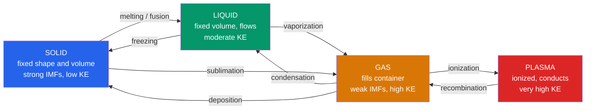

# 🌡️ States of Matter and Gas Laws

> [!abstract] TL;DR
> Matter exists in phases — solid, liquid, gas (and plasma) — set by the tug-of-war between kinetic energy and intermolecular forces. The **kinetic molecular theory (KMT)** pictures a gas as tiny particles in constant random motion, and from it flow all the classical gas laws that combine into the **ideal gas law** $PV = nRT$. Dalton's law handles mixtures, Graham's law handles effusion, and the **van der Waals equation** corrects for the finite size and mutual attraction of real molecules. At the graduate level the **Maxwell–Boltzmann distribution** gives the full spread of molecular speeds, while the **Clausius–Clapeyron relation** and **phase diagrams** describe when matter melts, boils, or turns supercritical.

## Intuition — analogy FIRST

Picture a room full of superballs bouncing at random. In a **solid** the balls are packed and locked, only jiggling in place. Warm them up and they gain enough energy to slide past one another — a **liquid** that flows but stays clumped. Heat more and they fly apart, ricocheting off the walls and each other — a **gas**. The relentless drumming of countless balls against the walls *is* pressure; the average vigor of their motion *is* temperature. Squeeze the room smaller and the drumming grows louder (Boyle); heat the balls and they hit harder and more often (Charles/Gay-Lussac). Every gas law is just bookkeeping on this bouncing crowd.

---

## How It Works



---

## Key Concepts / Details

### Secondary Level

**Kinetic Molecular Theory (KMT) — the five postulates**

1. Gases consist of many particles in constant, random, straight-line motion.
2. The particles' own volume is negligible compared with the container.
3. Collisions are perfectly **elastic** (no kinetic energy lost).
4. There are **no intermolecular forces** between particles.
5. Average kinetic energy is proportional to absolute temperature: $\bar{E}_k = \tfrac{3}{2}k_B T$.

Pressure arises from particles striking the walls; temperature measures their mean kinetic energy — so **doubling the Kelvin temperature doubles the average KE**, not the Celsius reading.

**The classical gas laws** (each holds with the other variables fixed):

| Law | Statement | Held constant |
|-----|-----------|---------------|
| Boyle | $PV = \text{const}$, so $P \propto 1/V$ | $n, T$ |
| Charles | $V \propto T$ | $n, P$ |
| Gay-Lussac | $P \propto T$ | $n, V$ |
| Avogadro | $V \propto n$ | $P, T$ |
| Combined | $\dfrac{PV}{T} = \text{const}$ | $n$ |

**Ideal gas law:** combining all of the above gives
$$PV = nRT$$

The gas constant $R$ in common units:

| $R$ value | Units |
|-----------|-------|
| $8.314$ | $\text{J mol}^{-1}\text{K}^{-1}$ |
| $0.08206$ | $\text{L atm mol}^{-1}\text{K}^{-1}$ |
| $8.314$ | $\text{L kPa mol}^{-1}\text{K}^{-1}$ |
| $62.36$ | $\text{L Torr mol}^{-1}\text{K}^{-1}$ |

At STP (IUPAC: $273.15$ K, $100$ kPa) one mole occupies $22.71$ L; at the older $1$ atm STP it is $22.41$ L. Always convert temperature to **Kelvin** ($T_K = T_C + 273.15$) and use absolute pressure. See [[Stoichiometry_and_the_Mole]] for mole–volume conversions.

### Undergraduate Level

**KMT derivation of pressure.** For $N$ particles of mass $m$ in a cube of volume $V$, averaging over directions gives
$$P = \frac{1}{3}\frac{N m \langle v^2\rangle}{V} \quad\Rightarrow\quad PV = \frac{1}{3}N m \langle v^2\rangle$$
Comparing with $PV = Nk_B T$ yields $\tfrac{1}{2}m\langle v^2\rangle = \tfrac{3}{2}k_B T$ — the microscopic meaning of temperature (see [[Kinetic_Theory_of_Gases]]).

**Dalton's law of partial pressures.** In a mixture each gas exerts the pressure it would alone:
$$P_\text{total} = \sum_i P_i, \qquad P_i = x_i\, P_\text{total}, \qquad x_i = \frac{n_i}{n_\text{total}}$$
where $x_i$ is the mole fraction. Vital when collecting gas over water: subtract the water vapor pressure.

**Graham's law of effusion.** At fixed $T$, lighter molecules effuse faster:
$$\frac{\text{rate}_1}{\text{rate}_2} = \sqrt{\frac{M_2}{M_1}}$$
This underlies uranium isotope enrichment via $\text{UF}_6$ diffusion.

**Real gases and the compressibility factor.** Define
$$Z = \frac{PV}{nRT}$$
For an ideal gas $Z = 1$. When **attractions** dominate (moderate $P$, low $T$) $Z < 1$; when the **finite molecular volume** dominates (high $P$) $Z > 1$.

**van der Waals equation.**
$$\left(P + \frac{a n^2}{V^2}\right)(V - nb) = nRT$$
- $a$ corrects for **intermolecular attraction** — it adds back the pressure lost because molecules pull on each other (larger for polar/large molecules).
- $b$ is the **excluded volume** per mole — the space molecules physically occupy, so the free volume is $V - nb$.

| Gas | $a$ (L² atm mol⁻²) | $b$ (L mol⁻¹) |
|-----|--------------------|----------------|
| He | 0.0346 | 0.0238 |
| N₂ | 1.370 | 0.0387 |
| CO₂ | 3.640 | 0.0427 |
| H₂O | 5.536 | 0.0305 |

### Graduate Level

**Maxwell–Boltzmann speed distribution.** The fraction of molecules with speed near $v$ is
$$f(v) = 4\pi \left(\frac{M}{2\pi RT}\right)^{3/2} v^2 \exp\!\left(-\frac{M v^2}{2RT}\right)$$
with three characteristic speeds:
$$v_p = \sqrt{\frac{2RT}{M}}, \qquad \bar{v} = \sqrt{\frac{8RT}{\pi M}}, \qquad v_\text{rms} = \sqrt{\frac{3RT}{M}}$$
Their fixed ratio is $v_p : \bar{v} : v_\text{rms} = \sqrt{2} : \sqrt{8/\pi} : \sqrt{3} \approx 1.00 : 1.13 : 1.22$. Here $M$ is the **molar** mass in kg/mol and $R$ is in J mol⁻¹ K⁻¹. This distribution is the classical limit of [[Classical_Statistical_Mechanics]].

**Critical constants from van der Waals.** The critical isotherm has an inflection point where $\partial P/\partial V = \partial^2 P/\partial V^2 = 0$, giving
$$V_c = 3nb, \qquad T_c = \frac{8a}{27Rb}, \qquad P_c = \frac{a}{27b^2}$$
so the critical compressibility is a **universal** $Z_c = P_c V_c/(RT_c) = 3/8 = 0.375$ (real gases: $\approx 0.27$–$0.30$). Below $T_c$ the vdW isotherm shows an unphysical loop, corrected by the **Maxwell equal-area construction** into a flat coexistence line.

**Phase diagrams and Clausius–Clapeyron.** A $P$–$T$ diagram maps solid/liquid/gas regions meeting at the **triple point** (all three coexist) and terminating the liquid–gas line at the **critical point**, beyond which a single **supercritical fluid** exists. Along any coexistence line the Clapeyron equation holds, $dP/dT = \Delta H/(T\Delta V)$; for liquid–vapor with $\Delta V \approx V_\text{gas} = RT/P$ this integrates to
$$\ln\frac{P_2}{P_1} = -\frac{\Delta H_\text{vap}}{R}\left(\frac{1}{T_2} - \frac{1}{T_1}\right)$$
This is why water boils below 100 °C on a mountain — lower ambient $P$ meets the vapor-pressure curve at a lower $T$. See [[Phase_Equilibria_and_Colligative_Properties]] and [[Chemical_Thermodynamics]].

```python
import numpy as np
import matplotlib.pyplot as plt

# van der Waals constants for CO2
a = 3.640      # L^2 * atm / mol^2
b = 0.04267    # L / mol
R = 0.08206    # L * atm / (mol * K)

# Critical constants predicted by van der Waals
Tc = 8 * a / (27 * R * b)   # K   (~308 K; real 304 K)
Pc = a / (27 * b**2)        # atm (~73 atm; real 72.8 atm)
Vc = 3 * b                  # L/mol

Vm = np.linspace(0.05, 0.6, 500)   # molar volume (must exceed b)

plt.figure(figsize=(7, 5))
for T in [270, Tc, 350]:
    P_ideal = R * T / Vm
    P_vdw   = R * T / (Vm - b) - a / Vm**2
    line, = plt.plot(Vm, P_vdw, lw=2, label=f'vdW  T={T:.0f} K')
    plt.plot(Vm, P_ideal, '--', color=line.get_color(), alpha=0.5)

plt.scatter([Vc], [Pc], color='k', zorder=5, label='critical point')
plt.ylim(0, 200)
plt.xlabel('Molar volume  $V_m$ (L/mol)')
plt.ylabel('Pressure  P (atm)')
plt.title('CO$_2$: ideal (dashed) vs van der Waals (solid) isotherms')
plt.legend()
plt.grid(alpha=0.3)
plt.tight_layout()
plt.show()
```

---

## Real-World Notes

- **Scuba diving and Boyle's law**: as a diver ascends, ambient pressure drops and lung gas expands — never hold your breath surfacing, or the lungs can rupture.
- **Supercritical CO₂**: above 31 °C and 73.8 bar, CO₂ becomes a supercritical fluid used to decaffeinate coffee and dry-clean without organic solvents — it diffuses like a gas but dissolves like a liquid.
- **Freeze-drying (lyophilization)**: keeping pressure below water's triple point ($611$ Pa, $0.01$ °C) lets ice sublime directly to vapor, preserving vaccines and food.
- **Airbags and stoichiometry**: sodium azide decomposition inflates a bag with a precise mole count of N₂; the ideal gas law sets the deployed volume.
- **Uranium enrichment**: Graham's-law gaseous diffusion of $^{235}\text{UF}_6$ vs $^{238}\text{UF}_6$ (mass ratio only 1.0086) needs thousands of cascade stages.
- **Weather balloons**: launched slack because Charles's/Boyle's laws let the helium expand ~100× as pressure falls in the stratosphere.

---

## Common Pitfalls

1. **Forgetting Kelvin**: gas-law temperature *must* be absolute. Using Celsius (or worse, mixing $\Delta T$ with absolute $T$) is the single most common error.
2. **Mismatched $R$ units**: pick the $R$ whose units match your pressure and volume (atm + L vs Pa + m³ vs kPa + L). A wrong $R$ silently gives an answer off by orders of magnitude.
3. **Gauge vs absolute pressure**: tire and manometer readings are *gauge* pressure; the gas laws need absolute pressure (add ~101.3 kPa).
4. **Ignoring water vapor**: when collecting gas over water, the measured pressure includes water vapor — subtract it via Dalton's law before using $PV=nRT$.
5. **Confusing the three speeds**: $v_\text{rms} > \bar{v} > v_p$. Kinetic energy uses $v_\text{rms}$; reaction/collision rates often use $\bar{v}$; the distribution peaks at $v_p$.
6. **Assuming ideality at high $P$ / low $T$**: near condensation, real gases deviate strongly ($Z \neq 1$) — switch to van der Waals or a compressibility chart.

---

## Related Concepts

- [[_MOC_General_Chemistry|↑ Section MOC]]
- [[Stoichiometry_and_the_Mole]] — the mole and molar volume that feed $n$ into $PV=nRT$
- [[Solutions_and_Concentration]] — gases dissolved in liquids (Henry's law) extend partial pressures to solution
- [[Phase_Equilibria_and_Colligative_Properties]] — phase diagrams, boiling-point elevation, and vapor pressure in depth
- [[Chemical_Thermodynamics]] — $\Delta H_\text{vap}$, entropy of phase change, and the energetics behind Clausius–Clapeyron
- [[Kinetic_Theory_of_Gases]] *(Physics)* — the microscopic derivation of pressure and temperature
- [[Laws_of_Thermodynamics]] *(Physics)* — the energy and entropy framework governing all phase changes
- [[Classical_Statistical_Mechanics]] *(Physics)* — the statistical origin of the Maxwell–Boltzmann distribution
- [[_MOC_Mathematics_Master]] *(Math)* — calculus and probability behind speed distributions and critical-point conditions

---

## Review Questions

1. **Secondary**: A 2.00 L balloon of gas at 300 K and 1.00 atm is cooled to 150 K at constant pressure. What is the new volume, and which gas law did you use?
2. **Undergraduate**: A 5.0 L vessel at 298 K holds 0.20 mol N₂ and 0.30 mol O₂. Find the partial pressure of each gas and the total pressure. Then compute the ratio of their effusion rates.
3. **Graduate**: Starting from $\left(P + a n^2/V^2\right)(V - nb) = nRT$, derive the critical constants $T_c$, $P_c$, $V_c$ using the inflection-point conditions, and show that $Z_c = 3/8$ independent of the gas.

---

## Sources

- Atkins & de Paula — *Physical Chemistry*, 11th ed., Ch. 1 (The properties of gases)
- Oxtoby, Gillis & Butler — *Principles of Modern Chemistry*, Ch. 9–10
- McQuarrie & Simon — *Physical Chemistry: A Molecular Approach*, Ch. 27 (kinetic theory)
- NIST Chemistry WebBook — critical constants and van der Waals parameters

#chemistry #generalchemistry #gaslaws #idealgas #kinetictheory #vanderwaals #maxwellboltzmann #phasediagram #secondary #undergraduate #graduate
