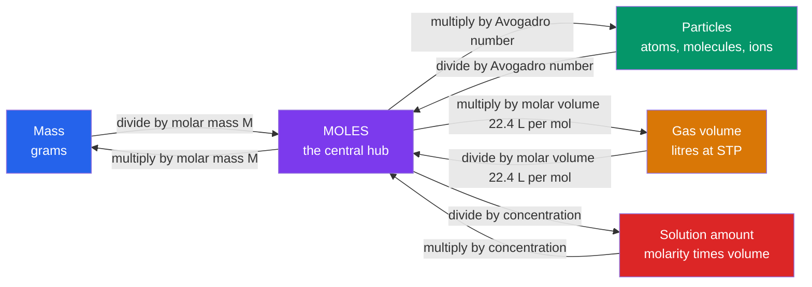

# ⚖️ Stoichiometry and the Mole

> [!abstract] TL;DR
> **Stoichiometry** is the bookkeeping of chemistry — the quantitative accounting of how much reactant becomes how much product, enforced by conservation of mass and atoms. Its unit of currency is the **mole**: since the 2019 SI redefinition, exactly $N_A = 6.02214076\times10^{23}$ elementary entities. The mole is the bridge that lets us weigh matter in grams yet reason about it in countable particles. Every stoichiometric calculation is a chain of unit conversions — **mass ↔ moles ↔ particles ↔ gas volume ↔ solution concentration** — tied together by **mole ratios** read straight from a balanced equation. From this fall out limiting reagents, theoretical and percent yields, empirical formulas, and (at the analytical level) rigorous propagation of measurement uncertainty.

## Intuition — analogy FIRST

A recipe says *"2 eggs + 3 cups flour → 1 cake."* You don't count individual flour molecules; you scale the recipe. If you have 6 eggs but only 3 cups of flour, flour is your **limiting ingredient** — you can bake exactly one cake, and 4 eggs sit unused (the **excess**). Chemistry is identical, except the "recipe" is a balanced equation and the "count" is astronomically large.

Because atoms are far too small to count one by one, chemists count them by weighing — the same way a bank counts coins by weight rather than one at a time. The **mole** is chemistry's "dozen": a fixed pack size ($6.022\times10^{23}$) chosen so that one mole of a substance weighs its atomic/molecular mass *in grams*. That single choice makes the invisible countable.

---

## How It Works

The whole subject reduces to one map. **Moles are always the hub**; you can never convert mass directly to particles or volume — you route through moles.



A **balanced equation** then supplies the *mole ratio* that lets you hop from one substance's moles to another's — the only step that actually involves the chemistry rather than pure arithmetic.

---

## Key Concepts / Details

### Secondary Level

**The mole and Avogadro's number.** One mole contains $N_A = 6.022\times10^{23}$ entities. Molar mass $M$ (units $\text{g mol}^{-1}$) is numerically equal to the atomic or formula mass in unified atomic mass units. The three core conversions:

$$n = \frac{m}{M}, \qquad N = n\,N_A, \qquad V_{gas} = n\,V_m$$

where $n$ = amount (mol), $m$ = mass (g), $N$ = number of particles, and $V_m$ = molar volume.

**Molar volume and STP — read the caveat.** For an ideal gas the molar volume depends on the chosen *standard* temperature and pressure:

| Standard | $T$ | $P$ | $V_m$ |
|----------|-----|-----|-------|
| "Old" STP (pre-1982, still in many syllabi) | $0\,^\circ\text{C}=273.15$ K | $1\ \text{atm}=101.325$ kPa | $22.414\ \text{L mol}^{-1}$ |
| IUPAC STP (since 1982) | $0\,^\circ\text{C}$ | $100$ kPa $=1$ bar | $22.711\ \text{L mol}^{-1}$ |
| SATP (ambient) | $25\,^\circ\text{C}$ | $100$ kPa | $24.79\ \text{L mol}^{-1}$ |

The familiar **22.4 L/mol** is the *old* STP value. Always state which standard you mean.

**Balancing equations.** Adjust coefficients (never subscripts) so each element's atom count is equal on both sides — a direct statement of conservation of mass. Example: $\text{N}_2 + 3\,\text{H}_2 \rightarrow 2\,\text{NH}_3$.

**Percent composition.** The mass fraction of an element in a compound:

$$\%\,X = \frac{(\text{atoms of }X)\times A_X}{M_{compound}}\times 100\%$$

### Undergraduate Level

**Empirical vs molecular formula.** The **empirical formula** is the smallest whole-number atom ratio; the **molecular formula** is a whole-number multiple of it: $\text{molecular} = (\text{empirical})_k$ where $k = M_{molecular}/M_{empirical}$.

*Combustion analysis* is the classic route for a $\text{C}_x\text{H}_y\text{O}_z$ compound. Burn a known mass in excess $\text{O}_2$; all C is captured as $\text{CO}_2$ and all H as $\text{H}_2\text{O}$:

$$m_C = m_{CO_2}\cdot\frac{A_C}{M_{CO_2}}, \qquad m_H = m_{H_2O}\cdot\frac{2A_H}{M_{H_2O}}, \qquad m_O = m_{sample} - m_C - m_H$$

Divide each mass by the atomic mass to get moles, then normalise to the smallest to obtain integer subscripts.

**Reaction stoichiometry via mole ratios.** For $a\,A + b\,B \rightarrow c\,C$, the moles are linked by $\dfrac{n_A}{a} = \dfrac{n_B}{b} = \dfrac{n_C}{c} = \xi$ (the **extent of reaction**, mol). The reagent giving the smallest $\xi$ is **limiting**; all others are in excess.

**Yields.**

$$\text{theoretical yield} = \xi_{limiting}\times c \times M_C, \qquad \%\text{ yield} = \frac{\text{actual}}{\text{theoretical}}\times 100\%$$

**Solution stoichiometry.** Molarity $c = n/V$ (units $\text{mol L}^{-1}$, symbol M). On dilution the amount of solute is conserved, giving the dilution law:

$$c_1 V_1 = c_2 V_2$$

**Gas stoichiometry.** Instead of assuming STP, use the ideal gas law directly to get moles at any conditions:

$$n = \frac{PV}{RT}, \qquad R = 0.082057\ \text{L atm mol}^{-1}\text{K}^{-1} = 8.314\ \text{J mol}^{-1}\text{K}^{-1}$$

### Graduate Level

**Significant figures and uncertainty propagation.** A stoichiometric result is never better than its worst-measured input. For a quantity formed by multiplication and division, $y = k\,x_1^{a}x_2^{b}\cdots$, **relative** standard uncertainties combine in quadrature:

$$\left(\frac{u_y}{y}\right)^2 = a^2\left(\frac{u_{x_1}}{x_1}\right)^2 + b^2\left(\frac{u_{x_2}}{x_2}\right)^2 + \cdots$$

For sums and differences (e.g. $m_O = m_{sample}-m_C-m_H$), **absolute** uncertainties add in quadrature: $u_y^2 = \sum_i u_{x_i}^2$. This is why "oxygen by difference" is the least certain quantity in a combustion analysis — it inherits every other error. The reported figure count should reflect $u_y$, not the calculator's display.

**Back-titration logic.** When an analyte reacts too slowly, is insoluble, or has no sharp endpoint, react it with a *known excess* of standard reagent $R$, then titrate the leftover $R$ with a second standard titrant $T$:

$$n_{analyte} = n_{R,\text{added}} - n_{R,\text{unreacted}} = c_R V_R - c_T V_T\cdot\frac{1}{r}$$

where $r$ is the $R\!:\!T$ mole ratio in the back-titration reaction. This displaces the uncertainty onto two well-defined titrations rather than one ill-behaved endpoint — see [[Titrations_and_Volumetric_Analysis]].

**The 2019 SI redefinition.** The mole was historically defined as the amount of substance containing as many entities as there are atoms in exactly 12 g of carbon-12. Since **20 May 2019**, the mole is defined by *fixing* the numerical value of the Avogadro constant to exactly $6.02214076\times10^{23}\ \text{mol}^{-1}$. Consequences: (i) the mole no longer depends on the kilogram or on a physical carbon sample; (ii) the molar mass of $^{12}\text{C}$ is now $12\ \text{g mol}^{-1}$ only to within a tiny experimental uncertainty ($\sim 4\times10^{-10}$ relative), rather than by definition; (iii) $N_A$ is a defined constant, so the mole is now a *counting* unit on the same footing as "dozen."

---

```python
# Limiting-reagent, theoretical-yield & percent-yield calculator
# Example (balanced): N2 + 3 H2 -> 2 NH3   (Haber–Bosch ammonia synthesis)

# name : (stoich coefficient, molar mass g/mol, mass supplied g)
reactants = {
    "N2": (1, 28.014, 50.0),
    "H2": (3,  2.016, 10.0),
}
product = {"name": "NH3", "coeff": 2, "molar_mass": 17.031}
actual_yield_g = 51.0            # measured mass of product recovered

# Step 1 — moles of each reactant, then extent = moles / coefficient
extent = {}
for name, (coeff, M, mass) in reactants.items():
    extent[name] = (mass / M) / coeff

# Step 2 — the SMALLEST extent identifies the limiting reagent
limiting = min(extent, key=extent.get)
xi = extent[limiting]            # extent of reaction actually achievable (mol)

# Step 3 — theoretical yield of the product, then percent yield
theo_mol = xi * product["coeff"]
theo_g   = theo_mol * product["molar_mass"]
pct      = 100.0 * actual_yield_g / theo_g

# Report as a clean table
print(f"{'Reactant':<9}{'moles':>10}{'extent (mol/coeff)':>22}")
for name, (coeff, M, mass) in reactants.items():
    print(f"{name:<9}{mass / M:>10.4f}{extent[name]:>22.4f}")
print("-" * 41)
print(f"Limiting reagent : {limiting}")
print(f"Theoretical yield: {theo_g:6.2f} g {product['name']}  ({theo_mol:.4f} mol)")
print(f"Actual yield     : {actual_yield_g:6.2f} g")
print(f"Percent yield    : {pct:6.1f} %")

# Expected output:
#   Limiting reagent : H2
#   Theoretical yield:  56.32 g NH3  (3.3069 mol)
#   Percent yield    :   90.6 %
```

---

## Real-World Notes

- **Haber–Bosch process** feeds ~half the world's population. Plants run $\text{H}_2$ in stoichiometric excess relative to $\text{N}_2$ and recycle unreacted gas, so the *practical* limiting reagent and yield are set by equilibrium and catalyst kinetics, not just the feed ratio — see [[Chemical_Equilibrium]].
- **Airbags** deploy on the decomposition $2\,\text{NaN}_3 \rightarrow 2\,\text{Na} + 3\,\text{N}_2$. The mass of sodium azide is chosen by gas stoichiometry so that $n\,RT/P$ inflates the bag to the correct volume in ~30 ms.
- **Pharmaceutical manufacturing** tracks yield at every step; a 10-step synthesis at 90% per step delivers only $0.9^{10}\approx 35\%$ overall, which is why "step economy" dominates process chemistry.
- **Combustion analysis** (CHN elemental analysers) is still the standard purity check for a new organic compound — measured %C/%H/%N must match the proposed molecular formula within ~0.4%.
- **Analytical labs and metrology** rely on back-titration for antacids (excess HCl, back-titrate with NaOH) and on rigorous uncertainty budgets traceable to SI units after the 2019 redefinition.
- **Semiconductor and battery fabs** dose precursor gases by moles via mass-flow controllers using $n = PV/RT$, because gram-scale weighing of reactive gases is impractical.

---

## Common Pitfalls

1. **Converting mass straight to particles (or volume).** There is no direct arrow — you *must* pass through moles. Skipping the hub is the single most common error.
2. **Changing subscripts to balance.** Balancing adjusts **coefficients** only. Altering $\text{H}_2\text{O}$ into $\text{H}_2\text{O}_2$ changes the substance, not the count.
3. **Assuming 22.4 L/mol always applies.** It holds only for an *ideal gas at old STP*. Use $n=PV/RT$ for other conditions; real gases deviate — see [[States_of_Matter_and_Gas_Laws]].
4. **Picking the limiting reagent by mass or by moles alone.** Compare **moles divided by coefficient** (the extent). The reagent present in the smallest *mole amount* is not necessarily limiting.
5. **Percent yield above 100%.** Physically impossible for a clean reaction — it flags a wet/impure product, an unbalanced equation, or a wrong limiting reagent.
6. **False precision.** Reporting "56.3187 g" from data good to three significant figures. The result's uncertainty is dominated by the least precise measurement; round accordingly.

---

## Related Concepts

- [[_MOC_General_Chemistry|↑ Section MOC]]
- [[Atomic_Structure_and_Subatomic_Particles]] — atomic mass and isotopic abundance set the molar masses every calculation depends on
- [[Periodic_Table_and_Periodic_Trends]] — the source of atomic masses used to compute $M$
- [[Chemical_Bonding_and_Molecular_Geometry]] — formulas being weighed here come from bonding rules
- [[States_of_Matter_and_Gas_Laws]] — supplies $PV=nRT$ for gas stoichiometry and the molar volume
- [[Solutions_and_Concentration]] — molarity and the dilution law $c_1V_1=c_2V_2$
- [[Acids_Bases_and_pH]] — neutralisation stoichiometry is the basis of titration
- [[Chemical_Equilibrium]] — why real yields fall short of the theoretical maximum
- [[Titrations_and_Volumetric_Analysis]] — direct and back-titration turn stoichiometry into a measurement tool
- [[Chemical_Thermodynamics]] — extent of reaction $\xi$ reappears as the reaction-coordinate variable
- **Mathematics** — [[_MOC_Mathematics_Master]] — ratios, linear systems (equation balancing), and uncertainty propagation

---

## Review Questions

1. **Secondary**: A student burns 6.0 g of carbon in excess oxygen: $\text{C} + \text{O}_2 \rightarrow \text{CO}_2$. (a) How many moles of carbon is this? (b) What mass of $\text{CO}_2$ forms? (c) What volume does that $\text{CO}_2$ occupy at old STP?
2. **Undergraduate**: Combustion of 0.500 g of a hydrocarbon yields 1.532 g $\text{CO}_2$ and 0.627 g $\text{H}_2\text{O}$. Determine the empirical formula. If the molar mass is ~58 g/mol, what is the molecular formula?
3. **Graduate**: An antacid tablet is dissolved in 50.00 mL of 0.500 M HCl (excess); the leftover acid requires 12.40 mL of 0.480 M NaOH to neutralise. (a) Compute the moles of HCl consumed by the tablet. (b) Given standard uncertainties of 0.05 mL on each volume and 0.2% on each concentration, estimate the relative uncertainty in the answer and state how many significant figures you should report.

---

## Sources

- Atkins & de Paula — *Physical Chemistry*, foundations chapters (mole, gas laws, extent of reaction)
- Zumdahl — *Chemistry*, chapters on stoichiometry, limiting reagents, and empirical formulas
- BIPM — *The International System of Units (SI Brochure)*, 9th ed. (2019 mole redefinition)
- IUPAC Gold Book — definitions of "STP", "amount of substance", "extent of reaction"
- JCGM 100:2008 — *Guide to the Expression of Uncertainty in Measurement (GUM)*

#chemistry #generalchemistry #mole #stoichiometry #limitingreagent #percentyield #avogadro #secondary #undergraduate #graduate
