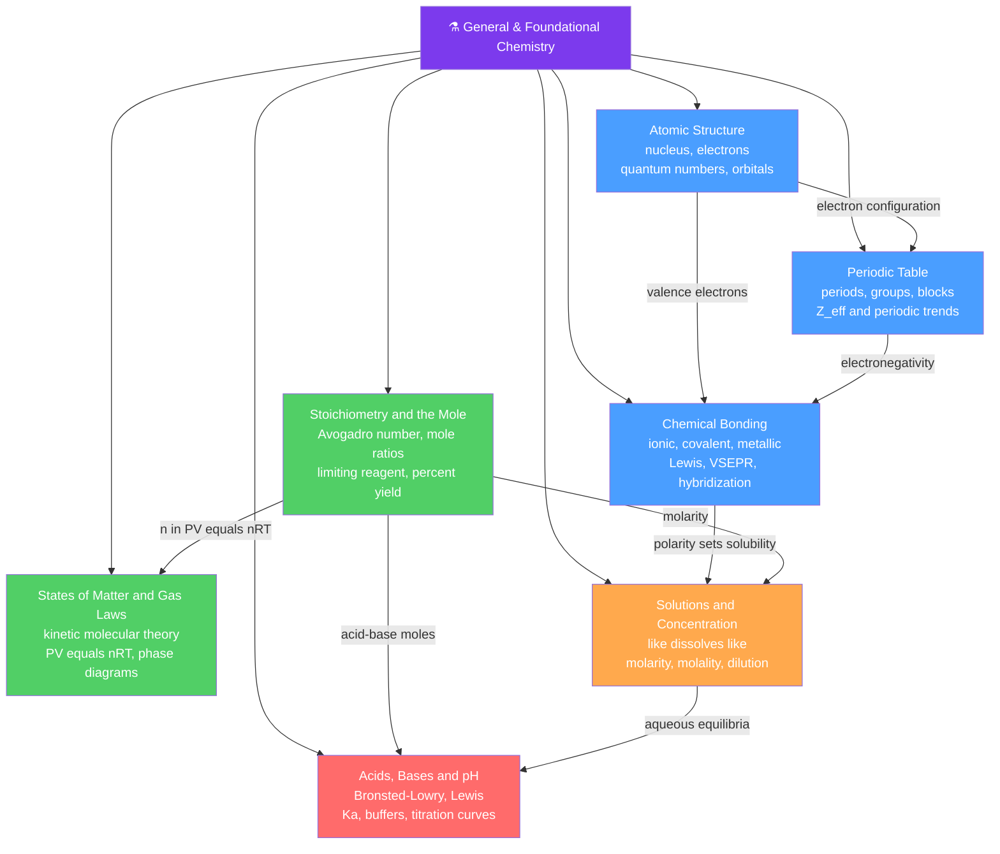

# ⚗️ General & Foundational Chemistry — Map of Content

> [!abstract] What This Section Covers
> This is the bedrock of the whole chemistry vault — the concepts every later section quietly assumes. It starts inside the **atom** (the nucleus, electrons, and the quantum picture that replaced Bohr), organizes the elements into the **periodic table** so their behaviour becomes predictable, then uses that structure to explain **chemical bonding** and 3-D molecular shape. From there it turns quantitative: the **mole** and **stoichiometry** let us count invisible particles by weighing, the **gas laws** and kinetic molecular theory describe matter in motion, **solutions** capture "how much dissolves and how much is present," and **acids, bases, and pH** apply all of it to the proton-transfer chemistry that governs water and life. Every note opens at secondary level with an everyday analogy and builds up to undergraduate — and often graduate — formalism.

## Concept Map

*(Blue = structural foundations · green = quantitative core · orange/red = applied solution chemistry · arrows = "leads to" or "requires")*

---

## Learning Path

*Recommended order for a first pass through this section:*

1. [[Atomic_Structure_and_Subatomic_Particles]] — Start here: protons, neutrons, electrons, isotopes, and the model of the atom from Dalton through the quantum-mechanical orbital picture with four quantum numbers.
2. [[Periodic_Table_and_Periodic_Trends]] — How electron configuration sets an element's position, and how effective nuclear charge explains atomic radius, ionization energy, and electronegativity.
3. [[Chemical_Bonding_and_Molecular_Geometry]] — Why atoms bond, the ionic/covalent/metallic spectrum, Lewis structures, VSEPR shapes, hybridization, and intermolecular forces.
4. [[Stoichiometry_and_the_Mole]] — The mole concept, Avogadro's number, balanced equations and mole ratios, limiting reagents, and theoretical vs percent yield.
5. [[States_of_Matter_and_Gas_Laws]] — Kinetic molecular theory, the combined and ideal gas laws (PV = nRT), Dalton's and Graham's laws, real gases, and phase diagrams.
6. [[Solutions_and_Concentration]] — "Like dissolves like," solubility and saturation, and the interconvertible concentration units (molarity, molality, mole fraction, ppm) plus dilution.
7. [[Acids_Bases_and_pH]] — The three acid–base definitions, the pH scale and Kw, strong vs weak acids with Ka, buffers, and titration curves.

---

## All Notes in This Section

| Note | Core Idea | Difficulty |
|------|-----------|------------|
| [[Atomic_Structure_and_Subatomic_Particles]] | The atom as a dense nucleus in an electron cloud; models from Dalton to Schrödinger, quantum numbers, and orbital energies. | Secondary → Graduate |
| [[Periodic_Table_and_Periodic_Trends]] | Elements ordered by atomic number into periods, groups, and s/p/d/f blocks; trends driven by effective nuclear charge and shielding. | Secondary → Graduate |
| [[Chemical_Bonding_and_Molecular_Geometry]] | Ionic, covalent, and metallic bonding; Lewis structures, VSEPR geometry, hybridization, MO theory, and intermolecular forces. | Secondary → Graduate |
| [[Stoichiometry_and_the_Mole]] | The mole as chemistry's counting unit; mass ↔ moles ↔ particles ↔ volume conversions, mole ratios, limiting reagents, and yield. | Secondary → Graduate |
| [[States_of_Matter_and_Gas_Laws]] | Phases set by kinetic energy vs intermolecular forces; the gas laws, PV = nRT, real-gas corrections, and phase diagrams. | Secondary → Graduate |
| [[Solutions_and_Concentration]] | Homogeneous mixtures, solubility and "like dissolves like," concentration units, dilution, and electrolyte behaviour. | Secondary → Graduate |
| [[Acids_Bases_and_pH]] | Arrhenius, Brønsted–Lowry, and Lewis definitions; the pH scale, Ka/Kb, buffers, and titration curves. | Secondary → Graduate |

---

## Key Questions This Section Answers

- What is inside an atom, and why do the electrons — not the nucleus — decide an element's chemistry?
- Why is the periodic table shaped the way it is, and what single tug-of-war explains almost every periodic trend?
- Why do atoms bond at all, and how can you predict a molecule's 3-D shape from its Lewis structure?
- How can chemists count particles they can never see, and how do balanced equations set the amounts of reactants and products?
- What are pressure and temperature at the level of moving molecules, and why does PV = nRT work so well?
- What makes something dissolve, and how do we turn "weak" and "concentrated" into precise numbers?
- What actually defines an acid or a base, and why is pH a logarithmic scoreboard for free protons?

---

## Connections to Other Sections

- [[_MOC_Chemistry_Master|↑ Chemistry Master MOC]]
- [[_MOC_Physical_Chemistry|→ Physical Chemistry]] — gas laws and the mole feed directly into thermodynamics, kinetics, and equilibrium; acid–base equilibria continue in [[Chemical_Equilibrium]].
- [[_MOC_Analytical_Chemistry|→ Analytical Chemistry]] — stoichiometry and acid–base chemistry underpin [[Titrations_and_Volumetric_Analysis]] and quantitative measurement.
- [[_MOC_Physics_Master|→ Physics]] — the quantum atom and orbitals rest on the [[Schrodinger_Equation]]; the gas laws are the chemical face of the [[Kinetic_Theory_of_Gases]].

#MOC #Chemistry #GeneralChemistry
