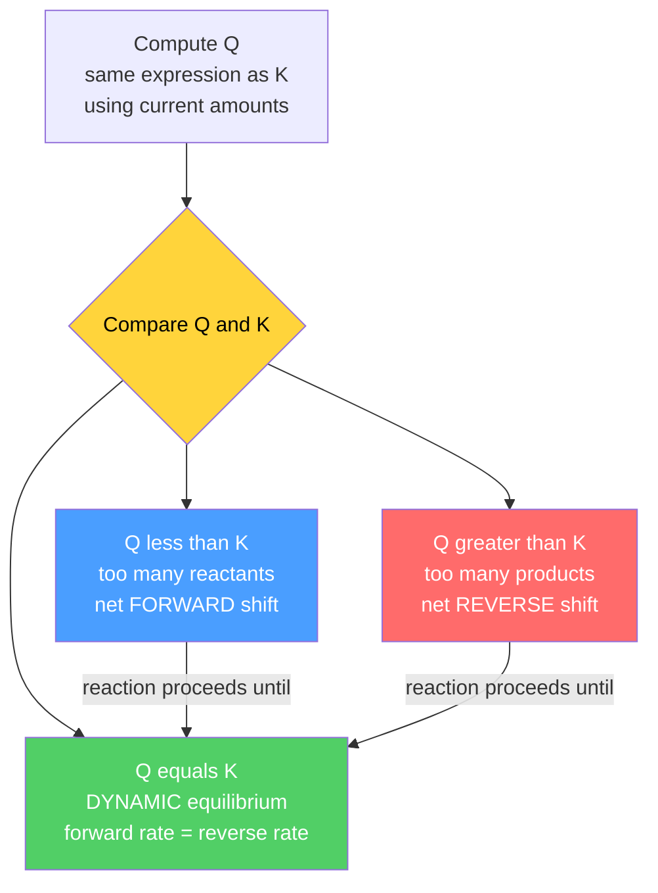

# ⚖️ Chemical Equilibrium

> [!abstract] TL;DR
> A reversible reaction reaches **dynamic equilibrium** when the forward and reverse rates become equal — concentrations stop changing, but molecules keep reacting in both directions. The **law of mass action** captures this balance in an equilibrium constant $K$; the **reaction quotient** $Q$ tells you which way an out-of-balance mixture will move. **Le Chatelier's principle** predicts how a system responds to disturbances, and thermodynamics anchors the whole picture through $\Delta G^\circ = -RT\ln K$. The same framework governs gas reactions ($K_p$), sparingly soluble salts ($K_{sp}$), and — at the graduate level — real solutions described by activities.

## Intuition — analogy FIRST

Picture two adjoining rooms connected by an open doorway, one crowded and one empty. People wander through in both directions. At first the flow is mostly out of the crowded room, but as the empty room fills, more people start wandering back. Eventually the number crossing each way *per minute* becomes equal — the head-count in each room freezes even though people never stop moving through the door. That frozen-but-busy state is **dynamic equilibrium**.

Chemical equilibrium is exactly this: reactants convert to products and products convert back to reactants at the *same rate*. Nothing is stuck or used up — the reaction is running full speed in both directions, and the *ratio* of the crowds is fixed by a single number, the equilibrium constant $K$.

---

## How It Works

The forward and reverse reactions of $aA + bB \rightleftharpoons cC + dD$ both proceed continuously. Equilibrium is the special composition where their rates cancel, so measurable concentrations hold steady. To predict *which direction* a given mixture drifts, compare the reaction quotient $Q$ (the equilibrium expression evaluated at the current, non-equilibrium composition) against $K$:



---

## Key Concepts / Details

### Secondary Level

**Law of mass action.** For $aA + bB \rightleftharpoons cC + dD$ the equilibrium constant in terms of molar concentrations is

$$K_c = \frac{[C]^c\,[D]^d}{[A]^a\,[B]^b}$$

Each concentration is raised to its stoichiometric coefficient. A large $K_c$ ($\gg 1$) means products dominate at equilibrium; a small $K_c$ ($\ll 1$) means reactants dominate. $K$ depends only on **temperature** — not on starting amounts, pressure, or the presence of a catalyst.

**Reaction quotient $Q$.** Same expression as $K$, but evaluated at *any* moment:

| Condition | Meaning | Net direction |
|-----------|---------|---------------|
| $Q < K$ | too few products | forward → |
| $Q = K$ | at equilibrium | none (balanced) |
| $Q > K$ | too many products | reverse ← |

**Le Chatelier's principle.** If a system at equilibrium is disturbed, it shifts to partially oppose the disturbance:

| Disturbance | Shift |
|-------------|-------|
| Add reactant / remove product | toward products (→) |
| Add product / remove reactant | toward reactants (←) |
| Increase pressure (decrease volume) | toward side with fewer gas moles |
| Increase temperature | toward the **endothermic** direction |

**Why a catalyst does not shift equilibrium.** A catalyst lowers the activation energy of the forward *and* reverse steps by the *same* amount, so it speeds both rates equally. Equilibrium is reached faster, but the position ($K = k_f/k_r$) is unchanged.

### Undergraduate Level

**$K_p$ and the $K_c$ relationship.** For gas-phase reactions we can use partial pressures: $K_p = \dfrac{P_C^{c}P_D^{d}}{P_A^{a}P_B^{b}}$. Since $P_i = c_i RT$ for an ideal gas,

$$\boxed{K_p = K_c\,(RT)^{\Delta n}}\qquad \Delta n = (c+d) - (a+b)$$

where $\Delta n$ is the change in moles of **gas**. If $\Delta n = 0$, then $K_p = K_c$.

**Manipulating equilibrium constants.**

| Operation on reaction | Effect on $K$ |
|-----------------------|---------------|
| Reverse the reaction | $K' = 1/K$ |
| Multiply coefficients by $n$ | $K' = K^{\,n}$ |
| Add two reactions | $K_{\text{net}} = K_1\,K_2$ |

**ICE tables.** Tabulate **I**nitial, **C**hange, **E**quilibrium concentrations, let the unknown extent be $x$, and substitute into $K$. Example — $\mathrm{H_2 + I_2 \rightleftharpoons 2\,HI}$:

$$K_c = \frac{(2x)^2}{(A_0-x)(B_0-x)}$$

The **small-$x$ approximation** ($A_0 - x \approx A_0$) is valid when $K$ is very small — a common rule of thumb is $A_0/K \gtrsim 500$, equivalently $x < 5\%$ of $A_0$. Always check the approximation afterward; if it fails, solve the full quadratic.

**Heterogeneous equilibria.** Pure solids and pure liquids have activity $= 1$ and are **excluded** from the equilibrium expression. For $\mathrm{CaCO_3(s) \rightleftharpoons CaO(s) + CO_2(g)}$, simply $K_p = P_{\mathrm{CO_2}}$.

**Solubility product $K_{sp}$.** For a sparingly soluble salt $\mathrm{A}_x\mathrm{B}_y(s) \rightleftharpoons x\,\mathrm{A}^{y+} + y\,\mathrm{B}^{x-}$:

$$K_{sp} = [\mathrm{A}^{y+}]^x\,[\mathrm{B}^{x-}]^y$$

Relating $K_{sp}$ to molar solubility $s$: for $\mathrm{AgCl}$, $K_{sp} = s^2$; for $\mathrm{CaF_2}$, $K_{sp} = (s)(2s)^2 = 4s^3$.

- **Common-ion effect.** Adding an ion already in the equilibrium (e.g. $\mathrm{Cl^-}$ to a $\mathrm{AgCl}$ solution) shifts dissolution backward and *lowers* solubility — a direct Le Chatelier consequence.
- **Predicting precipitation.** Compute the ion product $Q_{sp}$ from the mixed concentrations: $Q_{sp} > K_{sp}$ → precipitate forms; $Q_{sp} = K_{sp}$ → exactly saturated; $Q_{sp} < K_{sp}$ → unsaturated, no solid.

**Thermodynamic link.** Equilibrium is where free energy is minimized (see [[Chemical_Thermodynamics]]):

$$\Delta G = \Delta G^\circ + RT\ln Q$$

At equilibrium $\Delta G = 0$ and $Q = K$, which yields the master equation

$$\boxed{\Delta G^\circ = -RT\ln K}$$

A negative $\Delta G^\circ$ gives $K > 1$ (product-favored). The temperature dependence follows the **van 't Hoff equation**:

$$\frac{d\ln K}{dT} = \frac{\Delta H^\circ}{RT^2}\quad\Longrightarrow\quad \ln\frac{K_2}{K_1} = -\frac{\Delta H^\circ}{R}\left(\frac{1}{T_2}-\frac{1}{T_1}\right)$$

A plot of $\ln K$ vs $1/T$ is linear with slope $-\Delta H^\circ/R$ and intercept $\Delta S^\circ/R$. Exothermic reactions ($\Delta H^\circ < 0$) have $K$ *decreasing* with temperature — consistent with Le Chatelier.

### Graduate Level

**Activities vs concentrations.** The rigorously constant, dimensionless equilibrium constant is defined with **activities**, $a_i = \gamma_i (c_i/c^\circ)$, where $\gamma_i$ is the activity coefficient and $c^\circ = 1\ \mathrm{M}$ the standard state:

$$K = \prod_i a_i^{\nu_i} = \prod_i \left(\gamma_i\frac{c_i}{c^\circ}\right)^{\nu_i}$$

Only this **thermodynamic $K$** is truly constant at fixed $T$. A "constant" computed from raw concentrations drifts with ionic strength because $\gamma_i \ne 1$ in non-ideal solutions; the Debye–Hückel limiting law estimates $\log\gamma_\pm = -A z_+ z_- \sqrt{I}$ for dilute electrolytes, with $\gamma_i \to 1$ as $c \to 0$.

**Coupled / simultaneous equilibria.** When several equilibria share species — solubility modulated by pH, or metal-ion solubility enhanced by complexation ($\mathrm{AgCl(s)} + \mathrm{NH_3} \rightleftharpoons \mathrm{Ag(NH_3)_2^+} + \mathrm{Cl^-}$) — the overall constant is the *product* of the stepwise constants. Solving for concentrations requires the full system: one equation per equilibrium **plus** mass-balance and charge-balance constraints, typically closed numerically.

**Acid–base equilibria** ($K_a$, $K_b$, $K_w$, buffers, titration curves) are a large special case of this framework and are treated in depth in [[Acids_Bases_and_pH]].

```python
import numpy as np

R = 8.314  # J/(mol K)

# --- Part 1: ICE-table solve for  H2 + I2 <=> 2 HI,  Kc = 50.5 ----------------
Kc = 50.5
A0 = B0 = 1.0          # initial [H2], [I2] in mol/L; [HI]0 = 0
# [H2]=A0-x, [I2]=B0-x, [HI]=2x  ->  Kc = (2x)^2 / ((A0-x)(B0-x))
# (4 - Kc) x^2 + Kc(A0+B0) x - Kc*A0*B0 = 0
coeffs = [4 - Kc, Kc * (A0 + B0), -Kc * A0 * B0]
roots = np.roots(coeffs)
x = float(roots[(roots.real > 0) & (roots.real < min(A0, B0))][0].real)

print(f"extent x        = {x:.4f} mol/L")
print(f"[H2] = [I2]     = {A0 - x:.4f} mol/L")
print(f"[HI]            = {2 * x:.4f} mol/L")
print(f"check Kc        = {(2 * x) ** 2 / ((A0 - x) * (B0 - x)):.2f}")

# --- Part 2: van 't Hoff line — recover dH, dS from K(T) ----------------------
dH_true, dS_true = -52_000.0, -25.0          # J/mol, J/(mol K)
T = np.array([500, 600, 700, 800, 900, 1000.0])
K = np.exp(-(dH_true - T * dS_true) / (R * T))   # synthetic K(T)

slope, intercept = np.polyfit(1 / T, np.log(K), 1)  # ln K = (-dH/R)(1/T) + dS/R
dH = -slope * R
dS = intercept * R
print(f"\nvan 't Hoff dH  = {dH/1000:.1f} kJ/mol   (negative -> exothermic)")
print(f"van 't Hoff dS  = {dS:.1f} J/(mol K)")
```

---

## Real-World Notes

- **Haber–Bosch process** ($\mathrm{N_2 + 3H_2 \rightleftharpoons 2NH_3}$, $\Delta H^\circ < 0$, $\Delta n = -2$). Le Chatelier favors high pressure (fewer gas moles) and low temperature — but low $T$ kills the rate, so industry compromises at ~450 °C and ~200 atm with an iron catalyst, and removes ammonia continuously to keep $Q < K$.
- **Blood oxygen transport.** Hemoglobin–$\mathrm{O_2}$ binding is a coupled equilibrium; high $\mathrm{O_2}$ in the lungs shifts loading forward, low $\mathrm{O_2}$ in tissues shifts release — Le Chatelier keeping you alive.
- **Cave formation and hard water.** $\mathrm{CaCO_3(s)} + \mathrm{CO_2} + \mathrm{H_2O} \rightleftharpoons \mathrm{Ca^{2+}} + 2\mathrm{HCO_3^-}$ dissolves limestone; loss of $\mathrm{CO_2}$ reverses it to deposit stalactites — a heterogeneous, $\mathrm{CO_2}$-driven equilibrium.
- **Selective precipitation** in qualitative analysis uses $Q_{sp}$ vs $K_{sp}$: sulfide ion is added slowly so that only cations whose $Q_{sp}$ exceeds their tiny $K_{sp}$ precipitate first, separating metals.
- **Tooth enamel.** $\mathrm{Ca_5(PO_4)_3OH(s)} \rightleftharpoons$ ions; fluoride forms less-soluble fluorapatite (smaller $K_{sp}$), shifting the equilibrium to protect enamel — the chemistry behind fluoridation.
- **Ocean acidification.** Rising atmospheric $\mathrm{CO_2}$ pushes the carbonate equilibria, lowering $[\mathrm{CO_3^{2-}}]$ and undersaturating seawater with respect to $\mathrm{CaCO_3}$, dissolving shells.

---

## Common Pitfalls

1. **Including solids or pure liquids in $K$.** Their activity is 1 — leave them out. $K_p$ for $\mathrm{CaCO_3}$ decomposition is just $P_{\mathrm{CO_2}}$, not divided by any "$[\mathrm{CaCO_3}]$".
2. **Thinking a catalyst increases yield.** It only shortens the *time* to reach equilibrium; $K$ and the equilibrium composition are untouched.
3. **Adding inert gas at constant volume expecting a shift.** At fixed volume, partial pressures (and thus $Q$) are unchanged, so nothing happens. A shift occurs only if added inert gas *increases the volume* at constant total pressure.
4. **Confusing $Q$ and $K$.** $K$ is fixed at a given temperature; $Q$ is the *current* value. Direction is decided by their comparison, never by $K$ alone.
5. **Blindly trusting the small-$x$ approximation.** It fails when $K$ is not small or the initial concentration is low. Always verify $x < 5\%$; otherwise solve the quadratic exactly.
6. **Using the wrong $R$ or units.** In $K_p = K_c(RT)^{\Delta n}$ use $R = 0.08206\ \mathrm{L\,atm\,mol^{-1}K^{-1}}$ with concentrations in mol/L and pressures in atm; in $\Delta G^\circ = -RT\ln K$ use $R = 8.314\ \mathrm{J\,mol^{-1}K^{-1}}$.

---

## Related Concepts

- [[_MOC_Physical_Chemistry|↑ Section MOC]]
- [[Chemical_Thermodynamics]] — supplies $\Delta G^\circ = -RT\ln K$ and the van 't Hoff temperature dependence
- [[Chemical_Kinetics]] — equilibrium is the balance point $k_f/k_r$ of the forward and reverse rate constants
- [[Electrochemistry]] — the Nernst equation is $\Delta G = \Delta G^\circ + RT\ln Q$ recast for redox cells
- [[Acids_Bases_and_pH]] — $K_a$, $K_b$, buffers, and titrations as applied equilibria
- [[Phase_Equilibria_and_Colligative_Properties]] — equilibrium between phases and its effect on solution properties
- [[Solutions_and_Concentration]] — molarity and activity, the quantities that populate $K$ and $Q$
- [[Inorganic_Acids_Bases_and_Redox]] — descriptive precipitation and redox systems governed by $K_{sp}$
- [[Laws_of_Thermodynamics]] (Physics) — the first and second laws underpin the free-energy criterion for equilibrium
- [[Entropy_and_Second_Law]] (Physics) — entropy maximization is the microscopic reason equilibrium exists
- [[_MOC_Mathematics_Master]] (Math) — root-finding and linear regression used to solve ICE and van 't Hoff problems

---

## Review Questions

1. **Secondary:** For $\mathrm{N_2O_4(g) \rightleftharpoons 2NO_2(g)}$ (colorless → brown, endothermic), predict the color change when the sealed tube is (a) heated and (b) compressed. Explain each with Le Chatelier's principle.
2. **Undergraduate:** $\mathrm{H_2 + I_2 \rightleftharpoons 2HI}$ has $K_c = 50.5$ at 731 K. Starting with 1.00 M each of $\mathrm{H_2}$ and $\mathrm{I_2}$, use an ICE table to find all equilibrium concentrations. Then compute $\Delta G^\circ$ at 731 K.
3. **Graduate:** A saturated $\mathrm{CaF_2}$ solution is prepared in 0.10 M $\mathrm{NaF}$. (a) Using $K_{sp} = 3.9\times10^{-11}$, find the molar solubility and quantify the common-ion effect versus pure water. (b) Explain qualitatively how accounting for activity coefficients (nonzero ionic strength) would change your numerical answer.

---

## Sources

- Atkins & de Paula — *Physical Chemistry*, Ch. 6 (Chemical Equilibrium)
- Oxtoby, Gillis & Butler — *Principles of Modern Chemistry*, Ch. 14–16
- Levine — *Physical Chemistry*, Ch. 6 & 11 (equilibrium and activities)
- IUPAC — *Quantities, Units and Symbols in Physical Chemistry* (Green Book), standard-state conventions

---

#chemistry #physical-chemistry #equilibrium #lawofmassaction #lechatelier #solubilityproduct #vanthoff #secondary #undergraduate #graduate
