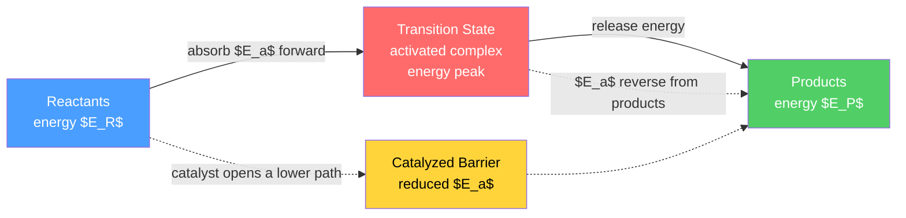

# ⏱️ Chemical Kinetics

> [!abstract] TL;DR
> Chemical kinetics studies *how fast* reactions go and *by what pathway* — questions thermodynamics cannot answer. The rate is captured by an experimentally determined **rate law**, $\text{rate} = k[A]^m[B]^n$, whose **orders** ($m, n$) generally do *not* match the stoichiometric coefficients. The rate constant $k$ obeys the **Arrhenius law** $k = Ae^{-E_a/RT}$, so rates rise sharply with temperature and fall when a catalyst lowers the activation energy $E_a$. At the mechanistic level, reactions proceed through **elementary steps**; the **steady-state** and **pre-equilibrium** approximations turn a proposed mechanism into a testable rate law, and **transition-state (Eyring) theory** connects $k$ to the free energy of the activated complex.

## Intuition — analogy FIRST

Imagine a crowd of hikers trying to get from one valley (reactants) to a lower valley (products) over a mountain pass. **Thermodynamics** only tells you which valley is lower — it says nothing about how long the crossing takes. **Kinetics** is about the *pass itself*: how high it is (the activation energy), how many hikers arrive at the base per second and from the right direction (collision frequency and orientation), and whether someone has built a lower tunnel through the mountain (a catalyst).

Two hikers must collide with enough energy *and* the correct alignment to react — most collisions just bounce off. Heat the system and more hikers carry enough energy to clear the pass, so the rate climbs steeply. That single picture — a barrier, a Boltzmann-weighted fraction that can clear it, and a geometric requirement — underlies almost every equation below.

---

## How It Works



The barrier height sets the *speed*; the difference $E_P - E_R$ sets the *thermodynamics*. A catalyst lowers $E_a$ for **both** directions equally, so it speeds the reaction without shifting the equilibrium position.

---

## Key Concepts / Details

### Secondary Level

**Reaction rate.** The rate is how fast concentration changes with time, defined so that a single number describes the whole reaction regardless of which species you track. For $aA + bB \rightarrow cC + dD$:

$$\text{rate} = -\frac{1}{a}\frac{d[A]}{dt} = -\frac{1}{b}\frac{d[B]}{dt} = +\frac{1}{c}\frac{d[C]}{dt} = +\frac{1}{d}\frac{d[D]}{dt}$$

The stoichiometric divisors make all four expressions numerically equal. Reactants get a minus sign (they are consumed).

**What speeds a reaction up:** higher concentration, higher temperature, greater surface area (for solids), and a catalyst. Each maps to a term in the equations that follow.

**Rate law (introductory).** Rate depends on concentration through a power law, e.g. $\text{rate} = k[A]$. The exponent is the **order**. Crucially, the order is measured in the lab — you cannot read it off the balanced equation.

### Undergraduate Level

**Rate law, rate constant, and order.** For many reactions:

$$\text{rate} = k[A]^m[B]^n, \qquad \text{overall order} = m+n$$

- $k$ is the **rate constant** — independent of concentration but strongly dependent on temperature.
- $m$ and $n$ are the **orders**, determined *experimentally*, not from stoichiometry. (Stoichiometric orders appear only for elementary steps.)
- Units of $k$ depend on the overall order: zero order $\text{mol L}^{-1}\text{s}^{-1}$, first order $\text{s}^{-1}$, second order $\text{L mol}^{-1}\text{s}^{-1}$.

**Method of initial rates.** Run the reaction several times, changing one initial concentration at a time and measuring the initial slope. If doubling $[A]$ doubles the rate, the reaction is first order in $A$; if it quadruples, second order; if unchanged, zero order. The ratio $\text{rate}_2/\text{rate}_1 = ([A]_2/[A]_1)^m$ isolates $m$.

**Integrated rate laws** (single reactant $A$) give concentration versus time, a straight-line diagnostic plot, and a half-life:

| Order | Differential law | Integrated form | Linear plot | Half-life $t_{1/2}$ |
|-------|------------------|-----------------|-------------|---------------------|
| 0 | $-d[A]/dt = k$ | $[A] = [A]_0 - kt$ | $[A]$ vs $t$ | $[A]_0 / 2k$ |
| 1 | $-d[A]/dt = k[A]$ | $\ln[A] = \ln[A]_0 - kt$ | $\ln[A]$ vs $t$ | $\ln 2 / k$ |
| 2 | $-d[A]/dt = k[A]^2$ | $1/[A] = 1/[A]_0 + kt$ | $1/[A]$ vs $t$ | $1/(k[A]_0)$ |

Only the **first-order** half-life is independent of the starting concentration — the hallmark of first-order (and of radioactive) decay.

**Temperature dependence — Arrhenius.**

$$k = A\,e^{-E_a/RT} \quad\Longleftrightarrow\quad \ln k = \ln A - \frac{E_a}{R}\cdot\frac{1}{T}$$

Plotting $\ln k$ against $1/T$ (an **Arrhenius plot**) gives a straight line of slope $-E_a/R$ and intercept $\ln A$. The pre-exponential factor $A$ is the collision-frequency term; $e^{-E_a/RT}$ is the Boltzmann fraction of collisions energetic enough to react. A useful rule of thumb: near room temperature many reactions roughly double in rate per $10\,\text{K}$.

**Collision theory.** Rate $\propto Z \cdot p \cdot e^{-E_a/RT}$, where $Z$ is the collision frequency and $p$ is the **steric factor** ($0 < p \le 1$) accounting for the fraction of collisions with correct orientation. Small $p$ (e.g. $10^{-5}$ for reactions needing precise alignment) explains why measured $A$ is often far below the collision frequency.

**Transition-state (Eyring) theory.** Reactants form an activated complex in quasi-equilibrium at the barrier top:

$$k = \frac{k_B T}{h}\,e^{-\Delta G^\ddagger/RT} = \frac{k_B T}{h}\,e^{\Delta S^\ddagger/R}\,e^{-\Delta H^\ddagger/RT}$$

The entropy of activation $\Delta S^\ddagger$ plays the role of the steric factor: a highly ordered transition state (negative $\Delta S^\ddagger$) suppresses the rate.

**Mechanisms.** An overall reaction is a sequence of **elementary steps**. The **molecularity** of an elementary step (uni-, bi-, ter-molecular) equals the number of species colliding and *does* set that step's rate law. The slowest step is the **rate-determining step (RDS)**; species produced then consumed are **intermediates** (never appear in the overall equation).

*Steady-state approximation.* For a reactive intermediate $I$, set $d[I]/dt \approx 0$. Example — decomposition $2O_3 \rightarrow 3O_2$:

$$O_3 \underset{k_{-1}}{\overset{k_1}{\rightleftharpoons}} O_2 + O, \qquad O + O_3 \xrightarrow{k_2} 2O_2$$

Steady state on the atomic-oxygen intermediate $O$:

$$[O] = \frac{k_1[O_3]}{k_{-1}[O_2] + k_2[O_3]} \;\Rightarrow\; \text{rate} = k_2[O][O_3] = \frac{k_1 k_2[O_3]^2}{k_{-1}[O_2] + k_2[O_3]}$$

The measured $[O_2]$-inhibition confirms this mechanism.

*Pre-equilibrium.* If a fast reversible step precedes a slow one, treat it as equilibrated. For $2NO + O_2 \rightarrow 2NO_2$ via $NO + NO \rightleftharpoons N_2O_2$ (fast, $K$) then $N_2O_2 + O_2 \xrightarrow{k_2} 2NO_2$ (slow):

$$\text{rate} = k_2 K [NO]^2[O_2]$$

— third order overall, matching experiment, and explaining the reaction's unusual *negative* temperature dependence (the equilibrium constant $K$ falls with $T$).

**Catalysis.** A catalyst provides an alternative path with lower $E_a$, unchanged for reactants and products. Types: **homogeneous** (same phase, e.g. acid catalysis), **heterogeneous** (different phase, e.g. Pt surface adsorbing gases), and **enzymatic** (biological). None alters $\Delta G$ or the equilibrium constant — only the *approach* to equilibrium.

### Graduate Level

**Lindemann–Hinshelwood unimolecular kinetics.** How can a "unimolecular" decomposition need a collision to supply activation energy? A molecule is collisionally excited, then either de-excited or reacts:

$$A + M \underset{k_{-1}}{\overset{k_1}{\rightleftharpoons}} A^* + M, \qquad A^* \xrightarrow{k_2} P$$

Steady state on the energized species $A^*$ gives

$$\text{rate} = \frac{k_1 k_2 [A][M]}{k_{-1}[M] + k_2}$$

- **High-pressure limit** ($[M]$ large): $\text{rate} = \dfrac{k_1 k_2}{k_{-1}}[A]$ — first order.
- **Low-pressure limit** ($[M]$ small): $\text{rate} = k_1[A][M]$ — second order.

The observed fall-off in the effective first-order $k_{\text{uni}}$ as pressure drops is a signature of this scheme; the RRKM theory refines it with energy-dependent microcanonical rates.

**Kinetic isotope effects (KIE).** Replacing $\text{H}$ with $\text{D}$ slows a reaction if that bond breaks in the RDS, because the heavier isotope has a lower zero-point energy and therefore a *higher* effective barrier:

$$\frac{k_H}{k_D} \approx \exp\!\left[\frac{h(\nu_H - \nu_D)}{2k_B T}\right]$$

A **primary KIE** ($k_H/k_D \approx 6\text{–}8$ at $298\,\text{K}$ for $\text{C–H}$ vs $\text{C–D}$) is strong evidence that the bond to hydrogen is cleaved in the transition state; small **secondary KIEs** report on hybridization changes. Unusually large values ($>10$) signal quantum-mechanical tunnelling.

**Enzyme catalysis** is the biological extreme of rate enhancement (factors up to $\sim 10^{17}$) and is treated separately via Michaelis–Menten and steady-state analysis in [[Enzyme_Kinetics_and_Catalysis]]; the metal-centre reactivity behind many catalysts is developed in [[Coordination_Chemistry_and_Ligand_Field_Theory]].

```python
import numpy as np
import matplotlib.pyplot as plt

# Simulate first- and second-order decay of A, then linearize to recover k
A0 = 1.0          # initial concentration (mol/L)
k1 = 0.35         # first-order rate constant (1/s)
k2 = 0.90         # second-order rate constant (L/mol/s)
t  = np.linspace(0, 12, 200)

A_first  = A0 * np.exp(-k1 * t)        # ln[A] = ln[A]0 - k t
A_second = A0 / (1 + k2 * A0 * t)      # 1/[A] = 1/[A]0 + k t

fig, ax = plt.subplots(2, 2, figsize=(11, 8))

ax[0, 0].plot(t, A_first,  label='first order')
ax[0, 0].plot(t, A_second, label='second order')
ax[0, 0].set(xlabel='t (s)', ylabel='[A] (mol/L)', title='Concentration vs time')
ax[0, 0].legend(); ax[0, 0].grid(alpha=0.3)

# First-order plot is straight only in ln[A]; slope = -k1
ax[0, 1].plot(t, np.log(A_first))
ax[0, 1].set(xlabel='t (s)', ylabel='ln[A]', title='First order: straight line, slope = -k')
ax[0, 1].grid(alpha=0.3)

# Second-order plot is straight only in 1/[A]; slope = +k2
ax[1, 0].plot(t, 1 / A_second, color='C1')
ax[1, 0].set(xlabel='t (s)', ylabel='1/[A]', title='Second order: straight line, slope = +k')
ax[1, 0].grid(alpha=0.3)

# Recover the constants by regression on the CORRECT linearized variable
k1_fit = -np.polyfit(t, np.log(A_first), 1)[0]
k2_fit =  np.polyfit(t, 1 / A_second, 1)[0]
half1  = np.log(2) / k1_fit
ax[1, 1].axis('off')
ax[1, 1].text(0.05, 0.55,
    f"Recovered k (1st) = {k1_fit:.3f} /s\n"
    f"Recovered k (2nd) = {k2_fit:.3f} L/mol/s\n"
    f"First-order t_1/2 = ln2/k = {half1:.3f} s",
    fontsize=12, family='monospace')

plt.tight_layout()
plt.show()
```

---

## Real-World Notes

- **Stratospheric ozone**: the Chapman cycle plus catalytic destruction — a single $\text{Cl}$ radical destroys thousands of $O_3$ molecules because it is regenerated each cycle — is pure catalytic kinetics and drove the Montreal Protocol.
- **Haber–Bosch ammonia synthesis**: an iron catalyst lowers $E_a$ for splitting the very stable $\text{N}\equiv\text{N}$ bond, making industrial nitrogen fixation (and modern agriculture) feasible.
- **Automotive catalytic converters**: Pt/Pd/Rh surfaces provide heterogeneous catalysis, oxidizing $\text{CO}$ and hydrocarbons and reducing $\text{NO}_x$ far faster than the uncatalyzed gas-phase reactions.
- **Food and drug shelf life**: refrigeration exploits Arrhenius — dropping temperature exponentially slows spoilage reactions. Pharmaceutical "accelerated aging" fits $k$ vs $T$ to predict room-temperature shelf life from high-temperature data.
- **Explosives and combustion**: chain-branching mechanisms (each step producing more radicals than it consumes) cause the rate to run away, the kinetic signature of an explosion.
- **Atmospheric smog**: photochemically initiated radical chains involving $\text{NO}_2$ and volatile organics illustrate steady-state intermediates on an urban scale.

---

## Common Pitfalls

1. **Order equals the stoichiometric coefficient.** False for overall reactions — orders are experimental. Coefficients set the rate law *only* for elementary steps.
2. **Quoting $k$ without a temperature.** The rate constant is temperature-dependent; a value of $k$ is meaningless unless $T$ is stated.
3. **Confusing molecularity with order.** Molecularity is a theoretical property of an *elementary* step (integer, from the mechanism); order is an *empirical* property of the overall rate law (can be fractional or negative).
4. **Assuming every half-life is constant.** Only first-order $t_{1/2}$ is concentration-independent; zero- and second-order half-lives change as the reaction proceeds.
5. **Thinking a catalyst shifts equilibrium.** It lowers $E_a$ equally in both directions, accelerating the *approach* to equilibrium but leaving $K$ and $\Delta G$ untouched — see [[Chemical_Equilibrium]].
6. **Linearizing with the wrong variable.** Data will look "straight enough" on several plots; identify the order by which transform ($[A]$, $\ln[A]$, or $1/[A]$) gives the *best* straight line, not the first one you try.

---

## Related Concepts

- [[_MOC_Physical_Chemistry|↑ Section MOC]]
- [[Chemical_Thermodynamics]] — tells you *whether* a reaction is favorable ($\Delta G$); kinetics tells you *how fast* it gets there.
- [[Chemical_Equilibrium]] — the endpoint kinetics approaches; $K = k_{\text{fwd}}/k_{\text{rev}}$ links the two.
- [[Electrochemistry]] — electrode reaction rates follow Butler–Volmer kinetics, an activated-barrier law with an applied-potential term.
- [[Enzyme_Kinetics_and_Catalysis]] — Michaelis–Menten and biological catalysis, the deep dive on enzyme rate enhancement.
- [[Coordination_Chemistry_and_Ligand_Field_Theory]] — metal centres that make many industrial and biological catalysts work.
- [[Quantum_Chemistry_and_Atomic_Orbitals]] — the electronic structure underlying transition states and reaction barriers.
- [[Molecular_Spectroscopy_and_Symmetry]] — spectroscopic monitoring provides the concentration-vs-time data kinetics is built on.
- [[Phase_Equilibria_and_Colligative_Properties]] — phase and solution behavior that sets the medium in which reactions run.
- [[Kinetic_Theory_of_Gases]] (Physics) — supplies the collision frequency and Maxwell–Boltzmann speed distribution behind collision theory.
- [[Laws_of_Thermodynamics]] (Physics) — the energetic constraints kinetics operates within; barriers do not violate energy conservation.
- [[Classical_Statistical_Mechanics]] (Physics) — the Boltzmann factor $e^{-E_a/RT}$ and partition functions ground Arrhenius and Eyring theory.
- [[_MOC_Mathematics_Master]] (Math) — differential equations and linear regression are the mathematical machinery of integrated rate laws.

---

## Review Questions

1. **Secondary**: A reaction is found to be first order in $A$. If the initial concentration of $A$ is halved, what happens to the initial rate? If instead the reaction were second order in $A$, how would the rate change?
2. **Undergraduate**: Given initial-rate data where doubling $[A]$ quadruples the rate and doubling $[B]$ leaves the rate unchanged, write the rate law, state the overall order, and give the units of $k$. Then explain how you would confirm the order in $A$ from a single concentration-vs-time run.
3. **Graduate**: Derive the Lindemann–Hinshelwood rate expression for a unimolecular reaction using the steady-state approximation, and show explicitly how it reduces to first-order behavior at high pressure and second-order behavior at low pressure. What experimental observation ("fall-off") supports this mechanism?

---

## Sources

- Atkins & de Paula — *Physical Chemistry*, Ch. on Chemical Kinetics and Reaction Dynamics
- Laidler — *Chemical Kinetics*, 3rd ed. (classic mechanistic treatment)
- House — *Principles of Chemical Kinetics*, 2nd ed.
- Levine — *Physical Chemistry*, kinetics chapters (Eyring theory, KIE)
- Steinfeld, Francisco & Hase — *Chemical Kinetics and Dynamics* (Lindemann, RRKM)

#chemistry #physical-chemistry #kinetics #ratelaw #arrhenius #transitionstate #mechanisms #catalysis #secondary #undergraduate #graduate
