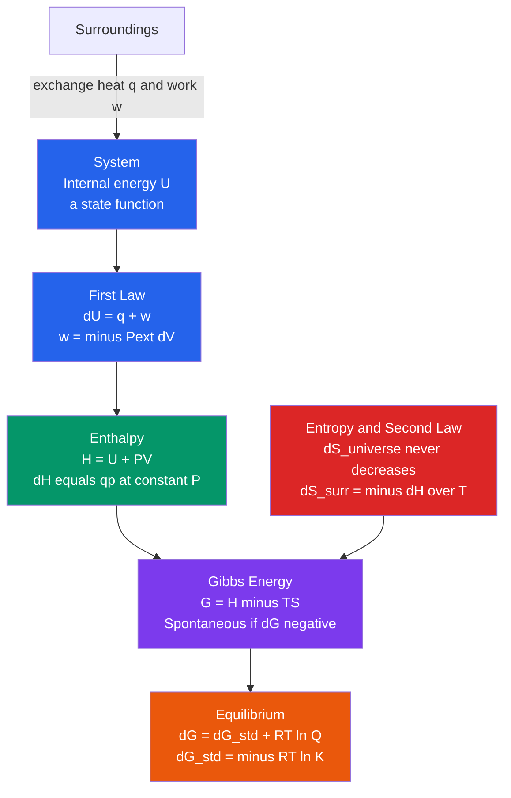

# 🔥 Chemical Thermodynamics

> [!abstract] TL;DR
> Chemical thermodynamics predicts **whether a reaction can happen** (not how fast) from a few state functions. The first law, $\Delta U = q + w$, is energy conservation with the **chemistry sign convention** ($w$ = work done *on* the system). Enthalpy $H = U + PV$ makes $\Delta H$ the heat exchanged at constant pressure, so heats of reaction add via **Hess's law**. Entropy encodes the second law ($\Delta S_{univ} \geq 0$), and combining both gives the **Gibbs free energy** $G = H - TS$: a reaction is spontaneous exactly when $\Delta G < 0$, and equilibrium is reached when $\Delta G = 0$, linking thermodynamics to the equilibrium constant via $\Delta G^\circ = -RT\ln K$.

## Intuition — analogy FIRST

Think of a business deciding whether to launch a product. **Enthalpy** ($\Delta H$) is the cash cost — releasing energy (exothermic, $\Delta H < 0$) is like a profitable venture that pays you upfront. **Entropy** ($\Delta S$) is freedom of movement — a product that gives customers more options (more microstates, $\Delta S > 0$) tends to spread on its own. **Temperature** is how much you weight freedom over cash: at low $T$ money dominates, at high $T$ freedom dominates.

The **Gibbs free energy** $\Delta G = \Delta H - T\Delta S$ is the single ledger that combines both. If the net is negative, the deal goes through spontaneously — nature "signs the contract." Crucially, "spontaneous" says *nothing* about speed: diamond turning to graphite has $\Delta G < 0$ but takes eons. That rate question belongs to [[Chemical_Kinetics]].

---

## How It Works



---

## Key Concepts / Details

### Secondary Level

**System, surroundings, universe.** The **system** is the reacting mixture; the **surroundings** are everything else; together they form the **universe**. A property is a **state function** (depends only on current state, not history) if its change is path-independent — $U$, $H$, $S$, $G$, $T$, $P$, $V$ all qualify. Heat $q$ and work $w$ are **path functions**: they depend on *how* you get there.

**First law (chemistry convention).**

$$\Delta U = q + w$$

- $q$ = heat **absorbed by** the system (positive = flows in)
- $w$ = work done **on** the system (positive = surroundings compress it)

> [!warning] Sign convention
> Chemistry writes $\Delta U = q + w$ with $w$ = work done *on* the system. Physics texts, including [[Laws_of_Thermodynamics]], write $\Delta U = Q - W$ with $W$ = work done *by* the system. The two are identical once you note $w_{chem} = -W_{phys}$. Always state which you use.

**Work of expansion.** When a gas pushes back the surroundings at external pressure $P_{ext}$:

$$w = -P_{ext}\,\Delta V$$

Expansion ($\Delta V > 0$) gives $w < 0$: the system loses energy doing work on the surroundings.

**Enthalpy.** Define $H = U + PV$. At constant pressure, $q_p = \Delta U + P\Delta V = \Delta H$. So the heat you measure in an open beaker *is* $\Delta H$. Exothermic $\Rightarrow \Delta H < 0$; endothermic $\Rightarrow \Delta H > 0$.

### Undergraduate Level

**Calorimetry.** A bomb calorimeter (constant $V$) measures $q_V = \Delta U$; a coffee-cup calorimeter (constant $P$) measures $q_P = \Delta H$. They differ by $\Delta H = \Delta U + \Delta(PV) \approx \Delta U + \Delta n_{gas}RT$ for ideal gases.

**Standard enthalpies of formation and Hess's law.** $\Delta_f H^\circ$ is the enthalpy to form one mole of a substance from its elements in standard states (defined as $0$ for elements). Because $H$ is a state function:

$$\Delta_r H^\circ = \sum_{prod}\nu\,\Delta_f H^\circ - \sum_{react}\nu\,\Delta_f H^\circ$$

**Bond enthalpies** give a rough estimate: $\Delta_r H \approx \sum D(\text{bonds broken}) - \sum D(\text{bonds formed})$.

**Entropy and the second law.** Standard molar entropies $S^\circ$ are absolute (third-law referenced to $S=0$ for a perfect crystal at $0\,\text{K}$), so $\Delta_r S^\circ = \sum_{prod}\nu S^\circ - \sum_{react}\nu S^\circ$. The universe's entropy governs spontaneity:

$$\Delta S_{univ} = \Delta S_{sys} + \Delta S_{surr} \geq 0, \qquad \Delta S_{surr} = -\frac{\Delta H_{sys}}{T}$$

**Gibbs free energy.** Multiplying $\Delta S_{univ} \geq 0$ by $-T$ (at constant $T, P$) gives $\Delta G_{sys} = -T\,\Delta S_{univ} \leq 0$, where

$$\Delta G = \Delta H - T\Delta S, \qquad \boxed{\text{spontaneous} \iff \Delta G < 0}$$

The four sign combinations and their temperature dependence:

| $\Delta H$ | $\Delta S$ | Behaviour of $\Delta G$ | Spontaneous when |
|:---:|:---:|:---|:---|
| $-$ | $+$ | always negative | all $T$ |
| $+$ | $-$ | always positive | never |
| $-$ | $-$ | negative at low $T$ | $T < \Delta H/\Delta S$ |
| $+$ | $+$ | negative at high $T$ | $T > \Delta H/\Delta S$ |

The **crossover temperature** where spontaneity switches is $T_{cross} = \Delta H / \Delta S$ (where $\Delta G = 0$).

**Link to equilibrium.** Away from standard conditions the reaction quotient $Q$ enters:

$$\Delta G = \Delta G^\circ + RT\ln Q$$

At equilibrium $\Delta G = 0$ and $Q = K$, giving the central bridge to [[Chemical_Equilibrium]]:

$$\Delta G^\circ = -RT\ln K$$

### Graduate Level

**Chemical potential.** For open or multicomponent systems, $G$ depends on composition through the chemical potential

$$\mu_i = \left(\frac{\partial G}{\partial n_i}\right)_{T,P,\,n_{j\neq i}}, \qquad dG = -S\,dT + V\,dP + \sum_i \mu_i\,dn_i$$

$\mu_i$ is a **partial molar** Gibbs energy; at constant $T,P$ the components obey the **Gibbs–Duhem** relation $\sum_i n_i\,d\mu_i = 0$. Equilibrium is $\sum_i \nu_i \mu_i = 0$, and for an ideal mixture $\mu_i = \mu_i^\circ + RT\ln a_i$ recovers $\Delta G^\circ = -RT\ln K$.

**Gibbs–Helmholtz equation.** The temperature dependence of $G/T$ is set by enthalpy alone:

$$\left(\frac{\partial (G/T)}{\partial T}\right)_P = -\frac{H}{T^2} \;\;\Longrightarrow\;\; \left(\frac{\partial (\Delta G^\circ/T)}{\partial T}\right)_P = -\frac{\Delta H^\circ}{T^2}$$

Substituting $\Delta G^\circ = -RT\ln K$ yields the **van 't Hoff equation** $\dfrac{d\ln K}{dT} = \dfrac{\Delta H^\circ}{RT^2}$ — the thermodynamic backbone of [[Chemical_Equilibrium]].

**Statistical-mechanical origin.** Thermodynamic potentials are logs of partition functions. In the canonical ensemble the Helmholtz energy is $A = -k_B T\ln Z$, and for an ideal gas of independent molecules the chemical potential is $\mu = -k_B T\ln(q/N)$, where $q$ is the molecular partition function. The equilibrium constant follows directly from molecular partition functions, $K = \prod_i (q_i/N_A V)^{\nu_i}\,e^{-\Delta E_0/RT}$ — the macroscopic $\Delta G^\circ$ is a bookkeeping of microscopic energy levels and degeneracies (see [[Classical_Statistical_Mechanics]]).

```python
# Plot Gibbs energy of reaction vs temperature and locate the crossover
# Reaction: CaCO3(s) -> CaO(s) + CO2(g)  (limestone calcination)
import numpy as np
import matplotlib.pyplot as plt

dH = 178.3e3      # J/mol, endothermic (bonds broken > formed)
dS = 160.6        # J/(mol.K), entropy rises (gas released)
R  = 8.314        # J/(mol.K)

T = np.linspace(300, 1600, 400)          # K
dG = dH - T * dS                          # J/mol, assuming dH, dS ~ const

T_cross = dH / dS                         # spontaneity switches where dG = 0
print(f"Crossover temperature: {T_cross:.0f} K  ({T_cross-273.15:.0f} degC)")

plt.figure(figsize=(7, 5))
plt.plot(T, dG/1000, lw=2, label=r'$\Delta G = \Delta H - T\,\Delta S$')
plt.axhline(0, color='k', lw=1)
plt.axvline(T_cross, ls='--', color='crimson',
            label=f'$T_{{cross}}$ = {T_cross:.0f} K')
plt.fill_between(T, dG/1000, 0, where=(dG < 0), alpha=0.2, color='green')
plt.text(1200, -30, 'spontaneous\n$\\Delta G < 0$', color='green')
plt.text(500,  60, 'non-spontaneous\n$\\Delta G > 0$', color='crimson')
plt.xlabel('Temperature (K)'); plt.ylabel(r'$\Delta G$ (kJ/mol)')
plt.title('Spontaneity crossover for CaCO$_3$ decomposition')
plt.legend(); plt.grid(alpha=0.3); plt.tight_layout()
plt.show()
```

---

## Real-World Notes

- **Haber–Bosch (NH₃ synthesis)**: $\Delta H^\circ < 0$, $\Delta S^\circ < 0$ (moles of gas drop). Thermodynamics favours *low* $T$, but [[Chemical_Kinetics]] demands high $T$ for rate — the industrial compromise (~450 °C, high $P$) is a thermodynamics-vs-kinetics tug of war.
- **Limestone calcination** (the Python example): $\text{CaCO}_3 \to \text{CaO} + \text{CO}_2$ becomes spontaneous only above ~1100 K, which is why cement kilns run near 1500 K.
- **ATP hydrolysis** in cells has $\Delta G^\circ \approx -30\ \text{kJ/mol}$; coupling it to unfavourable reactions ($\Delta G > 0$) is how life pays its thermodynamic bills.
- **Cold packs** (NH₄NO₃ dissolving) are endothermic yet spontaneous because $\Delta S > 0$ from ion dispersal outweighs the enthalpy cost — the $\Delta S$-driven quadrant.
- **Electrochemistry** converts $\Delta G$ directly to cell voltage via $\Delta G = -nFE$, making [[Electrochemistry]] a practical readout of free energy.
- **Ostwald / phase behaviour**: the same $\mu_i$ formalism governs melting, boiling, and osmosis in [[Phase_Equilibria_and_Colligative_Properties]].

---

## Common Pitfalls

1. **Mixing sign conventions** — writing $\Delta U = q + w$ but then plugging in $w = +P\Delta V$ for expansion. Mistake: double-flipping the sign. Fix: chemistry uses $w = -P_{ext}\Delta V$; expansion always *lowers* the system's energy contribution from work.
2. **Confusing spontaneous with fast** — a negative $\Delta G$ guarantees feasibility, not speed. Fix: activation energy and rate live in [[Chemical_Kinetics]]; thermodynamics is silent on time.
3. **Using $\Delta G^\circ$ where $\Delta G$ is needed** — plugging standard values into a spontaneity check under non-standard concentrations. Fix: use $\Delta G = \Delta G^\circ + RT\ln Q$; a reaction with $\Delta G^\circ > 0$ can still proceed if $Q$ is small.
4. **Forgetting units of $\Delta S$** — $\Delta S$ is in J/(mol·K) but $\Delta H$ in kJ/mol. Mistake: crossover temperatures off by 1000×. Fix: convert to the same energy unit before $T = \Delta H/\Delta S$.
5. **Assuming $\Delta H$, $\Delta S$ are temperature-independent** — fine over small ranges, but $\Delta C_p$ shifts them (Kirchhoff's law). Fix: for wide $T$ spans integrate $\Delta C_p\,dT$.
6. **Treating $\Delta S_{surr}$ as a system property** — students compute only $\Delta S_{sys}$ and conclude a reaction can't be spontaneous. Fix: spontaneity requires $\Delta S_{univ} = \Delta S_{sys} - \Delta H/T \geq 0$; the surroundings term is essential.

---

## Related Concepts

- [[_MOC_Physical_Chemistry|↑ Section MOC]]
- [[Chemical_Kinetics]] — the rate counterpart; thermodynamics says *if*, kinetics says *how fast*
- [[Chemical_Equilibrium]] — $\Delta G^\circ = -RT\ln K$ and van 't Hoff connect free energy to $K$
- [[Electrochemistry]] — free energy as cell potential, $\Delta G = -nFE$
- [[Phase_Equilibria_and_Colligative_Properties]] — equality of chemical potentials sets phase boundaries
- [[Quantum_Chemistry_and_Atomic_Orbitals]] — molecular energy levels feeding the partition function
- [[Molecular_Spectroscopy_and_Symmetry]] — measured level spacings that fix $S^\circ$ and $q$
- [[States_of_Matter_and_Gas_Laws]] — the $PV$ work and ideal-gas relations used throughout
- [[Acids_Bases_and_pH]] — dissociation constants are $\Delta G^\circ = -RT\ln K_a$ in disguise
- [[Laws_of_Thermodynamics]] — the physics parent note (contrast the sign convention)
- [[Entropy_and_Second_Law]] — deeper statistical meaning of $\Delta S$
- [[Thermodynamic_Potentials]] — $G$, $A$, $H$ as Legendre transforms of $U$
- [[Classical_Statistical_Mechanics]] — partition-function origin of $\Delta G$ and $K$
- [[_MOC_Mathematics_Master]] — partial derivatives and exact differentials behind state functions

---

## Review Questions

1. **Secondary**: A reaction has $\Delta H = -92\ \text{kJ/mol}$ and $\Delta S = -199\ \text{J/(mol·K)}$. (a) Is it spontaneous at 298 K? (b) Above what temperature does it become non-spontaneous?
2. **Undergraduate**: For $\text{CaCO}_3(s)\to\text{CaO}(s)+\text{CO}_2(g)$ with $\Delta H^\circ = 178\ \text{kJ/mol}$ and $\Delta S^\circ = 161\ \text{J/(mol·K)}$, estimate the decomposition temperature and the value of $K$ at 298 K and at 1200 K. Explain the sign of $\ln K$ in each case.
3. **Graduate**: Starting from $dG = -S\,dT + V\,dP + \sum_i\mu_i\,dn_i$, derive the Gibbs–Helmholtz equation and use it to obtain the van 't Hoff equation. State clearly which quantities are assumed temperature-independent and how $\Delta C_p$ would modify the result.

---

## Sources

- Atkins & de Paula — *Physical Chemistry*, 11th ed., Chs. 2–6 (First Law, Second Law, Physical Equilibria)
- Levine — *Physical Chemistry*, 6th ed., Chs. 2–6
- McQuarrie & Simon — *Physical Chemistry: A Molecular Approach*, Chs. 19–26 (statistical thermodynamics)
- Callen — *Thermodynamics and an Introduction to Thermostatistics*, 2nd ed. (potentials, chemical potential)

#chemistry #physical-chemistry #thermodynamics #gibbs-free-energy #enthalpy #entropy #hess-law #equilibrium #secondary #undergraduate #graduate
