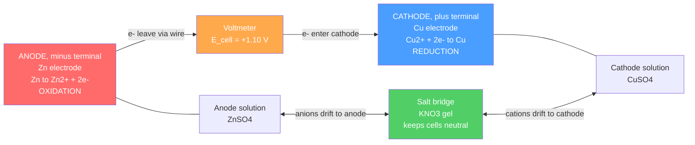

# 🔋 Electrochemistry

> [!abstract] TL;DR
> Electrochemistry is the study of **electron transfer** — reactions in which one species is *oxidized* (loses electrons) while another is *reduced* (gains them). If we physically separate the two half-reactions and connect them with a wire and a salt bridge, the electron flow becomes a usable **current**: a **galvanic (voltaic) cell** converts spontaneous chemistry into electricity ($E^\circ_{cell} > 0$), while an **electrolytic cell** does the reverse, forcing a non-spontaneous reaction with an external supply. The voltage is set by **standard reduction potentials** measured against the **standard hydrogen electrode**, linked to thermodynamics by $\Delta G = -nFE$ and to concentration by the **Nernst equation** $E = E^\circ - \tfrac{0.0592}{n}\log Q$. Faraday's laws ($m = QM/nF$) quantify how much matter a given charge deposits. At the graduate level, real cells depart from equilibrium via **overpotential** and **Butler–Volmer kinetics**.

## Intuition — analogy FIRST

Think of electrons as water and the two half-cells as two tanks at different heights. **Oxidation** at the anode is water spilling out of the high tank; **reduction** at the cathode is water filling the low tank. Left touching, they would just equalize as useless heat (a metal dropped straight into solution). But if you route the fall through a **pipe with a turbine** — the external wire — the same drop now spins a wheel and does work. The *height difference* between the tanks is the cell voltage; the salt bridge is a small overflow channel that keeps both tanks electrically neutral so the flow doesn't jam.

An **electrolytic cell** is a pump: you plug in a battery and push water *uphill*, forcing a reaction that would never happen on its own — this is how we plate metals, refine copper, and split water into hydrogen and oxygen.

The single mnemonic that anchors everything: **"AN OX, RED CAT"** — **AN**ode = **OX**idation, **RED**uction = **CAT**hode. This is true for *both* cell types.

---

## How It Works



*Cell notation (IUPAC):* $\text{Zn(s)} \,|\, \text{Zn}^{2+}(aq) \,\|\, \text{Cu}^{2+}(aq) \,|\, \text{Cu(s)}$ — anode on the **left**, cathode on the **right**, single bar = phase boundary, double bar = salt bridge.

---

## Key Concepts / Details

### Secondary Level

**Oxidation states.** Assign each atom a bookkeeping charge using ranked rules:

| Rule | Value | Exceptions |
|------|-------|------------|
| Free element | 0 | — |
| Monatomic ion | equals ion charge | — |
| Fluorine | $-1$ | never an exception |
| Oxygen | $-2$ | peroxides $-1$; $\text{OF}_2$ is $+2$ |
| Hydrogen | $+1$ | metal hydrides ($\text{NaH}$) $-1$ |
| Sum of states | equals overall charge | always |

**Oxidation** = increase in oxidation state = **loss** of electrons (**LEO**). **Reduction** = decrease = **gain** of electrons (**GER**). *"LEO the lion says GER."*

**Identifying agents (counter-intuitive but exam-critical):** the **oxidizing agent** is the species that gets *reduced* (it takes electrons from the other); the **reducing agent** is the species that gets *oxidized* (it gives electrons away).

**Balancing redox — half-reaction method (acidic solution):**
1. Split into oxidation and reduction half-reactions.
2. Balance all atoms **except** O and H.
3. Balance **O** by adding $\text{H}_2\text{O}$.
4. Balance **H** by adding $\text{H}^+$.
5. Balance **charge** by adding electrons ($e^-$).
6. Scale each half so electrons **cancel**, then add.

*Basic solution:* do the acidic procedure, then add enough $\text{OH}^-$ to **both** sides to neutralize every $\text{H}^+$ (forming $\text{H}_2\text{O}$), and cancel duplicate waters.

*Worked example (acidic):* permanganate oxidizing iron(II):
$$\text{MnO}_4^- + 8\text{H}^+ + 5e^- \rightarrow \text{Mn}^{2+} + 4\text{H}_2\text{O} \qquad (E^\circ = +1.51\ \text{V})$$
$$5\,[\text{Fe}^{2+} \rightarrow \text{Fe}^{3+} + e^-]$$
$$\text{MnO}_4^- + 8\text{H}^+ + 5\text{Fe}^{2+} \rightarrow \text{Mn}^{2+} + 5\text{Fe}^{3+} + 4\text{H}_2\text{O}$$

**Two cell types:**

| Feature | Galvanic (voltaic) | Electrolytic |
|---------|--------------------|--------------|
| Reaction | spontaneous, $E^\circ_{cell} > 0$ | forced, $E^\circ_{cell} < 0$ |
| Energy | chemistry → electricity | electricity → chemistry |
| Anode sign | negative $(-)$ | positive $(+)$ |
| Cathode sign | positive $(+)$ | negative $(-)$ |
| Example | battery, fuel cell | electroplating, water splitting |

Note the anode is *always* where oxidation occurs, but its **electrical sign flips** between the two cell types.

### Undergraduate Level

**Standard reduction potentials.** Every half-reaction is written as a **reduction** and measured (all species at 1 M, 1 bar, 25 °C) against the **standard hydrogen electrode (SHE)**, defined as exactly $0.00\ \text{V}$:
$$2\text{H}^+(aq,\,1\,M) + 2e^- \rightleftharpoons \text{H}_2(g,\,1\,\text{bar}) \qquad E^\circ = 0.00\ \text{V}$$

| Reduction half-reaction | $E^\circ$ (V) |
|-------------------------|:-------------:|
| $\text{F}_2 + 2e^- \rightarrow 2\text{F}^-$ | $+2.87$ |
| $\text{Cl}_2 + 2e^- \rightarrow 2\text{Cl}^-$ | $+1.36$ |
| $\text{O}_2 + 4\text{H}^+ + 4e^- \rightarrow 2\text{H}_2\text{O}$ | $+1.23$ |
| $\text{Ag}^+ + e^- \rightarrow \text{Ag}$ | $+0.80$ |
| $\text{Fe}^{3+} + e^- \rightarrow \text{Fe}^{2+}$ | $+0.77$ |
| $\text{Cu}^{2+} + 2e^- \rightarrow \text{Cu}$ | $+0.34$ |
| $2\text{H}^+ + 2e^- \rightarrow \text{H}_2$ (**SHE**) | $\phantom{+}0.00$ |
| $\text{Fe}^{2+} + 2e^- \rightarrow \text{Fe}$ | $-0.44$ |
| $\text{Zn}^{2+} + 2e^- \rightarrow \text{Zn}$ | $-0.76$ |
| $\text{Li}^+ + e^- \rightarrow \text{Li}$ | $-3.04$ |

Higher $E^\circ$ = **stronger oxidizing agent** (top-left, $\text{F}_2$); lower $E^\circ$ = **stronger reducing agent** (bottom-right, $\text{Li}$).

**Cell potential.** Combine the two tabulated *reduction* potentials — do **not** flip the sign of the anode value:
$$E^\circ_{cell} = E^\circ_{cathode} - E^\circ_{anode}$$
For the Daniell cell: $E^\circ_{cell} = (+0.34) - (-0.76) = +1.10\ \text{V}$. Positive ⇒ **spontaneous** as written.

**Thermodynamic bridge.** Electrical work links directly to free energy:
$$\Delta G = -nFE, \qquad \Delta G^\circ = -nFE^\circ$$
where $n$ = moles of electrons transferred and $F = 96{,}485\ \text{C/mol}$. For the Daniell cell, $\Delta G^\circ = -(2)(96485)(1.10) = -212\ \text{kJ/mol}$. And since $\Delta G^\circ = -RT\ln K$:
$$E^\circ = \frac{RT}{nF}\ln K$$
giving $\log K \approx 37$ for the Daniell cell — reaction essentially goes to completion.

**Nernst equation — voltage away from standard conditions:**
$$E = E^\circ - \frac{RT}{nF}\ln Q = E^\circ - \frac{0.0592}{n}\log Q \quad (25\,^\circ\text{C})$$
The constant $0.0592\ \text{V} = \tfrac{RT}{F}\ln 10$. As reactants deplete, $Q$ rises, $E$ falls; at **equilibrium** $Q = K$ and $E = 0$ — a **dead battery**.

**Concentration cell.** Same electrode metal on both sides, so $E^\circ_{cell} = 0$; the voltage comes purely from a concentration gradient:
$$E = -\frac{0.0592}{n}\log\frac{[\text{dilute}]}{[\text{conc}]}$$
The **dilute** side is the anode. A $\text{Cu}\,|\,\text{Cu}^{2+}$ cell with $10^{-3}\,M$ vs $1\,M$ gives $E = \tfrac{0.0592}{2}\log(1000) \approx +0.089\ \text{V}$.

**Faraday's laws of electrolysis.** Mass deposited is proportional to charge passed:
$$m = \frac{Q\,M}{nF}, \qquad Q = It$$
where $M$ = molar mass and $n$ = electrons per ion. Depositing copper ($\text{Cu}^{2+} + 2e^- \rightarrow \text{Cu}$) at $2.0\ \text{A}$ for $30\ \text{min}$: $Q = 3600\ \text{C}$, $m = (3600)(63.55)/[(2)(96485)] = 1.19\ \text{g}$.

### Graduate Level

**Overpotential.** The Nernst equation gives the *equilibrium* voltage; a real electrode passing current $j$ needs an extra push. The **overpotential** $\eta = E_{applied} - E_{eq}$ is the price of driving the reaction at a finite rate. It has activation, concentration (mass-transport), and ohmic contributions — this is why a "1.23 V" water electrolyzer actually needs ~1.8–2.0 V.

**Butler–Volmer equation** — the fundamental current–overpotential relation:
$$j = j_0\left[\exp\!\left(\frac{\alpha_a F\eta}{RT}\right) - \exp\!\left(-\frac{\alpha_c F\eta}{RT}\right)\right]$$
where $j_0$ is the **exchange current density** (the balanced forward/backward rate at equilibrium) and $\alpha_a, \alpha_c$ are transfer coefficients (typically $\alpha_a + \alpha_c \approx 1$ for one-electron steps). A **large** $j_0$ (e.g. Pt for $\text{H}_2$ evolution) means fast kinetics and small overpotential; a **small** $j_0$ means a sluggish, high-overpotential electrode.

**Tafel limit.** For large $|\eta|$ one exponential dominates, giving the linear **Tafel equation**:
$$\eta = \frac{RT}{\alpha_a F}\ln\frac{j}{j_0} = a + b\log j$$
whose slope $b$ and intercept reveal the mechanism and $j_0$. Quantitative electroanalytical techniques (cyclic voltammetry, potentiometry, amperometric sensors) build on these relations and are treated separately in [[Analytical_Statistics_and_Electroanalysis]].

---

```python
import numpy as np
import matplotlib.pyplot as plt

# --- Physical constants ---
R = 8.314        # J/(mol K)
F = 96485.0      # C/mol  (Faraday constant)
T = 298.15       # K      (25 deg C)

# =====================================================================
# 1) Nernst equation for the Daniell cell:
#    Zn(s) | Zn2+ || Cu2+ | Cu(s),   E0 = +1.10 V,  n = 2,  Q = [Zn2+]/[Cu2+]
# =====================================================================
E0, n = 1.10, 2
logQ = np.linspace(-6, 6, 200)
Q = 10.0**logQ
E_exact = E0 - (R*T)/(n*F) * np.log(Q)     # exact RT/nF form
E_25    = E0 - (0.0592/n) * logQ           # 25 deg C shortcut (log base 10)

plt.figure(figsize=(7, 5))
plt.plot(logQ, E_exact, lw=2, label='Nernst, exact RT/nF')
plt.plot(logQ, E_25, '--', lw=2, label='0.0592/n * log Q (25 C)')
plt.axhline(E0, color='gray', ls=':', label='E_standard = 1.10 V')
plt.axhline(0.0, color='red', ls=':', label='E = 0  -> dead battery')
plt.xlabel('log10(Q),  Q = [Zn2+]/[Cu2+]')
plt.ylabel('Cell potential E (V)')
plt.title('Nernst Equation: Daniell Cell Potential vs log Q')
plt.legend(); plt.grid(True, alpha=0.3); plt.tight_layout()

# =====================================================================
# 2) Faraday's law electrolysis calculator:  m = Q*M/(n*F),  Q = I*t
# =====================================================================
def electrolysis_mass(I, t_s, M, n):
    """Mass in grams deposited by current I (A) over t_s seconds."""
    Q = I * t_s
    return Q * M / (n * F)

m_Cu = electrolysis_mass(I=2.0, t_s=30*60, M=63.55, n=2)   # copper plating
print(f"Copper deposited: {m_Cu:.3f} g")                   # -> 1.186 g

# Equilibrium constant from the standard potential:  E0 = (RT/nF) ln K
logK = (n * F * E0) / (R * T) / np.log(10)
print(f"log10(K) = {logK:.1f}  -> reaction essentially complete")  # ~37.2

plt.show()
```

---

## Real-World Notes

- **Lithium-ion batteries (secondary/rechargeable).** Li⁺ shuttles between a graphite anode and a metal-oxide cathode (e.g. LiCoO₂, LiFePO₄); the very negative $E^\circ$ of lithium ($-3.04\ \text{V}$) plus its low mass gives the highest practical energy density, powering phones and EVs. Charging runs the cell as an electrolytic cell.
- **Primary vs secondary cells.** Alkaline AA cells (Zn/MnO₂) are **primary** — the redox chemistry is not readily reversible. Lead–acid and Li-ion are **secondary** — reversible by forcing the reverse reaction.
- **Hydrogen fuel cells.** Continuously fed $\text{H}_2$ (oxidized at the anode) and $\text{O}_2$ (reduced at the cathode) yield $E^\circ \approx 1.23\ \text{V}$ and only water as exhaust; used in spacecraft and fuel-cell vehicles.
- **Corrosion.** Rusting is a galvanic process: iron is oxidized ($\text{Fe} \rightarrow \text{Fe}^{2+}$) where oxygen and water complete the circuit. Salt accelerates it by improving electrolyte conductivity.
- **Cathodic protection.** Bolting a **sacrificial anode** of more easily oxidized metal (Zn or Mg, more negative $E^\circ$) onto ship hulls and pipelines forces the steel to become the *cathode*, so the cheaper metal corrodes instead.
- **Industrial electrolysis.** The chlor-alkali process (brine → $\text{Cl}_2$ + NaOH), Hall–Héroult aluminium smelting, and copper electrorefining are all Faraday's-law-governed electrolytic cells consuming enormous currents.

---

## Common Pitfalls

1. **Flipping the anode sign in $E^\circ_{cell}$.** Use $E^\circ_{cell} = E^\circ_{cathode} - E^\circ_{anode}$ with **both** taken as *reduction* potentials from the table. Do **not** also reverse the anode's sign — that double-counts.
2. **$E^\circ$ is intensive — never multiply it by stoichiometry.** Doubling a half-reaction doubles $\Delta G$ and $n$, but $E^\circ$ (volts, a per-charge quantity) is unchanged. Only $\Delta G = -nFE$ scales.
3. **Confusing the electrical sign of the anode.** Anode is negative in a galvanic cell but positive in an electrolytic cell — yet oxidation *always* happens there. Memorize the process, not the sign.
4. **Wrong $Q$ or wrong log base in Nernst.** $Q$ is products-over-reactants with pure solids/liquids omitted; the $0.0592/n$ shortcut uses $\log_{10}$, while the $RT/nF$ form uses $\ln$. Mixing them gives a factor-of-2.3 error.
5. **Assuming a positive $E^\circ$ means a fast reaction.** Thermodynamics (spontaneity) is not kinetics. Many favorable reactions are slow due to high **overpotential** or activation barriers — hence catalysts (Pt) in fuel cells.
6. **Miscounting $n$ in Faraday's law.** $n$ is electrons transferred per formula unit ($\text{Cu}^{2+}$ needs 2, $\text{Al}^{3+}$ needs 3, $\text{Ag}^+$ needs 1). Getting $n$ wrong throws off every deposited-mass calculation.

---

## Related Concepts

- [[_MOC_Physical_Chemistry|↑ Section MOC]]
- [[Chemical_Thermodynamics]] — supplies $\Delta G = -nFE$; a cell is a spontaneous reaction wired to do electrical work
- [[Chemical_Kinetics]] — overpotential and Butler–Volmer are electrode-reaction kinetics in disguise
- [[Chemical_Equilibrium]] — $E^\circ = \tfrac{RT}{nF}\ln K$ ties cell voltage to the equilibrium constant; $E = 0$ at equilibrium
- [[Quantum_Chemistry_and_Atomic_Orbitals]] — orbital energies underlie ionization/electron affinity that shape reduction potentials
- [[Molecular_Spectroscopy_and_Symmetry]] — spectro-electrochemistry probes redox intermediates optically
- [[Phase_Equilibria_and_Colligative_Properties]] — activities and ionic strength correct the concentrations used in the Nernst equation
- [[Inorganic_Acids_Bases_and_Redox]] — oxidation-state bookkeeping and redox agents from the inorganic viewpoint
- [[Transition_Metals_and_the_d_Block]] — variable oxidation states make d-block metals the workhorses of redox chemistry
- [[Analytical_Statistics_and_Electroanalysis]] — quantitative voltammetry, potentiometry, and electroanalytical sensors
- [[Laws_of_Thermodynamics]] — (Physics) the free-energy and entropy foundations behind $\Delta G = -nFE$
- [[Maxwells_Equations]] — (Physics) the electromagnetic framework governing the currents electrochemistry produces
- [[Electric_Fields_and_Coulombs_Law]] — (Physics) the electrostatics of the double layer and ion migration
- [[_MOC_Mathematics_Master]] — (Math) logarithms and exponentials behind the Nernst and Butler–Volmer equations

---

## Review Questions

1. **Secondary:** Balance the redox reaction $\text{Cr}_2\text{O}_7^{2-} + \text{Fe}^{2+} \rightarrow \text{Cr}^{3+} + \text{Fe}^{3+}$ in acidic solution using the half-reaction method. Identify the oxidizing agent and the reducing agent.
2. **Undergraduate:** For the cell $\text{Zn(s)}\,|\,\text{Zn}^{2+}(0.10\,M)\,\|\,\text{Cu}^{2+}(0.010\,M)\,|\,\text{Cu(s)}$, (a) write the cell reaction, (b) compute $E^\circ_{cell}$, (c) use the Nernst equation to find the actual $E_{cell}$ at 25 °C, and (d) state $\Delta G$.
3. **Graduate:** An electrode has exchange current density $j_0 = 10^{-3}\ \text{A/cm}^2$ and transfer coefficient $\alpha_a = 0.5$. Using the Tafel approximation, estimate the anodic overpotential required to reach $j = 10^{-1}\ \text{A/cm}^2$ at 25 °C, and explain physically why a catalyst that raises $j_0$ lowers the operating voltage of a fuel cell.

---

## Sources

- Atkins & de Paula — *Physical Chemistry*, electrochemistry and electrode-kinetics chapters
- Bard & Faulkner — *Electrochemical Methods: Fundamentals and Applications* (Butler–Volmer, Tafel)
- Zumdahl — *Chemistry*, redox balancing and standard cell potentials
- CRC Handbook of Chemistry and Physics — standard reduction potential tables (E° values)
- Newman & Thomas-Alyea — *Electrochemical Systems* (transport and overpotential)

#chemistry #physicalchemistry #electrochemistry #redox #galvaniccell #Nernst #electrolysis #standardpotentials #secondary #undergraduate #graduate
