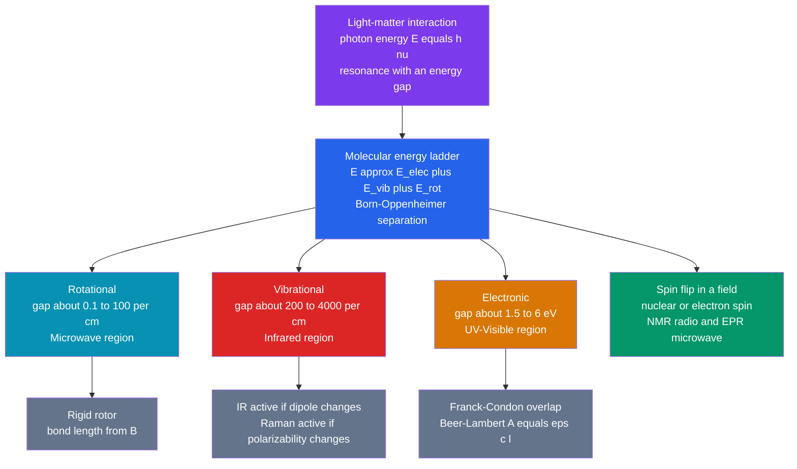

# 📡 Molecular Spectroscopy and Symmetry

> [!abstract] TL;DR
> Molecular spectroscopy reads the **quantized energy ladder** of a molecule by measuring which photons it absorbs or emits. Different regions of the electromagnetic spectrum probe different rungs: **microwaves** flip rotations ($E_J = BJ(J+1)$, giving bond lengths), **infrared** excites vibrations ($E_v = (v+\tfrac12)h\nu$, giving force constants), **UV–Vis** promotes electrons (governed by Franck–Condon overlap and quantified by Beer–Lambert $A=\varepsilon c l$), and **radio/microwave** flips nuclear or electron spins (NMR/EPR). **Symmetry and group theory** are the master key: whether a transition is allowed, and whether a vibration is IR-active, Raman-active, or both, is decided entirely by how the molecule's normal modes transform under its **point group** — culminating in the mutual exclusion rule for centrosymmetric molecules.

## Intuition — analogy FIRST

A molecule is a **tuned instrument**. A guitar string only rings at its natural frequencies — pluck it and it sounds a fundamental plus overtones, never an arbitrary pitch. A molecule is the same: its rotations, vibrations, and electron clouds can only hold *specific* amounts of energy. Shine light on it and it will absorb **only** the photons whose energy exactly matches a gap between two allowed rungs. Everything else passes straight through.

So a spectrum is a **fingerprint of allowed energy jumps**. And just as a symmetric instrument (a perfectly round drum) produces cleaner, more degenerate tones than a lopsided one, a molecule's **symmetry** dictates which jumps are permitted. Group theory is the grammar that tells you, before any experiment, which "notes" a given molecule is even *capable* of playing.

---

## How It Works



---

## Key Concepts / Details

### Secondary / Foundational Level

Light is an oscillating electric field. When its frequency $\nu$ matches an energy gap $\Delta E = h\nu$ inside the molecule, a photon is absorbed and the molecule jumps to a higher rung. Because bigger jumps need bigger photons, each type of motion lives in its own part of the spectrum:

| Motion | Energy gap | Region | Wavelength / frequency |
|--------|-----------|--------|------------------------|
| Nuclear spin flip | $\sim 10^{-6}$ eV | Radio (NMR) | 100–900 MHz |
| Molecular rotation | $\sim 10^{-4}$–$10^{-2}$ eV | Microwave | mm–cm |
| Molecular vibration | $\sim 0.1$–$0.5$ eV | Infrared | 2.5–25 μm |
| Electron promotion | $\sim 1.5$–$6$ eV | UV–Visible | 200–800 nm |

The takeaway: **a spectrum is a bar-code of allowed energy differences**, and identifying the bars identifies the molecule.

### Undergraduate Level

**Born–Oppenheimer separation.** Nuclei are $\gtrsim 1800\times$ heavier than electrons, so electrons adjust essentially instantaneously to nuclear positions. The wavefunction and energy factor cleanly:
$$\Psi_{\text{total}} \approx \psi_{\text{elec}}\,\psi_{\text{vib}}\,\psi_{\text{rot}}, \qquad E \approx E_{\text{elec}} + E_{\text{vib}} + E_{\text{rot}}$$
with $E_{\text{elec}} \gg E_{\text{vib}} \gg E_{\text{rot}}$. This is why the three spectra can be analysed almost independently.

**Rotational spectroscopy (rigid rotor).** A diatomic modelled as two masses on a rigid rod has quantized rotational energy
$$E_J = hc\,\tilde{B}\,J(J+1), \qquad \tilde{B} = \frac{h}{8\pi^2 c\, I}, \qquad I = \mu r^2, \quad \mu = \frac{m_1 m_2}{m_1 + m_2}$$
where $\tilde{B}$ is the rotational constant (cm$^{-1}$), $I$ the moment of inertia, and $\mu$ the **reduced mass**. Selection rule: $\Delta J = \pm 1$, and the molecule **must have a permanent dipole moment** (so N$_2$ and O$_2$ show no pure rotational spectrum). Absorption lines fall at $\tilde{\nu} = 2\tilde{B}(J+1)$, i.e. **equally spaced by $2\tilde{B}$** — measure the spacing, get $I$, get the **bond length** $r$.

**Vibrational spectroscopy (harmonic oscillator).** A bond is a spring obeying Hooke's law:
$$E_v = \left(v + \tfrac12\right)h\nu, \qquad \nu = \frac{1}{2\pi}\sqrt{\frac{k}{\mu}}, \qquad \tilde{\nu} = \frac{1}{2\pi c}\sqrt{\frac{k}{\mu}}$$
with $k$ the force constant (bond stiffness). The $v=0$ level still has **zero-point energy** $\tfrac12 h\nu$. Selection rule: $\Delta v = \pm 1$; a mode is **IR-active only if the dipole moment changes** during the vibration ($\partial\mu/\partial Q \neq 0$). See [[Quantum_Harmonic_Oscillator]] for the full quantum solution.

**Anharmonicity (Morse potential).** Real bonds weaken and eventually break, so levels converge:
$$E_v = \left(v+\tfrac12\right)h\nu - \left(v+\tfrac12\right)^2 h\nu\, x_e$$
where $x_e$ is the anharmonicity constant. Anharmonicity makes weak **overtones** ($\Delta v = \pm 2, \pm 3$) allowed and lets the ladder terminate at the dissociation energy.

**IR vs Raman — the complementary pair.**

| | Physical requirement | Probes |
|---|----------------------|--------|
| **IR (absorption)** | dipole moment must change, $\partial\mu/\partial Q \neq 0$ | polar bonds, asymmetric stretches |
| **Raman (scattering)** | polarizability must change, $\partial\alpha/\partial Q \neq 0$ | symmetric stretches, homonuclear bonds |

**Electronic spectroscopy & Franck–Condon.** An electronic jump is fast compared to nuclear motion (Born–Oppenheimer again), so on a potential-energy diagram the transition is **vertical**: internuclear distance is frozen. The intensity of each vibronic line is proportional to the **Franck–Condon factor** $|\langle \chi_{v'} | \chi_{v''}\rangle|^2$, the overlap of the two vibrational wavefunctions. Band intensities in solution obey the **Beer–Lambert law**:
$$A = \log_{10}\frac{I_0}{I} = \varepsilon\, c\, l$$
with $\varepsilon$ the molar absorptivity (L mol$^{-1}$ cm$^{-1}$), $c$ the concentration, and $l$ the path length.

**Fourier-transform methods.** Modern IR and NMR instruments do not scan frequencies one at a time. A Michelson interferometer records an **interferogram** $I(\delta)$ versus mirror displacement $\delta$; the spectrum $B(\tilde{\nu})$ is its Fourier transform:
$$B(\tilde{\nu}) \propto \int_{-\infty}^{\infty} I(\delta)\, e^{-i 2\pi \tilde{\nu}\delta}\, d\delta$$
In FT-NMR the time-domain **free induction decay** is transformed the same way. In practice this integral is computed by the [[DFT_and_FFT|FFT]]; the underlying theory is the [[Fourier_Transform]]. Recording all frequencies at once gives the multiplex (Fellgett) and throughput (Jacquinot) advantages.

### Graduate Level

**Transition dipole moment.** Whether a transition is allowed is set by the **transition dipole moment**
$$\boldsymbol{\mu}_{fi} = \langle \psi_f | \hat{\boldsymbol{\mu}} | \psi_i\rangle, \qquad \text{intensity} \propto |\boldsymbol{\mu}_{fi}|^2$$
The transition is symmetry-allowed only when the integrand contains the **totally symmetric irreducible representation** — i.e. when $\Gamma_f \otimes \Gamma_{\mu} \otimes \Gamma_i \supset A_1$. This single statement generates *all* the selection rules above.

**Fermi's golden rule.** Time-dependent perturbation theory for the oscillating field of light gives the transition rate
$$W_{i\to f} = \frac{2\pi}{\hbar}\,\big|\langle f|\hat{H}'|i\rangle\big|^2\,\rho(E_f)$$
with $\rho(E_f)$ the density of final states. Line **intensities**, not just positions, follow from this.

**Symmetry & group theory in practice.** The symmetry operations of a molecule — identity $E$, proper rotation $C_n$, reflection $\sigma$, inversion $i$, improper rotation $S_n$ — form a **point group** ($C_{2v}$, $D_{\infty h}$, $T_d$, $O_h$, …). The **character table** lists the group's irreducible representations (Mulliken symbols $A_1, B_2, E, T_2, \dots$) against each operation; its right-hand columns tag which irreps transform as the **linear** functions $x,y,z$ (→ IR / dipole) and which as the **quadratic** functions $x^2, xy, \dots$ (→ Raman / polarizability). Reducing the $3N-6$ (or $3N-5$ for linear) Cartesian displacement representation via
$$n_i = \frac{1}{h}\sum_{R} g(R)\,\chi(R)\,\chi_i(R)$$
tells you exactly which normal modes exist and how each behaves spectroscopically.

**Mutual exclusion rule.** In a **centrosymmetric** molecule (one with an inversion centre $i$), every mode is either *gerade* ($g$) or *ungerade* ($u$). Dipole components are $u$ while polarizability components are $g$, so **no mode can be both IR- and Raman-active** — IR bands and Raman bands are mutually exclusive (CO$_2$, N$_2$, benzene, ethene).

**Term symbols.** Electronic states are labelled by term symbols — atomic $^{2S+1}L_J$ or molecular $^{2S+1}\Lambda$ (e.g. N$_2$ ground state $^1\Sigma_g^+$, O$_2$ $^3\Sigma_g^-$). Electronic selection rules follow from them: $\Delta S = 0$ (spin), $\Delta\Lambda = 0,\pm1$, and $g \leftrightarrow u$ (the **Laporte rule**). See [[Angular_Momentum_and_Spin]] and [[Atomic_Models_and_Spectroscopy]].

```python
import numpy as np
import matplotlib.pyplot as plt

# Simulate the rovibrational IR band of HCl (v=0 -> v=1 fundamental).
# Rigid-rotor + harmonic-oscillator; the Q-branch (delta J = 0) is forbidden,
# leaving a gap of ~4B at the band centre.

nu0 = 2886.0      # band origin / cm^-1  (H-Cl stretch)
B   = 10.59       # rotational constant / cm^-1  (HCl)
T   = 300.0       # temperature / K

h, c, k = 6.626e-34, 2.998e10, 1.381e-23   # J s, cm/s, J/K
hck = h * c / k                             # cm*K  (so B*hck*J(J+1)/T is dimensionless)

def pop(Jl):                                # Boltzmann population of lower level J
    return (2 * Jl + 1) * np.exp(-B * hck * Jl * (Jl + 1) / T)

Jmax = 15
Jr = np.arange(0, Jmax + 1)                 # R branch: J -> J+1
R_lines, R_int = nu0 + 2 * B * (Jr + 1), pop(Jr)

Jp = np.arange(1, Jmax + 1)                 # P branch: J -> J-1
P_lines, P_int = nu0 - 2 * B * Jp,        pop(Jp)

norm = max(R_int.max(), P_int.max())

plt.figure(figsize=(8, 4))
plt.vlines(R_lines, 0, R_int / norm, color='tab:blue', label='R branch (dJ = +1)')
plt.vlines(P_lines, 0, P_int / norm, color='tab:red',  label='P branch (dJ = -1)')
plt.axvline(nu0, ls='--', color='gray')
plt.text(nu0, 1.03, 'missing Q branch', ha='center', fontsize=9)
plt.xlabel('Wavenumber / cm$^{-1}$'); plt.ylabel('Relative absorbance')
plt.title('Simulated HCl vibration-rotation band')
plt.legend(); plt.gca().invert_xaxis()      # spectroscopy convention: high wavenumber left
plt.tight_layout(); plt.show()
```

---

## Real-World Notes

- **Radio astronomy** identifies interstellar molecules (CO, HCN, water, even glycine candidates) purely from their microwave *rotational* line spacings — the equally spaced $2\tilde{B}$ pattern is an unambiguous molecular signature across light-years.
- **FT-IR forensics and QC**: the mid-IR "fingerprint region" (below ~1500 cm$^{-1}$) is dense and molecule-specific, so FT-IR libraries identify plastics, drugs, and contaminants in seconds via pattern matching.
- **Raman for the symmetric and the aqueous**: because water is a weak Raman scatterer and homonuclear/symmetric bonds are Raman-active, Raman microscopy excels at biological samples, carbon materials (the graphene G and 2D bands), and non-contact art authentication.
- **UV–Vis + Beer–Lambert** is the workhorse of the analytical lab: DNA/protein quantitation at 260/280 nm, colorimetric assays, and reaction kinetics all rest on $A = \varepsilon c l$.
- **Pulse oximetry** exploits differential Beer–Lambert absorption of oxy- vs deoxy-haemoglobin at two wavelengths — spectroscopy on your fingertip.
- **CO$_2$ and climate**: the IR-active bending and asymmetric-stretch modes of CO$_2$ absorb outgoing thermal radiation; the symmetric stretch is IR-inactive (no dipole change) but Raman-active — a textbook case of symmetry deciding planetary consequences.

---

## Common Pitfalls

1. **Confusing frequency, wavenumber, and wavelength.** Spectroscopists quote wavenumber $\tilde{\nu} = 1/\lambda$ (cm$^{-1}$), which is proportional to *energy*, not to wavelength. Larger $\tilde{\nu}$ means a **bigger** energy gap; larger $\lambda$ means a smaller one.
2. **Assuming every vibration is IR-active.** Symmetric stretches of centrosymmetric molecules (CO$_2$ symmetric stretch, N$_2$, the ring-breathing modes of benzene) are IR-**silent**. Activity is a symmetry question, not a "does it move?" question.
3. **Forgetting the reduced mass.** Vibrational and rotational constants scale with $\mu = m_1 m_2/(m_1+m_2)$, **not** the total mass. This is exactly why isotopic substitution (H → D) shifts bands by a predictable $\sqrt{\mu_1/\mu_2}$ factor.
4. **Looking for a Q-branch that is not there.** For most diatomics $\Delta J = 0$ is forbidden, so the fundamental IR band splits into P and R branches with a gap at the centre — not a single peak. A Q-branch appears only when there is vibrational/electronic angular momentum (e.g. NO, or bending modes).
5. **Misusing Beer–Lambert.** It is linear only at low concentration; at high $c$, stray light, chemical equilibria, or aggregation bend the calibration curve, so a measured $A > \sim 1.5$ is often unreliable.
6. **Treating the harmonic oscillator as exact.** Overtones, hot bands, and dissociation are all anharmonic effects invisible to the pure Hooke's-law model — the Morse potential is needed for real fundamentals and combustion diagnostics.

---

## Related Concepts

- [[_MOC_Physical_Chemistry|↑ Section MOC]]
- [[Quantum_Chemistry_and_Atomic_Orbitals]] — the wavefunctions whose energy gaps spectroscopy measures
- [[Chemical_Thermodynamics]] — Boltzmann populations set relative line intensities and band envelopes
- [[Chemical_Kinetics]] — spectroscopy is the standard clock for tracking reaction rates in real time
- [[Chemical_Equilibrium]] — UV–Vis absorbance ratios yield equilibrium and acid–base constants
- [[Electrochemistry]] — spectroelectrochemistry couples potential control with optical readout
- [[Phase_Equilibria_and_Colligative_Properties]] — sibling physical-chemistry topic
- [[UV_Vis_and_IR_Spectroscopy]] — instrumental deep dive (Section 05)
- [[NMR_Spectroscopy]] — nuclear-spin spectroscopy and structure elucidation
- [[Coordination_Chemistry_and_Ligand_Field_Theory]] — d–d transitions, selection rules, and colour
- [[Quantum_Harmonic_Oscillator]] — Physics: the quantized-vibration model behind IR
- [[Atomic_Models_and_Spectroscopy]] — Physics: atomic line spectra and selection rules
- [[Angular_Momentum_and_Spin]] — Physics: rotational quantum number $J$ and spin transitions
- [[Electromagnetic_Waves_and_Radiation]] — Physics: the light that drives every transition
- [[Fourier_Transform]] · [[DFT_and_FFT]] — Signals: interferogram/FID → spectrum
- [[_MOC_Mathematics_Master]] — group theory and linear algebra underpinning symmetry analysis

---

## Review Questions

1. **Secondary / Foundational**: Rank microwave, infrared, and UV radiation by photon energy, and state which type of molecular motion each excites. Why does a colourless gas like N$_2$ show no microwave rotational spectrum?
2. **Undergraduate**: The adjacent lines in the rotational spectrum of a diatomic are spaced $\tilde{B}=1.92$ cm$^{-1}$ apart in energy (so line spacing $2\tilde{B}$). Given $\mu$, outline how you would extract the bond length $r$ from $\tilde{B} = h/(8\pi^2 c\,\mu r^2)$. Then explain why the same molecule's IR fundamental appears as two branches with a central gap rather than one peak.
3. **Graduate**: Using the transition-dipole integral $\langle\psi_f|\hat{\boldsymbol\mu}|\psi_i\rangle$ and the requirement that the integrand span the totally symmetric representation, derive the mutual exclusion rule for a centrosymmetric molecule. Illustrate with the four normal modes of CO$_2$, classifying each as IR-active, Raman-active, or both.

---

## Sources

- Atkins & de Paula — *Physical Chemistry*, "Molecular Spectroscopy" chapters
- Hollas — *Modern Spectroscopy*, 4th ed.
- Banwell & McCash — *Fundamentals of Molecular Spectroscopy*
- Cotton — *Chemical Applications of Group Theory*, 3rd ed.
- Harris & Bertolucci — *Symmetry and Spectroscopy*

---

#chemistry #physical-chemistry #spectroscopy #grouptheory #symmetry #infrared #raman #rotational #vibrational #electronic #selectionrules #undergraduate #graduate
