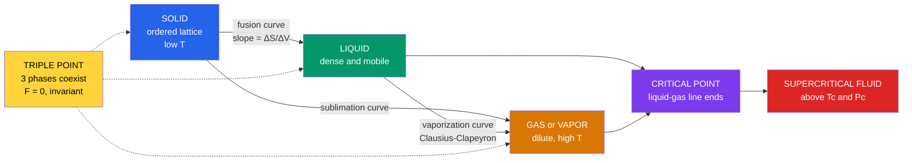

# 🧊 Phase Equilibria and Colligative Properties

> [!abstract] TL;DR
> Two phases coexist in equilibrium when the **chemical potential** of every component is equal across them ($\mu_\alpha = \mu_\beta$). The **Gibbs phase rule** $F = C - P + 2$ counts how many variables you can still tune, which is why a one-component phase diagram has *areas* (one phase), *lines* (two phases), and an invariant *triple point* (three phases). The slope of every coexistence line is fixed by the **Clapeyron equation** $\frac{dP}{dT} = \frac{\Delta S}{\Delta V}$ — its liquid–vapor form is the **Clausius–Clapeyron** law, and water's ice–liquid line slopes *backward* because ice floats. Dissolve something in a solvent and its vapor pressure drops (**Raoult's law**), which cascades into the four **colligative properties** — vapor-pressure lowering, boiling-point elevation, freezing-point depression, and osmotic pressure — that depend only on how *many* particles are dissolved, not what they are.

## Intuition — analogy FIRST

Imagine a crowded dance floor (**liquid**) with a balcony above it (**vapor**). At any instant some dancers leap up to the balcony and some balcony-goers drop back down. Equilibrium is when the up-rate equals the down-rate — the crowd sizes freeze even though people keep moving. Raise the temperature and more dancers have the energy to leap: the balcony fills, i.e. the vapor pressure rises. Now scatter a handful of "wallflowers" (solute) through the dance floor who *never* leap. They dilute the leapers and physically block the stairs, so fewer dancers reach the balcony — the vapor pressure **falls**. Crucially, the *identity* of the wallflowers does not matter, only *how many* there are. That single fact is the origin of every colligative property: freezing your roads with salt, cooking pasta faster in salted water, and the osmotic pull that keeps your cells turgid.

---

## How It Works

A one-component system ($C=1$) obeys $F = 3 - P$. A single phase has $F=2$ (a 2-D *region* you can wander in $T$ and $P$); two coexisting phases have $F=1$ (a 1-D *coexistence curve*); three phases pin the system to $F=0$ (the **triple point**, a single unique $T,P$). The curves cannot cross arbitrarily — each slope is dictated by the Clapeyron relation, and the liquid–vapor curve simply *ends* at the **critical point**, beyond which liquid and gas merge into one **supercritical fluid**.



---

## Key Concepts / Details

### Secondary Level

**Phases and phase changes.** A *phase* is a region of uniform composition and properties. On a $P$–$T$ **phase diagram** the boundary lines mark where two phases coexist. Reading water's diagram: at $1$ atm, warming ice crosses the fusion line at $0\,^\circ$C (melting) and the vaporization line at $100\,^\circ$C (boiling). Below the **triple point** ($0.01\,^\circ$C, $611$ Pa) liquid cannot exist and ice sublimes directly to vapor.

**Vapor pressure and boiling.** A liquid boils when its vapor pressure equals the surrounding pressure. Lower the ambient pressure (a mountaintop) and the vaporization curve is met at a lower temperature — water boils at ~$70\,^\circ$C on Everest.

**Colligative properties — the four effects.** Dissolving a non-volatile solute changes four solvent properties in proportion to solute *particle count*:

| Property | Effect | Formula |
|----------|--------|---------|
| Vapor-pressure lowering | vapor pressure drops | $\Delta P = x_\text{solute}\,P^{*}_\text{solvent}$ |
| Boiling-point elevation | boils higher | $\Delta T_b = i\,K_b\,m$ |
| Freezing-point depression | freezes lower | $\Delta T_f = i\,K_f\,m$ |
| Osmotic pressure | solvent flows in | $\Pi = i\,M\,R\,T$ |

Here $m$ is **molality** (mol solute / kg solvent), $M$ is molarity, and $i$ is the **van 't Hoff factor** — the number of particles each formula unit releases (glucose $i=1$, NaCl $i=2$, CaCl$_2$ $i=3$). This is why salt de-ices roads and antifreeze protects an engine both hot and cold.

### Undergraduate Level

**Gibbs phase rule.** For a system at equilibrium,
$$\boxed{F = C - P + 2}$$
$C$ = number of independent chemical components, $P$ = number of phases, $F$ = degrees of freedom (intensive variables freely varied). The "$+2$" is for $T$ and $P$. A pure substance ($C=1$) therefore permits at most $P=3$ phases (the triple point, $F=0$); four-phase coexistence of a pure substance is thermodynamically impossible.

**The chemical-potential criterion.** Phase equilibrium means each component has equal chemical potential in every phase:
$$\mu_\alpha(T,P) = \mu_\beta(T,P)$$
Matter flows from high to low $\mu$ until they equalize — this is the true engine behind every boundary line and every colligative effect.

**Clapeyron equation.** Differentiating $\mu_\alpha = \mu_\beta$ along a coexistence curve, using $d\mu = -S_m\,dT + V_m\,dP$, gives the exact slope of *any* boundary:
$$\frac{dP}{dT} = \frac{\Delta S_m}{\Delta V_m} = \frac{\Delta H_m}{T\,\Delta V_m}$$

**Clausius–Clapeyron equation.** For liquid $\to$ vapor, $\Delta V_m \approx V_{m,\text{gas}} = RT/P$ (vapor volume dwarfs the liquid) and, treating $\Delta H_\text{vap}$ as roughly constant, integration gives
$$\ln\frac{P_2}{P_1} = -\frac{\Delta H_\text{vap}}{R}\left(\frac{1}{T_2} - \frac{1}{T_1}\right)$$
A plot of $\ln P$ vs $1/T$ is linear with slope $-\Delta H_\text{vap}/R$ — the standard way to *measure* an enthalpy of vaporization.

**Water's anomalous fusion line.** For most substances the solid is denser than the liquid, so $\Delta V_\text{fus} > 0$ and $dP/dT > 0$ (the melting line leans right). Ice is *less* dense than water, so $\Delta V_\text{fus} < 0$ and the fusion line has a **negative slope**: raising the pressure *lowers* the melting point. Every anomaly of water — floating ice, glaciers flowing, life beneath frozen lakes — traces to this sign.

**Raoult's law and ideal solutions.** In an ideal solution each component's vapor pressure is proportional to its liquid mole fraction:
$$P_A = x_A\,P^{*}_A, \qquad P_\text{total} = x_A P^{*}_A + x_B P^{*}_B$$
**Henry's law** governs the dilute *solute* instead: $P_B = x_B\,K_H$, where the empirical $K_H \neq P^{*}_B$. In any real solution the solvent obeys Raoult and the solute obeys Henry in the dilute limit.

**Deviations and azeotropes.** If unlike molecules attract *less* than like molecules, vapor pressure exceeds Raoult (**positive deviation**, e.g. ethanol + water) and a **minimum-boiling azeotrope** appears; stronger unlike attraction gives **negative deviation** (chloroform + acetone) and a **maximum-boiling azeotrope**. At an **azeotrope** the vapor and liquid have identical composition, so fractional distillation stalls — ethanol/water is stuck at ~$95.6\%$ ethanol ($78.2\,^\circ$C), which is why "absolute" ethanol needs a chemical drying step.

### Graduate Level

**Colligative laws from chemical potential.** For freezing, the solvent A in solution equals pure solid A at equilibrium: $\mu_A^{*}(\text{s}) = \mu_A^{*}(\text{l}) + RT\ln a_A$. Rearranging with $\Delta\mu = -\Delta G_\text{fus}$ and integrating $\left(\partial(\Delta G/T)/\partial T\right)_P = -\Delta H/T^2$ yields
$$\ln a_A = \frac{\Delta H_\text{fus}}{R}\left(\frac{1}{T_f^{*}} - \frac{1}{T_f}\right)$$
In the dilute ideal limit $\ln a_A \approx \ln x_A \approx -x_B$, and the depression collapses to $\Delta T_f = K_f\,m$ with the constant expressed in **pure-solvent** quantities:
$$K_f = \frac{M_A R (T_f^{*})^2}{\Delta H_\text{fus}}, \qquad K_b = \frac{M_A R (T_b^{*})^2}{\Delta H_\text{vap}}$$
For water this gives $K_f = 1.86$ and $K_b = 0.51\ \mathrm{K\,kg\,mol^{-1}}$ — note they depend on the *solvent alone*, never the solute.

| Solvent | $K_f$ (K kg mol⁻¹) | $K_b$ (K kg mol⁻¹) |
|---------|--------------------|--------------------|
| Water | 1.86 | 0.51 |
| Benzene | 5.12 | 2.53 |
| Camphor | 40.0 | 5.95 |

**Activity and non-ideality.** Real solutions replace mole fraction with **activity** $a_i = \gamma_i x_i$; the van 't Hoff factor observed for electrolytes falls below the ideal integer because of **ion pairing** and long-range Coulomb screening (Debye–Hückel). Dilute NaCl shows $i \approx 1.9$, not $2.0$, and $i$ drifts further from ideal as concentration rises. The *osmotic coefficient* $\phi$ packages these deviations for practical work.

**Osmometry for macromolecules.** Osmotic pressure is the colligative method of choice for polymers and proteins because $\Delta T_f$ for a dilute macromolecule is unmeasurably tiny while $\Pi$ is large. The virial expansion
$$\frac{\Pi}{c} = \frac{RT}{M} + B\,c + \cdots$$
lets you plot $\Pi/c$ against concentration $c$; the intercept $RT/M$ delivers the **number-average molar mass**, and the slope $B$ reports solvent quality. Membrane osmometry is accurate for $M \sim 10^4$–$10^6\ \mathrm{g\,mol^{-1}}$.

```python
import numpy as np
import matplotlib.pyplot as plt

# Freezing-point depression:  dTf = i * Kf * m
# Water:  Kf = 1.86 K*kg/mol, pure freezing point = 0.00 C
Kf = 1.86
Tf_pure = 0.0
m = np.linspace(0.0, 1.0, 100)        # molality, mol solute / kg water

solutes = {
    "Glucose  (i=1)": 1.0,
    "NaCl  (ideal i=2)": 2.0,
    "CaCl2 (ideal i=3)": 3.0,
}

plt.figure(figsize=(7, 5))
for name, i in solutes.items():
    plt.plot(m, Tf_pure - i * Kf * m, lw=2, label=name)

# Real NaCl: van 't Hoff factor < 2 from ion pairing (i ~ 1.9 when dilute)
i_real = 1.9
plt.plot(m, Tf_pure - i_real * Kf * m, "k--", lw=1.5,
         label="NaCl  (real i is about 1.9)")

plt.axhline(0, color="gray", lw=0.8)
plt.xlabel("Molality  m  (mol/kg)")
plt.ylabel("Freezing point of solution  (deg C)")
plt.title("Freezing-Point Depression: particle count, not identity")
plt.legend()
plt.grid(alpha=0.3)
plt.tight_layout()
plt.show()
```

---

## Real-World Notes

- **Road de-icing.** Rock salt (NaCl, $i=2$) and CaCl$_2$ ($i=3$) depress the freezing point; CaCl$_2$ works to lower temperatures both because of its higher $i$ *and* its exothermic dissolution. Below about $-9\,^\circ$C, NaCl brine stops helping.
- **Supercritical CO$_2$ decaffeination.** Past the critical point ($31\,^\circ$C, $73.8$ bar), CO$_2$ diffuses like a gas yet dissolves like a liquid, stripping caffeine from coffee beans with no toxic solvent residue — a direct use of the region *beyond* the vaporization curve.
- **Freeze-drying (lyophilization).** Holding pressure below water's triple point ($611$ Pa) lets frozen vaccines, plasma, and food sublime ice straight to vapor, avoiding damaging liquid water — the sublimation curve put to work.
- **Osmosis in biology.** Red blood cells burst in pure water and shrivel in brine; IV fluids must be **isotonic** ($\Pi_\text{cell} = \Pi_\text{fluid}$). The same osmotic pull drives water up plant roots and powers reverse-osmosis desalination when pressure exceeds $\Pi$.
- **Pressure cookers and altitude.** Sealing raises the internal pressure along the vaporization curve, so water boils above $100\,^\circ$C and food cooks faster; at altitude the opposite happens and recipes must be adjusted.
- **Distilling spirits.** Fractional distillation exploits the vapor-composition difference of Raoult's law, but the ethanol/water **azeotrope** caps simple distillation near $95\%$ — the physical reason "moonshine" cannot be pushed to $100\%$ without molecular sieves.

---

## Common Pitfalls

1. **Using molarity where molality is required.** $\Delta T_f$ and $\Delta T_b$ use **molality** (temperature-independent); only osmotic pressure uses molarity. Molarity changes with temperature because volume does — a classic exam trap.
2. **Forgetting the van 't Hoff factor $i$.** Electrolytes multiply particle count. A 0.1 m NaCl solution depresses freezing nearly *twice* as much as 0.1 m glucose. Then remember real $i$ is slightly below the ideal integer because of ion pairing.
3. **Confusing Clapeyron with Clausius–Clapeyron.** The full Clapeyron ($dP/dT = \Delta S/\Delta V$) applies to *every* boundary, including solid–liquid. Clausius–Clapeyron assumes an ideal vapor and negligible liquid volume, so it is valid only for vaporization/sublimation lines.
4. **Mis-signing water's fusion line.** Water is the exception, not the rule. Its melting line slopes left ($\Delta V_\text{fus} < 0$); assuming a positive slope gives the wrong pressure dependence.
5. **Applying Raoult's law to the dilute solute.** The solute follows **Henry's law** ($K_H \neq P^{*}$) at low concentration; only the solvent (or an ideal solution over the whole range) obeys Raoult.
6. **Expecting to beat an azeotrope by more plates.** At the azeotropic composition vapor and liquid are identical, so *no* number of distillation stages separates further — a different technique (entrainer, sieve, pressure swing) is needed.

---

## Related Concepts

- [[_MOC_Physical_Chemistry|↑ Section MOC]]
- [[Chemical_Thermodynamics]] — supplies chemical potential, $\Delta G$, and the $\Delta H$/$\Delta S$ terms in the Clapeyron slope
- [[Chemical_Equilibrium]] — phase coexistence is equilibrium between phases, the $\mu_\alpha = \mu_\beta$ analogue of $Q = K$
- [[Chemical_Kinetics]] — how *fast* phase changes and dissolution reach the equilibria described here
- [[Electrochemistry]] — activity coefficients and the van 't Hoff factor recur in electrolyte solutions
- [[Quantum_Chemistry_and_Atomic_Orbitals]] — the intermolecular forces setting $\Delta H_\text{vap}$ originate in electronic structure
- [[Molecular_Spectroscopy_and_Symmetry]] — probes the intermolecular interactions behind deviations from ideality
- [[States_of_Matter_and_Gas_Laws]] — phase diagrams, the triple/critical points, and the ideal-gas vapor used in Clausius–Clapeyron
- [[Solutions_and_Concentration]] — molality, molarity, and mole fraction, the quantities every colligative law consumes
- [[Laws_of_Thermodynamics]] *(Physics)* — the energy and entropy framework governing all phase change
- [[Thermodynamic_Potentials]] *(Physics)* — the Gibbs energy whose equality across phases defines equilibrium
- [[Entropy_and_Second_Law]] *(Physics)* — $\Delta S_\text{fus}$ and $\Delta S_\text{vap}$ set the Clapeyron slopes
- [[_MOC_Mathematics_Master]] *(Math)* — the linear regression and integration behind Clausius–Clapeyron and osmometry fits

---

## Review Questions

1. **Secondary:** You dissolve equal molalities (0.5 m) of glucose, NaCl, and CaCl$_2$ in three beakers of water. Rank the beakers by how much their freezing points drop, and explain why identity does not matter beyond particle count.
2. **Undergraduate:** The vapor pressure of a liquid is 100 Torr at 300 K and 400 Torr at 340 K. (a) Use the Clausius–Clapeyron equation to find $\Delta H_\text{vap}$. (b) Estimate its normal boiling point (where $P = 760$ Torr). State each assumption you invoke.
3. **Graduate:** Starting from equality of the solvent's chemical potential in solution and in the pure solid, derive $\Delta T_f = K_f m$ and show $K_f = M_A R (T_f^{*})^2/\Delta H_\text{fus}$. Then explain why osmometry — not freezing-point depression — is used to measure the molar mass of a $10^5\ \mathrm{g\,mol^{-1}}$ protein.

---

## Sources

- Atkins & de Paula — *Physical Chemistry*, 11th ed., Ch. 4 (Physical transformations of pure substances) and Ch. 5 (Simple mixtures)
- Levine — *Physical Chemistry*, 6th ed., Ch. 7 (One-component phase equilibrium) and Ch. 9–10 (solutions, colligative properties)
- McQuarrie & Simon — *Physical Chemistry: A Molecular Approach*, Ch. 23–25
- IUPAC — *Quantities, Units and Symbols in Physical Chemistry* (Green Book), standard states and activity conventions
- NIST Chemistry WebBook — triple/critical points and enthalpies of vaporization

---

#chemistry #physical-chemistry #phase-equilibria #gibbsphaserule #clausiusclapeyron #raoultslaw #colligative #osmoticpressure #vanthoff #secondary #undergraduate #graduate
