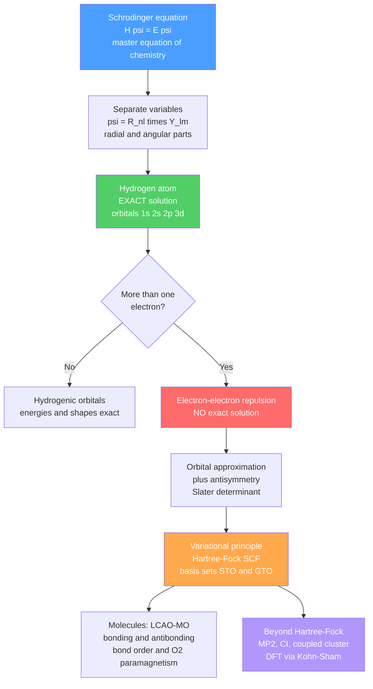

# 🌀 Quantum Chemistry and Atomic Orbitals

> [!abstract] TL;DR
> The **Schrödinger equation $\hat{H}\psi = E\psi$ is the master equation of chemistry**: in principle, every bond length, spectrum, and reaction energy is contained in its solutions. Born's rule says $|\psi|^2$ is a *probability density*, so an "orbital" is a standing-wave probability cloud, not a planetary orbit. The **hydrogen atom** is the one atom we can solve *exactly*, giving the familiar $1s, 2s, 2p, 3d\ldots$ orbitals as products of a radial part $R_{n\ell}(r)$ and an angular part $Y_\ell^m(\theta,\phi)$. Every other atom has the **electron–electron repulsion problem**, which forces approximations: the orbital approximation, antisymmetric **Slater determinants**, the **variational principle**, and the **Hartree–Fock** self-consistent field with **STO/GTO basis sets**. Bonding is handled by **molecular-orbital theory** (LCAO), and modern computation rests on **post-Hartree–Fock correlation** methods (MP2, CI, coupled cluster) and **Density Functional Theory** (Kohn–Sham), the workhorse of computational chemistry.

## Intuition — analogy FIRST

Think of a **guitar string**. Pluck it and it does not vibrate at just any frequency — only at the harmonics whose standing waves fit neatly between the fixed ends: one loop, two loops, three loops. The allowed notes are *quantized* purely because the wave has to fit the boundary.

An electron bound to a nucleus is exactly this idea in three dimensions. It is a **standing matter-wave**, and only certain wave patterns "fit" around the nucleus without destructively interfering with themselves. Each allowed pattern has a definite energy — that is why atoms have discrete energy levels — and **each pattern *is* an atomic orbital**. The places where the wave crosses zero are **nodes** (like the still points on a vibrating string). Squaring the wave's height at each point, $|\psi|^2$, tells you where the electron is *likely* to be found. The whole of quantum chemistry is the art of finding these standing waves when many electrons are pushing on each other at once.

---

## How It Works



---

## Key Concepts / Details

### Secondary Level

**Electrons are standing waves, not tiny planets.** The old Bohr picture of electrons circling the nucleus is wrong. An electron behaves like a wave (see [[Wave_Particle_Duality_and_Uncertainty]]), and only wave patterns that "fit" around the nucleus are allowed — this is why an atom's energy levels are discrete rather than continuous.

**An orbital is a probability cloud.** We cannot say *where* an electron is, only where it is *likely* to be. An **orbital** is a 3-D map of that probability. The shapes have names: **s** orbitals are spherical, **p** orbitals are dumbbells pointing along $x$, $y$, $z$, and **d** orbitals have four lobes.

**Quantum numbers label the orbitals.** Three integers describe each orbital: $n$ (shell, the energy/size), $\ell$ (subshell shape: $0=s$, $1=p$, $2=d$), and $m_\ell$ (orientation in space). A fourth, spin $m_s = \pm\tfrac12$, is why only **two** electrons fit per orbital (Pauli). This bookkeeping is exactly what generates the periodic table (see [[Atomic_Structure_and_Subatomic_Particles]]).

### Undergraduate Level

**The Schrödinger equation and Born's rule.** The time-independent equation for an electron in a potential $V$ is
$$\hat{H}\psi = E\psi, \qquad \hat{H} = -\frac{\hbar^2}{2m}\nabla^2 + V(\mathbf{r}).$$
Physical observables become **operators** (position $\hat{x}$, momentum $\hat{p} = -i\hbar\,\partial_x$); measurable values are the **eigenvalues** of $\hat A\psi = a\psi$; and averages are **expectation values** $\langle A\rangle = \int \psi^*\hat A\,\psi\,d\tau$. **Born's interpretation**: $|\psi(\mathbf r)|^2\,d^3r$ is the probability of finding the electron in the volume element $d^3r$, so $\psi$ must be normalized, $\int|\psi|^2\,d\tau = 1$.

**Particle in a box (the simplest quantized system).** For a particle confined to a 1-D box of length $L$ with infinite walls, fitting standing waves gives
$$E_n = \frac{n^2 h^2}{8mL^2}, \qquad n = 1,2,3,\dots$$
This toy model is genuinely useful: the $\pi$ electrons of a **conjugated dye** (polyenes, cyanines, $\beta$-carotene) roughly behave like electrons in a box the length of the conjugated chain. Longer chains → smaller level spacing → lower-energy (longer-wavelength) absorption — which is why long conjugation systems are colored.

**The hydrogen atom — the one exact solution.** With the Coulomb potential $V = -\,Ze^2/4\pi\varepsilon_0 r$, the spherical symmetry lets us **separate variables**:
$$\psi_{n\ell m}(r,\theta,\phi) = R_{n\ell}(r)\,Y_\ell^m(\theta,\phi).$$
The **energies** depend only on $n$:
$$E_n = -\frac{Z^2}{n^2}\,(13.606\ \text{eV}) = -\frac{Z^2}{2n^2}\ \text{Hartree}.$$
The angular parts $Y_\ell^m$ are the **spherical harmonics** (they set the $s/p/d$ shapes and their phases); the radial parts $R_{n\ell}$ control how the cloud extends from the nucleus. The **radial distribution function**
$$P(r) = r^2\,|R_{n\ell}(r)|^2$$
gives the probability of finding the electron *at radius $r$* (in any direction); it integrates to 1. The $r^2$ volume factor is why the $1s$ RDF peaks at the **Bohr radius $a_0$** even though $|\psi|^2$ itself is largest at the nucleus.

| Orbital | $R_{n\ell}(r)$ (Z=1, atomic units) | Radial nodes $=n-\ell-1$ | Angular nodes $=\ell$ |
|---------|-------------------------------------|:---:|:---:|
| $1s$ | $2e^{-r}$ | 0 | 0 |
| $2s$ | $\tfrac{1}{2\sqrt{2}}(2-r)\,e^{-r/2}$ | 1 | 0 |
| $2p$ | $\tfrac{1}{2\sqrt{6}}\,r\,e^{-r/2}$ | 0 | 1 |

Total nodes always equal $n-1$. The mathematical machinery (Laguerre and Legendre polynomials, angular momentum) connects to [[Angular_Momentum_and_Spin]] and to the [[Quantum_Harmonic_Oscillator]] as a companion exactly-solvable model.

**Many-electron atoms — the repulsion problem.** Add a second electron and the Hamiltonian gains a term $e^2/4\pi\varepsilon_0 r_{12}$ coupling the two electrons; the equation **no longer separates** and there is no closed-form solution. The **orbital approximation** pretends each electron moves in an average field, so the total wavefunction is a product of one-electron orbitals filled by Aufbau, Pauli, and Hund's rules. But electrons are **indistinguishable fermions**: the total wavefunction must be **antisymmetric** under exchange of any two electrons, which we enforce with a **Slater determinant**,
$$\Psi = \frac{1}{\sqrt{N!}}\det\big[\chi_i(\mathbf x_j)\big],$$
where $\chi_i$ are spin-orbitals. Swapping two rows flips the sign automatically, and two electrons in the same spin-orbital make two identical rows → determinant $=0$: **the Pauli principle falls out of antisymmetry**.

### Graduate Level

**The variational principle.** For *any* trial wavefunction $\phi$,
$$E[\phi] = \frac{\langle\phi|\hat H|\phi\rangle}{\langle\phi|\phi\rangle} \ge E_0,$$
so minimizing the energy over a family of trial functions gives a rigorous upper bound to the ground state. This is the engine behind almost every practical method.

**Hartree–Fock (HF) self-consistent field.** Restrict the trial wavefunction to a single Slater determinant and minimize. Each electron then feels the **mean field** of all the others through the **Fock operator**, whose eigenvalue problem
$$\hat F\,\chi_i = \varepsilon_i\,\chi_i$$
must be solved **self-consistently** (the field depends on the orbitals it produces — iterate to convergence). Antisymmetry produces a genuinely quantum **exchange** term with no classical analogue. HF is not exact: the difference from reality is the **correlation energy**,
$$E_{\text{corr}} = E_{\text{exact}} - E_{\text{HF}} < 0.$$

**Basis sets — STO vs GTO.** Orbitals are expanded in a finite set of basis functions. **Slater-type orbitals** $e^{-\zeta r}$ have the correct nuclear cusp and long-range decay but give painful multi-center integrals. **Gaussian-type orbitals** $e^{-\alpha r^2}$ are analytically convenient (products of Gaussians are Gaussians), so Boys' Gaussians won — real codes use **contracted Gaussians** (STO-3G, then split-valence 6-31G(d), correlation-consistent cc-pVXZ) that mimic STOs while keeping integrals cheap.

**Molecular orbital theory — LCAO.** Molecular orbitals are built as a **Linear Combination of Atomic Orbitals**, $\psi = \sum_i c_i\,\phi_i$. Inserting into the variational principle gives the **secular equations** and the condition
$$\det\big(H_{ij} - E\,S_{ij}\big) = 0,$$
where $H_{ij}=\langle\phi_i|\hat H|\phi_j\rangle$ and $S_{ij}=\langle\phi_i|\phi_j\rangle$ is the **overlap**. For $\text{H}_2^+$ two $1s$ orbitals combine in-phase (**bonding**, $\sigma$, lower energy, builds density between the nuclei) and out-of-phase (**antibonding**, $\sigma^\ast$, node between nuclei). Filling MOs for homonuclear diatomics gives the **bond order** $\tfrac12(n_{\text{bond}}-n_{\text{anti}})$ and famously explains **$\text{O}_2$ paramagnetism**: its two highest electrons singly occupy the degenerate $\pi^\ast_{2p}$ pair (see the MO diagram in [[Chemical_Bonding_and_Molecular_Geometry]]).

**Electron correlation — post-Hartree–Fock.** To recover $E_{\text{corr}}$, one goes beyond a single determinant:
- **MP2** — Møller–Plesset **perturbation theory** treats electron correlation as a perturbation on HF; cheap and popular but *not variational* (see [[Perturbation_Theory]]).
- **Configuration Interaction (CI)** — mix in excited determinants; variational but slow to converge; full CI is exact in a given basis but scales factorially.
- **Coupled Cluster CCSD(T)** — the "gold standard" of quantum chemistry, reaching ~1 kcal/mol thermochemical accuracy.

**Density Functional Theory (DFT).** The workhorse of modern computational chemistry replaces the $3N$-dimensional wavefunction with the **electron density $\rho(\mathbf r)$** (only 3 variables). The **Hohenberg–Kohn theorems** prove the ground-state energy is a *unique functional* of $\rho$. The **Kohn–Sham** scheme maps the interacting system onto a fictitious non-interacting one with the same density,
$$\Big(-\tfrac{\hbar^2}{2m}\nabla^2 + v_{\text{eff}}[\rho]\Big)\phi_i = \varepsilon_i\phi_i,$$
lumping all the hard many-body physics into the **exchange–correlation functional** $E_{\text{xc}}[\rho]$ (LDA, GGA/PBE, hybrids like B3LYP). DFT is the standard tool for molecules and materials — its many-body foundations connect to [[Many_Body_Quantum_Systems]], and the underlying wave equation to [[Schrodinger_Equation]].

---

```python
# Hydrogen radial distribution functions  P(r) = r^2 * |R_nl(r)|^2
# Uses the analytic hydrogenic radial functions in atomic units (a0 = 1, Z = 1)
import numpy as np
import matplotlib.pyplot as plt

r = np.linspace(0, 20, 800)  # radius in units of the Bohr radius a0

# Normalized hydrogenic radial functions R_nl(r), Z = 1, atomic units
R_1s = 2.0 * np.exp(-r)
R_2s = (1.0 / (2*np.sqrt(2))) * (2.0 - r) * np.exp(-r/2)
R_2p = (1.0 / (2*np.sqrt(6))) * r * np.exp(-r/2)

# Radial distribution function P(r) = r^2 * R^2 (integrates to 1 over r)
P_1s, P_2s, P_2p = r**2 * R_1s**2, r**2 * R_2s**2, r**2 * R_2p**2

# Sanity check: each P(r) should integrate to ~1 (normalization)
for name, P in [('1s', P_1s), ('2s', P_2s), ('2p', P_2p)]:
    print(f'{name}: integral of P(r) dr = {np.trapz(P, r):.4f}  (expect ~1)')

plt.figure(figsize=(8, 5))
plt.plot(r, P_1s, lw=2, label='1s  (peak at r = 1 a0, 0 radial nodes)')
plt.plot(r, P_2s, lw=2, label='2s  (1 radial node)')
plt.plot(r, P_2p, lw=2, label='2p  (0 radial nodes)')
plt.axvline(1.0, color='gray', ls=':', alpha=0.7)  # Bohr radius = 1s peak
plt.xlabel('Radius r  (Bohr radii, a0)')
plt.ylabel('Radial distribution  P(r) = r^2 |R(r)|^2')
plt.title('Hydrogen Radial Distribution Functions')
plt.legend()
plt.grid(True, alpha=0.3)
plt.xlim(0, 20)
plt.tight_layout()
plt.show()
```

---

## Real-World Notes

- **Color of conjugated dyes.** The particle-in-a-box model quantitatively predicts why cyanine dyes and carotenoids absorb visible light: longer conjugation → longer "box" → smaller HOMO–LUMO gap → red-shifted absorption. Chlorophyll's extended $\pi$ system harvesting sunlight is the same physics at work.
- **Computational drug and materials design.** Codes like Gaussian, ORCA, VASP, and Q-Chem solve the HF/DFT equations millions of times a day to predict reaction energies, spectra, catalyst mechanisms, and binding affinities *before* anything is synthesized.
- **Nobel-recognized methods.** The 1998 Chemistry Nobel went to **Walter Kohn** (DFT) and **John Pople** (computational quantum-chemical methods) — a rare recognition that these approximations became indispensable tools of the whole field.
- **Coupled cluster as the benchmark.** CCSD(T) at the complete-basis-set limit reaches "chemical accuracy" (~1 kcal/mol) and is used to calibrate cheaper DFT functionals and to fill gaps where experiment is hard.
- **Imaging orbitals.** Scanning tunneling microscopy and photoemission tomography now visualize molecular orbital densities directly, turning the once-abstract $|\psi|^2$ into laboratory images.
- **Semiconductor band structure.** The same Kohn–Sham machinery predicts the band gaps and electronic structure of solids, tying quantum chemistry to solid-state physics.

---

## Common Pitfalls

1. **Treating orbitals as physically real objects.** A one-electron orbital is a *construct of the orbital approximation*; for a many-electron atom the exact wavefunction is not a simple product of orbitals. Canonical HF orbitals (and especially Kohn–Sham orbitals) are auxiliary functions, not directly observable.
2. **Confusing $|\psi|^2$ with the radial distribution $P(r)$.** The $1s$ probability *density* $|\psi|^2$ is maximal **at the nucleus**, yet the *radial distribution* $P(r)=r^2|R|^2$ peaks at $r=a_0$ — because there is far more volume in a shell at larger $r$. Always ask "per unit volume" vs "per unit radius."
3. **Miscounting nodes.** Radial nodes $=n-\ell-1$, angular nodes $=\ell$, total $=n-1$. A $3s$ has 2 radial nodes; a $3d$ has 0. Nodes are where $\psi=0$ (a sign change), not merely where $|\psi|^2$ is small.
4. **Believing Hartree–Fock is exact.** Even at the complete-basis-set limit, HF misses the **correlation energy** by construction (single determinant, mean field). Bigger basis sets approach the *HF limit*, not the exact energy — basis-set incompleteness and correlation are two independent errors.
5. **Ignoring orbital phase.** Bonding vs antibonding is entirely about the **sign** of the combining orbitals (in-phase vs out-of-phase). Since $|\psi|^2$ discards the phase, reasoning only from probability densities will miss why bonds form.
6. **Assuming every method is variational.** CI and HF give rigorous upper bounds; **MP2 and coupled cluster are not variational** and can dip below the true energy — a common trap when comparing computed numbers.

---

## Related Concepts

- [[_MOC_Physical_Chemistry|↑ Section MOC]]
- [[Atomic_Structure_and_Subatomic_Particles]] — orbitals and quantum numbers are the rigorous version of the shell picture
- [[Chemical_Bonding_and_Molecular_Geometry]] — MO theory, hybridization, and O₂ paramagnetism built on these orbitals
- [[Molecular_Spectroscopy_and_Symmetry]] — orbital energies and symmetry set spectroscopic transitions and selection rules
- [[Chemical_Thermodynamics]] — computed electronic energies feed enthalpies and free energies
- [[Chemical_Kinetics]] — transition-state structures and barriers come from these electronic-structure calculations
- [[Chemical_Equilibrium]] — equilibrium constants trace back to computed free-energy differences
- [[Electrochemistry]] — redox potentials relate to orbital energies and ionization
- [[Phase_Equilibria_and_Colligative_Properties]] — intermolecular potentials ultimately derive from electronic structure
- [[Schrodinger_Equation]] — (Physics) the master wave equation whose solutions are the orbitals
- [[Wave_Particle_Duality_and_Uncertainty]] — (Physics) why electrons are standing waves at all
- [[Angular_Momentum_and_Spin]] — (Physics) the origin of $\ell$, $m$, spin, and Pauli antisymmetry
- [[Quantum_Harmonic_Oscillator]] — (Physics) companion exactly-solvable model; basis for vibrations
- [[Perturbation_Theory]] — (Physics) foundation of MP2 and correlation corrections
- [[Many_Body_Quantum_Systems]] — (Physics) the interacting-electron problem behind HF and DFT
- [[_MOC_Mathematics_Master]] — (Math) linear algebra, eigenvalue problems, and special functions behind it all

---

## Review Questions

1. **Secondary:** Using the guitar-string analogy, explain why an electron in an atom can only have certain energies. What does an "orbital" actually represent, and why can it hold at most two electrons?
2. **Undergraduate:** For the hydrogen $3s$ orbital, state the number of radial nodes, angular nodes, and total nodes. Then explain why the radial distribution function $P(r)=r^2|R|^2$ for $1s$ peaks at $r=a_0$ even though $|\psi|^2$ is maximal at the nucleus.
3. **Graduate:** Define the correlation energy and explain why Hartree–Fock cannot capture it. Compare how MP2, CCSD(T), and Kohn–Sham DFT attempt to recover it, and state for each whether it is variational and roughly how it scales with system size.

---

## Sources

- Atkins & Friedman — *Molecular Quantum Mechanics*, 5th ed.
- Levine — *Quantum Chemistry*, 7th ed.
- Szabo & Ostlund — *Modern Quantum Chemistry* (Hartree–Fock and post-HF)
- Griffiths — *Introduction to Quantum Mechanics* (hydrogen atom, Ch. 4)
- Parr & Yang — *Density-Functional Theory of Atoms and Molecules*
- Hohenberg & Kohn (1964) *Phys. Rev.* 136, B864; Kohn & Sham (1965) *Phys. Rev.* 140, A1133

#chemistry #physicalchemistry #quantumchemistry #atomicorbitals #hartreefock #DFT #molecularorbitals #undergraduate #graduate
