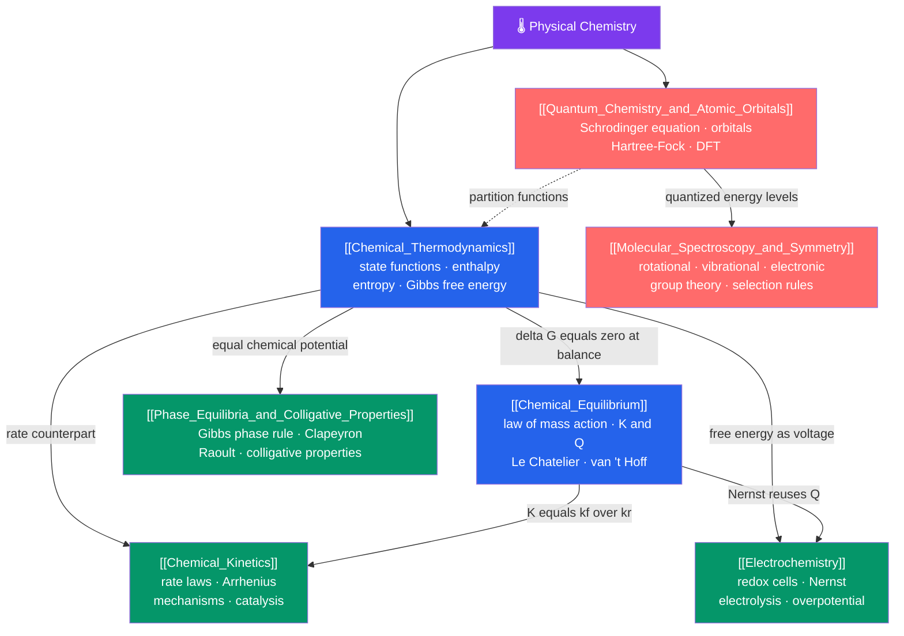

# 🌡️ Physical Chemistry — Map of Content

> [!abstract] What This Section Covers
> Physical chemistry is the *why* behind chemistry — it explains whether a reaction can happen, how fast it goes, where it stops, and what matter is made of at the quantum level. This section runs from the macroscopic laws of energy and change ([[Chemical_Thermodynamics|thermodynamics]], [[Chemical_Equilibrium|equilibrium]], [[Chemical_Kinetics|kinetics]]) through their applied readouts ([[Electrochemistry|electrochemistry]], [[Phase_Equilibria_and_Colligative_Properties|phase behaviour and solutions]]) down to the microscopic foundation ([[Quantum_Chemistry_and_Atomic_Orbitals|quantum chemistry]] and [[Molecular_Spectroscopy_and_Symmetry|spectroscopy]]). Each note opens with an everyday analogy at secondary level and deepens to graduate formalism — chemical potentials, van 't Hoff analysis, Butler–Volmer kinetics, Hartree–Fock/DFT, and group-theoretic selection rules.

## Concept Map

*(Blue = macroscopic foundation, Green = applied consequences, Red = microscopic/quantum layer; solid arrows = "leads to / requires", dashed = "feeds")*

## Learning Path

*Recommended order for a first pass — the classic physical-chemistry track from energy to structure:*

1. [[Chemical_Thermodynamics]] — start here: state functions, enthalpy, entropy, and the Gibbs criterion $\Delta G < 0$ for spontaneity.
2. [[Chemical_Equilibrium]] — where a reversible reaction stops; $\Delta G^\circ = -RT\ln K$ ties $K$ directly to thermodynamics.
3. [[Chemical_Kinetics]] — the missing dimension of *time*: rate laws, the Arrhenius barrier, mechanisms, and catalysis.
4. [[Electrochemistry]] — free energy read out as voltage, $\Delta G = -nFE$, the Nernst equation, and electrolysis.
5. [[Phase_Equilibria_and_Colligative_Properties]] — equality of chemical potentials sets phase boundaries and the four colligative effects.
6. [[Quantum_Chemistry_and_Atomic_Orbitals]] — the microscopic root: the Schrödinger equation, orbitals, Hartree–Fock, and DFT.
7. [[Molecular_Spectroscopy_and_Symmetry]] — measuring those quantized levels with light, decoded by group theory and selection rules.

## All Notes at a Glance

| Note | Core Idea | Difficulty |
|------|-----------|------------|
| [[Chemical_Thermodynamics]] | State functions and Gibbs free energy predict *whether* a reaction is spontaneous; $\Delta G^\circ = -RT\ln K$ | Secondary → Graduate |
| [[Chemical_Equilibrium]] | Dynamic equilibrium, the law of mass action ($K$, $Q$), Le Chatelier, $K_{sp}$, and van 't Hoff | Secondary → Graduate |
| [[Chemical_Kinetics]] | *How fast* and *by what path* — rate laws, Arrhenius, transition-state theory, mechanisms, catalysis | Secondary → Graduate |
| [[Electrochemistry]] | Electron transfer as usable voltage — galvanic/electrolytic cells, Nernst, Faraday's laws, Butler–Volmer | Secondary → Graduate |
| [[Quantum_Chemistry_and_Atomic_Orbitals]] | The Schrödinger equation as chemistry's master equation — orbitals, Hartree–Fock, MO theory, DFT | Undergraduate → Graduate |
| [[Molecular_Spectroscopy_and_Symmetry]] | Reading quantized energy ladders with light; symmetry and group theory decide the selection rules | Undergraduate → Graduate |
| [[Phase_Equilibria_and_Colligative_Properties]] | Equal chemical potentials, the Gibbs phase rule, Clausius–Clapeyron, and the four colligative properties | Secondary → Graduate |

## Key Questions This Section Answers

- Why is a reaction spontaneous — and why does "spontaneous" say nothing about how *fast* it goes?
- What single equation links free energy, the equilibrium constant, and cell voltage?
- How do you turn a proposed reaction mechanism into a testable rate law?
- Why does salt de-ice roads and why does ice float — and what do both have to do with chemical potential?
- What *is* an atomic orbital, and why can we only solve one atom exactly?
- How does a molecule's symmetry decide, before any experiment, which spectral lines it is even capable of showing?

## Connections to Other Topics

- [[_MOC_Chemistry_Master|↑ Chemistry Master MOC]]
- [[_MOC_General_Chemistry|→ General & Foundational Chemistry]] — atomic structure, bonding, gas laws, solutions, and acid–base basics feed straight into this section
- [[Acids_Bases_and_pH]] — $K_a$/$K_b$ chemistry is applied [[Chemical_Equilibrium|equilibrium]]
- [[Analytical_Statistics_and_Electroanalysis]] — voltammetry and potentiometry build on [[Electrochemistry|electrode kinetics]]
- [[UV_Vis_and_IR_Spectroscopy]] · [[NMR_Spectroscopy]] — instrumental deep dives on the [[Molecular_Spectroscopy_and_Symmetry|spectroscopy]] fundamentals here
- [[_MOC_Physics_Master|→ Physics]] — [[Laws_of_Thermodynamics]], [[Entropy_and_Second_Law]], the [[Schrodinger_Equation]], and [[Kinetic_Theory_of_Gases]] are the physical parents of this section

#MOC #Chemistry #PhysicalChemistry
