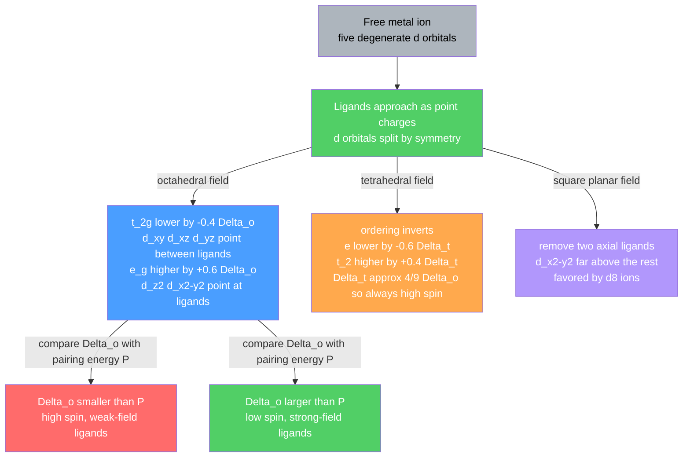

# 💠 Coordination Chemistry and Ligand Field Theory

> [!abstract] TL;DR
> A **coordination compound** is a central metal ion (a Lewis acid) surrounded by **ligands** (Lewis bases) bound through dative bonds, in a fixed geometry set by the **coordination number** (2 linear, 4 tetrahedral or square planar, 6 octahedral). Werner's theory separated *primary valence* (oxidation state) from *secondary valence* (coordination number) and explained isomerism. **Crystal Field Theory (CFT)** treats ligands as point charges that split the five degenerate $d$ orbitals — into $t_{2g}$ (lower) and $e_g$ (upper) by $\Delta_o$ in an octahedron, inverted and smaller ($\Delta_t \approx \tfrac{4}{9}\Delta_o$) in a tetrahedron. Comparing $\Delta$ with the pairing energy $P$ gives **high-spin vs low-spin**; the resulting **CFSE**, the **spectrochemical series**, and $d$–$d$ transitions explain the **color** and **magnetism** ($\mu = \sqrt{n(n+2)}$ BM) of transition-metal complexes. **Ligand Field Theory (LFT)** upgrades CFT to a molecular-orbital picture with $\sigma$-donation and $\pi$ back-bonding, and — with term symbols and Tanabe–Sugano diagrams — quantitatively predicts spectra.

## Intuition — analogy FIRST

Picture the metal ion as a chandelier hub and the five $d$ orbitals as five lightbulbs pointing in different directions. Now bring six people (ligands) toward the hub along the $x$, $y$, $z$ axes, each carrying a bright electron-lantern. Bulbs that point **straight at** an incoming lantern get dazzled — pushed to *higher* energy (these are $d_{z^2}$ and $d_{x^2-y^2}$, the $e_g$ set). Bulbs that point **into the gaps between** lanterns are left alone at *lower* energy (the $t_{2g}$ set: $d_{xy}, d_{xz}, d_{yz}$). That single geometric fact — *which orbitals point at the ligands* — is the whole engine of crystal field theory. Change the arrangement (tetrahedron, square) and the "who gets dazzled" bookkeeping changes, and with it the color, the magnetism, and the shape of the complex.

---

## How It Works



---

## Key Concepts / Details

### Secondary Level

**Werner's coordination theory (1893).** Alfred Werner explained why $\text{CoCl}_3 \cdot 6\text{NH}_3$ behaves so differently from a simple salt. He proposed two valences: a **primary valence** (the oxidation state, neutralized by counter-ions) and a **secondary valence** (the coordination number, satisfied by ligands held in a *fixed spatial arrangement*). The metal is an electron-pair acceptor; each ligand donates a lone pair to form a **coordinate (dative) bond**. Werner won the 1913 Nobel Prize for this.

**Coordination number and geometry.** The number of donor atoms directly bonded to the metal sets the shape:

| Coord. number | Geometry | Example |
|---|---|---|
| 2 | Linear | $[\text{Ag(NH}_3)_2]^+$ |
| 4 | Tetrahedral | $[\text{CoCl}_4]^{2-}$ |
| 4 | Square planar | $[\text{Ni(CN)}_4]^{2-}$, $d^8$ |
| 6 | Octahedral (most common) | $[\text{Co(NH}_3)_6]^{3+}$ |

**Ligands and chelates.** Monodentate ligands ($\text{NH}_3$, $\text{H}_2\text{O}$, $\text{Cl}^-$, $\text{CN}^-$) bind through one atom. **Polydentate** (chelating) ligands grip through several — ethylenediamine "en" (bidentate), oxalate (bidentate), EDTA (hexadentate) — wrapping the metal like a claw ("chele" = claw). Complexes are typically **colored** and often **magnetic** because they contain partly filled $d$ orbitals; the rest of this note explains exactly why.

### Undergraduate Level

**IUPAC nomenclature.** Name the cation before the anion. Inside a complex: ligands in *alphabetical order* (by ligand name, ignoring multiplying prefixes), then the metal with its oxidation state in Roman numerals. Anionic ligands take an `-o` ending (chlorido, cyanido, hydroxido, oxalato — 2005 IUPAC uses `-ido`); neutral ligands keep special names (**aqua** = $\text{H}_2\text{O}$, **ammine** = $\text{NH}_3$, **carbonyl** = CO). Use *di/tri* for simple ligands, *bis/tris* for complex ones. If the whole complex is an anion, the metal name ends in `-ate` (ferrate, cuprate, platinate).

- $[\text{Co(NH}_3)_5\text{Cl}]\text{Cl}_2$ → **pentaamminechloridocobalt(III) chloride**
- $K_4[\text{Fe(CN)}_6]$ → **potassium hexacyanidoferrate(II)**

**Isomerism.**
- *Structural* — **linkage** (ambidentate ligand binds through a different atom: $\text{NO}_2^-$ nitrito-N vs nitrito-O; $\text{SCN}^-$); **ionization** ($[\text{Co(NH}_3)_5\text{Br}]\text{SO}_4$ vs $[\text{Co(NH}_3)_5\text{SO}_4]\text{Br}$); **coordination** (ligands swapped between a complex cation and complex anion).
- *Stereo* — **geometric** cis/trans (and *fac/mer* for $MA_3B_3$ octahedra); **optical** enantiomers $\Delta$/$\Lambda$ for tris-chelate complexes such as $[\text{Co(en)}_3]^{3+}$, which are non-superimposable mirror images.

**The chelate effect.** A chelating ligand forms a *more stable* complex than the equivalent number of monodentate ligands. It is largely **entropic**: replacing six bound $\text{H}_2\text{O}$ with three bidentate "en" molecules *increases* the number of free particles, so $\Delta S > 0$ and, via $\Delta G = \Delta H - T\Delta S$, drives the equilibrium. Thus $[\text{Ni(en)}_3]^{2+}$ is far more stable than $[\text{Ni(NH}_3)_6]^{2+}$ despite similar Ni–N bonds.

**Crystal Field Theory — orbital splitting.** Ligand point charges destabilize $d$ orbitals unequally while conserving the **barycenter** (center of gravity):

$$\text{Octahedral: } E(e_g) = +0.6\,\Delta_o, \qquad E(t_{2g}) = -0.4\,\Delta_o \quad (2 \times 0.6 = 3 \times 0.4)$$

- **Tetrahedral:** no orbital points directly at a ligand, so splitting is *inverted and small*, $\Delta_t \approx \tfrac{4}{9}\Delta_o$; tetrahedral complexes are therefore **almost always high-spin**.
- **Square planar:** remove the two axial ligands of an octahedron; the ordering becomes $d_{xz},d_{yz} < d_{z^2} < d_{xy} \ll d_{x^2-y^2}$. The very large top gap makes square planar the preferred geometry for $d^8$ ions ($\text{Ni}^{2+}$, $\text{Pd}^{2+}$, $\text{Pt}^{2+}$, $\text{Au}^{3+}$).

**High-spin vs low-spin and CFSE.** Fill $d$ electrons by comparing $\Delta$ with the **pairing energy** $P$. If $\Delta < P$ (weak field) electrons spread out singly → **high-spin**; if $\Delta > P$ (strong field) they pair in the lower set → **low-spin**. This only matters for $d^4$–$d^7$ octahedra. The **Crystal Field Stabilization Energy** is $\text{CFSE} = [-0.4\,n_{t_{2g}} + 0.6\,n_{e_g}]\,\Delta_o$ (plus $mP$ for extra pairs formed):

| $d^n$ | HS $(t_{2g}, e_g)$ | CFSE (HS) | $n_{unp}$ | LS $(t_{2g}, e_g)$ | CFSE (LS) | $n_{unp}$ |
|---|---|---|---|---|---|---|
| $d^1$ | (1,0) | $-0.4\,\Delta_o$ | 1 | same | — | 1 |
| $d^2$ | (2,0) | $-0.8\,\Delta_o$ | 2 | same | — | 2 |
| $d^3$ | (3,0) | $-1.2\,\Delta_o$ | 3 | same | — | 3 |
| $d^4$ | (3,1) | $-0.6\,\Delta_o$ | 4 | (4,0) | $-1.6\,\Delta_o + P$ | 2 |
| $d^5$ | (3,2) | $0$ | 5 | (5,0) | $-2.0\,\Delta_o + 2P$ | 1 |
| $d^6$ | (4,2) | $-0.4\,\Delta_o$ | 4 | (6,0) | $-2.4\,\Delta_o + 2P$ | 0 |
| $d^7$ | (5,2) | $-0.8\,\Delta_o$ | 3 | (6,1) | $-1.8\,\Delta_o + P$ | 1 |
| $d^8$ | (6,2) | $-1.2\,\Delta_o$ | 2 | same | — | 2 |
| $d^9$ | (6,3) | $-0.6\,\Delta_o$ | 1 | same | — | 1 |
| $d^{10}$ | (6,4) | $0$ | 0 | same | — | 0 |

**Spectrochemical series** (weak-field → strong-field, increasing $\Delta$):
$$\text{I}^- < \text{Br}^- < \text{Cl}^- < \text{F}^- < \text{OH}^- < \text{H}_2\text{O} < \text{NH}_3 < \text{en} < \text{NO}_2^- < \text{CN}^- \approx \text{CO}$$
$\Delta$ also grows with metal oxidation state and *down* a group ($3d < 4d < 5d$), which is why $4d$/$5d$ complexes are almost always low-spin.

**Color and magnetism.** A $d$–$d$ transition promotes an electron across the gap, absorbing a photon of energy $\Delta = hc/\lambda$; the eye sees the **complementary color**. $[\text{Ti(H}_2\text{O})_6]^{3+}$ ($d^1$) absorbs green–yellow and looks violet. Larger $\Delta$ (stronger-field ligand) → shorter absorbed wavelength. $d^0$ and $d^{10}$ ions have no $d$–$d$ transition and are colorless. Magnetism follows the **spin-only** formula:
$$\mu = \sqrt{n(n+2)}\ \text{BM}, \quad n = \text{unpaired electrons} \;\Rightarrow\; 0,\,1.73,\,2.83,\,3.87,\,4.90,\,5.92\ \text{for } n=0\ldots5$$

**Jahn–Teller distortion.** Any non-linear complex in an orbitally **degenerate** ground state distorts to lift the degeneracy and lower its energy. It is strongest for uneven $e_g$ occupation — $d^9$ ($\text{Cu}^{2+}$), high-spin $d^4$ ($\text{Cr}^{2+}$, $\text{Mn}^{3+}$) — giving tetragonal elongation: $[\text{Cu(H}_2\text{O})_6]^{2+}$ has two long axial bonds and four short equatorial ones.

### Graduate Level

**Ligand Field Theory (the MO upgrade).** CFT's point-charge model cannot explain why *neutral* CO outranks *anionic* $\text{I}^-$. LFT builds molecular orbitals from metal $d/s/p$ and ligand symmetry-adapted orbitals (SALCs):
- **$\sigma$-donation:** ligand lone pairs go into the $e_g^{\*}$ set, which becomes $\sigma$-antibonding — this *is* the origin of $\Delta_o$.
- **$\pi$-donor ligands** (halides, $\text{O}^{2-}$, OH$^-$) push filled $p/\pi$ density into $t_{2g}$, raising it → **smaller $\Delta_o$** (weak field).
- **$\pi$-acceptor ligands** (CO, $\text{CN}^-$, bipy) accept metal $t_{2g}$ density into empty $\pi^{\*}$ (**back-bonding**), lowering $t_{2g}$ → **larger $\Delta_o$** (strong field).

This $\pi$ picture reproduces the entire spectrochemical series that pure electrostatics gets wrong.

**Term symbols and Tanabe–Sugano diagrams.** Free-ion Russell–Saunders ground terms are $^2D\,(d^1,d^9)$, $^3F\,(d^2,d^8)$, $^4F\,(d^3,d^7)$, $^5D\,(d^4,d^6)$, $^6S\,(d^5)$. An octahedral field splits these (e.g. $^3F \to {}^3\!A_{2g} + {}^3T_{2g} + {}^3T_{1g}$). **Tanabe–Sugano diagrams** plot term energies $E/B$ against field strength $\Delta_o/B$ (in units of the **Racah parameter** $B$, which measures interelectron repulsion). Reading a complex's $d$–$d$ band energies off the diagram lets you extract *both* $\Delta_o$ and $B$; for $d^4$–$d^7$ a vertical discontinuity marks the high-spin/low-spin crossover.

**Nephelauxetic effect.** In a complex $B < B_{\text{free ion}}$ ("cloud expanding"): covalent delocalization onto ligands reduces $d$–$d$ repulsion. The ratio $\beta = B_{\text{complex}}/B_{\text{free ion}} < 1$ measures covalency, with a nephelauxetic series $\text{F}^- > \text{H}_2\text{O} > \text{NH}_3 > \text{Cl}^- > \text{CN}^- > \text{Br}^- > \text{I}^-$.

**Charge-transfer bands and selection rules.** $d$–$d$ bands are Laporte-forbidden ($g \to g$) and often spin-forbidden, so they are *weak* ($\varepsilon \sim 1$–$100$). **Charge-transfer** bands — LMCT (e.g. intensely purple $\text{MnO}_4^-$) and MLCT (e.g. $[\text{Fe(bipy)}_3]^{2+}$) — are fully allowed and *intense* ($\varepsilon \sim 10^3$–$10^4$). Vibronic coupling relaxes the Laporte rule, giving octahedral complexes their pale color. These selection-rule arguments connect directly to [[Molecular_Spectroscopy_and_Symmetry]].

---

```python
# CFSE (in units of Delta_o) and spin-only magnetic moment for octahedral d^n complexes.
# t2g electrons contribute -0.4 Delta_o each; e_g electrons contribute +0.6 Delta_o each.
import math

def fill(n, low_spin):
    """Occupy 5 d orbitals (0,1,2 = t2g ; 3,4 = e_g) for d^n, high- or low-spin."""
    orb = [0] * 5
    order_ls = [0, 1, 2, 0, 1, 2, 3, 4, 3, 4]   # low-spin: pair t2g before touching e_g
    order_hs = [0, 1, 2, 3, 4, 0, 1, 2, 3, 4]   # high-spin: one per orbital (Hund), then pair
    order = order_ls if low_spin else order_hs
    for i in range(n):
        orb[order[i]] += 1
    t2g, eg = sum(orb[:3]), sum(orb[3:])
    unpaired = sum(1 for x in orb if x == 1)
    return t2g, eg, unpaired

print(f"{'d^n':>4} {'HS CFSE/Do':>11} {'HS n_unp':>9} {'LS CFSE/Do':>11} {'LS n_unp':>9}")
for n in range(1, 11):
    t_hs, e_hs, u_hs = fill(n, low_spin=False)
    t_ls, e_ls, u_ls = fill(n, low_spin=True)
    cfse_hs = -0.4 * t_hs + 0.6 * e_hs
    cfse_ls = -0.4 * t_ls + 0.6 * e_ls
    print(f"{n:>4} {cfse_hs:>11.1f} {u_hs:>9} {cfse_ls:>11.1f} {u_ls:>9}")

# Spin-only magnetic moment: mu = sqrt(n(n+2)) Bohr magnetons
print("\nSpin-only magnetic moments (Bohr magnetons):")
for nu in range(0, 6):
    print(f"  {nu} unpaired e-: mu = {math.sqrt(nu * (nu + 2)):.2f} BM")
# d4-d7 show distinct HS/LS CFSE; d1-d3 and d8-d10 are identical either way.
```

---

## Real-World Notes

- **Hemoglobin and myoglobin.** An Fe(II) center in a tetradentate porphyrin ring binds $\text{O}_2$ reversibly at its sixth octahedral site. CO is toxic because it $\pi$-back-bonds far more strongly than $\text{O}_2$ and blocks the site — a direct consequence of the spectrochemical ordering.
- **Cisplatin.** The anticancer drug *cis*-$[\text{PtCl}_2(\text{NH}_3)_2]$ is a square-planar $d^8$ Pt(II) complex; only the **cis** geometric isomer binds DNA (guanine N7) and works — *trans* is inactive. A textbook case of stereoisomerism mattering.
- **Chlorophyll and vitamin B12.** Photosynthesis runs on a $\text{Mg}^{2+}$–chlorin complex; B12 is a $\text{Co}$–corrin macrocycle — biology's mastery of coordination chemistry.
- **EDTA and chelation.** Hexadentate EDTA sequesters metal ions via the chelate effect: it softens hard water, stabilizes foods, and treats heavy-metal ($\text{Pb}^{2+}$) poisoning.
- **Gemstone color.** Ruby and emerald are both $\text{Cr}^{3+}$ impurities in different hosts; the host changes $\Delta_o$, shifting the $d$–$d$ absorption and turning the same ion red or green.
- **MRI contrast and spin-crossover.** $\text{Gd}^{3+}$ chelates (Gd-DTPA) exploit high unpaired-electron count for MRI; complexes tuned so $\Delta_o \approx P$ switch spin state with temperature or light, a basis for molecular sensors and memory.

---

## Common Pitfalls

1. **Confusing oxidation state with coordination number.** Werner's primary vs secondary valence are independent: $[\text{Co(NH}_3)_6]^{3+}$ is Co(III) *and* coordination number 6 — different quantities.
2. **Applying low-spin to tetrahedral complexes.** Because $\Delta_t \approx \tfrac{4}{9}\Delta_o$ is tiny, it essentially never exceeds $P$; tetrahedral complexes are treated as high-spin by default.
3. **Thinking CFSE alone decides high- vs low-spin.** It does not — you must compare $\Delta$ with $P$, and the net energy of a low-spin state carries a $+mP$ pairing penalty that can outweigh the extra orbital stabilization.
4. **"The color comes from the ligand."** Color arises from $d$–$d$ (or charge-transfer) *transitions* whose energy equals $\Delta$; the observed hue is the **complement** of the absorbed wavelength, not the ligand's own color.
5. **Expecting CFT to reproduce the spectrochemical series.** Pure electrostatics wrongly puts anions above neutrals; you need LFT $\pi$-donor/acceptor back-bonding to rank $\text{CO} > \text{I}^-$.
6. **Over-trusting the spin-only formula.** $\mu = \sqrt{n(n+2)}$ works well for first-row $3d$ ions (quenched orbital angular momentum) but fails for many $4d/5d$ ions and lanthanides, where orbital contributions matter.

---

## Related Concepts

- [[_MOC_Inorganic_Chemistry|↑ Section MOC]]
- [[Transition_Metals_and_the_d_Block]] — the variable $d$-electron counts and oxidation states that CFT partitions into $t_{2g}$/$e_g$
- [[Periodic_Trends_and_Main_Group_Chemistry]] — electronegativity, size, and charge that set metal–ligand bond character
- [[Solid_State_and_Crystal_Structures]] — CFT extended to ions in extended lattices, spinel site preferences, and colored minerals
- [[Inorganic_Acids_Bases_and_Redox]] — the metal–ligand bond as a Lewis acid–base adduct; redox tuning of $\Delta$
- [[Organometallic_and_Bioinorganic_Chemistry]] — $\pi$-back-bonding, the 18-electron rule, and metalloprotein active sites
- [[Molecular_Spectroscopy_and_Symmetry]] — Laporte/spin selection rules, $d$–$d$ vs charge-transfer bands, symmetry labels
- [[Quantum_Chemistry_and_Atomic_Orbitals]] — the $d$-orbital wavefunctions whose spatial shapes drive the splitting
- [[Angular_Momentum_and_Spin]] — (Physics) spin/orbital angular momentum behind term symbols and magnetism
- [[Atomic_Models_and_Spectroscopy]] — (Physics) electronic transitions and spectral lines
- [[Schrodinger_Equation]] — (Physics) the central-field problem that yields the five degenerate $d$ orbitals
- [[_MOC_Mathematics_Master]] — (Math) group theory and linear algebra behind symmetry-adapted orbitals

---

## Review Questions

1. **Secondary:** For $[\text{Co(NH}_3)_6]^{3+}$, state the oxidation state of cobalt, the coordination number, the geometry, and the IUPAC-style name of the ion. In one sentence, say why the complex is colored.
2. **Undergraduate:** Compare $[\text{Fe(H}_2\text{O})_6]^{2+}$ and $[\text{Fe(CN)}_6]^{4-}$. Using the spectrochemical series, predict for each: high- or low-spin, number of unpaired electrons, spin-only moment $\mu$, and which absorbs the *shorter*-wavelength light. Justify with $\Delta_o$ vs $P$.
3. **Graduate:** Using the LFT molecular-orbital picture, explain why $\text{CO}$ and $\text{CN}^-$ sit at the strong-field end of the spectrochemical series while $\text{I}^-$ sits at the weak-field end — a result crystal field theory cannot reproduce. Then describe how a Tanabe–Sugano diagram together with the nephelauxetic parameter $\beta$ lets you extract both $\Delta_o$ and the Racah $B$ from a UV-vis spectrum.

---

## Sources

- Miessler, Fischer & Tarr — *Inorganic Chemistry*, coordination chemistry, CFT & LFT chapters
- Housecroft & Sharpe — *Inorganic Chemistry*, d-block and ligand field chapters
- Weller, Overton, Rourke & Armstrong — *Inorganic Chemistry* (Shriver & Atkins)
- Cotton & Wilkinson — *Advanced Inorganic Chemistry*
- Figgis & Hitchman — *Ligand Field Theory and Its Applications*
- Tanabe, Y. & Sugano, S. (1954) — *J. Phys. Soc. Japan* 9, 753 (Tanabe–Sugano diagrams)

#chemistry #inorganicchemistry #coordinationchemistry #crystalfieldtheory #ligandfieldtheory #CFSE #spectrochemicalseries #JahnTeller #undergraduate #graduate
